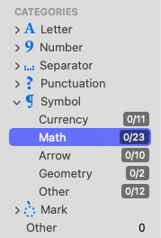
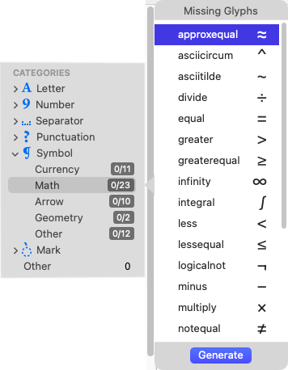
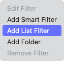
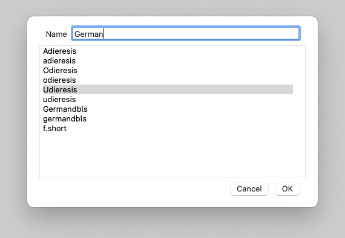
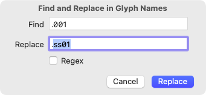
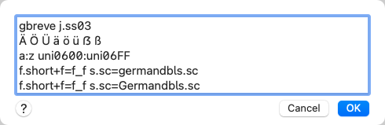
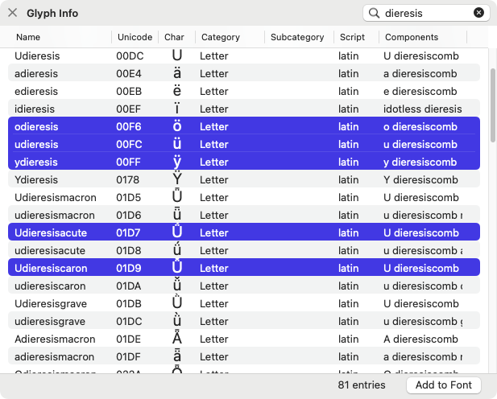
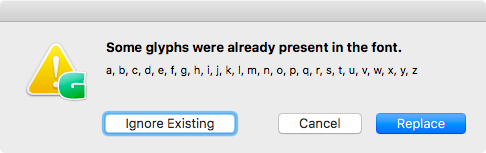
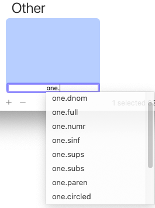
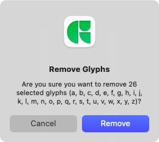

原文: [Adding glyphs to your font](https://glyphsapp.com/learn/adding-glyphs-to-your-font)
# フォントにグリフを追加する

チュートリアル

[ Languages ](https://glyphsapp.com/learn?q=languages)

執筆者: Rainer Erich Scheichelbauer

[ en ](https://glyphsapp.com/learn/adding-glyphs-to-your-font) [ fr
](https://glyphsapp.com/fr/learn/adding-glyphs-to-your-font) [ zh
](https://glyphsapp.com/zh/learn/adding-glyphs-to-your-font)

2021年11月10日更新（初版公開：2016年11月9日）

フォントに新しいグリフを追加する方法はいくつかあります。ここでは、その便利な方法をまとめて紹介します。

## サイドバーから追加する

新しいグリフを追加するのに最も良い方法は、おそらく「フォント」タブのサイドバーにあるリストやカテゴリーを使うことでしょう。カテゴリー、言語、フィルタの一部の項目には数字のバッジが表示されており、そのグループのグリフがフォント内にいくつ存在し、全体でいくつあるのかを示しています。例えば、_8/24_ は、このグループに24個のグリフがあり、そのうち8個がすでにフォント内に存在することを意味します。



これらの数字バッジ付きの項目を右クリックすると、そのグループに登録されてはいるものの、まだフォントに存在しないグリフの名前のリストが表示されます。任意のグリフ、または複数のグリフ（クリック＆ドラッグ、またはShiftキーかCmdキーを押しながらクリック）を選択するか、Cmd-Aですべてを選択します。そして、「Generate」ボタンをクリックするかReturnキーを押すと、それらのグリフがフォントに追加されます。



グループには、カテゴリー、言語、フィルタの3種類があります。

*   _カテゴリー_（文字、合字、数字など）は、主に「フォント」タブに表示される内容を絞り込むためのものです。一部には数字のバッジが付いており、右クリックで不足しているグリフを追加できます。
*   _言語_は、特定の言語や言語グループ、あるいは書記体系全体をカバーするのに十分なグリフがあるかどうかを管理するのに役立ちます。技術的または言語的な理由から意味のあるサブグループが含まれていることがよくあります。ほとんどすべての言語グループに数字のバッジが付いています。
*   そして一番下には、カスタマイズ可能な_フィルタ_があります。_スマートフィルタ_と_リストフィルタ_があります。後者はグリフ名の単純なリストで、数字のバッジが付いています。

_カテゴリー_と_言語_はあらかじめ定義されていますが、[サイドバーに独自の項目を追加する](custom-sidebar-entries-in-font-view.md)こともできます。_リストフィルタ_は簡単に作成できます。左下のアクションメニューをクリックし、「リストフィルタを追加」を選択します。



表示されるダイアログで、リストフィルタの名前を決め、1行に1つずつグリフ名を追加します。



グリフを選択した状態でこの操作を行うと、Glyphsはそのグリフの名前をダイアログに自動的に入力してくれます（もちろん、グリフを選択していた場合です）。グリフ名を選ぶ際は、[有効なグリフ名であることを確認してください](getting-your-glyph-names-right.md)。

これらのサイドバー項目の共通の利点は、すべてのGlyphsファイルで利用できることです。言い換えれば、一貫したグリフセットを持つフォントを作成したり、複数のファイル間でグリフセットを同期させたりするのに役立ちます。

## グリフバリエーションを追加する

代替グリフは、元のグリフと同じ名前に、ドット（.）で始まる接尾辞を追加した名前を持つことになっています。グリフのバリエーションには通常Unicode値が割り当てられていないため、キーボードから入力することはできません。そのため、例えば[スタイルセット](stylistic-sets.md)のようなOpenType機能を通じてアクセスする必要があります。ドット接尾辞は通常、OpenType機能の名前を反映しています。例えば、`adieresis`の最初のスタイルセットバリエーションは、`adieresis.ss01`という名前になります。

### ヒント
Glyphsは、グリフ名の接尾辞に基づいて一部のOpenType機能のコードを自動化できます。対応する機能の完全なリストとその利用方法については、[Glyphsハンドブック](/learn)の付録を参照してください。

グリフバリエーションを素早く作成する方法は、編集ビューまたはフォントビューで1つ以上のグリフを選択し、「グリフ > グリフを複製（Glyph > Duplicate Glyph）」（Cmd-D）を選択することです。するとGlyphsは、選択されたグリフのコピーを`.001`という接尾辞付きで作成します。その接尾辞が既に使用されている場合は、`.002`といったように連番が続きます。作成後、複製されたグリフは自動的に選択され、すぐに次の作業に移れます。

新しく複製されたグリフの接尾辞を素早く変更するには、選択状態を維持したまま、「編集 > 検索 > 検索と置換…（Edit > Find > Find and Replace…）」（Cmd-Shift-F）を選択します。ダイアログで、複製グリフの接尾辞（例：`.001`）を検索し、目的の接尾辞に置き換えます。



多くのグリフを一度にリネームする方法については、[一括リネーム](batch-renaming.md)のチュートリアルで詳しく説明しています。

## _Add Glyphs_ダイアログ

「グリフ > グリフを追加…（Glyph > Add Glyphs …）」（Cmd-Shift-G）を選択すると、多目的なテキスト入力フィールドを持つダイアログが表示されます。ここに、様々な方法で任意の数のグリフを追加できます。

*   ペーストまたは入力した文字（区切り文字としてスペース、改行、タブを使用）：`Ä Ö Ü ä ö ü ẞ ß`
*   グリフ名：`a.ss02 adieresis.ss02 aacute.ss02`
*   コロンで区切ったUnicode範囲：`a:z` または `uni0300:uni033F`
*   [レシピ](recipes.md)：`y.alt+dotbelowcomb=ydotbelow` または `f.connect+f=f_f.liga`

「Generate」ボタンをクリックすると、対応するグリフがフォントに追加され、その名前は内蔵のグリフデータベース（別名_ナイスネーム_）に従って、人間が読みやすいグリフ名に変換されます。これには、`uni0421`や`dotlessi`のようなレガシーグリフ名やプロダクショングリフ名も含まれます。この名前の変換を防ぎたい場合は、「ファイル > フォント情報 > その他 > カスタム命名規則を使用（File > Font Info > Other > Use Custom Naming）」（Cmd-I）の設定を有効にしてください。



追加したいグリフのUnicodeがわかっている場合は、Unicode値0000からFFFFまでは`uniXXXX`、Unicode値10000以上は`uXXXXX`と入力できます。

レシピを利用できる唯一の方法であることとは別に、この方法は、どこかから持ってきたUnicode範囲やグリフリストを、サイドバーに恒久的に追加したくない場合に最適です。また、特定の文字の入力方法は知っているがグリフ名がわからない場合にも、最も手早い方法です。

## Glyph Infoからグリフを追加する

「ウインドウ > Glyph Info（Window > Glyph Info）」を使えば、内蔵のグリフデータベースを覗くことができます。各項目には、グリフ名、Unicode値、カテゴリーとサブカテゴリー、スクリプト、そして該当する場合はその構成要素がリストされています。



検索フィールドを使って、グリフ名、Unicode値、または文字で検索できます。リストから1つまたは複数のグリフを選択し（クリック＆ドラッグ、またはShiftキーかCmdキーを押しながらクリック）、次に「Add to Font」ボタンを押します。これだけです。

この方法を使えば、サイドバーのどこにもリストされていなくても、アプリが認識しているすべてのグリフにアクセスできます。また、「Glyph Info」ウインドウは、データベース内の特定のスクリプトに属するすべてのグリフを素早く見つけるのにも便利です。単にスクリプト拡張子（例：`-deva`）を入力するだけです。

作成したいグリフの一部またはすべてが既にフォント内に存在する場合、Glyphsはどうするか尋ねてきます。



## 追加ボタン

単一のグリフを追加するには、「フォント」タブの下部にある小さなプラス（＋）ボタンを押すこともできます。Glyphsは`newGlyph`という名前のグリフをフォントに追加します。もし最初何も表示されない場合は、一番下にある「Other」カテゴリーまでスクロールダウンする必要があるかもしれません。また、「All」カテゴリーに切り替える必要があるかもしれません。

グリフ名はすでに入力・選択された状態になっているはずなので、すぐに目的のグリフ名を入力できます。少し待つと、オートコンプリート（入力補完）の候補が表示されます。



「グリフ > グリフを追加…」と同様に、この入力欄はレガシーグリフ名や単なる文字の入力も受け付け、Returnキーを押すと適切なナイスネームに変換されます。

## グリフを削除する

追加したグリフが気に入らなかった場合は？ フォントビューでそれらを選択し、追加ボタンの隣にあるマイナス（ー）の「削除」ボタンを押します。または、Cmd-Deleteキーを押して選択したグリフを削除することもできます。このショートカットは編集ビューでも機能します。表示される確認ダイアログを承認すれば、不要なグリフを削除できます。



## スクリプト

スクリプトを使う方のために、`GSGlyph`クラスをインスタンス化し、その`GSGlyph`オブジェクトを`GSFont`オブジェクトの`glyphs`に追加することで、簡単にグリフを作成できます。複雑に聞こえますか？いいえ、そんなことはありません。以下に見ればわかるはずのPythonサンプルを示します。

```python
myGlyph = GSGlyph()
myGlyph.name = "estimated"
myGlyph.unicode = "212E"
Glyphs.font.glyphs.append(myGlyph)
```

その後、`myGlyph`のレイヤーなどにアクセスして作業を進めることができます。

別の方法として、名前を指定して`GSGlyph`オブジェクトを直接作成することもできます。つまり、上記のコードサンプルの最初の2行を`myGlyph = GSGlyph("estimated")`に置き換えることができます。これに関する詳細や、その他多くのPython関連の情報は、[docu.glyphsapp.com](http://docu.glyphsapp.com/#gsglyph)でご覧いただけます。

同じことをAppleScriptで行うと、次のようになります。

```applescript
tell application "Glyphs"
    tell font of first document
        make new glyph at the end of glyphs with properties {name:"estimated", unicode:"212E"}
    end tell
end tell
```

お楽しみください！

---

更新履歴 2018-07-28: 誤解を招く表現を変更し、抜けていた単語を追加しました。  

更新履歴 2018-09-03: 軽微なフォーマットの修正。  

更新履歴 2021-11-10: 軽微なフォーマットの更新。  

更新履歴 2022-08-16: スクリーンショットを新しくし、一括リネームのチュートリアルへのリンクを追加しました。

## 関連記事

[すべてのチュートリアルを見る →](https://glyphsapp.com/learn)

*   ### [グリフ名を正しく設定する](getting-your-glyph-names-right.md)

    チュートリアル

*   ### [レシピ](recipes.md)

    チュートリアル

[ シェイプの再利用 ](https://glyphsapp.com/learn?q=reusing+shapes)

*   ### [編集ビュー](edit-view.md)

    チュートリアル

*   ### [一括リネーム](batch-renaming.md)

    チュートリアル