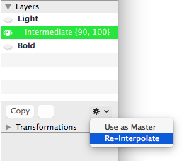
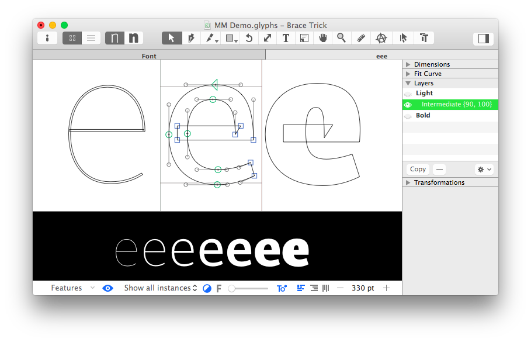

原文: [Additional masters for individual glyphs: the brace trick in Glyphs 2](https://glyphsapp.com/learn/additional-masters-for-individual-glyphs-the-brace-trick)
# 個別のグリフに追加マスターを設定する：Glyphs 2のブレース・トリック

旧バージョンのチュートリアル

[ インターポレーション ](https://glyphsapp.com/learn?q=interpolation)

執筆者: Rainer Erich Scheichelbauer

[ en ](https://glyphsapp.com/learn/additional-masters-for-individual-glyphs-the-brace-trick) [ zh ](https://glyphsapp.com/zh/learn/additional-masters-for-individual-glyphs-the-brace-trick)

2024年6月12日更新（初版公開：2014年11月4日）

フォント全体ではなく、特定のグリフにだけ追加のマスターが必要になることがあります。ここでは、Glyphs 2でそれを行う方法を紹介します。

インターポレーションでは、2つのマスターを用意するだけで驚くほど上手くいきます。しかし、時にはその中間に特別なステップが必要になることもあります。もちろん、[ブラケット・トリック](alternating-glyph-shapes.md)や、[特定のインスタンスでのみ有効になる代替グリフ](alternating-glyph-shapes-with-multiple-axes.md)を使って、ある程度は擬似的に対応することもできます。しかし、グリフごとに多くのマスターを追加（そして再描画）する必要があるため、複雑になりがちです。

### バージョンに関する注意
**この記事はGlyphsの古いバージョンに関するものです。** Glyphs 3以降については、チュートリアル「[中間レイヤー](intermediate-layers.md)」をご覧ください。

## ブレース・レイヤーを作成して名前を付ける

Glyphs 2では、「ブレース・トリック」と呼ばれるテクニックを利用できます。ブラケット・トリックと同様に、マスターレイヤーの1つをコピーして、その名前を調整します。これを行うには、パレットのサイドバー（_Window > Palette, _ Cmd-Opt-P）を開き、「レイヤー」パレットで最初のマスターを選択し、「コピー」ボタンをクリックします。

新しいレイヤーの名前をダブルクリックし、ブレース・レイヤー名を入力します。名前の構造は次のとおりです。

```
任意の説明 {ウェイト値, 幅の値}
```

要するに、中括弧`{}`の中に、カンマで区切られたインターポレーションの値をリスト形式で記述します。必要であれば、「Intermediate」のような説明的な接頭辞を付けることもできます。このレイヤーは、まさにそのグリフのためだけに、補間空間のまさにその位置に中間マスターを挿入する役割を果たします。例えば、`Intermediate {120, 100}`という名前のレイヤーは、ウェイト軸の120、幅軸の100の位置でマスターとして機能します。

あとは、実際にレイヤーを描画するだけです。レイヤーパレットの右下にある歯車メニューから「再補間（Re-Interpolate）」を選択すると、作業をスムーズに始められます。これにより、ブレース・レイヤーに新しい補間結果が配置されます。注意してください、そこにあるものは上書きされます。



ちなみに、中括弧の片方を削除したり、中括弧の間に接尾辞を書いたりすることで（例：`Intermediate {90, 100 off}`）、ブレース・レイヤーを一時的に無効にすることができます。レイヤーがアクティブか非アクティブかは、編集タブのプレビューセクションにあるインスタンスのポップアップメニューから「すべてのインスタンスを表示（Show all instances）」を選択することで確認できます。

## 例

典型的な使用例は、LightからHeavyへ補間される小文字の「e」です。ミディアムウェイトまではステム（縦画）は均等に太くできますが、ヘビーウェイトになると横画は縦画ほど速く太くすることができません。LightとBoldのマスターしかない場合、横画が早々に細くなりすぎてしまいます。eの中央のバーに注目してください。


このおかしな補間は、このグリフに中間マスターを追加することで修正できます。前述のように、わかりやすい説明的な名前と適切なウェイト値を持つブレース・レイヤーを追加します。幅の値はデフォルトのままで構いません。この例では、`Intermediate {90, 100}`となります。



これで、このグリフのためだけの追加マスターができ、eの補間が格段に良くなりました。外側のマスターは同じままで、中央のバーがどれだけうまく振る舞っているか見てください。


以上です。ハイタッチ！

---

更新履歴 2022-07-19: タイトル、関連記事、軽微なフォーマットを更新。

更新履歴 2024-06-12: 「中間レイヤー」チュートリアルへのリンクを追加。

## 関連記事

[すべてのチュートリアルを見る →](https://glyphsapp.com/learn)

*   ### [中間レイヤー](intermediate-layers.md)

    チュートリアル

[ インターポレーション ](https://glyphsapp.com/learn?q=interpolation)

*   ### [マルチプルマスター、パート1：マスターの設定](multiple-masters-part-1-setting-up-masters.md)

    チュートリアル

[ インターポレーション ](https://glyphsapp.com/learn?q=interpolation)

*   ### [マルチプルマスター、パート2：アウトラインの互換性を保つ](multiple-masters-part-2-keeping-your-outlines-compatible.md)

    チュートリアル

[ インターポレーション ](https://glyphsapp.com/learn?q=interpolation)

*   ### [マルチプルマスター、パート3：インスタンスの設定](multiple-masters-part-3-setting-up-instances.md)

    チュートリアル

[ インターポレーション ](https://glyphsapp.com/learn?q=interpolation)

*   ### [シェイプを切り替える](switching-shapes.md)

    チュートリアル

[ インターポレーション ](https://glyphsapp.com/learn?q=interpolation)

*   ### [グリフシェイプを切り替える：Glyphs 2のブラケット・トリック](alternating-glyph-shapes.md)

    旧バージョンのチュートリアル

[ インターポレーション ](https://glyphsapp.com/learn?q=interpolation)

*   ### [Glyphs 2で複数の軸を持つグリフシェイプを切り替える](alternating-glyph-shapes-with-multiple-axes.md)

    旧バージョンのチュートリアル

[ インターポレーション ](https://glyphsapp.com/learn?q=interpolation)