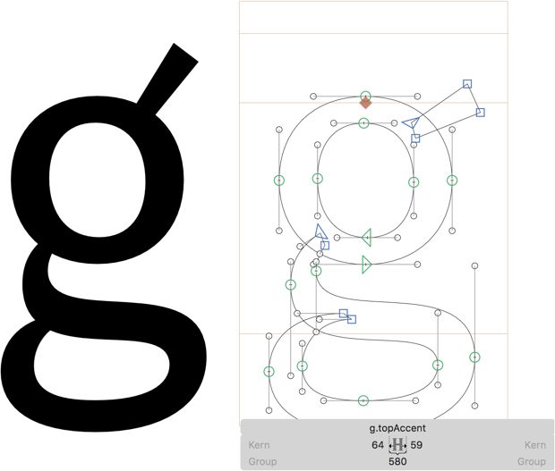
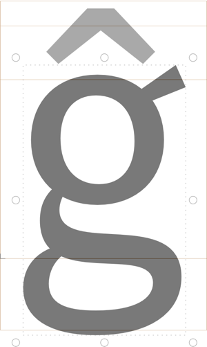

原文: [Advanced diacritics: adapted base letters](https://glyphsapp.com/learn/advanced-diacritics-adapted-base-letters)
# ダイアクリティカルマーク（発展編）：ベース文字の調整

チュートリアル

[ シェイプの再利用 ](https://glyphsapp.com/learn?q=reusing+shapes)

執筆者: Rainer Erich Scheichelbauer

[ en ](https://glyphsapp.com/learn/advanced-diacritics-adapted-base-letters)
[ es ](https://glyphsapp.com/es/learn/advanced-diacritics-adapted-base-letters) [ fr ](https://glyphsapp.com/fr/learn/advanced-diacritics-adapted-base-letters) [ zh ](https://glyphsapp.com/zh/learn/advanced-diacritics-adapted-base-letters)

2022年7月21日更新（初版公開：2020年7月18日）

上に付くダイアクリティカルマークに反応して形が変わる文字を想像してみてください。例えば、小文字のgがサーカムフレックスのために「耳」の部分をずらすような感じです。素晴らしいでしょう？しかも簡単です。その方法をここでご紹介します。

ベース文字に`.topAccent`や`.bottomAccent`のような接尾辞を付けたバリエーションを作成できます。そうすると、指定されたアンカーを使用するマークとのコンポーネントグリフを生成する際に、この文字が優先的に使用されます。

複雑に聞こえるかもしれませんが、例を挙げて説明します。例えば、ファンキーな「耳」を持つ小文字のgがあるとします。とても素敵ですが、`gcommaaccent`、`gcaron`、`gdotaccent`のようなコンポーネントグリフでは、上付きのアクセントの邪魔になるかもしれません。そこで、gを複製して`g.topAccent`という名前にし、その「耳」を平らにします。例えばこんな感じです。

次に、上部に接続するマークを持つgのコンポーネントグリフ、例えば`gcircumflex`を作成すると、ベース文字として`.topAccent`のバリエーションが優先的に使用されます。

## 1つのベース文字で複数のアンカータイプに対応する

1つの接尾辞に複数のアンカーを組み合わせることもできます。その際、アンカーの名前は以下のルールに従ってください。

*   間にスペースを入れずに書く
*   キャメルケースで書く
*   アルファベット順に並べる

良い例：bottomとtopアンカーには`.bottomTopAccent`、bottomとogonekアンカーには`.bottomOgonekAccent`、hornとtoprightアンカーには`.hornToprightAccent`のようにします。簡単ですね。

---

更新履歴 2022-07-10: トピックの割り当てを改善。

更新履歴 2022-07-21: タイトルを更新、軽微なフォーマットを修正。

## 関連記事

[すべてのチュートリアルを見る →](https://glyphsapp.com/learn)

*   ### [ダイアクリティカルマーク](diacritics.md)

    チュートリアル

[ シェイプの再利用 ](https://glyphsapp.com/learn?q=reusing+shapes)

*   ### [ダイアクリティカルマーク（発展編）：幅の狭いマーク](advanced-diacritics-narrow-marks.md)

    チュートリアル

*   ### [ダイアクリティカルマーク（発展編）：複数のアンカー](advanced-diacritics-multiple-anchors.md)

    チュートリアル

[ 言語 ](https://glyphsapp.com/learn?q=languages)

*   ### [ビデオ：ダイアクリティカルマークの作成](video-building-diacritics.md)

    チュートリアル