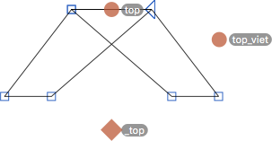

原文: [Advanced diacritics: multiple anchors](https://glyphsapp.com/learn/advanced-diacritics-multiple-anchors)
# 高度なダイアクリティカルマーク：複数のアンカー

チュートリアル

[ 言語 ](https://glyphsapp.com/learn?q=languages)

by Rainer Erich Scheichelbauer

[ en ](https://glyphsapp.com/learn/advanced-diacritics-multiple-anchors) [ fr ](https://glyphsapp.com/fr/learn/advanced-diacritics-multiple-anchors) [ zh ](https://glyphsapp.com/zh/learn/advanced-diacritics-multiple-anchors)

2022年7月25日 2012年11月28日公開

時々、マークが異なる位置を持つことがあります。そんな時には、複数のアンカーが必要です。警告：この先は楽しいタイポグラフィオタクの世界です。

例えば、ベトナム語のタイポグラフィに見られるこれら2つのダイアクリティカルマークの宝石を見てみましょう：`ecircumflexacute`と`ecircumflextilde`です。

要するに、これらは`ecircumflex`の2つのケースで、一方は上に追加の`acutecomb`、もう一方は追加の`tildecomb`が付いています。よく見てください。チルダはサーカムフレックスの上に中央揃えで配置され、アキュートはその隣のような位置にあります。これを実現するにはさまざまな方法があります。ここに、特にオタクっぽい方法を一つ紹介します。

さて、あなたには`top`アンカーを持つ`e`があると仮定します。それに加えて、`circumflexcomb`、`tildecomb`、`acutecomb`がそれぞれ対応する`_top`アンカーを持っているとします。私が何を言っているのかわからない場合は、ここで読み進める前に、[ダイアクリティカルマークに関するこのブログ記事](diacritics/.md)を読んでください。

さて、もし今`ecircumflexacute`と`ecircumflextilde`を作成すると、Glyphsはデフォルトでこのようにそれらを組み合わせます。

痛い、良くないですね。しかし、なぜこうなるのでしょうか？簡単です。`tildecomb`と`circumflexcomb`の両方が`_top`アンカー（アンダースコアで始まる）を持っています。したがって、それらがコンポジットグリフに入ると、自分自身を配置するための`top`アンカーを探します。彼らが見つけることができる唯一のアンカーは、`e`の`top`アンカーです。ですから、論理的な私たちとしては、`circumflexcomb`に追加の`top`アンカーが必要です。一つは中央に（`tildecomb`用）、もう一つは少し右にずらして（`acutecomb`用）です。

代替アンカーには*アンダースコア拡張*が付くので、2番目のアンカーを`top_alt`または`top_right`と呼びます。多くのアンカーを植え付けたい場合は、`top_1`、`top_2`などのように番号を付けることも、`top_viet`や`top_acute`のような説明的な名前を付けることもできます。`alt`キーを押しながらドラッグすることで、アンカーを簡単にコピーすることもできます。私は`top`アンカーを`top_viet`と呼ぶことにします。このようになります。

さて、コンポジットグリフに戻りましょう。ダイアクリティカルマークが行く場所が複数ある場合、マークコンポーネントをアクティブにして、灰色の情報ボックスでそのアンカーを選ぶことができます。

あるいは、もし怠け者なら、そのためのスクリプトがあります。[mekkablueのgithub](https://github.com/mekkablue/Glyphs-Scripts)にあります。_Move acute, grave and hook to top_viet_というスクリプトが見つかります。これは、選択したすべてのグリフでacutecomb、gravecomb、hookabovecombを自動的に「top_viet」に配置します。

これで完了です！うまく機能します。さあ、マークアンカーで楽しんでください、タイポグラフィオタクの皆さん！

---

更新履歴 2015-09-02: Glyphs 2の新しいグリフ名に更新。

更新履歴 2020-03-13: 誤字を修正。

更新履歴 2022-07-22: タイトル、関連記事、軽微なフォーマットを更新。

## 関連記事

[すべてのチュートリアルを見る →](https://glyphsapp.com/learn)

*   ### [ダイアクリティカルマーク](diacritics.md)

チュートリアル

[ シェイプの再利用 ](https://glyphsapp.com/learn?q=reusing+shapes)

*   ### [高度なダイアクリティカルマーク：適合させた基本文字](advanced-diacritics-adapted-base-letters.md)

チュートリアル

[ シェイプの再利用 ](https://glyphsapp.com/learn?q=reusing+shapes)

*   ### [高度なダイアクリティカルマーク：狭いマーク](advanced-diacritics-narrow-marks.md)

チュートリアル

*   ### [ビデオ：ダイアクリティカルマークの作成](video-building-diacritics.md)

チュートリアル