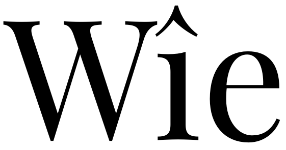

原文: [Advanced diacritics: narrow marks](https://glyphsapp.com/learn/advanced-diacritics-narrow-marks)
# 高度なダイアクリティカルマーク：狭いマーク

チュートリアル

by Rainer Erich Scheichelbauer

[ en ](https://glyphsapp.com/learn/advanced-diacritics-narrow-marks) [ fr ](https://glyphsapp.com/fr/learn/advanced-diacritics-narrow-marks) [ zh ](https://glyphsapp.com/zh/learn/advanced-diacritics-narrow-marks)

2022年7月25日 2012年11月8日公開

狭い文字用の特別なマークを追加して、あなたの書体デザインを洗練させましょう。

免責事項：このチュートリアルは、あなたがGlyphsでの[ダイアクリティカルマークの作成](diacritics/.md)に精通していることを前提としています。

「狭いマークって何？」とあなたは尋ねるかもしれませんね。通常、ダイアクリティカルマークは、できるだけ多くの基本文字に再利用できるように作成します。a、e、o、u、yなどにはそれで素晴らしいのですが、iやjのように、他の文字よりも少し狭い文字があります。そして、それらの文字に対しては、`macroncomb`、`circumflexcomb`、`dieresiscomb`のようなダイアクリティカルマークは幅が広すぎるかもしれません。幅の広いマークは、前の文字と衝突する可能性があります。例えば、アフリカーンス語で「くさび」を意味する「wîe」の`icircumflex`を見てみましょう。文頭ではWを大文字にするので、このようになります。

さて、この場合は正確には衝突していませんが、確かに近すぎます。i（正確には`idotless`）に使う狭いサーカムフレックスで、この問題を軽減できます。そこで、フォントビュー（Cmd-Opt-1）に切り替え、_Marks_カテゴリに入り、_Combining_サブカテゴリを開きます。そこで、`circumflexcomb`を選択し、_グリフ > グリフを複製_（Cmd-D）を選択します。Glyphsはマークのコピーをフォントに追加し、`circumflexcomb.001`と名付けます。拡張子を`.i`または`.narrow`に変更します。次に、編集ビューでグリフを開き（ダブルクリックするか、Cmd-Tで新しいタブを開きます）、そのデザインを調整します。つまり、少し狭くします。

次に、`icircumflex`を選択し、_グリフ > コンポジットを作成_（Ctrl-Cmd-C）を選択して再構築します。iとjに基づくダイアクリティカルマークの場合、Glyphsは`.i`または`.narrow`で終わるマークを優先します。そして、ほら、全体が少し問題なくなりまた。

### プロのヒント

Optionキーも押しながら（Ctrl-Opt-Cmd-C）操作すると、グリフの*すべてのレイヤー*に対してコンポジットを作成できます。複数のマスターがある設定の場合に便利です。

同様に、`acutecomb.narrow`と`gravecomb.narrow`を少し急な角度にし、`dieresiscomb.narrow`のドットを少し近づけ、`macroncomb.narrow`を短くし、`brevecomb.narrow`、`tildecomb.narrow`、そしておそらく`ogonekcomb.narrow`も少し凝縮させたいかもしれません。

### 注

2.0より前の古いアプリバージョンでは、`idotless`と`jdotless`はそれぞれ`dotlessi`と`dotlessj`と呼ばれていました。

サンプルフォント：[PLAYFAIR](http://www.google.com/webfonts/specimen/Playfair+Display)、CLAUS EGGERS SØRENSEN氏提供。

---

更新履歴 2014-12-11: ドットレスグリフの新しい表記法に更新。

更新履歴 2015-09-02: Glyphs 2の新しいグリフ名に更新。

更新履歴 2021-08-07: Glyphs 3向けの表現を更新。

更新履歴 2022-07-25: タイトル、関連記事、軽微なフォーマットを更新。

## 関連記事

[すべてのチュートリアルを見る →](https://glyphsapp.com/learn)

*   ### [ダイアクリティカルマーク](diacritics.md)

チュートリアル

[ シェイプの再利用 ](https://glyphsapp.com/learn?q=reusing+shapes)

*   ### [高度なダイアクリティカルマーク：複数のアンカー](advanced-diacritics-multiple-anchors.md)

チュートリアル

[ 言語 ](https://glyphsapp.com/learn?q=languages)

*   ### [高度なダイアクリティカルマーク：適合させた基本文字](advanced-diacritics-adapted-base-letters.md)

チュートリアル

[ シェイプの再利用 ](https://glyphsapp.com/learn?q=reusing+shapes)

*   ### [ビデオ：ダイアクリティカルマークの作成](video-building-diacritics.md)

チュートリアル