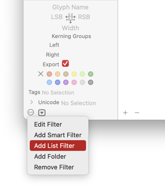
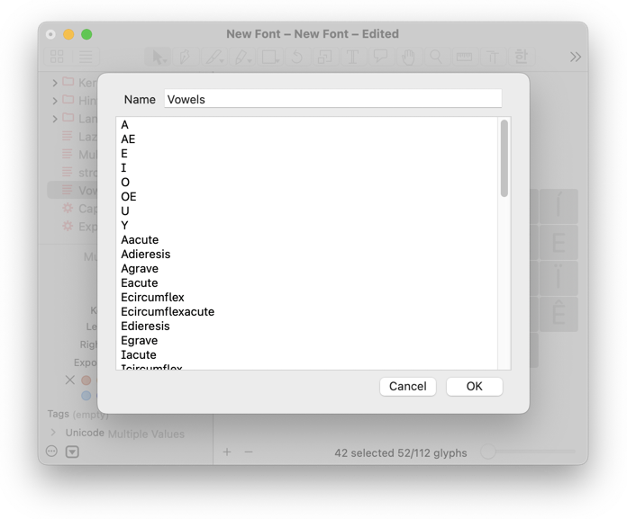
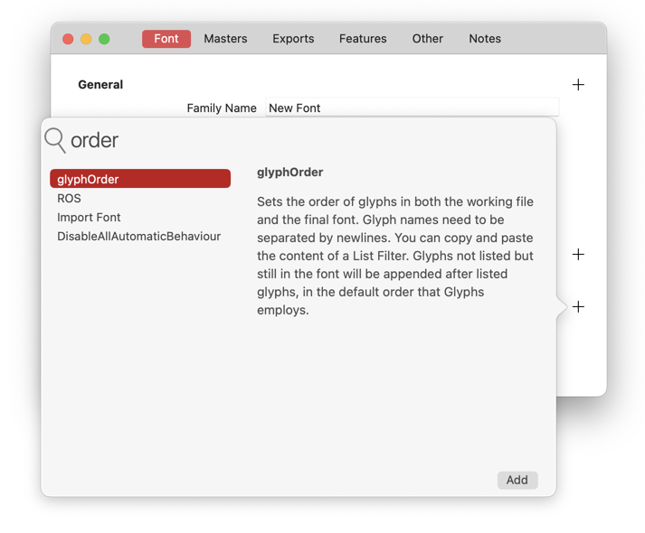
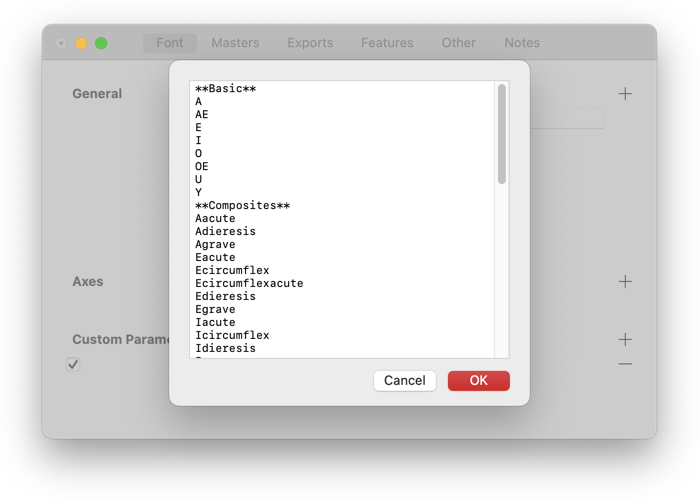
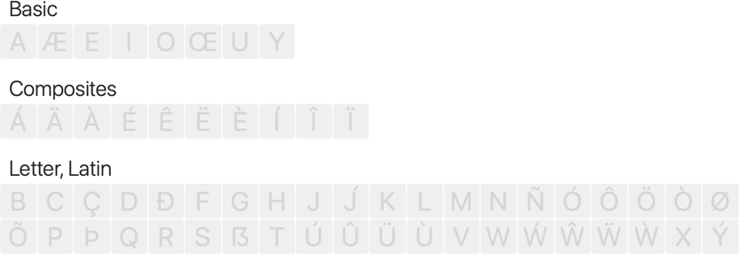
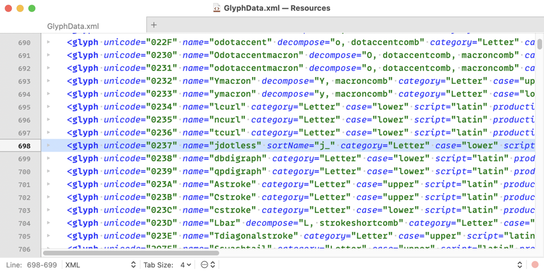

原文: [Alter the glyph order in Font view](https://glyphsapp.com/learn/alter-the-glyph-order-in-font-view)
# フォントビューのグリフ順序を変更する

チュートリアル

by Rainer Erich Scheichelbauer

[ en ](https://glyphsapp.com/learn/alter-the-glyph-order-in-font-view) [ fr ](https://glyphsapp.com/fr/learn/alter-the-glyph-order-in-font-view) [ zh ](https://glyphsapp.com/zh/learn/alter-the-glyph-order-in-font-view)

2023年1月11日 2012年7月22日公開

このチュートリアルは、他のソフトから乗り換えた人からよく聞かれる質問への回答です。フォントビューに表示されるグリフの順序を変更するにはどうすればよいか？とても簡単で早いことがわかるでしょう。

## 簡単：リストフィルター

何がどの順序で表示されるかを制御する最も便利な方法は、シンプルな**リストフィルター**です。ウィンドウの左下隅にあるアクションボタンをクリックし、*リストフィルターを追加*を選択するとダイアログが表示されます。良い名前を選び、希望する順序でグリフ名を一行ずつ入力します。

### ヒント

フィルター名の横にあるアイコンをダブルクリックすると、既存のフィルターを編集できます。サイドバーでフィルター名をShiftキーまたはCmdキーを押しながらクリックすることで、複数のフィルターを一度に選択できます。

> *ヒント：* フィルター名には少なくとも1つの小文字が含まれていることを確認してください。Glyphsの一部のバージョンでは、すべて大文字の名前（「A-Z」など）はグループヘッダーと見なされ、そのようにレンダリングされます。

## 中級：カスタムパラメータ

フォントごとにグリフの順序を変更したいですか？*フォント情報*に入り、*フォント*タブに切り替えて、`glyphOrder`というカスタムパラメータを追加します。

*値*フィールドをクリックし、リストフィルターと同様に、グリフ名のリストを入力またはペーストします。このフォントのグリフは、その順序で表示されます。**注意：**`glyphOrder`パラメータは、最終的なOpenTypeフォントファイル内のグリフの順序も変更します。したがって、これは自分が何をしているかを知っている場合にのみ行ってください。

### ヒント

フォント間でカスタムパラメータをコピー＆ペーストできます。

おまけとして、**セクションヘッダー**を追加できます。タイトルを付けて一行追加し、その前後を二重アスタリスクで囲むだけです。この例のように。

    **Basic**
    A
    AE
    E
    I
    O
    OE
    U
    Y
    **Composites**
    Aacute
    Adieresis
    Agrave
    Eacute
    Ecircumflex
    Ecircumflexacute
    Edieresis
    Egrave

…そして、*Basic*と*Composites*という単語がフォントビューでセクションヘッダーとして表示されます。

## プロ：GlyphData.xml

より永続的な解決策が必要ですか？もし挑戦する気があるなら、お気に入りのプレーンテキストエディタを起動し、次の場所に`GlyphData.xml`というXMLファイルを作成します。

    ~/Library/Application Support/Glyphs 3/Info/GlyphData.xml

Glyphsに内蔵されているXMLファイルを次の場所からコピーできます。

/Applications/Glyphs 3.app/Contents/Frameworks/GlyphsCore.framework/Versions/A/Resources/GlyphData.xml

これらのファイルには、ソート順を含むすべての関連グリフ情報が含まれています。互いに補完し合うので、XMLファイルのコピーを必要な文字だけに限定することができます。

デフォルトでは、Glyphsはグリフをカテゴリ内でアルファベット順に並べます。表示順序を操作したい場合は、グリフのエントリに`sortName`属性を追加します。これがどのように機能するかを理解するために、`jdotless`の`sortName`属性を`j_`に設定すると、`jdotless`が`jcircumflex`の後ではなく、`j`の直後に来るようになります。

    <glyph unicode="0237" name="jdotless" sortName="j_" category="Letter" case="lower" script="latin" production="uni0237" altNames="dotlessj" description="LATIN SMALL LETTER DOTLESS J" anchors="top, bottom@descender" marks="dotaccentcomb, circumflexcomb" />

もちろん、`GlyphData.xml`でできることはもっとたくさんあります。時間をかけてその構造を少し研究してみてください。かなり単純です。[GlyphDataチュートリアルでさらに詳しく。](roll-your-own-glyph-data.md)

---

更新履歴 2020-07-29: 「補完」という単語を修正。

更新履歴 2022-07-25: タイトル、関連記事、軽微なフォーマットを更新。

更新履歴 2023-01-11: Glyphs 3向けに更新、軽微なフォーマット、新しいスクリーンショット、glyphOrderセクションヘッダー、GlyphDataチュートリアルを追加。

## 関連記事

[すべてのチュートリアルを見る →](https://glyphsapp.com/learn)

*   ### [フォントビューのカスタムサイドバーエントリ](custom-sidebar-entries-in-font-view.md)

チュートリアル

*   ### [グリフ名を正しく設定する](getting-your-glyph-names-right.md)

チュートリアル

*   ### [フォントにグリフを追加する](adding-glyphs-to-your-font.md)

チュートリアル

[ 言語 ](https://glyphsapp.com/learn?q=languages)

*   ### [独自のグリフデータを作成する](roll-your-own-glyph-data.md)

チュートリアル