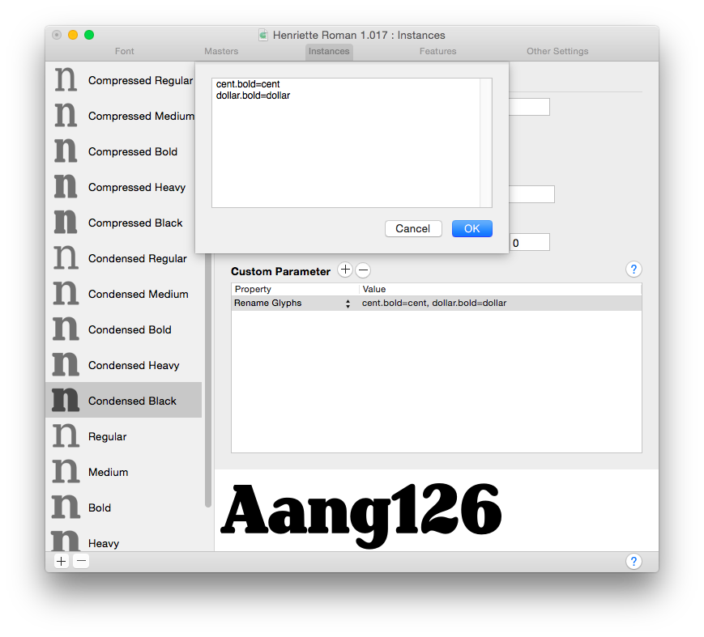

原文: [Alternating glyph shapes with multiple axes in Glyphs 2](https://glyphsapp.com/learn/alternating-glyph-shapes-with-multiple-axes)
# Glyphs 2の複数の軸でグリフの形を切り替える

旧チュートリアル

[ Interpolation ](https://glyphsapp.com/learn?q=interpolation)

by Rainer Erich Scheichelbauer

[ en ](https://glyphsapp.com/learn/alternating-glyph-shapes-with-multiple-axes) [ zh ](https://glyphsapp.com/zh/learn/alternating-glyph-shapes-with-multiple-axes)

2021年9月28日 2012年6月12日公開

Glyphs 2で2つ以上の軸がある場合、[ブラケットトリック](alternating-glyph-shapes.md)は複雑すぎます。**注意：**Glyphs 3については、代わりに[シェイプの切り替え](switching-shapes.md)を読んでください。

複数の軸がある場合や、フォントタブで全体像を把握し続けたい、あるいは[ブラケットトリック](alternating-glyph-shapes.md)が複雑すぎると感じる場合は、代替のグリフシェイプ用に*別のグリフ*を作成するのが良い方法です。例えば、_dollar_と_cent_のグリフについて、_dollar.bold_や_cent.bold_という名前の代替グリフを作成します。特定のウェイトでGlyphsがボールドバージョンに切り替わるようにするには、次の手順に従ってください。

### バージョンに関する注意

**このアーティクルはGlyphsの旧バージョンに関するものです。** Glyphs 3での解決策をお探しの場合は、[シェイプの切り替え](switching-shapes.md)をご覧ください。

0. `dollar.bold`と`cent.bold`を書き出さないグリフとして作成します。作成後、フォントタブでそれらを選択し、*書き出す*オプションのチェックを外します。このオプションは、コンテクストメニュー（右クリック）か、ウィンドウの左下に表示されるグリフ情報で見つけることができます。
1. _ファイル > フォント情報_（Cmd-I）を開き、_インスタンス_に移動します。
2. 左側で、ボールドのシェイプを表示させたいインスタンスを1つ選択します。（他のインスタンスについては、後ほど対応します。）
3. _カスタムパラメータ_フィールドの上にあるプラスボタンをクリックして、_カスタムパラメータ_を追加します。_プロパティ_として、`Rename Glyphs`を選びます。
4. _値_をダブルクリックし、`バックアップグリフ名=ターゲットグリフ名`という構造の置換パターンを各行に入力します。このケースでは、`dollar.bold=dollar`と`cent.bold=cent`です。完了したらOKをクリックします。
5. パラメータを他のインスタンスにコピーするには、まず作成したカスタムパラメータの行を選択し、Cmd-Cを押してクリップボードにコピーします。次に、左サイドバーで、同じパラメータを持つべきすべてのインスタンスを（ShiftキーまたはCmdキーを押しながらクリックして）選択します。このケースでは、すべてのボールドウェイトです。そして、空になった_カスタムパラメータ_のエリア内をクリックし、ペースト（Cmd-V）します。すべてがうまくいったか確認するには、インスタンスが1つだけ選択されている必要があります。

Michael Hochleitner氏のHenrietteでのグリフのリネーム。

### ヒント

*Remove Glyphs*パラメータは**追加しないでください**。これを行うとグリフが無効になり、最終的なフォントファイルにはdollarもcentもまったく含まれなくなってしまいます。

これでフォントファミリーを書き出します。Glyphsは自動的に太いウェイトのシェイプを置き換えます。やった！

サンプルフォント：[Henriette](http://www.typejockeys.com/fonts/Henriette)、Typejockeys提供。

---

更新履歴 2015-04-28: チュートリアルを更新。Remove Glyphsは不要になりました。

更新履歴 2021-05-25: バージョンに関する注意を追加。

更新履歴 2021-09-28: バージョンに関する注意を（願わくば）より明確にし、リンクを更新。

## 関連記事

[すべてのチュートリアルを見る →](https://glyphsapp.com/learn)

*   ### [シェイプの切り替え](switching-shapes.md)

チュートリアル

[ Interpolation ](https://glyphsapp.com/learn?q=interpolation)

*   ### [グリフの形を切り替える：Glyphs 2のブラケットトリック](alternating-glyph-shapes.md)

旧チュートリアル

[ Interpolation ](https://glyphsapp.com/learn?q=interpolation)