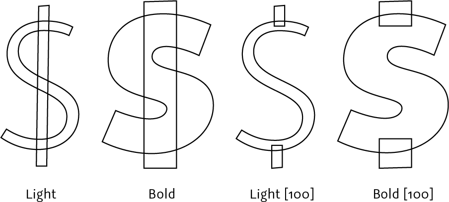
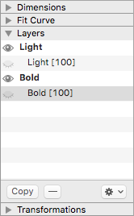
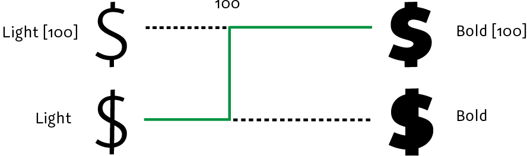
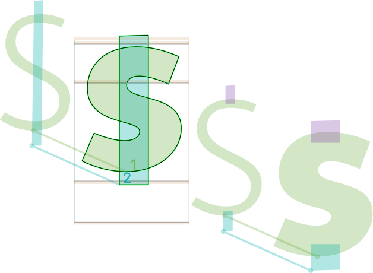
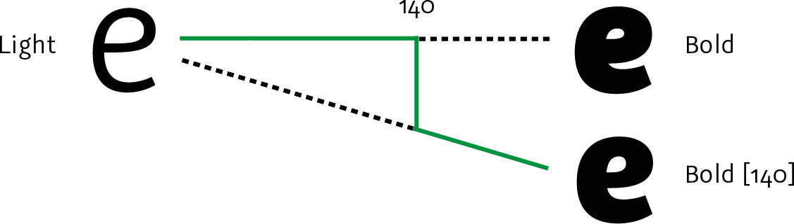
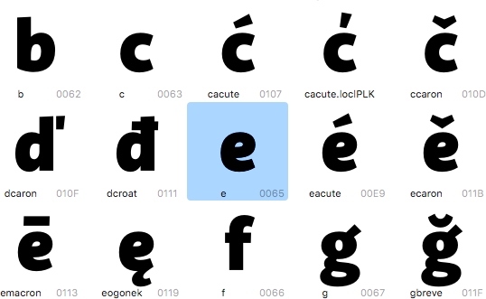
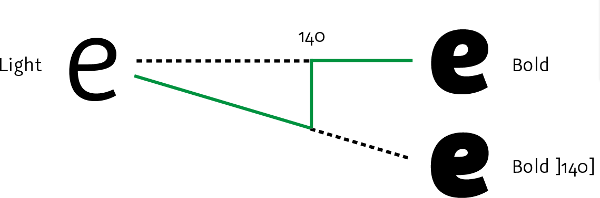
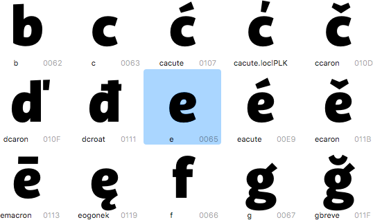

原文: [Alternating glyph shapes: the bracket trick in Glyphs 2](https://glyphsapp.com/learn/alternating-glyph-shapes)
# グリフの形を切り替える：Glyphs 2のブラケットトリック

旧チュートリアル

[ Interpolation ](https://glyphsapp.com/learn?q=interpolation)

by Rainer Erich Scheichelbauer

[ en ](https://glyphsapp.com/learn/alternating-glyph-shapes) [ zh ](https://glyphsapp.com/zh/learn/alternating-glyph-shapes)

2024年6月12日 2012年6月11日公開

Glyphs 2では、1つのグリフに2つの異なる形が必要になることがあります。ブラケットトリックは、グリフの形を切り替えるのに役立ちます。**注意：**Glyphs 3については、代わりに[シェイプの切り替え](switching-shapes.md)を読んでください。

よくある例はドル記号の縦線です。細いウェイトでは通常グリフ全体を貫通しますが、太いウェイトではそのためのスペースがありません。

### バージョンに関する注意

**このアーティクルはGlyphsの旧バージョンに関するものです。** Glyphs 3での解決策をお探しの場合は、[シェイプの切り替え](switching-shapes.md)をご覧ください。

## すべてのマスターを変更する

フォントにLightとRegularのマスターを持つウェイト軸を設定し、太くなるにつれて1つのグリフの形を変えたいと仮定しましょう。よくある例はドル記号です。

Lightマスターには、ドル記号全体を貫通する線を使用します。しかし、これはBoldでは機能しないため、代わりに短い切れ端を使用します。しかし、これら2つのシェイプをマスターレイヤーとして使用すると、グリフは互換性がなくなり、補間が機能しなくなります。そこでブラケットトリックの出番です！方法は次の通りです。

1.  形を変えたいグリフを選択し、編集ビューで開きます。
2.  サイドバー（Opt-Cmd-P）のパレットの*レイヤー*セクションで、Lightマスターを選択して*コピー*をクリックします。Boldマスターでも同じことを行います。これで、マスターの名前と現在の日付で名付けられた2つの追加レイヤーができます。
3.  次に、それらのレイヤー名をダブルクリックし、日付と時刻を角括弧で囲んだ分岐点のウェイト値に置き換えます。例：`Light [100]`と`Bold [100]`。名前と角括弧の間にスペースがあることを確認してください。
4.  角括弧付きのレイヤーを次のように調整します。

以上です。これで`Light`、`Bold`、`Light [100]`、`Bold [100]`の4つのレイヤーができるはずです。そして、パレットは次のようになるはずです。

この例では、ウェイトが100を超えるインスタンスに対して、Glyphsは自動的に2番目のレイヤーセットをマスターとして使用します。そして、魔法のように、Glyphsは各インスタンスに適切なマスターを選択します。

美しいですね。要約すると、技術的に行っていることは、ウェイト100で一つの補間から別の補間へ切り替えることです。

ちなみに、*表示 > マスターの互換性を表示*（Ctrl-Opt-Cmd-N）でさえも、私たちのブラケットレイヤー設定を互いに独立した2つの別々の補間として認識します。

いいですね。しかし、まだ続きがあります。読み進めてください。

## 1つのマスターだけを切り替える

しかし、時には*1つ*のマスターだけを変更する必要がある場合もあります。a、s、eのような密度の高いグリフでは特にそうです。例えば、私たちのeを見てみましょう。

ご覧の通り、太いeはそれほどきれいではありません。eの目にもっとスペースを与えたいのですが、それを変更すると、今きれいに見えている軽いウェイトの補間を台無しにしてしまいます。これには簡単な解決策があります。上記と同様に、*レイヤー*パレット（Cmd-Opt-P）の*コピー*ボタンでマスターレイヤーを1つ複製します。この例では、Boldです。複製したレイヤーの名前を*Bold [140]*に変更し、そのレイヤーの太いeの形をより受け入れられるものに変更します。

こうすることで、ウェイトが140を*超える*すべてのグリフで*Bold [140]*のeが使用されます。よく見てください。列の4番目のeまで、両方の補間は同じですが、最後の3つのウェイトはより良く見えます。言い換えれば、私たちの*Bold*レイヤーは140まではうまく補間しますが、それ以上では見栄えが悪くなります。より太いウェイトでは、*Bold [140]*の方が良い仕事をするのです。模式的に示すと、私たちの補間設定は次のようになります。

### リバースブラケットトリック

素晴らしいですね！しかし、残念ながら、ブラケットトリックには欠点があります。あなたのeは正しく補間しますが、フォントビューでは常に間違った太いeが表示されてしまいます。

ブー！でも心配しないでください。*リバースブラケットトリック*で簡単に変更できます、ジャジャーン！方法は次の通りです。もう一度、太いレイヤーをコピーします。しかし、今回は名前を*Bold ]140]*とします（数字の*前*にある右角括弧に注意してください）。次に、元の*Bold*マスターレイヤーのeを、中央のストロークを細くするなどして、美しく、素晴らしく、輝くものすべてを備えた、素敵な太いe（前の例の*Bold [140]*のような）に変更します。リバースブラケットは、ウェイトが140に*なるまで* *Bold ]140]* レイヤーが使用されることを保証します。

これでフォントビューについて文句を言う人はいなくなるでしょう。

## 単一軸のみ

ブラケットトリックは、単一軸の設定でのみ機能します。より複雑な補間設定でシェイプを切り替えたい場合は、チュートリアル[複数の軸でグリフの形を切り替える](alternating-glyph-shapes-with-multiple-axes.md)をご覧ください。ありがとうございました。おやすみなさい。

*サンプルフォント：Sephora Sans by* [Mucca/Schriftlabor](http://mucca.com/case-studies/sephora-custom-type-system/)

---

更新履歴 2015-10-01: Glyphs 2向けに更新。

更新履歴 2021-05-21: バージョンに関する注意を追加。

更新履歴 2021-09-28: バージョンに関する注意をより明確に。

## 関連記事

[すべてのチュートリアルを見る →](https://glyphsapp.com/learn)

*   ### [Glyphs 2の複数の軸でグリフの形を切り替える](alternating-glyph-shapes-with-multiple-axes.md)

旧チュートリアル

[ Interpolation ](https://glyphsapp.com/learn?q=interpolation)

*   ### [シェイプの切り替え](switching-shapes.md)

チュートリアル

[ Interpolation ](https://glyphsapp.com/learn?q=interpolation)

*   ### [中間レイヤー](intermediate-layers.md)

チュートリアル

[ Interpolation ](https://glyphsapp.com/learn?q=interpolation)