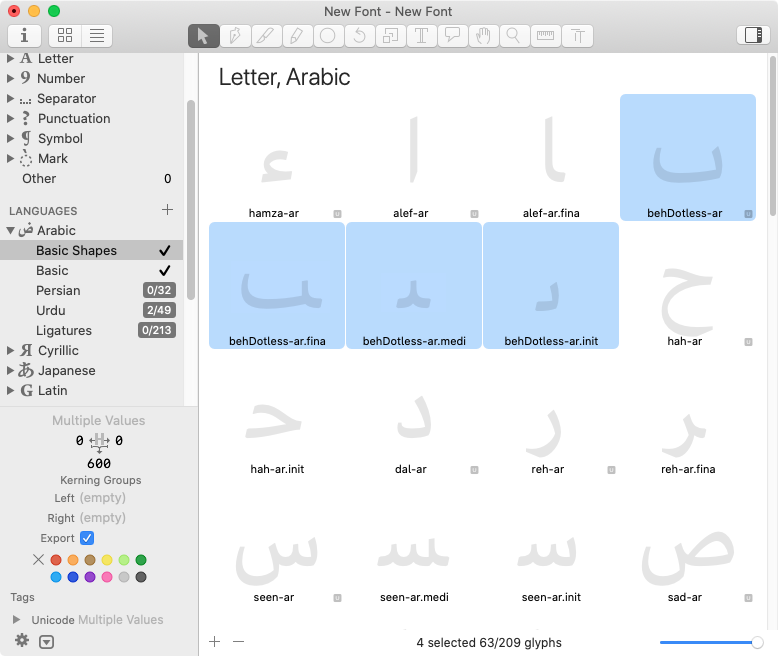

原文: [Creating an Arabic font](https://glyphsapp.com/learn/arabic)
# アラビア語フォントの作り方

チュートリアル

[ 言語 ](https://glyphsapp.com/learn?q=languages)

Rainer Erich Scheichelbauer著

[ en ](https://glyphsapp.com/learn/arabic) [ fr ](https://glyphsapp.com/fr/learn/arabic) [ zh ](https://glyphsapp.com/zh/learn/arabic)

2024年5月14日 2012年10月6日公開

Glyphsでのアラビア語フォント作成に関する、手っ取り早く簡単な入門書をお探しでしたか？これがそうです。

## ドキュメントを設定する

Glyphsを起動すると、スタートウィンドウが表示されるか、後からいつでも_ファイル > グリフセットから新規作成_で表示できます。

ドキュメント作成ダイアログで、含めたいスクリプトを選択するだけです。手始めに、まず_アラビア語_を選択することをお勧めします。スクリプトはアルファベット順にリストされているので、ローカライズによっては通常、一番上に表示されます。次に、グリフを準備するオプションをオンにします。

…そして、含めたいアラビア語のサブセクションを選択します。手始めに、_基本シェイプ_、そしておそらく_基本_も選択することをお勧めします。

まだ選択していないものについて心配する必要はありません。後からいつでもグリフを追加できます。方法は次の通りです。空のドキュメントから始めても、[複数の方法でグリフを追加](adding-glyphs-to-your-font.md)できます。最も簡単な方法は、フォントビュー（Cmd-Opt-1）のサイドバー経由です。_言語_セクションで、_アラビア語_を開き（まだリストにない場合はプラスボタンで追加）、数字バッジが付いたサブセクション、例えば_基本シェイプ_を右クリックし、表示される_不足しているグリフ_のリストから追加したいグリフを選択するか、単にすべてを選択します。

次に_生成_を押して、選択したグリフをフォントに追加します。このセクションが完了したことを示すために、フォントにすべてのグリフが含まれると、数字バッジはチェックマークに変わります。

### ヒント

Glyphsが「uni0627」や「afii57415」のような名前ではなく、`alef-ar`のような人間が読める名前を使用していることに気づくでしょう。ご想像の通り、`-ar`という接尾辞は、そのグリフがアラビア文字に属することを示します。書き出し時には、名前はいわゆる「プロダクションネーム」に変換され、OTFで期待される形式になります。しかし、Glyphs内で作業している間は、それについて心配する必要はありません。

## 基本シェイプから始める

さて、サイドバーで_アラビア語 > 基本シェイプ_を選択し、フォントビューに関連するグリフのみが表示されるようにしましょう。もちろん、何から始めても構いませんが、_基本シェイプ_は他のグリフで頻繁に再利用されるシェイプを含んでいるため、始めるのに良い場所です。

私は「ドットなしのbeh」から始めるのが好きです。アラビア語が読める方なら、「待って、ドットのないbehなんてないよ、behにはいつも下にドットがあるじゃないか」と言うかもしれません。そして、もちろんその通りです。しかし、少しの間、behからドットを取り除いたと想像してみてください。そうすると、tehやpeh、さらにはyehやnoonの位置に応じた形にも再利用できるシェイプが出来上がります。理にかなっていますよね。そして、_それこそ_が私たちが「基本シェイプ」と呼んでいるものです。

私たちが探しているグリフはすべて`behDotless-ar`と呼ばれ、アラビア文字のドットなしのbehを示します。そして、位置に応じたバリアントには、終端形（final or terminal position）には`.fina`、中間形（medial position）には`.medi`、語頭形（initial position）には`.init`という追加のドット接尾辞が付きます。接尾辞のないものは独立形です。4文字の接尾辞は、もし疑問に思っていたなら、同じタグを持つOpenTypeフィーチャーに対応しています。では、それらを見つけて選択しましょう。

…そして、（すでに持っているフォントタブとは別に）新しい編集タブでそれらを開きます。_表示 > 新規タブ_を選択するか、対応するキーボードショートカットCmd-Tを押します。

### ヒント

もしこれがGlyphsでの初めての作業なら：表示されているグリフのいずれかをダブルクリックして編集用に開きます。テキストツール（ショートカットT）に切り替え、入力を開始したり、矢印キーやマウスクリックでカーソルを移動させたり、Shiftキーを押しながら矢印キー（またはShiftキーを押しながらクリック）でテキストを選択したりします。タイピング、コピー、ペーストは、他のテキスト入力と同様に期待通りに機能します。[編集ビューでできることについてさらに詳しく読む](edit-view.md)。

さて、ドットなしのbehの4つのバリアントが、この編集タブに並んで書かれているのがわかります。そして、独立形の`behDotless-ar`が左側で編集用に開かれています。混乱しないでください。4つのグリフはすべて空っぽです。あなたが見ている灰色のシェイプは単なるプレースホルダーで、まだ空のうちはグリフを識別しやすくするためのものです。中に何かを描くとすぐに消えます。

では、独立形のドットなしのbehを描き始めましょう。良い出発点は、描画ツール（ショートカットP）でスケルトン線を描き、縦のメトリクスを参考にすることです（_表示 > メトリクスを表示_、Cmd-Shift-M、および_表示 > メトリクス名を表示_）。

_パス > 極点を追加_で極点を追加し、_パス > パスを整頓_（Cmd-Shift-T）でパスをきれいにしたり、選択ツール（ショートカットV）で個々のノードを選択してキーボードのDeleteキーを押して削除したりします。最終的にはこのようになるかもしれません。

### ヒント

良いベクターパスを描くことについては、もっとたくさんのことがあります。[良いパスを描く](drawing-good-paths.md)チュートリアルで詳しく読んでください。

スケルトンが完成したら、_フィルター > パスのオフセット_でそれを拡張できます。ストロークを作成オプションを使用し、他の値を試してみてください。

灰色の情報ボックス（_表示 > 情報を表示_、Cmd-Shift-I）でサイドベアリングを設定するのを忘れないようにしましょう。左サイドベアリング（LSB）に50を使い、右サイドベアリング（RSB）にメトリクスキー`=|`でそれをミラーリングします。

`=|`は、反対側のサイドベアリングの値を取り、現在のサイドベアリングで使用します。したがって、RSBではLSBのショートカットであり、逆もまた同様です。グリフ幅の中央に描画を配置する最も簡単な方法です。最終的にはこのようになるでしょう。

### ヒント

サイドベアリングを見つけるプロセスである[スペーシング](spacing.md)に関するチュートリアルを読んで、それをより快適にするためのすべてのキーボードショートカットと小さなコツを学びましょう。

美しい！さて、_グリフ > アンカーを設定_（Cmd-U）でアンカーを追加する必要があります。アンカーは、ドットや母音記号が接続できる位置を示します。これは後でtehやbehを構築するために重要になります。選択ツール（ショートカットV）で、それらを大まかな位置に移動させます。このようになります。

`top`アンカーは文字の上にくるドットや母音記号を接続するためのもので、ご想像の通り、`bottom`という名前のアンカーは文字の下にくるすべてのドットや記号のためのものです。`ring`アンカーはパシュトー語の文字teh with ring (U+067C)用です。パシュトー語のサポートを計画していない場合は、`ring`アンカーを削除しても構いません。

## 位置に応じたシェイプ

### 接続部分のメトリクス

上で少し触れましたが、デフォルトでは接尾辞のないグリフが独立形と見なされます。もちろん、アラビア語では多くの文字が、終端形、中間形、語頭形など、他の可能な位置に応じたバリアントの一部またはすべてを持っています。これらはグリフ名のドット接尾辞で区別します。私たちはすでに`behDotless-ar`の位置に応じたバリアントを画面上に持っていますが、まだ空です。

デザイン的には、位置に応じたバリアント間でパスをたくさんコピー＆ペーストすることができます。なぜなら、それらは異なっていても、接続するストロークを除けば、多くの類似点があるからです。それらの接続ストロークはすべて同じ高さにある必要があり、それによって位置に応じたシェイプが適切にかみ合い、接続された単語を形成できます。

接続ストロークの下端は_ベースライン_と呼ばれ、その上端は_ジョイニングライン_の高さと呼ばれます。ベースラインはy座標ゼロで定義され、多くの書記体系で共通ですが、ジョイニングラインの高さはアラビア語に特有で、その値は私たちが作成したストローク幅と同じです。ジョイニングラインの高さは_ファイル > フォント情報 > マスター > メトリクス_で設定できます。

それぞれの線をクリックすると、メトリクスの名前とグリフの適用範囲を変更できるダイアログが表示されます。幸いなことに、私は_ジョイニングライン_と_アラビア語_スクリプトのデフォルトのままで大丈夫です。線上で直接、位置（デフォルト100）とそのオーバーシュート（デフォルト16）を変更できます。あなたのデザインにとって意味のある他のメトリクスを追加することを検討してください。例えば、非常に幾何学的なデザインでは、文字によく現れる1つまたは2つのストロークの高さを追加するかもしれません。

### 位置に応じたバリアントの描画

クールですね。これで全てが整ったので、あとは一つの位置に応じたシェイプから次のシェイプへパスをペーストし、必要な調整をするだけです。覚えておいてください：グリフをダブルクリックして編集用に開きます。ストロークの終端がサイドベアリングにぴったりと合うようにしてください。つまり、接続するストロークの終端のサイドベアリングをゼロにします。

各グリフにアンカーを追加し、配置するのを忘れないでください。見た目は良いですが…まだ終わりではありません。

### ストロークの終端

接続ストロークの端に小さなオーバーラップを追加する必要があります。なぜでしょうか？文字が接続する部分で、ごくわずかでありながらも気になるアーティファクトを表示するレンダラーで問題が発生するからです。

では、ストロークを伸ばすだけではダメなのでしょうか？いいえ、それでは事態を悪化させます。

したがって、文字が接続する場所では、ノードが互いにはまり込む必要があります。ストロークの端の中央で延長する必要があります。経験上、ストロークの端に半円または単に尖った三角形のシェイプが最も効果的です。

どのシェイプを選ぶにせよ、フォント全体で一貫性を保つのが良い考えです。そうしないと、文字が接続する際にさまざまなアーティファクトが発生してしまいます。もちろん、これらの終端を自分で描画し、管理することもできます。しかし、最終的には何百、何千ものコネクタを扱うことになるので、そのストロークの終端を_一度_描画して、毎回均一に再利用できれば、何時間もの作業を節約できるのではないでしょうか？

さて、今日はあなたにとって幸運な日です。なぜなら、Glyphsにはまさにその機能が組み込まれており、それは**セグメントコンポーネント**と呼ばれています！本質的に、これはホストシェイプ内のパスセグメントを置き換える開いたパスです。方法は次の通りです。_グリフ > グリフを追加_（Cmd-Shift-G）を選択し、表示されるダイアログシートにセグメントグリフの名前を入力します。名前は`_segment`で始まり、その後に任意のドット接尾辞が続きます。例：`_segment.strokebutt`

_生成_ボタンを押すと、編集用に新しいグリフが開かれます。さて、あとはベースラインに沿って、左から右へ、下向きにセグメントを描くだけです。あまり深く引きすぎないでください。10ユニット程度で十分です。

ストロークの端を描く際のいくつかの注意点：

*   パスの向きは重要です：青い矢印のインジケータに注意してください。反時計回りのアウトラインに収まる必要があるため、左から右へ向かう必要があります。もし逆方向に描いてしまった場合は、選択ツール（ショートカットV）でパスを選択し、右クリックしてコンテクストメニューから_選択した輪郭を反転_を選択します。
*   ストロークの端の実際の長さはそれほど重要ではありません。後で必要なサイズに伸縮されます。対称性が欲しい場合は、測定ツール（ショートカットL）に切り替えるか、一時的にCtrl-Opt-Cmdを長押しすると測定値が表示されます。
*   しかし、最初のノードと最後のノードが正確にベースライン上にあることを確認してください。ノードの後ろにひし形のハイライトが見えるはずです。

そして、きれいな仕上げのために、いくつかのアンカーを追加しましょう。_グリフ > アンカーを設定_（Cmd-U）を選択すると、`start`と`end`のアンカーが表示されます。このようになります。

おめでとうございます。最初のセグメントコンポーネントが完成しました！さて、中間形、語頭形、終端形の文字に戻りましょう。これらすべてに共通しているのは、このような開いたストロークの端です。

今こそ、セグメントコンポーネントをまさにこれらのストロークの終端に取り付ける時です。位置に応じたグリフの端にある隣接する2つのコーナーノードを選択し、…

…右クリックし、コンテクストメニューの一番上から_セグメントコンポーネントを追加_を選択します。このコマンドは、（a）隣接するコーナーポイントのペアが1つ以上選択されている場合、かつ（b）フォントに実際に`_segment`グリフが少なくとも1つある場合にのみメニューに表示されることに注意してください。いずれにせよ、表示されるダイアログで、Glyphsは_どの_セグメントコンポーネントを線分に押し込むか尋ねてきます。今回は簡単な選択です。

Returnキーを押すか、適切なセグメント名を持つエントリをダブルクリックすると、セグメントコンポーネントがパスに注入されます。

一部のデザイナーは、すべての接続ストロークの終端をこのように扱います。しかし、作業を節約するためには、_入ってくる_ストロークにのみセグメントコンポーネントを追加するのが最善です。

### プロのヒント

`behDotless-ar.medi`を設定したら、それをすべての位置に応じたシェイプのサイドベアリングの参照グリフとして使用できます。フォントタブ（Cmd-Opt-1）で、すべての`.fina`グリフを検索し、それらを選択して、RSBに`=behDotless-ar.medi`と入力します。左下のパネルで一括設定できます。すべての`.init`グリフのLSB、および`.medi`接尾辞を持つグリフのRSBとLSBの両方に対しても同じことを行います。

クールですね。さて、ドットなしのbehは良いですが、現代のアラビア語の文章ではそれだけでは不十分です。ですから、次のステップに進む準備ができたと思います。ドットなしの状態を何とかしましょう。

## マークを追加する

### ドットグリフと母音記号

フォントビュー（Cmd-Opt-1）では、_カテゴリ_でマークをフィルタリングするか、単に_基本シェイプ_または_基本_セクションを再度クリックし、_マーク_の章までスクロールダウンします。

ご覧の通り、名前は非常に自己説明的です。では、そのうちの一つ、例えば`dotbelow-ar`を編集用に開いて、ついにちゃんとしたbehを作りましょう。ツールバーからプリミティブツール（ショートカットF）を選び、必要であればクリック＆ホールドして長方形から楕円に切り替えます（Shift-F）。次に、ベースラインの下の適切な位置で、キャンバス上をクリック＆ドラッグして円を配置します。サイドバーの_カーブをフィット_パレットでその曲率を編集し、下部の灰色の情報ボックス（Cmd-Shift-I）でその位置とサイズを微調整します。

ドットを描画し配置する際の参考に、隣にドットなしのbehを挿入することができます。_グリフ > アンカーを設定_（Cmd-U）でアンカーを追加し、アンカーが選択されていると、編集ビューにあるすべての文字で利用可能なすべてのマークのプレビューが表示されます。これを「マーククラウド」と呼びます。なぜなら、マークを追加し続けると、重ねて表示されるマークが本当に「雲」のようになるからです。

### プロのヒント

マーククラウドは、_Glyphs > 環境設定 > 表示 > マーククラウドを表示_で切り替えることができます。より制御されたマークの表示のためには、_ウィンドウ > プラグインマネージャー > プラグイン_で無料で利用できるプラグイン_Show Mark Preview_を検討してください。

ご覧の通り、マークは文字とは異なるアンカーを持っています。上のマークには`_top`と`top`のアンカーがあります。アンダースコア`_`で始まるアンカーは、前のコンポーネントにある同じ名前のアンカーに接続しますが、アンダースコアはありません。つまり、私たちのマークの`_top`は、前のコンポーネントの`top`に接続します。そのコンポーネントは文字でも別のマークでも構いません。そのため、マークは`_top`だけでなく`top`も持っており、次のマークの基点として機能できます。

下のマークの`_bottom`と`bottom`アンカーについても同様ですが、上向きではなく下向きに重なります。

どこまで話しましたっけ？ああ、ドットマークですね！ええ、それらをすべて埋めてください。基本的なアラビア語とペルシャ語だけをサポートする予定なら、少なくともこれらを追加してください。

    dotabove-ar
    dotbelow-ar
    twodotshorizontalabove-ar
    twodotshorizontalbelow-ar
    threedotsdownbelow-ar
    threedotsdowncenter-ar
    threedotsupabove-ar

これらはすでに_基本シェイプ_グループの一部として追加されています。まだ追加していない場合は、これらの行をコピーして_グリフ > グリフを追加…_（Cmd-Shift-G）にペーストし、ダイアログを_生成_で確定します。そして、描画を追加します。

フォントタブ（Cmd-Opt-1）でそれらを選択すると、再度サイドベアリングを一括設定できます。例えば、LSBを100に、RSBも同じにします。

私はLSBとRSBの両方にメトリクスキー、`=100`と`=|`を使用しました。こうすれば、後でいつでもグリフを選択し、_グリフ > メトリクスを更新_（Ctrl-Cmd-M）を選択するか、複数のマスターがある場合はOptionキーを追加して_グリフ > すべてのマスターのメトリクスを更新_（Ctrl-Cmd-M）を選択することで、サイドベアリングを簡単にリセットできます。

正直に言うと、（非スペーシングの）マークのサイドベアリングは、アンカーで配置されるのでそれほど重要ではありません。ただし、一貫したサイドベアリングを持つことで、Glyphsでの編集や管理がより快適になります。

### コンポジットの作成

さて、ベースとなる文字（ドットなしのbeh）とドットマークがフォントに入ったので、コンポジットを構築してそれらを組み合わせることができます。コンポジットグリフとは、ベジェパスの代わりに_コンポーネント_を含むグリフです。コンポーネントとは、別の「元のグリフ」または「ベースグリフ」へのライブでホットリンクされた参照です。元の（またはベースの）グリフが変更されると、コンポーネントも変更されます。

例えば、tehは「ドットなしのbeh」コンポーネントと「上の2つのドット」コンポーネントで構成されます。まずドットなしのbehコンポーネントを挿入すると、tehはその幅をすぐに継承し、後ですべてのマークコンポーネントがアンカーを介してその上に積み重ねられます。`teh-ar`に入り、_グリフ > コンポーネントを追加_（Cmd-Shift-C）またはOptionキーを押しながら_すべてのマスターにコンポーネントを追加_（Cmd-Opt-Shift-C）を選択し、ベース文字`behDotless-ar`を選び、マーク`twodotshorizontalabove-ar`に対しても同じことを繰り返すことができます。

できますが、する必要はありません。内蔵のグリフデータベースには、他のものから賢く構成できるすべてのグリフに対して、無数の構成レシピがあります。そして、珍しいことをしているのでなければ、単にこれらのレシピを呼び出すだけで済みます。

### ヒント

デフォルトのレシピの概要は、_ウィンドウ > グリフ情報_の_コンポーネント_列で確認できます。詳細については、下の「その他の文字」を参照してください。

_グリフ > コンポジットグリフを作成_（Ctrl-Cmd-C）は、選択されたグリフの現在の内容を削除し、グリフデータベースに保存されているレシピのコンポーネントからそれを再構築します。選択されたグリフにコンポーネントのレシピがない場合は何もしません。複数のマスターがある設定で作業している場合は、Optionキーを押しながらコマンドを_グリフ > すべてのマスターにコンポジットグリフを作成_（Ctrl-Opt-Cmd-C）に変えます。そして、最も素晴らしいのは、これが複数のグリフの選択に対しても機能することです。例えば、これらのグリフはすべて一度に作成されました。

かなりクールですね。だからこそ、まず_基本シェイプ_を完成させて、すぐにたくさんのコンポジットを構成できるようにするのが良い考えです。あまりに早く進むので、簡単に見失ってしまうかもしれません。もしそうなったら、現在のグリフがコンポーネントとして使用されているすべてのグリフを見つけることができます。そのためには、キャンバスのどこでも右クリックし、CMWTLN（長い名前のコマンド）を選択します。

アンカーの位置調整に最適です。

アンカーのおかげで、コンポーネントは自動的に整列し、アンカーを動かすとすぐにコンポジットも追従します。

## その他の文字

もちろん、これまで作成したもの以外にもアラビア文字はあります。[いくつかの場所](http://en.wiktionary.org/wiki/Arabic_script)で[良い説明](http://www.stanford.edu/dept/lc/arabic/alphabet/incontextletters.html)が見つかります。注意してください、すべての文字が4つの異なる形（独立形、語頭形、中間形、終端形）を持っているわけではありません。

そして、ここでもGlyphsは大いに役立ちます。内蔵のグリフデータベースを調べるには、_ウィンドウ > グリフ情報_を開き、検索ボックスに`-ar.init`、`-ar.medi`、または`-ar.fina`と入力します。すべてのバリエーションを見つけるには、`-ar.`などを検索します。アイデアはわかりますよね。

この方法で、フォントタブのアラビア語サイドバーにリストされていないすべての珍しいグリフにもアクセスできます。おっと、あなたの食欲をそそってしまったようですね。

## 右から左へのテスト

現在の編集タブをRTLテキスト設定に切り替えるには、右下のRTLボタンをクリックします。

そして、_システム環境設定 > キーボード > 入力ソース_でお気に入りのアラビア語キーボードレイアウトを使って入力します。認めます、私は深い感情を表現するためにJawiのレイアウトが好きです。

はい、認めます、私は完全にズルをしています。このフォントには、上で示したものよりずっと多くの文字がすでに入っています。実際、Nadine Chahine氏の超能力がここで大いに役立ちました。しかし、すでにもっと多くの文字があると、ずっと楽しいです。

あなたが見ているのは、RTLモードで入力すると、正しい位置に応じたシェイプがすぐに取られるということです。フォントを試用するのに非常に便利です。

しかし、一方で、特定の位置に応じたシェイプを単独で作業したい場合には、それが煩わしいこともあります。その場合は、LTRに戻すのが良い考えです。そうすれば、グリフは位置に応じたバリアント間で切り替わらなくなります。

## OpenTypeフィーチャー

「きれいな名前」、つまり私たちが推奨するグリフ命名規則に従えば、Glyphsはアラビア語フォントを機能させるために必要なOpenTypeフィーチャーを自動作成します。単に_ファイル > フォント情報 > フィーチャー_に行き、_更新_ボタンを押すだけで、ほらこの通り。

既存の自動化されたフィーチャーに何かを追加する必要がある場合は、サイドバーで既存のフィーチャーを複製（コピー＆ペースト）し、_自動で生成_チェックボックスのチェックを外して自動化を無効にし、コードを好きなものに置き換えるだけです。

そして、クラスももちろん自動化できます。一つには、サイドバーのクラスヘッダーの隣にあるプラスボタンをクリックすると表示されるクラスメニューに、準備された`ArabicLetters`があります。

そしてもちろん、独自の[クラスコードトークン](tokens.md)も追加できます！要するに、これらのトークンは、OpenTypeクラスに含めたいグリフ名の論理的な記述です。トークンは、スペースで区切られたグリフ名のリストに展開され、クラス定義ですべてのグリフ名を入力する代わりや、フィーチャーコード内で直接括弧の間に入れるなど、意味のある場所に配置できます。アラビア語に便利なサンプルをいくつか紹介します。

*   `$[script like "arabic" and category like "Letter"]`: `ArabicLetters`クラスを再作成します
*   `$[script like "arabic" and category like "Number"]`: すべてのアラビア数字のグリフ名
*   `$[script like "arabic" and name like "*.fina*"]`: すべての終端形アラビア語グリフ
*   `$[script like "arabic" and subCategory like "Ligature"]`: すべてのアラビア語の合字

など、アイデアはわかりますよね。トークンに関する詳細情報は、[トークン](tokens.md)チュートリアルを読んでください。

## 合字とその接尾辞

合字について一言。合字は、技術的には他のグリフ、通常は文字の置換です。置換されたグリフは、合字名に簡単な方法で反映されます。アンダースコアで連結されます。したがって、例えば`x`、`y`、`z`の合字は`x_y_z`と呼ばれます。その後にスクリプト接尾辞、アラビア語の場合は`-ar`が続きます。そして、_その後に_任意のドット接尾辞が続きます。通常は`.ss01`のような4文字のOpenTypeフィーチャータグです。したがって、合字名の基本構造は`glyph1_glyph2-script.suffix`となります。これは、この合字が`glyph1` `glyph2`のシーケンスの置換であり、`script`に属し、`suffix`で示されるOpenTypeフィーチャーメカニズムを通じてトリガーされることを意味します。

もちろん、アラビア語では、合字も_位置を持つ_必要があることは明らかです。言い換えれば、合字は他の文字と同様に、語頭形、中間形、終端形、または独立形になることがあります。さて、論理的に考えてみましょう。

*   **語頭合字**は、_語頭形_グリフに続いて1つ以上の_中間形_グリフを置換しなければなりません。これは論理的です。なぜなら、語頭合字は始まりにある必要があり、したがってそれが置き換える最初のグリフも語頭形でなければならないからです。しかし、語頭合字は後に続くものに接続しなければなりません。つまり、置換される2番目のグリフも接続する必要があるため、中間形でなければなりません。したがって、`xxx_yyy-ar.init`は`xxx-ar.init` `yyy-ar.medi`の置換です。
*   同じ論理に従うと、**中間合字**は_中間形_グリフで構成されなければなりません。言い換えれば、`xxx_yyy-ar.medi`は`xxx-ar.medi` `yyy-ar.medi`を置換します。
*   **終端合字**は、1つ以上の_中間形_グリフで構成され、_終端形_シェイプで終わらなければなりません。つまり、`xxx_yyy-ar.fina`は`xxx-ar.medi` `yyy-ar.fina`を置換します。
*   **独立合字**は、_語頭形_シェイプで始まり、_終端形_シェイプで終わらなければなりません。したがって、`xxx_yyy-ar`（`.isol`接尾辞は任意）は`xxx-ar.init` `yyy-ar.fina`を置換します。特殊なケース：3つ以上のグリフを置き換える場合、中間のものは_中間形_でなければなりません。つまり、`xxx_yyy_zzz-ar`は`xxx-ar.init` `yyy-ar.medi` `zzz-ar.fina`を置換します。

最初は少しトリッキーに思えるかもしれませんが、一度慣れれば完全に理にかなっています。要約すると、上記のすべてをOpenTypeフィーチャーコードで表現すると次のようになります。

    # initial ligatures:
    sub xxx-ar.init yyy-ar.medi by xxx_yyy-ar.init;
    sub xxx-ar.init yyy-ar.medi zzz-ar.medi by xxx_yyy_zzz-ar.init;

    # medial ligatures:
    sub xxx-ar.medi yyy-ar.medi by xxx_yyy-ar.medi;
    sub xxx-ar.medi yyy-ar.medi zzz-ar.medi by xxx_yyy_zzz-ar.medi;

    # final ligatures:
    sub xxx-ar.medi yyy-ar.fina by xxx_yyy-ar.fina;
    sub xxx-ar.medi yyy-ar.medi zzz-ar.fina by xxx_yyy_zzz-ar.fina;

    # isolated ligatures:
    sub xxx-ar.init yyy-ar.fina by xxx_yyy-ar; # .isol suffix is optional
    sub xxx-ar.init yyy-ar.medi zzz-ar.fina by xxx_yyy_zzz-ar; # .isol suffix is optional

そして今、このすべてをあなたに説明した後で、良いニュースがあります。Glyphsは位置に応じた合字のフィーチャーコードを_自動的に_作成できます。ハハ！もちろん、関与するすべてのグリフがフォントにあれば、アプリがコードを構築してくれます。しかし、今ではそれがどのように機能し、アラビア語の合字をどのように命名するかがわかったので、あなたにとっては朝飯前です。

## 任意：カーシブアタッチメント

一部のアラビア語フォントは「カスケードスタイル」に従います。これは、中間形の入ってくるストロークと出ていくストロークが同じ高さにないことを意味し、文字が接続して単語を形成するとき、文字が段階的に下降していくようになります。

سبتبتبتمがどの言語でも下品な意味でないことを願います。

これをどう解決しますか？「カーシブアタッチメント」というもので解決できます。文字間の接続がどこで起こるべきかをフォントに正確に教えることができます。それには、いわゆる`exit`と`entry`アンカーを追加します。私たちのメディアルのドットなしbeh、別名`behDotless-ar.medi`でやってみましょう。

まずもちろん、そのデザインを下降するカスケードに合わせます。良い選択と適切な量の「ナッジング」、つまりCtrlキーとOptキーを押しながら選択範囲を移動させると、選択範囲に隣接するカーブセグメントが比例してスケーリングされるので、それでできます。

では、実際にアンカーを追加しましょう。キャンバスを右クリックし、表示されるコンテクストメニューから_アンカーを追加_を選択します。

クリックした場所に「new anchor」という名前のアンカーが追加され、その名前が編集用に選択されます。

したがって、すぐに`exit`と入力でき、`entry`についても同じプロセスを繰り返します。次に、アンカーを適切な場所に移動させます。`entry`は右側の始まりに、`exit`は左側のストロークの終わりにです。他に良いアイデアがなければ、ベースラインまたはベースラインに相当する場所に置くのが最善です。これにより、丸め誤差が最小限に抑えられ、管理しやすくなります。水平方向には、サイドベアリングと揃えるべきです。なぜなら、一部の（古い）レンダラーは、カーシブアタッチメント（exitとentryアンカー間の距離）と実際のグリフ幅が異なると問題を起こすからです。したがって、私たちのドットなしbehは最終的にこのようになるかもしれません。

ご覧の通り、`exit`はx=0, y=0にあり、`entry`は右サイドベアリングと右下のノードと全く同じ位置にあります。そして、このグリフをbeh、teh、noon、yeh、pehなどの中間形バリアントでコンポーネントとして使用しているので、変更はすぐに反映されます。

これで終わりですよね？いえ、まだです。`entry`が通常とは異なる位置にあるため、その場所に接続する可能性のあるすべてのグリフに、少なくとも`exit`アンカーを追加する必要があります。つまり、すべての語頭形および中間形グリフです。大変な作業のように聞こえますね。幸いなことに、これを自動化する方法があります。読み進めてください。

## 便利なスクリプト

_ウィンドウ > プラグインマネージャー > スクリプト_で、**mekkablue scripts**をインストールできます。これらには、便利だと思われるいくつかの機能が含まれています。

*   _mekkablue > App > Toggle LTR/RTL:_ LTRからRTLへ、またその逆へ切り替えます。_Glyphs > 環境設定 > ショートカット_でキーボードショートカットを設定するのに便利です。毎回ウィンドウの下端までマウスを移動させる必要がなくなります。
*   _mekkablue > Paths > Position Clicker:_ 参照となる中間形グリフ（デフォルトでは`behDotless-ar.medi`）を選び、スクリプトがそれを他のすべての位置に応じたグリフとテストし、接続ストロークが集まる場所で少なくとも2つのノードが「クリック」するか、つまりぴったりと重なって整列するかどうかを確認します。想定通りにクリックしない文字の組み合わせを報告します。

ヒント：ウィンドウ内のすべてのオプションには、マウスオーバーすると表示されるツールチップがあります。

*   _mekkablue > Font Info > Vertical Metrics Manager:_ _Include mark-to-base offset for OS/2 usWin_オプションをオンにしてください。そうしないと、usWinの値が低すぎる可能性があります。ベース文字に付加されたときにusWin内に収まらない母音記号は、Officeアプリでクリッピングされて表示されることがあります。

ヒント：これらのボタン、入力フィールド、チェックボックスにはすべて、何が行われているかを理解するのに役立つマウスオーバーツールチップがあります。

*   _mekkablue > Anchors > Fix Arabic Anchor Ordering in Ligatures:_ 合字内のさまざまな文字に対して複数の`top`アンカーがあり、`top_1`、`top_2`などと名付けられているが、それらが間違った順序（RTLではなくLTRであるべき）で表示される場合、このスクリプトはすべての合字アンカーを右から左へ再ナンバリングすることでこれを修正します。間違った順序は、変換エラーやサードパーティソフトウェアの不完全な実装の結果である可能性があります。
*   _mekkablue > Anchors > Insert exit and entry Anchors for Selected Positional Glyphs:_ その名の通り、選択されたすべての中間形、語頭形、終端形グリフにカーシブアタッチメント用の`exit`と`entry`アンカーを挿入します。サイドベアリングでグリフを測定することで、適切な位置を推測しようとします。
*   _mekkablue > Glyph Names, Notes and Unicodes > Encoding Converter:_ レガシーエンコーディングを現代のUnicodeに変換します。デフォルトは、古いAXtフォント用の変換スキームです。AXtは、古き良きラテン中心の時代に、非常に限られた8ビットのMacRomanエンコーディングに閉じ込められていた古いQuarkXPressバージョンでアラビア語を機能させるためのハックでした。

ヒント：マウスオーバーすると…ええ、そうですね、ツールチップです。もうご存知ですよね。

うわ、たくさんありましたが、それほど難しくはなかったですよね。アラビア文字で実験を楽しんでください。

サンプルフォント：Nadine Chahine氏による[Makdessi](https://arabictype.com/library/makdessi/)。ワークフローの再現の参考にも使用しました。

---

更新履歴 2012-10-07: 不要な段落を削除。

更新履歴 2016-02-19: Glyphs 2用にスクリーンショットを更新。

更新履歴 2017-09-08: 誤ったスクリーンショットを1つ差し替え。

更新履歴 2020-03-25: タイトルを変更。

更新履歴 2020-04-08: 合字に関する章を追加。

更新履歴 2021-01-03: Glyphs 3向けに全面的に書き直し・更新、Nadine Chahine氏提供の新しいサンプルフォント。

更新履歴 2021-01-22: 最初のセクションに「選択されたグリフ」という言葉を追加。

更新履歴 2021-02-08: いくつかの誤字を修正。

更新履歴 2021-03-10: キャップセクションに90°回転を追加。

更新履歴 2022-18-08: 軽微なフォーマット変更。

## 関連記事

[すべてのチュートリアルを見る →](https://glyphsapp.com/learn)

*   ### [編集ビュー](edit-view.md)

チュートリアル

*   ### [良いパスを描く](drawing-good-paths.md)

チュートリアル

*   ### [シェイプの再利用：セグメントコンポーネント](reusing-shapes-segment-components.md)

チュートリアル

[ シェイプの再利用 ](https://glyphsapp.com/learn?q=reusing+shapes)