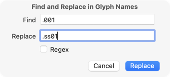
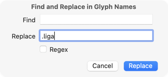

原文: [Batch renaming](https://glyphsapp.com/learn/batch-renaming)
# 一括リネーム

チュートリアル

Rainer Erich Scheichelbauer著

[ en ](https://glyphsapp.com/learn/batch-renaming) [ fr ](https://glyphsapp.com/fr/learn/batch-renaming) [ zh ](https://glyphsapp.com/zh/learn/batch-renaming)

2022年8月1日 2012年6月15日公開

たくさんのグリフ名を変更する必要がありますか？とても簡単なので、なぜいつもこの方法を使わなかったのか不思議に思うほどです。

## 置換

多くのグリフ名を変更する必要があるときは、*編集 > 検索 > 検索して置換*（Cmd-Shift-F）があります。このメニュー項目を呼び出すと、次のダイアログが表示されます。

これは他のアプリケーションの*検索と置換*と全く同じように機能しますが、Glyphsではこの機能が選択されたすべてのグリフの名前に適用される点が異なります。

簡単な例を挙げます。すべての大文字に対してスタイルセットの代替を用意したいと想像してください。フォント内でAからZまでのすべての文字をコピー＆ペーストするだけです。Glyphsは`A.001`から`Z.001`という名前のコピーを作成します。次に、それらの`.001`の文字を選択し、*検索して置換*ダイアログを呼び出します。そこで、`.001`を検索し、`.ss01`に置き換えます。これで完了です。

## 接尾辞の追加

このダイアログには隠れた追加機能があります。もし一連のグリフに接尾辞を*追加*したいだけなら、*検索*フィールドを空欄にして、置換フィールドに目的の接尾辞を入力するだけです。

デフォルトでは、Glyphsはほとんどの合字を`dlig` OpenTypeフィーチャーに入れます。しかし、すべての合字を`liga`フィーチャーに入れたいとします。合字を選択し、*検索して置換*を選び、*置換*フィールドに「.liga」と入力して*置換*ボタンを押すだけです。あとはフォント情報ウィンドウでフィーチャーコードを再コンパイルすれば、残りはGlyphsが面倒を見てくれます。クールですね。

最後の簡単なヒントです。特定の接尾辞を持つすべてのグリフを素早く選択するには、フォントビューの左上にある検索フィールド（Cmd-F）に接尾辞を入力するだけです。すべての合字を見たいですか？アンダースコア（「_」）を検索してください。

### 旧バージョン

古いバージョンのGlyphsでは、検索フィールドはフォントビューの右下にありました。

## 正規表現

*Regex*チェックボックスに気づきましたか？これにより、*正規表現*を使って検索と置換ができます。正規表現は検索と置換の究極のテクニックであり、これでクールなことができます。2つの例を挙げましょう。

### 検索文字列の一部を保持する

すべての`.cvXX`グリフを`.ssXX`の接尾辞に切り替える必要があると想像してください。つまり、`.cv01`は`.ss01`に、`.cv02`は`.ss02`に、という具合です。正規表現を使わずに、単に`cv`を検索して`ss`に置換することもできますが、それでは他の場所で意図しないグリフ名が置換されてしまう可能性があります。

そこで正規表現の出番です。正規表現を使えば、「`.cv`に続く2桁の数字を探し、それを`.ss`と全く同じ2桁の数字に置き換える」と言うことができます。方法は次の通りです。Cmd-Shift-Fで*検索して置換*ダイアログを表示し、*Regex*チェックボックスをオンにします。次に、*検索*フィールドに次のように入力します。

    \.cv(\d\d)

ここで、`\.`はリテラルなドット（つまり、文字としてのドットそのもの）を意味します。*検索*表現では（置換表現では違います）、`.`は「任意の文字」という特別な意味を持ちます。そのため、先行するバックスラッシュでそれを「エスケープ」します。括弧`( )`は、検索と置換ダイアログがこの部分を置換のために記憶することを意味します。囲まれた`\d\d`は2桁の数字を意味します。ここまでは理にかなっていますね。次に進みましょう。*置換*フィールドに、次のように入力します。

    .ss\1

ここで、ドットは単なるドットを意味します。置換文字列では、検索文字列を何に置き換えるかを指示しているだけなので、ここでドットをエスケープする必要はありません。最後に、`\1`は「検索文字列の最初の括弧表現」を意味します。この場合、それは上で丸括弧の間に入れた2桁の数字です。

これにより、検索文字列の括弧で囲まれた部分が置換のために再利用されます。そして`\d`を使えば、検索語は*任意*の数字に適用されます。こうすることで、私たちの検索と置換はより一般的、より抽象的、あるいはコーダーが好んで言うところの、より*正規*になります。これが「正規表現」という言葉の由来です。

### 接尾辞の順序を変更する

正規表現でよく行われるもう一つのことは、グリフ名の一部、例えば接尾辞の順序を変更することです。`.liga.loclNLD`で終わるグリフがいくつかあり、接尾辞を逆の順序にする必要があるとします。方法は次の通りです。*検索*フィールドに、次のように入力します。

    (\.liga)(\.loclNLD)

ここには本当に新しいことはありません。ただ、今回は*2つ*の括弧表現があるだけです。エスケープされたドットはすでに知っていますね。さて、ここからが面白い部分です。*置換*フィールドに、次のように書きます。

    \2\1

これは、*検索*フィールドの2番目の表現を取り、それに*検索*フィールドの最初の表現を続ける、という意味です。物事の順序を変えるのはとても簡単です。

そして`.liga.loclNLD`は`.loclNLD.liga`に変わります。これを`(.liga)(.locl[A-Z]{3})`のように、より抽象的に行うとさらに面白くなります。これは任意の大文字`[A-Z]`が3回繰り返される`{3}`ものにマッチし、したがって任意のISO言語コードを捉えることができます。

検索語の一部を繰り返すこと、そして名前の部分の順序を変更すること、この2つのシナリオが、グリフ名で検索と置換を行う際に*Regex*を使用する最も頻繁なシナリオかもしれません。もちろん、正規表現でできることはもっとたくさんあります。ここでは表面をなぞったにすぎません。ウェブ上には正規表現に関する無数のリソースがあるので、[このようなチートシート](https://quickref.me/regex)を手元に置いておくと良いでしょう。しかし、実際にはいつでもウェブ検索するだけで十分です。

---

更新履歴 2022-07-19: タイトル、関連記事、軽微なフォーマットを更新。

更新履歴 2022-07-25: スクリーンショットを更新。

更新履歴 2022-08-01: 正規表現に関する章を追加。

## 関連記事

[すべてのチュートリアルを見る →](https://glyphsapp.com/learn)

*   ### [グリフ名を正しく設定する](getting-your-glyph-names-right.md)

チュートリアル