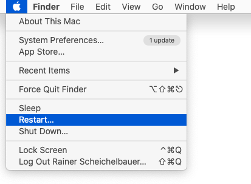

原文: [Cannot download or update Glyphs?](https://glyphsapp.com/learn/cannot-download-or-update-glyphs)
# Glyphsをダウンロードまたはアップデートできませんか？

チュートリアル

[ トラブルシューティング ](https://glyphsapp.com/learn?q=troubleshooting) [ インストール ](https://glyphsapp.com/learn?q=installation) [ Glyphs Mini ](https://glyphsapp.com/learn?q=glyphs+mini)

Rainer Erich Scheichelbauer著

[ en ](https://glyphsapp.com/learn/cannot-download-or-update-glyphs) [ fr ](https://glyphsapp.com/fr/learn/cannot-download-or-update-glyphs) [ zh ](https://glyphsapp.com/zh/learn/cannot-download-or-update-glyphs)

2020年12月15日 2020年3月26日公開

Safariがサーバーに到達できませんか？サイトにアクセスできませんか？Glyphsがアップデートしませんか？_ウィンドウ > プラグインマネージャー_が空のままですか？これを修正し、ダウンロードを再び機能させる方法をご紹介します。

### 直接ダウンロードリンクを試す

アップデートサーバーからアプリをダウンロードできるはずです。

これらのリンクを直接試してください。もしダウンロードできず、ブラウザにエラーメッセージが表示される場合は、以下の手順をいずれかが機能するまで試してください。

### 破損したhostsファイルを修正する

私たちの経験上、アプリをアップデートできない、またはダウンロードできない最も可能性の高い原因は、破損した_ホストデータベース_ファイルです。ご存知かもしれませんが、これは`/etc/hosts/`にあるテキストファイルで、一部の悪質な「ヘルパー」ツールが時々これをいじることがあります。これを修正するには、Terminal.appでこの一行を実行し、パスワードを求められたら入力するだけです。

    sudo sed -i '' '/glyphsapp/d' /etc/hosts

Terminal.appに慣れていないため、その方法がわからない場合は、手取り足取り教えましょう。次の手順に従ってください。

1.  上記の一行を選択してクリップボードにコピー（Cmd-C）します。
2.  Terminal.appに移動し、必要であれば新しいタブを開きます（Cmd-T）。
    *   Terminal.appの場所がわからない場合：Spotlight検索を開き（デフォルトではCmd-スペース、キーボードショートカットを変更していなければ）、`term`...と入力してReturnキーを押します。
3.  コピーした行をターミナルに貼り付けます。このようになるはずです（あなたの場合、_mekkablue_ではなく、あなた自身のユーザー名が表示されます）。

4.  Returnキーで入力を確定すると、パスワードを求められます。このようになります。

5.  ここでMacのパスワードを入力します。**注意：他の場所でパスワードを入力するときのようなパスワードの弾丸（•••）は表示されません。それでOKです。** それがターミナルでのパスワードの仕組みです、それだけです。「ブラインドで」入力する必要があります。つまり、すでに何キー押したかを示す表示なしで入力し、Returnキーを押して確定します。
6.  すべてが正しく行われれば、静かにその仕事をし、ターミナルは次のコマンドを待ちます。

この後、ログアウトして再度ログインするか、もっと良いのはMacを再起動することです。

これでうまくいきましたか？おめでとうございます、これで完了です。Glyphsを楽しんでください。ただし、次のセクションのヘルパーアプリについては考えてみてください。

### 「ヘルパー」アプリを取り除く

システムメンテナンスツール、システムオプティマイザ、アンチウイルスツールを使用していますか？Avast、CleanMyMac、MacCleanerなどでしょうか？

**それらをアンインストールしてください。**

いえ、本気です。それらを捨て去ってください。

これらの「ツール」のほとんどはMac上では完全に無用です。実際、そのほとんどが_マルウェアそのもの_です。この種のソフトウェアのベンダーは、もちろん、あなたを怖がらせて、あらゆる種類のたわごとを言い、驚くことに、彼らのツールがあなたのMacを「保護」すると言うでしょう。そんなくだらないものに騙されないでください。真実は、Macにはウイルスは存在せず、macOSはそれ自身でうまくやっていける非常に優れたオペレーティングシステムであるということです。ヘルパーもオプティマイザもメモリクリーナーも、その他人々があなたに売りつけようとするどんなものも、全く必要ありません。_全く_です。

言うまでもなく、マルウェアのベンダーは、私が今言ったことは「神話」だと主張するでしょう。それに騙されないでください。Macでそのようなツールを使用して利益を得るシナリオは思いつきません。私のアドバイス：これらのメンテナンスアプリやアンチウイルスアプリをすべて取り除いてください。それらが可能なことは、物を壊すことだけです。

よくある容疑者：

*   **CleanMyMac：** Glyphsを壊すことが知られています。アプリを「管理」するふりをする機能がありますが、実際にはアプリの機能を台無しにして壊します。CleanMyMacをアンインストールし、Macを再起動し、Glyphsを再ダウンロードして再インストールしてください。
*   **Avast**（またはMac上の他のどのアンチウイルスアプリでも）：私が見たことがあるのは、Macを遅くすること、時には非常に遅くすることだけで、すべてのアクションで回転するビーチボールが表示されるほどです。ウイルスを見つけたり、脅威を「ブロック」したと教えてくれるので、ソフトウェアの使用について良い気分になるかもしれませんが、それはナンセンスです。Avastをアンインストールし、Macを再起動し、Glyphsを再ダウンロードして再インストールしてください。
*   **MacCleaner：** まっすぐなマルウェアで、インターネット接続をハイジャックし、彼らの広告ページにリダイレクトします。私はそれを少なくとも不道徳だと思います。完全に機能するMacを再び手に入れたいなら、それを取り除き、Macを再起動し、Glyphsを再ダウンロードして再インストールしてください。
*   **Little Snitch：** 実際にはマルウェアではありません。しかし、使い方を知らなければ、物を壊すこともあります。Glyphs.appからの_すべての接続を許可_し、`updates.glyphsapp.com`と`glyphsapp.com`へのすべての接続を許可してください。その方法がわからない場合は、Little Snitchをアンインストールし、Macを再起動し、Glyphsを再ダウンロードして再インストールしてください。

もう一度強調させてください。これらのアプリのいずれか、または複数を使い続けると、_必ず_問題に直面します。それらを取り除かない限り、私たちはあなたを助けることができません。真面目な話です。

長々と失礼しました。

### インターネット接続を確認する

その通りです。インターネット接続を確認しましょう。

*   ウェブサイトはまだ開きますか？
*   他のサイトから他のアプリやzipファイルをダウンロードできますか？

これらの質問のいずれかに_いいえ_の場合：別の方法で接続してください。現在の接続は不十分であるか、特定のファイルタイプのダウンロードをブロックしています。
両方に_はい_の場合、次の質問です。

*   Macの別のユーザーでアプリをダウンロードできますか？

_はい_の場合、あなたのユーザーの設定に何か問題があります。ブラウザの環境設定を削除することを検討してください。Shiftキーを押しながら再起動してキャッシュをリセットし、キーを押さずに再度再起動することを検討してください。
_いいえ_の場合、次の質問です。

*   別のMacでアプリをダウンロードできますか？

はいの場合、あなたのマシンの設定に何か問題があります。最初のステップでhostsファイルを修正しましたか？そのステップをもう一度試してみてください。Macを再起動するのを忘れないでください。それでもうまくいかない場合は、読み進めてください。

### 不正なDNSサーバー

再起動してもまだダメですか？DNSサーバーを`1.1.1.1`、`8.8.8.8`、または`8.8.4.4`に変更して、もう一度試してください。方法は次のとおりです。

1.  _システム環境設定_を開きます。
2.  システム環境設定で、_ネットワーク_を開きます。
3.  ネットワークで、右下隅にある_詳細_ボタンをクリックします。
4.  表示されるダイアログシートの上部で、_DNS_というタブを選択します。
5.  _DNSサーバー_というタイトルのフィールドの下にある_プラスボタン_をクリックします。
6.  エントリーとして`1.1.1.1`を追加し、Returnキーを押して確定します。
7.  OKボタンを押してダイアログシートを確定します。
8.  環境設定ペインに戻り、_適用_を押します。

これでうまくいくか試してみてください。うまくいかない場合は、Macを再起動してみてください。それでもうまくいかない場合は、同じプロセスをもう一度行いますが、ステップ6で代わりに`8.8.8.8`または`8.8.4.4`を使用します。再度、Macを再起動することを検討してください。

> 背景知識：[1.1.1.1の背景にある物語](https://blog.cloudflare.com/announcing-1111/)と[Google DNSサーバー8.8.8.8と8.8.4.4について](https://developers.google.com/speed/public-dns)を読む。

### フォーラムで報告する

これまでに何も機能しない場合は、本当に、本当に珍しいことです。申し訳ありません。Terminal.appで次のコマンドを実行し、その結果を[フォーラム](https://forum.glyphsapp.com)で報告してください。

    ping -o updates.glyphsapp.com
    dig updates.glyphsapp.com
    curl -I https://updates.glyphsapp.com/

> ヒント：3行すべてを一度にコピー（Cmd-C）し、Terminal.appに切り替え、新しいターミナルタブ（Cmd-T）に貼り付け（Cmd-V）、Returnキーを押し、数秒待って完了したら、すべてを選択（Cmd-A）し、その内容を新しいフォーラム投稿に貼り付けます。入力フィールドのコードオプションでフォーマットすることを忘れないでください。そうすると読みやすくなります。

そこで私たちが助けます。使用しているmacOSのバージョン（Sierra？High Sierra？Mojave？Catalina？）とハードウェア（どのiMacやMacBookなど）を忘れずに指定してください。

参考までに、結果は次のようになります。

    mekkabook-air:~ mekka$     ping -o updates.glyphsapp.com

    PING updates.glyphsapp.com (172.104.142.40): 56 data bytes
    64 bytes from 172.104.142.40: icmp_seq=0 ttl=51 time=25.713 ms
    --- updates.glyphsapp.com ping statistics ---
    1 packets transmitted, 1 packets received, 0.0% packet loss
    round-trip min/avg/max/stddev = 25.713/25.713/25.713/0.000 ms

    mekkabook-air:~ mekka$     dig updates.glyphsapp.com

    ; <<>> DiG 9.10.6 <<>> updates.glyphsapp.com
    ;; global options: +cmd
    ;; Got answer:
    ;; ->>HEADER<<- opcode: QUERY, status: NOERROR, id: 8784
    ;; flags: qr rd ra; QUERY: 1, ANSWER: 1, AUTHORITY: 0, ADDITIONAL: 1

    ;; OPT PSEUDOSECTION:
    ; EDNS: version: 0, flags:; udp: 4096
    ;; QUESTION SECTION:
    ;updates.glyphsapp.com.     IN  A

    ;; ANSWER SECTION:
    updates.glyphsapp.com.  3521    IN  A   172.104.142.40

    ;; Query time: 182 msec
    ;; SERVER: 83.169.184.33#53(83.169.184.33)
    ;; WHEN: Thu Mar 26 22:33:23 CET 2020
    ;; MSG SIZE  rcvd: 66

    mekkabook-air:~ mekka$     curl -I https://updates.glyphsapp.com/

    HTTP/2 403
    server: nginx
    date: Thu, 26 Mar 2020 21:33:23 GMT
    content-type: text/html; charset=utf-8
    content-length: 162
    strict-transport-security: max-age=15768000; includeSubDomains; preload;
    x-frame-options: SAMEORIGIN
    x-content-type-options: nosniff
    x-xss-protection: 1; mode=block

    mekkabook-air:~ mekka$

いくつかの単語は異なりますが（特に、日付、時刻、コンピュータ名、ログイン名）、その間の部分はだいたい同じはずです。あなたの結果と比較することで、すでに手がかりが得られるかもしれません。しかし、フォーラムで私たちに見させてください。そこで私たちが助けます。

---

更新履歴 2020-04-02: 文法の軽微な修正、DNSのスクリーンショットとDNSサーバーに関する背景リンクを追加。

更新履歴 2020-07-29: 最初の段落にプラグインマネージャーの参照を追加、Glyphs Miniタグを追加。

更新履歴 2020-12-16: Glyphs 3のリンクを追加、軽微な変更。

## 関連記事

[すべてのチュートリアルを見る →](https://glyphsapp.com/learn)

*   ### [Glyphsライセンスのインストール方法](how-to-install-your-glyphs-license.md)

チュートリアル

[ インストール ](https://glyphsapp.com/learn?q=installation)

*   ### [すべてのユーザーにGlyphsをインストールする](install-glyphs-for-all-users.md)

チュートリアル

[ インストール ](https://glyphsapp.com/learn?q=installation)