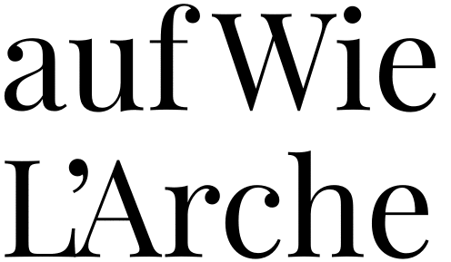
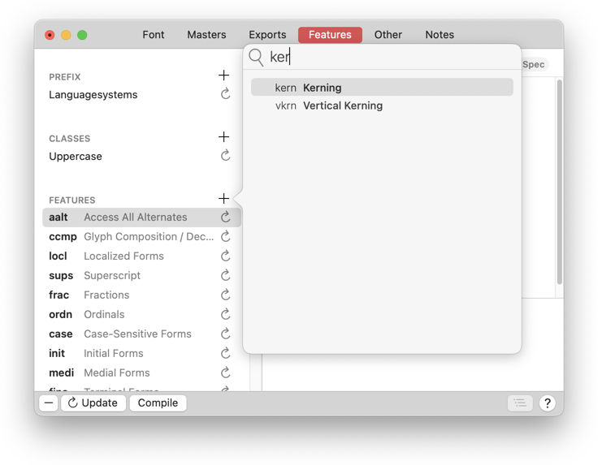
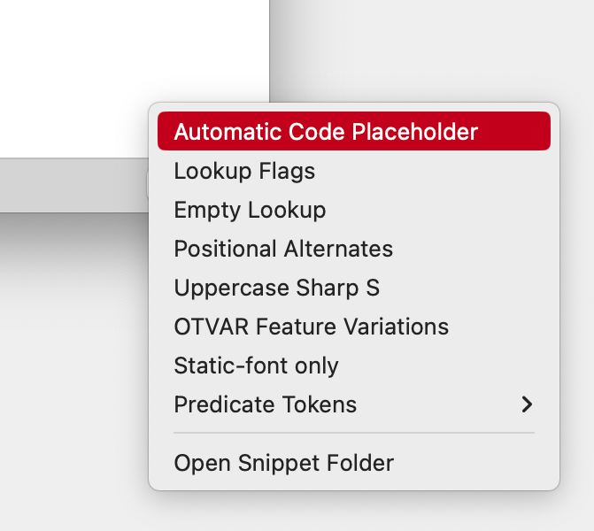
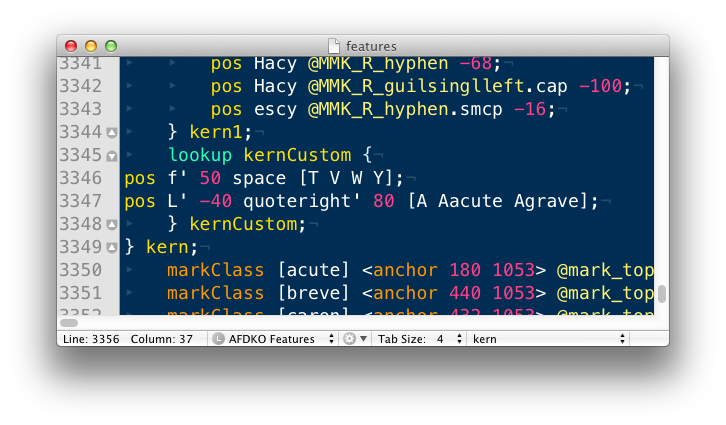

原文: [Contextual kerning](https://glyphsapp.com/learn/contextual-kerning)
# 文脈に応じたカーニング

チュートリアル

[ Opentype Features ](https://glyphsapp.com/learn?q=opentype+features)

Rainer Erich Scheichelbauer著

[ en ](https://glyphsapp.com/learn/contextual-kerning) [ fr ](https://glyphsapp.com/fr/learn/contextual-kerning) [ zh ](https://glyphsapp.com/zh/learn/contextual-kerning)

2024年3月22日 2013年4月10日公開

Glyphsは、独自の文脈に応じたカーニングを別のOpenTypeフィーチャーに追加する賢い方法を提供します。注意：かなり高度なレベルです。

さて、グリフの[サイドベアリングを最適化](spacing.md)し、必要な箇所に[カーニングペアを追加](kerning.md)しました。しかし、それでも特定のグリフの3文字組で、文字間の空白がまだ最適でない場合があります。

よくある問題児がいます。例えば、負のRSBを持つグリフの後にスペース、そして負のLSBを持つグリフが続く場合、`f space T`、`f space V`、`f space W`などです。これらの場合、単語間のスペースは周囲の負のサイドベアリングによって食われてしまいます。読者には、スペースを忘れたように見えるかもしれません。そのため、空白を少し増やす必要があります。

あるいは、`L quoteright A`の3文字組を考えてみましょう。アポストロフィ（ここでは`quoteright`がアポストロフィとして使われると仮定します）は通常、Aに近すぎてLから遠すぎることになります。これを修正する必要があります。

典型的な3文字組には、通常、スペース、句読点、引用符が含まれます。`period quoteright space`のようなものです。また、必ずしも3文字組だけでなく、`f period space V`のような4文字組も考えられます。もちろん、デザインによって必要となる組み合わせは大きく異なります。どの組み合わせが必要かを見つける唯一の方法は、あなたの書体で長いテキストを組んでみて、できればさまざまな言語で多くの句読点を含むものを使い、空白が乱れているように見える箇所を探すことです。

## 文脈に応じたカーニングのルックアップ

`kern`フィーチャーの出番です。Glyphsは、あなたが作成したすべてのカーニングペアを使用して、書き出し時にこれを自動的に作成します。さて、既存のカーニングに*さらに*追加のカーニングを加えるには、`kern`フィーチャーに別のルックアップを追加します。方法は？`kern`というフィーチャーを追加するだけです。

そのためには、*ファイル > フォント情報 > フィーチャー*に行き、ウィンドウの左サイドバーにあるフィーチャーの隣のプラスボタンをクリックして`kern`という新しいフィーチャーを追加します。コードでは、まず*自動コードプレースホルダー*を追加します。これは、*フィーチャー*ウィンドウの右下にある*スニペット*メニューから行うのが最適です。

これにより、次のコード片が追加されます。

    # Automatic Code

これは、*ウィンドウ > カーニング*にあるものから派生した、自動生成されたkernフィーチャーを表します。したがって、この方法で、Glyphsにコードを自動コードの前または後に追加するように指示できます。通常は後に追加したいので、このプレースホルダーがコードの最初の行になります。

さて、`f space`を含む3文字組と、フランス語やイタリア語などの言語で重要な`L quoteright A`の組み合わせを修正したいと仮定しましょう。オーケー、`kern`に入れるのはこれです。

    # Automatic Code
    pos f' 50 space [T V W Y];
    pos L' -40 quoteright' 80 [A Aacute Agrave];

最初の行は、fの後に単語スペースが続くものを探しますが、それはT、V、W、Yの前にある場合に限られます。その場合にのみ、`f space`ペアに追加の空白50ユニットが与えられます。

2行目は、Lの後にアポストロフィ、そしてアクセント付きまたはなしのAが続くものを探します。その場合、アポストロフィはLの中に40ユニット押し込まれ、アポストロフィとAの間のスペースは80ユニット増加します。これにより、アポストロフィがLに近づき、LとAの間のスペースが増え、互いに衝突するのを防ぎます。

これは、[マークされたサブランを持つ連鎖的な文脈依存の位置決め](http://www.adobe.com/devnet/opentype/afdko/topic_feature_file_syntax.html#6.h)と呼ばれます。AFDKOのフィーチャーコーディングに精通しているなら、位置決めルールの構造に驚くかもしれません。カーニング値は行の末尾ではなく、影響を受けるグリフの名前の間に直接配置されます。また、他の文脈依存ルールと同様に、一部のグリフは「ダムクォート」でマークする必要があります。この場合、カーニング値が続くすべてのグリフをマークする必要があります。

## カーニング値の補間

[Glyphs 3.1.1以降](https://glyphsapp.com/news/glyphs-3-1-1-released)、フィーチャーコード内の数値を補間できます。仕組みは簡単です。カーニング値の後に、括弧で囲んだデザインスペース内の追加座標（例：`(wdth:150)`）を指定し、そのデザインスペース座標でのカーニング値を続けます。これを見てください。

    # Automatic Code
    pos f' 50 (wdth:150) 95 space [T V W Y];

上記のコードは、原点マスターにおいて、`f`が`space`に続き、その後に`[T V W Y]`のいずれかのグリフが続く場合、`f`に追加のスペース`50`ユニットが与えられることを意味します。拡張スタイル、つまりデザインスペース座標`(wdth:150)`では、その同じ追加スペースは50ではなく`95`になります。そして、最も素晴らしいのは、幅軸に沿ってこの値がすべてのインスタンス、さらにはバリアブルフォントに対しても補間されることです。かなりクールですね。

### プロのヒント

追加のデザインスペース座標は、マスターと一致する必要はありません。ただし、少なくとも一つの軸上で、矩形配置に保つのが良い考えです。

もう一歩進めてみましょう。複数の軸がある場合はどうでしょうか？これも簡単です。問題のカーニング値を持つ複数のデザインスペース座標の系列を指定するだけです。このように。

    # Automatic Code
    pos f' 50 (wdth:150) 20 (wdth:150 wght:220) 70 (wdth:100 wght:220) 70 space [T V W Y];

もし分かりやすくなるなら、このように再フォーマットすることもできます。

    # Automatic Code
    pos f' 50
      (wdth:150) 20
      (wdth:150 wght:220) 70
      (wdth:100 wght:220) 70
    space [T V W Y];

同じことです。

## 技術的な詳細

内部的には、Glyphsは`kernCustom`というルックアップを`kern`フィーチャーの末尾に追加します。

マークされたグリフのシーケンス、つまり「マークされたサブラン」は、マークされていないグリフによって中断されてはなりません。つまり、`x x' x' x' x`は可能ですが、`x' x' x x' x'`は不可能です。そうしないと、「Unsupported contextual GPOS target sequence: only one run of marked glyphs is supported」というエラーが発生します。

そして、通常のカーニングと文脈に応じたカーニングを混在させることはできません。なぜなら、これらは2つの異なるルックアップタイプだからです。もし混在させると、「Lookup type different from previous rules in this lookup block」というエラーが表示されます。

## 欠点

私たちのルックアップは、書き出し時に各インスタンスに注入されるフィーチャーコードなので、文脈に応じたカーニングは補間されません。しかし、それは通常、大した問題ではありません。追加の文脈に応じたカーニングは、すでに持っている他のカーニングペアを置き換えるのではなく、それらの上に追加されることを覚えておいてください。

通常の、文脈によらないカーニングを除いて、Glyphsは編集ビューで`GPOS`のプレビューを提供しません。これは、文脈に応じたカーニングを行う私たちにとっては不運です。しかし、簡単な回避策が2つあります。

1.  *ウィンドウ > テキストプレビュー*を開き、インスタンスとフォントサイズを選択して、入力します。テキストプレビューは、マークの位置決めやあらゆる種類のカーニングを含むGPOSをサポートしています。実際に、あなたが見ているのはAppleのCoreTextによってレンダリングされた、本物の書き出しです。
2.  [フォントをAdobe Fontsフォルダに書き出し続ける](testing-your-fonts-in-adobe-apps.md)だけで、InDesignでカーニングの3文字組、4文字組、5文字組をすぐにテストできます。結局のところ、人々がそれを使う場所で重要になるのですから。

サンプルフォント：[PLAYFAIR DISPLAY](http://www.google.com/webfonts/specimen/Playfair+Display)、CLAUS EGGERS SØRENSEN氏提供。

---

更新履歴 2020-01-08: フォント情報メニューのエントリを修正（@Galifer氏に感謝）。

更新履歴 2020-03-30: 誤字を修正。

更新履歴 2022-07-25: タイトル、関連記事、軽微なフォーマットを更新。

更新履歴 2023-04-26: 「カーニング値の補間」と自動コードプレースホルダーを追加。

更新履歴 2024-03-22: プレビューオプションとしてテキストプレビューを追加。

## 関連記事

[すべてのチュートリアルを見る →](https://glyphsapp.com/learn)

*   ### [カーニング](kerning.md)

チュートリアル