原文: [Crashes](https://glyphsapp.com/learn/crashes)
# クラッシュ

チュートリアル

[ トラブルシューティング ](https://glyphsapp.com/learn?q=troubleshooting)

Rainer Erich Scheichelbauer著

[ en ](https://glyphsapp.com/learn/crashes) [ fr ](https://glyphsapp.com/fr/learn/crashes) [ zh ](https://glyphsapp.com/zh/learn/crashes)

2021年2月5日 2017年3月3日公開

アプリケーションのクラッシュに悩まされていますか？問題をできるだけ早く修正するために、あなたが私たちに協力できることをご紹介します。

## クラッシュレポートを送信する

クラッシュ後、_2つ_のクラッシュレポートダイアログが表示されます。1つ目はmacOSによって提供され、クラッシュ直後に表示されます。こちらは気にしません。_再オープン_をクリックしてGlyphsを再起動してください。

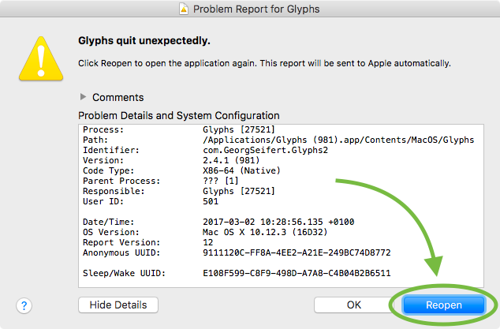

Glyphsが再起動すると、2つ目のダイアログが表示されます。今回はGlyphs（またはGlyphs Mini）のロゴが付いています。このような見た目です。

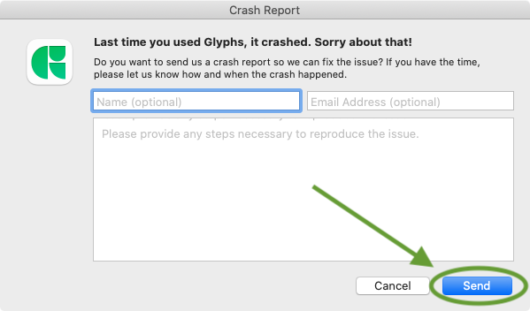

こちらが私たちが気にするものです。どうか、_常に_こちらを送信してください。_常に、常に、常に_です。送れば送るほど良いです。ゆっくり繰り返します。**い…つ…も**、左上にGlyphsのアイコンがあり、ダイアログウィンドウの右下に_送信_ボタンがあるレポートを送信してください。まだ迷っている方のために、あらゆる状況を網羅した便利な図を用意しました。

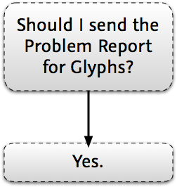

そして、メールアドレス欄に入力していただければ、こちらからご連絡することができます。一度入力すれば、次回からはダイアログが情報を記憶してくれます。時には、ファイル内の問題に関連しているのではないかと疑うことがあります。しかし、もちろん、クラッシュレポートはあなたのファイルからのデータを送信しませんし、実際に何がクラッシュを引き起こしたのか私たちにはわかりません。ですから、ダイアログで連絡先情報を提供していただければ、Glyphsサポートから、クラッシュ時に作業していたファイルのコピーを求めるメールが届く可能性があります。もしファイルを送っていただけるか、あるいは問題を引き起こしているグリフだけでも送っていただければ、何が悪かったのかを突き止め、問題を修正するのがずっと簡単になります。

クラッシュを確実に再現できますか？言い換えれば、クラッシュを引き起こすために何をすればよいか正確にわかりますか？どうか、少なくとも一度、クラッシュを再現するための手順を説明してください。これは非常に重要です。なぜなら、クラッシュを引き起こす方法がわかれば、非常に迅速に修正できるからです。

## アプリを再起動し、ファイルは再オープンしない

クラッシュ後もフォントの作業を続けたいですか？単にアプリを再起動することをお勧めします。これは、クラッシュレポートダイアログの_再オープン_ボタン、またはDockのGlyphsアイコンをクリックすることで行えます。Glyphsが起動し、クラッシュ時に開いていたすべてのファイルを、可能な限り最新の状態で再オープンしようとします。もし開かない場合は、_ファイル > 最近使った項目を開く_メニュー項目を使ってフォントファイルを再オープンしてください。

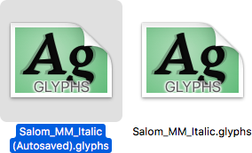

`.glyphs`ファイルの隣にある_Autosaved_コピーには触れないでください。これは、システムが最後のファイル状態を再現するために保持しているコピーです。いじらないでください。（唯一の例外は、元のファイルが破損した場合の最後の手段として使用し、その場合はコピーを作成して名前を変更してから開いてください。）

## 最新の最先端バージョンにアップデートする

もしかしたら、アプリのクラッシュを引き起こす問題は、最新のベータ版ですでに修正されているかもしれません。最新のバージョンをインストールする方法は次の通りです。_Glyphs (Mini) > 環境設定 > アップデート_に進み、_最先端のバージョンを表示_オプションがチェックされていることを確認し、_今すぐ確認_ボタンをクリックします。

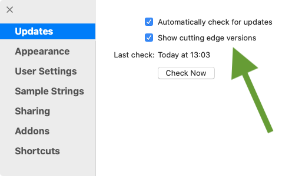

「すでに最新です」というダイアログが表示されるか、新しいバージョンが利用可能であるという通知が表示されます。その場合は、すべてのファイルが保存され、バックアップされていることを確認し、_インストール_ボタンをクリックし、求められたらアプリを再起動してください。

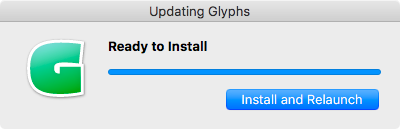

問題は解決しましたか？おめでとうございます、これで万事解決です。まだ問題はありますか？どうか、クラッシュレポートを送り続けてください。

ベータ版の実行に不安を感じますか？最新の安定版に戻るには、いつでもこのウェブサイトの[アプリを入手ページ](/buy)からトライアルアプリを再ダウンロードできます。「トライアル？でもお金を払ったのに！」とおっしゃるかもしれません。心配しないでください。あなたのMacで開くと、ライセンスを自動的に認識してロックが解除されます。

## プラグインを無効にする

もしかしたら、問題はインストールした拡張機能に関連しているかもしれません。それを確かめるには、プラグインなしでGlyphsを実行します。最も簡単な方法は、OptionキーとShiftキーを押しながらアプリを起動することです。

### ヒント

Glyphs Miniは拡張機能をサポートしていないため、これはGlyphsユーザーにのみ適用されます。

> **注：** Glyphsの_バージョン2.5より前_では、OptionとShiftのトリックは機能しないため、_Plugins_フォルダの名前を変更してアプリを再起動する必要があります。_Plugins_フォルダにアクセスするには、_スクリプト > スクリプトフォルダを開く_（Cmd-Shift-Y）を選択します。Pluginsフォルダは_Scripts_フォルダのすぐ隣にあります。すべてのプラグインを一度に無効にするには、_Plugins_フォルダの名前を`Plugins OFF`のようなものに変更し、Glyphsを再起動します。
>
> 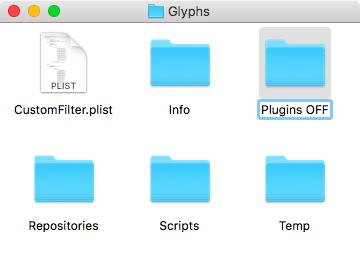

もしそれで問題が解決したら、プラグインの一つに深刻なバグがあります。すべてのプラグインを削除し、一つずつ、またはグループで再インストールしてください。毎回アプリを再起動し、問題が再発するか確認してください。もし再発すれば、おそらく原因を見つけたことになります。

どうか、開発者にそのことを知らせてください。もしGitHubからプラグインを入手したなら、そのプラグインのリポジトリに_GitHub Issue_を提出してください。内蔵の_ウィンドウ > プラグインマネージャー_からプラグインを入手したなら、GitHubリンクをクリックしてGitHubページにアクセスしてください。

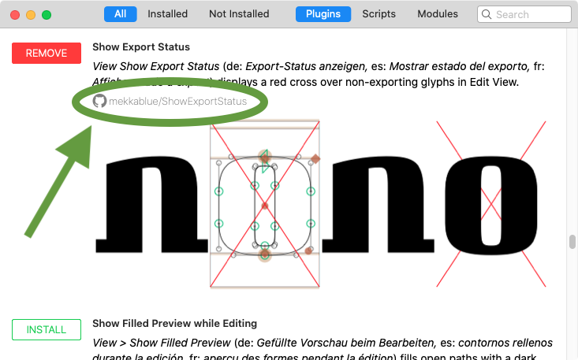

GitHubページで、_Issues_タブに切り替え、_New Issue_ボタンをクリックして新しいバグレポートや機能リクエストを提出します。

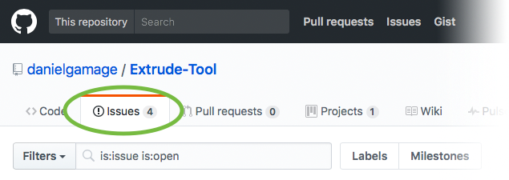

ヒント：開発者は、問題を再現するための手順を説明していただけると非常に喜びます。

## 別のドキュメントで試す

新しいファイル、または別のファイルのコピーでクラッシュを再現してみてください。もし問題が特定のファイルでのみ発生する場合、そのファイルに何か問題がある可能性があります。問題を[フォーラム](https://forum.glyphsapp.com)で説明し、可能であればファイルを送ることを申し出てください。私たちはすぐに回答するか、詳しく調査させていただきます。

あるいは、特定のグリフでのみ発生するのかもしれません。もし問題が特定のグリフに起因することが本当にわかるなら、パス、コンポーネント、アンカー、背景レイヤー、レイヤーコピーを確認してください。すべてをカット（Cmd-X）し、すぐにペースト（Cmd-V）し直してみてください。これにより、Glyphsはファイル内の情報を強制的に書き換えます。

## 環境設定を削除する

もう一つ試せることがあります。アプリの環境設定が破損している可能性があるので、Glyphsを起動する前にそれを削除してみましょう。Finderで、_移動 > フォルダへ移動…_（Cmd-Shift-G）を選択します。Glyphs Miniの場合は、このファイルの場所をダイアログにペーストします。

    ~/Library/Preferences/com.schriftgestaltung.GlyphsMini2.plist

Glyphs 2の場合：

    ~/Library/Preferences/com.GeorgSeifert.Glyphs2.plist

そしてGlyphs 3の場合：

    ~/Library/Preferences/com.GeorgSeifert.Glyphs3.plist

ダイアログは次のようになります。

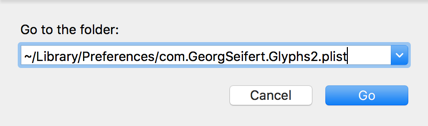

すべてがうまくいけば、Finderはアプリの環境設定を含む`.plist`ファイルに移動します。

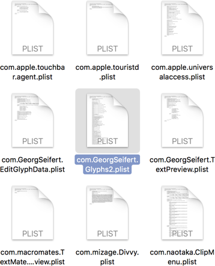

Cmd-Deleteを押してゴミ箱に移動し、アプリを再起動します。_Glyphs (Mini) > 環境設定_（Cmd-カンマ）を開いて、好みのアプリ設定を再作成する必要があるかもしれません。

## 自動保存を削除する

もしかしたら、アプリをクラッシュさせているのは、Glyphsを開くときに_自動的に開くファイル_かもしれません。もしそれがどのファイルかわかるなら、「(Autosave)」とマークされた重複ファイルを_削除_してみてください。

どのファイルかわからない場合は、Glyphsを終了し、次のフォルダに移動して見つかったすべての.glyphsファイルを削除します。

    ~/Library/Autosave Information/

そして、次のフォルダで、

    ~/Library/Saved Application State/

…`com.GeorgSeifert`で始まるものをすべて削除します。その後、アプリを再起動します。

## Terminal.appの奇跡の治療法

簡単な修正法：FinderのユーティリティフォルダからTerminal.appを開きます（Finderで_移動 > ユーティリティ_、Cmd-Shift-U）。次に、これらの行をTerminal.appにペーストし、Returnキーを押します。

    kill `pgrep Glyphs`
    rm "~/Library/Preferences/com.GeorgSeifert*"
    rm "~/Library/Preferences/com.schriftgestaltung*"
    rm "~/Library/Autosave Information/com.GeorgSeifert*"
    rm "~/Library/Saved Application State/com.GeorgSeifert*"

最初の行はアプリを終了させ、続く行は上記で説明したクリーンアップを行います。この後、GlyphsまたはGlyphs Miniを再起動するか、Macを再起動してください。

## フォーラム

まだうまくいきませんか？どうか、クラッシュレポートを送り続け、上記で説明したようにフォーラムで声を上げてください。

---

更新履歴 2017-03-04: 誤字を修正、フォルダ名の変更目的を明確化、軽微な表現の修正。

更新履歴 2017-05-14: 環境設定の削除に関するセクションを追加。

更新履歴 2018-01-17: プラグインをオフにして起動するためのOptionとShiftの同時押しを追加。

更新履歴 2018-11-12: 自動保存の削除に関するセクションを追加。

更新履歴 2021-02-05: Glyphs 3向けに更新。

更新履歴 2021-06-14: Terminalの奇跡の治療法を追加。