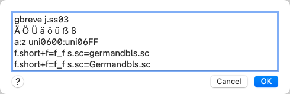
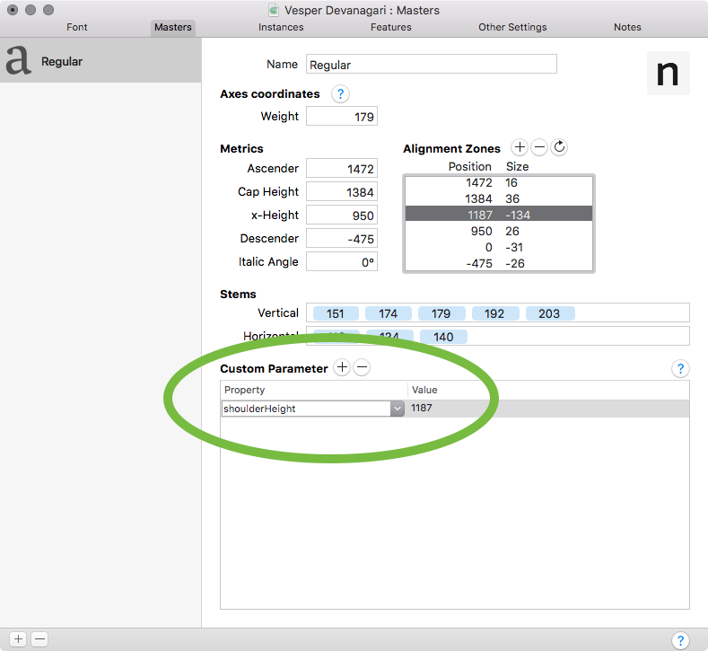
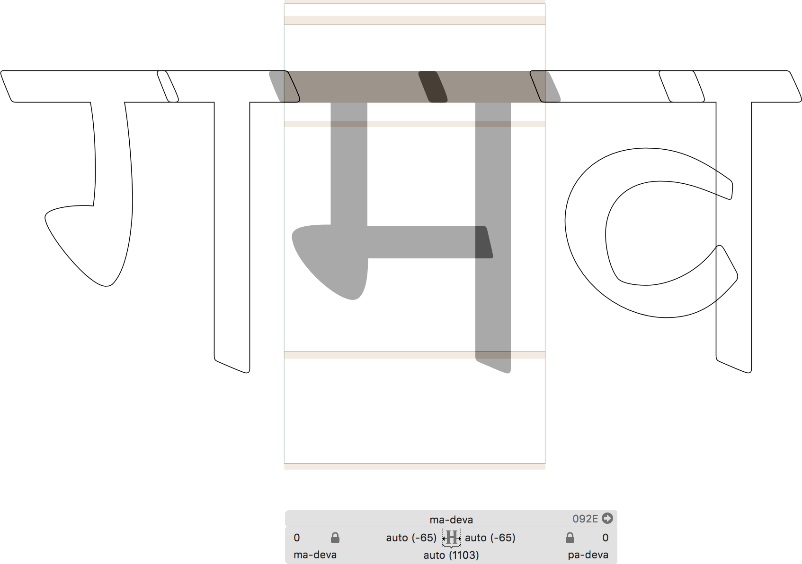
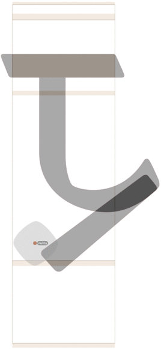

原文: [Creating a Devanagari font](https://glyphsapp.com/learn/creating-a-devanagari-font)
# デーヴァナーガリーフォントの作り方

チュートリアル

[ 言語 ](https://glyphsapp.com/learn?q=languages)

Kimya Gandhi & Rob Keller著

2022年7月29日 2018年2月7日公開

ヒンディー語、マラーティー語、ネパール語など多くの言語で使われるデーヴァナーガリーは、インドで最も広く使用されている文字です。デザイナーごとに独自のワークフローがあるかもしれませんが、このチュートリアルでは、Glyphsのクールな機能をすべて活用してデーヴァナーガリーフォントを構築するための、私たちがお勧めするステップバイステップのプロセスをご紹介します！

## デーヴァナーガリーフォントファイルの設定

Glyphsで新しいファイルを作成すると（*ファイル > 新規*、Cmd-N）、デフォルトでラテン文字のウィンドウが開きます。デーヴァナーガリーのグリフを追加するには2つの方法があります。一つは*グリフ > グリフを追加*（Cmd-Shift-G）から、もう一つはサイドバーの*言語 > デーヴァナーガリー*セクションからです。*デーヴァナーガリー*内のサブカテゴリを右クリックすると、各セクションに含まれるグリフのリストが表示され、そこからフォントに追加するものを選択できます。

すべてのデーヴァナーガリーグリフには、分かりやすいグリフ名と`-deva`という接尾辞が付いているのがわかります。これにより、アプリがグリフのスクリプトを判断し、後で適切なOpenTypeコードを自動的に構築することが可能になります。

## 最初のステップ

デーヴァナーガリー文字の最も基本的な要素である、`aaMatra-deva`に見られる縦画から始めましょう。これはデーヴァナーガリーの字形の最も基本的なプロポーションを定義し、ほとんどのグリフで使用されます。ですから、一度デザインして、それが必要な他のすべてのグリフでコンポーネントとして使用できれば素晴らしいでしょう。この文字は、サイドバーの*言語 > デーヴァナーガリー > 母音*の下にリストされています。または、Cmd-Shift-Gと入力し、表示されるダイアログで*aaMatra-deva*と入力して*生成*ボタンを押すことで手動で追加することもできます。

また、*ファイル > フォント情報 > マスター*（Cmd-I）で`shoulderHeight`カスタムパラメータを使ってショルダーラインの値を設定することもできます。これは、aaMatra-devaだけでなく、他の多くのグリフでもアンカーの配置に役立ちます。

### プロのヒント

*ファイル > フォント情報 > マスター*で、ヘッドライン全体の太さに対するアライメントゾーンを設定することもできます（ショルダーハイトから下に向かう負の値で）。これにより、私たちの*シロレカー（shirorekha）*が常に正しい太さであることを簡単に確認できます。

スペーシングについての注意点：デーヴァナーガリーは通常、*接続する*ヘッドラインを持つため、ヘッドラインを少し外側に伸ばして、サイドベアリングが負の値になるようにしたいと思うでしょう。ここで標準値を定義しておけば、後で多くのグリフにも適用されます。心配しないでください。後で気が変わっても、すべてを一度に更新するのは非常に簡単です。

## アンカーの設定

アンカーについて考え始めるのに早すぎることはありません。ほとんどの母音記号や抑揚記号は、縦のステムに対して同じ場所に配置されるため、`aaMatra-deva`にアンカーを追加するだけで、これをコンポーネントとして使用するすべてのグリフに自動的にコピーされます。`shoulderHeight`が定義されていれば、*グリフ > アンカーを設定*（Cmd-U）を実行するだけで、アンカーが正しい垂直方向の高さに自動的に追加されます。デザインによっては、水平方向に移動させる必要があるかもしれません。

### プロのヒント

コンポーネントでは、アンカーは元のグリフから「透けて」見えます。そのため、コンパウンドグリフにアンカーを設定する必要はありません。しかし、必要であれば、より上位のコンポーネントに同じ名前のアンカーを配置することで、これらのアンカーを上書きすることができます。

## 半子音とハーフフォームからコンポジットを構築する

さて、子音に必要なコンポーネントを準備しましょう。ほとんどの子音は、ハーフフォームが`aaMatra-deva`に接続されて構成されています。これらのハーフフォームは、完全な子音を形成するためだけでなく、固有母音`aaMatra-deva`が削除された2つ以上の子音の合字である合字（conjuncts）を構築するためにも使用されます（例：「pepper」= पेप्पर）。合字については後で詳しく説明しますが、まずは`pa-deva`のハーフフォームである`p-deva`をデザインしましょう。サイドバーの、その名も*Halfform*セクションからハーフフォームを追加すると良いでしょう。

完全な子音`pa-deva`を作成するには、そのグリフを生成し（*グリフ > グリフを追加…*、Cmd-Shift-G経由）、`p-deva`と`aaMatra-deva`をコンポーネントとして追加します。両方とも*グリフ > コンポーネントを追加*（Cmd-Shift-C）を選択します。配置に満足できない場合は、`p-deva`の右サイドベアリングを`aaMatra-deva`の隣で見栄えが良くなるように調整するだけで、`pa-deva`は自動的に完璧に一致するはずです。

このアプローチを使えば、基本的なデーヴァナーガリーの子音の多くをデザインできます。同じ方法でさらにいくつか追加してみましょう。

## 基本子音の完成

すべての子音がハーフフォームから構築できるわけではないことに気づくでしょう。例えば、`ka-deva`、`pha-deva`、`ha-deva`のようなグリフです。これらはカスタムデザインされた完全な形が必要です。このような場合、私たちは通常、まず完全な形を描き、それを基にハーフフォームを作成します。

また、通常のハーフフォームを持たない、垂れ下がる子音の小さなセットもあります：`tta-deva ttha-deva dda-deva ddha-deva da-deva nga-deva`。これらはハーフフォームになる代わりに、下部に「ハラント」（「ヴィラーマ」とも呼ばれます）が付きます。言い換えれば、今が`halant-deva`グリフを描くのに良い時期かもしれません。サイドバーの*言語 > デーヴァナーガリー > 記号*の下にあります。Cmd-Uを押してハラントにアンカーを付けるのを忘れないでください。

垂れ下がる子音とハラントがフォントに入ったら、残りの子音を作成できます。*グリフ > グリフを追加…*を選択し、これをペーストします。

    tt-deva tth-deva dd-deva ddh-deva d-deva ng-deva

次に*生成*を押します。つまり、末尾に`a`がない同じグリフ名です。Glyphsは賢いので、それぞれの垂れ下がる子音とハラントのコンパウンドとしてすぐに作成してくれます。

## 子音のスペーシングとカーニンググループ

編集ビューでテキストツール（T）に切り替えることで、グリフの[スペーシング](spacing.md)を始めることができます。`tta-deva`を`aaMatra-deva`の隣に配置してみましょう。

この段階で、`aaMatra-deva`を使用するすべての子音に対して、右の[カーニング](kerning.md)グループを定義することができます。左のグループについては、似たような左側のシェイプを特定し、それらも定義できます。ハーフフォームに対しても忘れずに行ってください。

### ヒント

`aaMatra-deva`を含むすべてのコンパウンドを素早く見つけるには、それを右クリックし、コンテクストメニューから*このグリフをコンポーネントとして使用しているすべてのグリフを表示*を選択します。

## 合字（Conjuncts）

合字は、デーヴァナーガリー文字を正しくレンダリングするために必要なもう一つの重要な要素です。これらを形成する方法は、デザインによって異なります。一般的に、ほとんどはハーフフォームと完全子音の組み合わせとして、水平/直線的に書くことができます。その他は、垂直に積み重ねられたり、より複雑な字形に組み合わされたりします。これらは「akhand 合字」と呼ばれます。

この比較では、いくつかの直線的な合字がデフォルトのハーフフォームでどのように構築され、その後、より良いクラスターを作るために変更されたカスタムバージョンがどのようになっているかを見ることができます。

2つ、3つ、4つ、あるいはそれ以上の子音の組み合わせを考えると、何千もの組み合わせが存在し得ます。サンスクリット語は多くの合字を必要とし、その多くはakhandの種類です。しかし、ヒンディー語、マラーティー語、その他の現代言語では、合字の使用頻度は低いです。したがって、高度なサンスクリット語をサポートする場合、デザインする必要のあるakhand合字の数は簡単に数千になる可能性があります。そのため、フォントの機能が文字セットを決定します。現代ヒンディー語、マラーティー語、シンド語、ネパール語などをサポートする場合、必要な合字の数はかなり少なくなる可能性があります。

何千もの可能な組み合わせをすべてデザインする代わりに、Glyphsでは、先にデザインしたハーフフォームと完全フォームから直線的な合字を自動的に構成することができます。どの、あるいはどれだけの直線的な合字をカスタムデザインするかは、デザインのスタイルと要件によって決まります。場合によってはほとんど必要ないこともあれば、たくさん必要なこともあります。簡単な方法はありません。すべての組み合わせをテストして、デフォルトで見栄えが良いものと、カスタムの直線的な合字を持つべきものを見分ける必要があります。

## OpenTypeフィーチャーの生成

先に触れたように、デーヴァナーガリーを正しくレンダリングするには、多くの複雑なOpenTypeコードが必要です。恐れることはありません。Glyphsはそれをすべて自動的に生成できます！*ファイル > フォント情報 > フィーチャー*（Cmd-I）を開きます。あとは*更新*ボタンを押すだけで、Glyphsはこれまでに作成したものをプレビューするために必要なすべてのOpenTypeコードを書き込みます。

まだ気づいていないかもしれませんが、編集ビューではCmd-Fを押すことで任意の文字を挿入できます。子音、ハラント、そして別の子音を挿入してみてください。次に、編集ビューの左下隅を見て、*フィーチャー*ボタンをクリックします。あなたの書体がサポートするフィーチャーと言語が、それぞれのスクリプトの下にリストされます。*デーヴァナーガリー*を選択して、OpenTypeコードが実際に動くのを見てみましょう。

## ra-devaの異なる形

さて、次は姿を変える文字Raに進みましょう。デーヴァナーガリーでは、Raはその文脈に応じて4つの異なる形を取ることができます。クラスターの最初にくる場合、それはRephになり、クラスター内の*最後の*完全子音の縦画の*上*に配置されます。

Raが縦画を持つ子音の後に置かれる場合、それは「脚」になり、*先行する*子音の縦画に取り付けられます。

しかし、待ってください、まだあります。Raが縦画のない子音と組み合わさると、Rakarになります。これは主に`tta_ra-deva ttha_ra-deva dda_ra-deva ddha_ra-deva cha_ra-deva`に適用されます。

しかし、待ってください、さらにあります！マラーティー語では、Raは「まつげ」の形を取ることもあります。

ふう！これらのバリエーションを簡単に振り返ってみましょう。

RephとRakarは簡単です。`reph-deva`と`rakar-deva`を作成し、シェイプを描き、Cmd-Uでアンカーを配置するだけです。ちなみに、`reph-deva`と`rakar-deva`はどちらもサイドバーの*言語 > デーヴァナーガリー > 記号*の下にあります。

「脚」の形の合字は、もう少し手間がかかります。まず、コンポーネントとして使用するために`rakar-deva.leg`（ドット接尾辞`.leg`に注意）をデザインしましょう。これはサイドバーにはないので、*グリフ > グリフを追加…*（Cmd-Shift-G）で手動で作成します。それができたら、その中に`_leg`アンカーを配置できます。キャンバスを右クリックし、コンテクストメニューから*アンカーを追加*を選択し、アンカー名を入力します。

この脚の形のRaは、クラスターの途中にも現れることがあります。そのために、「ハーフ合字」もデザインするべきです。デーヴァナーガリーにそのような概念は厳密には存在しませんが、これらの新しいグリフをコンポーネントとして利用することで、考えられるすべての順列を個別にデザインすることなく、動的に多数のカスタムルックの合字を作成できます。

`rakar-deva.leg`が自動的に子音に接続するようにするには、すべての半子音に`leg`アンカーを配置する必要があります。こうすることで、それらはハーフフォームだけでなく、完全フォームとの組み合わせとしても表示されます。その後、サイドバーから、または*グリフ > グリフを追加…*（Cmd-Shift-G）と手動で名前を入力して合字を生成できます。ただし、これらの合字の正しい命名は、Glyphsがコンパウンドを構築し、OpenTypeフィーチャーコードを自動生成するために不可欠なので注意してください。

Ra合字の命名法は、他の合字とは少し異なることに注意することが重要です。合字は見た目通りに命名します。テキスト`pa-deva halant-deva ra-deva`の場合、Ra（Raは脚の形をしていますが、それでもRaです）を持つ`pa-deva`が見えます。したがって、その合字を`pa_ra-deva`と呼びます。アンカーを使って合字グリフを作成したら、それが現れる子音に応じて脚の位置と角度を変更したいかもしれません。場合によっては、脚が子音と衝突しないようにコンポーネントを分解する必要があるかもしれません。

### プロのヒント

`rakar-deva.leg`を[スマートコンポーネント](smart-components.md)として作成すれば、分解せずに変更できます。

`pa-deva halant-deva ra-deva halant-deva`の「ハーフ合字」を作ってみましょう。見た目に基づいた命名モデルに従うと、新しいグリフは`p_ra-deva`と名付けるべきです。

ハーフ合字を作成すると、完全な形のakhand合字の生成がスピードアップします。そして、このような偽の合字のように、複雑な直線的な合字をより動的に構築できるようになります。

## ヌクター（Nukta）

ここまでは順調ですが、**ヌクター**（*nukta-deva*）はどうでしょうか？この小さな点を描くか、既存の別の点をコンポーネントとして使用することから始めます。次に、Cmd-Uを押して適切なアンカーを追加します。

幸運なことに、コンポーネント内にあるアンカーは使用され、それらは「透けて」見えます。これは通常、多くの作業を節約します（`aaMatra-deva`のことを考えてみてください）。しかし、時にはコンポーネント内のアンカー位置が、より複雑な合字で問題を引き起こすことがあります。その場合は、*コンパウンド内*に同じ名前のアンカーを配置することで、アンカーを上書きできます。

さて、先ほど作成した`p_ra-deva`を見てみましょう。このような場合、`p_ra-deva`グリフに`nukta`アンカーを追加することで、この重なりを避けることができます。これで、このコンポーネントを使用するたびに、新しいアンカーが常に`p-deva`から透けて見える`nukta`を上書きします。

## 母音記号の作成

デーヴァナーガリーの母音記号、または「マートラー」は、子音や合字と組み合わさって現れる母音の形です。ほとんどは`top`と`bottom`アンカーの助けを借りて自動的に配置されます。これは、最初にステムのアンカーを作成したときにすでに行いました。

`nukta`アンカーと同様に、各グリフと母音の位置を確認する必要があります。なぜなら、特定の組み合わせでは調整が必要になるからです。

## iMatra-deva

*iマートラー*は、この規則のもう一つの例外です。正しく機能するためには、独自の特別な`imatra`アンカーが必要です。（ヒント：`iiMatra-deva`には`iimatra`アンカーが付きます。）デザインによっては、`iMatra-deva`の長さのバリエーションをいくつでも作成することを選ぶかもしれません。`iMatra-deva`グリフは、変更された文字の縦画に接続するように伸びる必要があり、これは多数の合字の可能性があるため、大幅に異なることがあります。しかし、これも文体的な決定なので、より多くの、あるいはより少ないオプションが必要かもしれません。

### ヒント

[mekkablue scriptsリポジトリ](http://github.com/mekkablue/Glyphs-Scripts)（*ウィンドウ > プラグインマネージャー > スクリプト*で無料で利用可能）には、*Interpolation > Variation Interpolator*というスクリプトがあります。これは、選択されたグリフの前景と背景の間に任意の数の補間ステップを作成します。したがって、前景レイヤーに最も短いiマートラーを描き、すべてを選択（Cmd-A）して背景レイヤーにコピーし（*パス > 選択範囲を背景に*、Cmd-J）、背景に切り替え（*パス > 背景を編集*、Cmd-B）、アウトラインを前景と互換性を保ちながらiマートラーを最も長いバリエーションに変えることができます。先端のノードをCtrl-Optキーを押しながらドラッグすると、カーブをエレガントに伸ばすことができます。完了したら、*Variation Interpolator*スクリプトを実行し、フィーチャーを更新します。

`iMatra-deva`の長さのバリエーションを設定するための、もっと良いトリックがあります。これらは[スマートコンポーネント](smart-components.md)で作ることもできます。これについては、近々別の記事で取り上げる予定です。

必要と思われるだけの`iMatra-deva`のバリアントを、数字の接尾辞を付けて作成します。`iMatra-deva.001 iMatra-deva.002 iMatra-deva.003`など、そしてそれぞれに`imatra`アンカーを与えます（Cmd-U）。Glyphsは、OpenTypeコードを生成する際に、これらのアンカーを使用して、メインの子音や合字のトップアンカーに最もフィットする`iMatra-deva`のバリアントを計算します。結果を確認するには、*ファイル > フォント情報 > フィーチャー*の`pres`フィーチャーを参照してください。

以上が、デーヴァナーガリーフォントを開発するための私たちのお勧めの概要です。複雑なOTコーディングに圧倒される日々はもう終わりです。これからは、美しい書体作りに集中し、Glyphsに制作の重労働を任せることができます。

ゲストチュートリアル by Kimya Gandhi and Rob Keller ([Mota Italic](https://www.motaitalic.com), Mumbai)。
サンプルフォント：VESPER DEVANAGARI BY MOTA ITALIC

---

更新履歴 2020-11-13: Glyphs 3ウェブサイトの更新。

更新履歴 2022-07-29: タイトル、関連記事、軽微なフォーマットを更新。