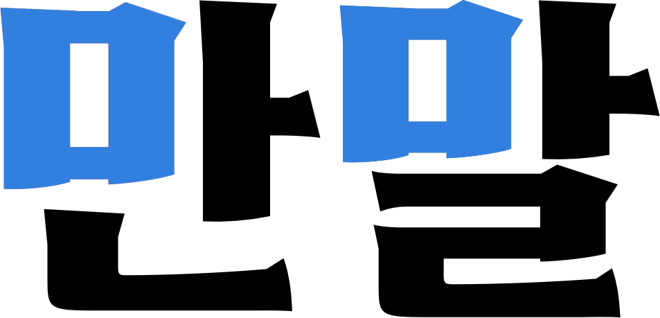

原文: [Creating a Hangeul font](https://glyphsapp.com/learn/creating-a-hangeul-font)
# ハングルフォントの作り方

チュートリアル

[ 言語 ](https://glyphsapp.com/learn?q=languages)

Minjoo Ham & Aaron Bell著

[ en ](https://glyphsapp.com/learn/creating-a-hangeul-font) [ zh ](https://glyphsapp.com/zh/learn/creating-a-hangeul-font)

2022年7月26日 2018年11月19日公開

膨大な文字セットを持つ新しい韓国語フォントの作成は、どこから手をつけていいか分からない、 daunting な作業に思えるかもしれません。このチュートリアルでは、韓国語を始めるためのすべてのツールを提供し、Glyphsで新しい韓国語フォントを作成する基本を説明します。

すでに韓国語に精通している方は、遠慮なく先に進んでください。

## 字母アルファベット

韓国語の文字は_ハングル_（または_Hangul_）と呼ばれ、_字母_と呼ばれる構成要素からなる音節でできています。_字母_には3つのカテゴリーがあります。_初声_（音節の初めの子音）、_中声_（音節の中間の母音）、そして_終声_（音節の最後の子音）です。

現代韓国語で可能なすべての_字母_は以下の通りです。

*   _初声_（初頭）：`ᄀᄁᄂᄃᄄᄅᄆᄇᄈᄉᄊᄋᄌᄍᄎᄏᄐᄑᄒ`
*   _中声_（中間）：`ㅏㅑㅓㅕㅗㅛㅜㅠㅡㅣㅐㅒㅔㅖㅘㅙㅚㅝㅞㅟㅢ`
*   _終声_（末尾）：`ㄱㄲㄳㄴㄵㄶㄷㄹㄺㄻㄼㄽㄾㄿㅀㅁㅂㅄㅅㅆㅇㅈㅊㅋㅌㅍㅎ`

これらの_字母_、その発音、ハングルに関するその他の情報については、[wikipediaの記事](https://en.wikipedia.org/wiki/Hangul#Letters)を参照してください。

## 音節の構成

_ハングル_の音節は、音節内で使われる母音（_中声_）に応じて、6つの方法のいずれかで_字母_から構成されます。

白は初頭の_初声_、黄色は中間の_中声_、濃い灰色は末尾の_終声_です。

これらの_6つ_の異なる音節は、その構造に基づいて名付けられています。

1.  水平の組み合わせ（_初頭子音と縦母音_）。
2.  垂直の組み合わせ（_初頭子音と横母音_）。
3.  混合の組み合わせ（_初頭子音と混合母音_）。
4.  末尾子音付きの水平の組み合わせ。
5.  末尾子音付きの垂直の組み合わせ。
6.  末尾子音付きの混合の組み合わせ。

いくつかの音節の例を見てみましょう。

### ヒント

ワークフローの早い段階で、これら6つの音節のバリエーションを_少なくとも1つずつ_手作業でデザインすることをお勧めします。そうすることで、ガイド、配置、文字のサイズを素早く決定するのに役立ちます。

_終声_の追加に関わらず、_初声_と_中声_の相対的な位置は同じままであることに注意してください。

さて、韓国語の基本を理解したところで、始めましょう！

## 韓国語とUnicode

Glyphsを使えば、プロジェクトに必要なすべての_ハングル_のUnicode文字を簡単に追加できます。サイドバーの_言語 > 韓国語_セクションには、さまざまなサブカテゴリがあります。

*   **Jamo Compatibility：** これは、独立した形で_字母_を表すために使用されるUnicodeブロックです。
*   **Choseong：** これらは、初頭の位置にある子音の_字母_です。
*   **Jungseong：** これらは、中間の位置にある母音の_字母_です。
*   **Jongseong：** これらは、末尾の位置にある子音の_字母_です。

### プロのヒント

Glyphsの重要な機能の一つは、_ハングル_音節を自動的に生成する技術が含まれていることです。この技術は、_初声 / 中声 / 終声_のUnicodeブロックの使用を必要とします。音節を個別に手作業で作成する予定がある場合は、これらのUnicodeスロットの使用は必要ありません。

_ハングル_の音節は、それぞれ独自のUnicodeスロットで表されます。考慮すべき2つのサブカテゴリがあります。

*   **基本音節：** これらは、KS X 1001標準とAdobe-KR標準に基づいた、核となる2,780の_ハングル_音節です。現代韓国語の組版にはこれで十分であり、おそらくあなたのフォントにもこれらを入れたいと思うでしょう。信じてください。
*   **すべての音節：** これらは、これまでに発生しうるすべての音節（11,172）の完全なセットです。

他に注目すべきサブカテゴリ：

*   **Codepages > Adobe-KR：** これらのエントリは、韓国語フォントを作成するために使用されるさまざまなAdobe-KR標準をカバーしています。多くの主要なタイプファウンドリがこれらのフォントに使用しています。
*   **Codepages > KS X 1001 (Hanja)：** このカテゴリは、韓国語のテキストに使用される漢字をカバーしています。これらの文字は現代韓国語ではあまり使われません。

これらのサブカテゴリをフォントに追加するには、それぞれを右クリックしてすべての欠落しているグリフをリスト表示し、Cmd-Aを押してすべてを選択し、_生成_をクリックします。

## 基本的な音節の作成

さて、描画に取り掛かりましょう！この例では、グリフ밈`mim-ko`、つまり終声を持つ混合組み合わせの音節に焦点を当てます。この音節を作成するには、4つのグリフが必要です—3つの_字母_と完全な音節です。

    mieumCho-ko
    iJung-ko
    mieumJong-ko
    mim-ko

フォントにこれらのグリフがまだない場合は、左サイドバーの_言語 > 韓国語_から追加するか、トップメニューから_グリフ > グリフを追加…_（Cmd-Shift-G）を選択し、上記の名前をボックスに貼り付けます。ダイアログを確定すると、ほら、必要なすべてのグリフがフォントに追加されます。

> **ヒント：** Glyphsでは、すべての韓国語グリフに接尾辞`-ko`が付いています。さらに、音節の初め、中間、終わりにどの_字母_があるかを区別するために、グリフ名に`Cho`（_初声_）、`Jung`（_中声_）、`Jong`（_終声_）の略語が使われます。例えば、母音_yi_を示す`yiJung-ko`や、子音_mieum_の初頭バージョンを示す`mieumCho-ko`などです。

`mieumCho-ko`グリフを開いてください。

韓国語フォント開発に別のプログラムを使ったことがあるか、Glyphsでラテン文字フォントを作成したことがあるなら、メトリクスボックスが韓国語の文字では異なって見えることに気づくかもしれません。標準のベースライン、xハイト、キャップハイト、アセンダーの値の代わりに、CJKグリフはemスクエアを使って表示され、emスクエアの中間点とフォントのベースラインもマークされています。これにより、不要なメトリクスに気を取られることなく、他のスクリプトとの位置合わせを考慮することができます。

### プロのヒント

Glyphsには、カスタムグリッドを追加できる非常に便利な機能_CJK Grid_が含まれています。_ファイル > フォント情報 > マスター_に行き、_カスタムパラメータ_フィールドでプラスをクリックして_CJK Grid_を追加します。次に、その値を希望する列と行の数に設定します。_ハングル_開発には8を使用することをお勧めします。

`mieumCho-ko`グリフを次のように描いてみましょう。

この例では、_字母_の配置に注意してください。この音節には終声があるので、最初の consonants を高く、左に配置します。これにより、自動配置中に異なる_字母_が互いに重ならないようになります。

次に、`iJung-ko`グリフをダブルクリックし、基本的なㅣの形を描きます。

再び、この_字母_の配置に注意してください—前のものの右側にあります。

最後に、`mieumJong-ko`グリフをダブルクリックします。これは`mieumCho-ko`と同じ_字母_なので、ここで描いたアウトラインを自由にコピー＆ペーストしてください。次に、それを下方にシフトさせ、描いた`iJung-ko`の_字母_の下の位置に置きます。

次に`mim-ko`に行くと、空のグリフが表示されます。

ここで魔法が起こります。Glyphsは`mim-ko`が`mieumCho-ko`、`iJung-ko`、`mieumJong-ko`からできていることを知っているので、自動的に音節を構築できます。_グリフ > コンポジットを作成_（Ctrl-Cmd-C）を選択すると、ドーンと。

### プロのヒント

特定の音節にどの_字母_が使われているか疑問に思う場合は、_ウィンドウ > グリフ情報_で構成をプレビューし、[独自のGlyph Data XMLを作成する](roll-your-own-glyph-data.md)ことでデフォルトを独自の構成で上書きできます。

このプロセスを_初声_、_中声_、_終声_リストのすべての_字母_に対して繰り返せば、Glyphsは_すべての音節_セットにある11,000以上の_ハングル_音節をすべて構築することさえできます。わあ！あなたは最初の_ハングル_フォントを作成しました！

このスタイルの_ハングル_フォントは、通常「アウト・オブ・フレーム・スタイル」（別名「デフレーム」または「デ・スクエアード」）と呼ばれ、ディスプレイタイポグラフィで最もよく使用される、かなり現代的な_ハングル_デザインのアプローチです。

## 字母のバリエーション

_基本音節_セクションでは、構造に関わらず、すべての音節で同じ_初声_、_中声_、_終声_の_字母_が使用されます。しかし、デザインが同じ音節内の他の_字母_によって_字母_の形を変える必要がある場合はどうでしょうか？

下の例では、どの末尾の_字母_が使われるかによって、ㅁ（_mieum_、青でマーク）の形が変わります。

これら2つの音節例を見ると、最初の音節のㄴ（_nieun_）は、2番目の音節のㄹ（_rieul_）よりもㅁ（_mieum_）により多くの垂直スペースを与えていることがわかります。ご想像の通り、すべての音節は異なるため、突然各_字母_のバージョンが5、10、さらには20個も出てくるかもしれません！怖く思えるかもしれませんが、このバリエーションは、テキストタイポグラフィの適切なバランスと比率を達成するために絶対に重要です。

このスタイルの_ハングル_は、通常「インフレーム・スタイル」（または単に「フレーム」または「スクエアード」）と呼ばれ、最も一般的な_ハングル_のスタイルです。

## 高度な音節の作成

_字母_のバリエーションを使ってみましょう。この例では、`man-ko` 만 に焦点を当てます。フォントに次のグリフを追加してください。

    man-ko
    mieumCho-ko
    aJung-ko
    nieunJong-ko

また、2つのバリエーションを作成します。

    mieumCho-ko.man
    aJung-ko.man

今回は、`mieumCho-ko`と`aJung-ko`を描くとき、文字마`ma-ko`をデザインしているかのように、全高で描きます。まず、`mieum-ko`からです。

`aJung-ko`でも同じことをします。

`nieunJong-ko`については、ボックスの下部にこのように描きます。

さて、`man-ko`に行き、_グリフ > コンポジットを作成_（Ctrl-Cmd-C）を押すと、かなり不快な結果が得られます。

なんてことだ！すべてが重なっています！しかし、解決策があります。作成した2つのバリアントグリフを覚えていますか？`mieumCho-ko`から`mieumCho-ko.man`にアウトラインをコピーし（または_グリフ > グリフを複製_でグリフを複製し、新しいグリフを適切にリネームします）、ㄴ（_nieun_）の上部とㅁ（_mieum_）の下部の間にスペースができるように_字母_の下部を上げます。

### プロのヒント

[スマートコンポーネント](learn/smart-components)を使えば、シェイプの再利用と調整がずっと簡単になります。スマートコンポーネントの作成には少し時間がかかりますが、それだけの価値はあります。そうでなければ、あらゆる種類のバリエーションでシェイプを繰り返すのに多くの時間を費やすことになります。

完了したら、`man-ko`に戻り、`mieumCho-ko`コンポーネントを選択し、下の灰色の情報ボックスにある_mieumCho-ko_という名前をクリックします…

…そしてコンポーネントを選択するためのウィンドウがポップアップします。`mieumCho-ko.man`を検索して選択します。

これにより、選択されたコンポーネントが`.man`バリアントに置き換えられます。ジャジャーン！`.man`バリアントで、重なりの問題を解決し、_初声_と_終声_の間のバランスをより良く達成しました！

さて、もう何をすべきかはお分かりでしょう。`aJung-ko`コンポーネントを選択します。

`aJung-ko`に対しても同じ手順に従うと、最終的な結果は次のようになります。

いいですね。今こそ、自分を褒めてあげましょう。この例では、幸運にも`nieunJong-ko`に何の変更も加える必要はありませんでしたが、他の音節ではこの_字母_の代替バージョンに交換する必要があるでしょう。

### ヒント

コンポーネントの元のグリフを編集するには、単に（灰色の）コンポーネントをダブルクリックするだけで、Glyphsは編集ビューに元のグリフを挿入し、すぐに編集できるようにアクティブ化さえします。この方法で、`.man`グリフを調整し、`man-ko`音節ですぐに組み合わせた結果を見ることができます。

おめでとうございます！あなたは最初の「インフレーム・スタイル」の_ハングル_音節を作成しました！さあ、このプロセスを2,780の基本的な_ハングル_音節すべてに対して繰り返すだけで、完了です。簡単でしょう？

## 近日公開：ハングルの構成

幸いなことに、Glyphsには_ハングル_音節を作成するための高度な機能が含まれています。_ハングル構成_エンジンを使えば、グリフのバリエーションをグループにまとめ、どの_字母_をどこで使うべきかを決定するルールを確立できます。完了すれば、エンジンが音節のデータベース全体を自動的に管理してくれます！しかし、それは次の韓国語チュートリアルでのお話です。

楽しんで、乞うご期待！

ゲストチュートリアル by [Minjoo Ham](http://www.minjooham.com) and [Aaron Bell](http://www.sajatypeworks.com)。
フィードバックをくれたEunyou Noh、Daekwon Kim、Yanghee Rueに感謝します。
サンプルフォント：GEOJANG AND HAHMLET BY MINJOO HAM。

---

更新履歴 2019-02-12: スクリーンショットを修正・復元。

更新履歴 2020-11-13: Glyphs 3ウェブサイトの更新。

更新履歴 2022-16-08: タイトル、関連記事、軽微なフォーマットを更新。

## 関連記事

[すべてのチュートリアルを見る →](https://glyphsapp.com/learn)

*   ### [シェイプの再利用：スマートコンポーネント](smart-components.md)

チュートリアル

[ シェイプの再利用 ](https://glyphsapp.com/learn?q=reusing+shapes)

*   ### [シェイプの再利用：コーナーコンポーネント](reusing-shapes-corner-components.md)

チュートリアル

[ シェイプの再利用 ](https://glyphsapp.com/learn?q=reusing+shapes)