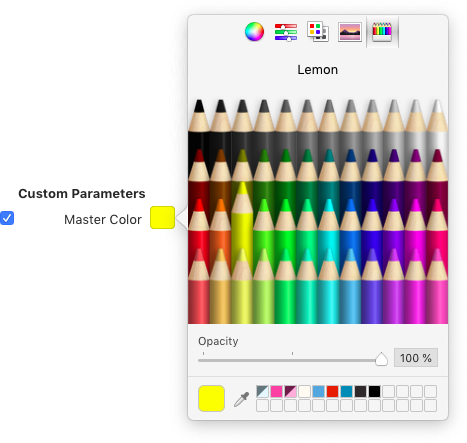

原文: [Creating a layered color font](https://glyphsapp.com/learn/creating-a-layered-color-font)
# レイヤーカラーフォントの作り方

チュートリアル

[ カラー ](https://glyphsapp.com/learn?q=color)

Rainer Erich Scheichelbauer著

[ en ](https://glyphsapp.com/learn/creating-a-layered-color-font) [ es ](https://glyphsapp.com/es/learn/creating-a-layered-color-font) [ fr ](https://glyphsapp.com/fr/learn/creating-a-layered-color-font) [ zh ](https://glyphsapp.com/zh/learn/creating-a-layered-color-font)

2021年7月4日 2014年9月16日公開

Glyphsを使えば、レイヤーカラーフォントの作成はあっという間です。その方法をご紹介します。

本質的に、レイヤーフォントとはいくつかの独立したフォントであり、ユーザーがそれらを正確に重ねて配置する必要があります。各レイヤーは同じ位置、同じテキストを持ちますが、色が異なります。

## 軸、マスター、インスタンスの設定

新しいフォントファイルを作成したら、_ファイル > フォント情報 > フォント > 軸_で新しい軸を追加する必要があります。これを`Color`と名付け、タグには`COLR`のようなもの（すべて大文字、4文字、A-Zのみ）を使用します。

覚えておいてください：_マスター_はあなたが描くもの、_インスタンス_はあなたが書き出すフォントファイルです。

さて、論理的に考えてみましょう。カラーレイヤーごとに1つのマスターが必要で、そのマスターをインスタンスとしてそのまま書き出す必要があることは明らかです。したがって、マスターとインスタンスを同期させる必要があります。そして、補間する必要はないので、マスターは互換性がある必要はありません。そのため、_フォント情報 > フォント > カスタムパラメータ_で_Enforce Compatibility Check_というカスタムパラメータを追加し、その値をオフにします（2番目のチェックボックス）。

引き続き_ファイル > フォント情報_ウィンドウに留まりますが、_マスター_タブに切り替えます。必要なカラーレイヤーごとに、そこで新しいマスターを追加します。それぞれに異なる名前と軸座標を必ず付けてください。例えば、「Front」、「Side」、「Bottom」、そして1、2、3のようにです。

そして、ついでに、マスターレイヤーに異なるプレビューカラーを割り当てることができます。レイヤーフォントは、すべてのレイヤーが同じ色では面白くありませんからね。方法は次の通りです。_Master Color_という新しいカスタムパラメータを追加し（これは選択したすべてのマスターに対して一度に行うことができます）、_値_のフィールドにカラースウォッチが表示されます。スウォッチをクリックして別の色を選びます。

### プロのヒント

_Master Color Dark_パラメータを追加して、基本的には_Master Color_と同じ色を、ダークモード用にトーンを落として設定することを検討してください。

ヒントです：透明度も選択できます。これは、オーバープリント効果をシミュレートしたい場合に便利です。

完了したら、_Master Color_パラメータを選択し、クリップボードにコピー（Cmd-C）します。次に、他のすべてのマスターを選択してペースト（Cmd-V）します。その後、スウォッチをクリックして各レイヤーの色を簡単に変更できます。

次に、_フォント情報_ウィンドウで、_書き出し_タブに切り替えます。そこで、マスターで使用したのと全く同じ軸の値を持つインスタンスを作成します。そのためには、左下のプラスボタンをクリックし、表示されるメニューから_各マスターのインスタンスを追加_を選択します。

_全く_同じ値を使用することで、補間しないことを確実にします。これは良いことです。なぜなら、私たちは補間したいのではなく、ただ異なるレイヤーを描いて書き出したいだけだからです。

## レイヤーグリフの編集

_フォント情報_ウィンドウを閉じると、フォントウィンドウに戻ります。大文字のIをダブルクリックしてみましょう。簡単な文字なので、実験や編集の試行に最適です。

ウィンドウ上部のマスターボタンを使うか、ショートカットのCmd-1、Cmd-2、Cmd-3を使って、レイヤーを切り替えることができます。右側のサイドバーにある_レイヤー_パレット（Cmd-Opt-P）には、私たちのカスタム名「Front」、「Side」、「Bottom」が表示されます。各レイヤー名の左には、小さな目のシンボルがあります。閉じている目をすべてクリックして開きます。これで、編集中にすべてのマスターレイヤーが一度に表示されます。

Cmd-1を押して「Front」レイヤーに移動し、キャップハイトからベースラインまで、大文字のIの長方形を描きます。

次に、長方形が選択されたままの状態で、クリップボードにコピー（Cmd-C）し、「Side」レイヤーに切り替え（Cmd-2）、ペースト（Cmd-V）します。選択ツール（V）で左端の2つのノードを選択し、右下に移動させます。このようになります。

すべてを選択（Cmd-A）し、クリップボードにコピー（Cmd-C）し、「Bottom」レイヤーに切り替え（Cmd-3）、ペーストします。次に、上部の2つのノードを左下の位置に移動させ、「Bottom」レイヤーの上部が「Front」レイヤーのベースに揃うようにします。

ここでOptionキーを押しながら、_パス_メニューから_すべてのマスターのパスの向きを修正_（Cmd-Opt-Shift-R）を選択するのが良いタイミングです。スペースバーを長押しして一時的にプレビューを見るか、単にテキストツール（T）に切り替えると、すべてが期待通りに機能するかどうかを確認できます。

おめでとうございます。最初のレイヤーグリフが完成しました。

## 複数レイヤーの編集

編集といえば、_すべてのレイヤーを選択_ツールがあり、これを使うと表示されている任意のレイヤー上の任意の点を編集できます。Shift-Vを（ツールアイコンに二重矢印の記号が表示されるまで繰り返し）押すか、選択ツールアイコンをクリック＆ホールドして表示されるポップアップから選択することでアクセスできます。

これにより、_レイヤー_パレットでレイヤーがアクティブである限り、複数のレイヤー上のパスを同時に編集できます。アクティブなレイヤーには開いた目のシンボルがあります。閉じた目のシンボルは、レイヤーが編集から保護されていることを意味します。すべてのレイヤーを選択ツールがアクティブな間、シェイプは_ファイル > フォント情報 > マスター_で以前に定義した各マスターカラーで表示されます。

Optionキーを押しながらメニューを開くと、ほとんどのメニューコマンドがすべてのレイヤーに対して一度に機能します。例えば、_グリフ > すべてのマスターのメトリクスを更新_（Cmd-Opt-Ctrl-M）を選択できますし、すでに_パス > すべてのマスターのパスの向きを修正_（Cmd-Opt-Shift-R）も使用しました。

## メトリクスとカーニングの同期を保つ

もう一つの大きな問題は、すべてのマスターで字幅を同じに保つことです。結局のところ、ある色で字幅が変更されれば、他のすべてのカラーレイヤーもそれに追従しなければなりません。もちろん、常にCmd-1、2、3などで全てのマスターを巡回し、どこでも同じメトリクス変更を行うこともできますが、もっと賢い方法があります。

_ファイル > フォント情報 > マスター_（Cmd-I）で、すべてのマスターにカスタムパラメータ_Link Metrics With First Master_を追加します。技術的には最初のマスターに追加する必要はありませんが、後でマスターの順序を変更した場合に備えて、最初のマスターにも追加しておくと頭痛の種を減らせるかもしれません。これで、このパラメータを持つすべてのマスター間で、字幅の変更が同期されます。そして、_字幅の変更_だけでなく、_すべてのカーニングの変更_もすべてのマスター間で同期されます。クールですね。

時には、メトリクスとカーニングを最初のマスターではなく、別のマスターとリンクさせたい場合があります。そのような場合には、_Link Metrics with Master_パラメータを使用できます。パラメータ値として、リンクしたいマスターを選択します。

## 便利なフィルターとスクリプト

さて、大文字のIは非常に簡単だったことは認めます。より複雑なシェイプがある場合は、_フィルター > 押し出し_から助けを得ることができます。

このフィルターは良い出発点を提供します。受け取ったシェイプを賢く切り分け、それぞれのレイヤーに配布することで、かなり遠くまで進むことができます。

もちろん、3Dの押し出しだけでなく、他のことを考えているかもしれません。_フィルター > パスのオフセット_、そして_角を丸める_や_ハッチアウトライン_（またはそれらの組み合わせ）は、元のシェイプから他のレイヤー用の新しいシェイプを派生させるのに役立ちます。また、_ウィンドウ > プラグインマネージャー_を覗いて、プラグインとスクリプトの両方から、あなたのプロジェクトに役立つものが見つかるか確認するのも良いアイデアです。

1つまたは複数のレイヤーに影を作成したい場合は、_ウィンドウ > プラグインマネージャー_にいくつかのオプションがあります。[Harbor Type Scripts](glyphsapp3://showplugin/Harbor%20Type%20Scripts%20by%20Henrique%20Beier)には_Make Block Shadow_が含まれており、[Kyle Wayne Benson’s Scripts](glyphsapp3://showplugin/Kyle%20Wayne%20Benson’s%20Scripts)にはあらゆる種類の異なる影を作成するための複数のスクリプトがあります。

[mekkablue script collection](glyphsapp3://showplugin/mekkablue%20scripts)には、_Color Fonts > Convert Layerfont to CPAL+COLR_というスクリプトが含まれています。これは、レイヤーフォントの設定を、カラーパレットと本物のカラーレイヤーを持つCPAL/COLRフォントの設定に再配置します。[CPAL/COLRフォント（別名Microsoftカラーフォント）については、それぞれのチュートリアルで詳しく読むことができます。](creating-a-microsoft-color-font.md)

## InDesignでレイヤーフォントを適用する

他のフォントプロジェクトと同様にフォントを書き出します。いつものように、[Adobe Fontsフォルダ](testing-your-fonts-in-adobe-apps.md)を使用するのが良いアイデアです。

さて、InDesignで行う必要があるのは、全く同じ内容を持つ複数のテキストフレームを正確に互いに重ねて配置し、それぞれに異なるフォントスタイルを設定することです。[InDesignの配置とリンクツールを使用してこれを実現できます。](http://www.lynda.com/articles/indesign-secrets-how-to-place-and-link-text-without-its-formatting)

ヒント：テキストボックスが正確に重なっているにもかかわらずレイヤーが揃わない場合は、それぞれのテキストボックスで[最初のベースラインオフセットを設定する](https://helpx.adobe.com/indesign/using/creating-text-text-frames.html#first_baseline_offset_options)ための別の方法を検討してください。言うまでもなく、重ねられたすべてのテキストボックスが同じ設定であることを確認してください。

## Illustratorでフォントを重ねる

Adobe Illustratorでエリア内文字オブジェクト（つまり、テキストボックス内のテキスト）を整列させる際に一つ問題があります。デフォルトでは、アプリはテキストボックス内の最初のベースラインに良いオフセットを見つけようと賢く振る舞います。そのために、_Illustratorは小文字のdを測定し_、そのアセンダーの高さを最初の行のオフセットとして使用します。冗談ではなく、AIは本当にそうしています。

問題は、カラーレイヤーでは、すべてのレイヤーで小文字のdの垂直方向の最大値が偶然同じになることはまずないということです。その結果、レイヤーは整列せず、カラーフォントを購入した人々から多数のサポートリクエストがメールで届く可能性があります。

できることは2つあります。第一に、[Adobe Illustratorですべてのエリア内文字オブジェクトのベースラインオフセット設定を変更する方法](https://helpx.adobe.com/illustrator/using/creating-text.html#main-pars_heading_5)について顧客を教育しようと試みることができます。整列させたいすべてのテキストボックスを選択し、_書式 > エリア内文字オプション_に移動し、_最初のベースライン_オプションとして_固定値_または_行送り_を選択します。ただし、経験豊富なユーザーでさえこの設定について知らないことが多いことを心に留めておいてください。そして、彼らがあなたに連絡する前に、あなたのフォントについて怒りのInstagram投稿を公開するリスクがあります。

あるいは、第二に、小文字のdのすべてのレイヤーの上部に、幅がわずか1ユニットの小さな四角形を追加することができます。それをすべてのカラーレイヤーの同じ高さにコピー＆ペーストし、それがこの文字で最も高いパスオブジェクトであることを確認してください。デザインの中で目立たない良い場所を見つけてください。そうすれば、Illustratorが小文字のdを測定する際に、すべて同じ高さであると判断し、デフォルトでそれらをすべて整列させます。そして、あなたの受信箱はサポートリクエストで溢れかえることはありません。

そして、AIでフォントをテストする場合も、[Adobe Fontsフォルダ](testing-your-fonts-in-adobe-apps.md)を使用するようにしてください。

## サンプルフォント：Sapperlot

いずれにせよ、これを使えばかなり良いものが作れます。Thomas Maier (DrTypo)氏が彼のフォントSapperlotで行ったようにです。Thomas氏は`.glyphs`ファイルをオープンソース化したので、[彼のGitHubページにアクセスして](https://github.com/DrTypo/sapperlot)詳しく見てみてください。

サンプルフォント：[SAPPERLOT](https://github.com/DrTypo/sapperlot)、THOMAS MAIER氏提供。

---

更新履歴 2014-12-24: Illustratorでのフォントの重ね合わせに関する段落を追加。

更新履歴 2016-11-30: _Link Metrics with First Master_パラメータに関する段落を追加。

更新履歴 2016-12-01: 誤字と更新日を修正。

更新履歴 2017-01-18: _Link Metrics with Master_の段落とスクリーンショットを追加。

更新履歴 2021-07-08: Glyphs 3向けに更新。

## 関連記事

[すべてのチュートリアルを見る →](https://glyphsapp.com/learn)

*   ### [SVGカラーフォントの作り方](creating-an-svg-color-font.md)

チュートリアル

[ カラー ](https://glyphsapp.com/learn?q=color)

*   ### [Appleカラーフォント（sbix）の作り方](creating-an-apple-color-font.md)

チュートリアル

[ カラー ](https://glyphsapp.com/learn?q=color)

*   ### [Microsoftカラーフォント（CPAL/COLR）の作り方](creating-a-microsoft-color-font.md)

チュートリアル

[ カラー ](https://glyphsapp.com/learn?q=color)