原文: [Creating a Microsoft color font (CPAL/COLR)](https://glyphsapp.com/learn/creating-a-microsoft-color-font)
# Microsoftカラーフォント（CPAL/COLR）の作り方

チュートリアル

[ カラー ](https://glyphsapp.com/learn?q=color)

Rainer Erich Scheichelbauer著

[ en ](https://glyphsapp.com/learn/creating-a-microsoft-color-font) [ es ](https://glyphsapp.com/es/learn/creating-a-microsoft-color-font) [ fr ](https://glyphsapp.com/fr/learn/creating-a-microsoft-color-font) [ zh ](https://glyphsapp.com/zh/learn/creating-a-microsoft-color-font)

2022年7月20日 2014年10月23日公開

Microsoftは、完全にベクターベースのカラーフォントの形式を提案しました。Glyphsを使えば、そのようなカラーフォントを作成し、直接書き出すことができます。さらに、技術的な部分はアプリが代行してくれます。

Microsoftのアプローチによるカラーフォントは、CPALとCOLRという2つの追加のOpenTypeテーブルを採用しています。CPALは色のパレットを記述し、COLRはCPALのどの色がどのグリフでどのように使用されるかを定義します。技術的には、1つのグリフに複数の色があるように見えるのは、実際には複数のグリフが互いに重ねて表示され、それぞれが個別の色で表示されているものです。しかし、心配する必要はありません。Glyphsがそうした技術的なことをすべて代行してくれます。

### 背景知識

フォント内のすべてのデータは、いわゆる「テーブル」に保存されます。各テーブルには4文字のタグと特別な意味があります。[OpenType仕様書のテーブルについて読む。](https://docs.microsoft.com/en-us/typography/opentype/spec/otff#font-tables)

## カラーパレットを設定する

まず、_ファイル > フォント情報 > フォント_で、_Color Palettes_というカスタムパラメータを追加します。手始めに、3色のパレットを1つ追加します。最初のパレットである_Palette 0_はすでに存在するので、左下のプラスボタンを3つのカラースウォッチが表示されるまでクリックするだけです。スウォッチをクリックすると、macOSのカラーピッカーが表示されます。この例では、次の3色を追加します。

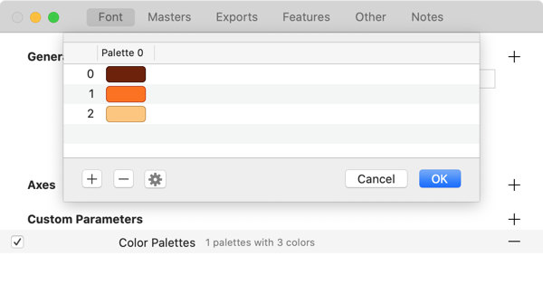

### 旧バージョン

Glyphs 2では、_ファイル > フォント情報 > マスター_で_Color Palettes_パラメータを追加します。

どのカラースキームからでも、透明度を含めて任意の色を選ぶことができます。最終的には、フォントファイルにRGBA（赤、緑、青、アルファ）として保存されます。アルファは不透明度を表すので、透明な色も使用できます。先ほど作成した3色に、0、1、2という番号が割り当てられていることに注意してください。後で使うので覚えておいてください。

完了したら、OKをクリックしてダイアログシートを確定します。すべてが正しければ、カスタムパラメータの行にパレットと色の数が表示されるはずです。

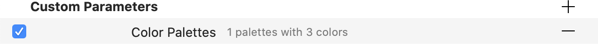

## フォールバックグリフを作成する

ここまでは順調です。しかし、一つ問題があります。私たちが今作ろうとしているようなMicrosoftスタイルのカラーフォントのサポートは、ますます広まっていますが、まだ完全には普及していません。そのため、対応していないソフトウェアのために、万が一の場合に表示できる昔ながらの白黒のグリフを用意する必要があります。これをフォールバックグリフと呼びます。

実は、フォールバックグリフはすでに設定されています。マスターレイヤー（マスターの名前を持つレイヤー、通常は「Regular」）にあるものはすべて、フォールバックと見なされます。ですから、例えば大文字IのRegularマスターに、キャップハイトとベースラインの間にサンセリフの長方形を描くことができます。小さなひし形のインジケータは、ノードがメトリクスライン上に正確にあることを示しています。

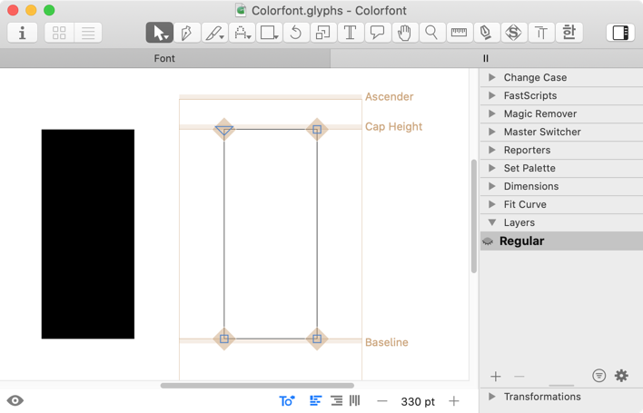

## カラーレイヤーを追加する

さて、サイドバーの_レイヤー_パレット（Cmd-Opt-P）で、_Regular_マスターの複製を作成します。プラスボタンをクリックすると、現在の日時で名付けられたバックアップレイヤーが表示されます。_レイヤー_パレットでそのレイヤーを右クリックし、レイヤータイプとしてColor Paletteを選択します。

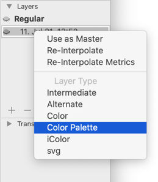

### 旧バージョン

Glyphs 2では、レイヤーの名前を`Color 0`（大文字のCと、0の前の半角スペース）に変更します。

レイヤーの名前は自動的に変更され、レイヤー名の横にカラーサークルが表示されます。これは、レイヤーのパレットカラーを示しています。レイヤーの色を選ぶには、カラーサークルをクリックしてポップアップから選択するだけです。

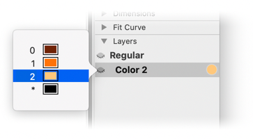

ついでに言うと、アスタリスクでマークされた色は_ユーザーカラー_、つまりユーザーがフォントを使用するアプリで選択できる色です。

先ほど作成したカラーレイヤーを複製することで、他の2色を追加できます。ただし、今回はレイヤータイプを設定する必要はなく、それぞれに異なる色を選ぶだけです。

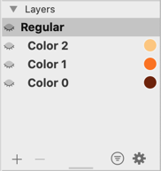

レイヤーは_時系列順_に表示されることを覚えておいてください。つまり、最初のレイヤーが最初に描画され、次に2番目のレイヤーが最初のレイヤーの上に描画され、という具合です。実質的に、一番下のレイヤーが最初で、一番上のレイヤーが最後になります。これは、より複雑な描画を重ねるためには、同じ色を共有する複数のレイヤーを持つことができることも意味します。

さて、あとはレイヤーを描くだけです。_Color 0_レイヤーはそのままにして、_Color 1_と_Color 2_レイヤーを立体的な大文字Iの側面と底面にします。

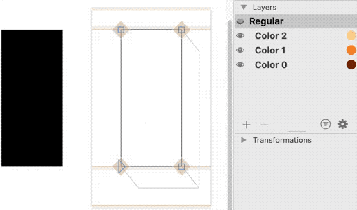

カラーレイヤーが選択されている限り、テキストプレビューはカラーで表示されることに注意してください。マスターレイヤー（この例では_Regular_）を選択すると、プレビューはフォールバックの白黒フォントになります。

## カラーフォントを書き出してテストする

さて、CPAL/COLRフォントをテストしてみましょう！今のところ書けるのはIIIIIIだけですが、前衛的な具体詩にはそれで十分です。

何を書くにしても、_ファイル > フォント情報 > 書き出し_で、左下のプラスボタンをクリックし、表示されるメニューから_インスタンスを追加_を選択してインスタンスを作成する必要があります。

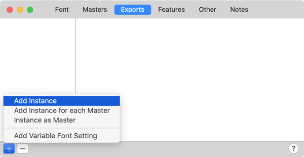

インスタンスに、例えば色の基本色調に言及するような、分かりやすい_スタイル名_を付けます。

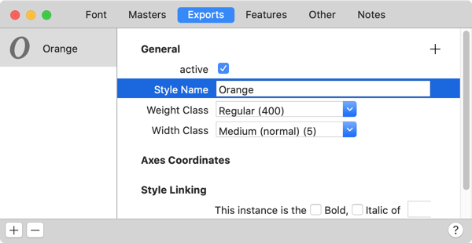

どの形式（CFF/OTF、TTF、WOFF、WOFF 2）を選んでも構いません。これらはすべてOpenTypeベースなので、Glyphsは表示に必要なテーブルを挿入できます。CPALとCOLRテーブルは比較的新しい技術なので、一部のアプリではフォールバックのみが表示されます。

[しかし、ほとんどのシステムとアプリはすでにCPAL/COLRをサポートしており](https://www.colorfonts.wtf)、主要なブラウザはすべて現在のバージョンでCPAL/COLRをサポートしています。

*   Internet Explorer (Windows 8.1以降)
*   Firefox (バージョン26以降)
*   Microsoft Edge (Windows 10のバージョン38以降)
*   Safari (macOS 10.13 High Sierra以降)
*   Chrome (バージョン70以降)
*   Android WebView (リリース71以降)
*   Opera (リリース58以降)

2つの大きな欠点：

*   macOS 10.12 Sierraまでの古いバージョンではSafariは対象外です。
*   Chromeは、_フォールバックレイヤー_の水平および垂直の境界でクリッピングを起こします。そのため、フォールバックレイヤーが水平および垂直の拡大において他のすべてを包含する、最も太いものであることを確認したいでしょう。

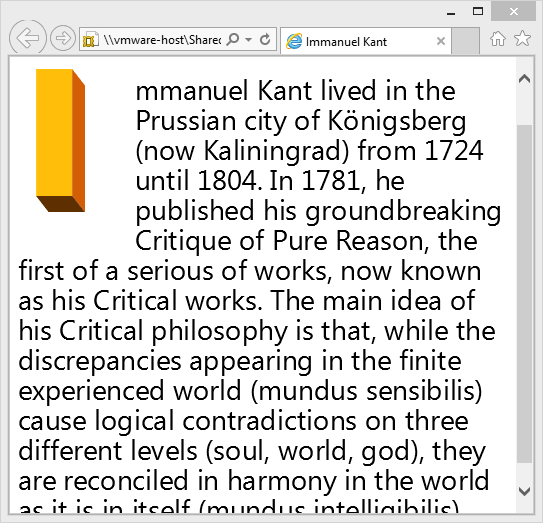

したがって、おそらくカラーフォントはウェブフォントとしてテストしたいと思うでしょう。そうする場合、[mekkablue script](http://github.com/mekkablue/Glyphs-Scripts)の_Test > Webfont Test HTML_を使って、最新のウェブフォント書き出しの隣に簡単な確認用HTMLを作成できます。

クールですね。では、大文字のI以外の他のすべての文字についても…

## 代替パレット

カラーフォントの複数のバリエーションを書き出し、それぞれに異なるカラーパレットを持たせることができます。これを実現するには、まず_ファイル > フォント情報 > マスター_ですでに設定した_Color Palettes_カスタムパラメータに複数のパレットが設定されていることを確認します。歯車メニューからパレットを追加できます。

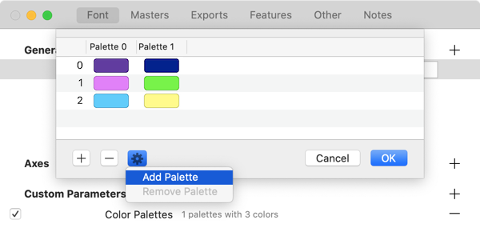

列の上部にあるインデックス番号に注目してください。上のスクリーンショットでは、例えば_Palette 0_と_Palette 1_があります。これらはインデックス番号で、次のステップで重要になります。さて、_Color Palettes_ダイアログを確定します。

_ファイル > フォント情報 > 書き出し_で、次のことを行います。

1.  すでに持っているカラーフォントのインスタンスを複製します。サイドバーで選択し、コピー＆ペーストします。または、サイドバーでOptionキーを押しながらドラッグします。
2.  インスタンスの_スタイル名_を、意味のあるものに変更します。すでに持っている他のインスタンスとは異なる必要があります。
3.  カスタムパラメータフィールドに、_Color Palette for CPAL_というパラメータを追加します。値として、適用したいパレットの_インデックス_番号を選びます。この例では、_2番目_のパレット、つまりインデックス番号が_1_のパレットを使いたいとします。

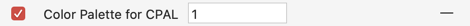

4.  さて、_ファイル > 書き出し_（Cmd-E）で再度書き出すと、今回はGlyphsが両方のバリエーションを書き出します。

これはかなりクールです。

## 白黒のみでフォントを書き出す

もし、色の要素を一切含まず、単なる白黒のフォントが欲しい場合はどうすればいいでしょうか？言い換えれば、CPALとCOLRテーブルなしで、純粋なフォールバックのフォントを書き出すにはどうすればいいでしょうか？_ファイル > フォント情報 > 書き出し_のインスタンスに_Export COLR Table_というカスタムパラメータを追加し、その値のチェックボックスをオフにすることで、Glyphsに2つのカラーテーブルの書き出しを抑制するように指示できます。このようになります。

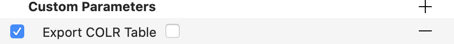

すると、そのインスタンスではCPALとCOLRの両方のテーブルの作成が妨げられ、プレーンで退屈な、前景・背景のみのフォントが得られます。ブー。

冗談ですよ。

## 便利なスクリプト

_ウィンドウ > プラグインマネージャー > スクリプト_には、CPAL/COLRワークフローで役立つスクリプトを含むいくつかのスクリプトコレクションがあります。[mekkablue scripts](glyphsapp3://showplugin/mekkablue%20scripts)には、_Scripts > mekkablue > Color Fonts_にいくつかのスクリプトがあります。

*   _Add All Missing Color Layers to Selected Glyphs_ は、選択された各グリフに対して、Color Palettesパラメータで定義された各（CPAL/COLR）色のフォールバックレイヤーの複製を追加します。グリフにまだ存在しない色のみを追加します。必要なすべてのレイヤーを素早く取得するのに便利です。
*   _Convert Layerfont to CPAL+COLR Font_ は、[レイヤーカラーフォント](creating-a-layered-color-font.md)を、各グリフにCPALおよびCOLRレイヤーを持つ単一マスターのフォントに変換します。レイヤーフォントの最初のマスターをフォールバックとして使用します。
*   _Delete Non-Color Layers in Selected Glyphs_ は、CPAL/COLRレイヤーではないすべてのグリフのすべてのサブレイヤーを削除します。
*   _Merge Suffixed Glyphs into Color Layers_ は、例えばx.shadow、x.body、x.frontというグリフを、グリフxの3つの別々のCPALレイヤーに移動します。

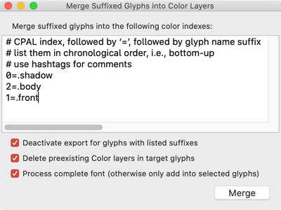

Henrique Beier氏の[Harbor Type Scripts](glyphsapp3://showplugin/Harbor%20Type%20Scripts)には、_Copy Master into Sublayer_というスクリプトがあります。これは、選択されたグリフに対して、あるマスターを別のマスターのサブレイヤーにコピーします。レイヤーフォントをCPAL/COLR設定に、より制御された方法で変換するのに便利です。

サンプルフォント：URLOP BY MIKOŁAJ GRABOWSKI

更新履歴 2018-03-26: サポートしているブラウザのリスト、Color Paletteパラメータ、SVGチュートリアルへのリンクを追加。

更新履歴 2018-04-14: チュートリアルのタイトルを更新。

更新履歴 2018-11-06: アプリとブラウザのサポート状況を更新、「インスタンスごとの異なるパレット」セクションを改善。

更新履歴 2021-08-20: Glyphs 3向けに更新、「便利なスクリプト」セクションとGlyphs 2の旧バージョンに関する注記を追加。

## 関連記事

[すべてのチュートリアルを見る →](https://glyphsapp.com/learn)

*   ### [レイヤーカラーフォントの作り方](creating-a-layered-color-font.md)

チュートリアル

[ カラー ](https://glyphsapp.com/learn?q=color)

*   ### [SVGカラーフォントの作り方](creating-an-svg-color-font.md)

チュートリアル

[ カラー ](https://glyphsapp.com/learn?q=color)

*   ### [Appleカラーフォント（sbix）の作り方](creating-an-apple-color-font.md)

チュートリアル

[ カラー ](https://glyphsapp.com/learn?q=color)