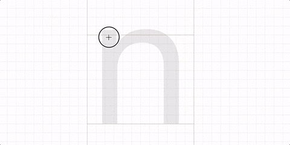
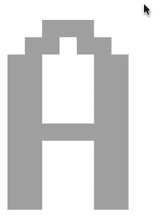
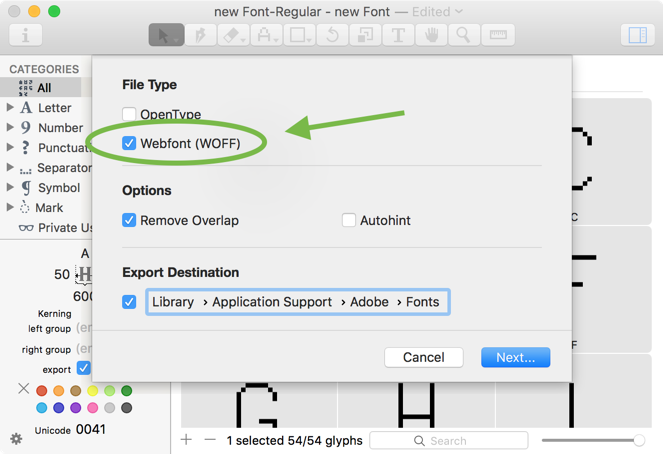

原文: [Creating a pixel font in Glyphs Mini](https://glyphsapp.com/learn/creating-a-pixel-font-in-glyphs-mini)
# Glyphs Miniでピクセルフォントを作る

チュートリアル

[ Glyphs Mini ](https://glyphsapp.com/learn?q=glyphs+mini)

by

[ en ](https://glyphsapp.com/learn/creating-a-pixel-font-in-glyphs-mini) [ es ](https://glyphsapp.com/es/learn/creating-a-pixel-font-in-glyphs-mini) [ fr ](https://glyphsapp.com/fr/learn/creating-a-pixel-font-in-glyphs-mini)

2017年2月24日 2017年2月20日公開

ピクセルフォントは、Glyphs Miniを始めるのにとても楽しくて簡単な方法です。それに、友達もみんな使いたがるでしょう！

## 新しいフォントを始める

まず、Glyphs Miniを開き、_ファイル > 新規_（Cmd-N）を選択して、新しいフォントドキュメントを作成します。次に、_ファイル > フォント情報_に行き、フォントに名前を付けます。私たちはこれを「Pixelfont」と名付けます。目が覚めたばかりで、これ以上良い名前が思いつかなかったからです。次に、ウィンドウの下部に_グリッドの間隔_のオプションがあります。_グリッドの間隔_の値は、座標がどのように丸められるかを定義します。デフォルト値は1で、これは1ユニット、つまりフォントサイズの1000分の1を表します。例えば、フォントサイズが12ptの場合、1ユニットは0.012ptになります。ピクセルフォントでは、すべてのツールとすべての変更が常にグリッドにスナップするようにしたいため、より高い値を設定します。これにより、フォント内のピクセルが自動的に正しい位置に配置されるようになります。通常、グリッドの間隔の値がピクセルのサイズと同じである場合に最良の結果が得られます。したがって、例えば幅が50ユニットのピクセルがある場合、グリッドの間隔も50であるべきなので、_グリッドの間隔_を50/1に設定します。

## ピクセルコンポーネント

ピクセルフォントの作成をさらに簡単にするために、Glyphs Miniにはピクセルツールがあります。鉛筆ツールをクリック＆ホールドして、ピクセルツールにアクセスします（キーボードショートカットはX）。でも待ってください！フォントにピクセルグリフがない状態でピクセルツールを使用すると、警告ダイアログが表示され、_追加_ボタンでピクセルグリフをすぐに生成するオプションも提供されます。

> 注：一部のアプリバージョンにはバグがあり、鉛筆ツールからピクセルツールに切り替えるにはShift-B、元に戻すにはShift-Xを押す必要があるかもしれません。

_追加_ボタンを押すと、`pixel`という名前のグリフ（ピクセルツールにはこれが必要です）がグリッドの間隔と同じサイズの正方形で追加され、完成したフォントにグリフとして表示されるべきではないため、書き出さないように設定されます。

自分でピクセルを描きたい場合は、昔ながらの正方形から始めます。長方形ツール（F）を有効にし、正方形をドラッグします。ピクセルの正方形は、いわゆる原点、つまり左サイドベアリングとベースラインの交点上にあるべきです。

長方形を描いていると、パスがグリッドに吸着することにすぐに気づくでしょう。これは素晴らしいことです！

## ピクセルを描く

準備ができたので、描画を始めましょう！フォントビューで好きなグリフをダブルクリックして開きます。ピクセルを描くには、キャンバス上でクリックしてドラッグするだけです。Glyphs Miniは、描画中のグリフにピクセルグリフをコンポーネントとして配置します。これにより、すべてのピクセルが同じであることを確実にできます。

すでに配置されたピクセルコンポーネントを削除するには、既存のピクセルをクリックしてドラッグし始めます。さあ、グリフ作りを楽しんでください！

## コンポーネントを選択する

コンポーネントの選択は簡単です。選択ツール（V）でクリックするだけです。その後、カーソルキーやマウスで移動させることができます。

しかし、ステムやアーチなど、一連のピクセルを複製したい場合は、複数のピクセルを選択する必要があります。これを達成するには2つの方法があります。第一に、複数のコンポーネントを次々とShiftキーを押しながらクリックすることができます。これは、隣接していない、つまり隣り合っていないピクセルの選択に便利です。第二に、Optionキーを押しながら、矩形選択でピクセルの範囲をドラッグして選択することができます。

ヒント：ピクセルコンポーネントをドラッグして選択する場合、重要なのは選択矩形に_原点_が含まれているかどうかです。ですから、ドラッグして選択する際には、ピクセルの左下隅を選択するつもりで操作してください。

## 一括編集

デフォルトのグリフ幅は600ユニットです。しかし、それではあまり見栄えが良くありません。

スペーシングを始めるにあたり、すべてのグリフの左と右のサイドベアリングを同じにすることができます。方法は次の通りです。まず、Cmd-Aを押してフォントビューのすべてのグリフを選択します。次に、ウィンドウの左下にあるボックスに値を入力します。左と右のサイドベアリングの値は、グリッドの間隔の倍数であるべきです。このケースでは、単純に50に設定します。

これで、灰色の情報ボックスで個々の変更を簡単に行うことができます。ただし、私たちのピクセルグリッドに合う値、言い換えればグリッドの間隔の倍数である値のみを入力するようにしてください。

スペーシングについてもっと知りたい場合は、[スペーシングに関するチュートリアル](spacing.md)を読んでください。

ずっと見栄えが良くなったと思いませんか？

## ピクセルのバリエーション

もちろん、ピクセルで少し遊んでみることもできます。例えば、正方形にする必要はなく、円を使っても良いでしょう。そのためには、既存のピクセルの形を変更できます。ピクセルツールは描画時にピクセルをコンポーネントとしてグリフに配置するため、元のピクセルグリフの形を編集すると、すべてのピクセルが変わります。円を描くと、次のようなものができることに気づくでしょう。

これは、_グリッドの間隔_の2番目の値であるサブディビジョンが1に設定されているためです。サブディビジョンはグリッドの間隔を分割するため、スナップはグリッドに直接ではなく、グリッドのサブディビジョン上で起こります。この値を例えば25に設定すると、円は次のようになります。

サブディビジョンの値は、あなたのピクセルデザインにとって意味のあるものに設定してください。完全な柔軟性を求めるなら、グリッドの間隔と同じ値に設定します。グリッドとピクセルの形で自由に実験してみてください。

## フォントを書き出してテストする

複雑なピクセル、つまり最初の単純な正方形以外のものを使用している場合は、書き出す際にヒントがオフになっていることを確認する必要があります。ですから、ファイルを書き出す（Cmd-E）際には、_自動ヒント_オプションのチェックを外してください。なぜでしょうか？ヒントは、低解像度のスクリーン向けにグリフを最適化しますが、これは単純で退屈な形でのみ機能します。（詳しくは、[PostScriptの自動ヒント](hinting-postscript-autohinting.md)に関するチュートリアルを読んでください。）

フォントをテストしたい場合は、FontBookやFontExplorerのようなアプリにインストールしないでください。なぜでしょうか？[フォントキャッシュの問題を解消する](eliminating-font-cache-problems.md)に関するチュートリアルですべて読んでください。Adobeアプリがいくつかインストールされていますか？フォントをいわゆるAdobe Fontsフォルダに書き出すと、Adobeアプリで即座に有効になります。再起動も、キャッシュのクリアも、再読み込みも不要です。_書き出し先_のチェックマークを有効にし、パスをクリックして表示される保存ダイアログで、`Macintosh HD/Library/Application Support/Adobe/Fonts/`に移動します。Fontsフォルダが存在しない場合は、Cmd-Shift-Nを押して_Fonts_（大文字のFで）という名前のフォルダを作成してください。

これに関する詳細情報は、[Adobeアプリでフォントをテストする](testing-your-fonts-in-adobe-apps.md)に関するチュートリアルを読んでください。

Glyphs Miniでは、フォントをウェブフォントとして書き出すことも選択できます。そのためには、書き出し時に_Webfont (WOFF)_オプションをチェックします。これにより、HTMLを使用してウェブページでフォントを表示できます。興味がありますか？[ウェブフォントの作成](creating-a-webfont-in-glyphs-mini.md)に関するチュートリアルを読み進めてください。

## フィルターを適用する

フォントで少し実験したい場合は、内蔵のフィルターをいくつか試すことができます。繰り返しになりますが、適切なサブディビジョンの値が設定されていることを確認してください。さもないと、一部のフィルターで満足のいかない結果になる可能性があります。例えば、ピクセルの正方形にフィルター_角を丸める_を適用すると、次のようになります。

ここでは、_パスのオフセット_フィルターを_ストロークを作成_オプションなしで使用して、ピクセルを太くしました。

では、ピクセルで楽しんでください！

---

更新履歴 2020-01-07: いくつかの誤字を修正、古いピクセルツールのショートカットを変更、_Adobe Creative Suite_を_Adobe apps_に置き換え。ピクセルツールのショートカットに関する注記を追加。

更新履歴 2020-03-11: 「Font-Explorer」を「FontExplorer」に変更。

更新履歴 2022-07-28: タイトル、関連記事、軽微なフォーマットを更新。

## 関連記事

[すべてのチュートリアルを見る →](https://glyphsapp.com/learn)

*   ### [Glyphs Miniでウェブフォントを作る](creating-a-webfont-in-glyphs-mini.md)

チュートリアル

[ Glyphs Mini ](https://glyphsapp.com/learn?q=glyphs+mini)

*   ### [Glyphs Miniでのフォント情報設定](font-info-settings-in-glyphs-mini.md)

チュートリアル

[ Glyphs Mini ](https://glyphsapp.com/learn?q=glyphs+mini)

*   ### [IllustratorからGlyphs Miniに読み込む](importing-from-illustrator-into-glyphs-mini.md)

チュートリアル

[ Glyphs Mini ](https://glyphsapp.com/learn?q=glyphs+mini)

*   ### [Glyphs Miniでオールキャップスフォントを作る](creating-an-all-caps-font-in-glyphs-mini.md)

チュートリアル

[ Glyphs Mini ](https://glyphsapp.com/learn?q=glyphs+mini)