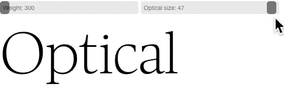
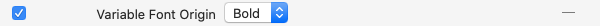

原文: [Creating a variable font](https://glyphsapp.com/learn/creating-a-variable-font)
# バリアブルフォントの作り方

チュートリアル

[ インターポレーション ](https://glyphsapp.com/learn?q=interpolation)

Rainer Erich Scheichelbauer著

[ en ](https://glyphsapp.com/learn/creating-a-variable-font) [ es ](https://glyphsapp.com/es/learn/creating-a-variable-font) [ fr ](https://glyphsapp.com/fr/learn/creating-a-variable-font) [ zh ](https://glyphsapp.com/zh/learn/creating-a-variable-font)

2024年4月21日 2018年3月8日公開

バリアブルフォントは、全く新しい可能性の世界を開きます。Glyphsなら、その作成も簡単です。

## バリアブルフォントとは？

もしあなたがJohn Hudson氏の優れた[入門記事](https://medium.com/@tiro/https-medium-com-tiro-introducing-opentype-variable-fonts-12ba6cd2369)をまだ読んでいないなら、今やっていることをすべてやめて、すぐにその記事を読んでください。本当ですよ。

読み終わりましたか？オーケー。では、ステップバイステップでGlyphsでバリアブルフォントを設定していきましょう。さあ、始めます。

## ステップ1：軸を定義する

インターポレーションを行いたいなら、まず*デザインスペース*を設定する必要があります。デザインスペースは軸によって定義される座標系で、高校で習ったデカルト座標系によく似ています。ただ、x、y、z軸の代わりに、ウェイト、ウェイト、スラントなど、タイポグラフィにとって意味のある*デザイン軸*があります。

そこで、*ファイル > フォント情報 > フォント > 軸*に行き、プラスボタンをクリックして軸を追加します。

> *ファイル > フォント情報*を選び、*フォント*タブで*軸*の隣にあるプラスアイコンをクリックすると、新しいデザイン軸が追加されます。

表示された軸のエントリで、好きな種類の軸を選びます。公式に「登録」されている軸（ウェイト、ウィズ、イタリック、スラント、オプティカルサイズ）や、[提案されている新しい軸](https://github.com/Microsoft/OpenTypeDesignVariationAxisTags)の範囲から選ぶことができます。あるいは、自分だけの「プライベート」な軸を作ることもできます。

### プロのヒント

自分だけの「プライベート」な軸を作る場合は、4文字のタグも選ぶ必要があります。将来の標準の更新との潜在的な衝突を避けるために、プライベートなタグは*すべて大文字*にすることをお勧めします。例えば、*Smile*には`SMIL`、*Rotation*には`ROTN`のようにです。これは、すべて大文字のタグが公式にプライベート利用のために予約されているからです。定義済みの軸は常に小文字になります。

ほぼいくつでも軸を追加できますが、各軸は一意の4文字の軸タグを持っている必要があります。この例では、一つの「登録」軸である*ウェイト*（定義済みのタグは`wght`）に絞ります。

## ステップ2：マスターを設定する

同じ*ファイル > フォント情報*ウィンドウで、*マスター*タブに切り替え、ウィンドウの左下隅にあるプラスボタンでマスターを追加するか、既存のマスターを複製します。[マルチプルマスターのプロジェクトで行うのと同じようにです](multiple-masters-part-1-setting-up-masters.md)。この例では、*Light*と*Bold*の2つのマスターを追加します。

各マスターについて、次の設定を選びます。

1.  最も重要なのは、各マスターの**軸座標**を設定することです。この例では、*ウェイト*の値を設定します。例えば、Lightマスターには50、Boldマスターには200です。多くのデザイナーは、ウェイト軸の値としてステムの太さを使用することを好みますが、値が*十分に異なって*いれば、好きなものを入力できます。そうすれば、Glyphsは中間のインスタンスを計算できます。この例では、50から200の間の数値、例えば75、120、182などでインスタンスを計算できます。
2.  各マスターに適切な**マスター名**を選んでいることを確認してください。このケースでは、*Light*と*Bold*が良い選択でしょう。マスター名は最終的なフォントファイルには書き出されません。これらは、Glyphsで作業する際のあなた自身の目印として重要です。
3.  任意で、各マスターの*一般*セクションにある*アイコン*ポップアップから**マスターアイコン**を選びます。さまざまなウェイトとウィズの組み合わせを表す小文字のnの範囲から選択できます。下部にグリフ名を入力することもでき、Glyphsはそのグリフの画像をマスターアイコンとして使用します。これもまた、あなた自身の目印のためなので、自分にとって意味のあるものを選んでください。

オーケー、これでマスターの設定ができました。各マスターに描画を追加していきましょう。

## ステップ3：互換性のあるグリフを描く

短くシンプルに保つため、このチュートリアルでは大文字のAに絞ります。ステム幅が約50ユニットのLightのA（Cmd-1）を描きます。

…そしてステム幅が200ユニットのBoldのA（Cmd-2）です。

*グリフ > アンカーを設定*（Cmd-U）を選択するか、さらに良い方法として、Optionキーを押しながら*グリフ > すべてのマスターにアンカーを設定*（Cmd-Opt-U）を選択してアンカーを追加します。最も重要なのは、[マルチプルマスターの設定で行うのと同じように](multiple-masters-part-2-keeping-your-outlines-compatible.md)、両方のマスター間ですべてのアウトラインとアンカーの互換性を保つことです。

### プロのヒント

*表示 > マスターの互換性を表示*（Ctrl-Opt-Cmd-N）で互換性を確認し、*フィルター > シェイプの順序*で各マスターのシェイプを正しい順序にドラッグできます。

## ステップ4：定義済みのインスタンスを追加する

私たちのフォントはバリアブルであり、すでに無限の数のインスタンスがありますが、それでもデザインスペース内のいくつかのスポットを選び、フォントのサブメニュー用のインスタンスとして定義することができます。*ファイル > フォント情報 > 書き出し*で、好きなだけ定義済みのインスタンスを追加します。左下のプラスボタンで新しいインスタンスを追加するか、左サイドバーの既存のインスタンスエントリをOptionキーを押しながらドラッグして複製します。

各インスタンスで行う必要があるのはこれだけです。

1.  適切な**スタイル名**を設定します。この例では、*Light, Regular, Medium, Semibold, Bold, Extrabold*などです。
2.  任意：*名前*のすぐ下にあるポップアップメニューから**ウェイトクラスとウィズクラス**を選ぶことができます。欠点は、これが関連する*静的*フォントの書き出しにのみ適用され、バリアブルフォントには書き込まれないことです。[命名](naming.md)チュートリアルで詳しく読んでください。
3.  各軸に適切な**デザインスペース座標**を選びます。[マルチプルマスター、パート3](multiple-masters-part-3-setting-up-instances.md)チュートリアルでウェイトの分布について詳しく読んでください。
4.  **スタイルリンク**を選びます。アップライトでは通常これらを空欄のままにしますが、BoldはRegularの*Bold*です。そして、すべてのイタリックは対応するアップライトの*Italic*です。例えば、Semibold ItalicはSemiboldの*Italic*です。ItalicインスタンスのみがRegularの*Italic*で、Bold ItalicがRegularの*Bold and Italic*です。[命名](naming.md)チュートリアルで詳しく読んでください。
5.  残念ながら、**ほとんどのカスタムパラメータはOTVarインスタンスでは機能しません**。特に、ほとんどのフィルターのようなシェイプの後処理を行うものはそうです。インスタンスにそのようなものがあっても、ソフトウェアはそれを blissfuly 無視します。なぜなら、それらはアウトラインの互換性を損なうからです。
6.  任意：インスタンスの（スタイル）名を上書きするために**バリアブルスタイル名**を選びます。*静的*フォントと*バリアブル*フォントの両方の書き出しに同じインスタンスを使用していて、何らかの理由で*静的スタイルとバリアブルスタイルに異なるスタイル名を使用している*場合は、*一般*セクションのこのプロパティでバリアブルスタイル名を具体的に設定できます。

## ステップ5：バリアブルフォント設定を追加する

オーケー、インスタンス内の多くのカスタムパラメータは機能しません。例えば、当然ながら同じバリアブルフォントの異なるインスタンスで異なるグリフセットを持つことはできません。スライダーを動かしたときにグリフが消えたり現れたりするべきではないからです。そのため、インスタンス内の*Export Glyphs*や*Remove Glyphs*パラメータは無視されます。他のパラメータについても同様の論理的な理由が見つかるでしょう。

しかし、もし*バリアブルフォント全体に*パラメータを適用できたらどうでしょう？できます。左下の同じプラスメニューから、*バリアブルフォント設定*を追加します。

…そして、*Keep Glyphs*パラメータによるグリフのサブセット化、それぞれのパラメータによるOpenTypeフィーチャーやクラスの変更など、定義したいすべてのことを定義します。

Glyphs 3.1以降では、こちらが私たちの推奨です。

*   **名前：** *フォント全体*がイタリックの場合は*Italic*と呼びます。そうでなければ*Regular*と呼びます。これにより、ローマン体とイタリック体が別々のファイルにあってもスタイルリンクが機能します。
*   **ファミリー名：** 静的フォントとバリアブルフォントの両方を提供する予定がある場合は、*静的*ファミリー名とは異なる必要があります。これは、ユーザーが両方をインストールしてフォントの競合を起こす可能性があるためです。通常、「VF」や「Var」、「Variable」のような追加の識別子を付けた同じファミリー名を使用します。例：「Myfont VF」。アップライトとイタリックが別々のファイルにある場合、このエントリは両方のファイルで同じでなければなりません。
*   **VariationsPostScriptNamePrefix：** 任意。[name ID 25](https://learn.microsoft.com/en-gb/typography/opentype/spec/name#nid25)の設定で、Glyphsはこれから[fvar postScriptNameID](https://learn.microsoft.com/en-gb/typography/opentype/spec/fvar#postScriptNameID)エントリも導出します。これはPS名なので、A-Z、a-z、0-9のみを使用し、スペースや記号、非ASCII文字は使用しないでください。アップライトとイタリックが別々のファイルにある場合、このエントリは異なる必要があります。例：「MyfontVarRoman」と「MyfontVarItalic」。
*   **任意のカスタムパラメータ：** バリアブルフォント設定では、プラスボタンをクリックするとすべての可能なカスタムパラメータが表示されます。*fileName*と*Variable Font Origin*を検討してください。

覚えておいてください：複数のバリアブルフォント設定を持つことができ、同時に複数のバリアブルフォントを書き出すことができます。

## ステップ6：バリアブルフォントを書き出してテストする

*ファイル > 書き出し*を選択し、*バリアブルフォント*タブをクリックします。

最新のAdobe Illustrator、Adobe Photoshop（CC 2018以降）、またはInDesign（CC 2020以降）をお持ちの場合は、[Adobe Fontsフォルダに書き出して](testing-your-fonts-in-adobe-apps.md)、文字パネルでフォントを選択し、小さなスライダーのポップアップを開いて*ウェイト*軸を試すことができます。

あるいは、フォントファイルをテストできる素晴らしいウェブページにドロップすることもできます。私のお気に入りは、Roel Niesken氏の素晴らしい[Wakamai Fondue](https://wakamaifondue.com)、ABC Dinamoの[Font Gauntlet](https://dinamodarkroom.com)（バリアブルフォントをアニメーションさせることもできます）、そしてもちろんLaurence Penney氏の[Axis Praxis](https://www.axis-praxis.org)ページです。

または、mekkablue scriptsをインストールして*Test > Variable Font Test HTML*を実行すると、最新のOTVar書き出しの隣にHTMLファイルが作成され、Finderでそのフォルダが開きます。あとはそれをブラウザにドラッグするだけです。

### ヒント

この記事を書いている時点では、ブラウザとして最適なのは最新の[Chrome](https://www.google.com/chrome/browser/desktop/index.html)またはSafari（macOS High Sierra以降、またはiOS 11以降で実行している場合）です。Safariは古いOSバージョンではバリアブルフォントをサポートしません。FirefoxとEdgeも機能するはずですが、最新のブラウザバージョンを実行していることを確認してください。

## バグを回避する

AdobeのOTVar実装にはバグがあります。そのため、IllustratorやPhotoshopでフォントが正しく補間されない場合、それはあなたのフォントのせいではないかもしれません。症状はさまざまですが、グリフが静的なままでスライダーの位置の変更に全く反応しない、またはスライダーを動かすと醜い小さなよじれが現れるなどが含まれます。例：

もしそうなった場合は、アウトラインで異なる開始点を設定してみてください。これにより、AIのレンダリングバグを回避できることがあることがわかっています。いずれにせよ、ウェブブラウザで同じ不具合が現れない場合は、あなたのフォントのせいではありません。そして、[Adobeサポートにフォントファイルを送る](https://www.adobe.com/products/wishform.html)のが最善です。簡単なテストケースを含むAIファイルと一緒に送ってください。

> **更新：** 最近のCCバージョンでは、これらのレンダリング問題は非常にまれになりました。実際、CC 2021ではこれらの問題は一つも見ていません。

もう一つの厄介な実装バグは、AppleのレンダラーであるCoreTextの奥深くにあります。LSBが変化する場合、コンポーネントのオフセットが誤って計算されます。aが正しく振る舞うのに対し、a-umlautが必要以上にずれるのを見てください。

これは、Mac上のほぼすべてのブラウザを含む、CoreTextレンダリングを利用するすべての環境に影響します。その場合、最善の策は、書き出す際にすべてのコンポジットが分解されるようにすることです。最善の方法は、*ファイル > フォント情報 > フォント > カスタムパラメータ*に`Decompose Components in Variable Font`パラメータを追加することです。言うまでもなく、結果として得られるTTFははるかに大きくなり、Appleが問題を修正するまでウェブでの使用には適しません。

~~私たちはAppleにバグを報告しましたが、もし良い事例があれば、[あなたもAppleに知らせてください。](https://bugreport.apple.com)~~

> **更新：** Appleはこの問題を修正しました。macOS 10.13の最新のドットアップデート、またはそれ以降のmacOSを使用していることを確認してください。

Appleのレンダリングにおけるもう一つのバグ：*オプティカルサイズ*軸（`opsz`）がSafariで誤って解釈されます。*原点*マスター（同じ名前のカスタムパラメータで異なる*Variable Font Origin*を指定しない限り、最初のマスター）と一致するスライダーの位置で、*最大*値のレンダリングが表示されます。これはSafariでのみ現れ、他のブラウザでは現れません。繰り返しになりますが、[Appleに知らせてください。](https://bugreport.apple.com)*更新：*このバグにはID FB6055886のフィードバックが提出されています。別のバグを報告する場合は、これを参照してください。

そして、バリアブルフォントがオーバーラップを保持するという事実によって引き起こされるレンダリング問題があります。これは実際にはバグではありませんが、ユーザーにはそう見えるかもしれません。シェイプの端が2つの（部分的に）重なったパスセグメントによって描かれている場合、アンチエイリアシングによってその端が、1つのアウトラインだけで描かれている「きれいな」端よりも暗く見えます。

これに対する唯一の解決策は、シェイプの外側の端が常に「きれい」になるように、つまり、どの地点でも1つのパスだけで描かれるようにアウトラインを再配線することです。例えば、このようになります。

ほとんどの場合、オーバーラップを削除し、その後コーナーを開くかノードを再接続することでこれを修正できます。*コーナーを開く*と*ノードを再接続*の両方の機能は、それぞれのポイント選択のコンテクストメニューで利用できます。コーナーを開くには個々のコーナーノードを、再接続するにはコーナーノードの*ペア*を選択します。

### プロのヒント

これらの機能を頻繁に使う必要がある場合は、キーボードショートカットを設定すると良いでしょう。この目的のために、*パス > その他*メニューに*ノードを再接続*と*コーナーを開く*を追加しました。ショートカットは*Glyphs > 環境設定 > ショートカット > メニュー*で設定します。

[mekkablue script](https://github.com/mekkablue/Glyphs-Scripts/)の*Paths > Rewire Fire*は、再接続が必要なノードを見つけるのに役立ちます。すべてを見つけることはできませんが、通常、上記で示したようなきれいではないエッジを引き起こすケースの*ほとんど*を見つけることができます。必要なのは、「線分上のノード」を見つけるオプションです。

## 任意：仮想マスターを追加する

一部のグリフにのみ適用される軸が必要だと想像してください。例えば、A、E、F、Hのような文字には適用されますが、S、D、J、Oなどには適用されず、数字や句読点、記号などの非文字にも適用されないクロスバーの高さなどです。フォント全体に新しいマスターを描くのは意味がないでしょう？むしろ、クロスバーを持つグリフにのみ追加のマスターを導入するべきです。さて、このようなケースのために、*仮想マスター*というものがあります。

1.  *ファイル > フォント情報 > フォント*で、軸パラメータに新しい軸を追加します。これは標準の軸の一つではないので、名前は任意です。この例では、名前を*Crossbar Height*、4文字のタグを*CRSB*とすることをお勧めします。

2.  同じウィンドウタブで、*Virtual Master*というパラメータを追加し、その値として*ウェイト*軸のLightマスターの値（この例では50）と、*Crossbar Height*の最小値（例えばゼロ）を与えます。

3.  *ファイル > フォント情報 > マスター*ですべてのマスターを調べ、*Crossbar Height*の軸座標がゼロではなく、例えば100になっていることを確認します。アイデアは、値が何らかの意味で意味を持つようにすることです。このケースでは、ゼロは可能な限り低いクロスバーの位置を表し、100は可能な限り高い位置を表します。すべてのマスターを選択すれば、一度にすべてを編集できます。

これでフォント情報に仮想マスターが設定されたので、それが必要な各グリフの低いクロスバーのバージョンを描くことができます。

1.  グリフを編集ビューで開きます。
2.  *レイヤー*パレットで、プラスボタンで*Light*レイヤーを複製します。現在の日時を名前として持つバックアップレイヤーが作成されます。
3.  バックアップレイヤーを右クリックし、コンテクストメニューから*レイヤータイプ > 中間レイヤー*を選択して、中間レイヤーに変換します。

4.  中間レイヤーをダブルクリックし、表示されるポップアップダイアログで、そのデザインスペース座標をウェイト（この例ではLightマスターを表す50）とクロスバーの高さ（この例では最も低いクロスバーの位置を表す0）に設定します。

5.  次に、クロスバーの高さがゼロのときに文字がどのように見えるべきか、描画を変更します。

ここでのクールな点は、微調整をしない限り、Boldマスター用のブレースレイヤーを追加する必要がないことです。バリアブルフォントでは、2つの軸のデルタ（点の動き）が互いに補完し合い、足し合わせることで低いクロスバーを持つBoldを形成できます。したがって、最善の戦略は、まず1つのマスターでうまくいくか試し、結果が十分でない場合にのみ追加のマスターを追加することかもしれません。

これで終わりです。あとは書き出して、IllustratorやAxis Praxis、Variable Font Test HTMLスクリプトでフォントを再度試すだけです。すると、ほら、2番目の軸が利用可能になり、クロスバーをベースラインに向かって下げることができます。

実質的に、私たちはデザインスペースに2番目の次元を追加しました。これを行う場合、マスターを*矩形配置*に保つか、さらに良いことに、原点マスターに対して垂直または水平にオフセットさせることが賢明です。この例では、BoldマスターはLightマスターに対して水平にオフセットしており（最初の座標のみが異なる）、低いクロスバーを持つマスターは垂直にオフセットしています（2番目の座標のみが異なる）。このようにマスターを配置することで、作成した垂直および水平のデルタを単純に足し合わせることで、デザインスペースの矩形内の任意の点に到達できるため、最もコントロールしやすくなります。

## 任意：異なる原点を設定する

フォントには1セットのアウトラインしか保存されません。OTVar非対応のソフトウェアは、これらの「デフォルトのアウトライン」しか表示できません。そのデフォルトは通常、最初のマスターです。しかし、異なるデフォルトを選ぶこともできます。そのためには、*ファイル > フォント情報 > フォント*または*ファイル > フォント情報 > 書き出し*の*バリアブルフォント設定*に行き、*Variable Font Origin*というカスタムパラメータを追加します。その値として、ポップアップメニューからマスターの名前を選びます。

はい、それは*マスター*でなければなりません。もしあなたの*インスタンス*のいずれかを原点にしたい場合は、そのインスタンスを追加のマスターとして追加する必要があります。*ファイル > フォント情報 > 書き出し*で、原点として定義したいインスタンスを選択し、ウィンドウの左下隅にあるプラスボタンを開き、表示されるポップアップメニューから*インスタンスをマスターとして*を選択します。これで、*ファイル > フォント情報 > マスター*に追加のマスターができ、それを*Variable Font Origin*として設定できます。

考慮すべき2つの点：

1.  **デフォルトの外観：** バリアブルフォントの基本理念の一つは、*最もよく使われるインスタンス*をデフォルトとして選べることです。通常はRegularです。マルチプルマスターでは、デザインスペースの極端な部分（つまり、最も使われないインスタンス）をデザインし、その間のすべてを補間していました。バリアブルフォントは逆の方向に行くことができます。最も重要なアウトライン、デザインスペースのどこか中間にあるものだけを保存し、他のすべてのインスタンスはそこから派生させます。したがって、*デスクトップフォント*の場合、Regularを原点として選ぶか、ユーザーがあなたのフォントファミリーの「デフォルトの外観」として期待するであろうものを選んでください。万が一の場合でも、ユーザーはこのウェイトを使えることになります。
2.  **ファイルサイズ：** 中間のマスターを選ぶと、点のデルタの数が増える可能性が高く、したがって最終的なファイルサイズも増加します。単一軸の設定では、デルタの数が2倍以上になる可能性があります。言い換えれば、*ウェブフォント*の場合、ファイルサイズと読み込み時間を抑えたいので、デザインスペースの*極端な端にあるマスター*の一つを選ぶ方が理にかなっています。

## 何が機能し、何が機能しないか

あなたが慣れ親しんできたことのいくつかは、バリアブルフォントでは期待通りには機能しません。

1.  前述しましたが、*ファイル > フォント情報 > 書き出し*での**カスタムパラメータによる後処理**は、アウトラインの互換性やグリフセットの一貫性を損なう可能性が高いため、すべて無視されます。これにはフィルターやRenameパラメータが含まれます。
2.  **コーナーコンポーネントとセグメントコンポーネント**は機能します。しかし、動作が異なります。バリアブルフォントでは、Glyphsはこれらを補間*前*に適用しますが、クラシックなマルチプルマスター設定では、後から挿入・調整されます。そのため、静的インスタンスとバリアブルインスタンスで結果が少し異なる場合があります。
3.  **中間レイヤーと代替レイヤー**の両方が機能します。
4.  **代替**レイヤーはコンポジットには変換されません。ただし、これにはスクリプトによる解決策があります。詳しくは下記を参照してください。*更新：* Glyphs 3.1以降では機能するはずです。
5.  **ブラシ**は、すべてのマスターで同じように適用されている限り機能します。
6.  ストロークのような**パス属性**は現在機能しません。TrueTypeカーブへの変換はアウトラインの互換性を損なうためです。

## 必須とも言える：STATテーブル

すべてのバリアブルフォントを含む新しいフォントでは、命名情報はSTATテーブルに保存されます。STATは*Style Attributes*の略で、軸、インスタンス、そして*表示文字列*または*名前文字列*と呼ばれるものに関する情報を含みます。これらは軸上のセクションの名前です。例えば、ウェイト軸はLight、Regular、Medium、Semibold、Boldに、ウィズ軸はCondensed、Regular、Extendedにセクション分けされるかもしれません。

このアイデアの背景には、ユーザーがスライダーをどのように設定しても、アプリケーションがユーザーの現在のインスタンスに名前を付けられるようにするということがあります。実質的に、複数軸の設定では、可能な名前のn次元のフィールドが得られます。例えば、フォントにウェイト軸とウィズ軸がある場合、下の表のようにウェイトの列とウィズの行が得られます。そして、BoldセクションのウェイトとCondensedセクションのウィズの組み合わせに名前を付けるために、アプリケーションは単に表示文字列を組み合わせるだけで、ジャジャーン、「Bold Condensed」の出来上がりです。

表示文字列は、他の表示文字列と組み合わされたときに省略される場合、*省略可能*と見なされます。通常、これは「Regular」や「Normal」などのデフォルトのスタイル名の場合です。セミボールドのウェイトとレギュラーのウィズの組み合わせは、通常「Semibold Regular」ではなく単に「Semibold」と呼ばれます。また、ノーマルなウェイトとイタリックスタイルの組み合わせは、「Regular Italic」ではなく単に「Italic」と呼ばれます。したがって、表示名「Regular」は省略可能と見なされます。

通常、Glyphsは定義済みのインスタンスの名前を分析することで、これを非常に賢く処理します。しかし、STATテーブルのエントリで表示文字列がファイルに正しく保存されていないことがわかった場合は、*ファイル > フォント情報 > 書き出し*にあるこれら2つのパラメータで制御できます。

*   **Style Name as STAT entry:** インスタンスのスタイル名を、軸範囲の組み合わせ可能な表示文字列として使用します。値として、表示文字列が適用される4文字の軸タグを使用します。これは、1つの軸で非標準であり、他のすべての軸で標準であるインスタンスでのみ使用してください。これは、標準の属性は省略可能な名前を持ち、スタイル名には現れないためです（例：「Semibold」や「Condensed」）。*例：* Lightインスタンスでは、このパラメータを値*wght*で使います。なぜなら、Lightはウェイト軸上の値だからです。
*   **Elidable STAT Axis Value Name:** パラメータ値で指定された軸に対して、インスタンスのスタイル名を省略可能として宣言します。値として、それぞれの軸の4文字のタグを使用します。通常、このパラメータはレギュラースタイルに追加し、名前が省略可能な表示文字列である各軸に対して1つずつ追加します。*例：* *Regular*というインスタンスには2つの*Elidable…*パラメータがあり、1つは*wght*、もう1つは*wdth*をパラメータ値として持ちます。

## 軸のマッピングとロケーション

軸についてもう一つ。当然ながら、軸はどこかで始まりどこかで終わります。ユーザーインターフェースでは、軸の始点と終点は（通常は）スライダーの左端と右端の位置で表現されます。その間のすべては、もちろんこれらの極端な点の間に均等に広がっています。言い換えれば、補間の25%を表示するにはスライダーを4分の1の位置に置き、50%を表示するにはちょうど中央に置きます。理にかなっていますよね？

ちょっと待ってください。本当にそうでしょうか？よく考えてみると、それはユーザーがアクセスできるべきインスタンスも、スライダーの*全*範囲にわたって（多かれ少なかれ）*均等*に広がっている場合にのみ意味があります。議論のために、重要な位置がスライダーの狭い範囲に詰め込まれ、スライダーの大部分がユーザーにとってあまり意味をなさない状況を想像してみましょう。

これは実際に*ウェイト*軸（軸タグ`wght`）の場合に起こります。（ほぼすべての）ウェイトの補間では、さまざまなウェイトスタイルは均等に分布していません。最も軽いマスターがどれだけ細く、最も太いマスターがどれだけ太いかによりますが、軸に沿った異なる「焦点」にスタイルがより多く集まることになります。例えば、*非常に細い*ものから「標準的な」、*極端すぎない太さ*へと補間すると、スタイルはスライダーの細い方の端に集中します。

なぜでしょうか？原則として、スライダーの等距離の動きは、スライダーの*どこで*その動きをしても、同じ単位の変化に対応するからです。例えば、ここでの特定の往復運動はデザインを10ユニット変化させ、あそこでの同じ往復運動も10ユニット変化させます。しかし、ステムの太さに10ユニット加えることは、もともと数ユニットしかないHairlineにとっては*非常に大きな*変化です。しかし、全く同じ量がMediumやSemiboldにとっては、ステムの太さに比べてほんのわずかな変化なので、実質的に*無視できる*ほどです。

極端すぎないLightやBook、Regularから、スライダーのもう一方の端にある非常に太いUltra Heavyへと向かう場合は、逆になります。今度は、スタイルはスペクトルの太い方の端に集まります。

どうしてそんなことが可能なのでしょうか？まあ、実際には上記とは逆の状況です。なぜなら、今回変化するのは文字の*白場*だからです。*非常に、非常に*重いデザインでは、白場がほとんど残っていないため、白場に10ユニット加えたり引いたりすることは*非常に大きな*変化です。しかし、平均的なBookとSemiboldのデザインの間の「標準的な」ウェイトの範囲では、依然として同じ状況です。スタイルはより離れています。

これらを合わせると、*非常に細い*ものから*非常に太い*ものへと補間すると、通常、スペクトルの両端にスタイルが集中することが明らかになります。

しかし一方で、ユーザーは私たちの分布の問題など気にしませんよね？ユーザーにとっては、異なるスタイルへのアクセスは、軸全体に均等に分布している場合が最も効果的です。このようになります。

言い換えれば、私たちは均等に分布した*ユーザーがアクセス可能な*位置（「外部座標」）を、適切に分布した*デザイン*の位置（「内部座標」）に何とかして変換する必要があります。このようになります。

これは*軸マッピング*と呼ばれます。私たちは、ユーザーが軸上で*見る*ものを、ユーザーが実際に軸上で*得る*ものにマッピングします。私たちが満たすべき期待される規約があります。

*   **ウェイト軸：** `wght`軸の外部座標は、[usWeightClass](https://docs.microsoft.com/en-us/typography/opentype/spec/os2#usweightclass)の数値と一致することが期待されます。最小値は1、最大値は1000です。値が高いほどフォントは太くなります。期待される外部座標は次の通りです：100 Thin, 200 Extralight, 300 Light, 400 Regular, 500 Medium, 600 Semibold, 700 Bold, 800 Extrabold, 900 Black。Hairlineより軽いものが必要な場合は、最小値の1を使用します。Blackより太いものが必要な場合は、最大値の1000を使用します。これらの追加ウェイトには規定の名前はありませんが、「Laser」や「Hairline」は最も軽いウェイトに、「Extrablack」や「Superheavy」は最も太いウェイトに使われているのを見たことがあります。（[仕様](https://docs.microsoft.com/en-us/typography/opentype/spec/dvaraxistag_wght#axis-definition)）
*   **ウィズ軸：** `wdth`軸の外部座標は、[usWidthClass](https://docs.microsoft.com/en-us/typography/opentype/spec/os2#uswidthclass)の仕様で記述されているパーセンテージと一致することが期待されます。「標準的」と認識されるデフォルトの文字幅は100にあると想定されます。よりコンデンスされたデザインはより小さい値を持ち、よりワイドな文字はより高い値を持ちます。これは、デフォルトの幅に対する行長のパーセンテージを大まかに示します。言い換えれば、wdth=50は、フォントが非常にコンデンスされているため、wdth=100で必要なスペースの約半分しか取らないことを意味します。wdth=200では、テキストは約2倍のスペースが必要になります。（[仕様](https://docs.microsoft.com/en-us/typography/opentype/spec/dvaraxistag_wdth#axis-definition)）
*   **イタリック軸：** `ital`の外部座標は、アップライト/ローマンで0、イタリックで1と想定されます。0と1の間で補間*できる*ことに注意してください。（[仕様](https://docs.microsoft.com/en-us/typography/opentype/spec/dvaraxistag_ital#axis-definition)）
*   **スラント軸：** 外部座標は、反時計回りのスラント角度を度数で大まかに反映するべきで、（理論的には）-90から+90の範囲です。ええ、90°の角度を持つデザインを見てみたいものですが…でも、アイデアはわかりますよね。そして、数学が得意な方々は、角度が最小と最大のスライダー位置の間で線形に分布していないことに気づくでしょうが、まあ、技術者でない人々にとっては十分です。**注意：** 角度は*反時計回り*に測定されるため、10°のスラント角度は`-10`と指定する必要があります。冗談ではありません。そして、アップライトとイタリックと見なすものの間で補間する予定で、ユーザーにイタリックボタンで切り替えさせたい場合は、スラント軸を忘れてイタリック軸を使用してください。（[仕様](https://docs.microsoft.com/en-us/typography/opentype/spec/dvaraxistag_slnt#axis-definition)）
*   **オプティカルサイズ軸：** `opsz`の外部座標は、単にポイント単位のタイプサイズで、平均的な読書距離（40cm）でのものです。したがって、標準的なサイズは10〜16ポイントと想定され、opszの値は決してゼロや負になることはありません。（[仕様](https://docs.microsoft.com/en-us/typography/opentype/spec/dvaraxistag_opsz#axis-definition)）

他のすべての軸、そしてもちろんカスタム軸には、期待される値はありません。そのような場合、自分をユーザーの立場に置き、自分の書体のユーザーとして意味をなす外部座標を選んでください。ただし、時には非公式に合意された慣習があることもあります。ですから、軸を作成している場合は、[フォーラムで尋ねる](https://forum.glyphsapp.com/)のが最善の策かもしれません。

どの軸を選んでも、*Axis Mappings*パラメータ、または*Axis Location*パラメータの設定という2つの方法でマッピングを実現できます。*Axis Mappings*は単一軸の設定でうまく機能します。複数の次元を持つようになると、*Axis Location*パラメータの方が間違いなく扱いやすく、より正確です。もし私たちに尋ねるなら、*Axis Location*パラメータをお勧めします。

### オプション1：Axis Locationパラメータ

*Axis Location*パラメータを使えば、各マスターとインスタンスの外部座標を正確に定義できます。Glyphsはこの情報を取り込み、各軸の分布を計算します。パラメータは2箇所に追加する必要があります。

1.  *ファイル > フォント情報 > マスター*で、各**マスター**に*Axis Location*パラメータを追加します。すべてのマスターを選択し、一度にパラメータを追加できます。それでも、各外部座標を手動で調整する必要があります。

2.  *ファイル > フォント情報 > 書き出し*で、各**インスタンス**に*Axis Location*パラメータを追加します。これも、マスターと同様に、すべてのインスタンスに一度にパラメータを一括追加できます。もちろん、インスタンスの外部座標はマスターの範囲内でなければなりません。そして、インスタンスがマスターと内部座標を共有している場合、それらは同じ外部座標も共有しなければなりません。理にかなっていますが、言っておく必要があります。

以上です。他に何もすることはありません。次にバリアブルフォントを書き出すと、フォントはユーザーにとって望ましい（外部の）軸分布を持つようになります。クールですね。

もちろん、マスターやインスタンスがたくさんある場合、すべての*Axis Location*設定を編集するのは面倒です。そこで、便利なスクリプトが登場します。詳しくは下記を参照してください。

**注意：** [シェイプを切り替える](switching-shapes.md)場合、ブレースレイヤーやブラケットレイヤー、またはフィーチャーコードの`condition`文の数値を変更しないでください。それらは依然として*内部*の補間値に従います。

### オプション2：Axis Mappingsパラメータ

このようなマッピングは、*Axis Mappings*パラメータとマスター用の*Axis Location*パラメータで実現することもできます。しかし、どのように設定するのでしょうか？簡単です。

### 警告

Axis Mappingsは3.0.xでは常に期待通りに動作するとは限らず、fvarテーブルに不正なエントリを作成する可能性があります。この方法を非推奨にすることを検討しています。可能であれば、Axis Locationメソッドを使用してください。

1.  *フォント情報 > マスター*の各マスターに、適切な外部座標を持つ*Axis Location*パラメータを追加します。外部座標が内部座標と同じ場合は、このステップをスキップできます。このケースでは、内部座標50が外部座標300（LightのusWeightClass）に一致するべきなので、スキップできません。
2.  *フォント情報 > フォント*に*Axis Mappings*パラメータを追加します。
3.  パラメータの値をクリックして編集します。`wght`軸の各ウェイト、`wdth`軸の各ウィズなどに新しい値を追加します。値は、下部のプラスボタンをクリックするか、隣のグラフィックのセグメントをクリックすることで追加できます。

4.  左の列（またはUIの水平軸）は内部座標を表し、少なくとも設定したインスタンスと一致するようにしてください。ただし、より詳細に設定することもできます。右の列（またはUIの垂直軸）は外部座標を表し、これらは上記の規約に一致するべきです。

この例では、*Axis Mappings*は最終的にこのようになるかもしれません。

### 軸の分布をテストする

通常、軸マッピングは、スライダーを一方の端からもう一方の端までドラッグしたときのフォントの振る舞いに微妙な変化しかもたらさないでしょう。そのため、すべてが意図した通りに機能したかを確認するのは難しいでしょう。したがって、`avar`テーブルを検査するための特別なツールが必要です。幸いなことに、[Laurence Penney氏のSamsa](https://www.axis-praxis.org/samsa/)がそのようなツールです。フォントをページにドラッグし、*Axes*インスペクタで*Show avar*オプションをオンにします。

そして、スライダーをドラッグすると、表示されるスライダーの位置（上）が実際のデザイン分布（下）にどのようにマッピングされるかを示す緑色の矢印が表示されます。視覚化の上にマウスをホバーし、ツールチップが表示されるのを待つと、さらにマニアックな情報を得ることができます。

説明すると、`avar`の値は-1.0、0.0、+1.0の間で変動します。Glyphsは通常、補間を0.0と+1.0の間に置きます。言い換えれば、`avar`では、Lightマスターが0.0に、Boldマスターが+1.0に対応します。例えば、上の写真のツールチップは、現在のスライダー位置550.4（0.562988...または56.3%）が、実際のデザイン位置540.38（0.550476…または55%）、つまりMedium（500）とSemibold（600）の中間に対応することを示しています。

## 便利なスクリプト

[mekkablue scripts collection](https://github.com/mekkablue/Glyphs-Scripts/)（リンクにはインストール手順を含むreadmeが含まれています）には、バリアブルフォントの作成に役立ついくつかの便利なスクリプトがあります。

1.  **Interpolation > Composite Variabler:** コンポジット内で使用されているコンポーネントの[代替レイヤー](alternating-glyph-shapes.md)を再複製します。これにより、コンポジット内でもブレースレイヤーが機能するようになります。例えば、太くなるにつれて二階建てから一階建てのデザインに切り替わるブレースレイヤーを持つ小文字の`g`がある場合、コンポジットの`gcircumflex`、`gcommaaccent`、`gbreve`でブラケットレイヤーを再複製する必要があります。スクリプトを実行した後も、ブラケットレイヤーを分解する必要があります。

**更新：** Composite VariablerはGlyphs 3ではもう必要ないはずです。これを修正するための緊急ハックとしてのみ使用してください。

2.  **Kerning > Zero Kerner:** あるマスターには存在しないが他のマスターには存在するペアに対して、値ゼロのグループカーニングを追加します。OTVarの書き出しで補間可能なカーニングを維持するのに役立ちます。一部のマスターにしか存在しないカーニングペアなど、一部のカーニングが失われる場合にこれを使用してください。

**更新：** Zero KernerはGlyphs 2.6.5、ビルド1300以降ではもう必要ないはずです。

3.  **Interpolation > Set Weight Axis Locations in Instances:** すべてのインスタンスに対して、そのウェイトクラスに基づいて*Axis Location*パラメータを設定しようとします（例：Semiboldには600）。マスターがインスタンスと一致し、軸ロケーションが割り当てられていない場合、インスタンスと同じ軸ロケーションが割り当てられます。（同じ機能は*Insert Instances*スクリプトにも組み込まれています。）隠された追加機能：インスタンスにウィズクラスが設定されていて、ウィズ軸の軸ロケーションがまだ利用できない場合、ウィズ軸のロケーションも設定しようとします。
4.  **Interpolation > Axis Location Setter:** インスタンスとマスターの内部および/または外部座標を、スタイル名に基づいて（再）設定します。例えば、「Semibold」という名前を含むすべてのインスタンス（Condensed Semibold Italic、Wide Semiboldなど）は、内部ウェイト軸座標140、外部軸ロケーション600を持つべきです。複数軸設定でインスタンスを一括移動するのに便利です。

5.  **Interpolation > Instance Cooker:** 各軸の定義済みロケーションからすべてのインスタンスを一括作成します。多くの軸があり、多くのインスタンスを作成する必要がある場合に非常に便利です。UIでの説明：

6.  **Font Info > OTVAR Maker:** *ファイル > フォント情報 > 書き出し*でバリアブルフォント設定を（一括）作成するのに役立ちます。

7.  **Post Production > Fix Italic PS Names (OTVAR):** イタリックのバリアブルフォントを書き出した後にこれを実行すると、スクリプトは書き出された`fvar`テーブルの`postScriptNameID`エントリを修正します。具体的には、「Italic」の二重命名を修正します。つまり、`MyfontItalic-MediumItalic`を推奨される`MyfontItalic-Medium`に変換します。その進捗はマクロウィンドウに出力されます。

## 追加リソース

バリアブルフォントについてさらに深く掘り下げて知りたいですか？いくつかのリンクをご紹介します。

*   Microsoft: [ OpenType specification ](https://docs.microsoft.com/en-us/typography/opentype/spec/)
*   Microsoft GitHub: proposals for new [ OpenType Design Variation Axis Tags ](https://github.com/Microsoft/OpenTypeDesignVariationAxisTags)
*   Tom Rickner’s background story, [ ‘From TrueType GX to Variable Fonts’ ](https://www.monotype.com/resources/articles/part-1-from-truetype-gx-to-variable-fonts/)
*   Irene Vlachou’s barebones guide to [ Building variable fonts with Feature Variations ](https://github.com/irenevl/variable-fonts-with-feature-variations)
*   Roel Niesken’s [ Wakamai Fondue ](https://wakamaifondue.com) (‘What can my font do?’)
*   ABC Dinamo’s [ Font Gauntlet ](https://fontgauntlet.com)
*   Pangram Pangram’s [ TypeTrials ](http://typetrials.com)
*   Laurence Penney’s [ Axis Praxis ](https://www.axis-praxis.org)
*   Laurence Penney’s [ Samsa ](https://www.axis-praxis.org/samsa/) for variable font analysis ( [ source code on GitHub ](https://github.com/Lorp/samsa) )
*   [ Font Drop ](https://fontdrop.info) by the Nübel brothers
*   Travis Kochel’s [ I Can Variable Font ](https://github.com/scribbletone/i-can-variable-font) , ‘notes on generating variable fonts’
*   Andrey Kuzmin’s [ Font Dimensions ](https://github.com/w0rm/elm-font-dimensions) , a tool to visualize dimensions of a variable font
*   Underware’s fun showcase and proofs-of-concept: [ Very Able Fonts ](http://very-able-fonts.com)
*   Nick Sherman’s track-keeping of variable font releases: [ V-Fonts ](https://v-fonts.com/) , ‘a simple resource for finding and trying variable fonts’
*   Christoph Koeberlin’s [ variable fonts resource list ](https://typefacts.com/links/variable-fonts) with many useful links (partially in German, but don’t let that scare you off)

STATテーブルのサンプルフォント：Plantago by Viktor Solt-Bittner and Schriftlabor.
このチュートリアルへのコメントとアドバイスをくれたRob McKaughan氏に感謝します。

---

更新履歴 2018-03-16: いくつかの誤字を修正（Jeff Kellem氏に感謝）。

更新履歴 2018-06-22: サンプル値の表現を明確化（Karl氏に感謝）。

更新履歴 2018-11-20: *Variable Font Origin*パラメータの命名を更新。

更新履歴 2019-02-15: Font GauntletとWakamai Fondueのリンクを追加。テストスクリプトとブラウザサポート情報を更新。「バグの回避」を追加。

更新履歴 2019-03-13: 「追加リソース」を追加。

更新履歴 2019-03-04: 誤字を修正し、書き出しウィンドウの「Variation Fonts」を「Variable Fonts」に置き換え（Nathalie Dumont氏に感謝）。

更新履歴 2019-03-20: 誤字を修正し、「Add Instance as Master」を「Instance as Master」に置き換え、Nick Sherman氏のV-Fontsへのリンクを修正（Nathalie Dumont氏に感謝）。

更新履歴 2019-10-23: 「便利なスクリプト」を追加。

更新履歴 2019-12-04: アンチエイリアシング問題に関するセクションを追加。

更新履歴 2020-03-08: Safariのopszバグに関する段落、「Rewire Fire」スクリプトに関するヒント、リソースにSamsaを追加。

更新履歴 2020-06-14: 「軸のマッピング」の章を追加、「便利なスクリプト」を更新、SafariのopszバグのGIFを追加。

更新履歴 2020-07-09: 「Rewire Fire」スクリプトに関する段落の表現を軽微に変更。

更新履歴 2020-11-17: Glyphs 3向けに部分的に適応。

更新履歴 2020-12-14: 大部分とスクリーンショットをGlyphs 3向けに更新。

更新履歴 2022-04-19: 「軸のマッピングとロケーション」を書き直し（独立した「任意：軸ロケーション」の章を削除）。軸ロケーション用の新しい便利なスクリプトを追加。

更新履歴 2023-10-16: バリアブルフォント設定の提案と2つの新しいスクリプトを追加、Font Gauntletのリンクを更新。

更新履歴 2023-12-02: Safariのopszバグの説明を改善、Apple Feedback IDを追加。

更新履歴 2024-04-21: Type TrialsのURLを追加。

## 関連記事

[すべてのチュートリアルを見る →](https://glyphsapp.com/learn)

*   ### [マルチプルマスター、パート1：マスターの設定](multiple-masters-part-1-setting-up-masters.md)

チュートリアル

[ インターポレーション ](https://glyphsapp.com/learn?q=interpolation)

*   ### [マルチプルマスター、パート2：アウトラインの互換性を保つ](multiple-masters-part-2-keeping-your-outlines-compatible.md)

チュートリアル

[ インターポレーション ](https://glyphsapp.com/learn?q=interpolation)

*   ### [マルチプルマスター、パート3：インスタンスの設定](multiple-masters-part-3-setting-up-instances.md)

チュートリアル

[ インターポレーション ](https://glyphsapp.com/learn?q=interpolation)

*   ### [シェイプを切り替える](switching-shapes.md)

チュートリアル

[ インターポレーション ](https://glyphsapp.com/learn?q=interpolation)