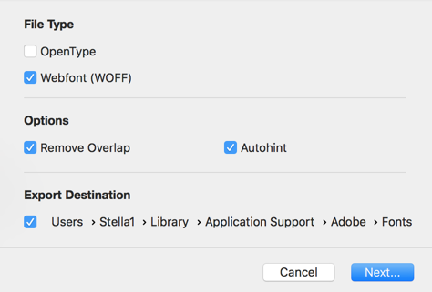
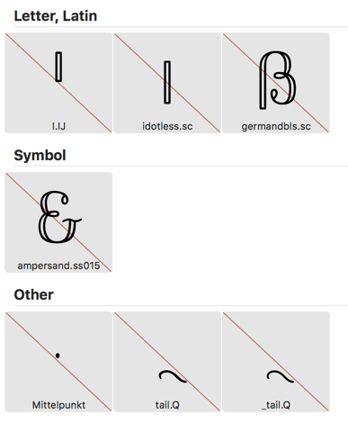
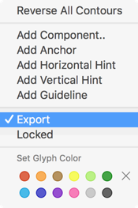
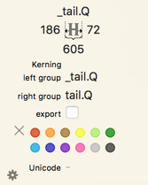
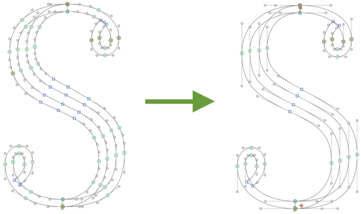
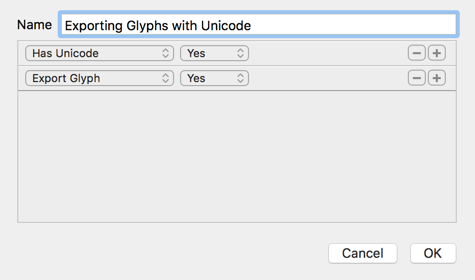
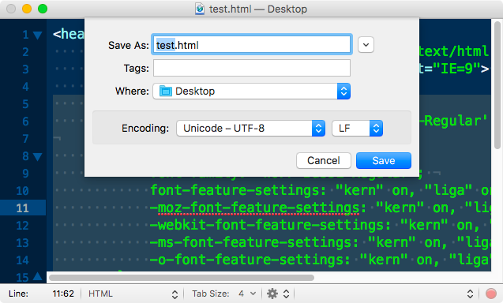
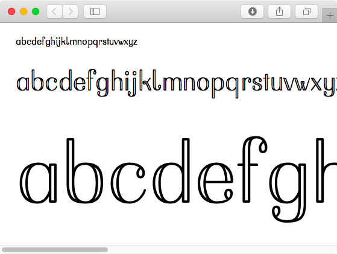

原文: [Creating a webfont in Glyphs Mini](https://glyphsapp.com/learn/creating-a-webfont-in-glyphs-mini)
# Glyphs Miniでウェブフォントを作る

チュートリアル

[ Glyphs Mini ](https://glyphsapp.com/learn?q=glyphs+mini)

by

[ en ](https://glyphsapp.com/learn/creating-a-webfont-in-glyphs-mini) [ es ](https://glyphsapp.com/es/learn/creating-a-webfont-in-glyphs-mini) [ fr ](https://glyphsapp.com/fr/learn/creating-a-webfont-in-glyphs-mini) [ zh ](https://glyphsapp.com/zh/learn/creating-a-webfont-in-glyphs-mini)

2022年7月28日 2017年1月31日公開

Glyphs Miniでフォントを作成し、それをウェブページで表示したいですか？ボタンをクリックするのと同じくらい簡単です。

## WOFFを書き出す

ウェブフォントを作成するためには、拡張子が`.woff`または`.woff2`のファイルが必要です。では、WOFFとは何でしょうか？Web Open Font Format（WOFF）は、ウェブページで使用するためのフォント形式です。2009年にErik van Blokland、Tal Leming、Jonathan Kewandによって開発され、現在ではWorld Wide Web Consortium（W3C）の勧告となっています。WOFFは、本質的には圧縮され、追加のメタデータが付いたOpenTypeまたはTrueTypeです。WOFF2は、WOFFをより効率的にパッケージ化し、圧縮率を高めたバリエーションです。[どのウェブブラウザがWOFFをサポートしているか](https://caniuse.com/#feat=woff)、また[WOFF2をサポートしているか](https://caniuse.com/#feat=woff2)を確認できます。すべてのモダンブラウザがかなり良く対応していることがわかるでしょう。

フォントをWOFFとして書き出すには、*ファイル > 書き出し*（Cmd-E）を選択し、ファイルタイプで「Webfont (WOFF)」を選びます。Glyphs MiniはWOFFと、バージョン2.1以降ではWOFF2ファイルの両方を書き出します。



必要であれば、ここで[フォントに自動ヒントを適用する](hinting-postscript-autohinting.md)こともできます。*自動ヒント*オプションは、手動でヒントが設定されていないすべてのグリフにAFDKOの自動ヒントアルゴリズムを適用します。このオプションは、標準のステムとアライメントゾーンが正しく設定されていることを期待しているので、[フォント情報で正しい測定値が設定されていることを確認してください](font-info-settings-in-glyphs-mini.md)（Cmd-I）。ヒントを適用すべきでないフォントや、テスト目的で書き出しを高速化したい場合は、このオプションのチェックを外してください。

> **ヒントは必要ですか？** ヒントは、小さいサイズで読むためにデザインされた、かなり「レギュラーな」フォントにのみ意味があります。ヒントは、アウトラインをピクセルグリッドにより良く合わせるために変形させることで、アウトラインの忠実性を犠牲にして低解像度での最低限の可読性を維持するのに役立ちます。言い換えれば、ディスプレイ書体や、[複雑なアウトラインを持つフォント](creating-fonts-with-complex-outlines.md)（ノード数が多いものすべて）、スクリプト書体には意味がありません。

*オーバーラップを削除*オプションは、書き出し時にパスの重なりを除去するアルゴリズムを適用します。これは*オーバーラップを削除*フィルターと同様です。テスト目的で書き出しを高速化する場合や、すでにファイル内でオーバーラップを削除している場合は、このオプションのチェックを外すことができます。

*書き出し先*オプションでは、フォントが書き出されるデフォルトの場所を設定できます。書き出し先を設定しない場合、Glyphs Miniは保存ダイアログを表示します。ただし注意してください。フォントを書き出すと、同じ書き出し場所にある同じ名前の以前のインスタンスは上書きされます。これは、書き出し先として[Adobe Fontsフォルダ](testing-your-fonts-in-adobe-apps.md)を使用する場合に便利です。

## ファイルサイズを小さく保つ

ここでの主な目標は、フォントのファイルサイズをできるだけ小さく保つことです。まず、表示したいグリフのみを書き出していることを確認してください。そのためには、編集ビューのコンテクストメニュー、またはフォントビューのサイドバーメニューで*書き出す*オプションのチェックを外します。





フォントビューでは、書き出されないグリフはグリフセルに赤い線が引かれて表示されます。



また、グリフ内のノードをできるだけ少なくすることも確実に行ってください。



## ブラウザでフォントをテストする

私たちのWOFFが実際にどう見えるかを確認するためには、テスト用のHTMLとCSSコードが必要です。

> Wikipediaを引用すると、[HTML](https://en.wikipedia.org/wiki/HTML)は*HyperText Markup Language*を意味し、ウェブページを作成するための標準的なマークアップ言語です。HTMLを使えば、フォントや画像、その他のオブジェクトをページに埋め込むことができます。そして、[CSS](https://en.wikipedia.org/wiki/Cascading_Style_Sheets)は*Cascading Style Sheets*を意味し、マークアップ言語で書かれた文書の表示を記述するために使用されるスタイルシート言語です。CSSは主に、レイアウト、色、フォントなどの側面を含む、文書のコンテンツと文書の表示を分離することを可能にするために設計されています。CSSはHTMLファイル内に埋め込むことができます。

お好みのプレーンテキストエディタ（[TextMate](https://macromates.com)、[SublimeText](https://www.sublimetext.com)、[Atom](https://atom.io)、[TextWrangler](http://www.barebones.com/products/textwrangler/)などが人気です）に以下をコピー＆ペーストすることで、ブラウザでフォントをテストできます。

    <head>
        <meta http-equiv="Content-type" content="text/html; charset=utf-8">
        <meta http-equiv="X-UA-Compatible" content="IE=9">
        <title>your font</title>
        
    </head>
    <body>
        
abcdefghijklmnopqrstuvwxyz

        
abcdefghijklmnopqrstuvwxyz

        
abcdefghijklmnopqrstuvwxyz

    </body>

HTMLコード内の`yourfont`のすべてのインスタンスを、実際のフォント名に置き換えてください。CSSを編集して、表示したいフォントサイズを自由に選んでください。フォント内の書き出すグリフをすべて表示したい場合は、ここにコツがあります。フォントビューの左下隅にある歯車をクリックして、Glyphs Miniで*スマートフィルター*を追加します。新しいフィルターに2つのルールを追加します。「Unicodeあり」と「グリフを書き出す」です。両方とも「はい」オプションを選択します。



サイドバーで、作成したフィルターを選択します。次に、フォントタブに表示されているすべてのグリフを選択し、*編集 > コピー*（Cmd-C）を選び、テキストファイル内の`abcdefghijklmnopqrstuvwxyz`の代わりにペーストします。WOFFと同じフォルダに`.html`という拡張子で保存します。

次に、そのファイルをブラウザのウィンドウにドラッグすれば、ほらこの通り。

また、オンラインでフォントをテストできるウェブサイトもいくつかあります。私たちのお気に入りは以下の通りです。

*   [Wakamai Fondue](https://wakamaifondue.com) by Dutch designer and coder [Roel Nieskens](https://pixelambacht.nl)
*   [Font Drop](https://fontdrop.info) by German type designer [Viktor Nübel](https://www.viktornuebel.com) and his brother [Clemens Nübel](http://www.lieberungewoehnlich.de)

WOFFファイルをドラッグするだけで、ウェブフォントの中身を覗くことができます。フォントに間違いを見つけたら、Glyphs Miniで修正し、再書き出ししてください。その後、テストページをリロードすれば、更新されたバージョンのフォントが表示されるはずです。

楽しんで！

サンプルフォント：Bussi by Stella Chupik

---

更新履歴 2017-03-21: HTMLセットアップの軽微な明確化、スクリーンショット2枚追加。

更新履歴 2019-09-23: ウェブフォントテストページを更新、WOFF2とヒンティングに関する注記を追加。

更新履歴 2020-03-11: 誤字を修正。

更新履歴 2022-07-28: タイトル、関連記事、軽微なフォーマットを更新。

## 関連記事

[すべてのチュートリアルを見る →](https://glyphsapp.com/learn)

*   ### [Glyphs Miniでのフォント情報設定](font-info-settings-in-glyphs-mini.md)

チュートリアル

[ Glyphs Mini ](https://glyphsapp.com/learn?q=glyphs+mini)

*   ### [Glyphs Miniでピクセルフォントを作る](creating-a-pixel-font-in-glyphs-mini.md)

チュートリアル

[ Glyphs Mini ](https://glyphsapp.com/learn?q=glyphs+mini)

*   ### [IllustratorからGlyphs Miniに読み込む](importing-from-illustrator-into-glyphs-mini.md)

チュートリアル

[ Glyphs Mini ](https://glyphsapp.com/learn?q=glyphs+mini)

*   ### [Glyphs Miniでオールキャップスフォントを作る](creating-an-all-caps-font-in-glyphs-mini.md)

チュートリアル

[ Glyphs Mini ](https://glyphsapp.com/learn?q=glyphs+mini)