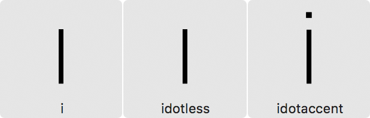

原文: [Creating an all-caps font in Glyphs Mini](https://glyphsapp.com/learn/creating-an-all-caps-font-in-glyphs-mini)
# Glyphs Miniでオールキャップスフォントを作る

チュートリアル

[ Glyphs Mini ](https://glyphsapp.com/learn?q=glyphs+mini)

Rainer Erich Scheichelbauer著

[ en ](https://glyphsapp.com/learn/creating-an-all-caps-font-in-glyphs-mini) [ es ](https://glyphsapp.com/es/learn/creating-an-all-caps-font-in-glyphs-mini) [ fr ](https://glyphsapp.com/fr/learn/creating-an-all-caps-font-in-glyphs-mini)

2022年7月28日 2018年6月25日公開

オールキャップスフォントでは、ユーザーが小文字のキーをタイプしても大文字のキーをタイプしても、同じ大文字が表示されるべきです。これをGlyphs Miniで実現するための、簡単なステップバイステップのチュートリアルを読んでいきましょう。

コンピュータは、Unicode値によって文字を（したがって、大文字と小文字も）区別します。例えば、大文字のKにはUnicode値`U+004B`が、対応する小文字のkには`U+006B`が割り当てられています。

`U+`が何を意味するのか疑問に思っている方のために説明すると、これはUnicodeの16進数コードを示すマーカーです。最も重要なコード、いわゆる「基本多言語面」（BMP）にあるコードは4桁で、`U+0000`から`U+FFFF`までの4桁の16進数で表現できます。合計65,536の符号点があり、すべての現代の書記体系の文字が含まれています。[Unicodeチュートリアルでさらに詳しく読むことができます。](unicode.md)

フォント内のグリフは、そのUnicode値によってアクセスされるか、あるいは通常ドットサフィックスが付いたグリフのように、OpenTypeの置換フィーチャーを通じてアクセスされます。このフィーチャーは、Unicode値を持つグリフを、Unicode値が関連付けられていないグリフに置き換えます。Unicode値を持つグリフは、（適切なキーボードレイアウトがあれば）しばしばタイプしたり、テキストとしてコピー＆ペーストしたりできます。

## 二重のユニコード

幸いなことに、Glyphs Mini 2.0.2 (91)以降では、グリフに1つだけでなく、複数のUnicode値を割り当てることができます。Glyphsでは、これらを一括で自動的に割り当てることさえ可能です。

1.  フォントビュー（Cmd-Opt-1）で、左のサイドバーに行き、*カテゴリ > 書字 > 小文字*を選択します。
2.  すべてのグリフを選択します（*編集 > すべてを選択*、Cmd-A）。
3.  左下のマイナスボタンをクリックしてグリフを削除します。確認ダイアログが表示されます。

これで、書き出す際に、対応する小文字を持たないすべての大文字に、小文字のUnicode値も*書き出し時に*割り当てられるはずです。この変更はユーザーインターフェースには反映されませんが、[Adobe Fontsフォルダでフォントをテストする](testing-your-fonts-in-adobe-apps.md)か、別のフォルダに書き出して[TextPreviewでフォントをテストする](/tools/textpreview)ことで確認できます。

### バージョンに関する注意

これはバージョン2.0.2 (91)以降でのみ機能します。***Glyphs Mini > Glyphs Miniについて*を開いて、インストールされているバージョンを確認してください。古いバージョンをお持ちの場合は、*Glyphs Mini > 環境設定 > アップデート*に進み、**両方**のチェックボックスを有効にして*今すぐ確認*ボタンを押してください。

## ドット付きiのジレンマ

ただし、大文字と小文字の関係はすべての言語で同じではありません。トルコ語、アゼルバイジャン語、タタール語などのチュルク諸語では、小文字の（ドットなし）ıは大文字の（ドットなし）Iに、小文字の（ドット付き）iは大文字の（ドット付き）İに関連付けられています。一方、フランス語、英語、スペイン語、ドイツ語などの非チュルク諸語では、小文字の（ドット付き）iは大文字の（ドットなし）Iに関連付けられています。

ここでの論理的な問題は、小文字の（ドット付き）iのUnicode値をどの大文字グリフに割り当てるべきか、ということです。もしあなたの答えが`I`なら、あなたのフォントはチュルク諸語と互換性がありません。もし`Idotaccent`なら、ラテン文字を使用するすべての非チュルク諸語と互換性がありません。ジレンマです。

しかし、恐れることはありません。実行可能な回避策があります。チュルク諸語と非チュルク諸語の両方をサポートするためには（少なくともAdobeアプリのようなOpenTypeと言語を認識するアプリケーションで）、以下の3つの小文字のグリフを残しておく必要があります。

    i
    idotless
    idotaccent

`i`と`idotless`はドットのない大文字のIとして、`idotaccent`はドットのある大文字のIとしてデザインします。

そうすれば、言語がトルコ語、アゼルバイジャン語、クリミア・タタール語などに設定された場合に、Glyphs Miniが`i`を`idotaccent`に置き換えるOpenTypeフィーチャーを挿入できます。そして、小文字と大文字の適切な関係が保たれます。

## 縦のメトリクス

*ファイル > フォント情報…*（Cmd-I）で、エックスハイト、アセンダー、ディセンダーの*アライメントゾーン*はおそらく不要になるでしょう。*標準のステム*は、大文字のステムに合わせるだけでよくなります。

ただし、*アセンダー*と*ディセンダー*の値は残しておいてください。これらは、それぞれのOpenTypeフォントテーブル`OS/2`と`hhea`に書き込まれる縦のメトリクス値を導出するために使用されるからです（詳細は[縦のメリクス](vertical-metrics/.md)チュートリアルを参照）。これらの値は、フォントマスターの最高および最低のバウンディングボックスの値、通常は`Ccedilla`や`Ohungarumlaut`のようなダイアクリティカルマークに見られる値のあたりに保つのが最善です。

## 二重エンコーディングの問題点

二重エンコーディングはファイルサイズを削減できる一方で、特定のPDFワークフローで一つの問題があります。PDFから選択したテキストをコピーすると、クリップボード内のキャラクターストリームの大小文字がめちゃくちゃになることがあります。つまり、*coPiED tExt caN END uP looKiNg liKE tHiS*のようになる可能性があります。ただし、PDFが特定の方法で作成され（ヒント：Acrobat Distillerではない）、テキスト抽出も特定の方法で行われる場合は別です。心配しないでください、これはクリップボード内のテキストにのみ影響し、PDF内での表示は問題ありません。それに、いずれにせよPDFからのテキスト抽出には欠陥があり、これがあなたにとって大きな懸念でなければ、問題ありません。

---

更新履歴 2018-04-24: 問題点のセクションを追加。Aaron Bell、Khaled Hosny、John Hudsonに感謝します。

更新履歴 2018-06-29: 「ドット付きiのジレンマ」セクションを追加。Mark Richardson（@superfried）に感謝します。

更新履歴 2020-11-13: Glyphs 3ウェブサイト向けに更新。

更新履歴 2022-07-27: タイトル、関連記事、軽微なフォーマットを更新。

## 関連記事

[すべてのチュートリアルを見る →](https://glyphsapp.com/learn)

*   ### [Glyphs Miniでウェブフォントを作る](creating-a-webfont-in-glyphs-mini.md)

チュートリアル

[ Glyphs Mini ](https://glyphsapp.com/learn?q=glyphs+mini)

*   ### [IllustratorからGlyphs Miniに読み込む](importing-from-illustrator-into-glyphs-mini.md)

チュートリアル

[ Glyphs Mini ](https://glyphsapp.com/learn?q=glyphs+mini)

*   ### [Glyphs Miniでのフォント情報設定](font-info-settings-in-glyphs-mini.md)

チュートリアル

[ Glyphs Mini ](https://glyphsapp.com/learn?q=glyphs+mini)

*   ### [Glyphs Miniでピクセルフォントを作る](creating-a-pixel-font-in-glyphs-mini.md)

チュートリアル

[ Glyphs Mini ](https://glyphsapp.com/learn?q=glyphs+mini)