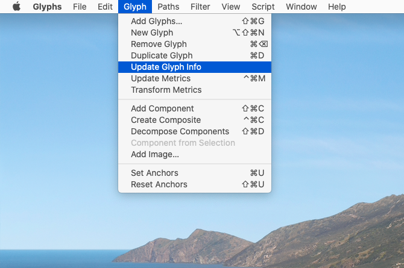
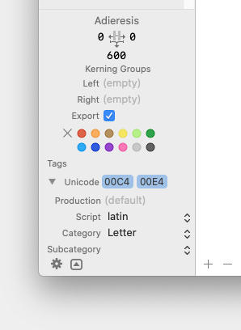
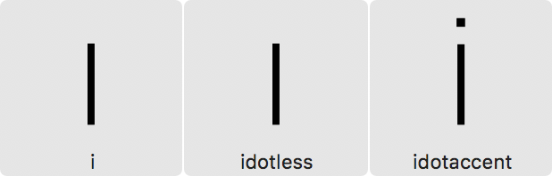

原文: [Creating an all-caps font](https://glyphsapp.com/learn/creating-an-all-caps-font)
# オールキャップスフォントの作り方

チュートリアル

Rainer Erich Scheichelbauer著

[ en ](https://glyphsapp.com/learn/creating-an-all-caps-font) [ fr ](https://glyphsapp.com/fr/learn/creating-an-all-caps-font) [ zh ](https://glyphsapp.com/zh/learn/creating-an-all-caps-font)

2022年7月29日 2018年4月12日公開

オールキャップスフォントでは、ユーザーが小文字のキーをタイプしても大文字のキーをタイプしても、同じ大文字が表示されるべきです。これを実現するための、簡単なステップバイステップのチュートリアルを読んでいきましょう。

コンピュータは、Unicode値によって文字を（したがって、大文字と小文字も）区別します。例えば、大文字のKにはUnicode値`U+004B`が、対応する小文字のkには`U+006B`が割り当てられています。

### 知っておくと良いこと

`U+`が何を意味するのか疑問に思っている方のために説明すると、これはUnicodeの16進数コードを示すマーカーです。最も重要なコード、いわゆる「基本多言語面」（BMP）にあるコードは4桁で、`U+0000`から`U+FFFF`までの4桁の16進数で表現できます。合計65,536の符号点があり、すべての現代の書記体系の文字が含まれています。[このチュートリアルでUnicodeについてさらに詳しく読むことができます。](unicode.md)

フォント内のグリフは、そのUnicode値によってアクセスされるか、あるいは通常ドットサフィックスが付いたグリフのように、OpenTypeの置換フィーチャーを通じてアクセスされます。このフィーチャーは、Unicode値を持つグリフを、Unicode値が関連付けられていないグリフに置き換えます。Unicode値を持つグリフは、（適切なキーボードレイアウトがあれば）タイプしたり、テキストとしてコピー＆ペーストしたりできます。

## 二重のユニコード

幸いなことに、グリフには1つだけでなく、複数のUnicode値を割り当てることができます。Glyphsでは、これらを一括で自動的に割り当てることさえ可能です。

1.  フォントビュー（Cmd-Opt-1）で、左のサイドバーに行き、_カテゴリ > 書字 > 小文字_を選択します。
2.  すべてのグリフを選択します（_編集 > すべてを選択_、Cmd-A）。
3.  _グリフ > グリフを削除_（Cmd-Delete）を選択します。表示されるダイアログで確定します。

フォントビュー（Cmd-Opt-1）でグリフを選択し、Cmd-Deleteを押すとこのダイアログが表示されます。

4.  左のサイドバーで、_カテゴリ > 書字 > 大文字_を選択します。
5.  再び、すべてのグリフを選択します（_編集 > すべてを選択_、Cmd-A）。
6.  _グリフ > グリフ情報を更新_を選択します。

これで、すべての大文字に2つのUnicode値が割り当てられているはずです。元の大きな文字の値に加え、対応する小文字のコードです。フォントビューで大文字を選択し、左下のグリフ情報を見て、すべてがうまくいったか確認できます。

ほら、_Unicode_と書かれているところに、複数のエントリーが表示されています。うまくいきました！

## ドット付きiのジレンマ

ただし、大文字と小文字の関係はすべての言語で同じではありません。トルコ語、アゼルバイジャン語、タタール語などのチュルク諸語では、小文字の（ドットなし）ıは大文字の（ドットなし）Iに、小文字の（ドット付き）iは大文字の（ドット付き）İに関連付けられています。一方、フランス語、英語、スペイン語、ドイツ語などの非チュルク諸語では、小文字の（ドット付き）iは大文字の（ドットなし）Iに関連付けられています。

ここでの論理的な問題は、小文字の（ドット付き）iのUnicode値をどの大文字グリフに割り当てるべきか、ということです。もしあなたの答えが`I`なら、あなたのフォントはチュルク諸語と互換性がありません。もし`Idotaccent`なら、ラテン文字を使用するすべての非チュルク諸語と互換性がありません。ジレンマです。

しかし、恐れることはありません。実行可能な回避策があります。チュルク諸語と非チュルク諸語の両方をサポートするためには（少なくともAdobeアプリのようなOpenTypeと言語を認識するアプリケーションで）、`i`、`idotless`、`idotaccent`という3つの小文字のiのグリフを残しておく必要があります。_グリフ > グリフを追加…_（Cmd-Shift-G）を選択し、表示されるダイアログにこの[レシピ](recipes.md)をペーストします。

    I=i
    I=idotless
    Idotaccent=idotaccent

言い換えれば、オールキャップスフォントでは、`i`と`idotless`はドットの*ない*大文字のIに、`idotaccent`はドットの*ある*大文字のİになるべきです。このようになります。

次に、_ファイル > フォント情報 > フィーチャー_に進み、_更新_ボタンをクリックします。そうすると、Glyphsは`locl`フィーチャーを挿入し、言語がトルコ語、アゼルバイジャン語、クリミア・タタール語などに設定された場合に`i`を`idotaccent`に置き換えるようになります。そして、小文字と大文字の適切な関係が保たれます。

## フィーチャーとグリフセット

_ファイル > フォント情報 > フィーチャー_（Cmd-I）で、自動および手動のOpenTypeフィーチャーを更新するのを忘れないでください。また、小文字がなくなると意味がなくなる可能性のある`case`や`cpsp`などのフィーチャーを削除することも検討してください。

グリフセットを再考する必要もあるかもしれません。オールキャップスフォントには通常、オールドスタイル数字は不要で、ライニング数字はおそらく高さの補正も必要なく、キャップハイトいっぱいに広げることができます。丸括弧、角括弧、波括弧のデザインも再検討したいかもしれません。引用符、ダッシュ、バー、スラッシュは、大文字に合わせるだけでよくなります。

## メトリクス

大文字小文字混合のフォントを大文字のみに変換している場合で、大文字間のトラッキングを増やすための`cpsp`フィーチャーがあったなら、その追加のスペーシングをパスを含む大文字グリフのサイドベアリングに組み込みたいかもしれません。コンパウンドグリフで自動整列を使用している場合、それらは自動的に追従します。そのためには、次の手順に従ってください。

1.  フォントビュー（Cmd-Opt-1）で、左下の歯車メニューを開き、_スマートフィルターを追加_を選択します。
2.  スマートフィルターのオプションで、適切な名前を選び、条件_パスの数：0より大きい_と_カテゴリ：書字_を追加し、_OK_を押して確定します。
3.  スマートフィルターが選択されていることを確認し、フィルターによって表示されたすべてのグリフを選択します（Cmd-A）。
4.  _フィルター > 変形 > メトリクス_で、_相対_オプションを選択し、`cpsp`の増加分（通常は5や10ユニットのような値）をグリフに追加します。_OK_で確定します。

### プロのヒント

マークがずれている可能性があり、特にRSBが意図したものと違うかもしれないので、整列していないコンパウンドがないか再確認したいかもしれません。この場合も、スマートフィルターを使って問題の箇所を見つけることができます。今回は、オプション_コンポーネントの数：0より大きい_と_自動で整列：いいえ_を使います。

これで、残りのすべての大文字が必要なサイドベアリングを持つようになりました。

## 縦のメトリクス

_ファイル > フォント情報 > マスター_（Cmd-I）で、エックスハイト、アセンダー、ディセンダーの_アライメントゾーン_はおそらく不要になるでしょう。_標準のステム_は、大文字のステムに合わせるだけでよくなります。

ただし、_アセンダー_と_ディセンダー_の値は残しておいてください。これらは、それぞれのOpenTypeフォントテーブル`OS/2`と`hhea`に書き込まれる縦のメトリクス値を導出するために使用されるからです（詳細は[縦のメトリクス](vertical-metrics/.md)チュートリアルを参照）。これらの値は、フォントマスターの最高および最低のバウンディングボックスの値、通常は`Ccedilla`や`Ohungarumlaut`のようなダイアクリティカルマークに見られる値のあたりに保つのが最善です。

## 二重エンコーディングの問題点

二重エンコーディングはファイルサイズを削減できる一方で、特定のPDFワークフローで一つの問題があります。PDFから選択したテキストをコピーすると、クリップボード内のキャラクターストリームの大小文字がめちゃくちゃになることがあります。つまり、_coPiED tExt caN END uP looKiNg liKE tHiS_のようになる可能性があります。ただし、PDFが特定の方法で作成され（ヒント：Acrobat Distillerではない）、テキスト抽出も特定の方法で行われる場合は別です。心配しないでください、これはクリップボード内のテキストにのみ影響し、PDF内での表示は問題ありません。それに、いずれにせよPDFからのテキスト抽出には欠陥があり、これがあなたにとって大きな懸念でなければ、問題ありません。

そうでなければ、唯一の選択肢はグリフを実際に複製することです。これは、[レシピに関するチュートリアル](recipes.md)で説明されているように、_グリフ > グリフを追加…_を通じて単一コンポーネントのレシピを使い、大文字のコンポーネントコピーを作成するのが最善です。

---

更新履歴 2018-04-24: 問題点のセクションを追加。Aaron Bell、Khaled Hosny、John Hudsonに感謝します。

更新履歴 2018-06-29: 「ドット付きiのジレンマ」セクションを追加。Mark Richardson（@superfried）に感謝します。

更新履歴 2018-02-21: 誤字を修正。

更新履歴 2020-09-22: Glyphs 3向けに更新。

更新履歴 2022-07-29: タイトル、関連記事、軽微なフォーマットを更新。

## 関連記事

[すべてのチュートリアルを見る →](https://glyphsapp.com/learn)

*   ### [スモールキャップスの作り方](making-small-caps.md)

チュートリアル

[ Opentype Features ](https://glyphsapp.com/learn?q=opentype+features)

*   ### [Glyphs Miniでオールキャップスフォントを作る](creating-an-all-caps-font-in-glyphs-mini.md)

チュートリアル

[ Glyphs Mini ](https://glyphsapp.com/learn?q=glyphs+mini)

*   ### [フォントをローカライズする：トルコ語のi](localize-your-font-turkish.md)

チュートリアル

[ Languages ](https://glyphsapp.com/learn?q=languages) [ Opentype Features ](https://glyphsapp.com/learn?q=opentype+features)