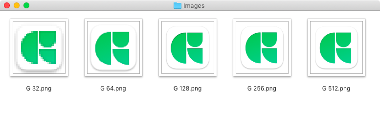
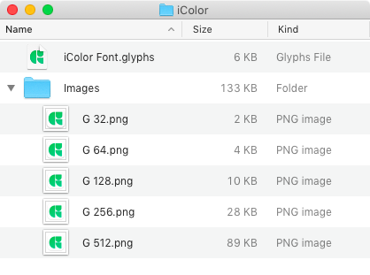
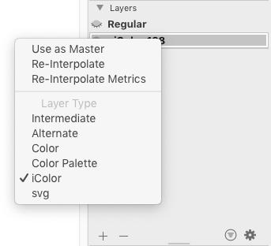
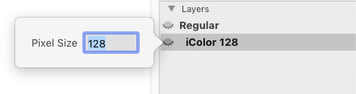
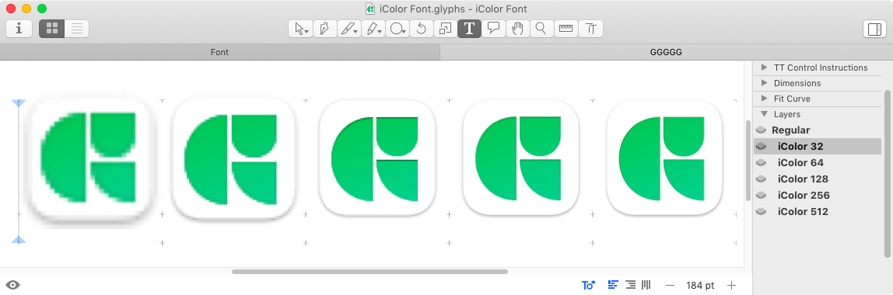
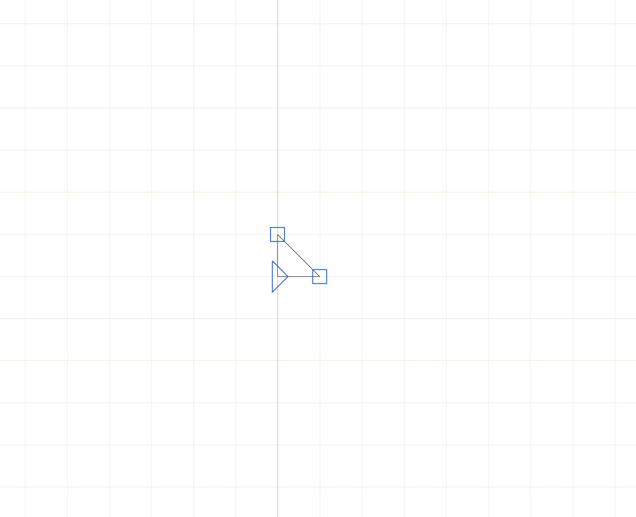
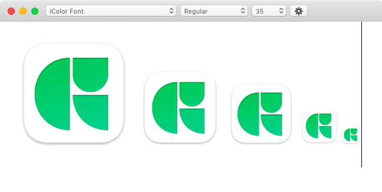
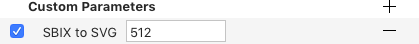
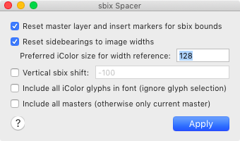

原文: [Creating an Apple color font (sbix)](https://glyphsapp.com/learn/creating-an-apple-color-font)
# Appleカラーフォント（sbix）の作り方

チュートリアル

[ カラー ](https://glyphsapp.com/learn?q=color)

Rainer Erich Scheichelbauer著

[ en ](https://glyphsapp.com/learn/creating-an-apple-color-font) [ es ](https://glyphsapp.com/es/learn/creating-an-apple-color-font) [ fr ](https://glyphsapp.com/fr/learn/creating-an-apple-color-font) [ zh ](https://glyphsapp.com/zh/learn/creating-an-apple-color-font)

2022年7月20日 2014年10月30日公開

MacやiPhoneの絵文字フォントがどのように機能するのか、不思議に思ったことはありませんか？その絵は、フォントに埋め込まれたカラーのビットマップ画像に他なりません。

「Appleスタイル」のカラーフォントでは、ビットマップ画像がフォントファイル内のいわゆる`sbix`テーブルに埋め込まれています。各グリフには、さまざまなサイズの複数の画像を割り当てることができます。これにより、それを表示するデバイスが最も適切な解像度を選択できます。

### 注

sbixテーブルはAppleによって開発され、長い間主にMacやその他のAppleデバイスで使用されてきました。この技術が初めて広く使われたのは、iPhoneの絵文字という形でした。そのため、この技術を使用したフォントは、時折「Appleカラーフォント」や「iColorフォント」など、それに類する名前で呼ばれることがあります。

## サイズバリエーションを準備する

通常、sbixフォントはPortable Network Graphic（PNG）形式を利用します。JPEGやTIFFも問題なく動作します。[Appleのオリジナルの仕様書](https://developer.apple.com/fonts/TrueType-Reference-Manual/RM06/Chap6sbix.html)ではPDFも許可されていましたが、iOSやmacOSではサポートされておらず、PDFは公式に[OpenTypeの仕様](https://docs.microsoft.com/en-us/typography/opentype/spec/sbix)から削除されました。どの形式を選ぶにせよ、これらの画像はGlyphsの外で準備する必要があります。

例えば、Glyphsのアイコンをフォントの大文字Gに入れたいとします。[Pixelmator](http://www.pixelmator.com/)や[プレビュー](http://support.apple.com/kb/ht2506)のような画像編集アプリケーションで、いくつかの解像度の画像ファイルを準備するのが良い考えです。すでに画像がある場合は、サイズのバリエーションを作成するだけです。単純な縮小であれば、[Automatorのワークフロー](https://support.apple.com/guide/automator/create-a-workflow-aut7cac58839/mac)でも可能です。OS Xのサービスとしてインストールすれば、Finderのコンテクストメニューからトリガーできます。

### プロのヒント

少なくとも100ピクセル以下の小さなバリエーションを1つ作成してください。特に古いデバイスでは、低解像度での表示パフォーマンスが大幅に向上することがあります。

いずれにせよ、画像は`.glyphs`ファイルの隣にあるサブフォルダに保管することを強くお勧めします。なぜなら、Glyphsはファイルにバイナリ自体ではなく、その相対パスのみを保存するからです。

もちろん、`.glyphs`ファイルを移動させるときはいつでも、サブフォルダも一緒に移動させてください。そうしないと、Glyphsが画像ファイルが見つからないと文句を言うリスクがあります。もしそうなってしまった場合は、*Set New Path for Images*スクリプトが役立つかもしれません。[mekkablue scripts](glyphsapp3://showplugin/mekkablue%20scripts)の*Images*サブメニューにあります。

## 字幅を設定する

さて、Glyphsを起動して新しいフォントを作成しましょう。大文字Gを表示させ、その字幅を変更します。マスターレイヤーはグリフのメトリクスを決定するためだけのものであり、空のままにしておきます。字幅は、Units Per Em（UPM）に対する画像の比率を反映するべきです。UPMの値は*ファイル > フォント情報 > フォント*で確認できます。

私の場合、アイコンは正方形でUPMは1000（CFF OpenTypeフォントの推奨値であり、Glyphsのアプリデフォルト）なので、字幅を1000に設定しました。もしグラフィックが高さの半分しか幅がない場合は、UPMの半分、つまり500に設定します。幅が2倍の場合は、2000に設定します。お分かりいただけたでしょう。

## 「iColor」レイヤーを作成する

さて、Gを開いたまま、パレット（*ウィンドウ > パレット*、Cmd-Opt-P）を開き、レイヤーセクションに移動します。*Regular*マスターを選択し、プラスボタンをクリックして新しいレイヤーを作成します。現在の日時で名付けられたバックアップレイヤーが表示されます。次に、そのレイヤーを右クリックして*iColor*レイヤーに変換します。

### プロのヒント

読み込み準備ができた画像が*たくさん*ありますか？*Add sbix Images to Font*スクリプトを使った一括読み込みを検討してみてください。詳しくは下記を参照してください。

レイヤーの名前は*iColor 128*に変更され、太字で表示されます。これは、特別なレイヤーとして認識されていることを示しています。次に、レイヤー名をダブルクリックして、目的の解像度を設定します。

### 旧バージョン

古いバージョンのGlyphsでは、レイヤーの名前を`iColor`に続けて半角スペースと画像の解像度を示す数字に変更していました。例えば、`iColor 512`、`iColor 256`、`iColor 128`、`iColor 96`のようになります。

残りは簡単です。FinderからPNGファイルをそれぞれの`iColor`レイヤーにドラッグするだけです。すべてが正しく行われていれば、セットアップは次のようになるはずです。

`iColor`サブレイヤーの字幅や、画像に対する操作（スケーリングや配置）は無視されます。したがって、グリフメトリクス内でPNGを再調整する必要はありません。

## 字幅、スケール、位置を制御する

画像の字幅と垂直位置は、どちらもマスターレイヤー、つまり上記の例では*Regular*レイヤーを通じて制御されます。

**画像の位置**は、マスターレイヤーのバウンディングボックスの原点に設定され、デフォルトではレイヤーの原点（座標0, 0）になります。したがって、例えば画像をベースラインより100ユニット下に移動させたい場合は、y=-100の位置に非常に小さなパスを追加します。おおよそ次のようになります。

### 注

注意：一部の実装（最も顕著なのはChrome）では、マスターレイヤーの*バウンディングボックス*に応じて画像がクリッピングされます。そのため、画像の右上に同様の小さなパスを配置することも望ましいです。

これは、拡大されない閉じた2ノードのパスにすることができます。そうすれば見えなくなります。その唯一の機能は画像の原点を提供することであり、このようなミニパスはその機能をすでに果たしています。これは水平方向の移動にも機能します。単にパスをx=0から移動させるだけです。

グリフの**アドバンス幅**もマスターレイヤーから継承され、マスターレイヤーの字幅を設定することによってのみ制御できます。

**画像のスケール**は、レイヤー名に`iColor`の後に書かれた数字によって制御されます。技術的には、その数字はem、言い換えればフォントサイズに対応する画像のピクセル数です。

したがって、高さ500ピクセルの画像が`iColor 500`という名前のレイヤーに配置されていて、それが好みに比べて小さく見える場合は、レイヤー名に小さい数字、例えば`iColor 450`を使ってみてください。そうすれば、450ピクセルがem（フォントサイズ）を構成することになり、500ピクセルの画像はフォントサイズより9分の1だけ大きくなります。

## 縦のメトリクス

縦のメトリクスについて一つアドバイスです。Appleデバイスでsbix画像がクリッピングされるのを防ぐため、`hhea`の値が画像を完全に包含していることを確認してください。通常、この点で問題となる値は`hheaAscender`だけです。それが画像の上端より上にあることを確認してください。[縦のメトリクスの設定方法について詳しくはこちら。](vertical-metrics.md)

### 書き出し

さて、*ファイル > 書き出し*に進み、書き出し形式としてOTF、TTF、または任意のウェブフォント形式を選択します。Glyphsは[sbixテーブル](https://docs.microsoft.com/en-us/typography/opentype/spec/sbix)を含むフォントを作成します。楽しんでください！例えば、無料の[TextPreview](/tools/textpreview/)でテストできます。

## 同等のSVGテーブル

*ファイル > フォント情報 > 書き出し*のインスタンスに*SBIX to SVG*パラメータを追加することで、ビットマップフォントのリーチ（およびサポート）を広げることができます。値として、希望するピクセルサイズを使用します。

すると、対応する`iColor`レイヤーがSVGテーブルに複製されます。（[SVGフォントについて詳しくはこちら。](creating-an-svg-color-font.md)）言い換えれば、同じビットマップ画像が*2つ*のOpenTypeテーブル、SVGとsbixに含まれることになります。さらに、*Export SVG Table*と*Export sbix Table*を使って、sbixテーブルとSVGテーブルの書き出し・非書き出しを制御できます。これにより、sbixのみ、SVGのみ、そしてsbix/SVGのハイブリッドフォントを生成できます。

## Photoshopでのsbix

最新バージョンのPhotoshop CCはsbixフォントも表示できます。しかし、Photoshopでsbixが機能するためには、次の3つの基準が満たされている必要があります。

1.  sbixグリフは、たとえそれが2つの小さなパスだけであっても、**アウトラインも含まなければなりません**。これらがPhotoshopでの切り抜きバウンディングボックスを定義します。アウトラインがない場合、すべてが切り抜かれ、ピクセル画像は見えません。
2.  フォントは**システムにインストール**されている必要があります（例：FontBookに）。[Adobe Fontsフォルダ](testing-your-fonts-in-adobe-apps.md)では機能しません。[フォントキャッシュの問題を避ける](eliminating-font-cache-problems.md)ために、書き出すたびに異なる名前を使用することをお勧めします。
3.  各フォントのインストール後、sbixフォントが認識されるようにするためには、Photoshopを**再起動する必要があります**。

## sbixのサポート状況

Appleデバイスの他に、sbixフォントはWindows 10以降、およびLinuxやAndroidデバイスでサポート・表示されます。最新のChromeバージョンはすべてのプラットフォームでsbixをサポートしており（ただし、上記のクリッピング問題には注意してください）、Firefoxも表示しますが、AndroidとLinuxでのみです。

## 便利なスクリプト

[mekkablue scripts](glyphsapp3://showplugin/mekkablue%20scripts)には、sbixレイヤーの扱いを容易にする2つのスクリプトが含まれています。

*   *Color > Add sbix Images to Font:* フォルダ内のすべてのPNG、GIF、JPGファイルを取得し、現在のフォントとマスターにそれらを持つ*iColor*レイヤーを作成します。スクリプトは次のファイル命名規則を期待します：`グリフ名 ピクセルサイズ.拡張子`、例：`Adieresis 128.png`。
*   *Color > sbix Spacer* を使うと、sbixの位置とグリフの字幅を一括で設定できます。クリッピングを避けるための小さなパスを挿入するオプションさえあります。

これらに加えて、*Images*サブメニューにあるmekkablue scriptsも便利かもしれません。特に前述の*Set New Path for Images*や、やり直したい場合に画像を削除するためのスクリプトが役立ちます。

---

更新履歴 2017-08-08: 「Photoshopでのsbix」セクションを追加、ヘッダーをタイトルケースに。

更新履歴 2018-04-14: 「sbixのサポート状況」セクションを追加。Behdadさん、ありがとう！チュートリアルのタイトルを更新。

更新履歴 2018-11-18: 縦のメトリクスに関する注記を追加。

更新履歴 2018-11-19: 「字幅、スケール、位置を制御する」セクションを追加、sbixのサポートに関する古い文を削除。

更新履歴 2018-11-29: Chromeでのクリッピングに関する警告を追加、小さなパスの画像を更新。カスタムパラメータを追加。

更新履歴 2018-11-30: *sbixからSVGへ*を明確化。間違ったスクリーンショットを修正。

更新履歴 2019-01-28: 「sbixのサポート状況」のタイトルを修正。

更新履歴 2021-06-20: *便利なスクリプト*を追加し、Glyphs 3向けに更新。該当箇所で「Appleスタイル」を「sbix」に改名。

更新履歴 2022-07-20: タイトル、関連記事、軽微なフォーマットを更新。

## 関連記事

[すべてのチュートリアルを見る →](https://glyphsapp.com/learn)

*   ### [Microsoftカラーフォント（CPAL/COLR）の作り方](creating-a-microsoft-color-font.md)

チュートリアル

[ カラー ](https://glyphsapp.com/learn?q=color)

*   ### [SVGカラーフォントの作り方](creating-an-svg-color-font.md)

チュートリアル

[ カラー ](https://glyphsapp.com/learn?q=color)

*   ### [レイヤーカラーフォントの作り方](creating-a-layered-color-font.md)

チュートリアル

[ カラー ](https://glyphsapp.com/learn?q=color)