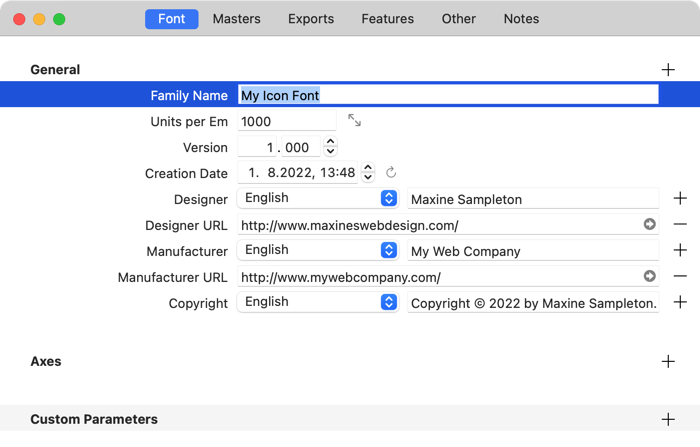
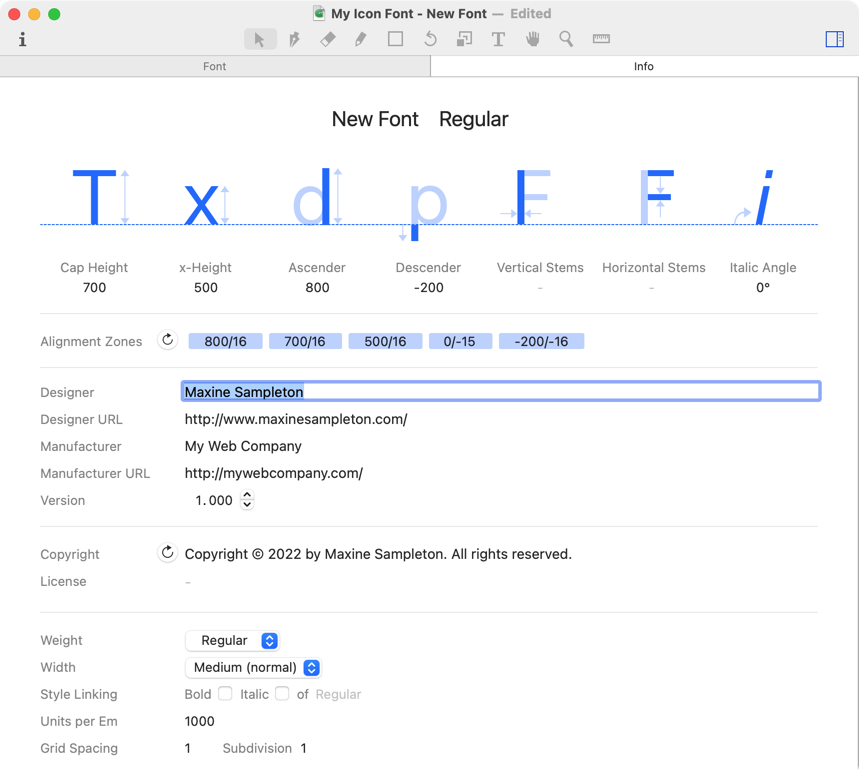
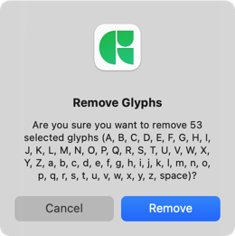
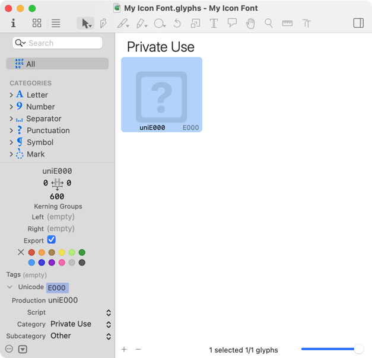
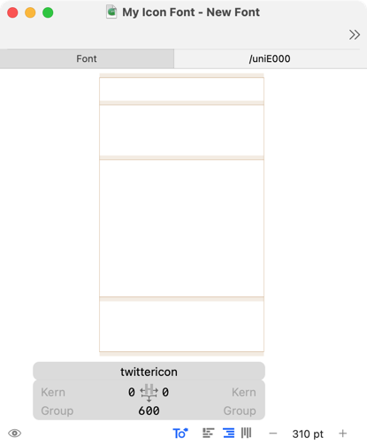
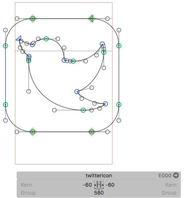
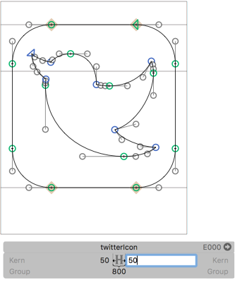
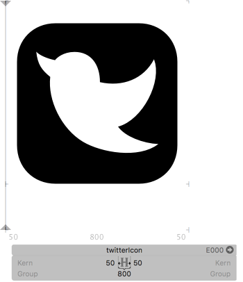
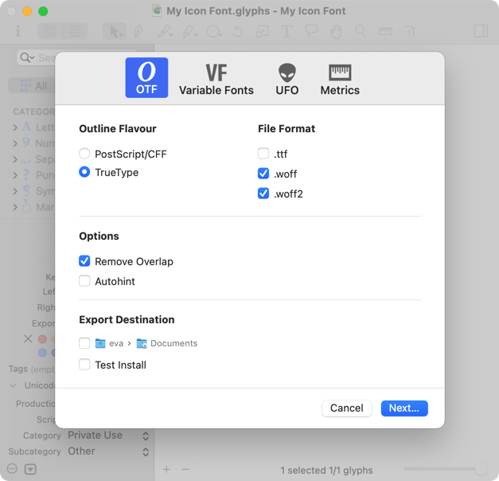

原文: [Creating an icon webfont](https://glyphsapp.com/learn/creating-an-icon-webfont)
# アイコンウェブフォントの作り方

チュートリアル

[ Glyphs Mini ](https://glyphsapp.com/learn?q=glyphs+mini)

Rainer Erich Scheichelbauer著

[ en ](https://glyphsapp.com/learn/creating-an-icon-webfont) [ zh ](https://glyphsapp.com/zh/learn/creating-an-icon-webfont)

2022年8月1日 2014年3月23日公開

あなたのアイコンセットをウェブフォントに変えて、より速く、より見栄えの良いウェブページを作りましょう！

最近のウェブブラウザは、ほぼすべてウェブフォントを表示する機能を持っています。ですから、アイコンをJPEG、PNG、GIF、SVGに変換する代わりにフォントに入れて帯域幅を節約するのは良いアイデアです。さらに、ラスタライズを避けられるため、アイコンの解像度非依存性を保つことができます。

## 新しいアイコンフォントを作る

まず、Glyphsを起動し、_ファイル > 新規_を選び、作業中のファイルを_ファイル > 保存_で都合の良い場所に保存します。次に、_ファイル > フォント情報 > フォント_に移動して、フォントに名前を付けます。_ファミリー名_を入力し、必要であればデザイナー（アイコンを描いた人）とそのURL、製造元（フォントを制作する人や会社）とそのURLも入力します。最終的に、丸い矢印の更新ボタンをクリックすると、Glyphsが著作権表示を自動生成してくれます。

Glyphs Miniの場合は、フォント情報はメインウィンドウのタブになっています。

その他の項目は私たちにとって重要ではありません。完了したら、フォント情報ウィンドウ（またはタブ）を閉じてフォントウィンドウに戻り、もう一度フォントを保存しておきましょう。

## アイコン用のPUAグリフを作る

フォント内のスロットはグリフと呼ばれ（私たちのお気に入りのフォントエディタの名前の由来です）、それらのグリフは通常、文字に対応しています。簡単に言うと、文字はあなたたちがタイプするもの、グリフはあなたたちが見るものです。文字とグリフの関係は、グリフに割り当てられたUnicode値を通じて確立されます。時には、グリフにUnicode値がないこともありますが、私たちのアイコンフォントでは、各グリフに一つずつ値があります。Unicode、グリフ、文字についてもっと知りたい場合は、[Unicode](unicode/.md)チュートリアルを読んでください。

Unicodeが割り当てられたグリフには、そのUnicode値の意味に合った絵だけを入れるべきです。例えば、`U+0041 LATIN CAPITAL LETTER A`には、少なくとも漠然とAに似たものだけを入れるべきです。なぜアイコンではダメなのでしょうか？なぜなら、何らかの理由で私たちのアイコンウェブフォントが読み込めず、フォールバックフォントに置き換えられた場合に、検索エンジンやウェブサイトの検索機能、あるいは画面に表示されているものを理解しようとしている人を混乱させる可能性があるからです。

そこで、フォントウィンドウでまず行うことは、すべてのグリフを選択し、ウィンドウ下部のマイナスボタンをクリックすることです。Glyphsがあなたが何をしているか分かっているか尋ねてきたら、_削除_と言います。

さて、これでフォントにはもう文字がなくなりましたが、アイコンはどこに入れればいいのでしょうか？簡単です。私用領域（Private Use Area、PUA）のUnicode値に関連付けられた新しいグリフに入れます。

私用領域とは何でしょう？説明します。Unicode値の長大な範囲の中には、あなたが使いたい目的のために予約されている領域がいくつかあります。言い換えれば、[Unicodeコンソーシアム](http://www.unicode.org/consortium/consort.html)の親切な方々が言うところの、_私的利用_のための領域です。

Unicode標準にはいくつかのPUAがありますが、私たちにとって最も便利なのは、基本多言語面（Basic Multilingual Plane、BMP、つまり`U+0000`から`U+FFFF`までのすべてのUnicode）内のPUAです。BMP内のPUAは`U+E000`から`U+F8FF`までの範囲です。

では、そこにグリフを作成するにはどうすればいいでしょうか？先ほど押したマイナスボタンの隣にあるプラスボタンをクリックします。`newGlyph`という名前の新しいグリフが表示されます。次のような見た目になるでしょう。

ここで知っておくべきことは、Glyphsはグリフに割り当てた名前に基づいて、そのグリフのUnicode値を自動的に設定するということです。ですから、グリフを`B`と名付ければ、GlyphsはそのUnicodeを`U+0042`（`LATIN CAPITAL LETTER B`のUnicode）に設定します。グリフをBMPのPUAに入れるには、`uni`に続けて`E000`から`F8FF`までの4桁の16進数コードを付けた名前にする必要があります。つまり、`uniE000`から`uniF8FF`までの間の名前なら何でも構いません。

カテゴリが_私用_に変わるのがわかるでしょう。また、グリフのプレースホルダー画像とUnicode値の両方が、このグリフが公式に私用領域内に存在することを示すように変わりました。クールですね。

いや待ってください、実はあまりクールではありません。アイコンが2つか3つしかない場合は大した問題ではありませんが、20個、100個、あるいはそれ以上のアイコンがある場合、これらの名前はあまり役に立ちません。ここにちょっとしたコツがあります。グリフの名前を`uniE000`のように変更してUnicode値を割り当てたら、その名前を_もう一度_変更できます。今度は`twitterIcon`や`shoppingCartIcon`のような分かりやすい名前にしても、グリフはUnicode値を保持します。

グリフ名を変更した後は、そのUnicode値に注意してください。もしそれが再びPUAの外の何かに変わってしまったら、それはおそらく別のグリフのために予約されている名前を選んでしまったということです。Glyphsには認識するグリフ名の組み込みリストがあり、必要であれば_ウィンドウ > グリフ情報_で確認できます。あるいは、単にグリフ名の最後に`Icon`を追加すれば、すべてのトラブルを避けられます。

グリフ名について一言。大文字と小文字のASCII文字、つまりA-Zとa-zのみを使い、名前の最後には数字（0-9）を付けることもできます。スペースは許可されておらず、名前を数字で始めることはできません。したがって、`homeIcon`や`loginIcon`はOKですが、`home button`や`MäxIcon`のような名前はNGです。グリフ名についてもっと知りたい場合は、[グリフ名を正しく設定する](getting-your-glyph-names-right/.md)を読んでください。

## 他のアプリでアイコンを準備する

Glyphsは優れた描画ツールを提供していますが、すでにベクターアイコンを持っている可能性が高いでしょう。ほとんどのベクターアプリからは、Glyphsに単純にコピー＆ペーストできます。そして、Glyphsでのスケーリングは丸め誤差につながる可能性があるため、アートワークをフォントに取り込む_前_に正しいサイズに拡大縮小するのが最善です。

Illustratorなどでの1ポイントが、Glyphsでの1ユニットになることを覚えておいてください。そして、通常はアイコンを大文字とほぼ同じサイズにしたいと思うでしょう。平均的な大文字の高さは、UPM（units per em）サイズの70パーセントです。デフォルトではUPMは1000ユニットに設定されているため、平均的な大文字の高さは700ユニットになります。

ですから、アイコンをGlyphsにコピー＆ペーストする前に、元のアプリケーションで約700ポイントに拡大してください。

このチュートリアルで知っておくべきことはこれだけです。もし興味があって、Adobe IllustratorとGlyphsの間でベクターを移動させることについてもっと知りたい場合は、[Illustratorから読み込む](importing-from-illustrator.md)チュートリアルで読むことができます。

また、_ファイル > フォント情報 > その他 > グリッドの間隔_をゼロに設定するか、_サブディビジョン_を10や100に設定することで、丸め誤差を最小限に抑えることができます。すべての座標は、これら2つの設定に従って丸められます。

なぜ丸め処理があるのか、とあなたは尋ねるかもしれません。それは、一部のフォント形式は整数単位に丸められた座標しかサポートしておらず、整数単位は実際には編集を容易にするからです。

## フォントにアイコンを入れる

さて、最初のアイコンの準備ができました。PUAコードを持つグリフをダブルクリックすると、Glyphsは新しい編集タブを開き、そのグリフを挿入してくれます。あなたのグリフは次のような見た目になるでしょう。

いくつかの線、その背後にある灰色のプレースホルダー画像、そして下にある灰色のグリフ情報ボックスが見えます。Cmd-0を押して、グリフをウィンドウのサイズに拡大します。

これらの線はグリフメトリクスと呼ばれます。下から2番目の線はベースラインです。アイコンをこの線の上に置きたいと思うでしょう。上から2番目の線はキャップハイトで、デフォルトでは700ユニットです。アイコンがこの高さに達するようにしたいと思うでしょう。他の水平線はアセンダー（デフォルトで800）、エックスハイト（500）、ディセンダー（-200）です。これらの値は_ファイル > フォント情報 > マスター_（Glyphs Miniでは単に_ファイル > フォント情報_）で変更できますが、値は同じような範囲に保ってください。値を大きく変えすぎると、後で頭痛の種になることがあります。これについてさらに読みたいですか？ありますよ：[縦のメトリクス](vertical-metrics/.md)チュートリアルです。

2本の垂直線は、左と右のサイドベアリングを示しており、しばしばLSBとRSBと略されます。これらの間の距離は、アドバンス幅または単にグリフの幅と呼ばれます。これらは下部の灰色の情報ボックスで変更できます。

プレースホルダー画像は、グリフに何らかの描画がされるとすぐに消えます。では、単純にアイコンを描画またはペーストしてみましょう。

フォントレンダリングのためにパスを最適化するには、すべてのパスを選択し（または何も選択しない状態にし）、次のコマンドを呼び出します。_パス > パスの向きを修正_（Cmd-Shift-R）、次に_パス > 極点を追加_、そして最後に_パス > パスを整頓_（Cmd-Opt-Shift-T）です。Glyphs Miniでは、これらのコマンドは_グリフ_メニューにあります。良いパスを良くするものについてもっと知りたい場合は、[良いパスを描く](drawing-good-paths/.md)チュートリアルを読んでください。

灰色のグリフ情報ボックスのLとRのフィールドに数字を入れて、左と右のサイドベアリングを調整するのを忘れないでください。良い値がわからなければ、LSBとRSBの両方に50から始めてみてください。

サイドベアリングは後からいつでも変更でき、フォントタブで選択したすべてのグリフに対して一括で設定することもできます。スペーシング（書体デザイナーがサイドベアリングを調整するプロセスをこう呼びます）についてもっと学びたい場合は、[スペーシング](spacing.md)チュートリアルを読んでください。

おめでとうございます、アイコンフォントに最初のアイコンが入りました！ここで再びフォントを保存し（Cmd-S）、テキストツール（T）に切り替えて、アンチエイリアスのかかった美しい姿のあなたの作品を鑑賞するのに良いタイミングです。

グリフの_前_（つまり左側）にカーソルを移動し、編集ツール（ツールバーのペンのシンボル）を選ぶか、単にEscキーを押せば、再びグリフを編集できます。

## ピクセルパーフェクション

ピクセルパーフェクションは完全に過大評価されています。しかし、もし本当に、どうしても必要なら、[ピクセルパーフェクション](pixel-perfection/.md)チュートリアルを読んでください。

## グリフをまとめて作成する

_グリフ > グリフを追加…_（Cmd-Shift-G、Glyphs Miniでは利用不可）を使って、複数のグリフを一度に作成できます。名前をスペースまたは改行で区切って入力します。例：

    uniE000
    uniE001
    uniE002
    uniE003
    uniE004
    uniE005
    uniE006
    uniE007
    uniE008
    uniE009
    uniE00A

…といった具合です。_生成_ボタンを押すと、グリフがフォントに追加されます。編集タブが開いている場合は、サンプル文字列にも挿入されます。

## フォントをテストする

理論的には、_ファイル > 書き出し_でフォントを書き出すだけで（詳細は後述）、準備完了です。しかし…

未完成のフォントを試用する際には一つの問題があります。それは_フォントキャッシュ_です。真面目な話、フォントをテストすると決める前に、これら2つのチュートリアルを読んでください。まず、[フォントキャッシュの問題を解消する](eliminating-font-cache-problems/.md)、そして、もしMacにAdobeアプリがあるなら、[Adobeアプリでフォントをテストする](testing-your-fonts-in-adobe-apps/.md)です。

私たちが遭遇するサポート問題のほとんどは、フォントキャッシュの問題です。ですから、信じてください、これら2つの記事を注意深く読めば、あなたの人生ははるかに楽になります。読まなければ、悲しみと苛立ちがあなたを待っています。あなたの選択ですが、警告しなかったとは言わせませんよ。

## ウェブフォントを書き出す

GlyphsはOpenTypeフォントのみを書き出します。アイコンが揃ったら、_ファイル > 書き出し_（Cmd-E）を選び、表示されるダイアログで_OTF_を選択します。ここで_アウトラインの種類_を選択できます。CFFまたはTrueTypeです。両方を試して結果をテストし、どちらが見栄えが良いか確認してください。でも正直なところ、もはや大差ありません。TrueTypeはアウトラインが変換されることを意味し、その結果シェイプがわずかに不正確になる可能性があります。次に_ファイル形式_を選びます。ウェブ用にはWOFFとWOFF2を選びます。万が一のために_オーバーラップを削除_は良い考えです。しかし、アイコンフォントでは_自動ヒント_はオフにしなければなりません。（[なぜかはここで読んでください。](creating-fonts-with-complex-outlines.md)）。フォントの_書き出し先_もすぐに選択できます。複数回書き出す場合に便利です。

特にバージョン9以前の[Internet Explorer用](http://caniuse.com/eot)にEOT、そして[他のすべてのブラウザ用](http://caniuse.com/#feat=woff2)にWOFF 2の両方に変換することをお勧めします。

## ウェブページにアイコンを配置する

さて、ウェブフォントができたところで、どうやってこれらのアイコンをウェブページに配置するのでしょうか？EOTとWOFFのために`font-face`を作成する方法はご存知だと仮定します。もし知らないなら、[これ](http://www.w3schools.com/cssref/css3_pr_font-face_rule.asp)や[これ](http://css-tricks.com/snippets/css/using-font-face/)や[これ](http://www.miltonbayer.com/font-face/)、あるいは[Googleで見つかる他の情報](https://www.google.com/search?rls=en&q=font-face&ie=UTF-8&oe=UTF-8)を読んでください。

`font-face`を宣言したら、CSSに次のような疑似セレクタを導入します。

    [data-icon]:before {
       font-family: "My Icon Font";
       content: attr(data-icon);
       speak: none;
    }

HTML5の`data`属性はCSSを汎用的に保つので、アイコンごとに特別なクラスを宣言する必要はなく、`data-icon`を再利用できます。HTMLコードにアイコンを挿入するには、`aria-hidden`属性を持つ空の`span`を使います。

    

`data-icon`属性にUnicode値`E000`が見えますか？この方法なら、コンテンツは意味的に健全なままであり、したがってスクリーンリーダーに優しくなります。もっと一般的に言えば、デバイス非依存になります。

気の利いた方法ですね。ウェブフォントを楽しんでください！そして、ピクセル画像（やSVG）ソリューションに対する速度向上を享受してください。

Markus Greve氏の[tgm Webfontday 2012での素晴らしい講演](http://de.slideshare.net/markusgreve/wbfntdy-2012)に感謝します。

## 便利なスクリプト

mekkablue scripts（_ウィンドウ > プラグインマネージャー > スクリプト_で利用可能）には、_Test > Webfont Test HTML_というスクリプトがあります。書き出し後にこれを実行すると、WOFFの書き出し先にあなたのフォント用のHTMLが作成されます。そして、超便利なことに、お気に入りのブラウザですぐにそれを開いてくれます。

---

更新履歴 2016-05-02: Glyphs 2向けに更新

更新履歴 2022-08-01: タイトル、スクリーンショット、関連記事、軽微なフォーマットを更新

更新履歴 2022-08-03: _便利なスクリプト_を追加し、書き出しに関する段落を書き直し

## 関連記事

[すべてのチュートリアルを見る →](https://glyphsapp.com/learn)

*   ### [ウェブフォント](webfonts.md)

チュートリアル

*   ### [Glyphs Miniでウェブフォントを作る](creating-a-webfont-in-glyphs-mini.md)

チュートリアル

[ Glyphs Mini ](https://glyphsapp.com/learn?q=glyphs+mini)

*   ### [複雑なアウトラインを持つフォントの作り方](creating-fonts-with-complex-outlines.md)

チュートリアル