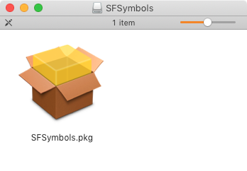
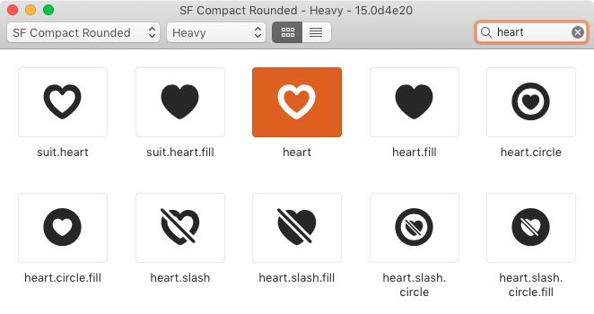
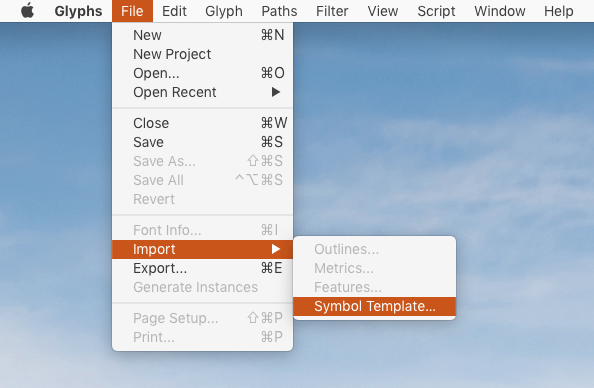
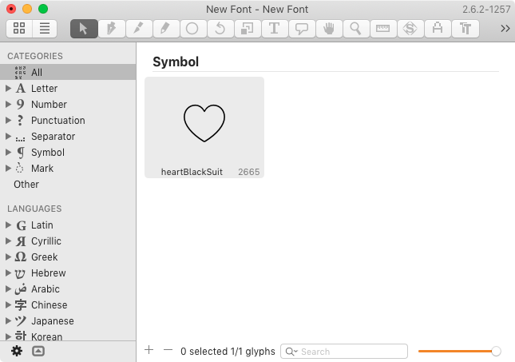
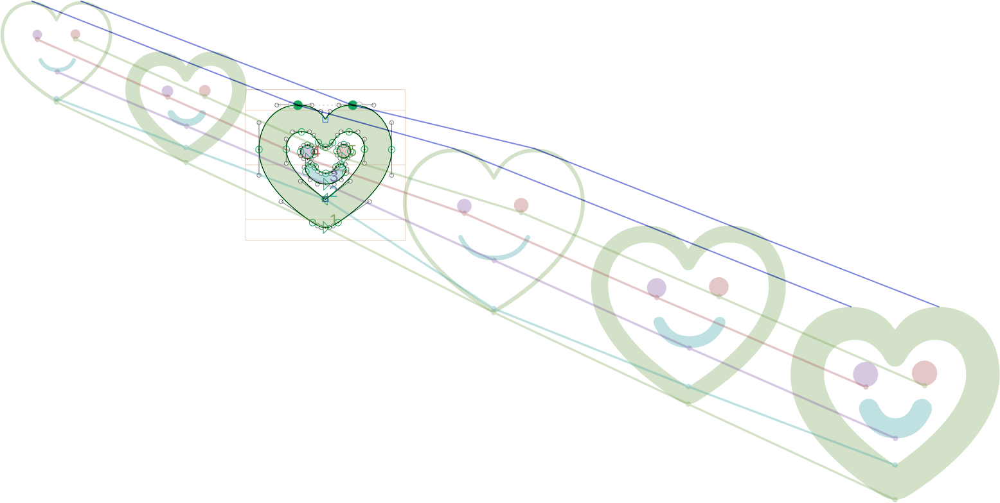
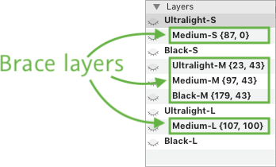
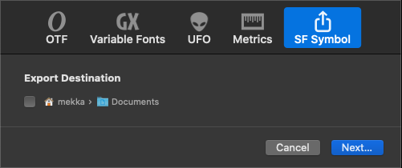

原文: [Creating an SF Symbol](https://glyphsapp.com/learn/creating-an-sf-symbol)
# SFシンボルの作り方

旧チュートリアル

Rainer Erich Scheichelbauer著

[ en ](https://glyphsapp.com/learn/creating-an-sf-symbol) [ zh ](https://glyphsapp.com/zh/learn/creating-an-sf-symbol)

2020年11月12日 2019年10月3日公開

SFシンボルは、Xcodeプロジェクトにアダプタブルなアイコンを追加するのに最適な方法です。このチュートリアルでは、GlyphsでSFシンボルを作成する方法を説明します。

このチュートリアルは、あなたがWWDC 2019でのAppleの[SFシンボルのプレゼンテーション](https://developer.apple.com/videos/play/wwdc2019/206/)を視聴済みであることを前提としています。まだ見ていない場合は、今すぐ視聴してください。

あなたがUIデザイナーで、Macデベロッパーと一緒に仕事をしているなら、彼らはおそらくそのビデオをすでに見ており、Appleによる[SFシンボルのヒューマンインターフェイスガイドライン](https://developer.apple.com/design/human-interface-guidelines/sf-symbols/overview/)も知っているでしょう。もしそうでなければ、そのリンクを彼らに教えてあげてください。

### ダウンロードとインストール

まず、Appleの[SF Symbolsアプリ](https://developer.apple.com/design/downloads/SF-Symbols.dmg)（80MBのディスクイメージ）が必要です。イメージをマウントし、インストーラー（黄色いパッケージ）をダブルクリックします。

画面に表示される指示に従うと、SF Symbolsアプリが「アプリケーション」フォルダにインストールされます。

### テンプレートを作成する

SF Symbolsアプリで、アイコンを一つ選びます。たくさんあるので大変ですが、グリッドビューやリストビューでアイコンをスクロールしたり、左上のフォントメニューで任意のシステムフォントスタイルに合わせて表示したり、右上の検索フィールドで名前を検索したりできます（[ビデオの7:30を参照](https://developer.apple.com/videos/play/wwdc2019-206/?time=450)）。私は、ハートを選んでみます。

一度クリックして選択し、*ファイル > カスタムシンボルテンプレートを書き出す*（Cmd-E）を選びます。次のダイアログで、名前はそのままにして（私の場合は`heart.svg`）、適切な場所に書き出します。私は面倒くさがりなのでデスクトップに書き出します。テンプレート自体は、特別に構造化されたSVGであり（[ビデオの9:50を参照](https://developer.apple.com/videos/play/wwdc2019-206/?time=590)）、次のような見た目になります。

Appleのビデオでは、デザイナーが手作業で（9×3=）27個のバリエーションを描かなければならない様子が紹介されています。うへぇ。でも、待ってください、これは2次元の4マスター補間のように見えませんか？Glyphsを使えば、これらのマスターを描き、残りを補間し、必要に応じて[ブレースレイヤー](additional-masters-for-individual-glyphs-the-brace-trick.md)を1つか2つ挿入することができます。

### テンプレートを読み込む

さて、Glyphsに戻りましょう。*ファイル > 読み込み > シンボルテンプレート…*というメニュー項目があります。

読み込みダイアログで、先ほど保存したSVGファイルを指定し、確定します。GlyphsがSVGを解析し、アイコン用の単一グリフを含む.glyphsファイルに変換します。

アイコンにUnicode値が割り当てられている場合、内部のグリフデータベースに従って適切な名前が付けられます。いずれにせよ、あとはマルチプルマスターフォントで行うのと同じように編集するだけですが、今回はグリフが一つだけです。

ご想像の通り、アウトラインを描き、それを*フィルター > パスのオフセット*で後処理し、さらに*フィルター > 角を丸める*や*フィルター > ラウンドフォント*で処理するのが、描画を追加する良い方法でしょう。私はハートをにっこりさせてみます。

もちろん、Glyphsが提供するマルチプルマスター編集や互換性維持のための素晴らしい機能はすべて利用できます。

*   Optキーを押しながら*パス > すべてのマスターのパスの向きを修正*（Cmd-Opt-Shift-R）を選択すると、各アウトラインの開始点をリセットし、すべてのシェイプを自動的に並べ替えます。これにより、通常はレイヤーの互換性が（再）確立されます。
*   *フィルター > シェイプの順序*を使い、マスターレイヤーとブレースレイヤー間でシェイプの順序を手動で管理します。*パスの向きを修正*でうまくいかない場合は、各レイヤーでシェイプを同じ順序にドラッグします。
*   *表示 > マスターの互換性を表示*（Ctrl-Opt-Cmd-N）でさらに深く掘り下げ、互換性を妨げているアウトライン上の余分なポイントを見つけます。赤いアウトライン上のノードを選択し、Tabキーでノードを順番に移動しながら、マスター間でどのように接続されているかを確認します。
*   パレットサイドバー（Cmd-Opt-P）の*レイヤー*パレット：レイヤーを管理し、レイヤーを右クリックして再補間します。（インデントされた）中間のブレースレイヤーが不要な場合は、それを選択してマイナスボタンをクリックするだけです。
*   *ウィンドウ > プラグインマネージャー*から、多くの無料プラグインやPythonスクリプト集が利用できます。

もしこれが初めてのマルチプルマスターのアウトライン編集であれば、[マルチプルマスターに関する3つのチュートリアル](multiple-masters-part-1-setting-up-masters.md)を必ず読んでおいてください。そして、[ブレースレイヤー](additional-masters-for-individual-glyphs-the-brace-trick.md)がどういうものかを理解しておきましょう。

### 精度の管理：ブレースレイヤーとグリッド

ブレースレイヤーと言えば、Glyphsは読み込み時にSVGテンプレートのアイコンに補間を一致させるために、これらを自動的に挿入します。ブレースレイヤーは、デザインスペース内の神経質な座標に追加の中間マスターを提供することで、補間をサポートします。これにより、非線形の補間を実現できます。ブレースレイヤーは、*レイヤー*パレットで名前の中に波括弧があることで見分けられます。

アイコンテンプレートでは、通常、いくつかを取り除くことができます。そのブレースレイヤーが本当に必要かどうかを調べる良い方法は、すべてのアウトラインを選択し（Cmd-A）、それをレイヤーの背景にコピーし（*パス > 選択範囲を背景に*、Cmd-J）、*表示 > 背景を表示*（Cmd-Shift-B）をオンにしてから、*レイヤー*パレットのコンテクストメニューからレイヤーを再補間することです。前景と背景の差がごくわずかであれば、シェイプに大きな影響を与えることなくブレースレイヤーを削除できます。

もう一つ変更できる重要なことがあります。それはグリッドです。*ファイル > フォント情報 > その他 > グリッドの間隔*と*サブディビジョン*に行き、より少ない、あるいはより多くの精度が必要な場合はこれらの値を調整します。すべてのアウトラインノードは、これらの値によって定義されるグリッドにスナップします。デフォルトでは、整数値のみがサポートされています。つまり、グリッドの間隔は1、サブディビジョンは1で、実質的なグリッドステップも1÷1=1です。しかし、より高い精度が必要な場合は、*サブディビジョン*の値を10や100に変更することを検討してください。そうすれば、実質的なグリッドステップは1÷10=0.1や1÷100=0.01になります。お分かりいただけたでしょうか。

### シンボルテンプレートを書き出す

さて、望み通りの変更を加え、アウトラインの互換性を確保したら、再びテンプレートを書き出して、デベロッパーがXcodeに挿入できるようにします。デベロッパーには、読み込んだときとまったく同じように構造化された.svgファイルが再び必要です。幸いなことに、先ほどインストールしたプラグインは、読み込みオプションだけでなく、書き出しオプションも提供しています。したがって、あなたがすべきことは、*ファイル > 書き出し…*を選び、表示されるダイアログシートでSFシンボルを選択するだけです。

「次へ…」ボタンをクリックして確定すると、SVGがハードドライブに書き込まれます。私の笑顔のハートは今このようになっています。

おめでとうございます！これこそが、Xcodeプロジェクトのアセットに必要なファイルです。

***

### 補足：デザインスペース

さて、ここからは細かい話です。前述の通り、シンボルのバリエーションは2次元のデザインスペースに分布しています。デザインスペースとはデカルト座標系ですが、x軸とy軸の代わりにデザイン軸があります。この場合は*ウェイト*軸と*サイズ*軸です。ウェイト軸は22から202の範囲で、サイズ軸は0から100の間の値を取ることができます。そしてこの領域では、シンボルのバリエーションは次のように広がっています。

バリエーションがデザインスペース上の所定の位置に配置されているのがわかります。*ウェイト*軸の値（22から202）は、ストロークの太さに対応しています。小さいサイズほど、ストロークがわずかに細くなる傾向があるのがわかります。これは、小さいアイコンだと同じストロークでは密度が高すぎて黒く見えすぎてしまうため、同じ視覚的な印象を得るためには少し細くする必要があるからです。フォントデザイナーはこのような調整を「視覚調整」と呼びます。

同じことが*サイズ*軸にも言えます。数値（0から100）は、単に軸上の位置のパーセンテージです。最小（0）と最大（100）のサイズが軸の両端、フォントデザイナーが好んで言うところの「エクストリーム」にあります。しかし、中間のサイズは、数学的に予想される50の位置ではなく、視覚的により意味のある場所に配置されています。それは中央に近いですが、スペクトルの小さい方の端に少しずれています。

さて、ごまかせなかったようですね。おそらく、いくつかの円が白抜きではなく塗りつぶされていることにお気づきでしょう。デザインスペースの四隅にある4つの円（「エクストリーム」）は、4つの*マスター*の位置を示しています。その間の白い点は通常*インスタンス*と呼ばれ、補間によって生成できます。

インスタンスの位置は、ブレースレイヤーが配置される可能性のある場所でもあります。ブレースレイヤーは追加のマスターです。したがって、私たちの図では、これらの位置のいずれかにブレースレイヤーがあると、対応する白い円も塗りつぶされた円に変わります。経験上、多くのブレースレイヤーは必要ありません。運が良ければ、まったくなくても大丈夫です。しかし、もし必要な場合は、サイズ0や100、そしてウェイト80から100の間に1つか2つあれば通常は十分です。ストロークの太さは、通常、最も軽いウェイトからレギュラーまたはミディアムウェイトまでは線形に増加します。ミディアムから最も太いウェイトにかけては、すべてのストロークが線形に太ると密度が高くなりすぎるため、一部のストロークがその役目を引き受け、他よりも少し細いままでいることがあります。そして、その時に中間マスター、別名ブレースレイヤーを追加するのです。フォントデザイナーにとっては標準的な手順ですが、今やUIデザインの分野でも急速に広まっている概念です。

以下は、SFシンボルで可能なすべてのデザインスペース座標（ウェイト、サイズ）、言い換えれば、ブレースレイヤーを配置できる可能性のある位置の正確な概要です。

| | *Ultralight* | *Thin* | *Light* | *Regular* | *Medium* | *Semibold* | *Bold* | *Heavy* | *Black* |
| :--- | :--- | :--- | :--- | :--- | :--- | :--- | :--- | :--- | :--- |
| *Large* | 25, 100 | 39, 100 | 66, 100 | 87, 100 | 107, 100 | 124, 100 | 144, 100 | 175, 100 | 202, 100 |
| *Medium* | 23, 43 | 37, 43 | 60, 43 | 79, 43 | 97, 43 | 112, 43 | 130, 43 | 158, 43 | 179, 43 |
| *Small* | 22, 0 | 34, 0 | 54, 0 | 70, 0 | 87, 0 | 99, 0 | 116, 0 | 139, 0 | 161, 0 |

ブレースレイヤーの数は最小限に抑えることを忘れないでください。しかし、もしこれらの点のいずれかにブレースレイヤーを置きたい場合は、レイヤーパネルで（プラスボタンで）追加し、その名前をカンマ区切りのデザインスペース座標を波括弧で囲んだもの、例えば`Medium Small {87, 0}`のように変更し、再補間し（コンテクストメニューまたは歯車メニューから）、調整を行えば完了です。

---

更新履歴 2020-11-13: Glyphs 3向けにテキストを更新。