原文: [Creating an SVG color font](https://glyphsapp.com/learn/creating-an-svg-color-font)
# SVGカラーフォントの作り方

チュートリアル

[ カラー ](https://glyphsapp.com/learn?q=color)

Rainer Erich Scheichelbauer著

[ en ](https://glyphsapp.com/learn/creating-an-svg-color-font) [ es ](https://glyphsapp.com/es/learn/creating-an-svg-color-font) [ fr ](https://glyphsapp.com/fr/learn/creating-an-svg-color-font) [ zh ](https://glyphsapp.com/zh/learn/creating-an-svg-color-font)

2022年7月20日 2017年1月20日公開

Glyphsには、OpenType-SVGフォントを作成するためのさまざまな方法があります。このチュートリアルを読めば、そのほとんどすべてを理解できるでしょう。

SVGについて調べると、[Scalable Vector Graphics（スケーラブル・ベクター・グラフィックス）](https://en.wikipedia.org/wiki/Scalable_Vector_Graphics)の略であることがわかるでしょう。それはそれで良いのですが、フォントの領域でこの用語を使うと、実際には異なるものを指すことがあります。

## SVGフォントフォーマット

まず、かつてウェブフォントの**ファイル形式**としてSVGというものがありました。そのファイル名の拡張子は`.svg`、またはzip圧縮された`.svgz`でした。これはすぐに忘れてください。なぜなら、[初期のiPhoneのSafariでしか本格的にサポートされていなかった](https://caniuse.com/svg-fonts)からです。そして幸いなことに、この形式は廃れました。ファイルサイズは他のフォント形式に比べて巨大で、単純なアウトラインしか提供しませんでした。つまり、カーニングもヒンティングもなく、OpenTypeテーブルが提供するその他の優れた機能もありませんでした。言い換えれば、これはOpenTypeフォントですらなかったのです。GlyphsはOpenTypeフォントエディタなので、このようなSVGフォントを生成することはできません。

このチュートリアルは、廃止されたレガシーなSVGフォントファイル形式に関するものでは**ありません**。

## SVG OpenTypeテーブル

現在広く使われているウェブフォントのファイル形式はWOFFとWOFF2です。もちろんそれだけではありませんが、簡単に言えば、WOFFは圧縮されたOpenTypeフォントです。デスクトップ版の兄弟であるCFF/OTFやTTFもOpenType形式ですが、それぞれに特性があり、WOFFほど圧縮効率は高くありません。OpenTypeフォントがOpenTypeフォントたる所以は、その内部構造にあります。それは**OpenTypeテーブル**と呼ばれるものの集合体であり、そのテーブルの一つに、[SVG](https://www.w3.org/TR/SVG11/)ベースの情報を含む[SVGテーブル](https://www.microsoft.com/typography/otspec/svg.htm)があり得ます。このようなSVGテーブルを含むフォントは、一般的に_OpenType-SVG_、時には_SVG-in-OT_、あるいは単に_SVGカラーフォント_と呼ばれます。SVGテーブルは主にMozillaとAdobeによって開発され、推進されました。そして時々、OpenType-SVGのロゴとしてこれを目にするでしょう。

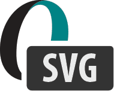

このチュートリアルは、このようなOpenType-SVGカラーフォントに関するものです。

Glyphsでは、SVG情報をフォントに取り込む方法が3つあります。

*   方法A：外部の`.svg`画像ファイルを、特殊なsvgレイヤーに埋め込む。
*   方法B：既存のカラーフォントの設定から作る。後者は、異なるマスターを持つ[レイヤーフォント](creating-a-layered-color-font.md)、[CPAL/COLRフォント](creating-a-microsoft-color-font.md)、または[Appleスタイルのsbixフォント](creating-an-apple-color-font.md)のいずれかです。
*   方法C：_Color_レイヤーと呼ばれるものからネイティブに作る。

それでは、早速見ていきましょう。

## 方法A：外部SVG画像ファイルを使う

もしSVGグラフィックがすでに個別のファイルとして手元にあるなら、それを各グリフに配置して、SVGテーブルを持つフォントを書き出すことができます。この方法を使えば、ベクターアニメーションのような凝ったものも含め、SVGファイル形式の能力を最大限に活用できます。

準備として、.glyphsファイルを好きな場所に保存し、SVGファイルを入れるための_Images_というサブフォルダを作成することをお勧めします。これは、.glyphsファイルには画像への相対パスのみが保存されるため、サブフォルダに入れておくとファイルをまとめて管理しやすくなるからです。

さて、例が必要です。もし手元にSVGがなければ、ここに一つ用意しました。大文字の`O`に、回転する赤い円のアニメーションを試してみましょう。このSVGコードを選択してコピー（Cmd-C）してください。

    <!DOCTYPE svg PUBLIC "-//W3C//DTD SVG 1.1//EN" "http://www.w3.org/Graphics/SVG/1.1/DTD/svg11.dtd">
    <svg version="1.1" xmlns="http://www.w3.org/2000/svg" xmlns:xlink="http://www.w3.org/1999/xlink"
     width="1000" height="1000" viewBox="-400 -400 800 800">
     <title>SVG animation using SMIL</title>
     <circle cx="0" cy="100" r="200" stroke="none" fill="red">
      <animateTransform
       attributeName="transform"
       attributeType="XML"
       type="rotate"
       from="0"

       to="360"
       begin="0s"
       dur="1s"
       repeatCount="indefinite"></animateTransform>
     </circle>
    </svg>

それを、[TextMate](https://macromates.com)、[SublimeText](https://www.sublimetext.com)、[Atom](https://atom.io)など、お好みのプレーンテキストエディタの新しいウィンドウにペースト（Cmd-V）します。

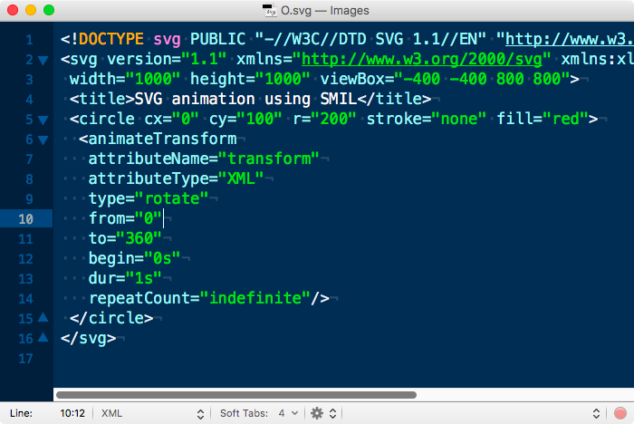

そして、そのファイルを_Images_フォルダに`O.svg`として保存します。Finderでは、セットアップ全体はこのようになるでしょう。

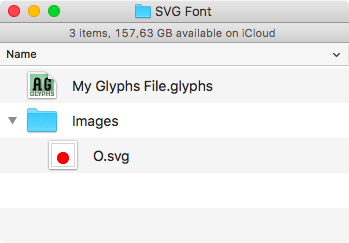

.glyphsファイルに戻り、大文字のOを準備します。編集ビューでOを開き、_レイヤー_パレットでプラスボタンを押してレイヤーの複製を追加し、それを右クリックして表示されるコンテクストメニューから_レイヤータイプ_として_svg_を選択します。

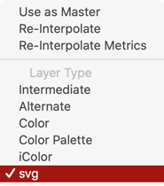

### 旧バージョン

Glyphs 2では、_コピー_ボタンで複製し、新しいレイヤーの名前を`svg`（すべて小文字）に変更します。

ここがポイントです。_マスターレイヤー_に置いたものは、SVGテーブルに保存されたカラー情報を表示できないアプリケーションで見える、白黒のフォールバックグリフになります。ちなみに、マスターレイヤーとは_レイヤー_パレットで太字で表示されているレイヤーのことで、この例では「Regular」という名前のレイヤーです。

しかし、新しく作ったsvgレイヤーには、.svg画像ファイルをドラッグ＆ドロップできます。すぐに表示されるはずです。ただし、アニメーションは表示されません。画像は好きなようにサイズ変更したり移動したりできます。

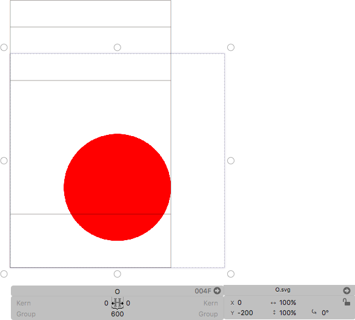

字幅についての注意点：svgレイヤーはマスターレイヤーから字幅を継承するので、グリフの字幅を設定したい場合はマスターレイヤーに切り替える必要があります。この例では、配置したSVGを拡大縮小したり変形したりしていないと仮定して、字幅を800に設定するのが理にかなっています。そのためには、レイヤーパレットで_Regular_レイヤーをクリックし、グレーの情報ボックスで字幅を800に変更します。

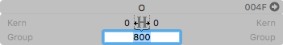

いずれにしても、フォントをウェブフォントとして書き出します。_ファイル > 書き出し > OTF_を選び、形式としてWOFFとWOFF2を使用します。CFFかTTFかは問題にならないはずです。

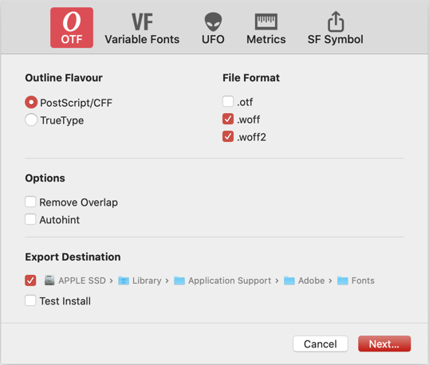

すべてのブラウザがOpenType-SVGをサポートしているわけではありません。OpenType-SVGフォントをテストするブラウザを選ぶ際には、このチュートリアルのサポート状況のセクション（下記参照）を確認してください。そのためには、WOFFを表示するためのHTMLとCSSコードを含むHTMLファイルを用意するか、[mekkablue scripts](glyphsapp3://showplugin/mekkablue%20scripts)から_Test > Webfont Test HTML_スクリプトを実行することができます。このスクリプトは、最後に使用されたウェブフォントの書き出し先に、現在のフォント用のHTMLファイルを生成します。

### プロのヒント

まだスクリプトに慣れていない方は、少し時間を取って[Glyphsを拡張する](extending-glyphs.md)チュートリアルに目を通し、_ウィンドウ > プラグインマネージャー_を閲覧してみてください。

このスクリプトは、デフォルトのブラウザでHTMLファイルを開き、同時にFinderでそのファイルが入っているフォルダも開いてくれるので便利です。あとは、HTMLファイルをDockのFirefoxアイコンにドラッグするか（または右クリックして_このアプリケーションで開く > Firefox.app_）、大文字のOを入力すれば、ほらこの通り。

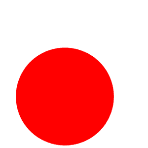

ジャジャーン！でも注意してください。フォント内のアニメーションはプロセッサに大きな負荷をかける傾向があります。コンピュータのファンがすごい音を立てて回り出すかもしれませんし、すべてのモバイルユーザーはあなたのせいでバッテリーを消耗させられるので、あなたに対して複雑な感情を抱くことになるでしょう。警告しておきます。

## 方法B：既存のカラーフォントから作る

Glyphsでは、さまざまな形式の既存のカラーフォントを取り込み、SVGとして書き出すことができます。これらのソース形式のいずれかでカラーフォントを設定しておくと、ソース形式とSVGの両方で書き出せるという利点があります。

選択肢は3つあります。

1.  [CPAL/COLRフォント](creating-a-microsoft-color-font.md)：事前に定義されたカラーパレットの色にそれぞれリンクされた_Color Palette_レイヤーを持つグリフを含むフォント。
2.  [レイヤーフォント](creating-a-layered-color-font.md)：互いに重ね合わせることができる2つ以上のマスターを持つフォント。マスターは互換性がある必要はありませんが、_Master Color_パラメータを持っている必要があります。
3.  [sbixフォント](creating-an-apple-color-font.md)：さまざまな解像度のビットマップ画像が_iColor_レイヤーに配置されたグリフを含むフォント。

これらの選択肢を見て、どれかを選び、SVG書き出しを追加する方法を以下で読んでください。

## 方法B、選択肢1：CPAL/COLRフォントを変換する

準備：[MicrosoftスタイルのCPAL/COLRフォントについて読む](creating-a-microsoft-color-font.md)。_ファイル > フォント情報 > フォント_の最初のマスターの_カスタムパラメータ_セクションに一つ以上の_Color Palettes_が設定されており、グリフに_Color Palette_レイヤーがあることを確認してください。

1.  _ファイル > フォント情報 > 書き出し_で、SVGテーブルを含むフォントの新しいインスタンスを作成します。適切なスタイル名を付けます。
2.  カスタムパラメータ_Color Layers to SVG_を追加します。
3.  カスタムパラメータ_Color Palette for SVG_を追加し、その値を目的のカラーパレットのインデックスに設定します。上記の_Color Palettes_パラメータで定義したパレットが一つしかない場合は、値として`0`を使用します。
4.  最後に、カスタムパラメータ_Export SVG Table_を追加し、その値のチェックボックス（右側のもの）がオンになっていることを確認します。

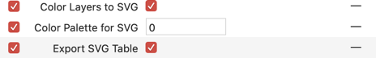

### プロのヒント

他のカラーテーブルを含まない、_純粋な_SVGフォントが欲しいですか？カスタムパラメータ_Export COLR Table_と_Export sbix table_を追加し、それらの値のチェックボックスをオフにしてください。

## 方法B、選択肢2：レイヤーフォントを変換する

準備：[レイヤーフォントについて読む](creating-a-layered-color-font.md)。_ファイル > フォント情報 > マスター_で、_Master Color_パラメータを使って色を設定していることを確認してください。

1.  _ファイル > フォント情報 > 書き出し_で、左下のプラスボタンをクリックし、表示されるメニューから_インスタンスを追加_を選択して、SVGテーブルを含むフォントの新しいインスタンスを作成します。_Multicolor_や_SVG_など、自分にとって分かりやすいスタイル名を付けます。
2.  カスタムパラメータ_Color Layers to SVG_を追加し、その値のチェックボックス（右側のもの）がオンになっていることを確認します。
3.  カスタムパラメータ_Export SVG Table_を追加し、その値のチェックボックス（右側のもの）がオンになっていることを確認します。

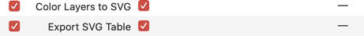

## 方法B、選択肢3：sbixフォントを変換する

準備：[Appleスタイルのsbixフォントについて読む](creating-an-apple-color-font.md)。複数のiColor解像度がある場合は、SVGにしたい解像度のsbix画像がすべて揃っていることを確認してください。

1.  _ファイル > フォント情報 > 書き出し_で新しいインスタンスを作成します。
2.  カスタムパラメータ_SBIX to SVG_を追加し、値として希望するiColorのサイズを指定します。これにより、同じサイズインデックスのiColorレイヤーからsbix画像が取得され、SVGグラフィックに変換されます。例えば、カスタムパラメータの値に256を指定すると、Glyphsはすべての_iColor 256_レイヤーを探し出し、それらをSVGに変換します。

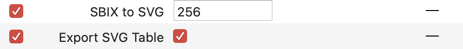

### プロのヒント

他のカラーテーブルを含まない、_純粋な_SVGフォントが欲しいですか？カスタムパラメータ_Export COLR Table_と_Export sbix table_を追加し、それらの値のチェックボックスをオフにしてください。

## 方法C：ネイティブのColorレイヤーを使う

まず、用語に注意しましょう。Glyphsでは「カラーレイヤー」という表現が2つの意味で使われます。一つは[MicrosoftスタイルのCPAL/COLRレイヤー](creating-a-microsoft-color-font.md)を指します。しかし、この用語はGlyphs 3で新しく導入されたネイティブの_Color_レイヤーを意味することもあります。この2つを区別するため、後者を「ネイティブ」と呼び、「Color」を大文字のCで表記します。なぜなら、_レイヤータイプ_メニューではそのように表示されるからです。

さて、おしゃべりはこれくらいにして、始めましょう。レイヤーをレイヤータイプ_Color_に切り替えます。このレイヤーはマスターレイヤーであってもかまいません。これを行うには、_レイヤー_パレットでレイヤーを右クリックし、メニューから_Color_を選択します。

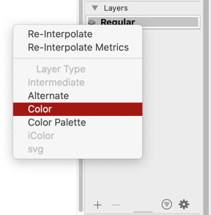

正しくできていれば、パレットのレイヤー名の横に小さなカラーホイールが表示されます。

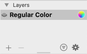

次に、_表示 > 情報を表示_（Cmd-Shift-I）がオンになっていることを確認してください。そうでなければ、次のステップのグラフィックオプションが表示されません。

さあ、描画を始めましょう。いつものようにシェイプを追加します。ただし、一つだけ違う点があります。ウィンドウの右下隅に、現在選択されているシェイプの_属性_セクションが表示されます。

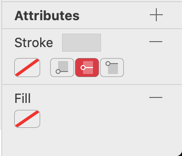

線や塗りを追加し、それぞれのカラーフィールドをダブルクリックして色を選択できます。そして、こんなこともできます。

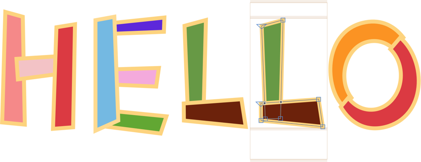

パレットでは、「属性」という単語の横にあるプラスボタンから、追加の属性を追加することもできます。グラデーション、シャドウ、グローなど、思いつく限りのものが。しかし注意してください。これらすべてがフォントでサポートされているわけではありません。また、フォントに書き込まれたとしても、それを使用するアプリでサポートされていない可能性もあります。安全を期すなら、色の塗りと色の線だけを使用してください。

書き出す前に、_ファイル > フォント情報 > 書き出し_でインスタンスを設定し、カスタムパラメータ_Color Layers to SVG_を追加します。

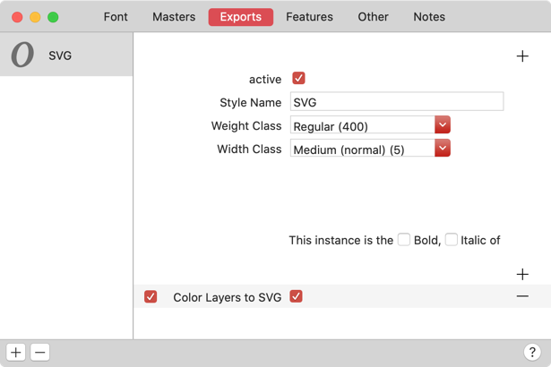

これで準備完了です。

## カスタムパラメータ

_ファイル > フォント情報 > 書き出し_（Cmd-I）で、各インスタンスの_カスタムパラメータ_に、以下の3つのパラメータのいずれか、またはすべてを追加できます。

*   _Export COLR Table_
*   _Export SVG Table_
*   _Export sbix Table_

これらは、どのカラーテーブルを生成して実際にOpenTypeフォントに含めるか、また含めないかを制御するためのものです。ウェブフォントのファイルサイズを削減するために、いずれかのテーブルの書き出しを有効にし、他のすべてを無効にしたい場合があるでしょう。例えば、上記で説明した既存のカラーフォントを使用する方法、つまりCPAL/COLRまたはsbixの設定に基づいている場合（上記の「方法B」を参照）、他のテーブルの作成を抑制したいかもしれません。そうすることで、読み込みがずっと速いsbix専用、CPAL専用、SVG専用のカラーフォントを作成できます。

## 便利なスクリプト

Henrique Beier氏の[Harbor Type scripts](glyphsapp3://showplugin/Harbor%20Type%20Scripts)には、_SVG Export and SVG Import_というスクリプトが含まれています。これは[DrawBot](https://www.drawbot.com)を使ってGlyphs内部から外部SVGを生成し、それを再インポートしてSVGカラーフォントを作成します。

## アプリケーションの対応状況

この記事を書いている時点では、SVGテーブルはFirefoxバージョン32以降、Windows 10以降のMicrosoft Wordでサポートされています。また、いくつかのAdobeアプリでもサポートされており、PhotoshopはCC 2017以降、IllustratorはCC 2018以降、InDesignはCC 2019以降で対応しています。そして最近では、AppleもSVGフォントのサポートを開始しました。macOS 10.14 Mojave以降では、Macアプリ（Safari、テキストエディット、Pixelmator、Sketch、Affinity Designerを含む）で正しく表示できるはずです。同じことはiOS 12以降にも当てはまり、Procreateのバージョン4.3以降はOpenType-SVGを扱うことができます。

繰り返しになりますが、注意してください。アプリやシステムが公式にSVGをサポートしているからといって、SVGのすべての機能がサポートされているわけではありません。

## SVGについてもっと詳しく

私たちはまだ表面をなぞったにすぎません。SVGとそのすべての可能性について深く知りたい方は、仕様書やサンプルコードを掘り下げてみてください。

*   公式 [SVG 1.1 仕様書](https://www.w3.org/TR/SVG11/)（W3）
*   公式 [SVGテーブル仕様書](https://www.microsoft.com/typography/otspec/svg.htm)（Microsoft Typography）
*   Roel Nieskens氏のSVGテストページ [Lapis legit](https://pixelambacht.nl/lapislegit/)（まだブラウザがクラッシュする可能性があります、ご注意を！）
*   Fontself: [Color fonts! WTF?](https://www.colorfonts.wtf) アプリ、ブラウザ、OSのサポート状況をより完全に網羅
*   Adobe TypeKitの [Color Concept Page](https://color.typekit.com/) いくつかのSVGフォントを掲載
*   Adobeのヘルプページ [OpenType-SVGカラーフォント](https://helpx.adobe.com/typekit/using/ot-svg-color-fonts.html)
*   [YouWorkForThemのブログ記事](https://blog.youworkforthem.com/2019/06/13/everything-you-need-to-know-about-opentype-svg-fonts/) OpenType-SVGフォントについて

---

更新履歴 2017-01-20: サポートしているブラウザのリストにMicrosoft Edgeを追加。

更新履歴 2018-03-26: sbixからSVGへの変換を追加。

更新履歴 2018-04-14: SVGのOS/アプリサポート状況を更新。Behdadさん、ありがとう！

更新履歴 2019-02-01: 誤字を修正し、"brothers"を"siblings"に置き換え。Nathalieさん、ありがとう！

更新履歴 2019-11-15: 「方法B」の導入部分を改善。

更新履歴 2021-08-20: Glyphs 3向けに更新。「方法C」と「便利なスクリプト」を追加。アプリケーションのサポート状況を更新・再整理。「Color fonts! WTF?」のリンクを追加。

更新履歴 2022-07-20: タイトル、関連記事、軽微なフォーマットを更新。

## 関連記事

[すべてのチュートリアルを見る →](https://glyphsapp.com/learn)

*   ### [レイヤーカラーフォントの作り方](creating-a-layered-color-font.md)

チュートリアル

[ カラー ](https://glyphsapp.com/learn?q=color)

*   ### [Microsoftカラーフォント（CPAL/COLR）の作り方](creating-a-microsoft-color-font.md)

チュートリアル

[ カラー ](https://glyphsapp.com/learn?q=color)

*   ### [Appleカラーフォント（sbix）の作り方](creating-an-apple-color-font.md)

チュートリアル

[ カラー ](https://glyphsapp.com/learn?q=color)