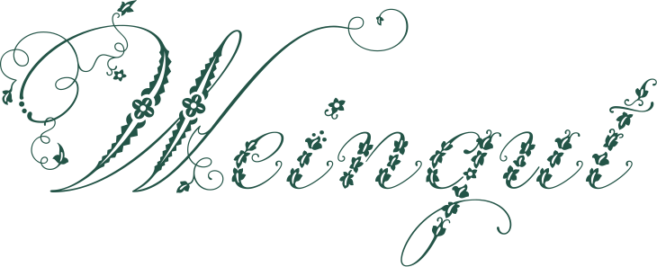
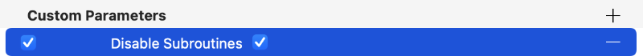
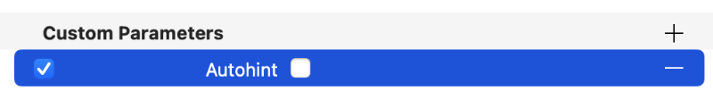
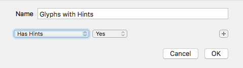
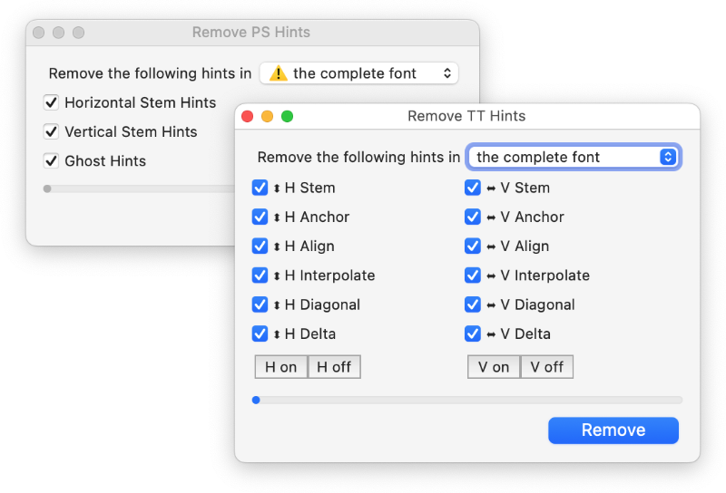
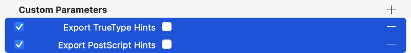
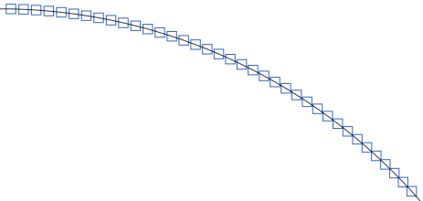
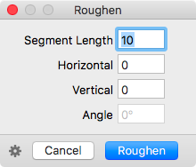

原文: [Creating fonts with complex outlines](https://glyphsapp.com/learn/creating-fonts-with-complex-outlines)
# 複雑なアウトラインを持つフォントの作成

チュートリアル

執筆者: Rainer Erich Scheichelbauer

[ en ](https://glyphsapp.com/learn/creating-fonts-with-complex-outlines) [ fr ](https://glyphsapp.com/fr/learn/creating-fonts-with-complex-outlines) [ zh ](https://glyphsapp.com/zh/learn/creating-fonts-with-complex-outlines)

2024年9月10日更新（初版公開：2016年12月20日）

グランジフォント、手書きフォント、汚れた活版印刷フォント：もしあなたのフォントが複雑なら、このチュートリアルはあなたのためのものです。

現代のフォントテクノロジーは、主に「普通の」書体に向けられています。つまり、使用されている技術の一部は、あなたのフォントが以下の条件を満たしていると仮定しています。

*   可能な限り少ないノード数を持つ単純なアウトラインを持つこと
*   極値にノードがあること（[良いパスを描く方法について詳しくはこちら](drawing-good-paths.md)）
*   複数のグリフが類似したシェイプを共有していること（例：小文字のn、h、mのショルダーがほぼ同一であること）
*   合理的な数のグリフを持つこと（ほとんどの場合、3桁から4桁の数）

さて、もしあなたのフォントがこれらの仮定のいずれかを*破る*場合、私たちは、いわゆる「複雑な」アウトラインについて話しています。もしあなたのフォントがこれらの種類のアウトラインを特徴としているなら、サブルーチン化、ヒンティング、そして場合によってはパスの調整について決定を下す必要があるかもしれません。そうでなければ、あなたのフォントは書き出せないか、もっと悪いことに、書き出されて出荷され、エンドユーザーにとってパフォーマンスが悪く、多くのサポートメールを受け取ることになるでしょう。良くありません。

複雑なアウトラインがどのようなものか、アイデアを与えるために。

書体：[Adinah](http://handfoundry.com/work/#/adinah/) by Andy Lethbridge, [Fairwater](http://lauraworthingtontype.com/family/fairwater-collection/) by Laura Worthington, [Letterpress](http://www.facetype.org/?font=letterpress) by Marcus Sterz, [Weingut](http://www.facetype.org/?font=weingut) by Georg Herold-Wildfellner

## サブルーチン

サブルーチン化は、CFFフォント（つまり、PostScriptアウトラインを含み、接尾辞が.otfのフォント）のファイルサイズを節約するメカニズムで、アウトライン内で繰り返し現れる構造を見つけ出し、それらをいわゆる*サブルーチン*に保存します。その名の通りです。コンポーネントのように少し機能しますが、グリフ全体だけでなく、パスやカーブでも機能します。そして、書き出し時に自動的に行われるため、通常は心配する必要はありません。

サブルーチン化は、フォントに多くの類似したシェイプがあり、フォントのサイズが通常、例えば数百、あるいは数千のグリフである場合に最も効果的に機能します。グランジフォントやスキャンフォントのように、非常に多くの異なるシェイプがある場合、限界に達します。あるいは、非常に複雑または詳細なアウトラインを持っている場合、またはグリフあたりのノード数が非常に多い場合です。あるいは、多くのCJKフォントのように、フォントに非常に多くのグリフ、例えば20,000以上がある場合です。（もっと知りたいですか？[CJKフォントにおけるサブルーチン化についてのKen Lunde氏のブログ記事](https://blogs.adobe.com/CCJKType/2012/02/subroutinization.html)を読んでください。）これらのいずれかが当てはまる場合、書き出しに異常に長い時間がかかることに気づくでしょう。それは、サブルーチン化アルゴリズムが、何百万、何十億ものアウトラインの中から類似したシェイプを見つけようとしているためです。サブルーチンがフォントを小さくするのではなく、大きくすることさえあります。なぜなら、シェイプは多数見つかるものの、再利用されることが非常に少ないからです。フォントが全く書き出されないことさえあります。

*サブルーチンを無効にする*パラメータは、サブルーチン化をオフにします。「ファイル > フォント情報 > 書き出し」で該当するインスタンスを順に見ていき、各インスタンスの「カスタムパラメータ」テーブルで、プラスボタンで新しいパラメータを追加し、その「プロパティ」を「サブルーチンを無効にする」に切り替え、ブール値のチェックボックスをオンにします。

### プロのヒント
サブルーチンを見つけるのはCPUを大量に消費し、遅いです。ですから、PostScript形式のフォントを頻繁に書き出す必要がある状況にあるなら、カスタムパラメータを追加して多くの時間を節約しましょう。

サブルーチン化を無効にすることを検討してください。

*   **非常に多くのグリフ**を持つフォント、数千以上
*   グランジ、手書き、活版印刷、またはランサムノートフォントのような、グリフが可能な限り異なって見えることがポイントである、**非類似のシェイプ**を持つフォント
*   ドロップキャップ、シンボル、アイコン、イラストレーション、ディンバットのような、**非常に詳細なアウトライン**を持つフォント
*   グリフあたりの**ノード数が多い**フォント、3桁の数から始まる

## ヒンティング

TTフォントとPSフォントの両方で、[ヒンティング](bookmarks:hinting-manual-truetype-hinting,hinting-manual-postscript-hinting,hinting-postscript-autohinting,hinting-truetype-autohinting.md)とは、アウトラインにヒントを配置するプロセスです。ヒントは、ラスタライザがグリフのどの部分が本質的なステムであるかを判断し、グリッドフィッティング中にそれを維持または正規化する必要があるかどうかを決定するのに役立ちます。グリッドフィッティングとは、*アウトラインを歪ませて*、ピクセルグリッドにより良く収まるようにするプロセスです。

はい、その通りです。*ヒンティングはシェイプを保持せず、逆に歪ませます。*ヒンティングは、小さいピクセルサイズでのより良いフィット感という、より大きな善のためにシェイプの忠実度を犠牲にします。その結果、画面上でよりクリーンで、より鮮明で、より統一された、より読みやすいテキストが得られます。しかし、ヒンティングはアウトラインに多くの要件を課します。それらはできるだけクリーンで「普通」でなければなりません。

ヒンティングなしを検討してください。

*   意図的に一貫性のない、異質な、**非類似のシェイプ**を持つフォント
*   ある文字のアウトストロークが次の文字のインストロークに正確に会わなければならない、**接続するスクリプトフォント**
*   **非常に詳細なアウトライン**を持つフォント
*   グリフあたりの**ノード数が多い**フォント
*   「ファイル > フォント情報 > マスター」に**アラインメントゾーンがない**フォント
*   「ファイル > フォント情報 > マスター」に**標準ステム定義がない**フォント
*   以下の特徴を持つ**通常でないアウトライン**を持つフォント
    *   極値にノードがない
    *   不均一で異質なステムの太さを示す
    *   一貫してアラインメントゾーンに達しない
    *   Glyphsフィルタの*Roughen*や*Hatch Outline*が作成するような装飾効果で作成されたもの、インライン、アウトライン、点線、影、3D効果なども含む

フォントにヒントを付けないようにするには、これらの戦略の1つ以上に従うことができます。結果は様々です。

1.  **オートヒンティングを抑制する：** 「ファイル > 書き出し」ダイアログでオートヒンティングを単純に無効にできます。あるいは、「ファイル > フォント情報 > 書き出し」で「オートヒント」カスタムパラメータを、もちろんブール値をオフにして使用します。
    
2.  **手動ヒントを取り除く：** フォントビューの左下隅にある歯車ボタンをクリックし、「スマートフィルタを追加」を選択できます。表示されるダイアログで、スマートフィルタにわかりやすい名前を付け、「ヒントあり：はい」に設定します。ダイアログを確認して「OK」を押し、左のサイドバーで新しく作成されたスマートフィルタを選択します。次に、グリフを順に見ていき、手動でヒントを削除します。
    
    あるいは、もっと簡単に、手動ヒントを削除するためのスクリプトがあります。[mekkablue scripts](glyphsapp3://showplugin/mekkablue%20scripts)には、「Hinting > Remove PS Hints」と「Remove TT Hints」があります。ダイアログで、すべてのオプションを選択し、「Remove」をクリックします。
    
3.  **ヒンティングを抑制する：** もしフォントのヒンティング情報を犠牲にしたくない場合は、それを書き出さないように選択できます。「ファイル > フォント情報 > フォント」、または「ファイル > フォント情報 > 書き出し」の該当するインスタンスで、カスタムパラメータ「Export TrueType Hints」および/または「Export PostScript Hints」を追加し、そのブール値をオフにします。このように。
    

最終的なOpenTypeフォントにヒントが入っていないことを確認するには、フォントをテストする必要があります。書き出されたOTFをGlyphsで開き、上で説明したスマートフィルタを適用します。あるいは、[DTL OTMaster](http://fontmaster.nl)のようなアプリでグリフを順に見ていきます。

## パス

ノード数が多い、つまり複雑なパスについて説明しました。デザインに複雑なアウトラインがあると仮定し、良き市民として、地元のフォント当局の提案に従い、サブルーチン化とヒンティングを無効にしたとします。それでも、**多数の小さなカーブセグメント**はCFFベースのOTFで問題になる可能性があるため、問題が発生するかもしれません。

第一に、そのようなフォントは画面上では機能するかもしれませんが、プリンターは簡単に「サブパスが多すぎます」というエラーを出すかもしれません。ラスタライズする際、各小さなカーブセグメントは、いわゆる「サブパス」と呼ばれる多くの小さなラインセグメントに分割されます。それらは本当に小さく、ラスタライズ解像度のしきい値をはるかに下回ります。レーザープリンターでは、この解像度は比較的高く、サブパスは非常に短く、もちろん、置き換えるべき完全なカーブセグメントを構成するために非常に多くなければならないことを意味します。アイデアを与えるために、これが、たくさんのサブパスに分割されたカーブセグメントのズームインビューです。

第二に、Microsoft Windowsでフォントを使用すると、パフォーマンスの問題に遭遇する可能性があります。例えば、6文字の単語を入力し、その後、文字が一つずつ画面に表示されるのを10秒ほど腕を組んで椅子にもたれて見ているような状況です。WindowsはそもそもCFFアウトラインに問題を抱えていますが、*複雑な*CFFは、レドモンドの良き友人たちによるオペレーティングシステムにとっては、手に負えない橋かもしれません。

この問題に対処するには、2つの方法があります。

第一に、もしあなたのデザインがそれを許すなら、すべてのカーブセグメントを直線セグメントに置き換えてください。この解決策の根拠は、ラインセグメントはカーブセグメントよりもレンダリングが著しく簡単であるということです。

それを行うプラグインがあります。[Retractor](glyphsapp3://showplugin/Retractor)です。「ウインドウ > プラグインマネージャ」経由で見つけてインストールします。書き出し時にカスタムパラメータ*Filter*で自動的にトリガーできます（詳細は[Filterのreadme](https://github.com/mekkablue/Retractor)を参照）。これは通常、グランジフォント、ダーティフォント、活版印刷フォントのような、非常に小さなカーブセグメントを持つフォントに推奨されます。

もしアウトラインに大きなカーブセグメントがあるなら、「荒らす」フィルタ（「フィルタ > 荒らす」）の使用を検討すると良いでしょう。これはすべてを小さなラインセグメントに変えます。小さな移動値、場合によってはゼロを検討し、しかし少し大きめの「セグメント長」を検討してください。繰り返しになりますが、このフィルタはカスタムパラメータを介してトリガーでき、フィルタウィンドウの左下隅にある歯車メニューからクリップボードにコピーし、その後「ファイル > フォント情報 > 書き出し」の「カスタムパラメータ」テーブルにペーストするだけです。

第二に、もしあなたのデザインがカーブセグメントをきれいに保つ必要があるなら、フォントをTrueTypeアウトラインで書き出すことを検討してください。ここでのアイデアは、TrueTypeは実際にはCFF/PostScriptよりも高い複雑さを許容するということです。フォントをTrueTypeとして書き出すには、「ファイル > 書き出し」で「TTFとして保存」オプションをオンにするか、「ファイル > フォント情報 > 書き出し」で「TrueTypeとして保存」カスタムパラメータを使用できます。それはとても簡単です。

---

更新履歴 2022-04-18: Glyphs 3向けの軽微な更新（大文字小文字の扱い、リンク、書き出しタブ）。

更新履歴 2024-09-10: ヒンティング抑制に関する情報の追加、CPU負荷の高いサブルーチン化に関するプロのヒントの追加、一部スクリーンショットの更新。

## 関連記事

[すべてのチュートリアルを見る →](https://glyphsapp.com/learn)

*   ### [良いパスを描く](drawing-good-paths.md)

チュートリアル

*   ### [モノラインフォントの作り方](monoline.md)

旧チュートリアル

*   ### [ピクセルフォントの作り方](pixelfont.md)

チュートリアル

[シェイプの再利用](https://glyphsapp.com/learn?q=reusing+shapes)