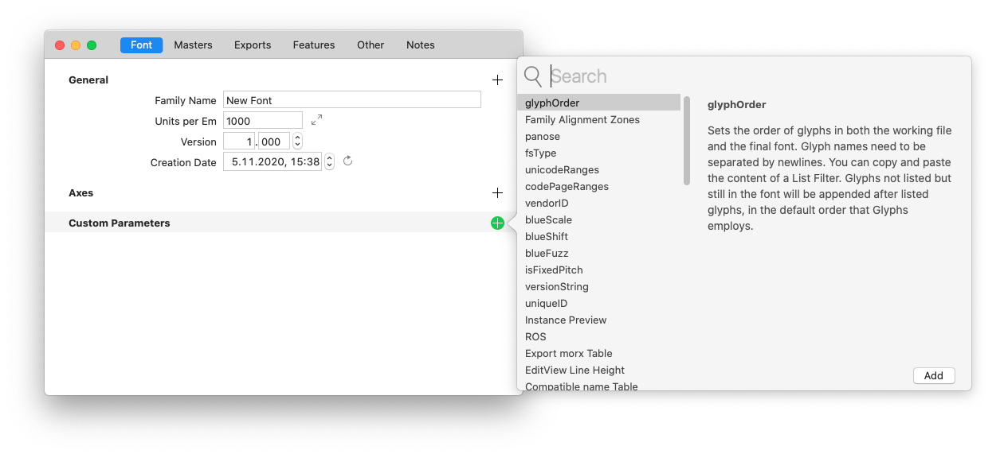
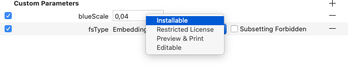
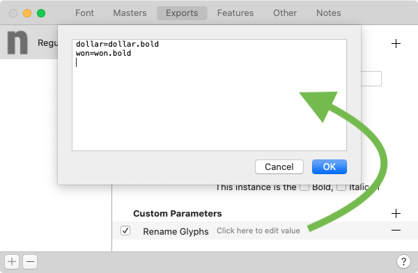
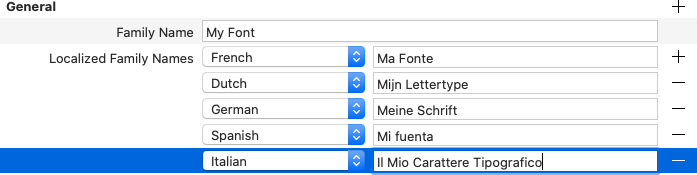
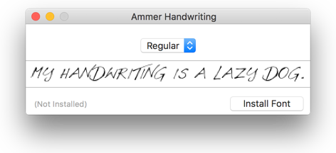
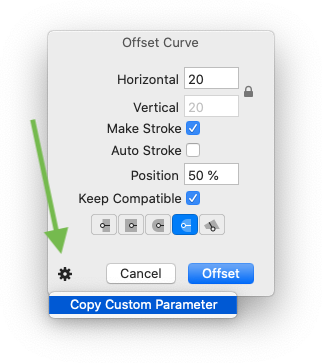
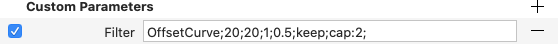

原文: [Custom parameters](https://glyphsapp.com/learn/custom-parameters)
# カスタムパラメータ

チュートリアル

執筆者: Rainer Erich Scheichelbauer

[ en ](https://glyphsapp.com/learn/custom-parameters) [ fr ](https://glyphsapp.com/fr/learn/custom-parameters) [ zh ](https://glyphsapp.com/zh/learn/custom-parameters)

2022年8月12日更新（初版公開：2012年7月13日）

「フォント情報」でカスタムパラメータを見たことがあるでしょう。でも…実際には何をするのでしょうか？

カスタムパラメータを使えば、「フォント情報」をより正確に設定したり、書き出し時にフィルタをトリガーしたり、他のクールなことをしたり、書き出し時にフォントを一括処理したりできます。この方法で、非破壊的に作業できます。

## カスタムパラメータの追加と管理

カスタムパラメータは、「ファイル > フォント情報」の「フォント」、「マスター」、「書き出し」のいずれかのタブで追加します。パラメータを追加するには、それぞれのタブの「カスタムパラメータ」セクションの隣にあるプラスボタンをクリックすると、インラインドキュメントを含むダイアログが表示されます。ダイアログには、可能なパラメータの名前がリストされています。それらを検索したりスクロールしたりでき、名前をクリックすると、その説明が右側に表示されます。



ダブルクリックまたはReturnキーでパラメータの選択を確定します。新しい行が表示され、パラメータの*名前*とその*値*が表示されます。



一番左のチェックボックスでパラメータを有効にします。チェックボックスをオフにすると、Glyphsはそれが最初から追加されていなかったかのように振る舞います。つまり、問題の設定はデフォルトにフォールバックするか、全くフォントファイルに書き込まれません。
名前の右側には値があります。通常は、行内で直接選択して編集できます。一部のパラメータ、例えば「グリフをリネーム」や「TTFオートヒントオプション」パラメータなどは、値をクリックするとダイアログが表示されます。



パラメータの名前をクリックして選択します。ShiftキーまたはCmdキーを押しながらクリックすると、一度に多くのパラメータを選択できます。それらをGlyphsファイル間でコピー＆ペーストすることもできます。パラメータをドラッグして並べ替えることもできます。通常、順序は問題ありませんが、「フィルタ」パラメータについては異なります（下記参照）。

「フォント情報 > フォント」のパラメータはフォント全体に適用されますが、「書き出し」タブの同じ名前のパラメータによって上書きされます。

「フォント情報 > マスター」のほとんどすべてのパラメータは、マルチプルマスター設定で補間されるため、数値です。ここでパラメータを使用する場合、マスター間で互換性があることを確認してください。そうでなければ、Glyphsは補間できません。多くの[垂直メトリクス値](vertical-metrics.md)はここで制御できます。フォントパラメータと同様に、マスターパラメータは同じ名前のインスタンスパラメータによって上書きされます。

「書き出し」タブのパラメータは、書き出されるそれぞれのフォントインスタンスに直接適用されます。インスタンスパラメータは、マスターパラメータとフォントパラメータを上書きします。

## 目的

カスタムパラメータは様々な目的を果たします。そのほとんどは、最終的なOpenTypeフォントの値を設定（または計算を助ける）オプションを提供し、書き出し時に適用されます。例えば、`glyphOrder`は書き出されるフォントファイル内のグリフの順序に影響を与えます。

一部のパラメータは、編集タブのフォントの外観にのみ影響を与えます。例えば、「フォント情報 > フォント」の「EditView Line Height」は、編集タブでの複数行編集の行間を設定できます。

¯_(ツ)_/¯ ヒントが見つかりません

すべてのカスタムパラメータは、それらを追加するダイアログ内で文書化されています。それを最大限に活用するために、可能なオプションを注意深く読んでください。

## 似て非なるもの：プロパティ

パラメータと同様に、「フォント情報 > フォント」および「書き出し」の上部に「一般」というセクションがあります。ほとんどの場合、それらは命名プロパティをリストしており、そのほとんどがフォント書き出しのOpenType `name`テーブルに直接影響を与えます。

はい、「フォント情報 > マスター」にも「一般」セクションがありますが、それはGlyphs UI内のマスターアイコンとマスター名を設定するためだけのものです。それらは、あなたの閲覧、ソート、分類の楽しみのためだけにあり、書き出されるフォントには一切影響を与えません。

プロパティの最も良い点は、それらをローカライズできることです。「一般」セクションのプラスボタンを介してローカライズ可能なプロパティを追加します。次に、各言語に対して、最初のエントリの隣にあるプラスボタンをクリックしてエントリを追加します。



もし最初のエントリを取り除きたい場合は、Optキーを押しながら、プラスボタンがマイナスボタンに変わります。

私のお気に入りの一つは、OpenTypeフォント内に保存できるオプションのサンプルテキストです。フォントに追加するには、「ファイル > フォント情報 > フォント」（Cmd-I）に進み、「一般」セクションのプラスボタンをクリックしてプロパティを追加します。表示されるポップアップダイアログから「サンプルテキスト」を選び、ReturnキーまたはEnterキーでエントリを確定します。値として、何か面白い文を入力できます。フォントを書き出した後、Font Bookでそれを開くと、おなじみのインストールダイアログが表示され、先ほど入力したサンプルテキストが表示されます。



少し時間を取って、可能な一般プロパティを一通り見てみてください。すべてのドキュメントはダイアログ内に表示されます。

## フィルタ

「フィルタ」メニューからフィルタを使用する方法はご存知でしょう。時々、それらを一度に適用するのではなく、カスタムパラメータに入れて、フォントが書き出されるときに自動的に実行させる方が良い場合があります。それらをパラメータとして取得する最も簡単な方法は、「フィルタ」メニューから開き、現在のグリフ選択に適用する代わりに、左下の歯車メニューを開くことです。



### ヒント
実際には、「フィルタ」メニュー項目だけでなく、歯車メニューを持つどのダイアログでも可能です。最も注目すべきは、「グリフ > メトリクスを変形」と「パス > 変形」、そしてもし用途が見つかれば「パス > 背景と補間」も含まれます。

次に、「キャンセル」をクリックしてダイアログを閉じます。（そうです、フィルタを**適用しないでください**。）「ファイル > フォント情報 > 書き出し」（Cmd-I）を開き、1つ以上のインスタンスを選んで、ペーストします。フィルタがカスタムパラメータとして表示されます。



はい、お察しの通りです。必ずしもダイアログからカスタムパラメータをコピーする必要はありません。むしろ、パラメータで直接値を編集できます。歯車メニュー付きのダイアログさえないのに、カスタムパラメータでトリガーできる機能さえあります。インラインドキュメントには、`AddExtremes`と`RemoveOverlap`がリストされています。

### プロのヒント
「ウインドウ > プラグインマネージャ」で見つけてインストールできる多くのサードパーティのフィルタは、特別なフィルタ値を介していくつかの追加機能を提供します。プラグインのreadmeを覗いてみるのが良い考えです。ここで初めて聞きましたね。

すべての内蔵およびサードパーティのフィルタは、行の最後に、カンマ区切りのグリフ名のリストが続く、追加の`include:`または`exclude:`パラメータを受け付けます。例えば、
```
Transformations; LSB:-20; RSB:+20; include:A,B,C
```
この例では、左サイドベアリングを20減らし、右サイドベアリングを同量増やすことで、実質的にグリフを左にずらします。しかし、これはA、B、Cにのみ行われます。

### フィルタ vs. プレフィルタ

上で、フィルタは書き出し時に適用されると述べましたが、それは完全な真実ではありませんでした。正確に言うと、*フィルタ*は分解（CFFでは、またはTTFではオーバーラップするコンポーネントで）とオーバーラップの削除（書き出しダイアログで選択されている場合）の*後*に適用されます。もしフィルタを分解とオーバーラップの削除の*前*に適用したいなら、代わりに*プレフィルタ*を追加してください。値は*フィルタ*と同じです。

言うまでもなく、「フィルタ」と「プレフィルタ」の両方のパラメータは、静的なフォントの書き出しでのみ意味があります。アウトラインの互換性を損なうため、バリアブルフォントでは利用できません。

## パラメータのコピー＆ペースト

マスター、インスタンス、またはフォント間でパラメータをコピー＆ペーストするには、単にCmd-CとCmd-Vを使用します。複数のマスターまたは複数のインスタンスに一度にペーストできます。そのためには、左側のサイドバーにリストされているマスターまたはインスタンスをShiftキーまたはCmdキーを押しながらクリックし、ペーストします。

パラメータをテキストエディタにペーストすることさえできます。次のようなものが得られます。
```
{
    customParameters = (
        {
            name = InterpolationWeightY;
            value = 80;
        },
        {
            name = Filter;
            value = "OffsetCurve;35;35;1;0.5;cap:2;";
        },
        {
            name = "Scale to UPM";
            value = 800;
        }
    );
}
```
これがどこに向かっているかわかりますね。もしエディタの扱いに慣れていて、ウィンドウ内のすべてのパラメータをタブで移動するのが面倒だと思うなら、エディタでカスタムパラメータを素早く一括編集したり、スクリプトで計算させたりできます。最後に、それらをコピーして貼り付けるだけです。

---

更新履歴 2022-08-12: タイトル、関連記事、軽微なフォーマットを更新。