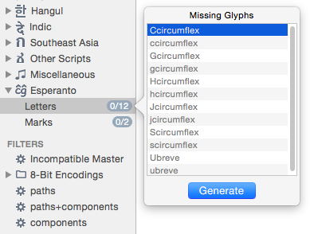

原文: [Custom sidebar entries in font view](https://glyphsapp.com/learn/custom-sidebar-entries-in-font-view)
# フォントビューのサイドバーにカスタム項目を追加する

チュートリアル

執筆者: Rainer Erich Scheichelbauer

[ en ](https://glyphsapp.com/learn/custom-sidebar-entries-in-font-view) [ fr ](https://glyphsapp.com/fr/learn/custom-sidebar-entries-in-font-view) [ zh ](https://glyphsapp.com/zh/learn/custom-sidebar-entries-in-font-view)

2022年7月29日更新（初版公開：2015年5月20日）

フォントビューのサイドバーに独自の項目を追加できます。これは、グリフセットの検証、ソート、フィルタリング、そしてGlyphsに新しいスクリプトを追加するのに非常に便利なので、その方法を学ぶ価値は間違いなくあります。さらに、サイドバーのカスタマイズは素早くできます！

フォントビュー（Cmd-Opt-1）のサイドバーに、独自の*カテゴリ*や*言語*を追加できます。Glyphsは、`~/Library/Application Support/Glyphs/Info/`にある`Groups.plist`というファイルを探します。そこに素早く移動するには、「スクリプト > スクリプトフォルダを開く」（Cmd-Shift-Y）を選び、`Scripts`の隣にある`Info`という名前のフォルダを探します。もしそこになければ、Finderコマンド「ファイル > 新規フォルダ」（Cmd-Shift-N）で作成します。

そして、`Info`フォルダ内に、テキストエディタで`Groups.plist`を作成します。できれば[Appleプロパティリストファイル](http://en.wikipedia.org/wiki/Property_list)（ファイル拡張子`.plist`）のシンタックスハイライト機能があるエディタがお勧めです。[Atom](https://atom.io/)、[TextMate](https://macromates.com/)、[BBEdit](https://www.barebones.com/products/bbedit/)、[Xcode](https://apps.apple.com/us/app/xcode/id497799835)、[SublimeText](https://www.sublimetext.com/)をお勧めします。

カテゴリと言語のカスタムエントリは、以下の形式です。
```
{
    categories = (
        {
            name = "Compatibility";
            icon = compatibilityTemplate;
            subGroup = (
                {
                    name = "Web";
                    list = (
                        .notdef,
                        hyphen,
                        space
                    );
                },
                {
                    name = "Windows";
                    list = (
                        nbspace,
                        softhyphen
                    );
                }
            );
        },
    );
    languages = (
        {
            name = "Esperanto";
            icon = EsperantoTemplate;
            predicate = "script == \"latin\"";
            subGroup = (
                {
                    name = "Letters";
                    list = (
                        Ccircumflex,
                        ccircumflex,
                        Gcircumflex,
                        gcircumflex,
                        Hcircumflex,
                        hcircumflex,
                        Jcircumflex,
                        jcircumflex,
                        Scircumflex,
                        scircumflex,
                        Ubreve,
                        ubreve
                    );
                },
                {
                    name = "Marks";
                    list = (
                        circumflexcomb,
                        brevecomb
                    );
                }
            );
        },
    );
}
```

### プロのヒント
Glyphs 2のGroups.plistファイルをアップグレードする場合、(a) グリフリストは ఇప్పుడు `list` の下に保存されること（以前は `coverage` でした）、(b) グリフ名を綴り出す代わりに、対応する文字を単に指定することもできること（主にCJKで便利です）を覚えておいてください。もしそうすれば、実際の有効なグリフ名は、そのUnicode命名規則、例えば `uni4A67` にデフォルト設定されます。

このサンプルの`Groups.plist`の内容をお好みのテキストエディタにコピー＆ペーストし、好みに合わせて調整し、上で説明したように保存します。次にGlyphsを再起動すると、サイドバーはおおよそ次のようになります。



## フォーマットの詳細

*カテゴリ*と*言語*を設定する際には、いくつかのルールに従う必要があります。

*   *カテゴリ*のエントリは`categories=(...);`に入れます。
*   *言語*のエントリは`languages=(...);`に入れます。
*   各エントリには`name`が必要です。指定された名前にスペースがなければ、引用符を省略できます。
*   エントリ内の各項目は、セミコロンで終了させる必要があります。
*   各エントリは、エントリをネストするための`subGroup`を持つか、カンマ区切りの`list`リストを持つことができます。これらは相互に排他的です。
*   トップレベルのエントリは、`script`属性を持つこともできます。サイドバーで選択されると、スクリプトタグでフィルタリングされます。
*   エントリには`icon`を持つことができます。指定された名前は`Template`で終わる必要があります。ファイル拡張子を指定する必要はありません。詳細は下記を参照してください。
*   もし括弧`()`と波括弧`{}`で混乱しているなら、ここに鍵があります。
    *   括弧`()`は、*同じタイプのカンマ区切りの項目*を含むリストを囲みます。例えば、`languages=(...);`内の複数の言語エントリや、`list=();`内の複数のグリフエントリなどです。閉じる括弧の後には*常に*セミコロンがあります。リストの最後の項目には、末尾のコンマは必要ありません。
    *   波括弧`{}`は、*一意の名前を持つセミコロン区切りの項目*を囲み、構造は常に`name=content;`です。そして、contentは数値、文字列、またはリストにすることができます。もし波括弧がリスト項目である場合、閉じる波括弧の後にコンマが付くことがあります。

## 複数のGroups.plistファイル

`Info`ディレクトリには、複数の`Groups.*plist`ファイルを持つことができます。ファイル名は`Groups`で始まり、`.plist`で終わる必要があります。例えば、`Groups-Batak.plist`です。

## アイコンの追加

Glyphsは、`Groups.plist`ファイルの隣にある`Icons`というサブフォルダ内で、指定された名前の画像ファイルを探します。

アイコンは、macOSでサポートされているどの画像形式でも構いません。スケーラブルなので、白黒のPDFを使用することをお勧めします。高さが16ピクセル（72dpiで16pt）以下で、高さとほぼ同じ幅になるようにしてください。そうすれば、サイドバーの名前の隣にきれいに収まります。

もしどうしてもピクセル画像を使いたいなら、Retinaスクリーンにも対応するために*2つの*ファイルが必要です。1つは16×16ピクセル、もう1つは32×32ピクセルでなければなりません。大きい方の画像は、ファイル名のドット接尾辞の直前に`@2x`という拡張子を付ける必要があります。例えば、`esperantoTemplate.png`と`esperantoTemplate@2x.png`です。繰り返しになりますが、画像名は`Template`で終わるべきです。そうすれば、画像はアルファ値のみを使用するマスクとして使用されます。すべての色情報は、その目的のために上書きされます。

## カスタムフィルタ

特定の.glyphsファイル専用のサイドバーエントリが欲しいですか？それなら、フォントビューサイドバーの*カテゴリ*と*言語*に続く3番目のセクションである、*フィルタ*を検討してください。フィルタのためには、XMLファイルを作成する必要があります。その名前は`CustomFilter`で始まり、タイトルの後に続き、`.plist`で終わる必要があります。例えば、`CustomFilter My Font.plist`です。それを.glyphsファイルの隣に置きます。次にフォントを開くと、サイドバーの*フィルタ*の下に、ファイル名で指定したタイトルの新しいセクションが表示されます。いずれにせよ、カスタムフィルタは以下の基本構造を持っています。
```xml
<?xml version="1.0" encoding="UTF-8"?>
<!DOCTYPE plist PUBLIC "-//Apple//DTD PLIST 1.0//EN" "http://www.apple.com/DTDs/PropertyList-1.0.dtd">
<plist version="1.0">
<array>
    ...
</array>
</plist>
```
はい、`.plist`という接尾辞にもかかわらず、XMLファイルです。これは時々「新しいスタイルのプロパティリスト」と呼ばれます。上の構文（括弧と波括弧のあるもの）は、「古いスタイルのプロパティリスト」として知られています。

`...`の代わりに、サイドバーフィルタを表す`dict`エントリを追加します。2種類の`dict`エントリを持つことができます。*スマートフィルタ*か*リストフィルタ*です。

**リストフィルタ**は以下の構造を持っています。
```xml
    <dict>
        <key>name</key>
        <string>Legacy Marks</string>
        <key>list</key>
        <array>
            <string>circumflex</string>
            <string>tilde</string>
            <string>macron</string>
            <string>breve</string>
            <string>dotaccent</string>
            <string>ring</string>
            <string>cedilla</string>
            <string>hungarumlaut</string>
            <string>ogonek</string>
            <string>caron</string>
        </array>
    </dict>
```
つまり、`name`と`list`という2つのキーがあります。`name`は、フィルタの名前を含む`string`で構成されています。`list`は、グリフ名を含む`string`エントリの`array`で構成されています。複雑に聞こえますか？そうかもしれませんが、それでも簡単です。上のサンプルを見て、あなたのニーズに合わせて調整してください。

**スマートフィルタ**は少し異なる構造を持っています。
```xml
    <dict>
        <key>name</key>
        <string>Exporting</string>
        <key>predicate</key>
        <string>export == 1</string>
    </dict>
```
繰り返しになりますが、2つのキーがあります。リストフィルタと同じように`name`エントリがありますが、listキーの代わりに`predicate`キーがあります。`predicate`には、スマートフィルタの論理条件を表す`string`が含まれています。複数の条件を`AND`または`OR`で連結し、条件を括弧`()`でネストさせます。比較には`==`と`!=`を使用できますが、XMLなので、`<`は`&lt;`で、`>`は`&gt;`でエスケープする必要があります。文字列の比較には、`CONTAINS`、`IN`、`ENDSWITH`、`STARTSWITH`も使用できます。実際には、すべて大文字で、[NSComparisonPredicate演算子](https://developer.apple.com/documentation/foundation/nscomparisonpredicate/operator)のいずれかを使用してください。

述語のデータとして、`GSGlyph`プロパティを使用します。最も重要なプロパティは、UIでスマートフィルタを作成し、その後GlyphsのApplication Supportフォルダにある`CustomFilter.plist`を調べることで最もよく探求できます。しかし実際には、UIで利用できなくても、`GSGlyph`プロパティのいずれかを述語に使用できます。今のところはこれくらいにしておきます。探求を楽しんでください。

---

更新履歴 2016-03-26: subGroupの区切りを修正しました。報告してくれた@zenと@kosbartsに感謝します。

更新履歴 2017-03-16: サンプルのラテン文字スクリプトタグを修正しました。報告してくれた@timahrensに感謝します。

更新履歴 2019-07-07: トップレベルカテゴリのスクリプトフィルタを修正しました。（`script = latin` > `predicate = "script == \"latin\"";`）

更新履歴 2020-03-23: 余分なスペースを削除しました。

更新履歴 2020-10-20: Glyphs 3向けに更新。

更新履歴 2022-07-29: タイトル、軽微なフォーマットを更新。