原文: [Diacritics](https://glyphsapp.com/learn/diacritics)
# ダイアクリティカルマーク

チュートリアル

[ シェイプの再利用 ](https://glyphsapp.com/learn?q=reusing+shapes)

執筆者: Rainer Erich Scheichelbauer

[ en ](https://glyphsapp.com/learn/diacritics) [ es ](https://glyphsapp.com/es/learn/diacritics) [ fr ](https://glyphsapp.com/fr/learn/diacritics) [ zh ](https://glyphsapp.com/zh/learn/diacritics)

2024年7月23日更新（初版公開：2012年11月3日）

アクセント、ウムラウト、チルダなどが付いた文字を作成する方法を知りたいですか？とても簡単です、お約束します。

さて、aからzまでの小文字はすべて完成したとします。 ఇప్పుడు、例えば「ä」（`adieresis`）や「ñ」（`ntilde`）を考えてみてください。すでに`a`と`n`はあります。完璧な世界なら、必要なのはダイアクリティカルマーク（この場合は`dieresiscomb`と`tildecomb`）を作成し、それらをレゴブロックのようにくっつけるだけです。

## マーク

これらのアクセントやウムラウトは、高度な書体デザインの世界では「結合マーク」と呼ばれます。Glyphsは、フォントタブのサイドバーに、言語グループに必要なすべてのマークを提供します。例えば、西欧ラテン文字のすべてのアクセントを作成するには、「言語 > ラテン文字 > 西欧」に移動します。それを右クリックすると、そのセクションで欠けているすべてのグリフを示すポップアップが表示されます。

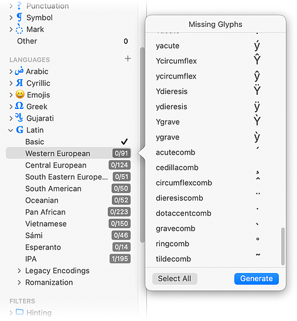

リストの一番下には、`comb`で終わるグリフ名がいくつかあります。これは*結合*の略で、それらを下のベース文字と結合したいので、意味があります。

すべての「…comb」グリフを選択し、「生成」を押すと、8つのマークが得られます。もしすべてがうまくいけば、`acutecomb`、`cedillacomb`、`circumflexcomb`、`dieresiscomb`、`dotaccentcomb`、`gravecomb`、`ringcomb`、`tildecomb`が表示されるはずです。

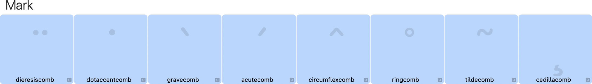

これらのアクセントはすべて、エックスハイトの真上に配置されることになっています。`cedillacomb`だけがベースラインにぶら下がります。例に戻ると、これが私たちの`dieresiscomb`の見た目です。

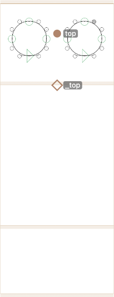

そして、これが私たちのチルダです。

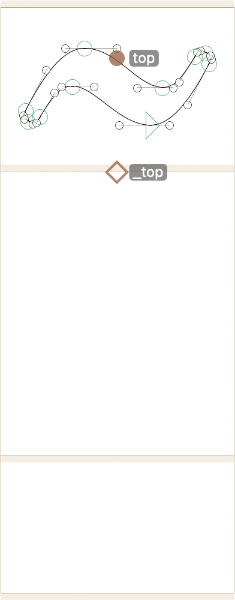

## アンカー

そこにある赤い点が見えますか？これらは*アンカー*と呼ばれます。アンカーは、ベースグリフ（あなたの小文字など）とマークを接続するのに役立ちます。もしそれらをクリックすれば、その名前を見ることができます。`a`や`n`のようなベース文字では、それらは`top`、`bottom`、`ogonek`と呼ばれます。


もしそれらがメトリクスライン（エックスハイト、キャップハイト、ベースラインなど）上に正確にある場合、ダイヤモンドの形を取ります。ほとんどの場合、そうあるべきです。もしメトリクスラインからずれると、円形になります。アラインメントゾーン内では、正方形の形を取ります。

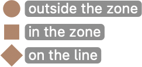

しかし、マークでは、それらは同じ名前ですが、前にアンダースコアが付いています。つまり、`_top`、`_bottom`、`_ogonek`です。


アンダースコア付きのアンカーは、ベース文字のアンダースコアなしのアンカーと接続するためのものです。例えば、`_top`アンカーは、最も近い`top`アンカーを探してその上に座ります。レゴブロックの穴と突起を考えてみてください。

もしグリフに事前定義されたデフォルトのアンカーを設定したい場合は、「グリフ」メニューから「アンカーを設定」（Cmd-U）を選びます。Optionキーを同時に押しながらだと、「すべてのマスターにアンカーを設定」になります。同じメニューで、「アンカーをリセット」（Cmd-Shift-U）はアンカーをデフォルトにリセットします。繰り返しになりますが、Optionキーを追加すると「すべてのマスターでアンカーをリセット」になります。Glyphsはどうやってどのアンカーを追加すべきかを知るのでしょうか？それには、アンカー情報も含む内蔵のグリフデータベースがあります。もしデフォルトに含まれていないアンカーを作成したい場合は、右クリックしてコンテキストメニューから「アンカーを追加」を選ぶことができます。

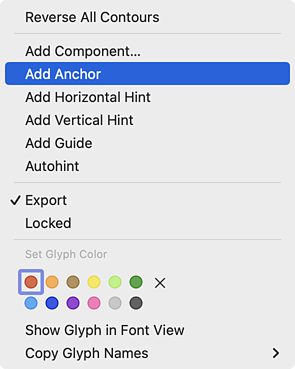

次に、アンカーの名前を入力し、好きな場所にドラッグします。

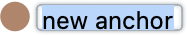

もし既存のアンカーの名前を変更したい場合は、グレーの情報パネルで名前を変更できます。あるいは、アンカーをクリックして選択し、returnキーを押すだけです。

さらに、アンカーを選択すると、可能なマークの配置のグレーのプレビューが表示されます。このように。


私たちはこれを*マーククラウド*と呼んでいます。いいですね。

## スペーシング

結合マークのサイドベアリングについて一つ簡単な注意点です。マークとベース文字にアンカーがあるので、`comb`グリフのスペーシングは実際には問題になりません。書き出されたフォントでは、それらは自動的に幅がゼロになります。

したがって、編集に便利なサイドベアリングを選ぶことをお勧めします。編集ビューで便利に選択できるほど小さすぎず、1行か2行にすべて収まり、あまりスクロールしなくて済むほど広すぎないようにです。例えば、LSBとRSBの両方にメトリクスキー`=50`（等号を含む）を試してみてください。フォントビュー（Cmd-Opt-1）に切り替え、サイドバーの「マーク > 結合」で結合マークをフィルタリングし、すべての結合マークを選択して両方のサイドベアリングに`=50`と書くことで、一度にすべてを設定できます。

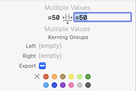

この方法なら、いつでもすべての結合マークを選択し、Optionキーを押しながら「グリフ > すべてのマスターでメトリクスを更新」を選べば、すべてのサイドベアリングが50にリセットされます。

心配しないでください。書き出されたフォントでは、アドバンス幅は必要に応じてゼロに設定されます。ゼロ幅は、左サイドベアリングの位置になります。もし別の場所にしたいなら、ベースライン上に`*origin`（アスタリスクを含む）という名前のアンカーを追加します。しかし、本当に、それについて心配しないでください。

## コンポーネント

さて、ベースとなる文字とマーク、そしてそれぞれのアンカーという、すべての材料が揃いました。あとは、Glyphsにダイアクリティカルマークを作成してもらうだけです。しかし、どんなものがあるのでしょうか？どれが必要なのでしょうか？そして、それぞれのグリフ名は？

繰り返しになりますが、フォントビューの「言語」の下にある、数字のバッジが付いた項目のいずれかを右クリックするだけです。数字のバッジは、リストに何個のグリフがあり、そのうち何個がすでにフォントにあるかを示します。`adieresis`と`ntilde`の両方は、「西欧」の下にあります。


それらを選択し（Cmdキーで複数のグリフを選択、Shiftキーでグリフの範囲を選択）、「生成」を押すと、Glyphsがコンポーネントから両方の文字を構築します。コンポーネントは、元の文字のライブでホットリンクされたコピーです。「グリフ > コンポーネントを選択」（Cmd-Shift-C）経由で、現在のグリフに他のどのグリフでもコンポーネントとして追加できます。そして、「グリフ > 複合グリフを作成」（Ctrl-Cmd-C）で、グリフを内蔵のコンポーネントレシピからゼロから再構築できます。これらのコマンドのいずれかにOptionキーを追加すると、*すべてのマスターで*機能します。`adieresis`には、`a`コンポーネントと`dieresiscomb`コンポーネントがあります。コンポーネントは、通常見るパスの代わりに、グレー、緑がかった、または青みがかったプレビューとして表示されます。

その性質上、コンポーネントは編集できず、それが指す元のグリフのみを編集できます。もしそうしたいなら、単にコンポーネントをダブルクリックすれば、その元のグリフが隣に開かれます。もしパスが必要で、ホットリンクは気にしないなら、コンポーネントのコンテキストメニューから「分解」を選ぶか、「グリフ > コンポーネントを分解」（Cmd-Shift-D）で、選択したグリフのすべてのコンポーネントを編集可能なアウトラインに分解できます。繰り返しになりますが、Optionキーを加えれば、すべてのマスターで一度に行えます。

デフォルトでは、複合グリフは*自動的に整列*されます。つまり、`adieresis`の幅は`a`と同期しており、`dieresiscomb`マークの相対的な配置はアンカーによって行われます。もし自動的な配置と同期を*望まない*場合は、それぞれのコンポーネントを右クリックし、コンテキストメニューから「自動整列を無効にする」を選ぶことができます。

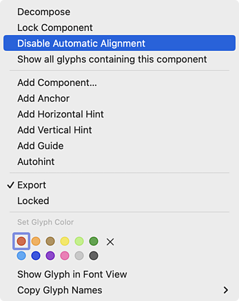

しかし、通常は自動整列させたいでしょう。なぜなら、そうでなければ、それらがずれてしまう危険があるからです。いずれにせよ、これでダイアクリティカルマークができました。

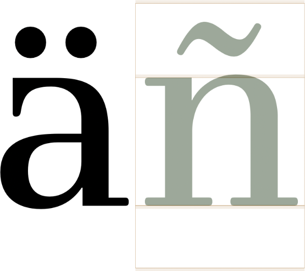

緑の色合いは、その位置が完全に自動整列によって決定されることを意味します。青の色合いは、その水平位置が自動整列によって決定されるが、グリフを垂直方向に、または正確にはイタリック角度で、依然としてシフトできることを意味します。これは、*マイナー*ケースのグリフ、例えば小さい数字の場合です。

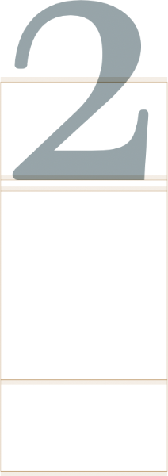

この例では、`two.dnom`が`twosuperior`内でコンポーネントとして使用されています。数字を上下にドラッグすることはできますが、水平方向にはその幅内で固定されています。

## iとj

ここまでは順調です。しかし、問題を引き起こす小文字が1つあります。いや、実際には2つです。iとjです。もしそれらにどんなマークも付けたいなら、まずドットを取り除く必要があります。言い換えれば、ドットのないiとドットのないjが必要です。

ありがたいことに、`idotless`というドットのないiと、`jdotless`というドットのないjがあります。もしすでにiとjを描いているなら、これらを素早く簡単に作成する方法があります。ドットなしのiを選択し、「グリフ」メニューまたはコンテキストメニューから「選択部分からコンポーネントを作成」を選びます。

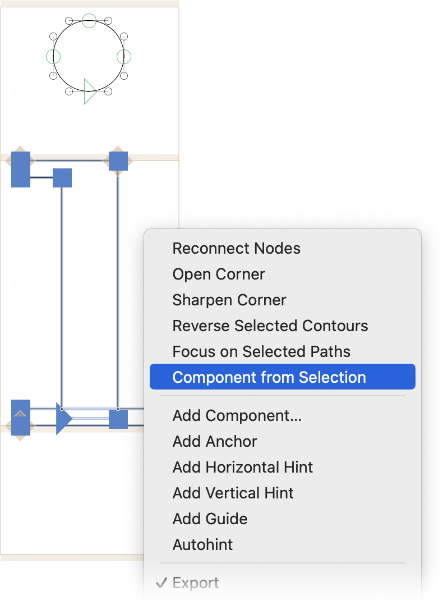

Glyphsは、選択したアウトラインを新しいグリフに移動させ、そのグリフを現在のグリフにコンポーネントとして再挿入します。そのため、その新しいグリフにどのような名前を付けるべきか尋ねてきます。

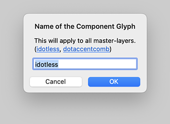

### プロのヒント
よくある間違いは、iとjに1つのドットデザインを使い、同時にリトアニア語のė、マルタ語のċ、ポーランド語のżのような他のドット付き文字では異なるシェイプを使うことです。そうしないでください。むしろ、すべてのドット付きグリフに全く同じドットアクセントを使用してください。さもないと、あなたのフォントはリトアニア語、ポーランド語、マルタ語で使えなくなります。それは、英語のタイポグラフィでiとjに異なるティトルを使うのと同じことです。

簡単な参照のために、現在のグリフの典型的なコンポーネント、例えば`i`の`idotless`と`dotaccentcomb`を挿入します。ダイアログは、あなたが作成したいものを推測しますが、もし推測が間違っていれば、下線付きのグリフ名をクリックするか、自分でグリフ名を入力できます。すべてがうまくいったと仮定し、Glyphsはあなたのための`idotless`を作成し、準備は完了です。`j`で同じことをすれば、`jdotless`もできます。これで、iとjのダイアクリティカルマークも構築できます。

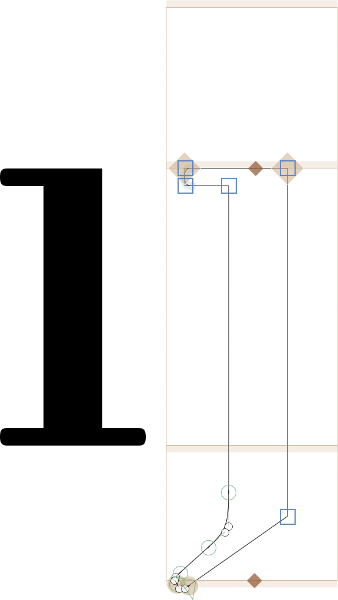

確かに、小文字のjがアクセントを取ることはめったにありません。私の知る限り、jにダイアクリティカルマークを用いる唯一の書き言葉は、エスペラント語（`U+0135 LATIN SMALL LETTER J CIRCUMFLEX`を知る）と、オランダ語（適切にエンコードされていれば、強調されたijに`U+0301 COMBINING ACUTE ACCENT`を付ける）です。それに加えて、一部のインド系言語のラテン文字転写では、同じ結合する非スペーシングのアキュートをjに付けることがあります。そして、一部の音声記号では、`U+01F0 LATIN SMALL LETTER J WITH CARON`が現れることがあります。[Wikipediaは](https://en.wikipedia.org/wiki/J-caron)、パシュトー語とワハン語をラテン文字で書くためにも使用されると述べています。ですから、全体として、フォントに別の`jdotless`を持つ十分な理由があります。

ドットなしのiとjに基づいてアクセントを作成する場合、Glyphsは幅の狭いマークを優先します。詳細は[幅の狭いマークに関するチュートリアル](advanced-diacritics-narrow-marks.md)を読んでください。

## 大文字のダイアクリティカルマーク

多くのデザインでは、通常のマークは大文字には高すぎます。そのため、一部のデザイナーは、大文字用に別々のマークを作成することを選びます。この例では、大文字のサーカムフレックスが小文字のデザインとどのように異なるか注目してください。

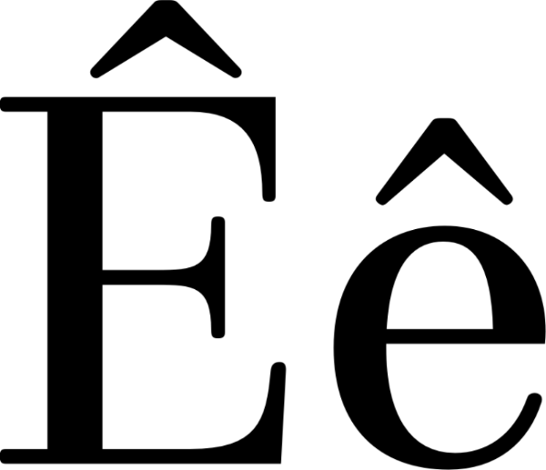

この場合、`circumflexcomb`には2つの異なるバージョンがあります。小文字のものは単に`circumflexcomb`と呼ばれますが、大文字のバリアントには`.case`という接尾辞も付いています。`circumflexcomb.case`です。

大文字のマークは少し違った方法で作られます。マークはキャップハイトの上に配置され、アンカーは正確にキャップハイト上にあるべきです。例えば、これが`caroncomb.case`の見た目です。

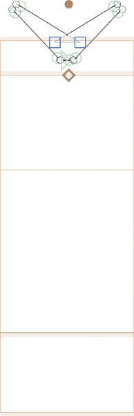

`_top`アンカー、そして結果としてシェイプ全体が、エックスハイトではなく*キャップハイト*上にあることに注意してください。

`.case`マークができたら、小文字のダイアクリティカルマークと同じように、大文字のダイアクリティカルマークを構築できます。すでに存在するダイアクリティカルマーク付きの文字を再構築するには、「グリフ > 複合グリフを作成」（Ctrl-Cmd-C）を選び、繰り返しになりますが、すべてのマスターに対してはOptionキーを追加します。

## スラッシュとストローク

中央のマークはサイドバーにリストされていません。これには、次のようなグリフのスラッシュやストロークが含まれます。
```
Dcroat dcroat
Eth
Hbar hbar
Lslash lslash
Oslash oslash
Tbar tbar
```
…そして、これらは西欧、中欧、南東欧のグリフセットにあるものだけですが、他にもたくさんあります。それらのマークには特定の命名が必要ですが、実際にはかなり論理的です。以下の部分を連結するだけです。

1.  Ħ、Đ、Ŧのように水平なら`stroke`、ŁやØのように斜めなら`slash`。
2.  ŁやŦのように1つのステムを横切るなら`short`、ØやĦのように複数のステムを横切るなら`long`。
3.  `comb`は常に続きます。
4.  小文字用ならドット接尾辞なし、大文字用なら`.case`、スモールキャップ用なら`.sc`、あるいは意図する他のドット接尾辞（下記参照）。

したがって、Øを横切る線は`slashlongcomb.case`と呼ばれ、ħやđを横切る線は`strokeshortcomb`と呼ばれます。もしŧに別の水平ストロークが必要なら、それを`strokeshortcomb.t`と呼ぶことができます。ドット接尾辞のトリックについては、次のセクションで詳しく説明します。

## 特別なマーク

同様に、ベース文字の名前を接尾辞として追加することで、特定のベース文字の*代替マーク*を追加できます。例えば、`circumflexcomb.g`は、`gcircumflex`を構成または再構成する際に優先されます。

あるいは、その逆です。`.topAccent`接尾辞を文字に追加すれば、上付きマーク用の*代替ベース文字*を持つことができます。詳細は[適応ベース文字に関するチュートリアル](advanced-diacritics-adapted-base-letters.md)で読んでください。

同様に、*フィーチャータグ*接尾辞を持つマークは、そのフィーチャーのすべてのグリフに優先されます。例：`dieresiscomb.ss01`は`adieresiscomb.ss01`に優先されます。スモールキャップの`.sc`やプチキャップの`.pc`、ポーランド語バリアントの`.loclPLK`なども同様です。

## レガシーマーク

「マーク」カテゴリに、「レガシー」セクションがあることにお気づきかもしれません。

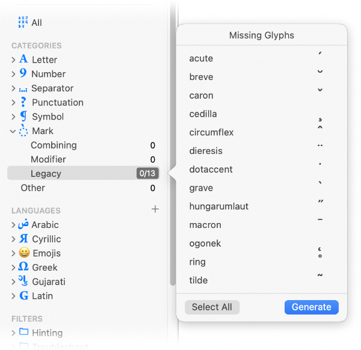

ご覧の通り、13個あり、名前の末尾に`comb`がありません。歴史的な理由からのみ存在しますが、残念ながら、これらなしではやっていけません。フォントには後方互換性のためにレガシーマークが必要です。実際、これらはTextEditのようなアプリで、アクセントキーをタイプした*後*、そしてベース文字をタイプする*前*に表示される、色付きのプレースホルダーです。

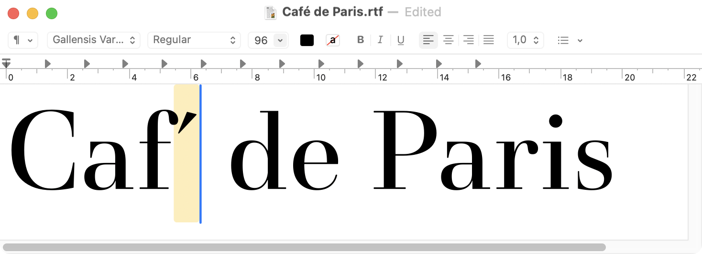

しかし、今や結合アクセントがあるので、それらを再描画するのは不要に感じます。コピー＆ペーストでさえ、時間の無駄のように思えます。なぜなら、もしデフォルトのアクセントが変われば、レガシーマークも変更する必要があるからです。

幸いなことに、私たちにはコンポーネントがあります！そして、偶然にも、レガシーマークを、その結合する兄弟の*コンポーネントコピー*として生成する簡単な方法があります。必要なのは、「レガシー」セクションを右クリックし、すべてのマークを選択し、「生成」をクリックすることだけです。

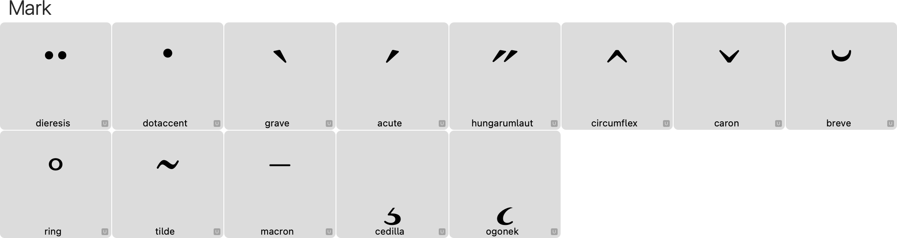

これにより、レガシーマークが生成され、それぞれの結合マークがコンポーネントとして挿入されます。これで、あなたのフォントはより互換性が高くなりました！そして何よりも良いのは、レガシーマークが結合マークに設定したサイドベアリングを継承するため、よくスペースが取られたレガシーマークが得られることです。

> ヒント：スペーシングアクセントの表示には2つの注目すべき例外があります。チルダまたはサーカムフレックスをタイプすると、ほとんどのアプリは実際のマーク`tilde`や`circumflex`の代わりに、記号`asciitilde`と`asciicircum`を表示します。ですから、グリフセットにもそれらがあることを確認してください。さもないと、TextEditのようなオフィスアプリはフォールバックフォントにデフォルトする可能性があります。デザイン的には、これら2つのグリフは通常、マークよりも少し大きく、低く描かれます。もしサイドバーで探しているなら、Glyphsはそれらを「記号」、サブカテゴリ「数学」の下にリストしています。

今回はここまでです。フォントの言語サポートを拡張するのを楽しんでください。現代のラテン文字フォントは、少なくとも*西欧*、*中欧*、*南東欧*をカバーしているべきです。頑張ってください。

## スクリプトとプラグイン

[mekkablue scripts](glyphsapp3://showplugin/mekkablue%20scripts)には、アンカーとコンポジットの扱いに役立ついくつかの便利なスクリプトがあります。

*   *Anchors > Anchor Mover:* 選択したグリフのアンカー位置を一括処理します。もしずれてしまったら、すべてのボトムアンカーをベースラインに戻すなど、同様のことに最適です。
*   *Anchors > Batch Insert Anchor:* 選択したすべてのグリフに、すべてのレイヤーで、おおよその位置にアンカーを挿入します。
*   *Anchors > Insert All Anchors in All Layers:* すべてのアンカーが、すべてのレイヤーで同じ相対的な位置に複製されるようにします。アンカーの互換性を修正するのに適しています。
*   *Anchors > Realign Stacking Anchors:* 結合マークのすべてのレイヤーで、`top`/`_top`、`bottom`/`_bottom`などのアンカーペアが、アンダースコア付きのアンカーを水平に移動させることで、イタリック角度で再整列されます。
*   *Components > Alignment Manager:* （複数の）選択されたグリフに対して、すべてのマスターで自動整列を管理します。
*   *Components > Component Problem Finder:* コンポーネントに関する可能性のある問題を検索し、報告します。
*   *Components > Move Paths to Component:* パスを別のグリフに移動させ、ソースグリフに自動整列された、アンカー付きのコンポーネントとして挿入します。パスとコンポーネントの混在を純粋な複合グリフにするのに最適で、内蔵の「選択部分からコンポーネントを作成」よりもわずかにうまく機能します。例えば、接続アンカーを指定できます。

Jeremy Tribby氏は、[彼のスクリプトコレクション](glyphsapp3://showplugin/Jeremy%20Tribby%E2%80%99s%20Scripts)に、「Decompose Combining Marks in all Masters」というスクリプトを持っています。

Tim Ahrens氏の[Alignment Palette](glyphsapp3://showplugin/Alignment%20Palette)は、コンポーネントの配置を一括で管理するのに役立ちます。

[Show Component Order](glyphsapp3://showplugin/Show%20Component%20Order)拡張機能は、「表示」メニューに追加されます。コンポーネントを色分けし、間違ったコンポーネントの順序（ベースグリフが最初に来て、アクセントが続く）や、整列していないコンポーネントを簡単に見つけることができます。

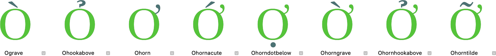

---
サンプルフォント：GALLENSIS BY PETER RENN AND SCHRIFTLABOR.

---

更新履歴 2014-12-11: ドットなしグリフの新しい表記法に更新。

更新履歴 2015-03-28: Glyphs 2.0向けに書き直し、結合マークを反映、レガシーマークに関するセクションを追加。

更新履歴 2016-01-18: jのダイアクリティカルマークの追加の出現箇所を追加。Igor Freiberger氏に感謝。

更新履歴 2017-01-09: asciicircumとasciitildeに関するヒントを追加。komplicado氏にこれを指摘していただき感謝。

更新履歴 2018-07-28: いくつかの誤字を修正。Nathalieに感謝。

更新履歴 2022-16-08: 軽微なフォーマット変更、メニュータイトル「Create Composite」。

更新履歴 2024-07-04: Glyphs 3向けに部分的に書き直し、Gallensisで新しいスクリーンショット。

更新履歴 2024-07-23: いくつかの誤字を修正、大きすぎる画像を縮小、整形済み部分（ストロークおよびスラッシュ付きグリフ）を改善、ドットアクセントに関するヒントを追加。

## 関連記事

[すべてのチュートリアルを見る →](https://glyphsapp.com/learn)

*   ### [上級者向けダイアクリティカルマーク：幅の狭いマーク](advanced-diacritics-narrow-marks.md)

チュートリアル

*   ### [上級者向けダイアクリティカルマーク：複数のアンカー](advanced-diacritics-multiple-anchors.md)

チュートリアル

[ 言語 ](https://glyphsapp.com/learn?q=languages)

*   ### [上級者向けダイアクリティカルマーク：調整されたベースレター](advanced-diacritics-adapted-base-letters.md)

チュートリアル

[シェイプの再利用](https://glyphsapp.com/learn?q=reusing+shapes)

*   ### [ビデオ：ダイアクリティカルマークの作成](video-building-diacritics.md)

チュートリアル

