原文: [drawing-good-paths](https://glyphsapp.com/es/learn/drawing-good-paths)
# 良いパスを描く

チュートリアル

Rainer Erich Scheichelbauer著

[ en ](https://glyphsapp.com/learn/drawing-good-paths) [ es ](https://glyphsapp.com/es/learn/drawing-good-paths) [ fr ](https://glyphsapp.com/fr/learn/drawing-good-paths) [ zh ](https://glyphsapp.com/zh/learn/drawing-good-paths)

2022年7月22日 2013年1月6日公開

パスには2種類あります。良いパスと悪いパスです。ここでは、悪いパスを見つけて、よくある問題を修正したり避けたりする方法を紹介します。このチュートリアルを読んでおいて本当に良かったと思うはずです！

*   [魔法の三角形](https://glyphsapp.com/learn/drawing-good-paths#g-the-magic-triangle)
*   [変曲点](https://glyphsapp.com/learn/drawing-good-paths#g-inflections)
*   [パスの向きと順序](https://glyphsapp.com/learn/drawing-good-paths#g-path-orientation-and-order)
*   [自己交差](https://glyphsapp.com/learn/drawing-good-paths#g-self-intersection)
*   [余分なポイントと間違ったノードタイプ](https://glyphsapp.com/learn/drawing-good-paths#g-superfluous-points-and-wrong-node-types)
*   [極値点](https://glyphsapp.com/learn/drawing-good-paths#g-extremum-points)
*   [開いたパスと閉じたパス](https://glyphsapp.com/learn/drawing-good-paths#g-open-and-closed)
*   [領域外のベクター](https://glyphsapp.com/learn/drawing-good-paths#g-vectors-out-of-bounds)
*   [便利なプラグインとスクリプト](https://glyphsapp.com/learn/drawing-good-paths#g-useful-plug-ins-and-scripts)

質の悪いアウトラインは頭痛の種になります。文字が崩れて見えたり、まったく表示されなかったりすることがあります。いくつかの基本的なルールを心に留めておけば、こうした困難を避けることができます。

## 魔法の三角形

これは重要です。すべてのカーブセグメントは、きれいな三角形の中に収まるべきです。

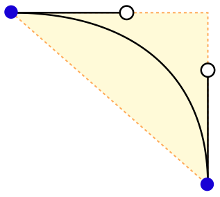

「セグメントって何？」という声が聞こえてきそうですね。簡単です。それは、*隣り合う2つのオンカーブポイント（別名ノード）の間にあるすべてのもの*です。セグメントには直線とカーブの2種類があります。直線は、その2つのノードだけで構成されます。カーブセグメントには、さらに2つのオフカーブポイント（別名ベジェコントロールポイント（BCP）または「ハンドル」）が付いています。

重要なのは、魔法の三角形が、セグメントを構成する2つのノードと、*ハンドルの延長線*が交差する点によって描かれるということです。これは、ハンドルが決して三角形の外に出てはならないことを意味します。もし出てしまったら、ノードの位置を考え直した方がよいかもしれません。したがって、ハンドルがもう一方のハンドルと交差すること、そしてハンドルがもう一方のハンドルの延長線と交差すること、この2つは起こるべきではありません。これらは不必要な変曲点、尖ったカーブ、あるいは自己交差さえも引き起こし、ラスタライザを困らせる可能性があります。

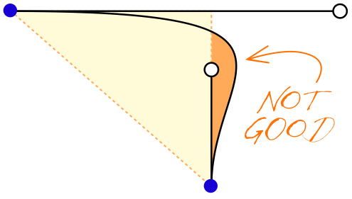

Illustratorのようなベクターアプリケーションでの経験がある方には、これは驚きかもしれません。第一に、ハンドルは*ノードにではなく、セグメントに属します*。第二に、カーブセグメントは*常に2つのBCPを持ち*、決して1つだけではありません。Illustratorでは、BCPが1つだけのカーブセグメントを描けるように見えます。しかし実際には、Illustratorは2つ目のBCPを周囲のノードのいずれかに隠しているだけです。これはかなり良くありません。なぜなら、フォントのベクターでは、2つのポイントが同じ座標を共有すべきではないからです。さらに、両方のBCPをうまく使えば、パスをより細かく制御できます。

BCPの1つが見当たらないように見える場合、それは隣のノードに隠れています。これを修正する最も簡単な方法は、近くのポイント（ハンドルかノード）を選択し、Tabキーで隠れているハンドルに移動することです。Shift-Tabキーで逆方向に移動できます。薄い灰色のハイライトは、ハンドルが選択されていることを示します。次に、矢印キーを使ってハンドルをノードから引き出します。Optionキーを押しながらだと、ハンドルの向きを保ったまま移動できます。Shiftキーを押しながらだと10単位ずつ動かせます。

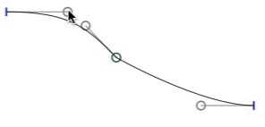

## 変曲点

一見すると、魔法の三角形は、カーブセグメントが単一の向きを持つべき、つまり変曲せず、時計回りから反時計回りに切り替わらないことを意味するように思えます。しかし、多くの例外があります。

特に補間用に描画する場合、`S`や`tilde`のようなグリフを描く際には、変曲点*なし*の方が良い場合が多いです。もしデザインの意図が許し、セグメントの両方のハンドルが直交（つまり、垂直または水平）しているなら、技術的に変曲点を追加する必要はありません。そして、ポイントが少ないほどトラブルも少なくなります。ですから、可能な限り、左側のsのようにしておきましょう。

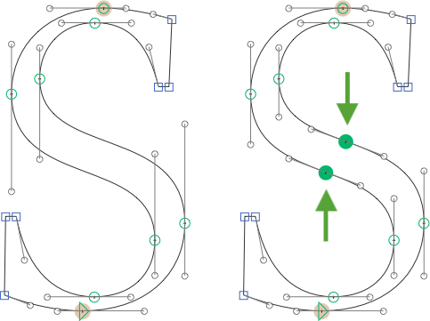

しかし、変曲点なしでは思うようなsのカーブが描けない場合は、描画ツール（P）を選択し、Shiftキーを押しながらセグメントのほぼ中央をクリックして追加します。Glyphsは、最も近い変曲点にオンカーブポイントを追加します。右側のsのようになります。

ただし、変曲点はできるだけ避けるようにしてください。なぜなら、補間で問題を引き起こす可能性があるからです。オンカーブポイントとそれを取り囲む2つのハンドルの対角線上の三つ組は、マスター間の補間ステップで「キンク」（折れ曲がり）と呼ばれる現象を引き起こすことがあります。詳しくは、[アウトラインの互換性を保つ方法についてのマルチプルマスターのチュートリアル](/learn/multiple-masters-part-2-keeping-your-outlines-compatible)に、キンクに特化したセクションがありますのでお読みください。

> **特殊なケース：** 画面表示に最適化されるべきフォントで*カップ状セリフ*を描く場合、変曲点のないカーブセグメントが*必要*になります。
>
> 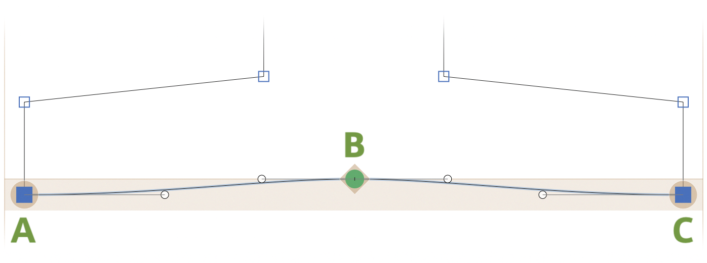
>
> ポイント*AとCが同じ高さにある*こと、すべてのBCPが水平であること（またはBとA/Cの高さの間にあること、つまりこれら2つの高さが作る領域を超えないこと）、そしてベースとBの間の距離が20ユニット未満であることを確認してください。_ファイル > フォント情報 > フォント_で、`blueShift`カスタムパラメータを追加し、値としてカップの深さプラス1を設定します。そうすると、PostScriptの自動ヒンティング機能が「フレックスヒント」と呼ばれるものを適用し、非常に低い解像度でのカップの表示を抑制します。そして最も重要なのは、*Bがベースライン上にある*ことを確認することです。そうです、Bのポイントです！そして、AとCを持つカップの部分は、ベースラインのアライメントゾーンに完全に浸る必要があります。[PostScriptヒンティングについて詳しくはこちら。](/learn/hinting-postscript-autohinting)

## パスの向きと順序

間違ったパスの向きは、カウンター（字の内側の空間）をめちゃくちゃにし、適切なヒンティングを不可能にします。パスは反時計回りに、カウンターは時計回りに向いている必要があります。パスを選択し、右クリックしてコンテクストメニューから*選択した輪郭を反転*を選ぶことで、パスの向きを制御できます。それを覚えておきたくないですか？問題ありません。Glyphsが代わりにやってくれます。*パス > パスの向きを修正*（Cmd-Shift-R）を選ぶだけで完了です。このコマンドは、複数のグリフ、あるいはフォント全体にも機能します。

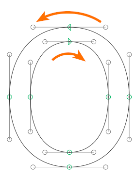

ちなみに、*パス > パスの向きを修正*（Cmd-Shift-R）は、パスの順序も並べ替え、各閉じたパスの開始点をリセットします。

マルチプルマスターで作業していますか？Optionキーを押しながらだと、メニューコマンドが*パス > すべてのマスターのパスの向きを修正*（Cmd-Opt-Shift-R）に変わります。名前が示すように、これは選択したグリフの*すべて*のレイヤーに対して同時に魔法をかけてくれます。複数のマスターを持つグリフの互換性を素早く修正したいときに便利です。ほとんどの補間の問題は、この方法で素早く治せます。[アウトラインの互換性を保つ方法について詳しくはこちら。](/learn/multiple-masters-part-2-keeping-your-outlines-compatible)

## 自己交差

書き出されたフォントのパスは、それ自身と交差してはなりません。自己交差を修正するには、問題の輪郭を選択し、*フィルター > オーバーラップを削除*（Cmd-Shift-O）を選びます。しかし、Glyphsファイル内では、編集のしやすさやより良い補間のために交差を保持したい場合もあるでしょう。その場合は、フォントを書き出す（Cmd-E）際に、*オーバーラップを削除*オプションを有効にしてください。

> **ヒント：** これはバリアブルフォントには適用され*ません*。

コンテクストメニューから*角を開く*と*ノードを再接続*コマンドを使って、オーバーラップを追加することさえできます。

### プロのヒント

これらのコマンドは*パス > その他*サブメニューにもあるので、*Glyphs > 環境設定 > ショートカット*で簡単にキーボードショートカットを追加できます。

Glyphs 2以前のバージョンでは、ショートカットは*システム環境設定 > キーボード > ショートカット > アプリケーション*で作成します。

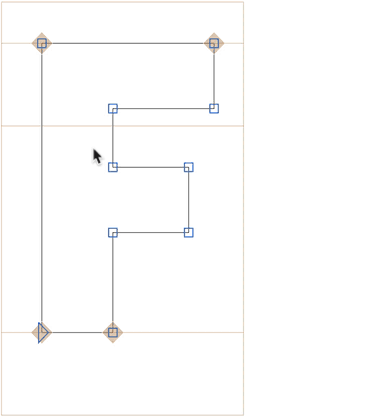

ただし、オーバーラップを保持することには一つの問題があります。それは二重のオーバーラップです。つまり、オーバーラップの内側にさらに別のオーバーラップがある場合です。これらは、シェイプの内側に小さな白い隙間として表示されることがあります。これは、オーバーラップの内側でカーブセグメントが直線に接続し、カーブが少し間違った方向に曲がりすぎた場合に起こります。

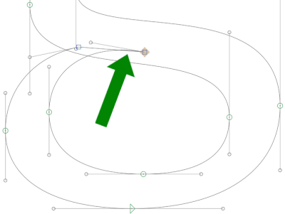

これらの箇所はどうやって見つければよいのでしょうか？Pythonスクリプトを使えば、オーバーラップを削除した後のグリフがどう見えるかを確認し、どこかにアウトラインの破片が残っていないか調べることができます。[mekkablue script repository](http://github.com/mekkablue/Glyphs-Scripts)には、*Paths > New Tab with Small Paths*というスクリプトがあり、そのような小さなパスを含むグリフをすべて見つけて、新しい編集タブで開いてくれます。

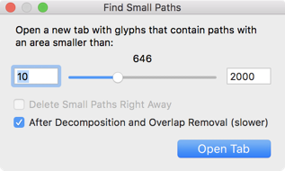

## 余分なポイントと間違ったノードタイプ

大した問題ではありませんが、フォントのレンダリングパフォーマンスを向上させることができます。*パス > パスを整頓*（Cmd-Opt-Shift-T）は、余分なノードと余分なBCPを削除します。言い換えれば、シェイプを表示するのに不要なすべてのポイントを削除します。例えば、完全にまっすぐなセグメント上のハンドルなどです。このコマンドは、ノードの*タイプ*も修正し、必要に応じて青いコーナーポイントを緑のカーブポイントに（またはその逆に）変更します。また、完全に同じ座標を共有する2つの連続したポイント、いわゆる「長さゼロのセグメント」（赤い丸で示される）も修正します。

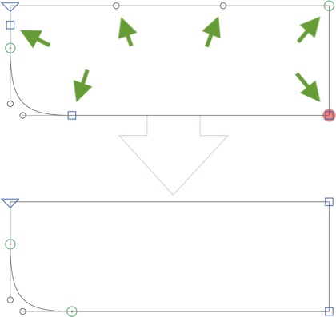

## 極値点

ついでに言えば、パスのxとyの極値、つまりパスの接線が完全に水平または垂直になる場所にノードを挿入すると、多くのことがずっと簡単になります。多くの場合、これにより他のポイントを取り除きながら、よりシンプルなパス、より少ないポイント、より小さなファイルサイズを実現できます。

また、ヒンティングを利用したい場合は、ヒントがそれぞれのステムに付着するために極値点が必要です。極値点がなければ、ステムヒントもありません。[ヒンティングについて詳しくはこちら。](/learn/hinting-postscript-autohinting)

*パス > 極値を追加*を選んで、選択したアウトライン、グリフ、あるいはフォント全体に極値を追加することができます。あるいは、より細かく制御したい場合は、ペンツール（P）を取り、パス上をShiftキーを押しながらクリックします。Glyphsは、カーブの最も近い極値または変曲点を探し、そこにノードを挿入します。

極値点を挿入した後、シェイプを損なうことなく中間点を取り除くことができる場合が多いです。

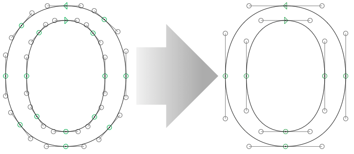

それには、緑色の対角線上にあるポイントの1つを選択し、Deleteキーを押します。*一度に1つのノードを削除*すると、Glyphsは単一のセグメントでシェイプを再構築しようと最善を尽くします。結果は場合によります。

> **プロのヒント：** いわゆる*浅いカーブ*、つまり深さがほんの数ユニットしかないカーブセグメントができてしまう場合は、極値点を*避けた*方がよいかもしれません。なぜ浅いカーブを避けたいのでしょうか？なぜなら、ポイントの座標は通常小数点を持たず、オンカーブポイントとオフカーブポイントをどれだけ賢く配置しようとしても、カーブセグメントがシェイプを台無しにしてしまうからです。良い例は、小文字のaの右下にあるフィニアル（終筆）です。
>
> 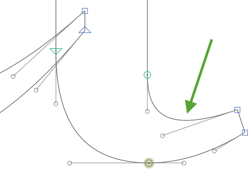

## 開いたパスと閉じたパス

最終的なフォントでパス全体が消えてしまいましたか？おそらくそれは開いていたのでしょう。開いたパスは書き出し時に無視されます。したがって、すべてのパスは閉じていなければなりません。

パスを閉じるには、編集ツール（V）で開いた端の一方をもう一方の上にドラッグするだけです。または、ペンツール（P）に切り替えて、両方の端点を順にクリックして閉じるセグメントを追加します。あるいは、開いたパスを選択し、右クリックしてコンテクストメニューを開き、*開いたパスを閉じる*を選びます。

## 領域外のベクター

左右のサイドベアリングの値がものすごくおかしいですか？おそらく、グリフの表示領域から遠く離れた場所に何らかのオブジェクトがあるのでしょう。それを取り除く方法は次の通りです。

1.  正しいグリフがアクティブであることを確認します。つまり、カーソルの前にそのグリフがある状態です。*ヒント：灰色の情報ボックス（Cmd-Shift-I）のLSBとRSBの値に注意し、とてつもなく大きな、おそらく負の数がないか確認してください。*
2.  ツールバーの矢印シンボルをクリックして編集ツールに切り替えます。
3.  *編集 > すべてを選択*（Cmd-A）を選びます。グリフ内のすべてのパスが選択されます。
4.  Shiftキーを押しながら、保持したい部分を矩形選択でドラッグします。これにより、それらの選択が解除されます。これで、領域外の破片だけが選択されたままになります。
5.  Deleteキーを押します。

## 便利なプラグインとスクリプト

*ウィンドウ > プラグインマネージャー*を通じて、アウトラインの問題箇所を特定するのに役立つ分析的な*表示*メニューのプラグインをいくつか手に入れることができます。この点で優れたプラグインは、*Show Angled Handles*、Jens Kutílek氏の*Red Arrow*、Simon Cozens氏の*Heatmap*などです。また、*Show Tops and Bottoms*も役立つかもしれません。

プラグインマネージャーには、問題の修正に役立つ*フィルター*メニューの拡張機能もあります。*Fix Zero Handles*や*Delete Small Paths*はその2つの例です。しかし、あなたのデザインに必要なものを考え、そのためのプラグインがあるか探してみてください。

また、[拡張ページ](https://glyphsapp.com/extend)にリストされているスクリプトリポジトリも見てみてください。その多くには、上記で述べたような、フォントの問題を修正するのに役立つスクリプトが含まれています。

[mekkablue scripts](https://github.com/mekkablue/Glyphs-Scripts/)には、*Paths*サブメニューに便利なスクリプトがいくつかあります。重要なスクリプトの一つは*Path Problem Finder*で、フォント全体のアウトラインの問題箇所を見つけるのに役立ちます。

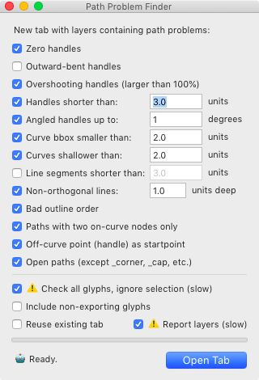

ついでに言えば、*Green Blue Manager*（ハンドルの整列用）や*Find Near Vertical Misses*（縦のメトリクスラインから*ほんのわずか*ずれているすべてのノードを見つける用）も、過去に役立った実績があります。

さあ、あなたのグリフを見直してベクターを最適化する良い機会です。信じてください、後々の面倒を省けますよ。

---

更新履歴 2018-08-04: テキストを改訂し、現在のアプリのバージョンに合わせて調整。二重のオーバーラップ、再接続、角の開放、スクリプトやプラグインのヒントを追加。

更新履歴 2018-08-19: 「余分なポイントと間違ったノードタイプ」セクションにおける「パスを整頓」のより正確な説明を追加。カップ状セリフの例について、より明確な説明と新しいスクリーンショットを追加。変曲点の説明の表現を整理。

更新履歴 2020-08-18: 変曲点に関するセクションを変更し、可能な限り避けることを提案。便利なmekkablueスクリプトに関する段落を追加。浅いカーブを避けるためのサンプル画像と、ヒンティングのための極値に関する注記を追加。

更新履歴 2022-07-22: タイトルを更新、軽微なフォーマットを調整。

## 関連記事

[すべてのチュートリアルを見る →](https://glyphsapp.com/learn)

*   ### [スケッチ](https://glyphsapp.com/learn/sketching)

チュートリアル

*   ### [ビデオ：パスを描く](https://glyphsapp.com/learn/video-drawing-paths)

チュートリアル

*   ### [Illustratorから読み込む](https://glyphsapp.com/learn/importing-from-illustrator)

チュートリアル