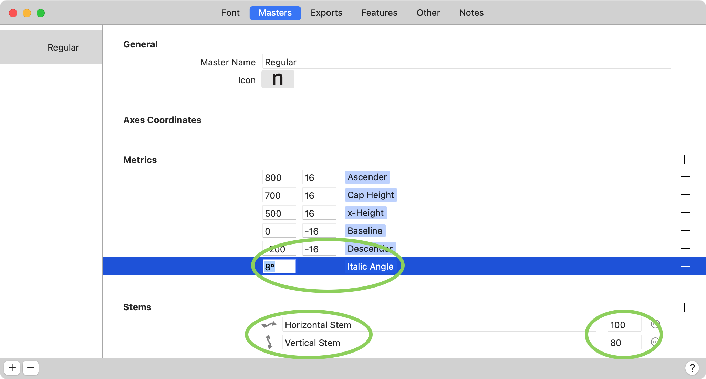

原文: [Easy oblique](https://glyphsapp.com/learn/easy-oblique)
# 簡単なイタリック体の作成

チュートリアル

執筆者: Rainer Erich Scheichelbauer

[ en ](https://glyphsapp.com/learn/easy-oblique) [ fr ](https://glyphsapp.com/fr/learn/easy-oblique) [ zh ](https://glyphsapp.com/zh/learn/easy-oblique)

2025年1月1日更新（初版公開：2012年6月17日）

さて、フォントの直立体を仕上げたところで、深刻なイタリック体への不安に直面しています。簡単な解決策は、オブリーク体です。しかし実際には、本物のイタリック体でさえ、大文字とスモールキャップは依然としてオブリークにする必要があります。あなたの文字の形を傾けるための最良の方法を、素早く見つけましょう。

オブリーク体を作成する良い第一歩は、Glyphsの標準インストールに付属する事前インストール済みのフィルタの一つ、「変形」フィルタです。結果は様々ですが、良いオブリーク体の角度は通常6度から12度の間のどこかです。

「パス > 変形」を選び、平行移動はせず（つまり、値をゼロのままにする）、拡大縮小もせず（100%のままにする）。しかし、「原点」は選んでください。ベストプラクティスとして、「xハイトの半分」を選ぶことをお勧めします。なぜなら、これはGlyphsがイタリック体のサイドベアリングを計算するためにも使用するからです。つまり、LSBとRSBの間で相互参照を持つメトリクスキーを使用できるということです。それが何を意味するかわからないですか？[スペーシングのチュートリアル](spacing.md)を覗いてみてください。

## 傾斜と筆記体化

次に、角度と、デザインをイタリック角度にするモードを選びます。「変形」フィルタは2つの可能性を提供します。最初のオプション「傾斜」は、お気に入りのベクターアプリケーションでよく知られている単純な幾何学的なせん断です。問題は、水平線は重さを保つのに対し、歪みによって垂直線の重さが失われることです。良くありません。

2番目のオプション「筆記体化」（「傾斜」という単語をクリックして「筆記体化」に切り替えます）は、カーブの歪みに対抗しようとします。比較はこちらです。

しかし、「Cursivy」はどうやって何をすべきかを知るのでしょうか？それは単に、カーブの補正を計算するためにあなたの標準ステムを利用するだけです。ですから、「ファイル > フォント情報 > マスター」（Cmd-I）で、適切な、平均的な水平および垂直ステムの値を入力するようにしてください。

### プロのヒント
「ファイル > フォント情報 > マスター」に入力された標準ステムがカーブの補正を決定するため、異なるステム値を試すことで補正量を調整できます。あるいはもっと良いのは、カーシブ化されたバージョンを前景に、単に傾斜させたバージョンを背景に置き、その後「パス > 背景と補間」のスライダーを使って両者を補間することです。

「ファイル > フォント情報 > マスター」に入力された標準ステムがカーブの補正を決定するため、異なるステム値を試すことで補正量を調整できます。あるいはもっと良いのは、カーシブ化されたバージョンを前景に、単に傾斜させたバージョンを背景に置き、その後「パス > 背景と補間」のスライダーを使って両者を補間することです。

これは、カウンターが過剰に補正されてとがりすぎているように見える場合に特に役立ちます。

## 極値点の修正

また、カーブ上のパスの極値の位置は、それに合わせて調整されません。これにより、垂直ヒントが不可能になり、補間やナッジングのような一部の操作が非常に難しくなります。もしヒンティングを気にせず、補間もしない、あるいはナッジングに頼らないなら、極値を気にする必要はありません。左のサンプルのようにパスをそのままにしておくことができます。

しかし、もし垂直ステムにヒントを付ける必要があり、補間を計画しているなら、右のサンプルのように極値を修正するのが良い考えです。「パス > 極値点を追加」を使うか、描画ツール（P）でカーブセグメントをShiftキーを押しながらクリックして、最も近い極値にノードを挿入できます。傾いた以前の極値を取り除くには、それらを一つずつ選択し、Deleteキーを押します。Glyphsはカーブセグメントをできるだけ良く再構築しようと最善を尽くしますが、「カーブをフィット」パレット（Cmd-Opt-P）で曲率をあちこち調整する必要があるかもしれません。

Toshi Omagari氏は、「Path > Delete Diagonal Nodes Between Extremes」というスクリプトを書いて、すべてのマスターで、一度にすべての斜めの極値を取り除こうとすることで、プロセスを高速化します。このスクリプトは、[Toshi’s scripts](glyphsapp3://showplugin/Toshi%20Omagari’s%20Scripts)を「Window > Plugin Manager」からインストールすることで、他の多くのスクリプトと一緒にインストールできます。

## 直線のステムを修正する

しかし注意してください。「Cursivy」はボウルにはかなり良い仕事をしますが、直線のステムは単に傾斜されるだけです。しかし、角度が高くなるほど、あなたの*傾斜による歪み*、つまり垂直および右に傾いたステムが細くなり、左に傾いたステムが太くなるのがより極端になります。したがって、後でステムを少し調整する準備をしておいてください。例えば、垂直ステムを30度傾けると、約13パーセント細くなります。しかし、もしステムが以前は30度左に傾いていて、今や直立に傾けられると、そのステムの重さは16パーセントも増えます。

言うまでもなく、30度は非常に極端な角度です。この例では、ステムの歪みをより見やすくするためにそれを選びました。

## 傾斜の高さ

すでに上で述べたように、デフォルトでは、Glyphsはエックスハイトの半分を、メトリクスボックスを傾けるためのピボットとして使用します。この傾斜の高さより上では、ボックスは右に傾き、傾斜の高さより下では、左に傾きます。アイデアは、直立したテキストの間に傾いた単語（あるいはほんの数文字の傾いた文字）がある場合、両側にできるだけ少ししかはみ出さないようにすることです。通常、それは小文字のテキストになるので、エックスハイトの半分がピボットとして最善の推測になります。

しかし、時にはエックスハイトの半分が意味をなさないこともあります。例えば、オールキャップスのフォントを考えてみてください。その場合は、アプリのデフォルトを上書きする必要があります。これを行うには、「ファイル > フォント情報」を開き、「マスター」タブに切り替え、「メトリクス」セクションで新しいメトリクスを追加し、そのタイプとして「Slant Height」を選択します。

ダイアログを確認します。「マスター」タブに戻り、「Slant Height」を入力します。例えば、キャップハイトの半分などです。これで、少なくともこのマスターでは、すべてのサイドベアリングとメトリクスキーが、このピボットの高さを基準に計算されます。

## 便利なスクリプトとプラグイン

*   *Filter > [Italic Extremes](glyphsapp3://showplugin/Show%20Italic) :* 極値点を傾斜と直立の間で切り替えるためのプラグイン。
*   *View > [Show Italic](glyphsapp3://showplugin/Show%20Italic) :* もしローマン体とイタリック体が2つの異なるファイルにあり、同じファミリー名を共有している場合、ローマン体で対応するイタリック体のグリフを、その逆も表示するプラグイン。グリフの高さが同じかどうかも示します。

*   *View > [Show Next Font](glyphsapp3://showplugin/Show%20Next%20Font) :* 上記と同様ですが、2番目のフォントが何であれ、それとです。
*   [mekkablue scripts](glyphsapp3://showplugin/mekkablue%20scripts)には、「Compare Frontmost Fonts」というサブメニューがあり、これはアップライトとイタリックの間のフォント情報、グリフセット、グリフの高さと幅などを比較するのに最適です。
*   [Daniel Gamage](glyphsapp3://showplugin/Daniel%20Gamage’s%20Scripts)と[Guido Ferreyra](glyphsapp3://showplugin/Guido%20Ferreyra’s%20Scripts)のスクリプトコレクションには、ローマンフォントとイタリックフォントを比較・同期させるためのスクリプトが含まれています。

---

更新履歴 2015-07-30: Glyphs 2のスクリーンショットを更新。

更新履歴 2016-12-03: 部分的に書き直し。スクリーンショットを更新・追加、スラント歪み、極値、タイトル、イラストを追加。

更新履歴 2016-12-05: プロのヒントを追加、スラントの原点に関する注記を適切な場所に移動。

更新履歴 2022-08-01: タイトル、関連記事、軽微なフォーマットを更新。

更新履歴 2023-04-20: 便利なスクリプト＆プラグインを追加、Toshiのスクリプトへのリンクを更新。

更新履歴 2023-07-11: 1年前に失われた「パス > 変形」に関する段落を再現。Italic Extremesプラグインを追加。

更新履歴 2025-01-01: 「Slant height」の章を追加。