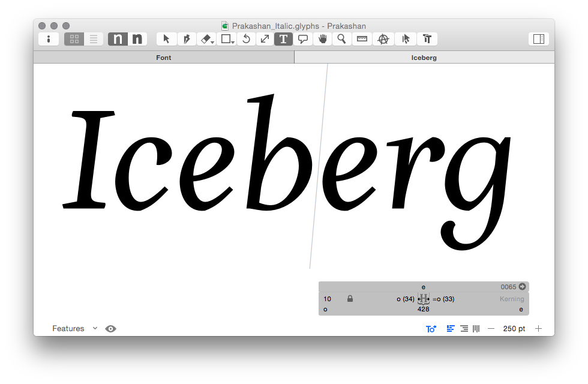
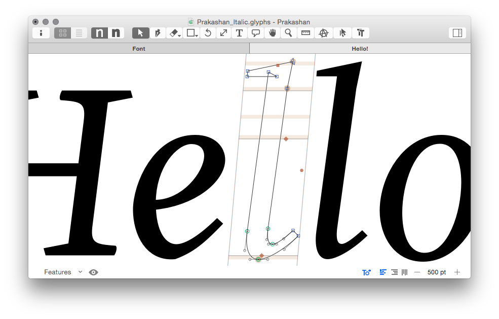
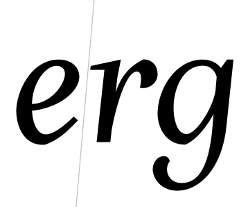
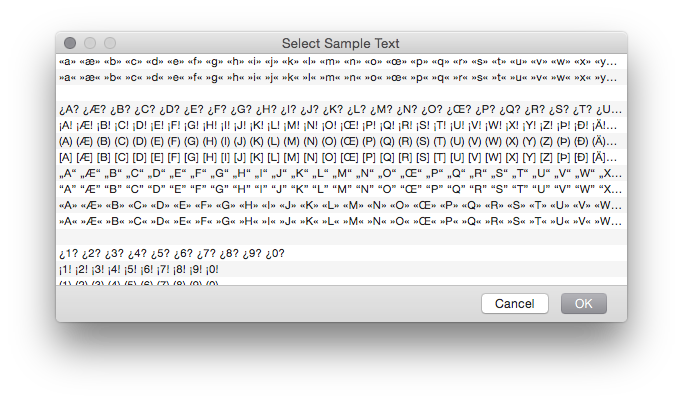
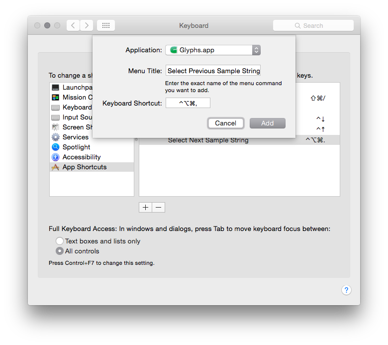

原文: [Edit view](https://glyphsapp.com/learn/edit-view)
# 編集ビュー

チュートリアル

執筆者: Rainer Erich Scheichelbauer

[ en ](https://glyphsapp.com/learn/edit-view) [ fr ](https://glyphsapp.com/fr/learn/edit-view) [ zh ](https://glyphsapp.com/zh/learn/edit-view)

2022年8月1日更新（初版公開：2015年3月26日）

編集ビューは、Glyphsでデザインする際の主要な作業場所です。ここでは、簡単に操作するための便利なテクニックをいくつか紹介します。

編集ビューは、フォントを編集・テストするためにテキストを入力できる場所です。編集ビューにアクセスするには、フォントビューでグリフをダブルクリックするか、「表示 > タブを開く」（Cmd-T）でタブを開きます。選択したグリフが編集ビューで開かれ、テキストツール（T）がアクティブになります。

 अब、好きなテキストを入力し、入力したグリフのいずれかを編集できます。これがソフトウェアの主要な機能の一つです。単語の文脈で編集することです。なぜなら、フォントを作成するとき、私たちはただ美しい文字のグループを作りたいのではなく、むしろ[マシュー・カーターを言い換えれば](https://www.goodreads.com/quotes/489324-type-is-a-beautiful-group-of-letters-not-a-group)、美しい文字のグループを作りたいからです。

## グリフ編集に切り替える

グリフのアウトラインを実際に編集するには、それをダブルクリックすると、グリフがベクター編集の準備ができます。ツールバーの編集ツールまたは選択ツールをクリックすることでも同じことができます。

ツールのショートカット（例えば、スケールツールならS）を入力することはできません。なぜなら、それはツールに切り替えるのではなく、文字を入力してしまうからです。しかし、もしキーボードから手を離したくないなら、Escキーを押すだけで、現在のグリフ（カーソルの右側にあるもの）が編集可能になります。

> *プロのヒント：* 文字を2回入力し、そのうちの1つをダブルクリックすると、ベクターのすぐ隣で、リアルタイムで高解像度のプレビューが即座に得られます。

## グリフを切り替える

テキストモードでは、カーソルをその前に移動させ、キーボードのHomeキーとEndキーを押すことで、あるグリフから次のグリフへと素早く移動できます。MacBookのキーボードでは、Fnキーと左右の矢印キーを押すことで、グリフセットを進んだり戻ったりできます。

> *プロのヒント：* Shiftキーを押しながらだと、進むのは現在フォントタブに表示されているグリフセット内に留まります。ですから、もし基本的なASCII文字だけを切り替えたいなら、フォントタブで「言語 > ラテン文字 > 基本」を選択し、編集タブに戻り、Shiftキーを押しながらグリフを切り替えます。

## サンプル文字列

そしてもちろん、「Glyphs > 環境設定 > サンプル文字列」で独自のサンプルテキストのセットを定義できます。これらはスペーシングやカーニングに最適です。「編集 > サンプルテキストを選択」（Cmd-Opt-F）を選ぶことで、これらの文字列を順に見ていくことができます。

一部の人々は、「編集 > その他 > 次のサンプル文字列を選択」および「前のサンプル文字列を選択」で次のサンプルテキストに進むことを好みます。そのためのショートカットが欲しいですか？「システム環境設定 > キーボード > ショートカット > アプリケーションショートカット」で定義できます。

---
サンプルフォント：[PRAKASHAN ITALIC](http://www.alessiamazzarella.com/#/prakashan/)、ALESSIA MAZZARELLA氏提供。

更新履歴 2022-08-01: タイトル、関連記事、軽微なフォーマットを更新。

## 関連記事

[すべてのチュートリアルを見る →](https://glyphsapp.com/learn)

*   ### [フォントにグリフを追加する](adding-glyphs-to-your-font.md)

    チュートリアル

    [ 言語 ](https://glyphsapp.com/learn?q=languages)

*   ### [きれいなパスを描く](drawing-good-paths.md)

    チュートリアル