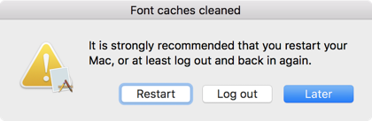

原文: [Eliminating font cache problems](https://glyphsapp.com/learn/eliminating-font-cache-problems)
# フォントキャッシュの問題を解消する

チュートリアル

[ トラブルシューティング ](https://glyphsapp.com/learn?q=troubleshooting)

執筆者: Rainer Erich Scheichelbauer

[ en ](https://glyphsapp.com/learn/eliminating-font-cache-problems) [ fr ](https://glyphsapp.com/fr/learn/eliminating-font-cache-problems) [ zh ](https://glyphsapp.com/zh/learn/eliminating-font-cache-problems)

2025年6月7日更新（初版公開：2013年5月24日）

Font Bookでフォントを再インストールすると、フォントキャッシュの問題が発生することがあります。ここでは、それを回避する方法を紹介します。

もしあなたのフォントを現実の状況でテストしたいと思い、Adobeアプリを考えているなら、[Adobe Fontsフォルダを使用する](testing-your-fonts-in-adobe-apps.md)ことで、最初からキャッシュの問題を避けることができます。おめでとうございます。これ以上読む必要はありません、これで完了です！

Affinity Publisherのユーザーも同様です。書き出しフォルダを`~/Library/Application Support/Affinity Publisher 2/AffinityFonts`に設定すれば、問題ありません。

## macOSアプリでのテスト

しかし、TextEditやWordのようなアプリケーションでフォントをテストすることにしたと仮定しましょう。そこで、Appleの[Font Book](https://en.wikipedia.org/wiki/Font_Book)アプリで開くか、サードパーティのフォントマネージャを使用するか、あるいは単にフォントファイルを`~/Library/Fonts/`にドラッグして、システムにインストールします。

まあ、それはすべきではありません。

なぜだめなのでしょうか？なぜなら、以前にインストールされたものと同じ名前のフォントをインストールすると、フォントキャッシュが深刻な問題を引き起こす可能性があるからです。[キャッシュ](<http://en.wikipedia.org/wiki/Cache_\(computing\)>)とは、以前に計算されたデータのコレクションです。コンピュータは元の情報を毎回再処理する必要がないため、これによりコンピュータの速度が向上します。同様に、フォントキャッシュは、Macがフォントを画面に表示するために計算しなければならなかったすべてのものがすでに完了しているため、インストールされたフォントの使用を高速化できます。

### まだ？
Appleは長年にわたりキャッシュの扱いを徐々に改善してきました。もしあなたがmacOS 15以降を実行しているなら、それを無視して、好きなだけフォントを再インストールできるかもしれません。[フォーラム](https://forum.glyphsapp.com/)で、最新のmacOSでまだフォントキャッシュの問題に遭遇しているかどうかをお知らせください。

しかし、もちろん、元のフォントが変更され、フォントキャッシュがそれを知らない場合、そこに保存されているデータは古く、ほとんどの場合間違っています。典型的な症状は次のとおりです。

*   フォントメニューにあなたのフォントがもはや表示されない
*   グリフが全く表示されない
*   フォントで行った変更が画面に表示されない
*   グリフが画面上で乱れてめちゃくちゃに表示される
*   ある文字をタイプすると、別の文字が表示される
*   段落が正しく再フローしない
*   フォントが印刷されない、または間違った文字や乱れた文字が印刷される

あるいは、他のどんなフォントの奇妙な現象でも、です。

## キャッシュのクリーニング

もしこれがあなたに起こったら、Font Bookまたは使用しているサードパーティのユーティリティからフォントを削除してください。重要：単に無効にするのではなく、削除してください。その後、2つの選択肢があります。

### 最初の防御策：Shiftキーを押しながら再起動する

**Macを再起動する際に、Shiftキーを押し続けます**。画面に「セーフモード」と表示されるまで押し続けます。Shiftキーを押しながら起動すると、Macはキャッシュを削除して再構築するはずです。その中にはフォントキャッシュも含まれます。ログイン画面が表示されたら、**ユーザーにログイン**し、**再度再起動**します。今度はShiftキーなしでです。

重要：2回の再起動は不可欠です。なぜなら、最初の再起動（Shiftキーあり）が諸悪の根源であるフォントキャッシュを削除するからです。しかし、[セーフモード](https://support.apple.com/en-us/HT201262)で起動しているため、一部のカーネル機能拡張はロードされず、Macは通常よりもパフォーマンスが低く、キビキビしていないように見えるかもしれません。したがって、2回目の再起動（Shiftキーなし）でMacは再び正常に起動します。

Macはしばらくの間少し忙しいかもしれませんので、数分間、HDとCPUの活動が活発になるかもしれません。それは大丈夫です、なぜならキャッシュを再構築しているからです。

### Apple Type Serverにデータベースをクリーンアップさせる

もしこれが助けにならない場合、あるいは単に2回の再起動を避けたい場合は、Terminal.app（`/Applications/Utilities/`にあります）を開き、以下のコマンドを入力（またはコピー＆ペースト）してください。もし手で入力する場合、各行はReturnキーを押して終了させる必要があります。もしペーストする場合、3行目の入力を確定するためにReturnキーを押す必要があるかもしれません。最初のコード行はパスワードを尋ねてきます。*注意、パスワードの長さをしめす「パスワードの弾丸」（•••）は表示されません。それでも入力し、Returnキーを押して確定してください。*

```
sudo atsutil databases -remove
atsutil server -shutdown
atsutil server -ping
```
そして今、*Macを再起動してください*。いえ、本当に、左上隅のAppleメニューを開き、「再起動」を選んでください。再起動なしで済むとは思わないでください。さもないと問題は再発します。そして、あなたは本当にそれを望んでいないでしょう？OK、*Macを再起動してください*。

## AppleScriptによるキャッシュのクリーニング

Macをお使いなので、これらのコマンドをAppleScriptに入れて、スクリプトメニューで便利に利用できるようにすることができます。そうすれば、ターミナルの呪文を覚えたり、このブログ投稿を再び探したりする必要はありません。

OK、やってみましょう。Finderで、「移動 > ユーティリティ」（Cmd-Shift-U）を選び、「スクリプトエディタ」というアプリをダブルクリックします。


「ファイル > 新規」（Cmd-N）で新しいスクリプトを作成し、このコードを新しいウィンドウにコピー＆ペーストします。
```applescript
try
    do shell script "sudo atsutil databases -remove" with administrator privileges
on error errMsg number errNum
    display dialog "Font cache error " & errNum & ": " & errMsg
end try
do shell script "atsutil server -shutdown"
do shell script "atsutil server -ping"
set buttonAnswer to text of button returned of (display dialog "It is strongly recommended that you restart your Mac, or at least log out and back in again." with title "Font caches cleaned" with icon caution buttons {"Restart", "Log out", "Later"} default button 3)
if buttonAnswer is "Log out" then
    tell application "System Events" to log out
else if buttonAnswer is "Restart" then
    tell application "System Events" to restart
end if
```
ハンマーのアイコンのボタン（「スクリプトをコンパイル」）をクリックして、コードを確認します。コードは今、シンタックスカラーリングされているはずです。


スクリプトをユーザースクリプトフォルダに保存します。そのためには、「ファイル > 移動…」を選び、表示されるダイアログでCmd-Shift-Gを押して「フォルダへ移動」ダイアログを表示させます。ここに、この行をコピー＆ペーストします。
```
~/Library/Scripts/
```
そうすると、おそらくこんな感じになるでしょう。


「移動」を押すと、「移動先」ダイアログにユーザースクリプトフォルダが表示されます。ここにスクリプトを移動させたいので、安全に「移動」を押すことができます。

意味のある名前にリネームするのを忘れないでください。「ファイル > 名前の変更…」を選び、`Clean Font Caches.scpt`のような名前にします。それが済んだら、スクリプトメニューをオンにして、必要なときにいつでもAppleScriptに簡単にアクセスできるようにします。そのためには、「スクリプトエディタ > 環境設定」（Cmd-カンマ）で環境設定にアクセスし、「一般」タブに進み、「メニューバーにスクリプトメニューを表示」の隣のチェックボックスがオンになっていることを確認します。


画面の右上隅に、Macは一連のメニューバー項目を表示します。そのうちの一つがスクリプトメニューです。これにより、特別なフォルダに保存されたAppleScriptを実行できます。その一つが`~/Library/Scripts/`です。したがって、それをクリックすると、先ほど保存したAppleScriptが表示されるはずです。


さて、あなたは、

1.  **フォントをシステムから削除する**、例えばFont Bookで。
2.  **スクリプトを実行して**（AppleScriptメニュー経由で）フォントキャッシュをクリーンアップする。
3.  **Macを再起動する**（スクリプトには、すぐに再起動するオプションがあります）。



4.  **フォントの新しいバージョンをインストール**し、問題なく使用を開始する。

## 回避策：キャッシュの問題を避ける

キャッシュの問題をそもそも*避ける*ための簡単な方法がいくつかあります。

1.  まず、冒頭で述べたように、特定のDTPアプリでフォントをテストできます。これらのアプリは、継続的に監視している特別なフォントフォルダを提供しています。例えば、Affinity Publisher 2を実行している場合は、書き出しフォルダを`~/Library/Application Support/Affinity Publisher 2/AffinityFonts`に設定します。あるいは、[Adobeアプリでフォントをテストしたい](testing-your-fonts-in-adobe-apps.md)場合は、特別な*Fonts*フォルダがあります。これらのフォルダに保存されたフォントは、それぞれのアプリですぐに有効になり、最も重要なことに、キャッシュされません。

2.  第二に、もし本当にシステムでフォントをテストする必要があるなら、フォントをインストールするたびに*ファミリー名*を変更します。名前に数字や文字を追加できます。フォントキャッシュはフォント名にリンクされているため、異なる名前のフォントを新しくインストールしても、以前のインストールと競合しません。唯一の欠点は、数回繰り返すと、フォントメニューが扱いにくいほど散らかってしまうことです。回避策：下のNico Hagenburger氏のスクリプトソリューションを参照してください。


3.  第三に、そしておそらく何よりも良いのは、私たちがまさにその目的のために作成した小さなツール[TextPreview](https://glyphsapp.com/tools/textpreview)のような、専門のアプリを使用することです。これは、新しいフォントが追加されたフォルダを監視し、それらをインストールすることなくアプリで利用可能にできます。本格的な大量のテキストテストには、link: /tools/fontgoggles text: FontGoggles)や[FontProofer](https://fontproofer.com/)のような専門のテストソフトウェアを検討してください。


4.  TextEditやPagesのようなMacアプリでのテストに最適です。「ファイル > 書き出し」ダイアログの「テストインストール」オプションを使用します。これにより、フォントの書き出しが直接メモリに書き込まれ、そこでは簡単に上書きもできます。フォントがフォントメニューに表示されるためには、アプリを再起動する必要があるかもしれません。フォントは、ログアウトするかMacを再起動するまで利用可能です。
5.  最もタフなあなたには、Windowsでテストしてください。Windowsにはフォントキャッシュの問題は一度もありませんでした。フォントを再インストールするだけで、すべてのアプリで更新されます。しかし、Windowsには他の多くの問題がありました。[しかし、それらを回避する方法があります。](make-your-font-work-in-windows.md)
6.  注意して：macOSをバージョン15以降にアップデートしてください。Appleは最新のOSバージョンでフォントキャッシュの扱いを大幅に改善したようです。時々アプリを再起動する必要があるかもしれませんが、単に（新しいバージョンの）フォントを再インストールするだけで、ほとんどの場合問題なく機能するようです。

## 賢い回避策：ユニークなファイル名で書き出す

Nico Hagenburger氏は、macOSのフォントキャッシュがフォントファイルの*ファイル名*に依存することを発見しました。したがって、書き出すOTFが毎回異なるファイル名を持ち、以前のすべてのバージョンを削除することを確認すれば、問題ないはずです。Nico氏は親切にも、まさにそれを行うPythonスクリプト[Export and Install](glyphsapp3://showplugin/Export%20and%20Install%20Script%20by%20Nico%20Hagenburger)を作成してくれました。リンクをクリックして、プラグインマネージャでスクリプトを開きます。

### 注意
この回避策の信頼性は、macOS 10.13以降でのみ確認できました。古いmacOSバージョンのユーザーからは、矛盾した報告を受けています。時には機能し、時には機能しませんでした。時々、フォントを使用したアプリを再起動する必要がありました。

もっと知りたいなら、NicoがそれについてMediumの記事を書いています。[Install Fonts Without Caching Issues on MacOS](https://medium.com/@hagenburger/solved-install-fonts-without-caching-issues-on-macos-770bfff9c406)。

---
サンプルフォント：ALENA BY ROLAND STIEGER

更新履歴 2013-07-04: フォントを削除する場所を明確化。

更新履歴 2014-06-16: 不要なユーザー固有のキャッシュクリーニングを削除、sudo行がすべてのキャッシュを削除するため。

更新履歴 2016-01-02: Adobe Fonts Folderチュートリアルへのリンクを追加。

更新履歴 2016-02-19: Glyphs 2のスクリーンショットを更新。

更新履歴 2017-06-04: より明確にするために部分的に書き直し、新しいスクリーンショット、TextPreviewを追加。

更新履歴 2018-06-06: 「回避策：ファイル名を変更して書き出す」を追加。（Nico氏に感謝！）

更新履歴 2019-02-25: 「Shiftキーを押しながら再起動」を追加。

更新履歴 2020-08-23: Nico Hagenburger氏のMedium記事へのリンクを追加。

更新履歴 2022-08-03: タイトルとリンク、関連記事、軽微な（再）フォーマットを更新。

更新履歴 2025-06-07: Affinityフォントフォルダを追加（Carolina氏に感謝）、フォントキャッシュと回避策に関する注記を追加、macOS 15以降に関する注記を含む。

## 関連記事

[すべてのチュートリアルを見る →](https://glyphsapp.com/learn)

*   ### [Adobeアプリでフォントをテストする](testing-your-fonts-in-adobe-apps.md)

チュートリアル