原文: [Extending Glyphs](https://glyphsapp.com/learn/extending-glyphs)
# Glyphsを拡張する

チュートリアル

[ トラブルシューティング ](https://glyphsapp.com/learn?q=troubleshooting)

執筆者: Rainer Erich Scheichelbauer

[ en ](https://glyphsapp.com/learn/extending-glyphs) [ es ](https://glyphsapp.com/es/learn/extending-glyphs) [ fr ](https://glyphsapp.com/fr/learn/extending-glyphs) [ zh ](https://glyphsapp.com/zh/learn/extending-glyphs)

2025年1月2日更新（初版公開：2020年9月29日）

Glyphsの拡張は簡単です。既存のスクリプトやプラグインの領域に足を踏み入れるか、あるいは独自の拡張機能を作成することもできます。あなたが思うより簡単です。

基本的に、Glyphsの機能を拡張するには2つの方法があります。スクリプトとプラグインです。どちらも*モジュール*と呼ばれる追加のインストールが必要になることがあります。ですから、まずはGlyphsを準備して、好きなように拡張できるようにしましょう。心配しないでください、この部分は一度行うだけで済みます。

## モジュール

「ウインドウ > プラグインマネージャ」に進み、プラグインマネージャを開きます。ここが、すべての拡張機能をインストールおよびアンインストールする場所です。多くのスクリプトには*Vanilla*が必要で、ほぼすべての拡張機能には*Python 3*が必要です。したがって、これらはぜひインストールすることをお勧めします。

### 注意
~~「Apple silicon」M1チップを搭載した新しいMacをお持ちの場合、現在プラグインマネージャ内で提供されているPythonモジュールを使用することはできません。現在対応中ですが、回避策が見つかるまでは、ご自身でPythonとPyObjCをインストールしてください。方法は？このチュートリアルの最後にある「独自のPython 3のインストール」を参照してください。~~

**更新：** これはGlyphs 3.0.2以降ではもはや必要ありません。アプリを更新し、プラグインマネージャで提供されているPythonを再度試してみてください。

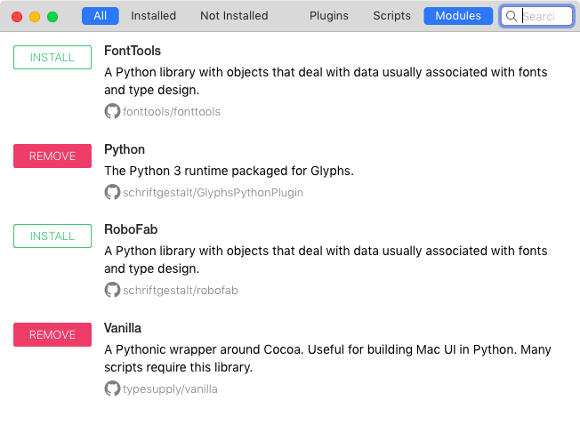

ついでに、そこにリストされている他のモジュールもインストールできます。確かに、FontToolsやRoboFabを必要とする拡張機能は比較的少ないですが、それらを持っていても害はなく、やってしまえば終わりです。

### 環境設定

「Glyphs > 環境設定 > アドオン」で、「Pythonバージョン」ポップアップメニューに進み、「(Glyphs)」とマークされたPythonバージョンが選択されていることを確認してください。

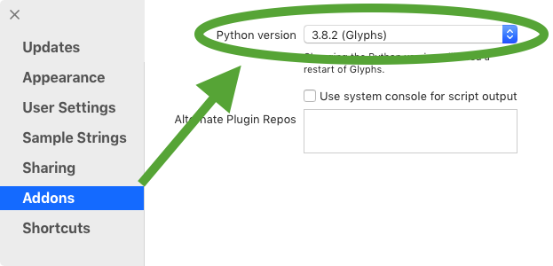

いずれにせよ、これらのモジュールのいずれかをインストールし、環境設定を設定した後は、すべての変更が有効になるように、**アプリを再起動する**ことをお勧めします。

## スクリプト

通常、スクリプトは、特定の1つか2つのことをうまくこなす、Pythonコードの小さな断片です。これらは、macOSライブラリの奥深くにある、GlyphsのApplication Supportフォルダ内の「Scripts」という特別なフォルダに、`.py`という拡張子を持つテキストファイルとして保存されます。Glyphsは、「スクリプト」メニューにすべてのスクリプトをロードして表示します。そのメニューのサブメニューは、「Scripts」フォルダのサブフォルダ構造を複製します。

スクリプトは、素早く簡単に書くことができます。もしこれまでコーディングをしたことがなくても、基本的なスクリプト作成は1日の午後で学べます。インストールも簡単で、アプリの再起動は必要ありません。

### スクリプトのインストール：プラグインマネージャ

スクリプトをインストールするには2つの方法があります。1つ目は、「ウインドウ > プラグインマネージャ > スクリプト」からワンクリックで簡単にインストールする方法です。利用可能なスクリプトコレクションを閲覧し、欲しいものを選ぶだけです。

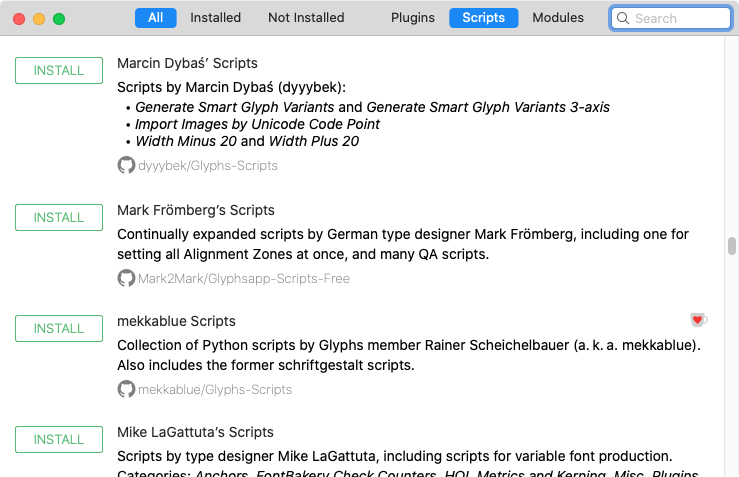

その後、Optionキーを押しながら「スクリプト > スクリプトを再読み込み」（Cmd-Opt-Shift-Y）を選択することで、「スクリプト」メニューをリロードできます。すると、どうでしょう。次に「スクリプト」メニューを開くと、新しくインストールされたスクリプトコレクションがすでに利用可能になっています。

### ヒント
もし「スクリプト」メニューの一番下に「スクリプトを再読み込み」メニュー項目が表示されない場合は、Optionキーを押しながら試してください。そうすると、「スクリプトフォルダを開く」が「スクリプトを再読み込み」に変わるはずです。Optionキーは、CtrlキーとCmdキーの間にあり、時にはAltまたはOpt、あるいは⌥と表示されています。

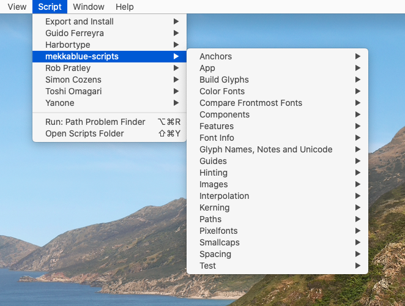

重要な点は、プラグインマネージャ経由でインストールされたスクリプトコレクション、モジュール、プラグインは、*自動的に*最新の状態に保たれるということです。Glyphsを起動するたびに、Macがインターネットに接続されていれば、最新バージョンがあるかどうかをチェックし、まだ更新していなければインストールを更新します。

### スクリプトの手動インストール

スクリプトをインストールする2番目の方法は、それらをScriptsフォルダに手動で配置することです。そのフォルダに最も手早くアクセスする方法は、お察しの通り、「スクリプト > スクリプトフォルダを開く」（Cmd-Shift-Y）を実行することです。スクリプトファイルはサブフォルダに整理でき、それらは「スクリプト」メニューにサブメニューとして表示されます。完了したら、再びOptionキーを押しながら「スクリプト > スクリプトを再読み込み」（Cmd-Opt-Shift-Y）を選ぶのを忘れないでください。

### プロのヒント
実際には、Glyphsは常に、*Scripts*フォルダの隣にある*Repositories*フォルダ内のgitリポジトリの最新バージョンを取得します。もしgitリポジトリをその*Repositories*フォルダにクローンし、次に*Scripts*フォルダにエイリアス（シンボリックリンク）を追加する方法を知っていれば、手動でインストールしたスクリプトもGlyphsに保持させることができます。

言うまでもなく、手動でインストールされたスクリプトは、自動的に最新の状態に保つことはできません。代わりに、自分で管理する必要があります。

### スクリプトの実行

スクリプトは、「スクリプト」メニューから選ぶだけで実行できます。もしスクリプトが何をするか不確かな場合は、メニュー項目にマウスを1秒ほど置くと、スクリプトが何をするかを説明するツールチップが表示されます。

### プロのヒント
スクリプトをより速く実行する方法：キーボードショートカットで「ヘルプ」メニューを開き（「システム環境設定 > キーボード > ショートカット > アプリケーション > Glyphs」で設定）、スクリプト名の各単語の最初の文字をタイプし始めます。例えば、「pa pro fi」で*Path Problem Finder*のようにです。それぞれのメニュー項目がメニュー内で直接ハイライトされ、Returnキーを押すだけでスクリプトを実行できます。

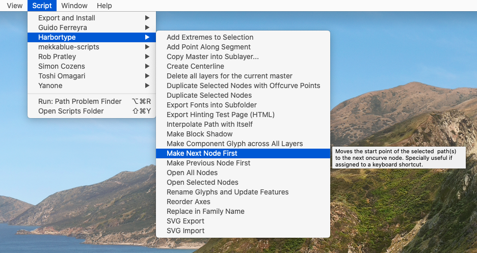

もしスクリプトが何もしていないように見えても、スクリプトがエラーに遭遇した可能性があります。その場合は、マクロウィンドウ（「ウインドウ > マクロパネル」、Cmd-Opt-M）でエラーメッセージを確認してください。何が問題だったか手がかりが得られるかもしれません。もし次のようなメッセージが見つかったら、
```
ModuleNotFoundError: No module named 'vanilla'
```
…スクリプトは*モジュール*と呼ばれるものを必要としています。上の「モジュール」のセクションを参照してください。

## プラグイン

プラグインを使えば、プログラマーはGlyphsのエコシステムにより深く入り込み、より高度なことを行うことができます。ほとんどのプラグインは「フィルタ」と「表示」に表示されますが、どのメニューにも表示される可能性があり、右のサイドバーにパレットとして表示されることさえあります。プラグインの作成は少し難しいですが、[それでも大したことはありません](plugins.md)。そしてスクリプトとは異なり、インストールや更新後に再起動が必要です。

### プラグインマネージャ経由でのプラグインのインストール

スクリプトと同様に、「ウインドウ > プラグインマネージャ」でワンクリックでプラグインをインストールできます。「プラグイン」セクションを選び、プラグインを閲覧し、「インストール」ボタンをクリックしてインストールします。あるいは、すでにインストールされている場合は、「削除」ボタンをクリックして、まあ、お察しの通り、それを削除します。これだけです。

### プラグインの手動インストール

Tim Ahrens氏の不可欠な[RMX Tools](https://remix-tools.com/)（別名：「Font Remix Tools」）、素晴らしい[LetterInk](https://www.lttrink.com)、またはあなたのデザインプロセスを記録するためのMakkuk氏の[LayerWhale](https://makkuk.com/layerwhale/)のような商用サードパーティプラグイン、あるいは[Mark Frömberg氏の多くのクールなプラグイン](https://markfromberg.com/projects/#tools)の一つ：それらは独自の説明書が付属しています。通常は、単にプラグインファイルをダブルクリックすれば、Glyphsがインストールするかどうか尋ねてきます。

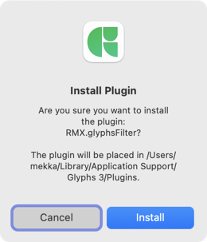

単にダイアログを確認して「インストール」を押すだけで、アプリを再起動すれば、プラグインがアクティブになり利用可能になります。「リソース」ページでサードパーティのプラグインのセレクションを見つけることができます。

## あなたの愛を示す

スクリプトやプラグインが好きですか？開発者にコーヒーを一杯おごってみてはいかがでしょうか？

プラグインマネージャにあるスクリプトとプラグインのほとんどは無料で利用できます。しかし、一部の開発者は、プラグインマネージャで最も人気のあるアイテムのURLの隣に寄付リンクを設けています。アイコンをクリックすると、彼らのマイクロペイメントページに移動します。

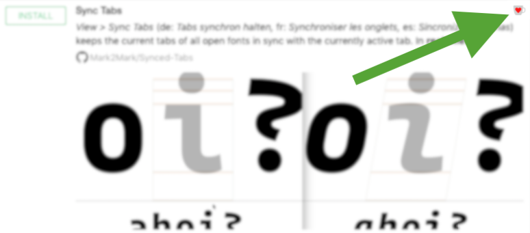

拡張機能があなたの生活をどれだけ良くしたかを考えて、感謝の気持ちを示してください。💝

## 高度なオプション

Glyphsの拡張体験をカスタマイズするには、特にファウンドリ固有のインストールを管理する必要がある場合に、より多くの方法があります。いずれにせよ、この章は特定の環境と高度なターミナル曲芸師専用です。したがって、以下があなたにとって意味をなさないなら、それはおそらくあなたには当てはまらないので、心配しないでください。

### 独自のPython 3のインストール

[Python.orgからのダウンロード](https://www.python.org/downloads/macos/)（Mac Universalインストーラーを探してください）で独自のPython 3をインストールするか、もしあなたがそのような人なら、[brew](https://brew.sh)で独自のPython 3インストールを構築できます。どちらの方法でも、Glyphs内で使用できます。単に、「Glyphs > 環境設定 > アドオン > Python」のポップアップメニューから、自家製のPythonを選んでください。

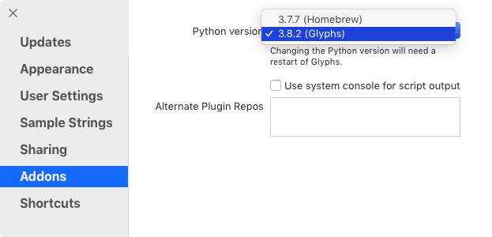

次に、Glyphsを再起動すれば、準備完了です。

待ってください、まだです。実はもう一つあります。もしプラグインマネージャで提供されているもの以外のPythonを使用する場合、`pyobjc`という追加のPythonモジュールが不足しています。ターミナルでこれを試してみてください。

### ヒント
PyObjCのバージョン8.5に問題があったことを覚えているかもしれません。そのため、以前は`pip3 install pyobjc==8.4`で8.4にダウングレードすることをお勧めしていました。しかし、これはもはや必要ありません。 अब、安全に最新バージョンのPyObjCを使用できます。

```
pip3 install pyobjc
```
もし`pip3`の使用でエラーが出るなら、Pythonのパッケージマネージャ「pip」が正しくインストールされているか確認する必要があるかもしれません。Python 3がインストールされていると仮定して、これを試してみてください。
```
python3 -m ensurepip --upgrade
```
そして、pipがインストールされたら、時々これを実行して最新の状態に保つことができます。
```
pip3 install --upgrade pip
```
もしそれでもうまくいかず、pipを諦めかけているなら、待ってください、もう一つのトリックがあります。コマンドラインで`pip3`を`python3 -m pip`に置き換えることができます。したがって、上の行は次のようになります。
```
python3 -m pip install pyobjc
```
あなたの道のりがどうであれ、これでうまくいくはずです。もう一度アプリを再起動する必要があるかもしれません。いくつかの追加の高度なインストールについては、下記を参照してください。

### 独自のプラグインマネージャのコンテンツ

あなたのファウンドリが、社内の全員が利用できるようにする必要があるカスタムスクリプト、プラグイン、および/またはモジュールを持っているとします。2つの選択肢があります。1つは、それらをオープンソースライセンスの下でGitHubに公開し、私たちに知らせることです。そうすれば、私たちはそれらをGitHubの[Glyphs Packagesリポジトリ](https://github.com/schriftgestalt/glyphs-packages/tree/glyphs3)に追加し、数分後にはプラグインマネージャの一部になります。

あるいは、特にそれが公開できない、または極秘のコードである場合は、独自のパッケージリストを設定できます！簡単です。「Glyphs > 環境設定 > アドオン」に行き、「代替プラグインリポジトリ」フィールドに、同僚に配布したいスクリプト、プラグイン、モジュールを含む、公開アクセス可能な`.plist`ファイルのURLを追加します。

必要なのは、その`.plist`ファイルを設定し、維持することだけです。そして、同僚に「Glyphs > 環境設定 > アドオン」のそのフィールドにそのURLを入力してもらいます。それだけです。次回彼らが「ウインドウ > プラグインマネージャ」を開くと、追加の拡張機能にアクセスできるようになります。

### 独自のスクリプトとプラグイン

あなたのプロジェクトに合うスクリプトやプラグインが見つかりませんでしたか？自分で書いてみてはいかがでしょうか？

もしこれまでコーディングをしたことがないなら、Pythonは素晴らしい最初のスクリプト言語だと言わせてください。1日か2日の午後で始めることができます。冗談ではありません。[スクリプトでGlyphsを動かすチュートリアル](recommendation:learn-python.md)を読んでみてください。最初の3つは非常に簡単です。その後は、確かに少し難しくなります。しかし、知っていますか、他の人も以前にやってのけています。そして、一度コツをつかめば、やめられなくなります。

準備ができたら、[プラグインの作成](recommendation:plugins.md)に進むことができます。それはあなたをさらに一歩進め、あなたはもっと力強いと感じるでしょう。

### 高度なフォント制作

もし何をしているか分かっているなら、pip経由でさらにいくつかのモジュールをインストールできます。ここでは、コピー＆ペーストが便利なように、独自のPythonインストールでそれらが必要だと仮定して、すべてのフォント制作関連のインストールを一度に紹介します。もしすべてのモジュールをインストールし、プラグインマネージャで提供されているPythonを使用しているなら、`afdko`を除いて、すでにすべて持っています。
```
pip3 install fonttools --upgrade
pip3 install brotli --upgrade
pip3 install zopfli --upgrade
pip3 install fontbakery --upgrade
pip3 install afdko --upgrade
pip3 install cocoa-vanilla --upgrade
```
あるいは、直接`pip3`を使えない（または使いたくない）場合は、`python3`ルート（上記参照）を試してみてください。
```
python3 -m pip install fonttools --upgrade
python3 -m pip install brotli --upgrade
python3 -m pip install zopfli --upgrade
python3 -m pip install fontbakery --upgrade
python3 -m pip install afdko --upgrade
python3 -m pip install cocoa-vanilla
```
これにより、あなたのPythonインストールに最新バージョンの[fontTools](https://fonttools.readthedocs.io/en/latest/)、[Font Bakery](https://font-bakery.readthedocs.io/en/stable)、[AFDKO](http://adobe-type-tools.github.io/afdko/)、そしてWebフォント（WOFFおよびWOFF2）書き出し用の[brotli](https://github.com/google/brotli)および[zopfli](https://github.com/google/zopfli)圧縮が提供されます。そして、Tal Leming氏の[vanilla](https://github.com/robotools/vanilla)も、念のため。

## トラブルシューティング

時々、モジュールのインストールがうまくいかず、拡張機能が機能しないことがあります。もしそうなったら、試せるいくつかのことがあります。

### プラグインマネージャのエラー：「Failed to get HEAD (unborn)」

最も可能性の高い原因：遅いインターネット接続でPythonモジュールをインストールしようとしている。

1.  「スクリプト > スクリプトフォルダを開く」
2.  Finderで、*Repositories*サブフォルダに移動する
3.  失敗したインストールに関連するフォルダを削除する。（もしPythonモジュールなら、「GlyphsPythonPlugin」フォルダを削除する。）
4.  Glyphsに戻り、「ウインドウ > プラグインマネージャ」で再度インストールを試みる。

### Pythonがインストールされない

何度も試しましたが、「Glyphs > 環境設定 > アドオン > Pythonバージョン」で、Glyphsが提供するPythonを選択できません。もしかしたら、「ウインドウ > プラグインマネージャ > モジュール」ではPythonがインストール済みと表示されているかもしれません。何が起こっているのでしょうか？

おそらく、Pythonのダウンロードが計画通りに始まり、プラグインマネージャがそれをインストール済みとして登録したのでしょう。しかし、その後ダウンロードが壁にぶつかり、遅くなったり、中断されたりしたのです。その原因は、接続不良、タイムアウト、あるいはアプリを1秒早く再起動してしまったなど、何でもあり得ます。確実にインストールするための方法は次のとおりです。

1.  「スクリプト > スクリプトフォルダを開く」を実行して、GlyphsのApplication Supportフォルダにアクセスします。
2.  Finderで開いたフォルダで、「Repositories」→「GlyphsPythonPlugin」に移動し、続くステップの間、このフォルダを開いたままにします。
3.  Glyphsで、「ウインドウ > プラグインマネージャ > モジュール」に進み、「Python」モジュールを削除して再インストールします。
4.  少し待って（1分以上はかからないはずです）、ステップ2の「GlyphsPythonPlugin」フォルダを見てください。何も起こらなければ、ステップ3を繰り返してください。
5.  「GlyphsPythonPlugin」フォルダに以下の内容が表示されたら、アプリを再起動できます：*build.py、dist*（フォルダ）、*GlyphsPythonModul.py、Python.framework*（フォルダ）、*setup.py*。おおよそこのようになります。
    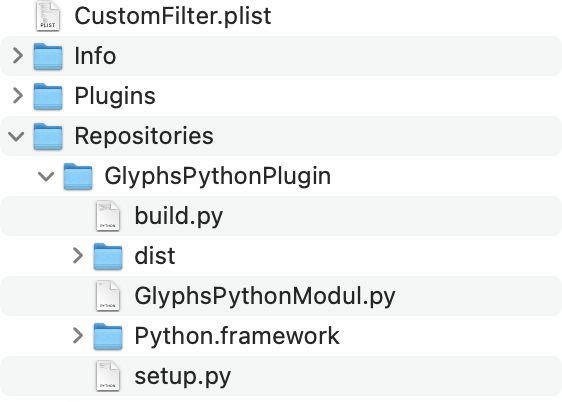
6.  अब、「Glyphs > 環境設定 > アドオン」に行き、「(Glyphs)」という単語を含む「Pythonバージョン」を選びます。（もし表示されない場合は、もう一度再起動する必要があるかもしれません。）
7.  Glyphsを再起動します。

### 「プラグインがクラッシュしました」エラー

Glyphsを再起動すると、「前回Glyphsを起動したとき、以下のプラグインがクラッシュしました」というエラーメッセージが表示されます。これに続いて、「プラグインを削除して再インストールしてください」というアドバイスと、ロードされなかったプラグインのリストが表示されます。

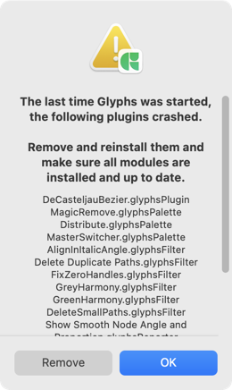

さて、ダイアログは選択肢を与えているように見せかけますが、実際には選択の余地はありません。「削除」ボタンは、実際にこれらのプラグインをインストールから削除し、「ウインドウ > プラグインマネージャ」でプラグインを閲覧・再インストールするのに時間を費やすことができます。「OK」を押すと、そのまま進めると思うかもしれませんが、実際にはプラグインは隔離され、本当に削除するまでロードされなくなります。

おそらくプラグインは正常で、実際にはモジュールの1つがロードされなかっただけなのに、可哀そうなプラグインが非難されている可能性が高いです。問題は、プラグインがその後永久に隔離されたままであることです。この問題を回避するために、「Glyphs > 設定 > アップデート」に進み、「デバッグモード」を有効にできます。

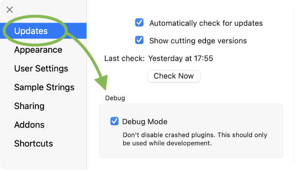

次に、アプリを再起動すると、プラグインが再びロードされるはずです。

このオプションが見えませんか？それなら、最新のGlyphsにアップデートすることを検討してください。もし古いバージョンで立ち往生しているなら、これを試してみてください。

1.  「ウインドウ > プラグインマネージャ」で、すべての「モジュール」を削除して再インストールします。1、2分待ってください。
2.  「ウインドウ > マクロパネル」で、すべてを選択し、以下のコードをペーストして、「実行」ボタンをクリックします。
    `Glyphs.defaults['DebugMode'] = 1`
3.  アプリを再起動します。

もし「マクロパネル」の下半分にエラーメッセージが表示された場合は、ステップ2と3を繰り返す必要があるかもしれません。「デバッグモード」が行うことは、プラグインのすべての隔離制限を無視し、何も起こらなかったかのようにすべてをロードすることです。

もしステップ2が全くうまくいかないなら、Terminal.appを開き、以下のコードをペーストしてください。
```
defaults write com.GeorgSeifert.Glyphs3 DebugMode 1
```
…そして、ReturnキーまたはEnterキーを押せば完了です。おおよそこのようになります。

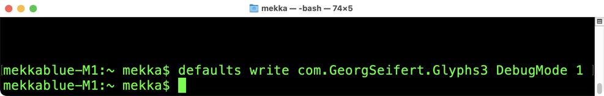

## 自動更新を無効にする

上で述べたように、プラグインマネージャ経由でインストールされたものはすべて、自動的に最新の状態に保たれます。それは、1日に1回、それぞれのレポジトリの内容を強制的にプルすることで行われます。まれに、拡張機能の自動更新を*望まない*場合は、秘密の設定で更新を無効にできます。「ウインドウ > マクロパネル」でこれをタイプし、「実行」ボタンをクリックします。
```
Glyphs.defaults["GSPluginManagerDisableAutomaticUpdates"] = True
```
これにはPythonモジュールがインストールされている必要があります。もし[mekkablue scripts](glyphsapp3://showplugin/mekkablue%20scripts)がすでにインストールされているなら、「Script > mekkablue > App > Sett Hidden App Preferences」を使用できます。

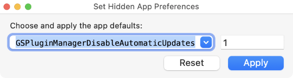

値`1`は`True`と同等です。もちろん、もし自動更新を再度有効にしたいなら、「リセット」ボタンをクリックするか、上記のコードスニペットを`False`または`0`を値として実行します。

本当に必要で、何をしているか分かっている場合にのみ、更新を無効にしてください。考えられるシナリオの一つは、プラグインやスクリプトのコードを変更していて、Glyphsがリポジトリのプルであなたの変更を上書きするのを防ぎたい場合です。

## 便利なリンク

GlyphsチームのメンバーであるFlorian Pircher氏は、彼のウェブサイトで[Glyphsプラグインのニュースフィード](https://florianpircher.com/glyphs/extensions-newsfeed/)を管理しています。これは、GitHub上のプラグインリポジトリのgitコミットを追跡します。Florianはまた、[スクリプトインデックス](https://florianpircher.com/glyphs/scripts-index/)も管理しており、そこではプラグインマネージャを通じて利用可能なすべてのスクリプトのタイトルとヘルプテキストを検索できます。

---

更新履歴 2020-10-20: 未完成の文を完成させました（Nathalieに感謝）。

更新履歴 2020-12-20: Python M1チップに関する注記を追加。

更新履歴 2021-01-15: その注記に更新を追加。

更新履歴 2022-02-10: トラブルシューティングの章を追加。

更新履歴 2022-07-10: PyObjC 8.4対8.5に関する注記を追加。

更新履歴 2022-08-01: 関連記事、軽微なフォーマット。

更新履歴 2022-08-04: pipコマンドのpyobjc引数を洗練。

更新履歴 2022-08-07: 軽微なヘッダーフォーマット、スクリーンショットを更新。

更新履歴 2023-06-06: 「便利なリンク」を追加。

更新履歴 2023-08-18: 「独自のPython 3のインストール」を書き直し、「高度なフォント制作」を追加。

更新履歴 2024-01-17: pip3インストールにvanillaを追加。

更新履歴 2025-01-02: `GSPluginManagerDisableAutomaticUpdates`に関する注記を追加、LTTR/INKリンクを更新、デバッグモードに関する環境設定。

## 関連記事

[すべてのチュートリアルを見る →](https://glyphsapp.com/learn)

*   ### [Glyphsのスクリプト、パート1](scripting-glyphs-part-1.md)

チュートリアル

[ スクリプト ](https://glyphsapp.com/learn?q=scripting)

*   ### [Glyphsのスクリプト、パート2](scripting-glyphs-part-2.md)

チュートリアル

[ スクリプト ](https://glyphsapp.com/learn?q=scripting)

*   ### [Glyphsのスクリプト、パート3](scripting-glyphs-part-3.md)

チュートリアル

[ スクリプト ](https://glyphsapp.com/learn?q=scripting)

*   ### [Glyphsのスクリプト、パート4](scripting-glyphs-part-4.md)

チュートリアル

[ スクリプト ](https://glyphsapp.com/learn?q=scripting)

*   ### [スクリプト：Python 3へのアップグレード](scripting-upgrading-to-python3.md)

チュートリアル

[ スクリプト ](https://glyphsapp.com/learn?q=scripting)