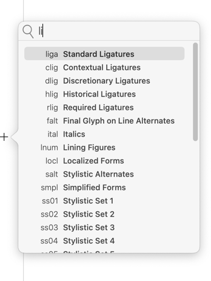
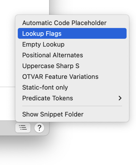

原文: [Features](https://glyphsapp.com/learn/features-part-1-simple-substitutions)
# フィーチャー、パート1：単純な置換

チュートリアル

[ OpenTypeフィーチャー ](https://glyphsapp.com/learn?q=opentype+features)

執筆者: Rainer Erich Scheichelbauer

[ en ](https://glyphsapp.com/learn/features-part-1-simple-substitutions) [ fr ](https://glyphsapp.com/fr/learn/features-part-1-simple-substitutions) [ zh ](https://glyphsapp.com/zh/learn/features-part-1-simple-substitutions)

2022年7月23日更新（初版公開：2012年7月7日）

現代のフォントには欠かせないもので、Glyphsはそれらの作成を助けます。OpenTypeフィーチャーに関するこの最初のパートでは、非常に基本的なことと、Glyphsがあなたのために自動化できることについて探求します。

## フィーチャーの機能

OpenTypeフィーチャーは2つのことができます。グリフの*置換*とグリフの*再配置*です。このチュートリアルでは、置換に焦点を当てます。私が*グリフ*と言ったことに注意してください、*文字*ではありません。その違いは何かと尋ねるかもしれませんが、要するに、文字は入力するもの、グリフは目にするものです。書体デザイナーが書体デザイナーであるのは、文字を描くときに新しい*グリフ*を作成するからです。キーボードに新しいキーを追加してUnicodeコンソーシアムに新しいエンコーディングを提出することで、新しい文字を作成することはほとんどありません。そして、もちろん、OpenTypeフィーチャーはユーザーが入力したテキスト、つまり*文字*を魔法のように変えることはできません。しかし、フィーチャーが*できる*ことは、そのテキストがどのように表示されるかを変えること、つまり、あなたのフォントにある*グリフ*から選ぶことです。

合字は古典的な例です。2つ以上のグリフのシーケンスを1つのグリフに置き換えます。フォントマニアはこれを「多対一」または「合字置換」と呼びます。ユーザーが文字を入力すると、対応するUnicode値を持つグリフが画面に表示されます。もしそれらのグリフが特定の事前定義されたシーケンスに一致すれば、合字フィーチャーがそれらを合字グリフに交換します。

## 合字の追加

もちろん、合字を追加するのは、その単一の合字グリフが個々のグリフよりも見栄えが良いか、機能が良い場合に限られます。悪くて読みにくい合字でフォントを悪くしないでください。しかし、このチュートリアルの目的のため、2つのfに続くkのシーケンスが、私たちのフォントで合字でより良く表現できると仮定しましょう。

フォントにグリフを追加する方法は[たくさんあります](adding-glyphs-to-your-font.md)が、「グリフ > グリフを追加…」（Cmd-Shift-G）で素早く合字グリフを作成できます。表示されるダイアログに、私たちの合字のグリフ名`f_f_k`を入力します。


はい、合字の命名規則は、個々のグリフ名をアンダースコアで接続することです。詳細は後述します。しかし、それができたら、OKボタンを押すと、新しい合字グリフがフォントに表示され、個々のグリフ`f`、`f`、`k`のコンポーネントで事前に埋められます。


「グリフ > コンポーネントを分解」（Ctrl-Cmd-D）でそれらを分解し、3つの文字がきれいに合字になったバージョンになるまでパスをいじります。合字は、最も外側の文字のカーニンググループを継承し、さらに良いことに、メトリクスキーも継承することに気づくでしょう。つまり、「グリフ > メトリクスを更新」（Ctrl-Cmd-M）で、元の最初と最後の文字とサイドベアリングを同期させることができます。

### プロのヒント
もし複数のフォントマスターがあるなら、Optionキーを追加することで、ほとんどのコマンドをすべてのマスターに適用できます。Ctrl-Opt-Cmd-Dはすべてのマスターでコンポーネントを分解し、Ctrl-Opt-Cmdはすべてのマスターでメトリクスを更新します。


ねえ、何をお望みですか、これは私の最初のフォントで、私はそれを誇りに思っています。

いずれにせよ、これでフォントに合字グリフができました。しかし、キーボードに合字キーはないので、入力できません。言い換えれば、「ffk」という文字はありません。したがって、私たちの美しい合字グリフにアクセスするためには、ユーザーは適切なOpenTypeフィーチャーを有効にする必要があります。これは、ユーザーに渡す前に、そのOpenTypeフィーチャーをフォントに*追加*する必要があることも意味します。

## フィーチャーの追加

「ファイル > フォント情報」（Cmd-I）を選択し、「フィーチャー」タブに切り替えます。次のようになっているはずです。


左側には、プレフィックス、フィーチャー、クラスの概要が表示されます。右側には、2つのテキストフィールドがあります。上のテキストフィールドはフィーチャーコード用、下のテキストフィールドはメモや、一時的に無効にして後で再利用したいコードの断片を保存するためのものです。上のテキストフィールドの上には、フィーチャーを自動的に生成するためのチェックボックスと、フィーチャーを無効にするためのチェックボックスの2つがあります。

さて、今必要なのはフィーチャーです。「FEATURES」という単語の隣にあるプラスボタンをクリックし、表示される検索可能なリストメニューから合字フィーチャーの1つを選びます。ヒントヒント、「li…」と入力し始めてください。



「標準の合字」のフィーチャータグである`liga`を選びましょう。[Microsoftによると](http://www.microsoft.com/typography/otspec/features_ko.htm#liga)、このフィーチャーは「タイポグラフィ目的で好まれる単一のグリフでグリフのシーケンスを置き換える」とのことです。良さそうですね。

### 旧バージョン
Glyphs 2以前では、ウィンドウの下部にあるプラスボタンメニューから「フィーチャー」を選択する必要がありました。`xxxx`という名前のフィーチャーが表示されます。その後、それを[定義済みのフィーチャータグ名](https://docs.microsoft.com/en-us/typography/opentype/spec/featurelist)のいずれか、この場合は「標準の合字」の`liga`にリネームします。

もしすべて正しく行っていれば、フォント情報ウィンドウは今、このようになります。


## コードの追加

フィーチャーを作成するとき、実際には*ルール*のセットを組み立てます。ルールは、何が何に置換されるかを定義します。そのようなルールは次のようになります。
```
sub f f k by f_f_k;
```
これを一つずつ見ていきましょう。

1.  まず、キーワード**sub**があります。これは、私たちが扱っているルールの種類を定義します。上記で述べたように、これは置換または位置調整ルールのいずれかです。そして、`sub`は明らかに置換ルールを示します。
2.  第二に、置換があるので、**置換されるグリフ**のシーケンスが必要です。この場合、3つのグリフがあります。`f`、それに続く別の`f`、そして`k`です。これらは実際のグリフ名であることに注意してください。したがって、äは`adieresis`、ñは`ntilde`などと綴られます。
3.  もしシーケンスの後にキーワード**by**を置かなければ、何が何に置き換えられるのか明確ではありません。私たちのコード行が`sub f f k f_f_k`だったと想像してください。それなら、`f f`がシーケンス`k f_f_k`に置き換えられる可能性もあります。
4.  `by`の後で、**代わりに何が来るか**をフォントに伝えます。合字の命名規則を思い出してください。個々の文字の名前をアンダースコアで繋ぎます。この場合、3つの文字f、f、kが1つにまとめられているので、`f_f_k`と呼ばれます。
5.  そして、非常に重要なことですが、各ルールはその末尾に**セミコロン**を取ります。簡単だと言うかもしれませんが、これが実際にはエラーの第一の原因です。ですから、もしフィーチャーが機能しないなら、セミコロンを忘れている可能性があります。

`liga`フィーチャーにルールを入力すると、Glyphsはオートコンプリートを提供してくれます。


もしフォントに非常に長いグリフ名がある場合、これは命の恩人になるかもしれません。また、Glyphsが名前とキーワードを目立たせるために、シンタックスハイライトで役立とうとしているのがわかるでしょう。そして、もしその名前が本当にここで意図したグリフを参照しているかどうかわからないなら、グリフ名をOptionキーを押しながらクリックして、さっと覗くことができます。


もちろん、複数のルールを続けて置くこともできます。このように。
```
sub f k by f_k;
sub f h by f_h;
sub f i by fi;
sub f l by fl;
sub f f k by f_f_k;
sub f f h by f_f_h;
sub f f i by f_f_i;
sub f f l by f_f_l;
```
fiとflの名前が命名規則に従っていないことにお気づきかもしれません。それは、これら2つのグリフ名が命名規則ができる前から存在していたため、今では修正するのが遅すぎるからです。歴史的にそうなってしまったのです。気にしないでください。また、もしそうしたいなら、すべてのルールを1行に書くこともできます。セミコロンを忘れなければ、すべてうまくいきます。

## コードのテストと修正

すべて正しくできたか見たいですか？ウィンドウの下部にある「コンパイル」ボタンを押すと、Glyphsはあなたのコードをメインウィンドウの編集タブのいずれかで利用可能にします。そこで、左下の「フィーチャー」ポップアップメニューからフィーチャーを選択して、フィーチャーをテストできます。


…そして、テキストツール（T）でタイピングを始めます。


良いですね、合字が機能します！

もちろん、フィーチャーにルールを入れるのは、フォントに参照されるすべてのグリフが実際に存在する場合のみにすべきです。なぜなら、そうでなければ、Glyphsは大きな声で、しかし正当に文句を言うからです。


もしこうなったら、警告記号が修正が必要な箇所を教えてくれます。警告をクリックすると、より詳細な説明が表示され、何が起こっているのかより良く理解できます。時々、警告にはツールの記号が表示されます。その場合、それをクリックすると、問題に対する修正案も提示されます。


この場合、「修正」ボタンをクリックすると、Glyphsが欠けているセミコロンを挿入してくれます。他の修正には、タイプミスしたキーワードの訂正やグリフ名の提案などが含まれます。もし修正することが多すぎて、エラーがフォントの書き出しを妨げているが、簡単なテスト書き出しが必要な場合は、上部の「アクティブ」チェックボックスで壊れたフィーチャーを無効にできます。

もし問題のOpenTypeフィーチャーが何のためにあるのか不確かな場合は、右上の「仕様」ボタンをクリックすると、Microsoftのページにあるフィーチャーの公式定義に移動します。もちろん、そのためにはインターネット接続が必要です。

## 自動コード

そして今、非常にがっかりされるかもしれませんが、私たちはこれらすべてを無駄にやったことを認めなければなりません。なぜなら、前に述べた命名規則に従えば、Glyphsは合字フィーチャーを自動的に作成できるからです。丸い矢印のボタンで自動生成をトリガーできます。

ほとんどの合字ルールは`dlig`（任意の合字）に投げ込まれますが、合字グリフの名前に`.liga`という接尾辞を追加すれば、`liga`に強制的に入れることができます。例えば、`f_f_k.liga`のようにです。しかし、Glyphsは`liga`と`dlig`だけでなく、もっと多くのものを自動化できます。「更新」ボタンをクリックすると、自動化されたフィーチャーがたくさんできるかもしれません。


認識されるグリフ名と名前の接尾辞のリストは、[Glyphsハンドブック](/learn/)（PDFマニュアル）の付録にあります。

## ルックアップフラグ

コードを自動化したとき、Glyphsがあなたの置換ルールの前にこの行を付け加えたことにお気づきかもしれません。
```
lookupflag IgnoreMarks;
```
あるいは、
```
lookupflag IgnoreMarks RightToLeft;
```
[仕様によると](https://docs.microsoft.com/en-us/typography/opentype/spec/chapter2#lookup-table)、ルックアップフラグは、「テキスト処理クライアントに、グリフを置換または配置する際に使用する特定の処理オプションを示す」ものです。それが何を意味するにせよ。

要するに、ルックアップフラグは、置換するグリフのシーケンスを探しに行くときに、特定の条件に注意を払うようフィーチャーに伝えます。`IgnoreMarks`ルックアップフラグがアクティブな場合、グリフはグリフのシーケンス内の結合アクセントをスキップします。したがって、もしこれがあれば、
```
lookupflag IgnoreMarks;
sub f f k by f_f_k.liga;
```
…すると、ユーザーがf-acutecomb-f-kとタイプしても、合字は機能します。なぜなら、そのシーケンスで結合マークを無視すると、ルックアップフラグがまさにそれを規定しているので、再び私たちの魔法のグリフシーケンス、f-f-kが得られるからです。

そして、ルックアップフラグ`RightToLeft`は、後続のルールがRTL書字方向にのみ適用されることを意味します。これは、もちろん、アラビア語やヘブライ語のテキストに望ましいものです。

利用可能なルックアップフラグはもっとありますが、これら2つが最も頻繁で重要なものとして私には思えるので、ここで止めます。もう一つだけ小さなトリックがあります。もし私のように、ルックアップフラグの正確なコードを覚えられないなら、「フィーチャー」ウィンドウの右下隅にある「スニペット」ボタンをクリックしてください。



そして、それはあなたのフィーチャーコードに、すべての可能なルックアップフラグを宣言する行を挿入します。もちろん、正しく綴られています。その後、必要ないものを削除するだけで、それで終わりです。良い一日を。

## その他の置換

単純な置換の領域では、多対一だけではありません。他にも種類があります。OpenType仕様では、それらを「GSUBルックアップタイプ」として知っています。GSUBは**g**lyph **sub**stitution（グリフ置換）の略で、ルックアップは同じ種類のルールの集まりです。合字置換（多対一）は、GSUBルックアップタイプ4です。

1つのグリフを他の1つのグリフに置き換える場合（一対一）、それは「単一置換」と呼ばれ、GSUBルックアップタイプ1としても知られています。この典型的な例は、`frac`（分数）フィーチャーに通常現れるこのルールです。
```
sub slash by fraction;
```
もし1つのグリフを複数のグリフに置き換えるなら（一対多）、仕様ではそれらを「複数置換」またはGSUBルックアップタイプ2と呼びます。複数置換は、南アジアおよび東南アジアの文字体系で頻繁に使用されます。ラテン文字では、`ccmp`（グリフの合成と分解）で古い合字のエンコーディングを修正するために使用されることがあります。有名な例をいくつか挙げます。
```
sub fi by f i;
sub fl by f l;
sub napostrophe by apostrophemod n;
sub Dz by D z;
sub Dzcaron by D zcaron;
sub dz by d z;
sub dzcaron by d zcaron;
sub DZ by D Z;
sub DZcaron by D Zcaron;
```
そして、「代替置換」またはGSUBルックアップタイプ3があります。これは一対一置換の特殊なケースですが、グリフの範囲から選ぶことができます。ランダムに？いいえ、必ずしもそうではありません。それはテキスト処理アプリの実装に依存します。良い例は、`ornm`（装飾）フィーチャーで、ユーザーに`bullet`グリフの置換として、一連の装飾グリフへのアクセスを提供します。
```
sub bullet from [a.ornm b.ornm c.ornm d.ornm e.ornm];
```
`by`の代わりに、このルールは`from`を使用することに注意してください。そして、`from`キーワードの後、グリフ名は角括弧`[]`で囲まれています。角括弧内にリストされたグリフ名は、「グリフのクラス」と呼ばれます。一度に多数のグリフを参照する必要があるときはいつでも、クラスが必要です。クラスは「ここにあるこれらのグリフのいずれか」と読むことができます。クラスについては、今後のフィーチャーチュートリアルで詳しく説明します。

## リソース

OK、フィーチャーコードに夢中になりましたか？[Adobeの完全な技術仕様](https://adobe-type-tools.github.io/afdko/OpenTypeFeatureFileSpecification.html)に深く入り込むことができます。そして、完全を期すために、[Microsoftのフィーチャータグリスト](https://docs.microsoft.com/en-us/typography/opentype/spec/featurelist)をここに繰り返します。

あるいは、もしそれがマニアックすぎるなら、素晴らしいTal Leming氏が[OpenType Cookbook](http://opentypecookbook.com/)を管理しています。Simon Cozens氏は、簡潔な[Introduction to OpenType Programming](https://simoncozens.github.io/fonts-and-layout/features.html)を書いています。また、Martin Wenzel氏とChristoph Köberlin氏による、良い[Introduction to OpenType Features](https://ilovetypography.com/OpenType/opentype-features.html)もあります。

次に、良い質問は、フォントのOTフィーチャーにどのようにアクセスし、使用するかです。なぜなら、あなたのフォントのユーザーがそれについて尋ねてくるからです。Google Fontsは、[ウェブ上でOpenTypeフィーチャーを実装する](https://fonts.google.com/knowledge/using_type/implementing_open_type_features_on_the_web)方法について良い概要を提供しています。また、多くのウェブサイトには、フィーチャーを選択して適用する方法に関するヘルプページがあります。例えば、Creative Marketによる[Using Fonts with Special Features](https://support.creativemarket.com/hc/en-us/articles/360037478813-Using-Fonts-with-Special-Features-OpenType-)は、AdobeアプリとMicrosoft Wordでの使用法を説明しています。あるいは、FontSpringの[How to Access Opentype Features in InDesign](https://www.fontspring.com/support/how-to-access-opentype-features-in-indesign)、[Illustrator](https://www.fontspring.com/support/using-desktop-fonts/how-to-access-opentype-features-in-illustrator)、または[Photoshop](https://www.fontspring.com/support/using-desktop-fonts/

---

更新履歴 2015-07-02: Glyphs 2向けに更新。

更新履歴 2018-07-24: リンクを更新し、「リソース」にリンクを追加。

更新履歴 2019-03-28: Adobeの仕様書へのリンクを更新。

更新履歴 2019-04-09: Glyphsマニュアルへのリンクを更新。

更新履歴 2022-07-21: タイトル、関連記事、軽微なフォーマットを更新。

更新履歴 2022-07-23: リンクを更新。「合字の追加」、「コードのテストと修正」、「ルックアップフラグ」、「その他の置換」を追加。見出し名を変更し、部分的に書き直し、Glyphs 3向けに更新。how-to-access-opentype-features-in-photoshop)などです。

## 関連記事

[すべてのチュートリアルを見る →](https://glyphsapp.com/learn)

*   ### [合字](ligatures.md)

チュートリアル

[ OpenTypeフィーチャー ](https://glyphsapp.com/learn?q=opentype+features)

*   ### [フィーチャー、パート2：文脈に応じた置換](features-part-2-contextual-substitutions.md)

チュートリアル

[ OpenTypeフィーチャー ](https://glyphsapp.com/learn?q=opentype+features)

*   ### [フィーチャー、パート3：高度な文脈依存の異体字](features-part-3-advanced-contextual-alternates.md)

チュートリアル

[ OpenTypeフィーチャー ](https://glyphsapp.com/learn?q=opentype+features)

*   ### [フィーチャー、パート4：位置による異体字](features-part-4-positional-alternates.md)

チュートリアル

[ OpenTypeフィーチャー ](https://glyphsapp.com/learn?q=opentype+features)