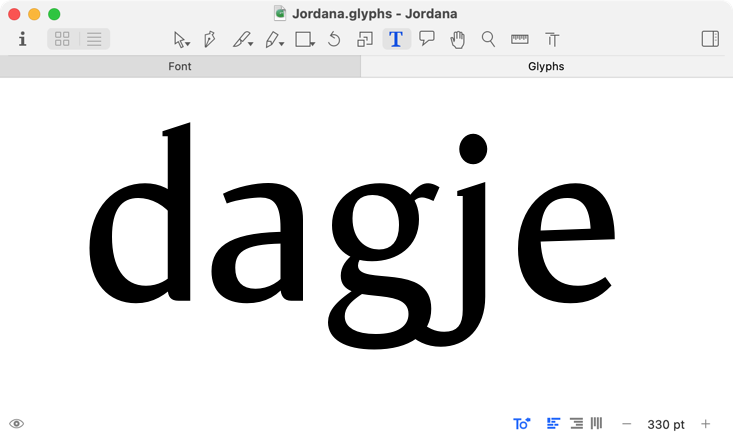
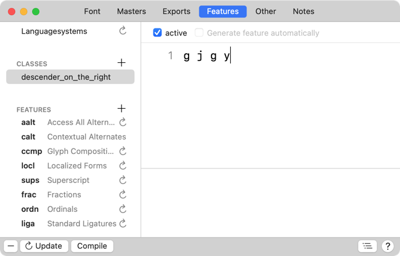

原文: [Features](https://glyphsapp.com/learn/features-part-2-contextual-substitutions)
# フィーチャー、パート2：文脈依存の置換

チュートリアル

[ OpenTypeフィーチャー ](https://glyphsapp.com/learn?q=opentype+features)

執筆者: Rainer Erich Scheichelbauer

[ en ](https://glyphsapp.com/learn/features-part-2-contextual-substitutions) [ fr ](https://glyphsapp.com/fr/learn/features-part-2-contextual-substitutions) [ zh ](https://glyphsapp.com/zh/learn/features-part-2-contextual-substitutions)

2022年7月25日更新（初版公開：2012年7月21日）

特定の状況下でのみグリフを置換したいですか？文脈依存の置換がその方法です。

InDesignで[文脈依存の代替字形を有効にする方法](http://www.adobe.com/type/opentype/#apps)はご存知だと思います。そして、[一部のフォントがそれで本当にクールなことをしている](http://ilovetypography.com/2011/04/01/engaging-contextuality/)という話も聞いたことがあるかもしれません。ここでは、それをあなたのフォントに組み込む方法を紹介します。

私たちが注目すべきフィーチャーは、`calt`（[Contextual Alternates](http://www.microsoft.com/typography/otspec/features_ae.htm#calt)）と`clig`（[Contextual Ligatures](http://www.microsoft.com/typography/otspec/features_ae.htm#clig)）です。どちらもInDesignで「文脈依存の代替字形」を選択すると有効になります。

## 代替グリフを作成する

さて、あなたのフォントの1つを取り上げ、それに代替グリフを入れてみましょう。この代替は、特定の状況下でのみ標準のグリフを置き換えるべきです。例として、jを選びます。



この場合、gの後にjが続くなら、jは少しターミナルを引っ込めるべきだと思います。そこで、「グリフ > グリフを追加…」を選んで新しいグリフを生成します。表示されるテキストフィールドに`j=j.alt`と入力し、「生成」をクリックします。これにより、jをコンポーネントとして持つ`j.alt`という名前のグリフが作成されます。その後、コンテキストメニューからコンポーネントを分解し、ターミナルを調整できます。

Cmd-Fを押して、表示される検索フィールドにj.altと入力することで、代替のjを「タイプ」できます。


## 文脈依存の置換を記述する

さて、`calt`フィーチャーを書く必要があります。Cmd-Iを押してフォント情報を表示させ、フィーチャータブに切り替えます。プラスボタンをクリックし続け、新しいフィーチャーを作成します。新しいフィーチャーを作成した後、それを呼び出す準備ができています。それを`calt`と名付けます。上のテキストフィールドに、次のように入力します。

```
sub g j' by j.alt;
```

もしすべて正しく行っていれば、フィーチャーウィンドウは次のようになります。


`sub`と`by`の間には、フィーチャーが探している完全な文脈があります。この場合、それは`g`に続く`j`です。しかし、私たちは`g`ではなく`j`だけを置き換えたいのです。そこで、`j`を単一の引用符でマークします：**j'**。キーワード`by`の後の代替`j.alt`は、マークされた文字、この場合は`j`にのみ適用されます。

試してみて、うまくいくか見てみましょう。「コンパイル」ボタンを押し、フォントウィンドウで新しい編集タブを開き、左下のフィーチャーメニューから`calt`を選んで、「gj」を含む単語を入力します。

## 置換ルールにクラスを追加する

`g`の前に`j`が来るときに、その尾を引っ込めるのは良い考えです。しかし、`q`、`y`、または別の`j`のような、ディセンダーを持つ他の文字が前にあるときもそうすべきです。もちろん、`calt`フィーチャーに次のように書くことも*できます*。
```
sub g j' by j.alt;
sub q j' by j.alt;
sub y j' by j.alt;
sub j j' by j.alt;
```
しかし、これは面倒です。特に後で何かを変更する必要がある場合はそうです。同じことをするもっと効率的な方法はこちらです。
```
sub [g j q y] j' by j.alt;
```
角括弧はクラスを作成します。これは「これらの文字のいずれか」と言う方法です。したがって、このフィーチャーは、「g、j、q、yのいずれかの文字が前にある場合、jをj.altに置き換える」と言っています。

置換にもクラスを使用できます。必要なのは、両方のクラスが同じサイズで、グリフが同じ順序であることを確認することだけです。もし`jcircumflex.alt`もあるとすると、フィーチャーは次のようになります。
```
sub [g j q y] [j jcircumflex]' by [j.alt jcircumflex.alt];
```
もしクラスをもっと頻繁に必要とするなら、クラス全体を何度も再入力したくないでしょう。特に、クラスに1つのグリフが欠けていることがわかり、すべてを変更する必要がある場合はなおさらです。それなら、プラスボタンをクリックしてクラス定義を作成する方が良い考えです。`xxxx`をダブルクリックして名前を変更できます。フィーチャータグをリネームするのと同じようにです。クラス名はA-Zまたはa-zの文字で始まり、アンダースコア、ピリオド、数字も含むことができます。名前は4文字より長くても構いません。このクラスには`descender_on_the_right`という名前を選び、`g j q y`を追加します。



さて、`calt`フィーチャーを次のように書き換えることができます。
```
sub @descender_on_the_right [j jcircumflex]' by [j.alt jcircumflex.alt];
```
アットマーク（@）は、フィーチャーコードでクラス名を示します。もしそれを忘れると、Glyphsはそれをグリフ名と見なし、エラーメッセージを出力します。

だいたいこんなところです。いや、実はまだ終わりではありません。[次のパート、フィーチャー、パート3：文脈依存の置換](features-part-3-advanced-contextual-alternates.md)では、もう少し深く掘り下げて、高度な文脈依存のフィーチャーをコーディングします。

---
サンプルフォント：Jordana by Stella Chupik

更新履歴 2015-06-22: Glyphs 2向けに更新。

更新履歴 2019-03-29: *Font*メニューを削除、現在は*Glyph*メニューです。誤字を修正。

更新履歴 2022-07-21: タイトル、関連記事、軽微なフォーマットを更新。

## 関連記事

[すべてのチュートリアルを見る →](https://glyphsapp.com/learn)

*   ### [フィーチャー、パート1：単純な置換](features-part-1-simple-substitutions.md)

チュートリアル

[ OpenTypeフィーチャー ](https://glyphsapp.com/learn?q=opentype+features)

*   ### [フィーチャー、パート3：高度な文脈依存の異体字](features-part-3-advanced-contextual-alternates.md)

チュートリアル

[ OpenTypeフィーチャー ](https://glyphsapp.com/learn?q=opentype+features)

*   ### [フィーチャー、パート4：位置による異体字](features-part-4-positional-alternates.md)

チュートリアル

[ OpenTypeフィーチャー ](https://glyphsapp.com/learn?q=opentype+features)