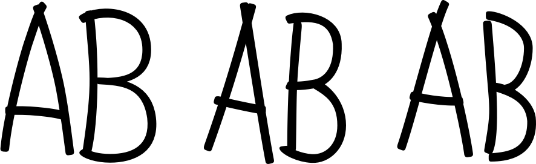
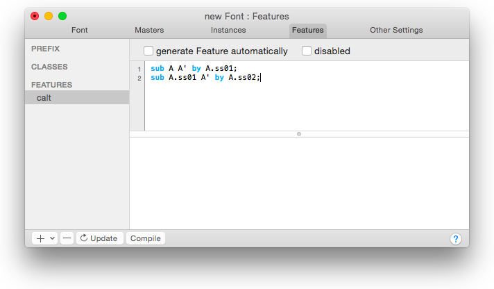
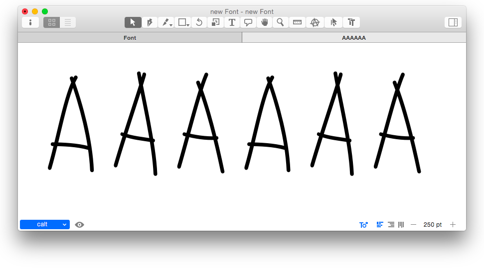
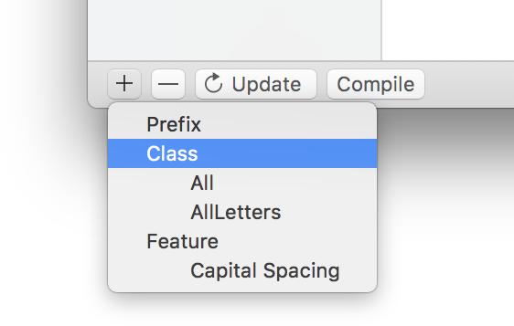
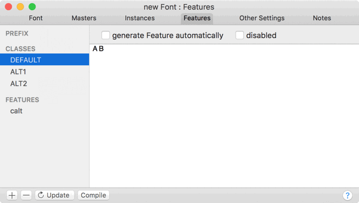
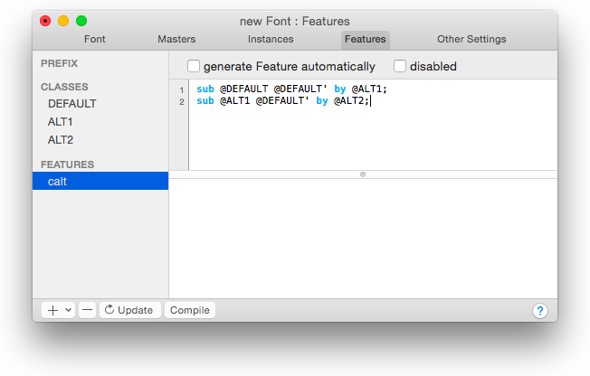
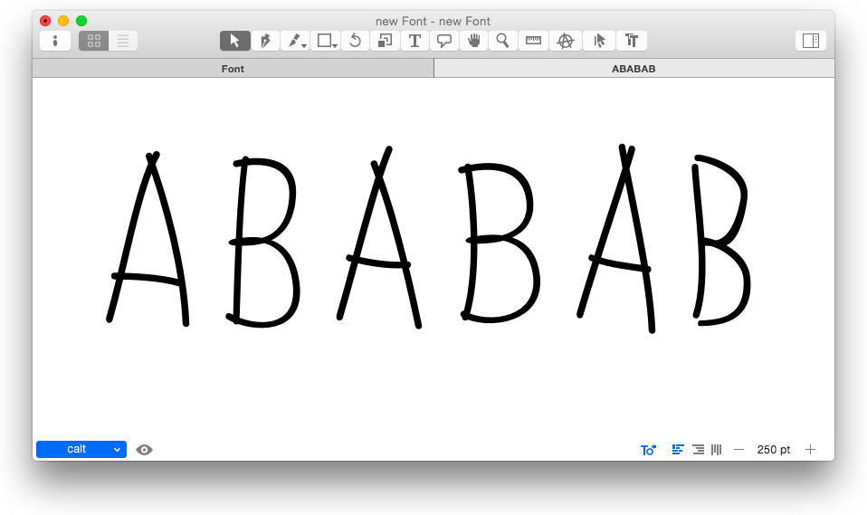
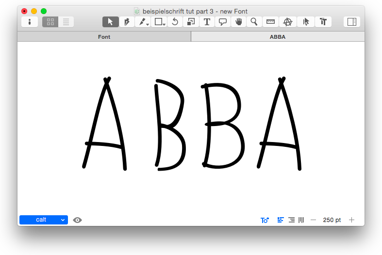
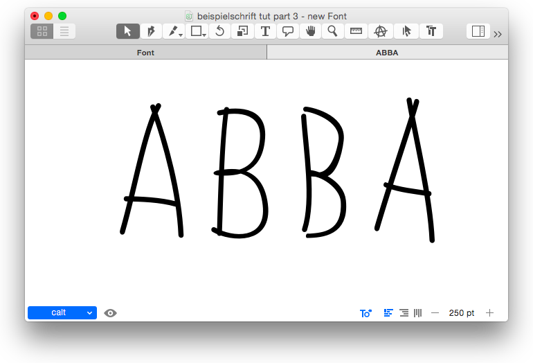

原文: [Features](https://glyphsapp.com/learn/features-part-3-advanced-contextual-alternates)
# フィーチャー、パート3：高度な文脈依存の代替字形

チュートリアル

[ OpenTypeフィーチャー ](https://glyphsapp.com/learn?q=opentype+features)

執筆者: Rainer Erich Scheichelbauer

[ en ](https://glyphsapp.com/learn/features-part-3-advanced-contextual-alternates) [ fr ](https://glyphsapp.com/fr/learn/features-part-3-advanced-contextual-alternates) [ zh ](https://glyphsapp.com/zh/learn/features-part-3-advanced-contextual-alternates)

2022年7月21日更新（初版公開：2012年8月9日）

各文字にたくさんの代替字形を持つ手書きフォントをデザインしていますか？このチュートリアルはあなたのためのものです。スウェーデンのポップミュージックがお好きだといいのですが。

手書きを模倣したフォントで、例えば「eel」や「better」のように同じ文字を二重に入力したときに、2つの全く同じグリフが表示されることほど退屈なことはありません。あなたのフォントが、各グリフの複数の代替字形を循環するようにするのはどうでしょうか？

## グリフの代替字形

さて、まずは代替グリフを設定する必要があります。良い方法は、スタイルセットの代替字形を使うことです。例えば、`A`というグリフがあり、それに`A.ss01`と`A.ss02`を追加するとします。同様に、`B`には`B.ss01`と`B.ss02`を追加します。これを、循環させたいすべてのグリフ、おそらくはすべてのグリフに対して行います。そして、もし望むなら、`.ss20`まで上げることもできます。簡単にするために、ここでは各グリフに2つの代替字形に留めておきます。あなたのAとBのバリエーションは次のようになります。



左側のABはデフォルトのグリフです。それに続く2つのバリエーションのセットが、`.ss01`と`.ss02`のグリフです。

明らかに、すべての代替グリフを実際に循環させるには、文脈依存の置換が必要です。ユーザーが各文字を個別に選択し、グリフパレットから代替を選ぶことを期待するのは現実的ではありません。

## 文脈依存のサイクリング

簡単な設定から始めて、1つの文字、例えばAだけを循環させてみましょう。「ファイル > フォント情報」（Cmd-I）の「フィーチャー」タブをクリックし、`calt`フィーチャーを追加して、次のように入力します。
```
sub A A' by A.ss01;
sub A.ss01 A' by A.ss02;
```
終わったら、こんな感じになるでしょう。



さて、左下のコンパイルボタンを押します。次に、メインウィンドウに戻り、新しい編集タブ（Cmd-T）を開き、左下のポップアップメニューで`calt`フィーチャーを有効にして、Aを数回タイプします。はい、うまくいきました。



さて、このフィーチャーは何をするのでしょうか？最初の行は、2つ連続した`A`グリフを探します。もしそのようなペアを見つけたら、2番目の`A`を`A.ss01`に置き換えます。 अब、3番目の`A`を入力すると、3番目のAは再びデフォルトの`A`となり、`A.ss01 A`というシーケンスができます。はは、捕まえた。ここで2番目の行が効いてきます。それはこの組み合わせを見つけ、`A.ss01`の後の`A`を`A.ss02`に置き換えます。クールですね。

## グリフクラスを通じたサイクリング

さて、個々のグリフだけでなく、アルファベット全体を循環できたらクールだと思いませんか？心配いりません、古き良き友よ、偶然にも、それこそが*グリフクラス*の役割なのです。「ファイル > フォント情報 > フィーチャー」に戻り、追加したいクラスごとに、左下のプラスボタンをクリックし、表示されるメニューから「クラス」を選びます。



…次に、`xxxx`をクラス名に置き換え、コード（スペースで区切られたグリフ名）を追加します。以下の3つのクラスに対してこれを行います。

*   `DEFAULT`、ここには例えば`A B C D E F`などと書きます。
*   `ALT1`、ここには`.ss01`で終わるフォントのすべてのグリフをリストアップします：`A.ss01 B.ss01 C.ss01`など。
*   `ALT2`、ここには`.ss02`で終わるフォントのすべてのグリフをリストアップします：`A.ss02 B.ss02 C.ss02`など。

さて、私たちのクラスは次のようになります。



もちろん、フォントに実際にそれらのグリフがある限り、好きなだけグリフ名を追加できます。ただし、3つのクラスすべてを同期させておく必要があります。これは、3つのクラスすべてが同じ*数*のグリフを持ち、また同じ*順序*のグリフを持つべきであることを意味します。さもないと、AがBなどに変わってしまい、それはおそらく望まないでしょう。

さて、`calt`フィーチャーを次のように変更できます。
```
sub @DEFAULT @DEFAULT' by @ALT1;
sub @ALT1 @DEFAULT' by @ALT2;
```
覚えておいてください、アットマーク（@）はフィーチャーコードでグリフクラスを表します。ここでやっていることは、上と全く同じですが、単一のグリフを扱うのではなく、完全なクラスで作業している点が異なります。終わったら、フィーチャータブは次のようになっているはずです。



コンパイルボタンを押して、タ・タ・タ・タァァァ、うまくいくか見てみましょう。編集タブで、`calt`フィーチャーが有効になっていることを確認し、「BABABA」など、クラスにある文字で思いつくものをタイプします。



最高だ、ハイタッチ！

## よりランダム性を高めるための2つの別々のサイクル

もう終わりですか？いいえ、もちろん違います。まだ深刻な問題が1つあります。1-2-3-1-2-3-などと進むサイクルがあり、それは各文字で同じです。さて、私たちが一番好きなバンドの名前を書きたいと想像してください。



2番目のBまでは、すべて順調です。最初のAは`DEFAULT`グループから、最初のBは`ALT1`から、2番目のBは`ALT2`からです。しかし、ここでがっかりです。2番目のAは再び`DEFAULT`から取られます。ですから、私たちの循環機能は*連続した*文字にはうまく機能しますが、サイクルの長さと同じくらい離れた2つの文字では問題にぶつかります。この場合、私たちは文字の3つのバージョンを循環させています。これは、3文字ごとに同じクラスから取られることを意味します。くそー。

幸いなことに、2つの異なるサイクルを持つことができます。論理的な区別は、子音用の1つのサイクルと母音用のもう1つのサイクルです。以下のコードサンプルでは、通常、2つ以上の母音が連続することはなく、3つ以上の子音が連続することはないと仮定しています。（実際には、ほとんどの言語でそれ以上が必要になりますが、これを読んだ後、必要に応じてサイズを伸ばすことができるはずです。）

では、子音のクラスをこのように設定しましょう。
```
Con0: B C D
Con1: B.ss01 C.ss01 D.ss01
Con2: B.ss02 C.ss02 D.ss02

Voc0: A E I
Voc1: A.ss01 E.ss01 I.ss01
Voc2: A.ss02 E.ss02 I.ss02

Etc: space comma
```
繰り返しになりますが、あなたのニーズに合わせて拡張してください。`Etc`クラスは、スペースと、代替字形を描くのが面倒だったすべての文字のためのものです。明らかに、これら2つのクラスグループにグリフを任意の方法で分けることができます。両方に（できれば稀な）グリフを入れることさえできます。そして、句読点や数字のようなものをどこに配置するかはあなた次第です。yやwのような一部の文字は、ある言語では子音と見なされ、他の言語では母音と見なされることを考慮すると良いでしょう。また、ダイアクリティカルマークを忘れないでください。

さて、始めましょう。子音から始めます。すでに持っているものを再現しましょう。
```
# consonant-consonant
sub @Con0 @Con0' by @Con1;
sub @Con1 @Con0' by @Con2;
```
ここには新しいことは何もありません。子音が続くところはどこでも、3つのバリアントすべてを循環します。しかし、もし別の文字で中断されたらどうなるでしょうか？

以下のフラグメントを追加する必要があります。これは上記と同じですが、1つの「中断する」文字を考慮しようとします。
```
# consonant-other-consonant
sub @Con0 [@Voc0 @Voc1 @Voc2 @Etc] @Con0' by @Con1;
sub @Con1 [@Voc0 @Voc1 @Voc2 @Etc] @Con0' by @Con2;
```
角括弧を使うと、その場でクラスを作成できます。つまり、最初に定義する必要はありません。この場合、すべての母音クラスとエトセトラクラスを取り、それらを1つにまとめます。かなり簡単そうですね。*2つ*の中断する文字で同じことをするには、次を追加します。
```
# consonant-other-other-consonant
sub @Con0 [@Voc0 @Voc1 @Voc2 @Etc] [@Voc0 @Voc1 @Voc2 @Etc] @Con0' by @Con1;
sub @Con1 [@Voc0 @Voc1 @Voc2 @Etc] [@Voc0 @Voc1 @Voc2 @Etc] @Con0' by @Con2;
```
さて、母音でも同じことをする必要があります。手短に言うと、これが母音のコードです。
```
# vowel-vowel
sub @Voc0 @Voc0' by @Voc1;
sub @Voc1 @Voc0' by @Voc2;

# vowel-other-vowel
sub @Voc0 [@Con0 @Con1 @Con2 @Etc] @Voc0' by @Voc1;
sub @Voc1 [@Con0 @Con1 @Con2 @Etc] @Voc0' by @Voc2;

# vowel-other-other-vowel
sub @Voc0 [@Con0 @Con1 @Con2 @Etc] [@Con0 @Con1 @Con2 @Etc] @Voc0' by @Voc1;
sub @Voc1 [@Con0 @Con1 @Con2 @Etc] [@Con0 @Con1 @Con2 @Etc] @Voc0' by @Voc2;

# vowel-other-other-other-vowel
sub @Voc0 [@Con0 @Con1 @Con2 @Etc] [@Con0 @Con1 @Con2 @Etc] [@Con0 @Con1 @Con2 @Etc] @Voc0' by @Voc1;
sub @Voc1 [@Con0 @Con1 @Con2 @Etc] [@Con0 @Con1 @Con2 @Etc] [@Con0 @Con1 @Con2 @Etc] @Voc0' by @Voc2;
```
ご覧の通り、*vowel-other-other-other-vowel*シーケンスのために、追加の繰り返しを追加しました。それは、数段落上で、母音の間に最大3つの子音を仮定したからです。これから、これをどのように拡張すればよいかは明らかでしょう。もし置換ルールがより多くの中断する文字にまたがる必要があるなら、より多くの括弧クラスを持つグループを追加するだけです。もし追加の代替アルファベットがあるなら、各ルールのグループに、それぞれの3番目のクラスを持つ行が追加されます。

さて、要点をまとめましょう。これまでにやったことはこうです。
```
# consonant-consonant
sub @Con0 @Con0' by @Con1;
sub @Con1 @Con0' by @Con2;

# consonant-other-consonant
sub @Con0 [@Voc0 @Voc1 @Voc2 @Etc] @Con0' by @Con1;
sub @Con1 [@Voc0 @Voc1 @Voc2 @Etc] @Con0' by @Con2;

# consonant-other-other-consonant
sub @Con0 [@Voc0 @Voc1 @Voc2 @Etc] [@Voc0 @Voc1 @Voc2 @Etc] @Con0' by @Con1;
sub @Con1 [@Voc0 @Voc1 @Voc2 @Etc] [@Voc0 @Voc1 @Voc2 @Etc] @Con0' by @Con2;

# vowel-vowel
sub @Voc0 @Voc0' by @Voc1;
sub @Voc1 @Voc0' by @Voc2;

# vowel-other-vowel
sub @Voc0 [@Con0 @Con1 @Con2 @Etc] @Voc0' by @Voc1;
sub @Voc1 [@Con0 @Con1 @Con2 @Etc] @Voc0' by @Voc2;

# vowel-other-other-vowel
sub @Voc0 [@Con0 @Con1 @Con2 @Etc] [@Con0 @Con1 @Con2 @Etc] @Voc0' by @Voc1;
sub @Voc1 [@Con0 @Con1 @Con2 @Etc] [@Con0 @Con1 @Con2 @Etc] @Voc0' by @Voc2;

# vowel-other-other-other-vowel
sub @Voc0 [@Con0 @Con1 @Con2 @Etc] [@Con0 @Con1 @Con2 @Etc] [@Con0 @Con1 @Con2 @Etc] @Voc0' by @Voc1;
sub @Voc1 [@Con0 @Con1 @Con2 @Etc] [@Con0 @Con1 @Con2 @Etc] [@Con0 @Con1 @Con2 @Etc] @Voc0' by @Voc2;
```
もう一度試してみましょう。コンパイルボタンを押し、編集タブに行き、`calt`フィーチャーを有効にして、始めましょう。



ああ、やった！2番目のAが最初のAと違うのがわかりますか？これを見ると、「You are the dancing queen, young and sweet, only seventeen!」と言いたくなります。ご清聴ありがとうございました。そして、親愛なるアグネタ、ビョルン、ベニー、アンニ＝フリッド、音楽をありがとう。

さて、もしあなたが*本当に*マニアなら、*3つ*の別々のサイクルを考え出すでしょう。しかし、それは自分でやらなければなりません。このパートはこれでおしまいです。

---

更新履歴 2016-02-16: より分かりやすくするためにグリフクラスを更新（Stephen Nixonさん、ありがとう！）

更新履歴 2018-03-03: OTクラスの追加方法に関するリマインダーを追加。

更新履歴 2022-07-21: タイトル、関連記事、軽微なフォーマットを更新。

更新履歴 2023-01-06: 軽微な再フォーマット（タイトル）。

## 関連記事

[すべてのチュートリアルを見る →](https://glyphsapp.com/learn)

*   ### [フィーチャー、パート1：単純な置換](features-part-1-simple-substitutions.md)

チュートリアル

[ OpenTypeフィーチャー ](https://glyphsapp.com/learn?q=opentype+features)

*   ### [フィーチャー、パート2：文脈に応じた置換](features-part-2-contextual-substitutions.md)

チュートリアル

[ OpenTypeフィーチャー ](https://glyphsapp.com/learn?q=opentype+features)

*   ### [フィーチャー、パート4：位置による異体字](features-part-4-positional-alternates.md)

チュートリアル

[ OpenTypeフィーチャー ](https://glyphsapp.com/learn?q=opentype+features)