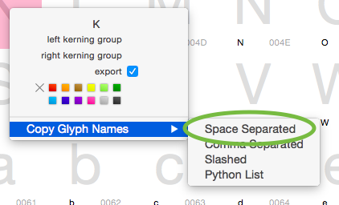
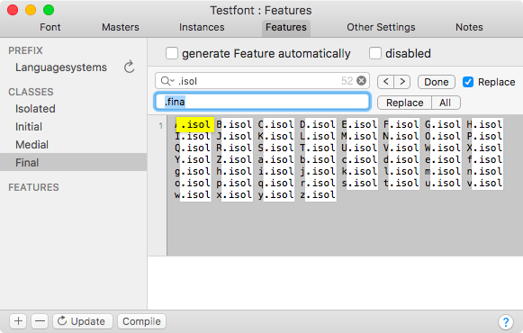
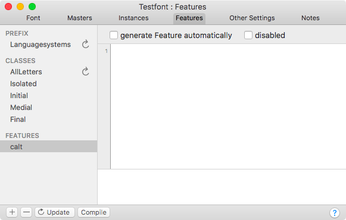
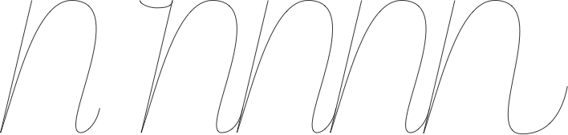

原文: [Features](https://glyphsapp.com/learn/features-part-4-positional-alternates)
# フィーチャー、パート4：位置による代替字形

チュートリアル

[ OpenTypeフィーチャー ](https://glyphsapp.com/learn?q=opentype+features)

執筆者: Rainer Erich Scheichelbauer

[ en ](https://glyphsapp.com/learn/features-part-4-positional-alternates) [ fr ](https://glyphsapp.com/fr/learn/features-part-4-positional-alternates) [ zh ](https://glyphsapp.com/zh/learn/features-part-4-positional-alternates)

2022年7月25日更新（初版公開：2014年4月23日）

スクリプトフォントが本当に素晴らしいのは、異なる位置に合わせた代替グリフがたくさんあり、それらをトリガーするための適切なOpenTypeフィーチャーがあるときです。このチュートリアルで、それを正しく行う方法を見つけましょう。

スクリプトフォントやそれに類するデザインにおける主な問題の一つは、単語内の相対的な位置によって文字の形が変わることです。合計で、4つの可能な位置を区別できます。

*   **.init**：単語の始まりの語頭形
*   **.medi**：単語の途中の語中形
*   **.fina**：単語の終わりの語末形
*   **.isol**：文字が単独で立つときの孤立形

4文字のコード`init`、`medi`、`fina`、`isol`は、対応するOpenTypeフィーチャーの名前です。そして、もうお察しかもしれませんが、グリフにそれらの名前を接尾辞として追加することで、これら4つのフィーチャーの自動作成をトリガーできます。例えば、フォントに`adieresis`と`adieresis.init`の両方がある場合、Glyphsは自動的に`init`フィーチャーを生成できます。必要なのは、「ファイル > フォント情報 > フィーチャー」の左下にある更新ボタン（丸い矢印でマークされている）をクリックし、フォントを再書き出しすることだけです。

問題は、デフォルトでこれらのフィーチャーを利用するアプリケーションが非常に少ないことです。例えば、InDesignでは、OpenTypeオプションで「自動位置指定形」を有効にする必要があります。多くのユーザーはまだOpenTypeフォントの扱い方を知らず、サポートメールを送ってくるでしょう。結局のところ、彼らにとっては、苦労して稼いだお金で買ったフォントが機能していないように見えるのです。「自動位置指定形を有効にする」というフレーズだけで、一部の人々の心に恐怖を植え付けることがあります。

### 注意
4つの位置指定OpenTypeフィーチャー`init`、`medi`、`fina`、`isol`は、アラビア語やそれに類するスクリプトのような、固有の「結合挙動」を持つ書記体系専用です。これらのフィーチャーは、ラテン語、ギリシャ語、キリル文字、ヘブライ語などには適用されません。たとえカーシブフォントを作成している場合でもです。言い換えれば、もしGlyphsが「ファイル > フォント情報 > フィーチャー」でこれらのフィーチャーを自動的に作成した場合、UIのそれぞれの「無効」チェックボックスでフィーチャーを無効にするか、サイドバーで選択して左下のマイナスボタンで削除することを検討してください。

そこで、多くの時間と神経を節約するために、位置指定形が自動的に表示される方法を見つけるべきです。偶然にも、その方法があります。乞うご期待。

## デフォルトとしての語中形

さて、このチュートリアルでは2つの仮定をします。第一に、*デフォルトのグリフは語中形*であると仮定します。第二に、*各文字には4つのバリエーションすべて*があると仮定します。つまり、`a`、`b`、`c`などのデフォルトのグリフがあり、それらはすべて語中形であり、さらにそれぞれに`.isol`、`.init`、`.fina`の接尾辞が付いた3つのバリエーションがあるとします。もしあなたのデザインにこれが当てはまらない場合は、それに応じてコードを調整する必要がありますが、このチュートリアルを読み通せば、それはかなり簡単であることがわかるでしょう。

## OpenTypeクラス

これはかなり明確だと思います。4つのクラスが必要です。

*   `.isol`接尾辞を持つ孤立グリフのための`Isolated`
*   `.init`接尾辞を持つ語頭バリエーションのための`Initial`
*   接尾辞のないデフォルトの語中文字のための`Medial`
*   `.fina`接尾辞を持つ語末形のための`Final`

`Isolated`から始めましょう。これは簡単です。フォントビューの右下隅にある検索フィールドに`.isol`と入力するだけです。Glyphsは、名前に`.isol`が含まれるすべての文字に選択を絞り込みます。 अब、表示されたすべてのグリフを選択し（Cmd-A）、コンテキストメニューから「グリフ名をコピー > スペース区切り」を選ぶだけです。



さて、クリップボードにすべての`.isol`グリフのグリフ名が入りました。そこで、「ファイル > フォント情報 > フィーチャー」に進み、左下のプラスボタンをクリックし続け、ポップアップメニューから「クラス」を選びます。新しいOpenTypeクラスが表示され、単にその名前を`Isolated`に変更します。次に、グリフ名をコードフィールドにペーストします。

あなたのクラスコードは今、このようになっているはずです。
```
A.isol B.isol C.isol D.isol E.isol F.isol G.isol H.isol I.isol J.isol K.isol L.isol M.isol N.isol O.isol P.isol Q.isol R.isol S.isol T.isol U.isol V.isol W.isol X.isol Y.isol Z.isol a.isol b.isol c.isol d.isol e.isol f.isol g.isol h.isol i.isol j.isol k.isol l.isol m.isol n.isol o.isol p.isol q.isol r.isol s.isol t.isol u.isol v.isol w.isol x.isol y.isol z.isol
```
ずっと良くなりました。残りのクラスについては、私たちのタスクは明確で簡単です。「Isolated」クラスを3回コピー＆ペーストします。クラス名「Isolated」をクリックしてCmd-Cを押し、次に3回Cmd-Vを押します。4つの「Isolated」という名前のクラスが表示されます。そのうちの3つの名前を「Initial」、「Medial」、「Final」に変更します。次に、各新しいクラスのコードをクリックし、接尾辞`.isol`をそれぞれの接尾辞に、または「Medial」では何もなしに置き換えます。Cmd-Shift-Fを押すと検索と置換機能が表示されるので、これで簡単にできます。接尾辞`.isol`をそれぞれの接尾辞に、または「Medial」では何もなしに置き換えます。



この方法なら、すべてのクラスが同期します。つまり、それらに保存されている*グリフの数と順序が同じ*になります。これは、後ほど書く置換コードにとって重要です。

ちなみに、クラスはサイドバーで名前をドラッグすることで並べ替えることができます。順序はフィーチャーが機能するためには重要ではありませんが、全体像を把握するためには重要です。

もう一つ作成すべきクラス定義が残っています。`AllLetters`という名前のクラスが必要です。「ファイル > フォント情報 > フィーチャー」の「プラス」メニューから作成し、「フィーチャーを自動的に生成」チェックボックスがオンになっていることを確認します。この方法で、フォント内のすべての文字の名前の完全なリストが得られます。位置指定形もすべて含まれます。なぜなら、例えば、語頭フィーチャーは次のように機能するからです。「デフォルトの文字を、その前にどんな文字もない限り、語頭形に切り替える」。

言うまでもなく、`AllLetters`クラスは、前に作成した位置指定クラスよりも大きくなります。したがって、他のクラスと同じ数と順序のグリフを持つことはできません。

## 文脈依存の代替字形

今必要なのは、*文脈依存の代替字形*フィーチャー、つまり`calt`です。なぜなら、私たちがやりたいのは、文脈に応じてグリフを置換することだからです。したがって、最初のステップは、そのフィーチャーを作成することです。繰り返しになりますが、「ファイル > フォント情報 > フィーチャー」で、左下の「プラス」ボタンをクリックし続けます。しかし今回は、ポップアップメニューから「フィーチャー」を選びます。`xxxx`という名前の新しいフィーチャーが表示され、その名前はすでに選択されているので、便利に`calt`（小文字）に変更できます。



Returnキーを押して確定します。もしフォントに他のフィーチャーがすでにある場合は、「更新」ボタンをクリックすると、Glyphsがフィーチャーを適切に並べ替えることができます。クラスとは対照的に、フィーチャーの順序は実際に重要です。そして、正当な理由がない限り、Glyphsが提案するデフォルトのソート順に従うことをお勧めします。

## フィーチャーコードの記述

最初のフィーチャーを要約したのを覚えていますか。「デフォルトの文字を、その前にどんな文字もない限り、語頭形に切り替える」

さて、少しずつ組み立てていきましょう。「デフォルトの文字を語頭形に切り替える」は、`Medial`クラスを`Initial`クラスで置換することに相当します。そこで、この行を書くことから始められます。
```
sub @Medial by @Initial;
```
フィーチャーコードでは、`sub...by`は*substitute…with*（…を…で置換する）を表し、クラス名はクラスとして認識されるためにアットマークで始まる必要があります。そして、すべてのルールはセミコロンで終了させなければならず、そうでなければカウントされません。

ここまでは順調です。しかし、問題は、これが*すべて*のデフォルトの文字（`Medial`）を語頭形に置換してしまうことです。そして、私たちは、その前に文字がない場合にのみそうしたいのです。言い換えれば、その前にどんな文字もない場合を除いてです。あるいは、さらに言い換えれば、*その前にどんな文字もある場合を無視する*ことです。素晴らしいですね。なぜなら、`AllLetters`というクラスがあり、[AFDKOフィーチャーファイル構文](http://www.adobe.com/devnet/opentype/afdko/topic_feature_file_syntax.html)は`ignore sub`文を知っているからです。そして、このように書きます。
```
ignore sub @AllLetters @Medial';
sub @Medial' by @Initial;
```
「コンパイル」ボタンをクリックして、すべて正しく入力できたか確認してください。

ここで2つのことに注目する必要があります。第一に、`ignore sub`文は、それが意図されている`sub`文の*前*にあります。これは、*すべて*の続く`sub`文は、`ignore sub`の条件が満たされない場合にのみカウントされることを意味します。トリッキーですね。今のところは大丈夫ですが、後で頭痛の種になるでしょう。読み進めてください。

第二に、ティックマーク`'`を見てください。`ignore sub`ルールでは、例外が`Medial`クラスのすべてのグリフに適用されると述べています。そして、続く`sub`ルールで、それを再度マークする必要があります。まあ、ここでは、他に置換されるものがないので、明確だと思います。しかし、それでもマークする必要があります。なぜなら、それは上の`ignore sub`文と同じクラスである必要はないからです。いくつかのグリフを共有する2つの異なるクラスである可能性もあります。さらに、より複雑な文脈依存の置換である可能性もあります。

もう一度強調させてください。`ignore sub`と`sub`の両方の文で、それぞれのグリフクラスをティックマークでマークする必要があります。もしあなたの`ignore sub`が機能しないなら、おそらく一方または両方のマーカーを忘れているのでしょう。心配しないでください、最高の私たちにも起こります。

すでに機能するかどうか見てみましょう。新しい編集タブで、`n`を数回タイプし、ウィンドウの左下隅にある「フィーチャー」ポップアップメニューから「文脈依存の代替字形」を選びます。


はい！うまくいきました！では、理論的には、`Isolated`と`Final`についても同じことをすればいいだけですよね？ですよね？！

いいえ、そうではありません。私たちが賢い女の子と男の子なので、`ignore sub`文は後に続く*すべて*に適用されることを覚えています。そして、3つの`ignore sub`文は間違いなく互いに邪魔し合うでしょう。ではどうすればよいのでしょうか？

## ルックアップ

実は、以前に完全な真実を話していませんでした。`ignore sub`は、後に続く*すべて*に適用されるわけではなく、*同じルックアップ内*で後に続くすべてにのみ適用されます。

え？ルックアップ？ルックアップって何？ええと、`lookup`内で、いくつかのルールを名前の下にまとめることができ、もしよろしければ、後でそれを再び呼び出すことができます。そこで、これまでに書いたすべてを`lookup`に入れ、名前を付ける必要があります。方法はこうです。
```
lookup INITIAL {
    ignore sub @AllLetters @Medial';
    sub @Medial' by @Initial;
} INITIAL;
```
私はこれを`INITIAL`と名付けました。理由は明らかです。構文は明確です。`lookup`、名前、そして開く波括弧です。次に、ルックアップ内にあるべきすべてのルールです。必要はありませんが、もしきれいだと思うなら、Cmd-]でインデントできます。そして、もし気が変わったら、Cmd-[でインデントを解除できます。最後に、波括弧を再び閉じ、ルックアップ名を繰り返し、セミコロンでルックアップを終了させる必要があります。

さて、もう一つ重要なことをお伝えしなければなりません。`lookup`ブロック間では、順序が重要です。フィーチャー間と同様です。フォントは、現在のグリフに適したものが見つかるまでこのフィーチャーを順に見ていき、それ以上は探し続けません。

だからこそ、最も大きな`ignore sub`を持つ`lookup`を最初に置く必要があります。この場合、それは孤立形のバリエーションのためのものです。なぜなら、その前には何もない場合と、後ろには何もない場合の両方を無視する必要があるからです。それは2つの`ignore sub`ルールになります。では、2つの`ignore sub`文を書くのでしょうか？
```
lookup ISOLATED {
  ignore sub @Medial' @AllLetters;
  ignore sub @AllLetters @Medial';
  sub @Medial' by @Isolated;
} ISOLATED;
```
もちろん、そうすることもできますし、その方法で機能します。しかし、一部の人々は、無視された置換チェーンをコンマで区切って並べることを好みます。このように。
```
lookup ISOLATED {
   ignore sub @Medial' @AllLetters, @AllLetters @Medial';
   sub @Medial' by @Isolated;
} ISOLATED;
```
そして、私はその人々の一人です。ですから、このままにしておきます。フフフ。

ついでに、`Final`の置換も追加しましょう。今回のルックアップは最後まで行きます。
```
lookup ISOLATED {
   ignore sub @Medial' @AllLetters, @AllLetters @Medial';
   sub @Medial' by @Isolated;
} ISOLATED;

lookup INITIAL {
   ignore sub @AllLetters @Medial';
   sub @Medial' by @Initial;
} INITIAL;

lookup FINAL {
   ignore sub @Medial' @AllLetters;
   sub @Medial' by @Final;
} FINAL;
```
繰り返しになりますが、すべてのティックマークが正しいか、よく確認してください。私たちは常に`Medial`クラスをマークしたいのです。`ignore sub`ルールと`sub`ルールの両方でです。結局のところ、`Medial`クラスには私たちのデフォルトのグリフが含まれており、機会があれば置換される必要があるのはそれらです。

OK、「コンパイル」ボタンを押してください。もしエラーが出たら、エラーメッセージが何を言っているか注意深く読んでください。セミコロンを忘れましたか？クラス名をタイプミスしましたか？アットマークを忘れましたか？もし解決できないなら、[Glyphsハンドブック](/learn/)に長いトラブルシューティングのセクションがあります。「エラー処理」の章の「OpenTypeフィーチャーコード」セクションを探してください。

もしあなたのフィーチャーがコンパイルされるなら、編集タブで再度テスト実行できます。私が再び`n`を数回タイプすると、こうなります。



左側に孤立したn、右側に3回続けて、毎回異なる形で表示されます。語頭形、語中形、語末形です。クールですね、ハイタッチ、最高です！

## 便利なスクリプト

さて、これらすべてを読み通し、`lookup`ブロックと`ignore sub`文の性質を理解したと思います。今すぐ休憩が必要でしょう。

そして、ここにあります。`calt`に位置指定コードを注入するスクリプトを書きました。それはあなたのグリフ構造を分析し、`.init`、`.medi`、`.fina`、`.isol`という接尾辞をチェックします。これの最も良い点は、4つの位置指定グループが同期していることを前提としていないことです。ですから、クラスとコードの構造は少し異なりますが、基本的な考え方は同じです。もしスクリプトを再度実行すると、クラスとフィーチャーコードが更新されます。

[mekkablueのGitHubページ](https://github.com/mekkablue/)から[Glyphs Scriptsリポジトリ](https://github.com/mekkablue/Glyphs-Scripts)をダウンロードしてください。スクリプトをScriptsフォルダ（「スクリプト > スクリプトフォルダを開く」、Cmd-Shift-Y）に置き、スクリプトをリロードします（Optionキーを押しながら：「スクリプト > スクリプトを再読み込み」、Cmd-Opt-Shift-Y）。すると、「スクリプト」メニューのどこかに「Features > Build positional calt feature」が見つかるはずです。楽しんでください。

---

更新履歴 2015-06-22: Glyphs 2向けに更新。

更新履歴 2017-01-09: 誤字を修正、スクリーンショットを更新、AllLettersクラスを明確にしました（@Raseoneさん、ありがとう）。

更新履歴 2019-10-30: 位置指定OTフィーチャーに関する注記を追加。

更新履歴 2022-07-25: タイトル、関連記事、軽微なフォーマットを更新。

## 関連記事

[すべてのチュートリアルを見る →](https://glyphsapp.com/learn)

*   ### [フィーチャー、パート1：単純な置換](features-part-1-simple-substitutions.md)

チュートリアル

[ OpenTypeフィーチャー ](https://glyphsapp.com/learn?q=opentype+features)

*   ### [フィーチャー、パート2：文脈に応じた置換](features-part-2-contextual-substitutions.md)

チュートリアル

[ OpenTypeフィーチャー ](https://glyphsapp.com/learn?q=opentype+features)

*   ### [フィーチャー、パート3：高度な文脈依存の異体字](features-part-3-advanced-contextual-alternates.md)

チュートリアル

[ OpenTypeフィーチャー ](https://glyphsapp.com/learn?q=opentype+features)