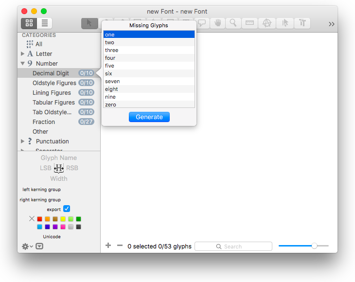
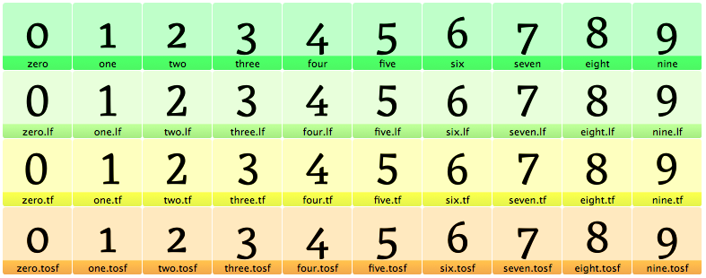
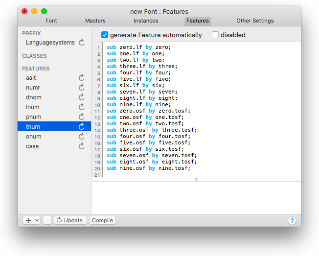

原文: [Figures: proportional](https://glyphsapp.com/learn/figure-sets)
# 数字：プロポーショナル、等幅、ライニング、オールドスタイルの数字セット

チュートリアル

[ OpenTypeフィーチャー ](https://glyphsapp.com/learn?q=opentype+features)

執筆者: Rainer Erich Scheichelbauer

[ en ](https://glyphsapp.com/learn/figure-sets) [ fr ](https://glyphsapp.com/fr/learn/figure-sets) [ zh ](https://glyphsapp.com/zh/learn/figure-sets)

2022年8月9日更新（初版公開：2013年7月8日）

等幅とプロポーショナル、オールドスタイルとライニングの数字を作成したいですか？その簡単さに驚くことでしょう！

## デフォルトの数字を作成する

まず、フォントに他に何を入れる計画であれ、デフォルトの数字セットがどのようなものであるかを決める必要があります。いずれにせよ、そのグリフ名は単に次のとおりです。

```
zero one two three four five six seven eight nine
```

デフォルトの数字が等幅かプロポーショナルか、ライニングかオールドスタイルかは問題ではありません。それらを入力する必要はなく、単にフォントタブのサイドバーにある「数字」カテゴリを開き、「十進数字」を右クリックして、欠けている数字を生成するだけです。



また、Glyphsにそれらが何であるかを教える必要もありません。なぜなら、アプリはいくつかのヒューリスティックを適用してそれを判断するからです。まず、`eight`と`zero`の高さを測定し、もし`zero`が`eight`より17パーセント以上小さい場合、デフォルトの数字はアプリによってオールドスタイルと見なされます。同様に、もしすべてのデフォルトの数字の幅の違いが1ユニットを超える場合、それらはプロポーショナルと見なされます。これは、追加の数字スタイルを追加したい場合に重要です。

## 残りを作成する

さて、デフォルトの数字ができたので、他の3種類の数字を作成できます。それらは同じ名前ですが、ドット接尾辞が付いています。

*   `.tf`: 等幅ライニング
*   `.tosf`: 等幅オールドスタイル
*   `.lf`: プロポーショナルライニング
*   `.osf`: プロポーショナルオールドスタイル

すでにデフォルトの数字でそのうちの1つはカバーされているので、必要なのは他の3つのうち1つ、2つ、またはすべてを作成することだけです。

もう一つのクールなトリック：デフォルトでは、数字コンポーネントは自動的に整列されません。これにより、プロポーショナル数字を等幅数字に、その逆も簡単に再利用できます。「グリフ > グリフを追加」を選択し、次のような行を入力することで、コンポーネントで代替の数字を素早く作成できます。

```
zero=zero.tf
one=one.tf
two=two.tf
```
…などです。この例では、`zero.tf`を作成し、その中に`zero`コンポーネントを挿入します。`one`なども同様です。お分かりですね。4つのスタイルができるまで続けます。そのうちの1つがデフォルトになります。



 अब、必要なのは、「ファイル > フォント情報 > フィーチャー」に進み、ウィンドウの左下隅にある更新ボタンをクリックすることだけです。すると、どうでしょう！上記で説明したヒューリスティックに基づいて、Glyphsは数字のフィーチャー、`lnum`、`onum`、`pnum`、`tnum`を自動生成できます。



これで、ユーザーは異なる数字のスタイルから選べるようになります。クールですね！

---
サンプルフォント：[MARTHA](http://cargocollective.com/lisaschultz/Martha)、LISA SCHULTZ氏提供。

---

更新履歴 2020-03-25: タイトルを変更。

更新履歴 2020-03-30: ボタン名をRefreshからUpdateに変更。

更新履歴 2022-07-29: タイトル、関連記事、軽微なフォーマットを更新。