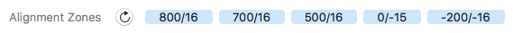

原文: [Font Info settings in Glyphs Mini](https://glyphsapp.com/learn/font-info-settings-in-glyphs-mini)
# Glyphs Miniのフォント情報設定

チュートリアル

[ Glyphs Mini ](https://glyphsapp.com/learn?q=glyphs+mini)

執筆者: Rainer Erich Scheichelbauer

[ en ](https://glyphsapp.com/learn/font-info-settings-in-glyphs-mini) [ es ](https://glyphsapp.com/es/learn/font-info-settings-in-glyphs-mini) [ fr ](https://glyphsapp.com/fr/learn/font-info-settings-in-glyphs-mini)

2022年7月28日更新（初版公開：2019年9月20日）

Glyphs Miniの「フォント情報」セクションには、フォント名、垂直メトリクス、アラインメントゾーンなど、フォントに関する重要な一般情報が保存されます。このチュートリアルのステップバイステップの説明を読めば、効率的に使用できるようになります。

「ファイル > フォント情報」（Cmd-I）で「フォント情報」タブを開きます。その後、設定をタブで移動できます。

## フォント名

「フォント情報」で最も重要な設定は、*フォントファミリー名*と*スタイル名*の2つです。これらはタブの上部にあるグレーの背景の大きな文字です。

*   **フォントファミリー名：** 左側の単語、デフォルトでは「new Font」が、あなたのフォントファミリー名です。複数のフォントが同じファミリー名を共有している場合、例えばAdobe InDesignのようなアプリのフォントメニューで、同じフォントサブメニューにグループ化されます。大文字と単語間のスペースを使用できますが、ファミリー名は短く（合計20文字未満）、ASCII（A-Z、a-z、0-9）のみを使用してください。ウムラウト、アクセント、その他の非ASCII特殊文字は使用しないでください。最大限の互換性を確保するため、ファミリー名にダッシュを使用しないこともお勧めします。念のためです。また、最大限の互換性を確保するため、技術的には数字（0-9）で始めることも可能ですが、ファミリー名は文字（A-Z、a-z）で始めるのが最善です。一部のアプリでは、文句を言われたり、フォントが誤ってリストされたり、全くリストされなかったりすることがあります。

*   **スタイル名：** 右側、デフォルトでは「Regular」。複数のフォントが同じファミリー名を共有している場合、スタイル名で区別する必要があります。兄弟姉妹が同じ姓を持っている場合に、異なる名前が必要なのと非常によく似ています。典型的なスタイル名は、*Light、Regular、Book、Medium、Semibold、Bold、Heavy、Black*および*Light Italic、Italic、Book Italic、Medium Italic、Semibold Italic、Bold Italic、Heavy Italic、Black Italic*などです。しかし、*Grunge、Supercool、Dotted*、または*Laser*など、あなたのデザインを最もよく表す型破りな名前を持つこともできます。繰り返しになりますが、スタイル名は短くし、プレーンなASCIIに固執してください。

## 垂直メトリクス

これらの設定は、フォントのいくつかの重要な測定値を記述し、一部のアプリでフォントがどのように表示されるかに影響を与えます。例えば、アプリはこれらの数値に基づいて最初のベースラインのオフセットを計算します。

*   **キャップハイト：** あなたの大文字の高さ。オーバーシュートのない、直線的で単純な文字、例えば大文字のH、T、Iで測定するのが最適です。ほとんどの書体デザインでは、値は600から700の間です。もしあなたのデザインがはるかに大きい場合は、右下隅の「emあたりのユニット数」の値を、キャップハイトとディセンダーの両方を包含するものに変更することを検討してください。もしあなたのフォントがアイコンフォントなら、デフォルトの700のままにしておくのが最善です。
*   **エックスハイト：** アセンダーのない小文字の高さ。これも、オーバーシュートのないデザイン、例えば小文字のx、v、w、y、zで測定するのが最適です。もしあなたのフォントに小文字がない場合は、キャップハイトより低い値であることを確認してください。典型的なエックスハイトは、だいたい500ユニットの高さです。
*   **アセンダー：** b、d、f、h、k、l、またはアイスランド語のþ、ðのような、アセンダーを持つ小文字の高さ。オーバーシュートは含みません。（注：小文字のtは通常エックスハイトを超えますが、アセンダーには達しません。）これらの文字は、通常、書体デザインで最も高い（アクセントなしの）文字であり、キャップハイトも超えます。もしキャップがアセンダーより高いという逆の関係のデザインがある場合は、「アセンダー」の値をキャップに、その逆に使用することを検討してください。通常、アセンダーの高さは700から800の間のどこかです。
*   **ディセンダー：** g、j、p、q、y、そしてアイスランド語のþのような、ディセンダーを持つ小文字の深さを表す負の数値。これもオーバーシュートは含みません。イタリックデザインでは、fやドイツ語のシャープエスのような文字も時々ディセンダーを持ちます。もしあなたのデザインに小文字がない、あるいはアイコンフォントのように全く文字がない場合は、この値をデフォルトの-200のままにしておくのが良い考えです。

以下の2つの設定、標準ステムは、ヒンティングと、コンテキストメニューの「コーナーを開く」のような一部の機能にのみ重要です。もしあなたのフォントがヒンティングに適していないなら、これらは空白のままで構いません。あなたのフォントがヒンティングに適しているのは、以下の場合です。

*   デザインに極値点が設定されている（「グリフ > 極値点を追加」）。
*   文字に繰り返し現れる、類似したシェイプを持つ、通常のテキスト文字のデザインである（ほとんどの人が「普通のフォント」と呼ぶもの）。
*   シェイプの忠実度よりも可読性を優先する。
*   荒らされたアウトライン、インライン、装飾、非常に細かいディテール、破線や点線、多くのノード（十数個以上）などの特殊効果がない。

一方、もしあなたのフォントがシンボルフォントやディンバットフォントである、あるいはグランジフォントのようにアウトラインで何か凝ったことをしているなら、2つのステム設定はスキップする方が良いです。

*   **垂直ステム：** あなたの垂直ステムの*平均*の太さ。この値は、低解像度の状況で、垂直ステムの太さを表示するために使用されるピクセル数を統一し、調和させるために使用されます。アイデアは、もしある文字がステムに2ピクセルを使用するなら、他のすべての文字も2ピクセルを使用するということです。ですから、すべての文字に多かれ少なかれフィットする、*1つ*の良い平均値を使用してみてください。例えば、n、o、H、Oのステムの太さを測定し、50、56、62、68という値が得られたら、60という1つの平均値を入力するのが最善です。複数の値を入力すると、特定の画面サイズで、一部の文字のステムが1ピクセル、他の文字のステムが2ピクセルになる状況につながる可能性があり、これは100%の違いになります。
*   **水平ステム：** あなたの水平ステムの*平均*の太さ。小文字のe、f、t、大文字のA、E、H、Tのクロスバーや、小文字のc、o、s、大文字のC、G、O、Sのほぼ水平なカーブで測定するのが最適です。繰り返しになりますが、*1つ*の良い平均ステム値を見つけるようにしてください。

そして、行の一番最後には、イタリックデザインにのみ適用される設定があります。

*   **イタリック角度：** あなたのデザインの時計回りの傾斜を度単位で。簡単に言えば、フォントがどれだけ右に傾いているかです。フォントに傾斜がない場合はゼロのままにし、バックスラントデザインの場合は負の値を入力します。これには2つの効果があります。第一に、これは最終的に書き出されるフォントファイルに保存され、一部のアプリはこの値を使用してテキスト入力カーソルの傾斜を計算します。第二に、これは編集ビューの測定ボックスを傾け、イタリックデザインの編集を容易にします。

## アラインメントゾーン

上記の標準ステムと同様に、これらの設定はヒンティングと画面の最適化を目的としています。オーバーシュートのデザイン参照として使用することもできます。ヒンティングがあなたのフォントにとって意味がないと判断した場合は、「アラインメントゾーン」をスキップして、次のセクションに進むことができます。

「更新」ボタンをクリックすると、Glyphs Miniがあなたのゾーンを推測しようとします。アラインメントゾーンは、垂直メトリクスにおけるオーバーシュートとセリフカップの領域を定義します。ディセンダー、ベースライン、エックスハイト、キャップハイト、アセンダーです。アイデアは、低解像度では、アラインメントゾーンに入るものはすべて、特定のピクセルサイズまで平坦化（「抑制」）されるということです。これは、余分なピクセルが大きすぎる違いになる場合に必要です。

各ゾーン設定は、*位置*と*サイズ*の2つの値で構成されます。位置は、垂直メトリクスライン（位置ゼロのベースラインを含む）と一致すべきです。サイズは、エックスハイト、キャップハイト、アセンダーでの上部オーバーシュートでは正ですが、ベースラインとディセンダーでの下部オーバーシュートでは負です。オーバーシュートは、低画面解像度で同じピクセル高に平坦化されるべきものすべてを包含すべきです。アイデアを与えるために、典型的なゾーン設定はこちらです。

ゾーンを設定する際には、いくつかの重要なルールに従う必要があります。さもないと、期待通りに機能しません。

1.  上部オーバーシュートは最大5つ、下部オーバーシュートは最大6つ（ベースラインを含む）までです。
2.  ゾーンは決して交差したり重なったりしてはなりません。
3.  ゾーンは小さく保つべきで、最好は25を超えないことです。（はい、[それよりもっと複雑です](hinting-postscript-autohinting.md)が、ほとんどすべての場合において、25ユニット未満に保てば安全です。）
4.  ベースラインゾーンは、*必ず*位置ゼロでなければなりません。
5.  もしグリッド設定が1/1より細かい場合（例：1/10または0/1）、ゾーンを両方向に1ユニットずつ拡張してください。つまり、各ゾーンを1ユニット早く開始させ、1ユニット遅く終了させます。例えば、ゾーン`800/16`は`799/18`に拡張されるべきです。もちろん、ベースラインゾーンは除きます。これは位置ゼロに留まらなければなりません。例えば、`0/-14`は`0/−15`になります。

ステムとゾーンを設定したら、「オートヒント」オプションをオンにして書き出すことができます（「ファイル > 書き出し」、Cmd-E）。ヒンティング設定が正しいかどうかを確認するには、InDesignやIllustratorなどのAdobeアプリでフォントをテストする必要があります。そのためには、[Adobe fontsフォルダを使用することを強くお勧めします](testing-your-fonts-in-adobe-apps.md)。

## メタ情報

フォント情報のこの部分は、技術的な意味合いはなく、フォントの動作を変更するものではありません。もしあなたのフォントが個人用または内部使用のみであるなら、これらはすべて空のままでも構いません。しかし、もし他の人にフォントを配布する予定があるなら、無料であれ有料であれ、これを含める方が良いかもしれません。

*   **デザイナー：** あなたの名前です。あるいは、フォント作成に関わった人々の名前です。このフォントを誰が作ったか、世界に知らせましょう。
*   **デザイナーのURL：** あなたのウェブサイトのURLです。仕様ではプロトコル（通常はウェブサイトなら`http://`または`https://`）を記載することが求められています。
*   **製造元：** あなたのフォントをリリースする人。あなたのファウンドリ、代理店、またはフォントプロジェクトが関連している会社などです。
*   **製造元のURL：** 製造元のウェブサイトのURLです。仕様ではプロトコル（通常はウェブサイトなら`http://`または`https://`）を記載することが求められています。
*   **バージョン：** フォントのバージョン番号です。MacのFinderでファイル情報（Cmd-I）を見ると表示されます。フォントの新しいバージョンをリリースするときは、番号を増やすのを忘れないでください。バージョン番号を参照することで、サポートの問題を大幅に容易にすることができます。一部の検証ソフトウェアは、バージョン番号が1.005未満のフォントを「プレリリース」と見なし、ユーザーに警告します。ですから、1.005から数え始めてください。デザインの大きな変更は、左側の1桁の数字（別名：メジャーバージョン番号）で反映されるべきです。上下矢印キーまたはボタンを使って、3桁の値（別名：マイナーバージョン番号）を変更できます。
*   **著作権：** 更新ボタンを使って、Glyphs Miniに有効な著作権表示を自動生成させることができます。もしフォントを無料のオープンソースフォントとしてリリースしたい場合は、「All Rights Reserved」の部分を削除することをお勧めします。
*   **ライセンス：** 仕様によると、これはユーザーがフォントでできること、できないことの簡単な英語の要約であるべきです。例えば、「自由に共有してください」や「Company Xのみがこれを使用できます」、「最大5台のマシンにインストール可能」などです。しかし、多くのファウンドリは完全なライセンスをここに貼り付けます。もし再販プラットフォームを通じてフォントを販売する予定があるなら注意してください。一部のプラットフォームは、フォントを提出する前にライセンス情報を追加しないよう主張します。なぜなら、フォントは異なるフォーマットで異なるライセンスで販売される可能性があるからです。言い換えれば、このフィールドを空白のままにしておくことを望むかもしれません。ですから、ここで何か凝ったことをする前に、再販業者に尋ねてください。しかし、もしフォントを無料のオープンソースフォントとしてリリースしたいなら、[SIL Open Fontライセンス](http://scripts.sil.org/cms/scripts/page.php?site_id=nrsi&item_id=OFL)を検討してください。

## スタイル情報

もし1つのフォントしか作らないなら、この章はスキップして、下の「グリッド設定」に進むことができます。しかし、小さなフォントファミリーを作成しているなら、これらの情報は重要です。

スタイルリンクは、複数のフォント間にBold/Italicの関係を確立します。アプリはこの情報を使って、BoldフォントにアクセスするためにCmd-BまたはCmd-Shift-B（InDesignの場合）、ItalicフォントにアクセスするためにCmd-IまたはCmd-Shift-I（InDesignの場合）を押したときに、正しいフォントを表示します。要するに、すべてのItalicは、そのアップライトの対応するものの*Italic*として確立されるべきであり、一方、BoldとBold Italicフォントは、通常/レギュラースタイルの*Bold*または*Bold & Italic*であるべきです。属性*Bold*と*Bold & Italic*は一度だけ使用してください。

複雑に聞こえますか？確かに。簡単な概要を説明しましょう。デフォルトのスタイルが`Regular`だと仮定します。

*   **Thin:** —
*   **Thin Italic:** `Thin`の*Italic*
*   **Light:** —
*   **Light Italic:** `Light`の*Italic*
*   **Regular:** —
*   **Regular Italic:** `Regular`の*Italic*
*   **Medium:** —
*   **Medium Italic:** `Medium`の*Italic*
*   **Semibold:** —
*   **Semibold Italic:** `Semibold`の*Italic*
*   **Bold:** `Regular`の*Bold*
*   **Bold Italic:** `Regular`の*Italic*および*Bold*
*   **Heavy:** —
*   **Heavy Italic:** `Heavy`の*Italic*
*   **Black:** —
*   **Black Italic:** `Black`の*Italic*

ダッシュは、「設定を空のままにしておく」ことを意味します。さらに、もしあなたのデフォルトスタイルが「Regular」ではなく「Book」という名前なら、もちろん`Book`で参照する必要があります。

ウェイトとウィズの設定は、Adobeアプリのスタイルサブメニューのソート順を変更します。InDesign、Illustrator、Photoshopは、まず*ウィズ*で、次に*ウェイト*でソートします。もし両方が同じなら、スタイルはアルファベット順にソートされます。

設定はかなり自明です。単にメニューからあなたのデザインに最も合うものを選べば、それで完了です。

> **注意：** Appleアプリ、例えばTextEditやPagesでのスタイルメニューのソート方法は、私たちに尋ねないでください。誰も知らず、Appleも教えてくれません。Macシステムは、あなたのフォントファミリーに対していくつかのヒューリスティックを行い、おそらくあなたのグリフの一部を測定することさえあります。長年にわたって私たちが発見した唯一のことは、フォントがアップライトとして認識されるためには、*イタリック角度*がゼロでなければならず、イタリックのためには、*イタリック角度*がゼロ以外でなければならないということです。それが私たちが知っているすべてです、申し訳ありません。もしフォントがこれらのアプリで期待通りにソートされない場合、私たちはあなたを助けることができません。

## グリッド設定

「フォント情報」の下の方に、アウトライングリッドの設定があります。そこには、「グリッドの間隔」と「細分化」の2つの値が表示されます。

ほとんどすべての場合、両方の値を1のままにしておきたいと思うでしょう。残りのいくつかのケースでは、*実効*グリッドステップ、つまり実際にノードを配置できる場所は、「グリッドの間隔」を「細分化」で割ることによって決定されます。

もし非常に詳細な描画を作成していて、グリッドが粗すぎると感じるなら、「細分化」の値を増やすことができます。「細分化」の値が2であれば、グリッドを半ユニット単位でステップでき、つまり.5座標が可能になります。最大値は100で、つまり座標に小数点以下2桁の追加です。

もし、例えばピクセルフォントや非常にモジュール化されたデザインのために、より粗いグリッドが必要なら、より高い「グリッドの間隔」の値を検討してください。「グリッドの間隔」の値が100で、「細分化」が1の場合、ノードは100の倍数にしか配置できません。

## emあたりのユニット数

*emあたりのユニット数*（または略して「UPM」）は、フォントサイズを構成するフォントユニットの数で、デフォルトは1000です。

emは、フォントサイズに相対的な長さの測定単位で、1emは正確にフォントサイズです。ですから、フォントサイズが12ポイントの場合、1emは12ポイントです。私たちはスケーラブルなベクターをデザインしているので、すべての測定値は特定のフォントサイズから独立している必要があり、したがってemは書体デザイナーにとって理想的な測定単位です。

言い換えれば、デフォルトでは、各ユニットはフォントサイズの1000分の1です。つまり、UPM値を変更すると、実質的にフォントを*拡大縮小*することになります。

*   フォントが他のフォントと比べて大きすぎるように見える場合は、UPMの数値を増やします。
*   フォントが小さすぎるように見える場合は、より小さい数値を選びます。

再書き出しし、できればAdobe fontsフォルダまたは[TextPreview](/tools/textpreview)のウォッチフォルダに書き出して、新しいサイズがあなたのニーズにより良く合うか確認してください。

> **警告：** ソフトウェアは、あなたのUPMが比較的一般的であることを期待するかもしれません。経験上、UPM値は4000未満に保つようにしてください。これを超えると、オフィスソフトウェアで問題が発生したというユーザーからの報告があります。もしフォントがどのソフトウェアで使用されるか知っているなら、それより高くしても構いませんが、ファイルを渡す前に広範囲にわたってテストしてください。

---

更新履歴 2019-09-23: 「グリッド設定」と「Units per Em」を書き直しました。

更新履歴 2020-02-16: 誤字を修正しました。

更新履歴 2022-07-28: タイトル、関連記事、軽微なフォーマットを更新。

## 関連記事

[すべてのチュートリアルを見る →](https://glyphsapp.com/learn)

*   ### [Glyphs Miniでピクセルフォントを作る](creating-a-pixel-font-in-glyphs-mini.md)

チュートリアル

[ Glyphs Mini ](https://glyphsapp.com/learn?q=glyphs+mini)

*   ### [Glyphs Miniでウェブフォントを作る](creating-a-webfont-in-glyphs-mini.md)

チュートリアル

[ Glyphs Mini ](https://glyphsapp.com/learn?q=glyphs+mini)

*   ### [IllustratorからGlyphs Miniに読み込む](importing-from-illustrator-into-glyphs-mini.md)

チュートリアル

[ Glyphs Mini ](https://glyphsapp.com/learn?q=glyphs+mini)

*   ### [Glyphs Miniでのフォント情報の設定](font-info-settings-in-glyphs-mini.md)

チュートリアル

[ Glyphs Mini ](https://glyphsapp.com/learn?q=glyphs+mini)