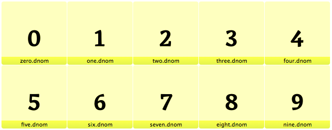
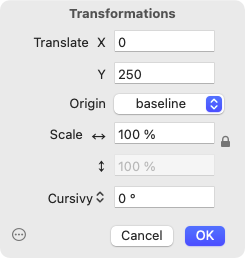
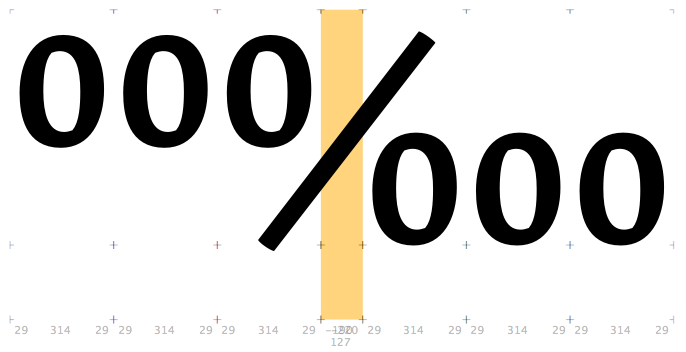
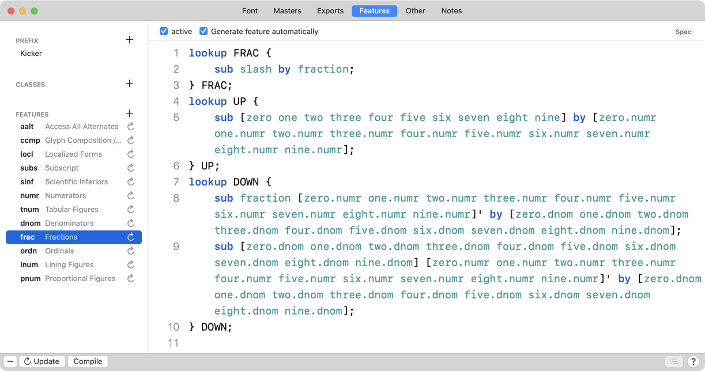
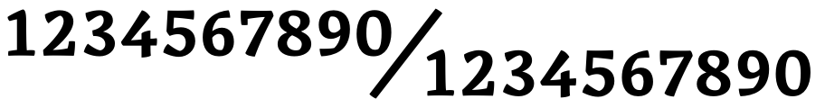
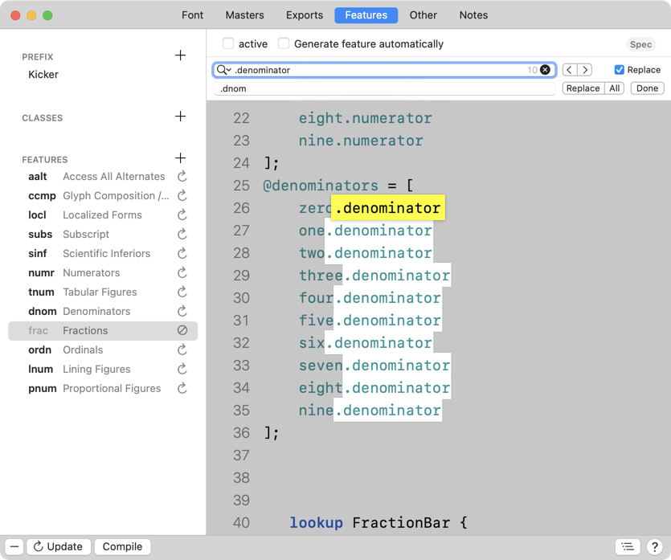
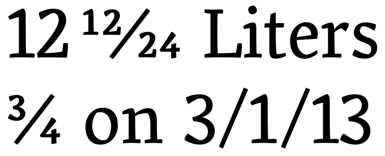

原文: [Figures: fractions](https://glyphsapp.com/learn/fractions)
# 数字：分数

チュートリアル

[ OpenTypeフィーチャー ](https://glyphsapp.com/learn?q=opentype+features)

執筆者: Rainer Erich Scheichelbauer

[ en ](https://glyphsapp.com/learn/fractions) [ fr ](https://glyphsapp.com/fr/learn/fractions) [ zh ](https://glyphsapp.com/zh/learn/fractions)

2022年8月9日更新（初版公開：2013年7月23日）

フォントに分子、分母、分数のスラッシュを追加すれば、好きな分数を入力できます。素晴らしいですよね？さて、このステップバイステップのチュートリアルで、これを簡単に達成できます！

さて、[すべての数字](figure-sets/.md)をきれいに仕上げました。 હવે、分数の数字を追加する時間です。良い点は、分子を一度描くだけで、それを分母として再利用できることです。少し下にずらすだけです。ステップバイステップで見ていきましょう。

## 分母を追加する

まず、ライニング数字のコピーを作成します。例えば、「グリフ > グリフを複製」コマンドで複製し、選択したままの状態で「編集 > 検索 > 検索と置換」で接尾辞を`.001`から`.dnom`に変更します。次に、それらを縮小します。しかし、あまり小さくしすぎないでください。分数の数字は超小型である必要はありません。ほとんどの場合、およそ3分の2でうまくいきます。

もしマルチプルマスター設定があるなら、Tim Ahrens氏のGlyphs用[Remix Tools](http://remix-tools.com/glyphsapp)のScalerのようなツールを利用できます。もしシングルマスター設定なら、「パス > 変形」で縮小し、その後「フィルタ > パスをオフセット」でストロークの太さの損失を補うことができます。

これでかなり進むはずです。すべてを見直し、手動で修正が必要な部分を修正するのを忘れないでください。満足がいくまで繰り返します。



おめでとうございます！これで、追加の数字セット、分母ができました！

## 分子を追加する

次は分子です。分母と同じように見えるべきですが、通常はライニング数字の高さに合わせて、より高く配置されます。これを実現するには、分母の複合コピーを作成するだけです。「グリフ > グリフを追加…」（Cmd-Shift-G）を選び、画面に表示されるダイアログにこれを入力（またはコピー＆ペースト）します。
```
zero.dnom=zero.numr
one.dnom=one.numr
two.dnom=two.numr
three.dnom=three.numr
four.dnom=four.numr
five.dnom=five.numr
six.dnom=six.numr
seven.dnom=seven.numr
eight.dnom=eight.numr
nine.dnom=nine.numr
```
「生成」ボタンを押すと、フォントに分子のグリフが追加されます！唯一の問題は、まだ低すぎる位置にあることです。そこで、少し上に押し上げましょう。分子が選択されていることを確認し、「フィルタ > 変形 > 変形」を選んで、y軸に沿って上にずらします。



メインウィンドウでライブプレビューを見ることができるので、適切な高さに達したかどうかをすぐに確認できるはずです。

## 分数グリフを追加する

`fraction`グリフ（Unicode `U+2044`）は、`slash`とは異なります。一つには、負のサイドベアリングを持っています。そのため、`numr`と`dnom`の数字がうまく収まります。また、ストロークの太さは小さい数字に合わせて調整されています。ほとんどの場合、これは`fraction`が`slash`より細いことを意味します。最後に、`fraction`は通常、スラッシュほど急ではない、はるかに平らな角度を持っています。

`/zero.numr/zero.numr/zero.numr/fraction/zero.dnom/zero.dnom/zero.dnom`のような文字列を入力し、`fraction`グリフを、分子の下、分母の上にきれいに収まるように調整します。



`seven.numr`と`fraction`、そして`fraction`と`four.dnom`のカーニングが必要になるかもしれません。一部のデザインでは、`nine.numr`と`fraction`、そして`fraction`と`six.dnom`の間でも少しの調整が必要です。結果は様々です。

## 既成の分数

後方互換性のために、既成の分数を追加することもできます。なぜなら、そのうちのいくつかはUnicodeを持っているからです。ついでに、サイドバー経由で、またはこれらのグリフを追加することで簡単に生成できます。
```
onefraction onehalf zerothird onethird twothirds onequarter threequarters onefifth twofifths threefifths fourfifths onesixth fivesixths oneseventh oneeighth threeeighths fiveeighths seveneighths oneninth onetenth
```

## フィーチャーを生成する

さて、「ファイル > フォント情報 > フィーチャー」に進み、ウィンドウの左下隅にある丸い矢印の付いた更新ボタンを押します。Glyphsが自動的にOpenTypeフィーチャーのリストに`numr`、`dnom`、`frac`を追加するのに気づくでしょう。



「コンパイル」を押して、フィーチャーコードが正しいか確認してください。もし正しければ、[Adobe Fontsフォルダに書き出して](testing-your-fonts-in-adobe-apps.md)、InDesignの分数機能で試すことができます。最高！



要するに、分数フィーチャーはこれを行います。まず、すべての数字を分子に、`slash`を`fraction`に変えます。次に、`fraction`に*続く*分子を分母に置き換えます。最後に、*分母に続く*分子を分母に置き換えます。

このアプローチの欠点は、ユーザーが特定の数字/スラッシュの組み合わせを選択し、分数フィーチャーを有効にする必要があることです。もし単にそれをオンにしてタイピングを始めると、すべての数字が区別なく分子に変換されてしまいます。しかし、まあ、ほとんどのフォントではこのように実装されています。

## タル・レミングの分数フィーバー

もう一つ、指摘しておきたいことがあります。もし標準的な実装の欠点を、より洗練された`frac`フィーチャーで克服したいなら、Tal Leming氏の[Fraction Fever 2](http://web.archive.org/web/20130325033504/http://talleming.com/2009/10/01/fraction-fever-2/)を試してみてください。とりわけ、「2012/4/12」のような日付を認識し、分数フィーチャーから除外したり、「2と1/2」のような数字と分数の組み合わせをきれいにレンダリングしたりします。したがって、ユーザーはInDesignで分数オプションを常にオンにしておき、ただタイプするだけでよいのです。フィーチャーが、何を分数に変え、何をそのままにしておくかを判断します。

フォントでコードを使用するには、以下の手順に従ってください。

*   フォントにこれらのグリフがあることを確認してください：`thinspace`（`space`に似ていますが、はるかに細い）、`hyphen`、`slash`
*   `frac`の自動フィーチャージェネレーションのチェックを外し、そこにあるコードを削除します。
*   Talのコードをフィーチャーに挿入します。
*   接尾辞`.numerator`と`.denominator`を`.numr`と`.dnom`に置換します（Cmd-F）。
*   フィーチャーコードから`feature frac {`と`} frac;`の2行を削除します。



あなたの分数フィーチャーは、今やこのようなことをします。



唯一の欠点は、あらかじめ指定された最大数の分子しか持てないことです。デフォルトでは、その数は10なので、1京分の1京分の1と入力することはできません。残念です。もし最後の文が理解できなかったり、気にしないなら、まあ、気にしないでください。

## 便利なスクリプト

[mekkablue scripts](https://github.com/mekkablue/Glyphs-Scripts/)には、2つの便利なスクリプトがあります。

1.  *Features > Fraction Fever 2:* Fraction Feverのコードを自動的に構築します。
2.  *Build Glyphs > Build Small Figures:* ベースライン上に（パスベースの）分母がある場合、このスクリプトは、他のすべての小さい数字（上付き、下付き、分子）を一度に複合グリフとして構築するのに役立ちます。[下付き・上付き数字に関するチュートリアル]でその使い方について読んでください。スクリプトの使い方に特化したセクションがあります。

---
サンプルフォント：[MARTHA](http://cargocollective.com/lisaschultz/Martha)、LISA SCHULTZ氏提供。

---

更新履歴 2013-11-13: Tal Leming氏のFraction Fever 2に関するブログ投稿へのリンクを更新。

更新履歴 2020-03-25: タイトルを変更。「便利なスクリプト」を追加。

更新履歴 2020-03-27: コマンド「Glyph > Duplicate Glyph」の名前を更新。

更新履歴 2022-08-02: タイトル、関連記事、軽微なフォーマットを更新。