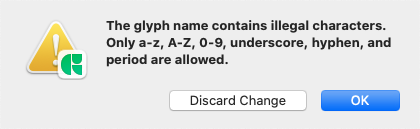
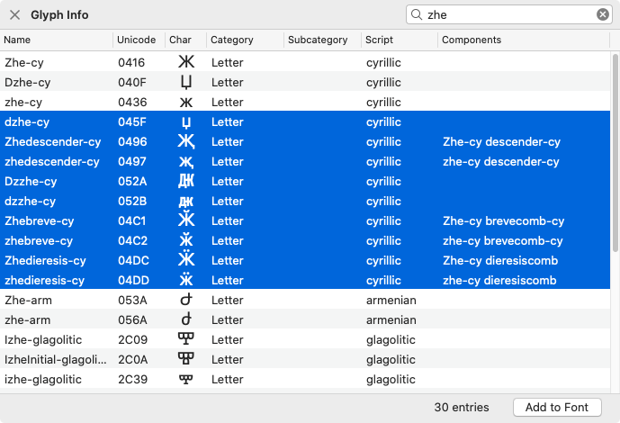
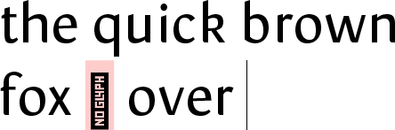

原文: [Getting your glyph names right](https://glyphsapp.com/learn/getting-your-glyph-names-right)
# グリフ名を正しく設定する

チュートリアル

執筆者: Rainer Erich Scheichelbauer

[ en ](https://glyphsapp.com/learn/getting-your-glyph-names-right) [ fr ](https://glyphsapp.com/fr/learn/getting-your-glyph-names-right) [ zh ](https://glyphsapp.com/zh/learn/getting-your-glyph-names-right)

2021年12月18日更新（初版公開：2012年8月14日）

正しいグリフ名は、Glyphsの多くの気の利いた機能の鍵となります。ここでは、それらを正しく設定する方法を紹介します。

もしグリフ名が悪いと（マニアは「不正」とさえ呼びます）、フォントが正しくコンパイルされなかったり、他の互換性の問題を引き起こしたりする可能性があります。ですから、グリフ名が正しいことを確認するのは良い考えです。

実際には、Glyphsはグリフの名前フィールドに入力されたものをチェックし、そもそも問題を引き起こすのを防ごうとします。例えば、`ä`と入力すると、自動的に`adieresis`に変換されるはずです。もしそれでもそれを通り越してしまった場合、Glyphsは文句を言います。



それでも、グリフ名をチェックしない別のソフトウェアで作成されたフォントを開くと、Glyphsファイルに不正な名前が残ってしまうことがあります。もしそうなったら、このブログ記事はあなたのためのものです。

## ナイスネーム

Glyphsは独自の命名規則に従っています。私たちはそれを*ナイスネーム*と呼んでいます。なぜなら、`afii57416`や`uni0416`よりも`beh-ar`や`Zhe-cy`の方が説明的だと信じているからです。「ウインドウ > グリフ情報」を見て、説明的なグリフ名のリストを確認してください。



ご覧の通り、「フォントに追加」ボタンがあります。もちろん、Shiftキーを押しながらクリックして連続して選択したり、Cmdキーを押しながらクリックして個々のグリフを選択することで、一度に複数選択できます。

## プロダクションネーム

上で説明したナイスネームは、Glyphs*内部*でのみ扱われます。書き出されたOpenTypeフォントファイルでは、最終的にあなたのフォントを処理し表示するアプリによって、異なるグリフ名が期待されます。私たちはそれを*プロダクションネーム*と呼んでいます。プロダクションネームは、[Adobe Glyph List Specification](https://github.com/adobe-type-tools/agl-specification)、略して「AGL」に従います。実際、Glyphsが使用するナイスネームは、ある程度AGLに基づいています。

AGLは歴史的に成長してきたもので、多数の（主にラテン文字とギリシャ文字の）グリフ名を定義しています。AGLを超えるものはすべて、`uni`で始まり、それがマップされるUnicode値の4桁の16進数コードが続くことになっています。例えば、⫀（Glyphsでのナイスネームは`supersetWithPlusSignBelow`）の場合は`uni2AC0`です。追加多言語面にマップされるグリフ、つまり5桁および6桁のUnicode値を持つグリフは、接頭辞として`u`のみが付きます。例えば、🎁（ナイスネームは`wrappedPresent`）の場合は`u1F381`です。

Glyphsは、特に「ファイル > フォント情報 > その他 > カスタム命名規則を使用」を有効にしない限り、書き出し時にこの名前の変換を自動的に行います。もしこのオプションがオンになっていると、名前の変換は行われず、あなたは自己責任で作業することになります。そうする正当な理由がない限り、私たちはこのチェックボックスをオフにして、Glyphsにその魔法をかけてもらうことをお勧めします。

特定のグリフのプロダクションネームを知りたい場合は、その情報を見てください。グリフを選択し、「編集 > 選択グリフの情報を編集」（Cmd-Opt-I）を選びます。

### Glyphs 2のヒント
Glyphs 2を使用している場合、「編集 > 選択グリフの情報を編集」を選ぶ前に、フォントビュー（Cmd-Opt-1）に切り替える必要があります。


この場合、プロダクションネームは`uni1E9E`で、これはグリフに割り当てられたUnicode値と一致します。一部のグリフでは、プロダクションネームのフィールドが空白で表示されます。これらの場合、ナイスネームとプロダクションネームは同じです。そうでなければ、変換されます。

## グリフ情報の更新

グリフ名の問題を修正する良い最初のステップは、「フォント > グリフ情報を更新」です。これはUnicode値とグリフ名を同期させようとします。グリフ名は、内蔵のグリフデータベース（下記参照）で説明されているデフォルトにリセットされます。しかし、[独自のグリフデータ](roll-your-own-glyph-data.md)を採用している場合は、名前の変換でそれが尊重されます。

もし[既存のフォントを読み込んでいる](importing-existing-fonts.md)なら、確認したい設定が2つあります。1つ目は、グローバルな環境設定「Glyphs > 環境設定 > ユーザー設定 > 読み込んだファイルのグリフ名を維持」です。もしこれがオンになっていると、新しく読み込まれたファイルは自動的にフォント固有の「ファイル > フォント情報 > その他 > カスタム命名規則を使用」を有効にします。これらの設定がオンになっていると、ナイスネームへの変換が妨げられます。これは、異なる、規定されたワークフローと統合する必要がある場合に便利です。

## Unicodeの特殊なケース

時々、グリフ情報にエントリがない特定のUnicode文字にグリフを対応させたい場合があります。典型的な例は、私用領域（PUA）の文字です。この場合、グリフ名を`uni`で始め、その後に16進コード（大文字で）を続けます。例えば、`uniE000`のようにです。ちなみに、一度Unicode値が設定されたら、好きなように、あなたにとって意味のある名前にリネームできます。例えば、`twitterIcon`のようにです。PUAのUnicode値は新しい名前で保持されます。

基本多言語面（BMP）外のUnicodeに対応するグリフの場合、名前は`u`で始まり、その後に5桁のコードが続きます。例えば、`U+10102 AEGEAN CHECK MARK`のグリフは、`u10102`と呼ばれます。

## 独自のグリフ名を作成する

しかし、もし独自のグリフ名を作成しなければならない場合は、以下の命名規則に従うのが非常に良い考えです。書き出すグリフの名前の*最初の文字*は、常にこれらのいずれかであるべきです。
```
ABCDEFGHIJKLMNOPQRSTUVWXYZ
abcdefghijklmnopqrstuvwxyz
```
これだけです。もし最初の文字が上に現れないなら、あなたのグリフ名はほとんどの場合不正であり、フォントポリスがやってきてあなたを捕まえ、さらに悪いことに、あなたのフォントが正しくコンパイルされるのを妨げるでしょう。

しかし、2つの例外があります。第一に、非表示（書き出し対象外）のグリフは、名前の先頭にアンダースコアを使用することがあります。詳細は下記を参照してください。第二に、`.notdef`があります。これは、テキスト中の未定義文字の代替グリフです。多くの場合、Xの入った四角形、または疑問符ですが、もし`.notdef`をデザインしていない場合、デフォルトでこれが選ばれます。



ですから、私の唇を読んでください。ウムラウトもアクセントも、ファンキーなハングルの記号もありません。ただのプレーンなASCII文字です。それは*文字*であり、数字もありません。そして*特に*スペース、コンマ、ダッシュ、その他の句読点もありません。ただの古き良きAからZ、またはaからzです。

グリフ名の*残り*については、これらのいずれかを使用することもできます。
```
1234567890（数字）
_（アンダースコア）
.（ピリオド）
-（ダッシュ）
```
これだけです。繰り返しになりますが、*スペースも、アクセントも、ファンシーなものは一切ありません。*しかし、注意してください、これらのいくつかには特別な意味があります。

## アンダースコア

アンダースコア`_`は、合字（リガチャ）に使用されます。アンダースコアは、合字で接続されるグリフの名前を繋ぎます。したがって、アンダースコアの間の部分は、再び、グリフ情報パレットに表示されるような有効なグリフ名であるべきです。

複雑に聞こえるかもしれませんが、簡単です。`f`と`h`の合字があると想像してください。すると、あなたの合字は`f_h`と呼ばれます。`f`と`adieresis`（ä）の合字が欲しいですか？すると、あなたの合字は、お察しの通り、`f_adieresis`と呼ばれます。あなたの名前を合字として入れたいですか？`M_a_r_y`や`P_e_t_e_r`など、あなたの名前が何であれ、そうしてください。この慣習に従えば、Glyphsはそれぞれの合字フィーチャーをあなたのために構築することさえできます。

自動フィーチャージェネレーションは、ほとんどの合字を`dlig`（任意の合字）に入れるため、`.liga`拡張子を使って、合字を代わりに`liga`（標準の合字）に強制することができます。例えば、`f_adieresis.liga`のようにです。詳細は[合字チュートリアル](ligatures.md)で読んでください。

名前の*先頭*にアンダースコアがあるグリフは、「グリフ > グリフを追加」（Shift-Cmd-G）経由で生成されると、デフォルトで書き出し対象外になります。したがって、名前の最初の文字としてのアンダースコアは、[スマートグリフ](smart-components.md)、[コーナーコンポーネント](reusing-shapes-corner-components.md)、[特別なコンポーネントのテクニック](reusing-shapes-component-tricks.md)などの、いくつかの特別なグリフに使用されます。

## ピリオド

ピリオド`.`は、グリフ名に説明的な拡張子を追加するために使用されます。多くの場合、これはグリフが表示されるべきOpenTypeフィーチャーの名前になります。例えば、小文字eの最初のスタイルセットのバリエーションには`e.ss01`のようにです。

もしピリオドの*前*の部分が「ウインドウ > グリフ情報」からの有効なグリフ名であれば、Glyphsはキャラクターへの接続を行うことができます。これは、あなたのフォントが、あなたのフォントが使用されているPDFからテキストをコピーするような特定の状況で、より良く機能することを意味します。

また、`.loclXXX`という拡張子を持つグリフのローカライズ版を作成することもできます。XXXは[言語システムタグ](http://www.microsoft.com/typography/otspec/languagetags.htm)を表します。例えば、スウェーデン語の小文字äには`adieresis.loclSVE`、ポーランド語の小文字óには[ポーランド語のó](localize-your-font-polish-kreska.md)のように`oacute.loclPLK`です。Glyphsはその後、`locl`フィーチャーを自動的に処理できます。

時々、グリフ名の接尾辞とOpenTypeフィーチャータグの関係は、単純な一対一よりも複雑です。例えば、`.sc`は[スモールキャップフィーチャー](making-small-caps.md)の両方、`smcp`と`c2sc`をトリガーします。そして、`.osf`、`.tosf`、`.lf`、`.tf`の4つの接尾辞のうち3つの組み合わせは、適切な[数字フィーチャー](figure-sets.md)をトリガーします。賢いグリフ命名によって自動化できるOpenTypeフィーチャーの完全なリストについては、Glyphsハンドブックの付録を参照してください。これは[はじめに](/get-started)ページから無料でダウンロードできます。

## ダッシュ

Glyphsは、ダッシュ`-`を、書記体系を追加するために使用します。例えば、キリル文字には`-cy`、アラビア文字には`-ar`、デーヴァナーガリー文字には`-deva`などです。私のお気に入りは、もちろん、[ただの理由で](https://en.wikipedia.org/wiki/Phaistos_Disc)、`-phaistosDisc`です。グリフ情報パレットを開き、検索フィールドにダッシュを入力して、どの書記体系があるか見てください。お分かりになるでしょう。

---

更新履歴 2012-09-21: 非BMPユニコードに関する段落を追加。

更新履歴 2015-09-21: Glyphs 2向けに更新。

更新履歴 2016-12-06: スクリーンショットを更新、誤字を修正、部分的に書き直し。

更新履歴 2019-07-06: AGLのリンクを更新。Norbert Lindenbergさん、ありがとう。

更新履歴 2019-08-07: 誤字を修正。Nathalie Dumontさん、ありがとう。

更新履歴 2020-03-21: 「プロダクション名とAGL」に関するセクションを追加、冒頭部分の表現を修正、軽微なフォーマットを変更。

更新履歴 2020-09-06: 「プロダクション名」セクションの「Everything beyond」の後に「the AGL」という言葉を追加。

更新履歴 2021-04-08: 内部リンクと見出しレベルを更新。

更新履歴 2021-12-18: 誤字を修正、タイトルをセンテンスケースに変更、関連記事を追加。

## 関連記事

[すべてのチュートリアルを見る →](https://glyphsapp.com/learn)

*   ### [フォントにグリフを追加する](adding-glyphs-to-your-font.md)

チュートリアル

[ 言語 ](https://glyphsapp.com/learn?q=languages)

*   ### [レシピ](recipes.md)

チュートリアル

[ シェイプの再利用 ](https://glyphsapp.com/learn?q=reusing+shapes)