原文: [Harmonization](https://glyphsapp.com/learn/harmonization)
# ハーモナイゼーション

チュートリアル

執筆者: Rainer Erich Scheichelbauer

2023年3月22日更新（初版公開：2022年8月3日）

ハーモニーは良いものです。書体デザインにおいては、それには一つ以上の特別な意味があります。

PostScriptとTrueTypeのパスには共通点が一つあります。それは*アウトライン*形式であることです。つまり、そのようなパスでどんなシェイプでも作成したい場合、シェイプの*エッジ*（「アウトライン」）をオンカーブポイント（ノード）とオフカーブポイント（ハンドル）で記述します。これには利点と欠点があります。

## アウトラインのジレンマ

良い点は、信じられないほどの自由度があることです。アウトラインを使えば、ほとんど*どんな*シェイプでも記述できます。ええ、習得するのが少し難しいエッジケースもいくつかありますが、一般的に、アウトラインはどんな仕事でもこなせる、素晴らしく柔軟な方法です。

欠点はもう少しトリッキーです。どのスクリプトを見ても、書体デザインで最も必要なシェイプは*ストローク*です。各スクリプトには独自の歴史がありますが、それぞれがその文字の形に影響を与えた1つ以上の典型的な筆記用具を持っています。あらゆる種類のペン、ブラシ、鉛筆、チョーク、針など、名前を挙げればきりがありません。これらの道具の良い点は、*腕を一振りするだけで、自動的にシェイプのすべてのエッジ*を一度に作成できることです。そして、さらに良いことに、それらはすべて一貫して互いに適合します。あるいは、私たちが言うように、互いに「調和」します。なぜなら、それらは同じ道具で同じストロークから生まれているのですから、調和しないわけがありません。

問題は、*アウトライン*を記述するとき、この自動調和の贅沢がないことです。私たちのアウトライン形式では、エッジの各部分、各セグメントは、他のどの部分からも完全に独立しています。したがって、書体デザイナーとしての私たちの厳しい仕事は、すべてのアウトラインセグメント間に適切な関係を確立することです。もしそのシェイプが道具の一振りで描かれていたなら、自動的にそうなったであろう関係を。そして、これらの関係を確立することを「ハーモナイゼーション」と呼びます。

重要なのは、ハーモナイゼーションが問題となるのは、私たちがアウトラインで作業しているからだということです。

## ハーモナイゼーションの3ステップ

理論的には、アウトラインを調和させる方法はたくさんあります。ここでは、[良いパス描画の慣行について議論したこと](drawing-good-paths.md)から続き、ほとんどのシナリオで機能する方法を一つ紹介します。

シェイプのすべてのセグメントにわたって調和を確立するには、3つのステップがあり、各ステップは前のステップに基づいています。

1.  **ポイントの配置：** 対向するオンカーブノードは互いに関連し、対向するオフカーブハンドルは多かれ少なかれ同じ方向を向く
2.  **内側と外側のカーブのフィッティング：** 内側のカーブセグメントは、外側の対向するセグメントよりも相対的なハンドルの長さが長い
3.  **セグメント間のハーモナイゼーション：** カーブセグメントから隣接するカーブまたはラインセグメントへの遷移

詳しく説明します。

## ステップ1：ポイントの配置

ストローク、例えばラテン文字のnやhのショルダーを見てみましょう。

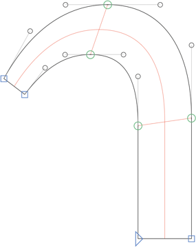

#### ノードのペアリング

*緑と青のオンカーブポイント*、別名「ノード」の配置は、あなたが模倣しようとしている筆記用具の論理に従います。それらが常に、想像上の中心ストロークの両側に**対向するペア**で現れることがわかります。それらを結ぶと、ペアは中心線に対して多かれ少なかれ垂直に見えます。

しかし、それらは*完全に*垂直ではありません。上のペア（極値点）はほぼ垂直ですが、左下から右上へのわずかな傾きがあります。そして、シェイプの直線部分と曲線部分の間のペア（遷移点）はほぼ水平ですが、左下から右上へのわずかな傾きがあります。このずれは、私たちが模倣している筆記用具に起因します。クラシックなラテン文字の幅広ペンを右手で20度から40度の角度で持った場合、デザインがどれだけ抽象化されていても、極値点のペアまたは遷移点のペアの間にこれらの傾きが得られます。筆記用具の使用の継続性を仮定するため、期待できるのは*常に同じ傾き*です。この場合、垂直または水平のノードペアであるかに関わらず、常に左下から右上への傾きが得られます。他の道具では、傾きが逆になることがあります。

もちろん、書体デザインはカリグラフィではありません。つまり、ある程度の自由度がありますので、これは鵜呑みにしないでください。一部のペアリングは、他よりも正規化されます。例えば、ベースライン上の下の2つのノードを見てください。この書体のスタイルはベースライン上で水平な終わりを要求するため、2つのノードは完全に水平でなければなりません。一方、視覚的な補正のために、より顕著な傾きを持つペアリングもあるでしょう。そして一部のペアは、カーブを合わせるために逆に傾くことさえあります。これらは、意図したサイズで書体の外観をより一貫性のあるものにするために利用する小さなトリックです。

一つ注意してほしいディテールは、左端のポイントペアをどのように配置したかです。それらは垂直ステムとのオーバーラップ部分にあるため、その正確な位置はそれほど重要ではないと主張するかもしれません。そして、一見するとその通りです。しかし、それらをだいたい中心線に対して垂直に配置すると、次のステップが管理しやすくなります。読み進めてください。

#### ハンドルの方向

 अब、*パスセグメント*、つまりノード間の黒い線に焦点を当てましょう。シェイプの両側に、対応するセグメントがあることがわかります。つまり、内側の各セグメントには、同じタイプの対向する外側のセグメントがあります。したがって、一方の側のラインセグメントは、通常、もう一方の側にラインセグメントを要求し、カーブセグメントは、反対側に対応するカーブセグメントを持ちます。

さらに、角度も（おおよそ）同じになります。装飾やテーパリングのようなカリグラフィックな効果はさておき、対向するラインセグメントは同じ方向、つまり両方とも垂直か、両方とも水平か、あるいは両方ともおおよそ同じ角度を向きます。繰り返しになりますが、道具の論理や視覚的な補正によって、多少のずれが生じます。

これはもちろん*カーブセグメント*にも当てはまりますが、その場合は、灰色のオフカーブポイント（別名「ハンドル」、「ベジェ制御点」、「BCP」）の角度に焦点を当てることができます。水平または垂直のハンドルは、通常、極値点を持つクラシックな配置を仮定すると、対向する水平または垂直のハンドルも持ちます。対角線ハンドルの角度は道具の論理に依存するため、この例の左端のハンドルは少し離れています。

しかし、それでも、おおよそ同じ方向を向いていると言えます。実験的なデザインで、そのような配置を要求するデザイン原則がない限り、一方が垂直で、もう一方が水平であることはないでしょう。しかし、それは明らかにこのチュートリアルの範囲を超えています。

## ステップ2：カーブのフィッティング

オンカーブの配置とオフカーブの方向については以上ですが、ハンドルの*長さ*はどうでしょうか？相対的なハンドルの長さは、時々（不正確に）カーブセグメントの「曲率」と呼ばれます。

100%はハンドルの最大長としてカウントされます。なぜなら、それがハンドルが交差する点だからです。もしその長さを超えると、カーブセグメントは変曲し、つまり異なる方向に曲がり、尖点や偽の極値点を引き起こし、通常はそれを望みません。しかし、心配しないでください。100%は、実際の書体デザインの実践では十分すぎるほどです。Eurostileのリバイバルでもしない限り、それほど多くは必要ありません。ほとんどのデザインでは、平均的なハンドルの長さは80%を大きく下回ります。

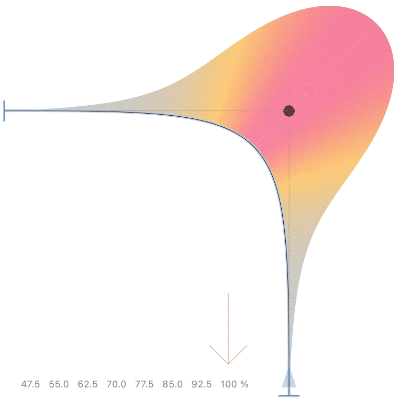

### ヒント
スクリーンショットに見られる曲率の視覚化は、*Speed Punk*という無料のプラグインで作成されています。「ウインドウ > プラグインマネージャ」経由で利用できます。

スペクトルのもう一方の端では、完全に引き込まれたハンドル（長さ0%）は意味がありません。なぜなら、それならラインセグメントを使う方が良いからです。次の重要なパーセンテージは55%で、これは楕円または円に必要なハンドルの長さです。通常、書体デザインでは、それよりも長いものが必要です。非常に幾何学的なデザインでさえ、58%から始まります。

### プロのヒント
技術的には、三次ベジェスプラインでは完全な円を描くことはできません。近似することしかできず、それはデスクトップパブリッシングには十分です。選択する近似の種類に応じて、円に最も近いハンドルの長さは55.1784%から55.228475%の間であり、これは書体デザインでアクセスできる、または実際に必要な精度ではありません。もっと知りたいですか？ドン・ランカスターによる「[Approximating a Circle or an Ellipse Using Four Bezier Cubic Splines](https://www.tinaja.com/glib/ellipse4.pdf)」を読んで、完全な数学的洞察を得てください。

では、要点をまとめましょう。

*   **55%未満：** 曲率は「たるみ」を引き起こし、曲率のピークはセグメントの端に移動します。ピークは、より多くの回転、比較を許すなら「より多くのハンドル操作」を意味します。
*   **55%：** 曲率の櫛は、どこでもほぼ同じ振幅です。これが円に最も近い配置です。
*   **55%以上：** 曲率のピークはセグメントの中央に移動します。ハンドルが長くなるほど、セグメントはその端で平らになり、中央でより曲線的になります。
*   **100%：** 最大のハンドルの長さでは、カーブはセグメントの外側の端に向かって完全に平坦になることに注意してください。

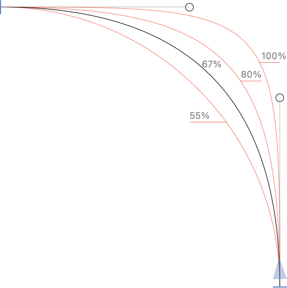

現代のマルチスクリプトデザインにおける（正規化された）バランスの取れたハンドルの長さを素早く測定すると、ほとんどすべてのハンドルの長さ（90°のカーブセグメント上）が、およそ58%から76%の間に収まることがわかります。言い換えれば、その範囲内の値が、あなたが目指すべきものです。だからこそ、「カーブをフィット」パレットで、これらの極値を私たちの値として設定するのが良い考えです。

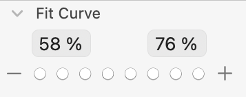

もちろん、デザインに応じて調整してください。同じ値がすべてのデザインに合うわけではありませんが、経験上、驚くほど頻繁に合います。初めて、書体デザインのほとんどの曲率がこんなに狭い範囲にあると知ったときの失望を覚えています。ため息。しかし、それはまた、ハンドルの長さがどれほど影響力を持つかを示しています。

あなたは、これがハーモナイゼーションとどう関係があるのかと尋ねるでしょう。簡単です。少なくともこの方法では、各カーブセグメントに対応する対向するカーブセグメントがあるため、セグメントのペアの曲率の間に相関関係を確立する必要があります。言い換えれば、対向するカーブセグメントの曲率を調和させる必要があります。そして、内側と外側のカーブを合わせたい場合の秘訣は次のとおりです。**小さい内側のカーブは、より高い相対的なハンドルの長さを必要とし、対応する大きい外側のカーブは、より小さい相対的なハンドルの長さを必要とします。** これをよく考えてください。

これは、ポイントの配置とハンドルの向きが前のステップで説明したように選択されていることを前提としています。しかし、もしそうしていて、「カーブをフィット」の値を適切な方法で設定していれば、「カーブをフィット」の8つのステップのキーボードショートカット、Ctrl-Opt-1から8を使用できます。3つのシナリオがあります。

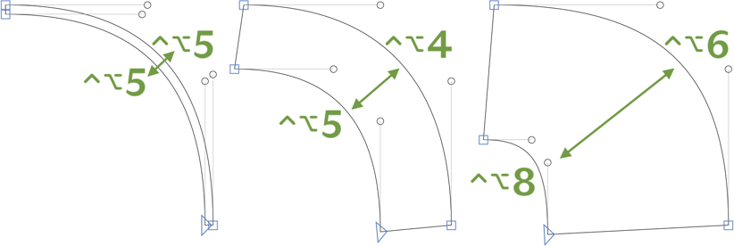

*   **非常に細いウェイト**（ヘアラインからウルトラライトまで）では、内側と外側のカーブは実質的に同じです。したがって、両方のセグメントに同じ「カーブをフィット」の値を使用しても問題ありません。したがって、両方のセグメントからハンドルを選択し、Ctrl-Opt-5を押して、内側と外側のカーブの両方の曲率を同時に設定できます。
*   **通常のウェイト**（ライトからボールドまで）では、内側と外側のカーブにわずかな差異があります。もちろん、それはあなたの正確な「カーブをフィット」の設定に依存しますが、典型的な範囲（例えば58%と76%）では、通常1ステップの違いで十分です。したがって、内側のカーブを選択し、Ctrl-Opt-5を押し、次に外側のカーブを選択してCtrl-Opt-4を押します。
*   **非常に太いウェイト**（エクストラボールド、ブラック、エクストブラックなど）では、内側と外側のカーブ間の曲率の差異が大きくなる傾向があり、通常、最も低い値はもはや必要ありません。これに対応するには、「カーブをフィット」の値を適宜、例えば64%と78%に上げるか、あるいは内側と外側のカーブの間に2、3ステップの差を設けるようにします。例えば、内側でCtrl-Opt-8、外側でCtrl-Opt-6などです。

ステップ2はこれで終わりです。内側と外側のカーブを互いに調和させました。

## ステップ3：セグメント間の遷移

これまで、対向する項目、つまり想像上の中心ストロークの両側にあるポイントやセグメントの調和について話してきました。しかし、書体デザイナーが「ハーモナイゼーション」という言葉を使うとき、通常は一つのカーブセグメントから次のカーブセグメントへの視覚的な曲率の連続性を意味します。

技術的には、各カーブセグメントはそれ自体が独立した世界であり、隣接するセグメントのことを何も知りません。したがって、次のような状況に陥ることは珍しくありません。

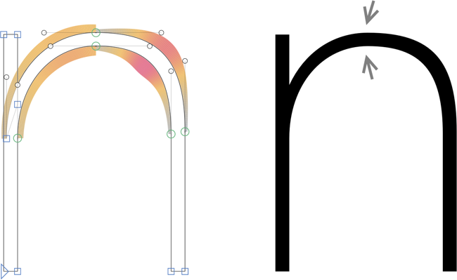

げっ。nの上部にある、矢印が指しているこぶが見えますか？何が起こったかというと、内側と外側のセグメントは互いによく関連していますが、左側のセグメントは右側のセグメントとうまく接続していません。曲率の視覚化でも、接続点で不一致が見られることがわかります。

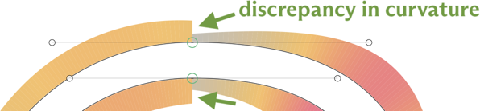

もう一度、もっと近くで見てみましょう。そして、シェイプを見れば、こぶがどこにあるか見つけられるはずです。そして案の定、こぶの一方の側ではカーブが曲がりすぎていて、もう一方の側では平らすぎることがわかるでしょう。

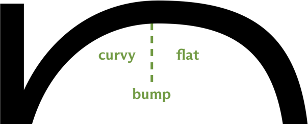

もしその不一致、つまり曲率の違いを取り除くことができれば、シェイプのこぶをならし、滑らかなセグメント間の遷移を実現できるかもしれません。言い換えれば、カーブセグメントを互いに*調和させる*のです。さて、そのような滑らかな遷移は、3つの方法で実現できます。

1.  **オンカーブを移動する：** Optionキーを押しながら、2つのハンドルの間の緑色のノードを「平らな」セグメントに向かって移動させます。この方法は、[Green Harmony](glyphsapp3://showplugin/Green%20Harmony)フィルタによって適用されます。

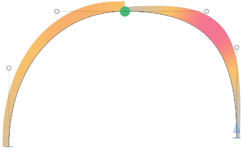

2.  **オフカーブを移動する：** 両方の灰色のハンドルを選択し、「曲がった」セグメントに向かって移動させます。本質的には、上で説明したオンカーブの移動とは逆です。利点は、もしそれが重要なら、極値点の位置を保持できることです。欠点は、シェイプがかなり変わることです。このハーモナイゼーションメカニズムは、[SuperTool](glyphsapp3://showplugin/SuperTool)の「編集 > 調和」機能と[Grey Harmony](glyphsapp3://showplugin/Grey%20Harmony)プラグインによって適用されます。

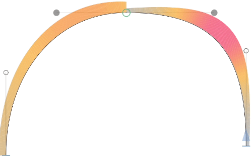

3.  **両方を少しずつ：** もし両方を賢く少しずつ行えば、シェイプの劣化を絶対的な最小限に抑えることができます。これは、Tim Ahrens氏の[Remix Tools](https://remix-tools.com/glyphsapp/tutorials)が、「フィルタ > RMX Harmonizer」を実行するときに行うことです。Remix Toolsは無料ではありませんが、一銭の価値もあります。

## G0、G1、G2、G3連続性

上で示したハーモナイゼーションは、しばしば「G2連続性」と呼ばれます。G2は、接続点における両方のカーブの**2**次導関数を等しくすることによる、**g**eometric continuity（幾何学的連続性）を表します。うわ、技術的すぎますか？2次導関数は、Speed Punkの視覚化の振幅（または色）です。そして、緑のポイントの両側でそれらを同じにすることは、G2ハーモナイゼーションを確立することを意味します。

でも待って、もしG2があるなら、おそらく他のGもあるんですよね？実は、はい。簡単な概要はこちらです。

*   **G0**、別名：位置的または点的連続性：2つの（カーブまたはライン）セグメントが同じ位置で交わります。ゼロは導関数がないことを意味するので、重要なのは同じ点の座標だけです。どんな角でも構いません。言い換えれば、2つのセグメント間の**青いノード**はG0を作成します。
    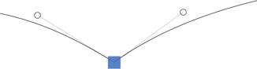

*   **G1**、別名：接線、タンジェント、または角度の連続性：2つのセグメントは、交点で同じ1次導関数、つまり同じ接線を持ちます。それらは、遷移において同じ方向を向いています。**どの緑色のノード**もG1連続性を確立します。
    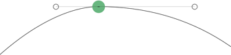

*   **G2**、別名：曲率または半径の連続性：2つのセグメントは、交点で同じ半径（想像上の内接円の）を持ちます。それらは同じ方向を向いているだけでなく、曲率も同じです。曲率は、方向の変化率です。緑の点の両側で同じハンドル操作位置、と言うこともできます。緑のノードの両側で**Speed Punkの櫛を同じサイズにする**ことで、G2連続性が確立されます。
    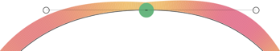

*   **G3**、別名：ねじれまたは加速度の連続性：3次導関数が同じであり、つまり曲率の変化が緑のノードをまたいで連続しています。もし**Speed Punkの櫛が連続的に発達**すれば、G3連続性があります。これは時々、書体デザイナーの間で「スーパースムーズ」または「エクストラスムーズ」な遷移とも呼ばれます。しかし、正直なところ、G3連続性にステップアップすることが全く違いをもたらしたデザインはほんのわずかです。ですから、G3は、あなたの中の最も強迫観念の強い人にのみお勧めします。それを達成する最善の方法は、緑の点を完全に取り除き、もしかしたら描画ツール（ショートカットP）でセグメントをShiftキーを押しながらクリックして再導入することです。オンカーブポイントなしでカーブを再構築できるなら、それはG3が保証されます。
    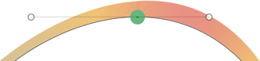

もちろん、続きます。数学的には、4次、5次、またはどんな次数の導関数も等しくすることができます。しかし、安心してください。G4以上の書体デザインへの重要性は、ええと、限られています。カーブ間に欲しいのはG2連続性です。そして、ほとんどの場合、近似的なG2連続性で十分です。

## 特殊なケース：カーブからラインへのハーモナイゼーション

カーブセグメントとラインセグメントの間に滑らかな遷移を持つことはできますか？もちろんです。その方法は、ラインセグメントの2つのオンカーブポイントと、隣接するカーブセグメントの2つのオフカーブポイントを一直線上に揃えることです。

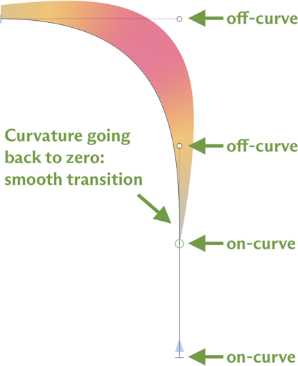

対向するBCP（写真の上部オフカーブ）が*最大化*されているのがわかります。これは、「カーブをフィット」で言えば、長さが100%であることを意味します。もしカーブを、続くラインセグメントと調和するように再配置するなら、この機会を捉えて、カーブとラインセグメントの間の緑のオンカーブノードをカーブから離れるようにOptキーを押しながら移動させ、実質的に隣接するハンドルを長くして、遷移をさらに平坦かつ滑らかにすることができます。

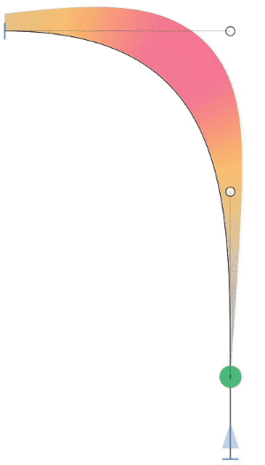

隣接するハンドルで実験し、線がどのように変化するか見てみましょう。もしうまくやれば、カーブとラインの間の遷移は非常に滑らかになり、狂ったようにズームインしても、どこでカーブが終わり、どこでラインが始まるのかわからなくなります。かなりクールですね。

しかし、まだ夢中になってすべてのカーブセグメントをやり直さないでください。結局のところ、3つの問題があります。TrueType変換、補間、そして状況です。

最初の欠点は、調和されたカーブからラインへの遷移は、PostScriptアウトラインをTrueTypeカーブに変換する際に問題を引き起こすことです。結果はほとんどの場合受け入れられるかもしれませんが、理想的ではありません。私たちはそれをより良くするために取り組んでいますが、どんな解決策が出てきても、TTカーブはより複雑になるでしょう、と言っておけば十分でしょう。そして、それはより大きなファイルサイズを意味し、Webフォントには望ましくないかもしれません。

第二に、もしこれをマルチプルマスター設定で行うなら、残念ながら、これを*すべて*のマスターで行う必要があります。さもないと、補間は、特にアニメーション化されたバリアブルフォントで、面白く見えます。2つの最大化された位置の間のステップで、カーブが垂れ下がっていることに注目してください。

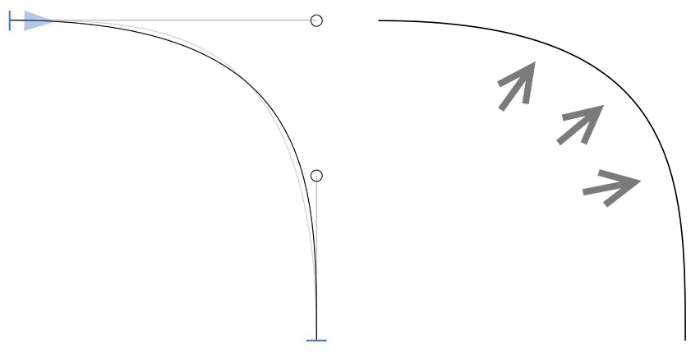

そして最後に、しかし最も重要なことですが、その作業を行うのはあなたの腰が痛くなるほど大変です。はい、確かに、[mekkablue scripts](glyphsapp3://showplugin/mekkablue%20scripts)の「パス > カーブをラインに調和」スクリプトが助けになります。しかし、それでも、多くの手作業が残ります。そして、正直に言って、その効果は小さいサイズではほとんど見えません。

ですから、正気を保ってください。意図したフォントサイズで違いが出る場合にのみ、これを検討してください。すべてのカーブからラインへの遷移が100%滑らかである必要はありません。少なくとも、あなたがフォントをデザインしているタイプサイズにとって、それが*十分に*滑らかかどうか自問してください。もし高い曲率（高い「カーブをフィット」ボタン）があるなら、カーブセグメントの端に向かっての曲率はかなり平坦である可能性が高く、ハンドル構造を最大化しても、目に見える違いはあまりないでしょう。

したがって、最大化は、大きなサイズ用の（ディスプレイ）書体を作成する場合に意味があります。そしてそれでも、こぶが見える場合、そしてできればCFFベースのフォントでのみです。

## 便利なスクリプトとプラグイン

これらのいくつかは、多くのデザイナーのワークフローに不可欠になっているため、すでに上で言及しました。繰り返しになることをお詫びします。

*   Tim Ahrens氏の[Remix Tools](https://remix-tools.com)のHarmonizer。すべてのハーモナイゼーションツールの中で、これが最も良い仕事をします。シェイプを可能な限り保持しつつ、遷移をG2に滑らかにします。無料ではありませんが、わずか99ドルで、最初のプロジェクトだけで非常に多くの時間を節約できるので、ひざまずいてTimの創意工夫に永遠に感謝することになるでしょう。さらに、ScalerやTunerなどの他の便利なツールも付属しています。

*   [Speed Punk](glyphsapp3://showplugin/Speed%20Punk) by Yanone, maintained by the Glyphs team. アウトラインを変更せず、粋な虹で曲率を視覚化するだけです。このチュートリアルのすべてのスクリーンショットはこれを使用して作成されました。「ウインドウ > プラグインマネージャ」で無料で利用できます。

*   [SuperTool](glyphsapp3://showplugin/SuperTool) by Simon Cozens. ツールバーに別の選択ツールを追加し、それを有効にすると、あらゆる種類の視覚化と、ハンドルのみを移動させる、つまり極値を保持するハーモナイザーが得られます。「ウインドウ > プラグインマネージャ」で無料で利用できます。

*   [Green Harmony](glyphsapp3://showplugin/Green%20Harmony)と[Grey Harmony](glyphsapp3://showplugin/Grey%20Harmony) by Alex Slobzheninov and Rainer Scheichelbauer. は、それぞれ緑のノード（Green Harmony）または灰色のハンドル（Grey Harmony）を移動させることでG2連続性を達成します。「ウインドウ > プラグインマネージャ」で無料で利用できます。

*   [Fix Zero Handles](glyphsapp3://showplugin/Fix%20Zero%20Handles) by Rainer Scheichelbauer. 完全に引き込まれたBCPを抽出します。言い換えれば、ゼロハンドル、別名ハーフデッドカーブを修正します。その際、カーブセグメントのシェイプを可能な限り保持しようとします。ゼロハンドルは一部のレンダラーで問題を引き起こします。「ウインドウ > プラグインマネージャ」で無料で利用できます。

*   [mekkablue scripts](glyphsapp3://showplugin/mekkablue%20scripts)は、アウトラインの整理に役立ついくつかの機能を提供しています。「パス > トンネル化」と「パス > カーブをラインに調和」です。「トンネル化」スクリプトはハンドルをバランスさせますが、セグメント全体の曲率を保持しようとします。そして、「カーブをラインに調和」はその逆を行います。続くラインセグメントに対向するカーブハンドルを最大化し、カーブからラインへの遷移を調和させます。スクリプト「補間 > 不均一なハンドル分布を持つ新しいタブ」は、マスター間でハンドルの分布が大きく変わるグリフ、例えば最初のマスターではバランスが取れており、2番目ではハンドルの1つが最大化されているようなグリフを見つけます。

---

更新履歴 2022-08-04: ステップ3を書き直し、スクリーンショットとアニメーションGIFを追加、Speed Punkのヒントを追加。

更新履歴 2022-11-25: 誤字を修正（Josseさん、ありがとう）。

更新履歴 2023-03-22: Speed Punkのリンクを修正（Michael Eversonさん、ありがとう）。

## 関連記事

[すべてのチュートリアルを見る →](https://glyphsapp.com/learn)

*   ### [良いパスを描く](drawing-good-paths.md)

チュートリアル

*   ### [ビデオ：パスの描画](video-drawing-paths.md)

チュートリアル

*   ### [スケッチ](sketching.md)

チュートリアル