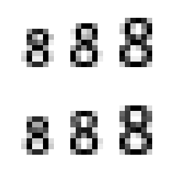
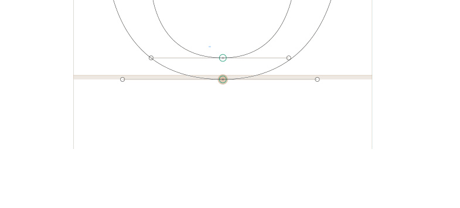
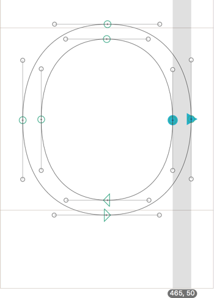
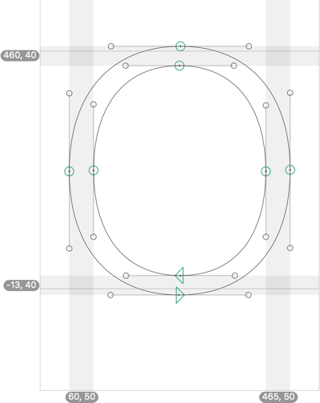
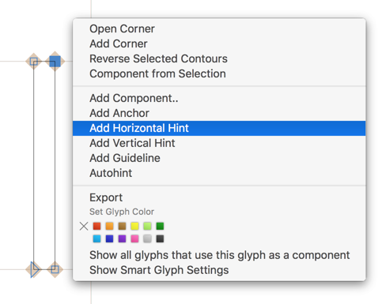
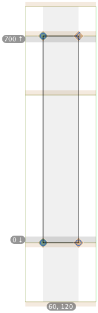
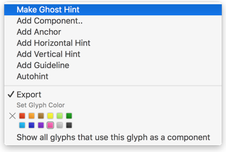

原文: [Hinting: manual PostScript hinting](https://glyphsapp.com/learn/hinting-manual-postscript-hinting)
# ヒンティング：手動Post­Scriptヒンティング

チュートリアル

[ ヒンティング ](https://glyphsapp.com/learn?q=hinting)

執筆者: Rainer Erich Scheichelbauer

[ en ](https://glyphsapp.com/learn/hinting-manual-postscript-hinting) [ fr ](https://glyphsapp.com/fr/learn/hinting-manual-postscript-hinting) [ zh ](https://glyphsapp.com/zh/learn/hinting-manual-postscript-hinting)

2022年7月29日更新（初版公開：2013年4月28日）

多くのご要望にお応えして、ヒントを手動で挿入する方法についてのチュートリアルです。免責事項：繰り返しになりますが、これはかなり高度な内容です。警告しなかったとは言わせませんよ。

## ヒンティングはそもそも必要か？

ヒンティングはデリケートな問題です。重要性が増していると言う人もいれば、減っていると言う人もいます。そして、Appleデバイスでのアンチエイリアスフォントレンダリングに関しては、彼らは正しいかもしれません。MacやiOSマシンは、その場で独自のヒンティングを行います。しかし、他のシステムでは、少なくとも特定のフォントサイズまでは、依然としてヒントが適用されます。例えば、Windowsシステムや、InDesignやAcrobatのようなAdobeアプリです。そして、もしフォントにヒントを付けるなら、正しく行うべきです。

ほとんどの場合、[自動ヒンティング](/tutorials/hinting-postscript-autohinting)で十分です。しかし、一部の文字は低解像度で適切に整列しないか、単に素晴らしく鮮明ではなく、非常に悪く見えることがあります。これは`eight`の例です。上の行は自動ヒンティングされたグリフで、特に中間のレンダリングで歪んで見えます。下の行には、同じ`eight`が、今回は手動でヒンティングされたものが表示されています。数字がより対称的に、より垂直にレンダリングされていることに注目してください。

覚えておいてください、すべてのフォントが満足のいくようにヒンティングできるわけではありません。理想的には、あなたのフォントはできるだけ規則的な特徴を持ち、つまり、ステム幅を多用し、すべてのオーバーシュートがほぼ同じサイズであるなどです。しかし、もしグランジスタイルのフォントや、スキャンした手書きフォントのような非常に不規則なデザインを持っているなら、そもそもヒンティングしないことを検討すると良いでしょう。

## フォント全体の設定

まず、「フォント情報」の「マスター」セクションで、標準のステム幅とアラインメントゾーンを設定する必要があります。これについては、[オートヒンティングに関するチュートリアル](/tutorials/hinting-postscript-autohinting)ですでに説明しましたので、ここでは繰り返しません。今確認する必要があるのは、整列させる必要のあるすべてのオーバーシュートと水平ステムが、それらのゾーンに達していること、それ以上でもそれ以下でもないことです。

## オートヒンティング

最初のステップは、オートヒンティングを有効にしてフォントを書き出すこと（Cmd-E）です。そして、InDesignの低解像度、つまり低いズームレベルでフォントをテストします。そのためには、[Adobe Fontsフォルダ](/tutorials/testing-your-fonts-in-adobe-apps/)を使用するのが非常に良い考えです。

必然的に、うまくいかないように見えるいくつかの文字に出くわすでしょう。手動でヒンティングしなければならないのは、これらの文字です。非常に可能性が高い候補は、斜めの線を持つ文字です。

## 個々のグリフを手動でヒンティングする

そこで、それらのグリフに入り、オートヒンターができなかったことを手動で行う必要があります。さて、集中してください。

まず、すべての極値ノードが設定されていることを確認してください。おそらく、「パス > 極値点を追加」を選択したいと思うでしょう。描画ツール（P）に切り替えて、アウトラインセグメントをShiftキーを押しながらクリックして、極値にノードを挿入することもできます。[良いパスを描く方法についてのチュートリアル](/tutorials/drawing-good-paths)を読んで、極値点について詳しく調べてください。

第二に、水平ステムを特定します。アラインメントゾーンに達する水平なデザイン要素を探します。例えば、セリフ、tやfのクロスバー、またはoの上部カーブが少し水平になる部分などです。そのような要素ごとに、その上下の極値ノードを両方選択し、右クリックしてコンテキストメニューを開き、「水平ヒントを追加」を選択します。Glyphsは、極値点を包含する水平ヒントを適用します。

第三に、垂直ステムを探します。水平ステムと同じ話ですが、今回はアラインメントゾーンは関係ありません。繰り返しになりますが、2つの極値を選択し、右クリックしてコンテキストメニューから「垂直ヒントを追加」を選択します。

例えば、手動でヒント付けされたoは、このようになります。

## ゴーストヒント

時々、グリフがゾーンに達しているのに、ヒントを付けたいと切望する水平要素がないことがあります。このような劇的な状況のために、ヒンティングの賢明な発明者たちはゴーストヒントを発明しました。要するに、ゴーストヒントは、「OK、ここにはセリフはないけど、まるでセリフであるかのように振る舞い、アラインメントゾーンに自分を整列させるよ」と言います。

ゴーストヒントを追加するには、上または下の極値ノードを正確に1つ選択し、コンテキストメニューから「水平ヒントを追加」を選択します。

ボトムゾーン用のゴーストヒントと、トップゾーン用のゴーストヒントがあります。ゴーストヒントが選択されていると、下のグレーの情報バッジは、どちらのヒントを持っているかを示します。通常、Glyphsはどちらが必要か正しく推測します。しかし、もし変更する必要がある場合は、ボタンのいずれかをクリックすれば、その向きが切り替わります。

この古典的な例は、大文字のサンセリフIです。これがどのように見えるか、上下のゴーストヒントに注目してください。

エックスハイト、アセンダー、キャップハイトのようなトップゾーンには*トップ*ゴーストヒントを、ベースラインやディセンダーのようなボトムゾーンには*ボトム*ゴーストヒントを必ず設定してください。この方法で、サンセリフの文字が低解像度で互いに適切に整列することを確認できます。

ちなみに、既存の水平ヒントをゴーストヒントに変換するには、ヒントの隣にあるグレーの数字バッジを右クリックし、「ゴーストヒントを作成」を選択します。

## 再度書き出す

さて、フォントを再度書き出すときは、オートヒンティングがオンになっていることを確認してください。オートヒンティングは、手動で設定されたヒントがないすべてのグリフに適用されます。これは、グリフを手動でヒント付けすることを選んだら、そのグリフ内のすべてのヒント、垂直、水平、ステム、ゴーストヒントを*すべて*行う必要があることを意味します。手動でヒント付けされたグリフと自動でヒント付けされたグリフは、同じフォントファイル内で平和に共存します。

## マルチプルマスターの素晴らしさ

もし円と三角形を常にノードにアタッチするようにすれば、最初のマスターにヒントを付けるだけで済みます。パスがポイント互換性を持っていれば、それはとにかく必要なことですが、Glyphsは自動的にすべてのインスタンスにヒントを適用します。素晴らしい！

---

更新履歴 2021-11-11: 古い警告（ヒントの置換に関する）を削除しました。（Ramiro氏に感謝。）

更新履歴 2016-02-19: Glyphs 2向けに更新しました。

更新履歴 2020-07-24: パスツールの名前を描画ツールに変更しました。

更新履歴 2022-07-29: タイトル、軽微なフォーマットを更新しました。

## 関連記事

[すべてのチュートリアルを見る →](https://glyphsapp.com/learn)

*   ### [ヒンティング：TrueTypeの自動ヒンティング](hinting-truetype-autohinting.md)

チュートリアル

[ ヒンティング ](https://glyphsapp.com/learn?q=hinting)

*   ### [ヒンティング：PostScriptの自動ヒンティング](hinting-postscript-autohinting.md)

チュートリアル

[ ヒンティング ](https://glyphsapp.com/learn?q=hinting)

*   ### [ヒンティング：手動でのTrueTypeヒンティング](hinting-manual-truetype-hinting.md)

チュートリアル

[ ヒンティング ](https://glyphsapp.com/learn?q=hinting)