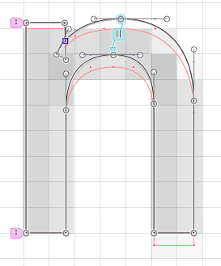
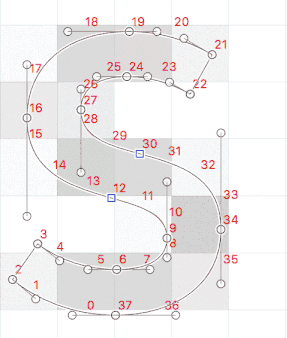

原文: [Hinting: manual TrueType hinting](https://glyphsapp.com/learn/hinting-manual-truetype-hinting)
# ヒンティング：手動TrueTypeヒンティング

チュートリアル

[ ヒンティング ](https://glyphsapp.com/learn?q=hinting)

執筆者: Rainer Erich Scheichelbauer

[ en ](https://glyphsapp.com/learn/hinting-manual-truetype-hinting) [ fr ](https://glyphsapp.com/fr/learn/hinting-manual-truetype-hinting) [ zh ](https://glyphsapp.com/zh/learn/hinting-manual-truetype-hinting)

2020年9月1日更新（初版公開：2020年7月21日）

TrueTypeヒンティングは、画面最適化の聖杯です。CFF/PostScriptよりも、画面でレンダリングされるグリフのシェイプをより細かく制御できます。より複雑ですが、ファイルサイズも効率的で、コツをつかめばかなり迅速に行うことができます。

## ヒントするかしないか

ヒンティング、またはTrueType（TT）ヒンティングがよく呼ばれる「インストラクショニング」に入る前に、私のヒンティングのマントラを繰り返させてください。ヒンティングは、*アウトラインを歪ませて*、ピクセルグリッドにより良く収まるようにする技術です。これをよく考えてください。ヒントは、シェイプを保持するためでは*ありません*。それどころか、ヒントはシェイプを伸ばし、潰し、押し付けて、任意の低解像度フォントサイズのピクセルに合わせます。ポイントは、よりシャープで、より鮮明なピクセル画像で可読性を維持することです—シェイプの忠実性を犠牲にして。言い換えれば、*フォントを非常に低いピクセルサイズで可読性を保つことが意味をなす場合にのみ、フォントにヒントを付けてください。*

もし問題のフォントにとって、可読性よりも*文字のシェイプの保持*が重要なら、ヒントは付けないでください。ディスプレイフォント、スクリプトフォント、[複雑なアウトライン](creating-fonts-with-complex-outlines.md)、[アイコンフォント](creating-an-icon-webfont.md)にはヒンティングは必要ありません。ヒントなしのフォントは、アンチエイリアシングをより多く使用し、シェイプをより良く保持しますが、非常に低い解像度では読みづらくなります。

私たちのフォントの鮮明さと可読性が、アウトラインを歪ませることで利益を得るかもしれないと仮定しましょう。なぜそれをTTヒントで行いたいのでしょうか？要するに、*フォントがWindowsでの使用を意図している場合*です。

TTヒンティングは、Androidデバイスでも違いを生む可能性があります。しかし、Androidはフォントがヒントなしの場合でも、その場で最適化を行います。したがって、もしAndroidデバイスに対応しているなら、ヒントなしのフォントを出荷しても問題ないかもしれません。Appleデバイスでは、TTヒンティングは全く使用されません。ですから、もしあなたのフォントがMacやiPhoneでしか使用されないなら、ヒンティングをする必要はありません。

さて、あなたのフォントは対象になりますか？はい？では、読み進めてください。

## 自動対手動TTヒンティング

PostScript（PS）ヒンティングを行う場合、通常はオートヒンティングアルゴリズムにフォント全体を任せ、うまく機能しないグリフがある場合にのみ手動で介入することを思い出してください。言い換えれば、PSでは、手動でヒント付けされたグリフと自動でヒント付けされたグリフの両方を持つことができます。

TTヒンティングではそうはいきません。TTヒントは技術的により複雑で、[CVT](https://docs.microsoft.com/en-us/typography/opentype/spec/CVT)、[prep](https://docs.microsoft.com/en-us/typography/opentype/spec/prep)、[fpgm](https://docs.microsoft.com/en-us/typography/opentype/spec/fpgm)と呼ばれる特別なテーブルに追加のフォント全体の情報を設定する必要があります。要するに、オートヒンティングと手動TTヒンティングは、これらのテーブルの非常に異なるバージョンを作成します。つまり、TrueTypeの領域内では、オートヒンティングと手動ヒンティングは互換性がなく、同じフォント書き出しで両方を組み合わせる方法はありません。

誤解しないでください。`.glyphs`ファイルに自動と手動の両方のヒンティング情報を持つことは*できます*。しかし、書き出すときには、TTFでどちらを使いたいかを選択する必要があります。「オートヒント」オプションをオンにすれば、TTFオートヒントが得られ、それ以外のものは得られません。オフにすれば、手動のヒントが得られ、それ以外のものは得られません。

## ファイルサイズの懸念

言うまでもなく、ヒンティング情報はTTFファイルのスペースを占有します。単純なサンセリフフォントで簡単な比較を行ったところ、これらの結果が得られました。

*   ヒントなし：15 KB
*   手動でヒント付け、水平ヒントのみ：18 KB（+20%）
*   TTFオートヒント：24 KB（+60%）

もちろん、フォントによって結果は異なります。しかし、同じパターンが何度も見られます。第一に、ヒンティングなしが最も小さいファイルサイズになります。まあ、当たり前だと言うかもしれませんが、その通りです。しかし、*大幅に*小さいです。したがって、ヒンティングが問題にならない環境向けにフォントを作成している場合は、ヒントなしのフォントファイルのセットを検討してください。そうすれば、Web管理者はあなたを愛するでしょう。第二に、手動ヒントはオートヒンティングよりも大幅に少ないスペースしか占有しません。大きな要因は、手動ヒンティングでは水平ステムのみを考慮するように選択できるのに対し、オートヒンティングのサイズを削減するのはより難しいことです。

したがって、ファイルサイズが小さく、ファイルに入るものをより細かく制御できることが、手動ヒントの利点です。しかし、それにはより多くの作業という代償が伴います。そして、この長いチュートリアルを読み通さなければなりません。申し訳ありません。しかし、私たちの生活を少し楽にする2つのこともあります。読み進めてください。

## ヒンティングの基本

これはPSとTTの両方のヒントに当てはまります。マルチプルマスター設定では、*1つのマスターにのみヒントを付ける必要があります*。デフォルトでは、それは最初のマスター、つまり「ファイル > フォント情報 > マスター」のリストの先頭にあるものです。

状況によっては、それが最善の選択ではないかもしれません。最初のマスターが極細で超コンデンスなデザインだと想像してください。ヒンティングのために必要なポイントの選択が難しくなるかもしれないので、ヒントには中間のウェイトのマスターを選びたいと思うでしょう。その場合は、「ファイル > フォント情報 > フォント」で`Get Hints From Master`カスタムパラメータを追加し、ヒントを付けやすいマスターを選びます。

あなたの最初のマスター、またはカスタムパラメータで選択したどのマスターも、「メインマスター」になります。それは違いを生むでしょう。後でわかります。

そして、編集ビューでPostScriptアウトラインにTTヒントを追加できます。*二次曲線に変換する必要はありません。* 実際には、PSアウトラインを保持し、Glyphsに変換を任せる方が良いです。パスは書き出し時に二次曲線に変換され、各フォントは可能な限り最高のTTカーブを得ます。そして、TTカーブをいじったり、互換性を保ったりする手間を省けます。

まとめると、ヒントを付けたいマスターを選び、PSアウトラインはそのままにしておきます。

## フォントレベルのヒント：ゾーンとステム

PSヒンティングと同様に、各マスターのステムとゾーンを定義することから始めます。定義するステムとゾーンは、すべてのマスターで*数と順序が同じ*である必要があります。そうしないと値を補間できません。マスターにステムやゾーンを追加すると、実際にはフォントレベルで追加され、実質的にすべてのマスターに一度に追加されるため、これは問題にはならないはずです。*メイン*マスターのゾーンとステムの定義が最も重要です。一部の設定はそこからしか取得できないためです。

### TrueTypeゾーン

ゾーンは、フォント全体でシェイプの垂直方向の配置を統一するのに役立ちます。アウトラインが画面のピクセルにグリッドフィットされると、同じゾーン内にある垂直方向のシェイプの極値は、通常はピクセルのエッジである同じ高さに丸められます。ヒント付けされ、グリッドフィットされたフォントの一貫した見た目のためには、ベースライン、ディセンダー、アセンダー、ショルダーの高さ、数字の高さ、ナビラの高さ、キャップの高さ、レカの高さ、スモールキャップの高さなど、デザインにとって意味のある垂直メトリクスにゾーンを設定したいと思うでしょう。

ゾーンを追加するには、「ファイル > フォント情報 > マスター」に進み、新しいカスタムパラメータを追加し、プロパティとして`TTFZones`を選び、その値をクリックして設定を開きます。

もしすでにPostScriptヒンティング用にゾーンを設定しているなら、歯車メニューから「Get PS Zones」を選ぶことで、それらをTTゾーンに複製できます。あるいは、プラスとマイナスのボタンで独自のゾーンを追加・削除できます。ゾーンの数に制限はなく、ほぼ好きなだけ持つことができ、グリフのセットごとに異なるゾーンのセットを持つことができます。ゾーンを追加したら、その設定を編集します。

*   **位置とサイズ：** 何よりもまず、ゾーンはこれらの主要な値によって定義されます。トップゾーンは正のサイズを持ち、ボトムゾーンは負のサイズを持ちます。トップゾーンは、エックスハイト、ショルダーの高さ、キャップの高さ、ナビラの高さなど、シェイプの上部の垂直方向の極値のためのものです。ボトムゾーンは、ベースライン、ディセンダー、または分子、下付き文字、上付き文字などの小さな数字の下部など、シェイプの下端を捉えるためのものです。

位置とゾーンによって定義される領域が、ラスタライザによって1つのピクセルエッジに平坦化されるべきすべてのビットを包含することを確認してください。例えば、エックスハイトでは、位置をxの高さに設定し、サイズが小文字のoのオーバーシュートなど、すべてのオーバーシュートを捉えるのに十分な大きさであることを確認してください。もしPSゾーンに慣れているなら、これはほぼ同じです。

*   **名前：** オプションとして、ゾーンに名前を付けることもできます。名前は任意ですが、特に多くのゾーンを定義することになった場合は、できるだけ説明的に保つのが良い考えです。後でUIの他の場所でポップアップメニューから選択する必要があるときに、それを認識する必要があります。ゾーン名の任意性の一つの例外は、エックスハイトゾーンの`xHeight`です。なぜなら、これはグリッドフィッティングで異なって扱われるからです。小さいサイズでは、この名前のゾーンは他のゾーンよりも切り上げられる可能性が高くなります。

*   **整列：** *整列*オプションを使って、ゾーンを別のゾーンにリンクさせることができます。もしゾーンが別のゾーンに整列している場合、*ゾーンの位置間の距離*が丸められ、そのゾーンに適用されます。これにより、フォントをピクセルサイズごとにステップスルーさせたとき、より一貫した遷移が得られます。これは、互いに非常に近い高さ、場合によっては重なっている高さで、組版で隣り合って表示される可能性があり、低解像度のピクセルレンダリングで高さが大きく異なると問題と見なされる可能性がある場合に使用します。整列されたゾーンは、差が半ピクセル未満であれば同じ高さで表示され、半ピクセル以上であれば1ピクセル離れて表示されます。

ラテン文字の書体デザインでは、唯一意味のある適用例は、スモールキャップの高さをエックスハイトにリンクさせることです。おそらく、アセンダーをキャップハイトにリンクさせることもありますが、後者は通常問題にはなりません。

*例：* エックスハイトとスモールキャップは個別にピクセルグリッドに丸められ、異なるサイズで一方のゾーンが切り上げられたり切り下げられたりする一方で、もう一方のゾーンは異なるサイズで切り上げられたり切り下げられたりします。その結果、PPM 12ではエックスハイトとスモールキャップの高さは同じになり、PPM 13では2ピクセル離れ、PPM 14では1ピクセル離れ、PPM 15では再び同じになります。特にピクセルサイズ12と13の間のジャンプは注目を集めすぎ、可読性を損ないます。したがって、スモールキャップの高さの*整列*設定をエックスハイトに向けることにします。これで、ゾーンはPPM 13まで同じピクセル高になり、PPM 14以上では1ピクセル離れます。

*   **ゾーンの微調整：** デルタアイコン（Δ）を介して、特定のPPMサイズとインスタンスに対してゾーンを1ピクセル上下にシフトできます。フォントをヒント付けした後、または少なくとも大部分をヒント付けした後、ウォーターフォールでテストし（下記、*ヒント付きTTFのテスト*参照）、ゾーンを大きくしたり小さくしたりしたい場所を決定します。それぞれのフィールドを繰り返しクリックして、利用可能なオプション（*上にシフト*（上矢印）、*下にシフト*（下矢印）、*変更なし*（空のフィールド））を順に切り替えます。通常、このような丸めはほんの少ししか必要ありません。デルタアイコンはメインマスターでのみ利用可能です。

*   **フィルタ：** 一番右の列にある地球儀のアイコン（🌐）を介して、グリフフィルタを追加できます。これは、特定のグリフでのみゾーンが必要な場合に意味があります。例えば、ラテン文字の小文字でのみエックスハイト、ディセンダー、アセンダーが必要な場合、ラテン文字、キリル文字、ギリシャ文字の大文字でのみキャップハイトが必要な場合、アラビア文字でのみナビラが必要な場合、グルムキー文字とデーヴァナーガリー文字でのみショルダーの高さが必要な場合、名前に`.lf`を含む数字でのみ数字の高さが必要な場合などです。グリフ名、カテゴリ、サブカテゴリ、スクリプト（書記体系）でフィルタリングでき、複数のフィルタを組み合わせることができます。プラスボタンをOptionキーを押しながらクリックすると、より洗練された論理的なオプションが得られます。地球儀アイコンはメインマスターでのみ利用可能です。

### TrueTypeステム

ステムは、低解像度でのストロークの太さの表示サイズを統一するのに役立ちます。ラスタライザが、同じステムヒントが適用された異なるアウトライン部分を見つけると、それらを同じピクセル数で表示しようとします。これにより、低解像度で類似したステムが異なるサイズに丸められる状況を防ぐことができます。例えば、小文字のサンセリフのcを想像してください。通常、上部と下部は同じ太さにしたいものです。あるPPMサイズでは、下部はピクセルグリッドにうまく収まり、3ピクセルで表示されますが、上部は2ピクセルでしか表示されません。1ピクセルの違いだけだと言うかもしれませんが、その場合、それは50%の違いです。両方の部分に水平ステムヒントを適用することで、両方が同じピクセル数で表示されるようになります。

通常は、少数のステムが望ましいです。すべての可能なストロークの太さを記述するために何十ものステムを作成するよりも、類似したステムの良い平均値を見つける方が良いです。そうすれば、類似したステムは低解像度で同じピクセル数に丸められます。

ステムを追加するには、「ファイル > フォント情報 > マスター」に進み、カスタムパラメータ`TTFStems`を追加します。その値をクリックして設定を開きます。

もしすでにPostScriptヒンティング用にステムを設定しているなら、歯車メニューから「Get PS Stems」を選び、それらをTTステムとして複製できます。あるいは、プラスとマイナスのボタンで独自のステムを追加・削除できます。ステムを追加したら、そのプロパティを編集できます。

*   **方向：** ヒントは、↔︎水平方向または↕︎垂直方向のどちらかにスナップできます。方向を切り替えるには、左の列にある二重矢印ボタンをクリックするだけです。そして今、集中してください。

↕︎*垂直方向*にスナッピングするヒントは、小文字のラテン文字tやCJKの亖のクロスバーのような、*水平*のシェイプ特徴に適用します。そして一方、もちろん、↔︎*水平方向*にスナッピングするヒントは、大文字のラテン文字Dの垂直ステムとカーブや、ヴァイ文字の音節ꔖのような、*垂直*のステムとカーブのためのものです。

あるいは、ラテン文字のLを取ってみましょう。これは、両方を視覚的に説明するのに理想的です。

なぜこんなことを言うのか？まあ、問題は、人々が「水平ヒント」と言って、水平ステムのための垂直にスナッピングするヒントを意味するのか、*あるいはその全く逆*を意味するのかということです。ですから、他の誰かとステムヒントについて話すときは、彼らがあなたと同じことを意味しているか再確認してください。あるいは、鉛筆と紙を用意してスケッチしてください。あるいは、あなたのヒントについて誰とも話さないでください。

*   **名前：** オプションとして、ステムの名前をカスタマイズすることもできます。名前は任意ですが、ゾーンの名前と同様に、できるだけ説明的に保つのが良い考えです。
*   **サイズ：** 単位で測定した平均的なステムの直径。画面レンダリングでは、同様のサイズのステムは統一され、同じピクセル数で表示されます。
*   **ステムの丸め：** デルタアイコン（Δ）を介して、ステムの丸めを定義できます。ゾーンと同様に、最初にステムを設定するときに丸めを決定するのは意味がありません。代わりにウォーターフォールでテストし、その時に丸めを決定します。インターフェースはゾーンと同じように機能します。あるPPMサイズで、あるウェイトの文字が濃すぎますか？そのステムを切り捨ててください。もし薄く見えるなら、それぞれのステムを切り上げてください。**重要：** ステムのデルタは、ClearTypeスタイルのレンダリングモード（Windows GDIとも呼ばれます）でのみ適用されます。
*   **フィルタ：** 地球儀アイコン（🌐）：特定のグリフでのみステムを使用するために、フィルタを追加します。グリフ名、カテゴリ、サブカテゴリ、スクリプト（書記体系）でフィルタリングできます。ステムフィルタはゾーンフィルタと同じように機能します。詳細については上記を参照してください。

### TrueType BlueFuzz

`TTFBlueFuzz`というカスタムパラメータを使用して、すべてのTTゾーンを、その値で指定された量だけ拡張します。指定された量は、各ゾーンの上下両方に追加されます。デフォルトは1ユニットです。

パラメータは、「ファイル > フォント情報 > フォント」、「マスター」、または「インスタンス」のいずれかに追加できます。もしファミリー内のすべての補間で常に同じゾーン拡張が必要だと思うなら、「フォント」に追加してください。「マスター」に追加する利点は、例えば最も軽いマスターでゼロから、最も太いマスターで4まで、それを補間できることです。補間されたインスタンスは、その中間の適切な数値を受け取ります。

これは、ステム値をテストしたり、補間の不正確さを修正したりするのに役立ちます。すべてのマスターで描画がゾーン内にうまく収まっていても、補間されたインスタンスではゾーンから外れることがあります。このような不正確さは、丸め誤差によって発生する可能性があります。ですから、テストし、すべてのインスタンスでゾーンが機能するかどうかを確認し、そうでなければ、少し`TTFBlueFuzz`を追加してください。

## グリフレベルのヒント：インストラクタUI

ユーザーインターフェースを見てみましょう。編集ビューに戻り、文字を入力して開き、TrueTypeインストラクタ（ツールショートカットI）に切り替え、下部のプレビューエリアでスタイルを選びます。メインマスターに留まることを忘れないでください。なぜなら、それがヒントを追加するのに意味のある唯一の場所だからです。

ヒンティング中のグリフは、おおよそこのようになります。

### 歪んでいないアウトラインと歪んだアウトライン

まず、現在選択されているスタイル、ピクセルサイズ、レンダリングインテントを表す2色のアウトラインが表示されます。これらは、グリフの黒いマスターアウトラインに追加で描画されます。

*   **青い**アウトラインは、現在選択されているスタイルの補間され、マージされたアウトラインを示します。これは歪んでいません。言い換えれば、インストラクションとグリッドフィッティングが適用される*前*のアウトラインの状態です。ウィンドウの下端にあるスタイルポップアップで別のスタイルを選択します。ポップアップメニューにアクセスするには、目のシンボルをクリックしてプレビューを有効にする必要があるかもしれません。
*   **赤い**アウトラインは、同じシェイプの歪んだバージョン、つまり、現在のレンダリングインテント（Grayscale、ClearType、またはDirectWrite）とピクセルサイズに応じたインストラクションとグリッドフィッティングの*後*を示します。赤いアウトラインは、実際のMicrosoftコードで描画され、実際のWindowsで使用される正確なアウトラインの歪みです。言い換えれば、Windows用にTTヒンティングを行うときにあなたがしていることは、その赤いアウトラインをモデル化することです。

もちろん、グリフにヒントが（まだ）ない場合、赤と青のアウトラインは同じになります。

### プロのヒント
背景のピクセルプレビューには注意してください。それは単なる概算の例です。赤いアウトラインがWindowsアプリに渡されてから、ピクセルが画面に表示されるまでの間に、まだ多くのいわゆる「フィルタリング」が行われます。フィルタリングプロセスには、ガンマ、カラーモード、透明度など、カスタマイズ可能な要素が非常に多いため、*正確な*ピクセル画像を予測しようとするのは意味がありません。今や、同じフォントがすべてのブラウザやアプリで少し違って見える理由がわかりましたね。

### ピクセルサイズ

グレーの情報ボックスには、「px」とラベル付けされた数値フィールドが表示されます。これは現在のビューのPPMです。PPMは**p**ixels **p**er e**m**の略で、フォントの真のピクセルサイズを表します。これは、1emあたりに何ピクセルが使用されるかを示します。背景のピクセルグリッドでピクセルサイズのプレビューを見ることができ、現在のレンダリングインテントのサンプルレンダリングも表示されます。

例：フォントが1000 UPMを使用しており、現在のピクセルサイズが12 PPMであると仮定すると、1ピクセルは（1000÷12 ≈）83ユニットに相当します。

> PPM数は、ポイントサイズ（pt）とは対照的に、*真のピクセルサイズ*（px）です。もしポイントサイズを知っていれば、1emに何*DTPポイント*（1 pt ≈ 0.3527778 mm）が相当するかわかります。しかし、そのemに何*ピクセル*が使用されるかは、それぞれのレンダリング環境の出力解像度に依存するため、決して確実にはわかりません。同じ画面上でも、2つの異なるアプリで異なるレンダリング解像度を持つことができ、その結果、同じポイントサイズに対して2つの異なるピクセルサイズになることがあります。だからこそ、真のピクセル測定が必要です。

新しい数値を入力することでピクセルサイズを変更できます。あるいは、数値フィールドの隣にある上下のミニボタンをクリックするか、キーボードのピリオド/コンマまたはプラス/マイナスキーを押すことで、ピクセルサイズを順に切り替えることができます。

### レンダリングインテント

Windowsでは、TTフォントのグリフのビットマップ表現は、3つの方法、またはフォントマニアが言うところの3つの*レンダリングインテント*で描画されることがあります。

*   **グレースケール**レンダリングは、各ピクセルに対して水平方向に4倍、垂直方向に4倍のオーバーサンプリングを適用します。これは、各ピクセルが（4 × 4 =）16のピクセル部分に細分化されることを意味します。これらの細分化の中心が、指示されたアウトライン内にいくつ位置するかに応じて、16のグレースケール値のいずれかが、画面上のそれぞれのピクセルを描画するために使用されます。
*   **GDI ClearType**は、Windows XPで導入され、8×1のオーバーサンプリング、つまり水平方向に8倍、垂直方向にはオーバーサンプリングなしを適用します。これは、すべての水平ステムが常に完全なピクセルとして表示されることを意味します。これは非常に細いステムでは問題になる可能性があり、それらははるかに太くなり、丸いまたはほぼ水平なステムでは通常非常にギザギザに見えます。
*   **DirectWrite**は、しばしば「DW」と短縮され、Windows 7以降で使用されており、5×5のオーバーサンプリングを利用します。

水平と垂直のオーバーサンプリングが等しいレンダリングインテントの良い点は、それらを*回転*できることです。したがって、ランドスケープからポートレートへ、そしてその逆へ切り替える必要があり、プロセス全体でテキストの外観を維持する必要がある携帯デバイスに好まれます。一方、GDI ClearTypeレンダリングは、水平方向で非常に高い解像度を提供し、これはサブピクセルレンダリングに最適ですが、回転しないため、デスクトップおよびラップトップデバイスに厳密に結びついています。ある意味で、DirectWriteは良い妥協案です。なぜなら、それはまだ水平方向でかなりのオーバーサンプリング数を持ち、したがってまともなサブピクセルレンダリングを生成でき、同時に最大25のグレーの色合いで非常に良いグレースケールアンチエイリアシングを提供できるからです。

### プロのヒント
GDI ClearTypeはまだWindows開発者がアクセスできますが、Windows 7以降、徐々に使われなくなってきています。今日ではほとんど使われていないため、ClearTypeレンダリングインテントは無視して構いません。もしクライアントがGDI ClearType用にフォントを最適化するように主張するなら、(1)本当に、*本当に*確かか、(2)何を求めているか知っているか、(3)追加料金を支払う意思があるか尋ねてください。少なくとも1と3の答えは「はい」でなければなりません。

### ヒントの方向

グレーの情報ボックス（Cmd-Shift-I）の右端に、波線の二重矢印のシンボルがあります。これはヒンティングの方向、またはヒンティングの向きを示します。 şimdi、集中してください。

*   *垂直*二重矢印は、*水平*ステムを*垂直*にフィットさせるための*垂直*方向のヒントを表します。垂直モードでは、ポイントをゾーンにリンクさせることができます。
*   *水平*二重矢印は、*垂直*ステムを*水平*にフィットさせるための*水平*方向のヒントを意味します。水平モードでは、グリフのLSBとRSBも関与させることができます。サイドベアリングがベースラインと交差する直下に2つの暗い点が表示されます。

### パワーユーザー向けのヒント
すべての水平（LTRまたはRTL）スクリプトに対して、垂直二重矢印に切り替え、デザインの*水平な特徴*、例えば水平ステム、カーブの水平部分、セリフ、垂直ステムの上下の水平線などに*焦点を当ててください*。現代のレンダラーは、垂直ステムを統一するのにかなり優れており、多くの場合、垂直ステムはサブピクセルレンダリングによって処理されます。そして結局のところ、インストラクションはファイルサイズの半分しか占めず、これはWebフォントにとって良いニュースです。ですから、水平モードは無視して構いません。

もし垂直ステムもヒンティングすると、グリフの幅を変更することになり、それが異なるサイズで異なる改行を引き起こす可能性があります。ですから、ウェブサイトをズームインすると、テキストが再フローする可能性が高くなります。

矢印記号をクリックするか、キーボードのXキーを押すことで、向きを切り替えます。他の向きのヒントは、薄暗い灰色で表示されますが、誤って編集することはできません。

## グリフレベルのヒントの挿入

さて、手を汚しましょう。ヒントの目的は、アウトラインを歪ませてピクセルグリッドにより良く収まるようにすることであることを覚えておいてください。

ヒントは、それらがリンクされているポイントに、時系列順に適用されます。順序は重要です。なぜなら、ヒントは互いに積み重なっていくからです。ヒントがアウトライン上のポイントにアタッチされると、そのポイントはヒントが示す動きを実行し、したがって「触れられた」ポイントになります。すべてのヒントが適用された後、残りのすべての「触れられていない」ポイントの位置は、ポイントのインデックス順で最も近い触れられたポイントの間で補間されます。これは時々IUP、または*Interpolate Untouched Points*（触れられていないポイントを補間する）命令と呼ばれます。

下部の目のシンボルをクリックしてプレビューエリアを開けば、何をしているかいつでも見ることができます。TrueTypeインストラクタツール（I）がアクティブなとき、プレビューは垂直になり、編集ビューの右端にスナップし、編集ビューの現在のテキストのPPMサイズのウォーターフォールを表示します。現在選択されているスタイルとレンダリングインテントを使用します。区切り線を引くことでプレビューのサイズを変更でき、コンテキストメニューから3つのピクセルズームレベルを切り替えることができます。そして、異なるPPMサイズを表示するために上下にドラッグできます。

一般的に言えば、インストラクションを追加するには、いくつかのノードを選択し、コンテキストメニューからヒントの種類を選ぶか、それぞれのショートカットキーを押します。

### スナップ (A)：

**スナップ**ヒント（ショートカットA）は、以前触れられていなかったポイントの位置を、最も近いピクセルエッジに丸めます。*スナップ*インストラクションを適用するには、1つ以上の触れられていないポイントを選択し、`A`を押すか、コンテキストメニューから*スナップポイント*を選択します。一度に複数のポイントをスナップできます。

ヒントが選択されている間、グレーの情報ボックス（Cmd-Shift-I）でヒントのオプションを管理します。ポップアップメニューから、以下のオプションのいずれかを選びます。

*   *自動：* 垂直モードでは、もしポイントがゾーン内にある場合、そのポイントはゾーンが丸められるピクセルエッジにスナップします。`TTFZones`パラメータでゾーンの丸めを制御できます。*自動*オプションは、通常あなたが望むものです。
*   *ゾーンなし*は、インストラクションにゾーンを完全に無視するように伝えます。その場合、最も近いピクセルエッジのみを探します。
*   *名前付きゾーン*のいずれかは、指定されたゾーンからの距離を保ち、スナップされたノードがゾーンの「間違った」側に落ちないようにします。これは、ギャップを維持することを目的としており、ゾーンにスナップするためではありません。アクセントがベースグリフに触れないようにするために使用します。例えば、小文字iのドットに使用します。これは、`TTFZones`の説明で述べたように、あるゾーンと別のゾーンの*整列*と似た働きをします。

下のシンボルボタンは、インストラクションが引き起こす*丸め*の種類を示します。

*   *丸める*（デフォルト）：ポイントを最も近いピクセルエッジに丸めます。
*   *切り上げる：* ポイントを、上（垂直モード）または右（水平モード）の最も近いピクセルエッジに丸めます。
*   *切り捨てる：* ポイントを、下（垂直モード）または左（水平モード）の最も近いピクセルエッジに丸めます。
*   *丸めなし：* ポイントを元の位置に保ちます。IUPの効果を抑制するのに役立ちます。
*   *ClearType/GDIでのみ丸める：* 丸めると同様ですが、ClearTypeレンダリングインテントでのみです。ClearTypeが完全なピクセルに丸める必要があるグレースケールおよびDirectWriteインテントでアンチエイリアシングを利用したい場合に便利です。GDI ClearTypeには垂直方向のオーバーサンプリングがないため、水平ステムをヒンティングする場合にのみ本当に意味があります。

### ステムヒント (S)：

**ステムヒント**（ショートカットS）は、以前触れられていなかった2つのポイント、または触れられた1つと触れられていない1つのポイントの位置を、TTステムによって決定された距離に丸めます。ステムヒントには、起点と終点があり、移動されるのは終点です。ステムヒントを右クリックし、コンテキストメニューから「反転」を選択することで、起点と終点を反転させることができます。偶数個のポイントが選択されていれば、一度に複数のポイントペアにステムヒントを追加できます。

ゾーンから始まるステムヒントは、ゾーン内の起点となるポイントを自動的にスナップします。ですから、最初にポイントをスナップしてからその上にステムヒントを追加するのではなく、単にステムヒントを追加するだけです。インストラクションツールは、ゾーン内のノードを起点として認識するほど賢いです。

ステムヒントを選択するには、その青いラベルをクリックし、グレーの情報ボックスでオプションを設定します。ポップアップメニューからは、異なるステムを選択できます。

*   *自動：* ヒントは、`TTFStems`パラメータで定義された最も近いステムを使用します。これは、明確に区別できるステムがある場合に最適なオプションです。
*   *名前付きステム：* メニューから任意のステムを選んでください。表示される名前は、`TTFStems`パラメータのステム定義に対応します。これは、`auto`モードが間違った結果を出すと思われる場合にのみ行ってください。
*   *ステムなし：* ターゲットポイントはグリッドにスナップされず、起点ノードからの距離のみが保持されます。つまり、ターゲットポイントは、起点ノードも移動した場合にのみ移動します。これは、中程度の（あまり小さすぎない）ピクセルサイズで、より高いシェイプの忠実度を目指す場合に最適なオプションです。あるいは、結果として生じるレンダリング環境での歪みがひどすぎると感じる場合にもです。

そして、メニューの下のアイコンはヒントのオプションを表します。

*   *丸める：* ターゲットポイントを最も近いピクセルエッジに丸めます。

*   *切り上げる：* *ステムサイズ*を切り上げます。つまり、ターゲットポイントを、起点から遠い方のピクセルエッジにスナップします。もしステムヒントが下を向いているなら、それは下になります。

*   *切り捨てる：* *ステムサイズ*を切り捨てます。つまり、ターゲットポイントを、起点に近い方のピクセルエッジにスナップします。もしステムヒントが下を向いているなら、それは上になります。

*   *丸めなし*（デフォルト）：ステムをピクセルエッジに丸めませんが、現在のレンダリングインテントによって提供されるオーバーサンプリングのエッジには、依然としてそのサイズを丸めます。

*   *GDI ClearTypeでのみ丸める*（Aシンボル）：丸めるオプションと同様ですが、GDI ClearTypeレンダリングインテントでのみです。もしステムがゾーンに隣接していない場合、このオプションはステムの少なくとも一方の端を最も近いピクセル境界に揃えるのに役立ちます。これは、Eとeの中央のバーに便利で、Interpolate (G)命令と組み合わせるのが最善です。
    

`TTFStems`パラメータから取得したステム幅は、それぞれのレンダリングインテントのオーバーサンプリングに応じて丸められます。つまり、水平ステムはClearTypeでは完全なピクセルに、グレースケールでは4分の1ピクセルに、DirectWriteでは5分の1ピクセルに丸められます。それを上書きしないために、ステムは丸められるべきではありません（*丸めなし*オプションで）。完全なピクセルエッジに丸められないステムを持つことは、ステムの少なくとも一方の側にグレーの境界線ができることを意味します。結果として生じるレンダリングは少しシャープさが欠けますが、デザインのディテールをはるかに良く保持します。そして、アウトラインの歪み、例えばカウンターの崩壊などの問題を少なくします。

3本の水平ステムがありますか？3つのステムヒントすべてをShiftキーを押しながら順番にクリックして選択し、右クリックしてコンテキストメニューから「三重ヒントを作成」を選びます。ステムヒントは紫色に変わり、それらが今接続され、最悪の状況でも少なくとも1ピクセルの距離を保とうとすることを示します。

### シフト (F)：

**シフト**命令（ショートカットF）は、触れられたポイントの動きを、触れられていないポイントに転送します。これにより、グリフの2つの部分が同じ歪みを実装することを確認できます。言い換えれば、ターゲットポイントを、プライマリポイントがシフトされたのと同じようにシフトさせます。シフト命令を適用するには、触れられたポイントと触れられていないポイントを選択し、Fキーを押すか、コンテキストメニューから「シフト」を選択します。選択範囲に1つの触れられたポイント（起点）と他の触れられていないポイント（ターゲットポイント）があれば、同じ起点を持つ複数のシフト（F）命令を一度に追加できます。

オプションとして、ステムやゾーンは選択できませんが、依然として配置は選択できます。

*   *丸める：* ターゲットポイントを最も近いピクセルエッジに丸めます。
*   *切り上げる：* ターゲットポイントを上の最も近いピクセルエッジに丸めます。
*   *切り捨てる：* ターゲットポイントを下の最も近いピクセルエッジに丸めます。
*   *丸めなし*（デフォルト）：転送された動きをそのまま保持します。これは99.9%の場合に望ましいです。
*   *GDI ClearTypeでのみ丸める：* 丸めると同様ですが、GDI ClearTypeでのみです。

良い例：ラテン文字の小文字のサンセリフnの脚。左の脚をベースラインゾーンにスナップしますが、ショルダーにステムヒントを追加した後、もう一方の脚が同期から外れます。

これは、パスの線に沿って、左下のスナップ（A）命令の効果が、上のステム（S）命令によって中断されるために起こります。したがって、右の脚では、続くIUP（触れられていないポイントの補間）は、スナップ（A）命令ではなく、ステム（S）命令によって引き起こされた歪みを外挿することしかできません。実質的に、スナップ（A）命令は左の脚に限定されます。

そこで、左の触れられた（スナップされた）ポイントから、右の脚のポイントの一つにシフト（F）命令を追加します。

シフト（F）命令は、左脚の動きを右脚に複製し、ターゲットポイントを触れられたポイントにします。この方法で、右脚は常に左脚と同じ動きをします。さらに良いことに、小文字のラテン文字mがあります。

なぜ右側に同じスナップ（A）命令を追加しないのかと尋ねるかもしれません。2つの理由があります。第一に、シフト（F）命令は他のヒントよりもメモリ効率が少し良いです。ですから、シフト（F）ヒントで何かできるなら、常に1、2バイト節約できます。第二に、2番目の命令が誤って異なる丸め方をし、それが事態を大混乱させるリスクが常にあります。我知道、もし両方が同じゾーンにあれば、そんなことは起こらないはずですが、何があるかわかりません。

### 補間 (G)：

**補間**命令（ショートカットG）は、以前触れられていなかったポイントを、元の指示されていないアウトラインと同じく、2つの触れられたポイントに対する相対的な位置に保持します。補間命令を適用するには、2つの触れられたポイントと、3つ目の触れられていないポイントを選択します。次に、Gキーを押すか、コンテキストメニューから「補間」を選択します。

補間（G）ヒントの主な目的は、IUPの望ましくない副作用を修正することです。通常、詰まったアパーチャや消えたカウンターに遭遇するでしょう。そして、補間命令を使用して、この小文字のeのように、中間のステムを（すでに触れられている）外側のステムからの相対的な距離を同じに保つことができます。

オプションとして、ステムやゾーンは選択できませんが、依然として配置は選択できます。

*   *丸める：* ターゲットポイントを最も近いピクセルエッジにスナップします。ターゲットポイントの上にステムヒントを置きたい場合は、これを選択してください。
*   *切り上げる：* ターゲットポイントを上の次のピクセルエッジにスナップします。
*   *切り捨てる：* ターゲットポイントを下の次のピクセルエッジにスナップします。
*   *丸めなし*（デフォルト）：補間された位置を保持し、丸めません。通常、このオプションが必要です。
*   *GDI ClearTypeでのみ丸める：* GDI ClearTypeレンダリングインテントでのみ最も近いピクセルエッジにスナップし、他は影響を受けません。

### 対角線 (D)：

**対角線**（ショートカットD）命令は、A、K、V、W、X、Y、Zのような対角線のステムが、GDI ClearTypeで相対的な角度と比率を保つようにします。対角線（D）ヒントを挿入するには、任意の4つのポイントを選択し、コンテキストメニューから「対角線」を選ぶか、Dキーを押します。

これは、ClearTypeレンダリングの特定の問題を解決します。ClearTypeは、水平方向と垂直方向のオーバーサンプリングに大きな差異があります。垂直方向ではポイントは*完全な*ピクセルエッジにしかスナップできませんが、水平方向ではピクセルの*8分の1*にスナップします。これにより、PPMサイズやウェイトをステップスルーすると、不均一な歪みが生じます。水平方向には滑らかに成長しますが、垂直方向には完全なピクセル単位でしかジャンプしません。対角線（D）ヒントが適用されると、水平方向と垂直方向の成長が同期して保たれます。

対角線（D）ヒントが適用されると、赤いアウトラインの対角線がずっと細くなり、垂直方向と水平方向のサイズが同期して保たれることに注目してください。

対角線（D）ヒントは、GDI Cleartypeレンダリングにのみ有用であり、その市場シェアの縮小を考えると、価値がないかもしれません。技術的に複雑であり、したがってフォントに比較的多くのファイルサイズを追加します。

### デルタ (E)：

**デルタ**命令（ショートカットE）は、ポイントを正確に1ピクセル上下に移動させますが、それは特定の静的フォントスタイル（インスタンス）と特定のPPMサイズでのみです。デルタ（E）ヒントは、他のすべてのヒントが適用された後の、最終的なピクセル補正を意図しています。デルタヒントを追加するには、任意の数のポイントを選択し、Eを押すか、コンテキストメニューから「デルタ」を選択します。次に、1つ以上のデルタヒントを選択し、グレーの情報ボックスのデルタ（Δ）アイコンをクリックし、特定のサイズ/スタイルコンボのボックスを繰り返しクリックして、*1ピクセル上*（緑の上向き矢印）、*1ピクセル下*（青の下向き矢印）、*変更なし*（空のボックス）を切り替えます。

デルタ（E）ヒントは、以下の点に注意してください。

*   可能な限り、控えめに使用すべきです。
*   他のすべてのヒントの後、最後に追加すべきです。
*   バリアブルフォントでは無視されます。そして、
*   垂直ヒンティング（↕︎）でのみ利用可能です。

## ヒンティング戦略

これらのトリックは、TrueTypeヒンティングで役立つことが証明されています。

*   **三次PostScriptカーブを保持する。** 単にPSベジェポイントにヒントをアタッチするだけです。二次曲線に変換したり、パスの方向を反転させたり、アウトラインを特別な方法で準備したりする必要はありません。静的なフォントの書き出しでは、PSからTTへの変換が各補間の理想的なTTパスをカスタムビルドできるため、もしそうすれば逆効果になるでしょう。
*   **キーボードショートカット**（A、S、D、F、G、E、X）を使用して、ヒントを追加し、向きを切り替えます。これらはすべて左手で簡単に届く範囲にあります。もし同じレイアウトを共有しないキーボードをお持ちの場合、つまり、中央の文字行がASDFGで始まらない場合でも、それは中央の文字行の最初の5つのキーです。例えば、フランス語のAZERTYキーボードでは、ASDFGEXの代わりにQSDFGEXです。もし左手でマウスを使用しているなら、右手をキーボードの左端に置いておくことを検討してください。
*   **ゾーンから始める。** できればステム（S）またはスナップ（A）ヒントで。
*   次に、シフト（F）または補間（G）ヒントで**内側に向かって作業を進めます**。
*   デルタ（E）ヒントはできるだけ**避ける**。
*   何をしているか分からない限り、**対角線（D）ヒントは決して追加しない**。
*   **できるだけ少ないヒントを使用する。** グリフのヒンティングを過度に複雑にしない。
*   結合アクセントでは、接続する`_top`または`_bottom`アンカーに最も近いポイントでスナップ（A）から始め、ヒントを接続アンカーが位置するゾーンに関連付けます。例えば、`caroncomb`では、最も低いポイントをスナップし、ヒントのオプションのゾーンポップアップからエックスハイトを選択します。
*   フォントビュー（Cmd-Opt-1）で、スマートフィルタを使用して**アウトラインを持つグリフのみ**を表示します。これらがヒンティングに関連するものです。次に、編集ビューに戻り、フォントビューで選択されたグリフ内をShift-PageUpとShift-PageDownで移動します。コンパクトなMacBookのキーボードでは、Fn-Shift-左/右矢印キーを押します。
*   テストする際は、**GDI ClearTypeは忘れてください。** グレースケールとDirectWriteに集中してください。

### オーバーラップ内のポイント：

TrueTypeインストラクタツール（I）がアクティブなときに表示される*すべての*ノードにヒントを追加できます。オーバーラップ内のポイントも含まれます。静的なフォントの書き出しでは、もちろんパスのオーバーラップは削除されます。幸いなことに、Glyphsは、オーバーラップの削除が実行されると、ヒントを最も近い結果として生じる交差点に移動させるほど賢いです。したがって、これら2つのヒントは*静的フォント*では同等です。

しかし、*バリアブルフォント*では、オーバーラップは削除されません。これらの交差点にアタッチされたヒントは無視されます。したがって、もし静的およびバリアブルフォント用にヒントを付けたい場合は、オーバーラップ内のノードを選んでください。なぜなら、そのノードがOTVARでヒントがアタッチされる実際のノードであり、静的フォントでは、ヒントは結果として生じる交差点に移動されるからです。まとめると、OTVAR用にヒントを付ける際には、これら2つのことを考慮してください。

1.  *デルタヒント*はバリアブルフォントの書き出しでは無視されます。
2.  *交差点*（「余分なノード」）を起点または終点として使用する*ヒント*も同様に無視されます。

## その他のカスタムパラメータ

TTヒンティングに深く入り込むと、かなり…まあ、特別になることがあります。そこで、あなたのTTマニア向けに、いくつかの追加パラメータがあります。

*   `TTFOvershootSuppressionBelowPPM`: これを使えば、オーバーシュートが確実に平坦化されるピクセルサイズを設定できます。適切に設定されたTTFゾーンと組み合わせることで、TTFの外観をかなりうまく制御できます。

*   「フォント情報 > フォント」または「フォント情報 > スタイル」の`TTZoneRoundingThreshold`（後者はもちろん静的フォントで優先されます）：正のゾーンが1ピクセル上に押し上げられる可能性を制御します。値として小さな小数を取ります。通常は0.1や0.2のようなものです。値は、丸められる前にすべての正のゾーンの位置に追加され、エックスハイトゾーン（TrueTypeゾーンでxHeightと名付けられたもの）には2回追加されます。もし設定しない場合、デフォルトの0.09375が想定されます。

*例：* あるフォントサイズでは、スモールキャップゾーンは6.45ピクセル、エックスハイトは5.25ピクセルになります。何も変更しないと、スモールキャップゾーンは6ピクセルの高さに丸められ、スナップされ、エックスハイトは5ピクセルになります。しかし、TTZoneRoundingThresholdを0.2に設定すると、スモールキャップの高さは(6.45+0.2=6.65≈) 7ピクセルになり、エックスハイトは(5.25+2×0.2=5.65≈) 6ピクセルになります。

*   「フォント情報 > スタイル」の`TTMinimumDistance`：デフォルトは0.25です。これは、ヒント付きのステムは、PPMサイズに関わらず、最小でピクセルの4分の1の長さで描画されることを意味します。もし0.25ピクセルのデフォルトに満足できない場合は、このパラメータで独自の最小距離（ピクセル単位）を設定できます。この値は、小さなパーツが消える危険がある小さいピクセルサイズで有効になります。

*   `Prep Table Assembly`、`Fpgm Table Assembly`、`CVT Table`：Glyphsは、ヒント付きのTTFを読み込むと、これらのパラメータを自動的に作成します。これらは、既存のヒンティングをそれぞれアセンブラコードまたは単なる値のリストとして含んでいます。これは、TTFのいくつかの点を修正したいが、既存のTTヒンティングをいじりたくない場合にのみ役立ちます。技術的には、これはGlyphsがサポートする3種類目のTTヒンティングです。

*   `gasp Table`は、TrueTypeフォントの「グリッドフィッティングとスキャン変換手順」を設定します。これは、推奨される画面上のレンダリングの挙動が変化する2つのPPMしきい値を制御します。`gasp`テーブルには、従来のグレースケールとClearTypeサブピクセルレンダラーの両方に対するレンダリングの推奨事項が含まれています。しかし、レンダラーがここに保存されているデータを無視する可能性があることを覚えておいてください。デフォルトのしきい値サイズは8と20 PPMです。2つのしきい値があるため、3つの範囲を区別できます。
    *   *ヒンティングなし＆対称：* 最初のしきい値サイズまで、グリッドフィッティングは適用されず、テキストは可能な限りアンチエイリアシングでレンダリングされます。「非常に小さいサイズでは、グレースケールデバイスでの最良の外観は、通常、ヒントを使用せずにグリフをグレースケールでレンダリングすることで達成できます。」
    *   *ヒンティング＆非対称：* 2つのしきい値サイズの間で、レンダラーはグリッドフィッティングを適用し、グレースケールを抑制することが推奨されます。「中間のサイズでは、ヒンティングとモノクロレンダリングが通常、最良の外観を生み出します。」ClearTypeでは、この問題は非対称的に処理されます。つまり、垂直方向のグリッドフィッティングが適用され、水平方向にはサブピクセルレンダリングが使用されます。
    *   *ヒンティング＆対称：* しきい値を超えると、ラスタライザはグリッドフィッティングを適用し、シェイプをグレースケールでレンダリングするように指示されます。「大きいサイズでは、ヒンティングとグレースケールレンダリングの組み合わせが通常、最良の外観を生み出します。」ClearTypeラスタライザは、対称的なスムージングを適用するように指示されます。つまり、水平方向のサブピクセルレンダリングに加えて、y方向でアンチエイリアシングを使用します。「画面上の表示サイズでは、[…]このWindowsフォントレンダラーの新しい改善により、より滑らかでクリーンな見た目のタイプが生成されます」（出典：*Now Read this: The Microsoft Cleartype Font Collection*, Microsoft 2004, p. 14）。

*   `Keep Overlapping Components`と`Keep Transformed Components`：技術的には、TrueTypeはオーバーラップするコンポーネントと、歪んだ（拡大縮小、傾斜、反転、回転された）コンポーネントをサポートします。必ずしもヒンティングに直接関連しているわけではありませんが、より一般的にTrueTypeに関連しており、ファイルサイズを小さく保つことができるため、Webフォントにとっては意味があるかもしれません。警告：すべての環境が変形したコンポーネントを扱えるわけではないので、これらのパラメータは賢く使用し、広範囲にわたってテストしてください。

## 便利な設定、スクリプト、プラグイン

キャンバス上のどこでもマウスを右クリックして、コンテキストメニューを開きます。

もしTrueTypeインストラクタツール（I）がアクティブで、いくつかのポイントが選択されている場合、現在の選択に適したヒントを追加するためのオプションが表示されます。選択が何であれ、いくつかの追加のTT関連オプションが表示されます。

*   **オートヒント：** 現在のグリフに対してステム（S）とスナップ（A）ヒントを推測しようとします。シフト（F）、対角線（D）、または補間（G）ヒントは扱えません。出発点として意図されていますが、それ以上ではありません。結果は必ずしも有効なヒンティングではなく、「TrueTypeインストラクションのコンパイル中に問題が発生しました」というエラーが表示されることがあります。しかし、良い出発点にはなり得ますし、一度に多くのグリフを一括処理できます。

*   **ヒントを削除：** 現在のグリフのすべてのTTヒントをクリアします。より洗練されたヒントの削除については、以下のスクリプトを参照してください。

*   **プレビューアドレスを表示：** Webサーバーを起動し、現在のIPアドレスでそのURLを表示します。
    
    それをWebブラウザ、できればWindowsの仮想環境にペーストすると、現在の編集ビューのテキストのPPMウォーターフォールが、現在選択されているスタイルで、数秒ごとに更新されて表示されます。
    

*   **ポイントインデックスを表示：** 結果として得られるアウトラインのオンカーブポイントのインデックス番号を表示します。`TTPreviewAlsoShowOffCurveIndexes`という隠し設定があり、オフカーブを含むすべてのポイントのインデックス番号を表示します。
    
    「ウインドウ > マクロパネル」で`Glyphs.defaults["TTPreviewAlsoShowOffCurveIndexes"]=True`を実行するか、[mekkablueスクリプト](https://github.com/mekkablue/Glyphs-Scripts/)の「App > 非表示のアプリ設定を設定」を使用できます。
    

*   **プレビューを拡大縮小**オプション：*プレビューを拡大縮小しない、プレビューを2倍に拡大縮小、プレビューを4倍に拡大縮小*。編集ビューのプレビューのピクセルズームを設定します。

ヒントをより具体的に削除するには、[mekkablueスクリプト](https://github.com/mekkablue/Glyphs-Scripts/)の「Hinting > Remove TT Hints」を使用します。これにより、特定のタイプと方向のヒントを削除できます。

mekkablueスクリプトの「Hinting > Set TT Stem Hints to Auto」および「Set TT Stem Hints to No Stem」は、選択されたグリフ内のすべてのステム（S）ヒントを、それぞれのステムオプションに切り替えます。「No Stem」は、Adobeアプリでのバリアブルフォントの外観を良くしますが、「Auto」はよりシャープなレンダリングを提供し、これは通常Windows Officeアプリで見栄えが良いです。

また、mekkablueスクリプトには、フォントをWebフォントとして書き出した後に、「Test > Webfont Test HTML」というスクリプトがあります。このスクリプトは、現在のフォントの有効なすべてのスタイル用のHTMLを、最新のWebフォント書き出しフォルダに書き込み、そのフォルダをFinderで開いてくれます。Windowsブラウザでフォントをテストするのが簡単になります。

---

更新履歴 2020-09-16: 「Position & size」セクションに「are meant」という単語を追加し、いくつかの誤字を修正しました。「TrueType BlueFuzz」セクションに欠けていた単語「number in between」を追加しました。その他の軽微な修正と書き直し。

更新履歴 2020-11-03: 軽微な誤字と表現の修正（NathalieとBenに感謝！）。

更新履歴 2022-07-29: タイトル、軽微なフォーマットを更新。

更新履歴 2023-01-20: 7月に誤って削除した部分を再構築。

## 関連記事

[すべてのチュートリアルを見る →](https://glyphsapp.com/learn)

*   ### [ヒンティング：PostScriptの自動ヒンティング](hinting-postscript-autohinting.md)

チュートリアル

[ ヒンティング ](https://glyphsapp.com/learn?q=hinting)

*   ### [ヒンティング：手動でのPostScriptヒンティング](hinting-manual-postscript-hinting.md)

チュートリアル

[ ヒンティング ](https://glyphsapp.com/learn?q=hinting)

*   ### [ヒンティング：TrueTypeの自動ヒンティング](hinting-truetype-autohinting.md)

チュートリアル

[ ヒンティング ](https://glyphsapp.com/learn?q=hinting)