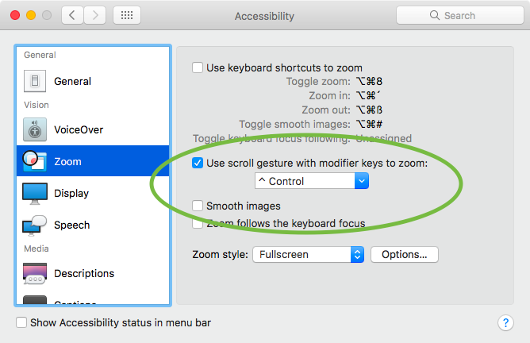

原文: [Hinting: PostScript autohinting](https://glyphsapp.com/learn/hinting-postscript-autohinting)
# ヒンティング：PostScriptオートヒンティング

チュートリアル

[ ヒンティング ](https://glyphsapp.com/learn?q=hinting)

執筆者: Rainer Erich Scheichelbauer

[ en ](https://glyphsapp.com/learn/hinting-postscript-autohinting) [ es ](https://glyphsapp.com/es/learn/hinting-postscript-autohinting) [ fr ](https://glyphsapp.com/fr/learn/hinting-postscript-autohinting) [ zh ](https://glyphsapp.com/zh/learn/hinting-postscript-autohinting)

2022年7月29日更新（初版公開：2012年6月8日）

小さいサイズでの良好な画面レンダリングには、良いヒンティングが必要です。しかし、良いヒンティングはかなり複雑な問題です。したがって、できるだけ自動的に行われるようにしたいものです。いくつかの簡単なルールに従えば、あまり手間をかけずにかなり良い結果を得ることができます。

## ヒンティングができることとできないこと

PostScriptヒンティングは、CFFベースのフォントを低解像度の環境でより一貫性があり、均一に見せるための技術です。これは、ベクターデータに「ヒント」を挿入することによって行われます。ヒントは、ラスタライザ（文字のシェイプのピクセル画像を生成するソフトウェア）が、何か重要なステムであるため、グリフ全体を表示するために利用できるピクセルが少ない場合でも保持する必要があるかどうかを判断するのに役立ちます。

ヒンティングは画面上のシェイプをより良く保持するためのものだと考える人もいますが、実際にはその逆です。ヒンティングはシェイプを*歪ませて*、ピクセルグリッドにより良く収まるようにします。研究によると、シェイプがぼやけたアンチエイリアシングよりも、シャープで一貫性がある方が可読性が向上することが示されています。そして、画面上の文字のよりシャープで一貫した画像こそが、ヒンティングのすべてです。

PostScriptヒンティングは、低解像度で2つの目標を達成することを目指しています。1つ目は、*ステムの一貫した外観*、つまり、類似したステム幅に対して同じ数のピクセルを使用すること。2つ目は、より*一貫した垂直メトリクス*、つまり、シャープなベースライン、エックスハイト、キャップハイトなどです。

PostScriptヒンティングは、グリフの幅を正規化*しません*。したがって、同じ文字を複数回タイプすると、異なるピクセルレンダリングが生じることがあります。例えば、このnを見てください。

これは、同じnを数回タイプしたものを拡大したものです。最初の2つのnは4ピクセルのカウンターを持っていますが、それに続くnは5ピクセルのカウンターを示しています。これは問題ありません。なぜなら、全体の行幅を損なってはならず、すべてのnが4ピクセルのカウンターを持つと行が短すぎ、すべてのnが5ピクセルのカウンターを持つと長すぎるからです。

## ヒンティングはそもそも必要か、そして可能か？

「オートヒンター」と呼ばれるソフトウェアにフォントを分析させ、それらのヒントを自動的に挿入させることができます。そのようなオートヒンターはGlyphsに内蔵されています。

しかし、フォントをオートヒントにかける前に、自問自答してください。あなたのデザインは、低解像度での均一性を*必要としていますか？*多くのディスプレイデザインやスクリプトデザインは必要としません。意図的に一貫性のないフォントはヒンティング*しないでください*。特に[複雑なアウトライン](creating-fonts-with-complex-outlines.md)に関しては、ヒンティングする意味がありません。

*一貫して繰り返し現れるデザインの特徴*を持つ書体デザインがある場合にのみ、進んでください。例えば、b、d、f、h、i、j、k、l、m、n、p、q、r、t、uのような小文字全体で同じである小文字のステムなどです。

そして、それだけではありません。ヒンティングには特別な要件があります。

*   すべての**パスの方向**が正しい必要があります。「パス > パスの方向を修正」（Cmd-Shift-R）が役立ちます。
*   **極値点**は、少なくともステムヒントを受け取るべきステムには設定されている必要があります。「パス > 極値点を追加」または描画ツール（P）でセグメントをShiftキーを押しながらクリックすると、欠けている極値点が追加されます。
*   あなたのアウトラインは、**複雑でない**必要があります。[特殊効果、インライン、ジグザグ、アウトライン化されたデザイン？](creating-fonts-with-complex-outlines.md)それなら、ヒンティングはありません。
*   あなたのデザインは、一貫したオーバーシュートを持つ**一貫した垂直メトリクス**と、比較的**一貫したステム幅**を備えている必要があります。

もしそうでなければ、[良いパスを描く方法について詳しく読んでください](drawing-good-paths.md)。

## オートヒンティングの設定

一貫した書体デザインがあると仮定しましょう。それは、オートヒンターにその魔法をかけさせることができることを意味します。しかし、オートヒンターは私たちからのいくつかのヒントが必要です。より正確には、2つのものが必要です。代表的な*標準ステム値*と代表的な*アラインメントゾーン*（または略して、*ステム*と*ゾーン*）です。これらは、*グリフレベルのヒンティング*とは対照的に、*フォントヒント*または*フォント全体のヒンティング*とも呼ばれます。オートヒンターが私たちのために挿入することが期待されているのは、後者です。

ステムとゾーンの両方を、「ファイル > フォント情報 > マスター」（Cmd-I）で設定できます。各マスターは独自のステムとゾーンを持っています。なぜなら、それらは補間される必要があるからです。

#### 標準ステム

完璧な標準ステムを設定するには、以下の手順に従ってください。

1.  まず、垂直および水平のステムとボウルの幅を測定し、それぞれ「垂直ステム」と「水平ステム」のフィールドに入力します。水平ステムは、小文字eと大文字Aのクロスバーの太さ、およびセリフの高さです。垂直ステムは、小文字nまたは大文字Hのステムの幅、または大文字Oの垂直部分です。
2.  できるだけ少ない値を取り、互いに近い値は1つの値に統合してください。なぜなら、非常に低い解像度では、類似したステムが同じピクセル数を持つようにしたいからです。最終的には、可能であればHとVの値がそれぞれ2つ以下、できればそれぞれ1つになるようにしてください。非常に悪い場合でも、それらが非常に離れている場合に限り、3つ持つことができます。
3.  複数の値を入力する場合、入力する*最初のステム値*がより重要なので、賢く選んでください。ほとんどの場合、それは小文字のステム幅になりますが、もちろん、フォントにとって最も重要なことは、デザインの意図に依存します。

このステップを、フォント内の*すべてのマスター*で繰り返してください。補間が行われるように、ステム値の数と順序がすべてのマスターで互換性があることを確認してください。

#### アラインメントゾーン

アラインメントゾーンとは、似ているが完全には同じではない高さ（または深さ）を持つ多くのシェイプが達する領域のことです。直線的なエッジ、カップ状のセリフ、丸いシェイプのオーバーシュートを考えてみてください。

低解像度では、これらすべてのシェイプが同じピクセル高で止まるようにしたいものです。言い換えれば、シャープなエッジが欲しく、オーバーシュートは抑制したいのです。シャープなエッジに平坦化（「アライン」）する必要があるものはすべて、ゾーンに包含されなければなりません。

ゾーンには位置とサイズがあります。位置は平らなエッジ、サイズはオーバーシュートの抑制中に平坦化されるべきものすべてを含むのに十分な大きさであるべきです。シェイプは位置に達するか、ゾーンのサイズを超えない範囲で位置を超えます。サイズは、*オーバーシュートが平らなエッジより上に出る場合*（例：エックスハイト、キャップ、スモールキャップ、ショルダー、アセンダーの高さ、または上付き・下付き数字の上部）は*正*であり、*オーバーシュートが平らなエッジより下に出る場合*（例：ベースライン、ディセンダー、または上付き・下付き数字の下部）は*負*であることに注意してください。

1.  *垂直メトリクスが正しく設定されていることを確認してください*：アセンダー、キャップハイト、エックスハイト、ディセンダー。ここに入力される値はオーバーシュートを無視すべきです。もし疑問があれば、ベースラインに近い方の値を選んでください。
2.  もし*スモールキャップ*があるなら、カスタムパラメータ`smallCapHeight`を追加し、その高さをパラメータ値として入力すると良いでしょう。
3.  *インド系およびアラビア語のフォント*の場合、追加のアラインメントゾーンのために`shoulderHeight`パラメータを追加できます。
4.  さて、「アラインメントゾーン」フィールドの隣にある更新ボタン（グレーの丸い矢印）を押してください。Glyphsは、あなたの垂直メトリクスとフォントマスターの実際のオーバーシュートに基づいて値を推測しようとします。オーバーシュートについては、小文字のo、f、g、大文字のO、スモールキャップのo.scなどのいくつかのキーとなるグリフを測定します。これらが存在しない場合、サイズはデフォルトで16になります。
5.  Glyphsがゾーンを正しく推測したか確認するのは良い考えです。グリフをざっと見て、ゾーンから外れているオーバーシュートがないか確認してください。「表示 > メトリクスを表示」（Cmd-Shift-M）オプションを有効にしていると、Glyphsはアラインメントゾーンをベージュ色の領域として表示し、ゾーン内のノードをハイライトします。
6.  ゾーンを調整するときは、できるだけ小さく、タイトに保ってください。経験則として、ゾーンは*25ユニットより大きくすべきではありません。*
7.  *最大6つのトップゾーン*（正のサイズ）と、ベースラインゾーンを含む*6つのボトムゾーン*（負のサイズ）を持つことができます。ゾーンが一つでもある場合、そのうちの一つは*必ず*ベースラインゾーンでなければなりません。
8.  必須の*ベースラインゾーンは、位置ゼロに配置*し、負のサイズを持つ必要があります。
9.  ゾーンは決して重なってはなりません。また、どの2つのゾーンの間にも*少なくとも1ユニットの距離*が必要です。（より正確には、距離は少なくとも1 + 2 × blueFuzzでなければなりません。詳細は後述の*blueFuzz*の章を参照してください。）

繰り返しになりますが、これらのステップをフォント内のすべてのマスターで繰り返してください。ゾーンの数と順序がすべてのマスターで同じであることを確認してください。ゾーンは重なってはならないため、一つのゾーンが補間で他のゾーンを追い越すことは決してありません。

いくつかのヒント：

文字の高さの一貫性を確認するには、*ShowTopsAndBottoms*プラグインを検討してください。「ウインドウ > プラグインマネージャ」経由でインストールし、アプリを再起動した後、「表示 > 上下を表示」で有効にします。これは、ゾーンを超える文字の境界を見つけるのに役立ちます。

Mark Frömberg氏（@mark2mark）が、すべてのゾーンを一度に設定するためのスクリプトを作成しました。[彼のリポジトリ](https://github.com/Mark2Mark/Glyphsapp-Scripts)の「Font > Set Size for Alignment Zones」にあります。

もし「ファイル > フォント情報 > その他の設定 > 細分化」が1以外に設定されている場合（つまり、座標で小数を使用している場合）、各ゾーンのサイズを両方向に1ユニットずつ増やす必要があります。例えば、位置500、サイズ15のエックスハイトゾーンは、位置499、サイズ17に移動する必要があります。ベースラインゾーンのみ、位置ゼロに留まらなければなりません。[mekkablue scriptsリポジトリ](https://github.com/mekkablue/Glyphs-Scripts)には、もし必要なら、まさにそれを達成するのに役立つ「Hinting > BlueFuzzer」というスクリプトがあります。

スクリプトの名前は、後述する`blueFuzz`機能に由来します。同じリポジトリには、「ヒンティング」サブメニューに他にも便利なスクリプトがあります。

## オートヒンティングの適用

さて、準備が整ったので、「ファイル > 書き出し」ダイアログで有効にすることで、実際にオートヒンティングを実行できます。もちろん、PostScriptオートヒンティングはPostScript技術なので、CFFフォントにのみ適用され、TrueTypeフォントには適用されません。したがって、TTFオプションも無効にしたいでしょう。

また、「ファイル > フォント情報 > インスタンス」でオートヒンティングのカスタムパラメータを使って、書き出しダイアログの設定を上書きして、オートヒンティングを強制的にオンまたはオフにすることもできます。

これだけです！実はそれほど悪くありません。

## ヒンティングのテスト

さて、フォントを「オートヒント」オプションを有効にして書き出します。PostScriptヒントを尊重するレンダラーを持つアプリケーションでヒンティングをテストできます。Mac OS Xは一般的にヒンティングを無視するので、[Adobeアプリケーション](testing-your-fonts-in-adobe-apps.md)に頼る必要があります。InDesignをお勧めします。

ピクセルをより良く見るには、Macに内蔵されているスクリーンズームを使用できます。「システム環境設定 > アクセシビリティ > ズーム」に進み、そこで「スクロールジェスチャを使用」オプションをオンにし、「画像を滑らかにする」をオフにします。

 これで、Ctrlキー、またはスクロールジェスチャポップアップで設定した任意の修飾キーの組み合わせを押しながら、スクロールホイールを使ってズームイン・ズームアウトでき、実質的に画面のピクセルを拡大できます。MacBookのトラックパッドでは、2本指で上下にスワイプすることでスクロールできます。

例として、Typejockeysの*Henriette*がInDesignでヒンティング*なし*でどのように見えるかを示します。

同じフォント、同じテキスト、同じアプリですが、今度はヒンティング*あり*です。

テキストがよりくっきりして見え、ぼやけが少なく、ステムや文字の高さがより一貫して見えることに注目してください。

## blueScale

「ファイル > フォント情報 > フォント」で、*オーバーシュートが抑制されるフォントサイズを制御する*ための`blueScale`カスタムパラメータを追加できます。より正確には、`blueScale`はゾーンが平坦化されるPPMサイズを制御します。言い換えれば、どのピクセルサイズでオーバーシュートの抑制が停止するかです。blueScaleサイズ以上では、アラインメントゾーン内のオーバーシュートは少なくとも1ピクセルで表示されます。blueScale値は、(PPMサイズ × 72 ÷ 300 - 0.49) ÷ 240で計算されます。可能な最大PPMサイズは、アラインメントゾーンのサイズに依存します。それは次のように計算されます：(0.49 + 240 ÷ 最大ゾーンサイズ（ユニット単位）) ÷ 72 × 300。

> **注意：** PPMは**P**ixels **p**er e**m**の略で、フォントサイズをピクセル単位で表し、1emを表示するために使用されるピクセル量を意味します。デフォルトでは、1emは1000フォントユニットです。ただし、「ファイル > フォント情報 > フォント > Units per Em」で異なる値を設定できます。PPM値は、72 ppiでのポイントサイズに相当し、これはMac OSとAdobeアプリが非Retinaディスプレイで想定する解像度です。

> **例：** あなたの最大のゾーンは18ユニットの深さです。つまり、理論的には、オーバーシュートの表示は(0.49 + 240 ÷ 18) ÷ 72 × 300 = 57 PPMのサイズまで遅らせることができます。言い換えれば、56 PPMまでのすべてのサイズでオーバーシュートを抑制できます。例えば、40 PPMまでオーバーシュートを抑制し、41 PPM以上のすべてのサイズでオーバーシュートが見えるようにしたいとします。このサイズは、先ほど計算した56/57 PPMより小さいため可能です。つまり、56 PPMまでオーバーシュートを抑制*できます*が、40 PPMまでしか抑制したくないのです。したがって、必要なのは、`blueScale`パラメータを、オーバーシュートを少なくとも1ピクセルで表示すべき最初のピクセルサイズに対応するblueScale値に設定することだけです：(41 × 72 ÷ 300 - 0.49) ÷ 240 = 0.03896。

数学的な数式に怖気づいていますか？問題ありません。ここに、あなたのフォントに適したblueScale値を見つけるのに役立つ便利なチャートがあります（手順は下記）。

| オーバーシュート表示開始PPM（72ppiでのポイントサイズ） | 96ppiでのフォントサイズ（Windows） | 144ppiでのフォントサイズ（Retina） | アラインメントゾーンの最大サイズ | フォント情報 > フォントでのblueScale値 |
| :--- | :--- | :--- | :--- | :--- |
| 20 px | 15 pt | 10 pt | *55 u* | **0.01796** |
| 21 px | 16 pt | 10 pt | *52 u* | **0.01896** |
| 22 px | 16 pt | 11 pt | *50 u* | **0.01996** |
| 23 px | 17 pt | 12 pt | *47 u* | **0.02096** |
| 24 px | 18 pt | 12 pt | *45 u* | **0.02196** |
| 25 px | 19 pt | 12 pt | *43 u* | **0.02296** |
| 26 px | 20 pt | 13 pt | *41 u* | **0.02396** |
| 27 px | 20 pt | 14 pt | *40 u* | **0.02496** |
| 28 px | 21 pt | 14 pt | *38 u* | **0.02596** |
| 29 px | 22 pt | 14 pt | *37 u* | **0.02696** |
| 30 px | 22 pt | 15 pt | *35 u* | **0.02796** |
| 31 px | 23 pt | 16 pt | *34 u* | **0.02896** |
| 32 px | 24 pt | 16 pt | *33 u* | **0.02996** |
| 33 px | 25 pt | 16 pt | *32 u* | **0.03096** |
| 34 px | 26 pt | 17 pt | *31 u* | **0.03196** |
| 35 px | 26 pt | 18 pt | *30 u* | **0.03296** |
| 36 px | 27 pt | 18 pt | *29 u* | **0.03396** |
| 37 px | 28 pt | 18 pt | *28 u* | **0.03496** |
| 38 px | 28 pt | 19 pt | *27 u* | **0.03596** |
| 39 px | 29 pt | 20 pt | *27 u* | **0.03696** |
| 40 px | 30 pt | 20 pt | *26 u* | **0.03796** |
| 41 px | 31 pt | 20 pt | *25 u* | **0.03896** |
| 42 px | 32 pt | 21 pt | *25 u* | **0.03996** |
| 43 px | 32 pt | 22 pt | *24 u* | **0.04096** |
| 44 px | 33 pt | 22 pt | *23 u* | **0.04196** |
| 45 px | 34 pt | 22 pt | *23 u* | **0.04296** |
| 46 px | 34 pt | 23 pt | *22 u* | **0.04396** |
| 47 px | 35 pt | 24 pt | *22 u* | **0.04496** |
| 48 px | 36 pt | 24 pt | *21 u* | **0.04596** |
| 49 px | 37 pt | 24 pt | *21 u* | **0.04696** |
| 50 px | 38 pt | 25 pt | *20 u* | **0.04796** |
| 51 px | 38 pt | 26 pt | *20 u* | **0.04896** |
| 52 px | 39 pt | 26 pt | *20 u* | **0.04996** |
| 53 px | 40 pt | 26 pt | *19 u* | **0.05096** |
| 54 px | 40 pt | 27 pt | *19 u* | **0.05196** |
| 55 px | 41 pt | 28 pt | *18 u* | **0.05296** |
| 56 px | 42 pt | 28 pt | *18 u* | **0.05396** |
| 57 px | 43 pt | 28 pt | *18 u* | **0.05496** |
| 58 px | 44 pt | 29 pt | *17 u* | **0.05596** |
| 59 px | 44 pt | 30 pt | *17 u* | **0.05696** |
| 60 px | 45 pt | 30 pt | *17 u* | **0.05796** |
| 61 px | 46 pt | 30 pt | *16 u* | **0.05896** |
| 62 px | 46 pt | 31 pt | *16 u* | **0.05996** |
| 63 px | 47 pt | 32 pt | *16 u* | **0.06096** |
| 64 px | 48 pt | 32 pt | *16 u* | **0.06196** |
| 65 px | 49 pt | 32 pt | *15 u* | **0.06296** |
| 66 px | 50 pt | 33 pt | *15 u* | **0.06396** |
| 67 px | 50 pt | 34 pt | *15 u* | **0.06496** |
| 68 px | 51 pt | 34 pt | *15 u* | **0.06596** |
| 69 px | 52 pt | 34 pt | *14 u* | **0.06696** |
| 70 px | 52 pt | 35 pt | *14 u* | **0.06796** |
| 71 px | 53 pt | 36 pt | *14 u* | **0.06896** |
| 72 px | 54 pt | 36 pt | *14 u* | **0.06996** |
| 73 px | 55 pt | 36 pt | *14 u* | **0.07096** |
| 74 px | 56 pt | 37 pt | *13 u* | **0.07196** |
| 75 px | 56 pt | 38 pt | *13 u* | **0.07296** |
| 76 px | 57 pt | 38 pt | *13 u* | **0.07396** |
| 77 px | 58 pt | 38 pt | *13 u* | **0.07496** |
| 78 px | 58 pt | 39 pt | *13 u* | **0.07596** |
| 79 px | 59 pt | 40 pt | *12 u* | **0.07696** |
| 80 px | 60 pt | 40 pt | *12 u* | **0.07796** |

> **手順：** まず、オーバーシュートを抑制したいピクセルサイズ（PPM）を一番左の列から知る必要があります。PPMサイズは、非Retina Mac画面でのポイントサイズ、または非Retina画面のAdobeアプリで100%ズーム時のポイントサイズに相当します。参考のために、96 ppi（Windowsアプリ）と144 ppi（MacおよびRetinaのAdobe CC）でのフォントサイズの列を追加しました。次に、「ファイル > フォント情報 > マスター」で最大のアラインメントゾーンが、最大ゾーンサイズの列の値を超えていないことを確認する必要があります。すべてがチェックアウトされれば、一番右の列のblueScale値を、「ファイル > フォント情報 > フォント」のカスタムパラメータとして使用できます。しかし、もし最大のアラインメントゾーンが同じ行の最大サイズより大きい場合は、ゾーンサイズが最大サイズに一致する行まで上に移動し、そこからblueScale値を取る必要があります。

> **例：** Windowsで39 ptまでオーバーシュートを抑制したいとし、「ファイル > フォント情報 > マスター」での最大ゾーンが21ユニットの深さであるとします。2番目の列「96 ppiでのフォントサイズ」で、40 ptと表示されている行を探します。なぜなら、これがオーバーシュートが有効になる最初のサイズだからです。私たちのチャートには、そのようなものが2つあります。どちらでも機能します。もしより大きなPPMのものを選べば、ぎりぎりでオーバーシュートを抑制し、より小さなPPMでは、オーバーシュートが少し早く見えるかもしれません。この例では、もう少しオーバーシュートの抑制を許容できるので、54ピクセルを選びます。しかし残念ながら、可能な最大アラインメントゾーンは19ユニットです。したがって、Windowsで39 ptまでオーバーシュートを平坦に保つためには、フォントのデザインを調整する必要があります。あるいは妥協して、21ユニットの深いゾーンを許容する次の可能なblueScaleを選びます。それは、PPMが49ピクセル、または96 ppiで37 ptの行になります。

## blueShift

`blueShift`は、*小さなオーバーシュートを抑制する*ためのパラメータです（例：小さな数字、下付き文字、セリフのカップなど）。`blueScale`で示されたフォントサイズを超えても抑制されます。単位はユニットで、デフォルト値は7です。セリフのカップや小さなオーバーシュートの深さに1ユニットを加えた値を入力するのが良いとされています。`blueShift`より小さいものは、他の大きなオーバーシュートよりも長く抑制されます。

より正確に言えば、`blueScale`サイズを超えるPPMサイズでは、アラインメントゾーン内のオーバーシュートは以下の場合に表示されます。

*   `blueShift`と*等しいかそれ以上*の場合（通常のオーバーシュート）
*   `blueShift`より*小さい*が、半ピクセルより大きい場合（小さなオーバーシュート）

小さなオーバーシュートは、PPMサイズが500 ÷（オーバーシュートサイズ（ユニット単位））になると、半ピクセルより大きくなります。繰り返しになりますが、簡単なチャートです。

| blueShift（オーバーシュート（ユニット単位）） | 半ピクセル時のPPM（72ppi） | 96ppiでのサイズ | 144ppiでのサイズ |
| :--- | :--- | :--- | :--- |
| **1 u** | 500 | 375 | 250 |
| **2 u** | 250 | 187 | 125 |
| **3 u** | 166 | 124 | 83 |
| **4 u** | 125 | 93 | 62 |
| **5 u** | 100 | 75 | 50 |
| **6 u** | 83 | 62 | 41 |
| **7 u** | 71 | 53 | 35 |
| **8 u** | 62 | 46 | 31 |
| **9 u** | 55 | 41 | 27 |
| **10 u** | 50 | 37 | 25 |
| **11 u** | 45 | 33 | 22 |
| **12 u** | 41 | 30 | 20 |
| **13 u** | 38 | 28 | 19 |
| **14 u** | 35 | 26 | 17 |
| **15 u** | 33 | 24 | 16 |
| **16 u** | 31 | 23 | 15 |
| **17 u** | 29 | 21 | 14 |
| **18 u** | 27 | 20 | 13 |
| **19 u** | 26 | 19 | 13 |
| **20 u** | 25 | 18 | 12 |

> **例：** `blueScale`は32 PPMまでオーバーシュートを抑制するように設定され、`blueShift`は6ユニット、オーバーシュートは12ユニットの深さです。一部のストロークの端はわずかに傾いており、ベースラインをわずか5ユニット下回るだけです。そこで、「ファイル > フォント情報 > フォント」に`blueScale`というカスタムパラメータを追加します。0から32 PPMの間では、ベースラインは完全に水平に保たれます。33 PPMから、オーバーシュートは1ピクセルで表示され始めます。しかし、傾いたストロークの端は平らなままです。なぜなら、5ユニットは100 PPMまで半ピクセルをカバーしないからです。

## blueFuzz

「ファイル > フォント情報 > フォント」で、`blueFuzz`というパラメータを追加することもできます。これは、アラインメントゾーンを、パラメータ値で指定されたユニット数だけ両方向（上下）に拡張します。

> **例：** 高さ500に位置し、サイズが12ユニットのアラインメントゾーンがあるとします。つまり、実質的には500から512までのすべてに及びます。blueFuzz値が1であれば、そのゾーンは下部に1ユニット、上部に1ユニット拡張され、499から513までのすべてに及ぶことになります。

さて、なぜそのようなことをするのでしょうか？単にゾーン自体の実際の値を拡張するだけではいけないのでしょうか？結局のところ、上の例では、位置を499に、サイズを14に設定するだけでよかったのではないでしょうか？ええと、一つの良い理由は、特定のピクセルサイズでゾーンが1ピクセル低くスナップするのを防ぐためです。例えば、1ピクセルが27ユニットの高さであるサイズでは、499のゾーンは(499 ÷ 27 = 18.48148 ≈) 18ピクセルにスナップします。もしそれを500に保ち、代わりにblueFuzz値1を使用すれば、エックスハイトは(500 ÷ 27 = 18.51852 ≈) 19ピクセルに留まります。

もしこの種の細かすぎるこだわりが、特に実際に違いが出る比較的稀なケースでは、やりすぎだと思うなら、問題ありません。パラメータを削除するか、意図的にゼロに設定してください。結局のところ、あなたのクライアントはおそらくそのために支払うことはなく、おそらく気づくことさえないでしょう。また、Adobeは、もし使うとしても、テスト目的でのみ使用することを推奨し、製品版フォントでの使用は公式に推奨していません。

しかし、`blueFuzz`をゼロより大きい値に設定してもフォントが誤動作するという証拠はなく、実際にそれを意味のある形で適用できる状況に出くわすかもしれません。その場合は、アラインメントゾーンに一つの結果があることをご承知おきください。どの2つのゾーンの間にも、少なくとも2 × blueFuzz + 1の距離が必要です。したがって、ゾーンを移動させることになり、それはおそらく価値がないでしょう。しかし、決定はもちろんあなた次第です。

## ファミリーアラインメントゾーン

さて、すべてが完了し、フォントファミリーのすべてのフォントが見栄え良く、すべての垂直の高さはシャープで、すべてのステムは一貫しており、すべてが素晴らしいとします。そして、InDesignでRegularのウォーターフォールを設定し、面白半分に、2つおきにBoldを設定するという狂ったアイデアが浮かびます。もしフォントが適切にスタイルリンクされているなら、Cmd-Shift-Bを押すことでRegularとBoldを切り替えることができます。（スタイルリンクについては、[命名規則のチュートリアル](naming.md)で詳しく説明しています。）そして、次のようなものが見えます。

8ptの行で、ボールドのエックスハイトが1ピクセル高いのがわかりますか？うーん、それは嫌ですよね？私たちが必要なのは、各フォント個別にではなく、フォントファミリー全体のアラインメントゾーンです。実は、そういうものがあるのです。それは*ファミリーアラインメントゾーン*と呼ばれ、「ファイル > フォント情報 > フォント」（Cmd-I）でカスタムパラメータとして設定します。

ほとんどの場合、ファミリー内で最も重要なフォント、通常はRegularまたはBookインスタンスのアラインメントゾーンを再複製するのが良い考えです。ラスタライザは、個々のウェイトとファミリーアラインメントの高さの差が1ピクセル未満の場合に、すべてのウェイトを整列させようとします。

> **プロのヒント：** もしRegularマスターがない場合（例えば、LightからBoldに補間している場合）、Regularのゾーンがどのようになるか知りたいなら、Regular以外のすべてのインスタンスを無効にし、「ファイル > インスタンスを生成」を実行します。これにより、Regularインスタンスをマスターとして持つ新しいGlyphsファイルが作成されます。その後、「ファイル > フォント情報 > マスター」からゾーンを読み取ることができます。

さて、適切な*ファミリーアラインメントゾーン*パラメータを追加したので、再度書き出してInDesignでテストできます。では、それが役立ったか見てみましょう。

素晴らしい！8ptのBoldが、Regularと同じエックスハイトにスナップするようになりました！もし運が悪く、フォントが同じピクセル高にスナップしない場合は、位置を試してみたり、もしかしたらファミリーゾーンのサイズも試してみると良いでしょう。

## 最後の手段としての手動ヒンティング

もし一部のグリフが依然としてうまく動作しない場合は、まず上記でリストしたすべての基準を満たしているか確認してください。そして、必要に応じてアウトラインと設定を修正してください。それでもダメですか？オートヒンターは、すべてのケースで常に信頼できる結果を生成できるわけではないため、[一部のグリフを手動でヒンティング](hinting-manual-postscript-hinting.md)する必要があるかもしれません。その場合は、あなたが引き継ぐ必要があります。しかし、これは特別な注意が必要なグリフの最初のマスターでのみ行う必要があります。そして通常、そのようなグリフはごくわずかです。もしあれば、ですが。

サンプルフォント：HENRIETTE（Michael Hochleitner作）、SEPHORA SANS（Mucca/Schriftlabor作）

---

更新履歴 2015-03-30: 部分的に書き直し、スクリーンショットを改善。

更新履歴 2016-02-19: Glyphs 2のスクリーンショット。

更新履歴 2016-12-03: アクセシビリティのシステム環境設定を追加。

更新履歴 2017-05-27: 大幅に書き直し、カスタムパラメータ、プラグイン、スクリプト、スクリーンショットを追加。

更新履歴 2018-08-21: blueScaleとblueShiftテーブルを追加し、その周辺を一部書き直し。blueFuzzの章を追加し、所々表現を修正。

更新履歴 2019-03-04: blueShiftテーブルの間違った列を削除。

更新履歴 2019-03-28: 可能なゾーンの数を修正し、ベースラインゾーンの必要性を強調。

更新履歴 2020-04-03: 一貫性を保つために「four」を「4」に変更。

更新履歴 2020-07-31: 「bowls」という単語を修正。

更新履歴 2022-07-29: タイトル、関連記事、軽微なフォーマットを更新。

## 関連記事

[すべてのチュートリアルを見る →](https://glyphsapp.com/learn)

*   ### [ヒンティング：手動でのPostScriptヒンティング](hinting-manual-postscript-hinting.md)

チュートリアル

[ ヒンティング ](https://glyphsapp.com/learn?q=hinting)

*   ### [ヒンティング：手動でのTrueTypeヒンティング](hinting-manual-truetype-hinting.md)

チュートリアル

[ ヒンティング ](https://glyphsapp.com/learn?q=hinting)

*   ### [ヒンティング：TrueTypeの自動ヒンティング](hinting-truetype-autohinting.md)

チュートリアル

[ ヒンティング ](https://glyphsapp.com/learn?q=hinting)