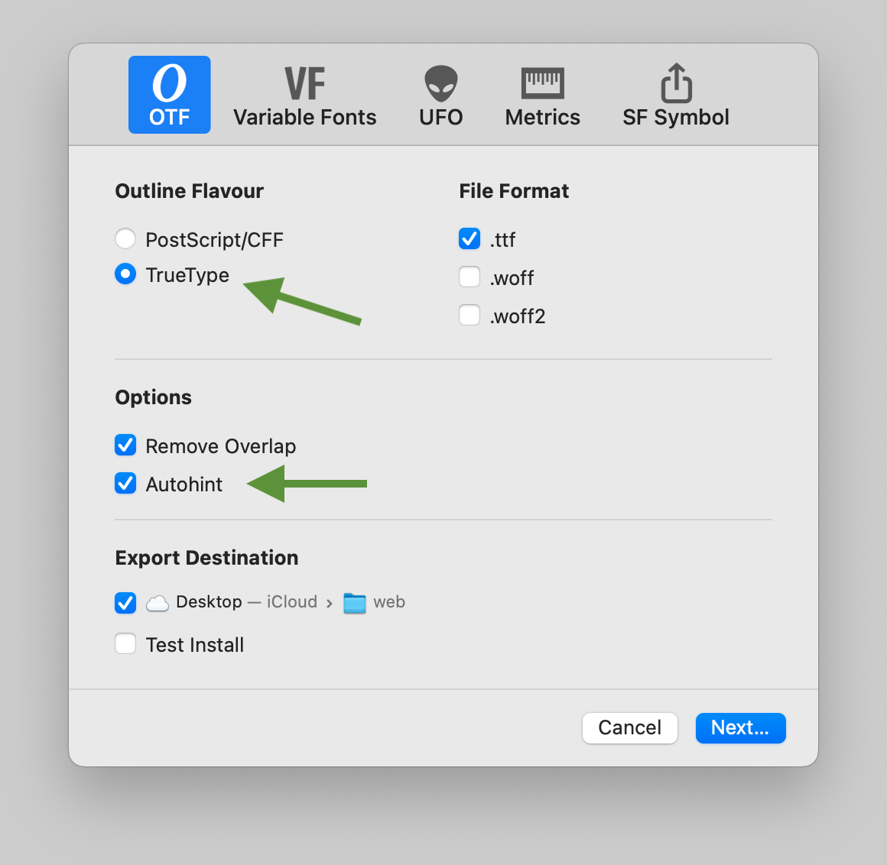
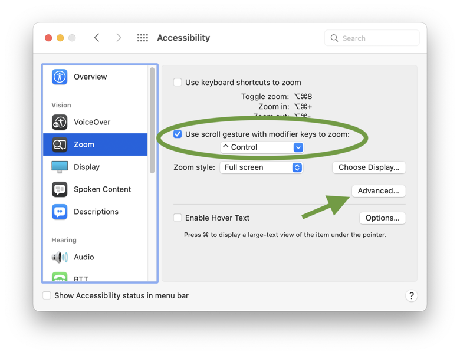
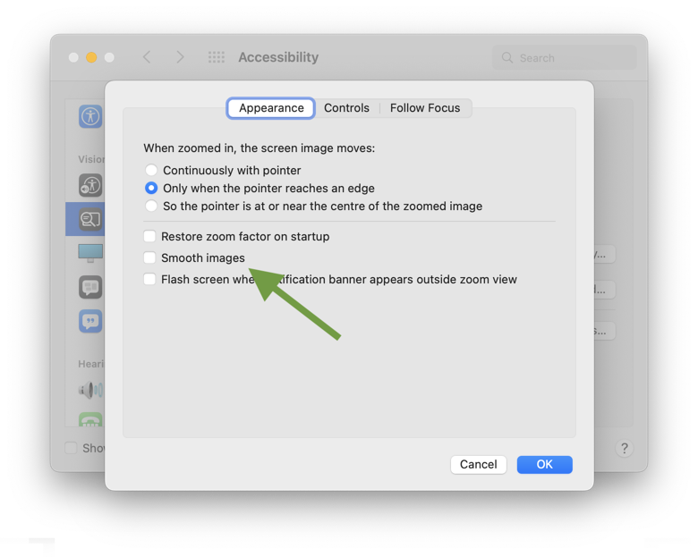
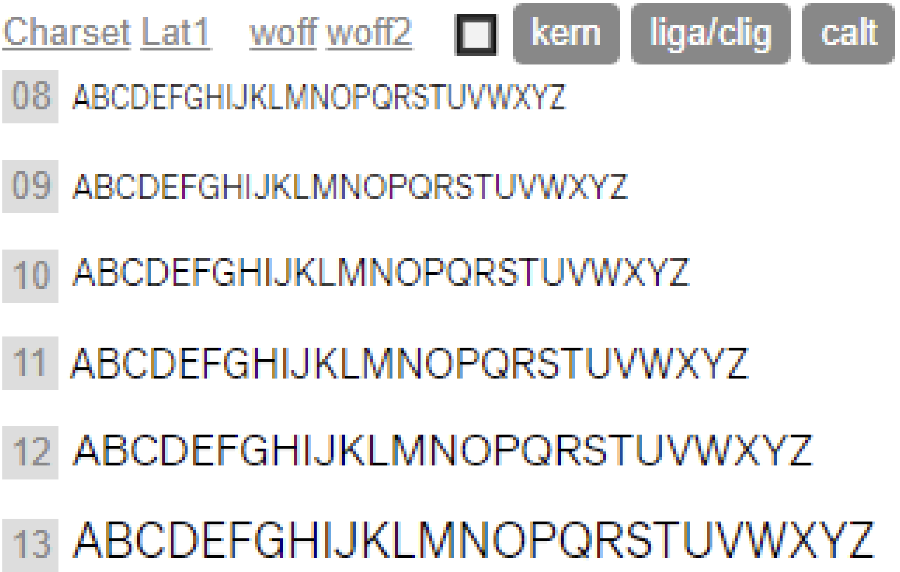
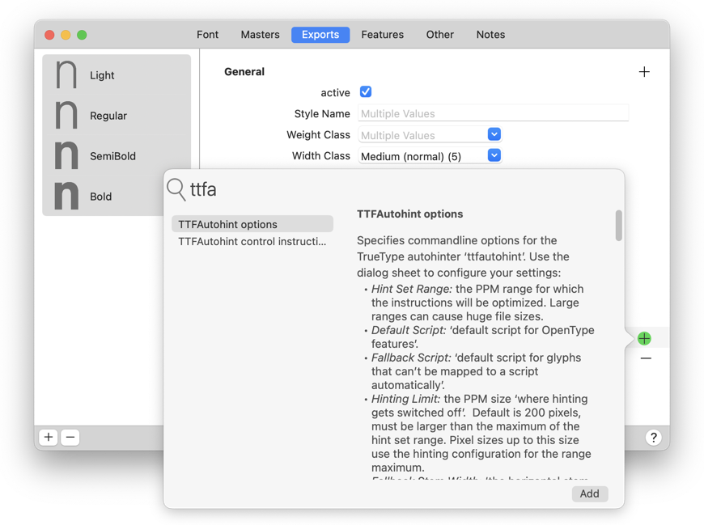
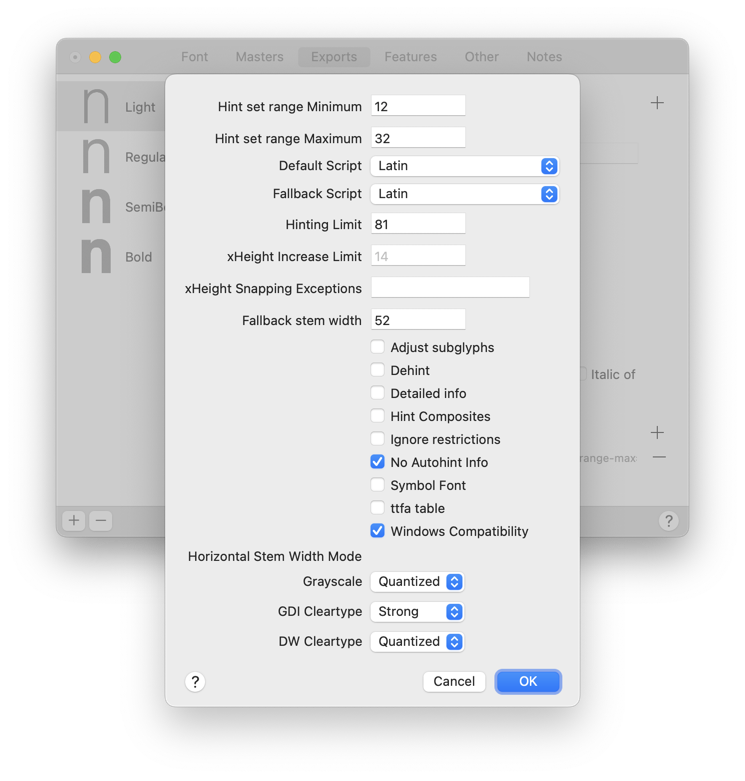
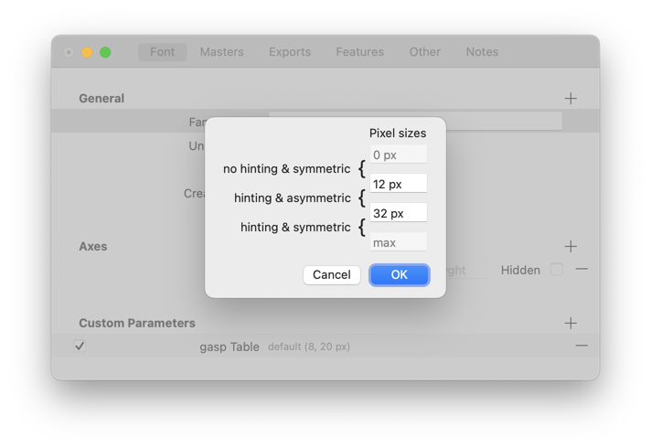

原文: [Hinting: TrueType autohinting](https://glyphsapp.com/learn/hinting-truetype-autohinting)
# ヒンティング：True­Typeオートヒンティング

チュートリアル

[ ヒンティング ](https://glyphsapp.com/learn?q=hinting)

執筆者: Rainer Erich Scheichelbauer

[ en ](https://glyphsapp.com/learn/hinting-truetype-autohinting) [ es ](https://glyphsapp.com/es/learn/hinting-truetype-autohinting)

2022年11月10日更新（初版公開：2022年9月9日）

TrueTypeオートヒンティングは、Windowsでのフォントの画面上の可読性を向上させるための簡単で効果的な方法です。

まずは退屈な部分から。もしこれを以前に経験したことがあるなら、次の見出しにスキップしても構いません。

## ヒンティングとは？

書体デザイナーの間でよくある神話の一つに、ヒンティングは「画面上でのシェイプを保持する」ことだというものがあります。実際には、その逆が真実です。ヒンティングはシェイプを*保持せず*、それを*歪ませて*、出力デバイスのピクセルグリッドにうまく収まるようにします。出力デバイスは通常、必ずしもそうとは限りませんが、スクリーンです。歪みは、出力デバイスの解像度が低いほど大きくなります。しかし、それは80ピクセル以上のサイズ、つまり300dpiのプリンタで19ポイントのフォントサイズに相当するサイズまで効果的です。

さらに、ヒンティングが機能するためには、あなたの書体デザインが特定の要件を満たす必要があります。ヒンティングが本当に意味をなすのは、フォントが小さいサイズでの可読性を意図しており、できるだけ「普通」のデザインである場合です。言い換えれば、*シェイプの精度よりも可読性が重要である場合*です。ディスプレイフォント、筆記体フォント、グランジフォント、アイコンフォントなどは、ヒンティング*なし*の方が良いです。もしそのようなフォントを作成しているなら、ヒンティングは完全に忘れて、このチュートリアルをスキップし、代わりに「[複雑なアウトラインを持つフォントの作成](creating-fonts-with-complex-outlines.md)」を読んでください。

ヒンティングが機能するためには、パスに極値点があり、同様の高さやオーバーシュート、できるだけ一貫したステム幅など、一貫したデザインの特徴を持つ必要があります。ですから、自問してみてください。あなたのデザインはそもそもヒンティングが必要ですか？そしてもしそうなら、そのパスはヒンティングをサポートしていますか？もしあなたの答えが「はい」なら、読み進めてください。

## ttfautohintで書き出す

TrueTypeオートヒンティングを利用するには、単にフォントを「オートヒント」オプションをオンにして、「TrueType」アウトライン形式で書き出すだけです。

これだけです。Glyphsはフォントをttfautohintアルゴリズムに渡し、それがあなたのシェイプの構造を分析し、フォントに入れるヒントについて情報に基づいた推測を行います。

以下の点にご注意ください。

*   PostScriptヒンティングの場合とは異なり、TrueTypeオートヒンティングは**手動TTヒントと互換性がありません**。したがって、どちらかを選択する必要があります。TTF書き出しで*オートヒント*をオンにすると、手動ヒントは無視されます。（同様に、*オートヒント*なしで書き出すと、すべてのttfautohint設定は無視されます。）
*   現在の状態では、ttfautohintはバリアブルフォントの書き出しと互換性がありません。したがって、このチュートリアルで読むすべては、**静的なTTF書き出しにのみ**適用されます。

書き出し時に何が起こるかというと、ttfautohintがフォント内のいくつかのキーとなるグリフを賢く測定し、その結果に基づいてTrueTypeヒント（別名：インストラクション）を挿入します。運が良ければ、あなたのTTFはすでにWindowsで良い見た目になっています。確認してみましょう。

## テスト

ヒンティングの結果をテストするには、Windowsが必要です。Macユーザーなら、ParallelsやVirtualBoxのような仮想化ソリューションを検討すると良いでしょう。

フォントに埋め込まれたヒンティング情報は、少なくとも大部分はMacでは無視されます。これは、macOSがフォントをインストールする際に、その場で独自のオートヒンティングを行うためです。要するに、これが悪名高い[macOSのフォントキャッシュ](eliminating-font-cache-problems.md)です。

TTヒントの解釈において、他のプラットフォームは…まあ、かなり予測不可能です。時にはそのまま受け入れられたり、時には部分的に解釈されたり、時には（Macのように）オンボードのヒンティングに置き換えられたりします。時には、これがOSのバージョンごとに変わることもあります。もしこれらのプラットフォームに対応する必要があるなら、まずTTヒントが画面のレンダリングに全く影響を与えるのかどうかを調べ、もしそうなら、テスト計画を立ててください。

さて、愛すべきWindowsに戻りましょう。通常、テストしたい設定は2つあります。Microsoft Wordと、Microsoft EdgeやGoogle ChromeのようなChromiumベースのWebブラウザです。なぜなら、Wordは実際にWindowsに組み込まれているデフォルトのレンダラーとは異なる方法でタイプをレンダリングするからです。あなたの（またはクライアントの）意図するフォントの使用法に応じて、どちらか一方を無視することもできます。

### スクリーンズームを使用する

まず、「システム環境設定 > アクセシビリティ」で[スクリーンズーム](https://support.apple.com/en-us/HT210978)を設定します。

ピクセル画像を素早く拡大してヒンティングの結果を確認できるように、スクロールジェスチャや良いショートカットを設定するのが良い考えです。このウィンドウにいる間に、「詳細…」をクリックし、「画像を滑らかにする」を無効にします。

このオプションが行うことは、ピクセルをぼかすことです。そして、これがデフォルト設定です。なぜ誰かがこれを望むのか、私にはわかりません。ビットマップレンダリングを確認するために、私たちは絶対にこれを必要としません。ですから、そのチェックボックスのチェックを外し、ダイアログを確認すれば、ピクセルはぼやけなくなります。

### WindowsにRetinaは不要

もしRetinaディスプレイをお持ちなら、Windowsの画面解像度を低く保つようにしてください。結局のところ、ピクセルを*見たい*のですから。高解像度の設定では、ヒンティングはあまり目に見える効果がありません。もしかしたら、あなたの仮想化ソフトウェアには、WindowsのピクセルをMacの2×2ピクセルに引き伸ばす設定があるかもしれません。

### テストドキュメント

Wordでテストドキュメントを設定します。[mekkablueスクリプト](glyphsapp3://showplugin/mekkablue%20scripts)の*Test > Copy Word Test Text*は、最前面のフォントの完全な文字セットをクリップボードに入れるので、空のWordドキュメントに貼り付けることができます。

EdgeまたはChrome用にテストHTMLを設定します。[mekkablueスクリプト](glyphsapp3://showplugin/mekkablue%20scripts)の*Test > Webfont Test HTML*を使用できます。これは、静的フォントの最新の書き出し先に、現在のフォント用のHTMLを作成します。または、Viktor Nuebel氏の[FontDrop](https://fontdrop.info)のようなタイプテスターサイトを使用します。スクロールジェスチャまたはショートカットでズームインし、ピクセル構造をそのピクセル化された栄光の中で調べることができます。このように。

ズームインし、様々なサイズ、できれば複数サイズのウォーターフォールでテストし、ステムの太さの一貫性、ベースライン、エックスハイト、キャップハイトなどの高さの一貫性を確認します。次に、互いに一貫して見えるべきグリフの*グループ*、例えばすべての大文字、すべての小文字、すべてのライニング数字、すべてのスモールキャップなどに焦点を当てます。

もしすべてが一貫して見えるなら、それで完了です。昼食に行って、このチュートリアルの残りをスキップしても構いません。ボナペティ。

*踊る数字の高さ*

もし、踊る高さや不規則なステムのような不整合が、いくつかのグリフにしか影響していないなら、パスに何か問題がある可能性があります。パスの方向、極値点、ポイントの座標が丸められているか、そして垂直メトリクスに近いポイントが実際にそれに揃っているか、少なくとも一貫したオーバーシュートを持っているかを確認してください。これに役立つ多くのプラグインやスクリプトがあります。

もし*多く*のグリフが影響を受けている場合は、ttfautohintのデフォルト設定を上書きすると助けになるかもしれません。読み進めてください。

## オートヒントオプション

「フォント情報 > 書き出し」の各インスタンスに、「TTFAutohint options」というカスタムパラメータを追加します。複数のインスタンスを選択し、一度にすべてのインスタンスにパラメータを追加できることに注意してください。

カスタムパラメータが追加されたら、その値をクリックしてダイアログを開き、設定を確認します。繰り返しになりますが、一度に複数のインスタンスのオプションを一括編集できます。

以下のリストには、それぞれの[ttfautohintドキュメント](https://freetype.org/ttfautohint/doc/ttfautohint.html)への直接リンクと、そのドキュメントの簡単な要約を含むすべてのオプションが含まれています。「アドバイス」と書かれている部分には、問題の設定に対する私自身の提案を追加しました。

*   [**ヒントセット範囲：**](https://freetype.org/ttfautohint/doc/ttfautohint.html#hint-set-range-minimum-hint-set-range-maximum)インストラクションが最適化されるPPM範囲。

**アドバイス：** 広い範囲は巨大なファイルサイズを引き起こす可能性があるため、Webフォントで最も関連性の高いPPMサイズに限定してください。最適化は通常、12 PPM未満および40 PPM超では意味がありません。ヒントはその範囲を超えても適用されますが（下の「ヒンティング制限」を参照）、ビットマップの最適化はこれらのサイズに焦点を当てます。

*   [**デフォルトのスクリプト：**](https://freetype.org/ttfautohint/doc/ttfautohint.html#default-script)OpenTypeフィーチャーのデフォルトのスクリプト。

**アドバイス：** 無視するか、フォントが開発された主要なスクリプトを選んでください。もしOTフィーチャーを通じてアクセスできるグリフがたくさんあるなら、それらのほとんどを代表するスクリプトを選んでください。ヒンティングは一つのスクリプト内でより一貫性が保たれます。

*   [**フォールバックスクリプト：**](https://freetype.org/ttfautohint/doc/ttfautohint.html#fallback-script)自動的にスクリプトにマッピングできないグリフのデフォルトスクリプト。

**アドバイス：** フォントが意図されている主要なスクリプトを選ぶのが最善です。

*   [**ヒンティング制限：**](https://freetype.org/ttfautohint/doc/ttfautohint.html#hinting-limit)ヒンティングがオフになるPPMサイズ。デフォルトは200ピクセルで、ヒントセット範囲の最大値より大きくなければなりません。このサイズまでのピクセルサイズは、*ヒントセット範囲*の最大値（上記参照）のヒンティング設定を使用します。

**アドバイス：** 画面上でフォントが使用されると予想される適切なフォントサイズを選んでください。100未満の値でも構いません。安全のために1 PPM追加することを検討してください。80までのサイズをカバーするために、望ましい結果が得られない場合は81を試してください。

*   [**フォールバックステム幅：**](https://freetype.org/ttfautohint/doc/ttfautohint.html#fallback-stem-width)フォントに適切な標準文字がないすべてのスクリプトのステム幅の値。値はフォントユニット単位で、正の整数でなければなりません。デフォルトはUPM×50÷2048ユニットにハードコードされています。シンボルフォントの場合、*フォールバックスクリプト*（上記参照）も指定する必要があります。

**アドバイス：** 各インスタンスごとに個別に（一括設定しないで）、スクリプトの代表的なグリフ、例えばラテン文字の`idotless`の幅を水平に測定し、そのステム幅をここに入力します。*フォールバックステム幅*を増減させることで、フォント全体の見た目をそれぞれ濃くしたり薄くしたりできます。

*   [**エックスハイトの増加制限：**](https://freetype.org/ttfautohint/doc/ttfautohint.html#x-height-increase-limit)このピクセルサイズから6 PPMまで、エックスハイトは切り上げられる可能性が高くなります。デフォルトは14 PPMです。「通常、ttfautohintはエックスハイトをピクセルグリッドに丸めますが、わずかに切り上げることを好みます。（…）必要であれば、このフラグを使用して小さいサイズの可読性を向上させてください。」

**アドバイス：** 最初はフィールドを空にしてデフォルトを維持し、エックスハイトに満足できない場合にのみ調整してください。エックスハイトの切り上げをオフにしたい場合は、0に設定してください。

*   [**エックスハイトスナッピングの例外：**](https://freetype.org/ttfautohint/doc/ttfautohint.html#x-height-snapping-exceptions)「エックスハイトスナッピングを適用しないPPM値または値の範囲をカンマで区切ったリスト」、例：「8, 10-13, 16」は、サイズ8, 10, 11, 12, 13, 16でエックスハイトスナッピングを無効にします。空の文字列は例外なしを意味し、単なるダッシュ（「-」）はすべてのサイズでスナッピングを無効にします。

**アドバイス：** 最初はフィールドを空にしてデフォルトを維持し、エックスハイトに満足できない場合にのみ調整してください。

*   [**サブグリフを調整**](https://freetype.org/ttfautohint/doc/ttfautohint.html#adjust-subglyphs)（旧名：*プレヒンティング*）：有効にすると、「フォントの元のバイトコードがttfautohintによって作成されたバイトコードに置き換えられる前に、すべてのグリフに適用されます。これは、フォントにすでにEMサイズ（通常2048px）でもシェイプを変更するヒントが含まれている場合にのみ意味があります。特に、一部のCJKフォントは、バイトコードがサブグリフを拡大縮小および移動させるために使用されるため、これが必要です（したがって、オプションの長い名前）。しかし、ほとんどのフォントではそうではありません。」

**アドバイス：** オフのままにしてください。重大な歪みを引き起こす可能性があります。何をしているか分かっていて、実際にCJKフォントで作業している場合にのみ使用してください。

*   [**デヒント：**](https://freetype.org/ttfautohint/doc/ttfautohint.html#dehint)すべてのTTヒンティングを無効にし、したがって他のすべてのオプションを上書きします。テスト用にのみ使用してください。

**アドバイス：** このオプションは無視してください。これには、書き出しダイアログの「オートヒント」チェックボックスを使用する方が良いです。このオプションを使用する意味があるのは、フォントに手動のTTヒントがあり、全くヒンティングなしで書き出したい場合だけです。その場合は、カスタムパラメータの「デヒント」と書き出しダイアログの「オートヒンティング」の両方をチェックしてください。

*   [**詳細情報：**](https://freetype.org/ttfautohint/doc/ttfautohint.html#ttfautohint-info)有効にすると、フォントの`name`テーブルのバージョン文字列または文字列（name ID 5）に「ttfautohintのバージョンとコマンドライン情報」を追加します。このオプションは、*オートヒント情報なし*オプション（下記参照）と相互に排他的です。「どちらも設定されていない場合、「ttfautohint (vNNN)」という文字列が`name`テーブルに追加されます」、NNNはttfautohintのバージョンです。

**アドバイス：** この設定を必要とする後工程のワークフローがない限り、このオプションは無視してください。

*   [**複合グリフのヒンティング：**](https://freetype.org/ttfautohint/doc/ttfautohint.html#hint-composites)「デフォルトでは、複合グリフのコンポーネントは別々にヒンティングされます。このフラグが設定されている場合、複合グリフ自体がヒンティングされ（コンポーネントのヒントは無視されます）。このフラグを使用すると、バイトコードのサイズが大幅に増加しますが、より良いヒンティング結果が得られる可能性があります – 通常はそうではありません。」

**アドバイス：** オフのままにしてください。これは非常に特定のセットアップを意図したものであり、ほとんどのレンダリングで重大な歪みを引き起こす可能性があります。特に、すべてのコンポーネントが100%のスケールでない場合はそうです。

*   [**制限を無視：**](https://freetype.org/ttfautohint/doc/ttfautohint.html#add-ttfa-info-table)「デフォルトでは、`OS/2`テーブルのfsTypeフィールドにビット1が設定されているフォントは拒否されます。もしフォントの法的所有者からフォントを修正する許可を得ている場合は、このコマンドラインオプションを指定してください。」

**アドバイス：** このチェックボックスは無視してください。Glyphsでこれを必要とすることはまずないでしょう。

*   [**オートヒント情報なし：**](https://freetype.org/ttfautohint/doc/ttfautohint.html#ttfautohint-info)チェックを入れると、フォントの`name`テーブルのバージョン文字列または文字列（name ID 5）に「ttfautohintのバージョンとコマンドライン情報」が追加されるのを防ぎます。

**アドバイス：** 製品版のフォントではオンにしてください。

*   [**シンボルフォント：**](https://freetype.org/ttfautohint/doc/ttfautohint.html#symbol-font)「ttfautohintが、サポートされているどのスクリプトに対しても標準文字を一つも見つけられないために通常は拒否するフォントを処理します。適切な標準文字がないすべてのスクリプトに対して、ttfautohintはスクリプトの標準文字セットから導出する代わりに、標準ステム幅のデフォルト（ヒンティング）値を使用します（…）。このオプションを、通常はフォールバックスクリプトやフォールバックステム幅オプションと組み合わせて使用し、例えばシンボルフォントやディンバットフォント、数学グリフをヒンティングします。」

**アドバイス：** ドキュメントがすべてを物語っています。これは非書体フォントにのみ使用してください。そして、もしそうなら、*フォールバックステム幅*と*フォールバックスクリプト*も設定されていることを確認してください。

*   [**ttfaテーブル：**](https://freetype.org/ttfautohint/doc/ttfautohint.html#add-ttfa-info-table)「`TTFA`という名前のOpenTypeテーブルを出力フォントに追加します。これにはすべてのパラメータのダンプが保持されます。特に、ttfautohintの制御命令がすべてリストされます（これらはnameテーブル情報には表示されません）。このオプションは、フォントを作成するために使用されたすべての情報がフォント自体に保存されるように、主にアーカイブ目的のものです。このような`TTFA`テーブルは、すべてのTrueTypeレンダリングエンジンによって無視されることに注意してください。ttfautohintフロントエンドの将来のバージョンは、このデータを使用して、フォントを全く同じパラメータで再度処理できるようになり、フォントのラウンドトリップ手段を提供します。」

**アドバイス：** この設定を必要とする後工程のワークフローがない限り、このオプションは無視してください。

*   [**Windows互換性：**](https://freetype.org/ttfautohint/doc/ttfautohint.html#windows-compatibility)「このオプションにより、ttfAutohintは、フォントの`OS/2`テーブルの`winAscent`と`winDescent`の値に配置された2つの人工的なブルーゾーンを追加します。アイデアは、Windowsが外にはみ出したものをすべてクリッピングするため、ヒンティングされたグリフがこの水平のストライプ内に留まるようにttfautohintを助けることです。」Microsoft Windowsでクリッピングが発生し、代わりに`winAscent`と`winDescent`を調整できない場合（通常はそちらの方が良いオプションです）、このオプションを使用してください。「-」をxHeight Snapping Exceptionsの値として使用することと組み合わせると、「垂直方向の拡大を抑制」し、「ほぼすべてのクリッピングを防ぐ」はずです。

**アドバイス：** 実験的な`winAscent`と`winDescent`の設定がない限り、常にオンにしてください。[でも、そうでないことを願っています。](https://freetype.org/ttfautohint/doc/ttfautohint.html#vertical-metrics)

*   [**水平ステム幅モード：**](https://freetype.org/ttfautohint/doc/ttfautohint.html#stem-width-and-positioning-mode)ステムの幅とアラインメントゾーンの位置は、3つの可能な方法で計算されます。
    *   *natural:* ステム幅の調整なし、離散的なゾーン配置。グリフの形の歪みなし、コントラストが低い（つまり、アンチエイリアシングが多い）。シェイプを最も保持しますが、テキストはぼやけます。高解像度に最適です。
    *   *quantized:* ステム幅とゾーンの位置の両方が、離散的な値を取るようにわずかに量子化されます。グリフの形の歪みが増え、コントラストが増加します。良い妥協案です。
    *   *strong:* ステム幅とブルーゾーンは、可能な限り整数ピクセル値にスナップされ、配置されます。高コントラスト（つまり、アンチエイリアシングが少なく、非常にシャープなピクセル）ですが、グリフの形の歪みが大きくなる可能性があります。テキストのシャープで、ほぼ白黒のレンダリングは、低解像度ディスプレイでの良好な可読性を提供します。

これらの3つのアルゴリズムは、3つの可能なレンダリングターゲットにマッピングされます。*Grayscale*（Microsoft WordおよびAndroidデバイスなどの携帯システム）、*GDI ClearType*（XPのような古いバージョンのWindows）、そして*DW ClearType*（Windows 7以降）。

**アドバイス：** GrayscaleとDWには*quantized*を、GDIには*strong*を選んでください。もしクライアントがフォントがピクセル化されすぎていると不満を言うなら、よりソフトにしてください：strong → quantized → natural。もしぼやけすぎていると不満を言うなら、逆方向に進み、よりシャープにしてください：natural → quantized → strong。

一つ注意：水平ステム幅という用語は紛らわしいかもしれません。なぜなら、水平なのはステムではなく、*幅*だからです。言い換えれば、それは*垂直ステムの水平に測定された幅*です。

そして、もし不思議に思っていたなら、DWは[DirectWrite](https://docs.microsoft.com/en-us/windows/win32/directwrite/direct-write-portal)の略で、GDIは古き良きMicrosoft Windowsの[グラフィックスデバイスインターフェイス](https://docs.microsoft.com/en-us/windows/win32/gdi/)の略です。

## GASP

TrueTypeフォントのレンダリングに影響を与える可能性のある設定がもう一つあります。「GASP」、これは「Grid-fitting and Scan-conversion Procedure」の略です。要するに、TTFに[gasp](https://docs.microsoft.com/en-us/typography/opentype/spec/gasp)テーブルを追加する、フォント全体のカスタムパラメータです。

本質的に、フォントは可読性を高めるために、異なるサイズで異なる方法でレンダリングされます。*グリッドフィッティング*あり（ピクセルエッジへのスナッピングが増加）、なし、そして対称的または非対称的（アンチエイリアシングの多少あり）にレンダリングできます。あるいは…実際には、レンダラーがGASPを完全に無視する可能性もあるので、そうでもありません。ははは。ですから、この設定にあまり時間と労力を費やさないでください。さもないと、笑われるのはあなたです。

一方、GASPを設定するために必要なのは、2つのピクセルサイズを定義することだけです。

*   **0から最初のサイズまで（デフォルト8px）はヒンティングなし＆対称：** グリッドフィッティングは適用されず、テキストは可能な限りアンチエイリアシングでレンダリングされます。
*   **最初のサイズと2番目のサイズの間（デフォルト20px）はヒンティング＆非対称：** グリッドフィッティングが適用され、テキストは可能な限りシャープにレンダリングされます。ClearTypeでは、この問題は非対称的に処理されます。つまり、垂直方向のグリッドフィッティングが適用され、水平方向にはサブピクセルレンダリングが使用されます。
*   **2番目のサイズ以上はヒンティング＆対称：** グリッドフィッティングが適用され、シェイプはアンチエイリアシングでレンダリングされます。

これだけです。

## 便利なスクリプトとプラグイン

[mekkablue scripts](glyphsapp3://showplugin/mekkablue%20scripts)には、ヒンティング作業を楽にするいくつかのスクリプトがあります。

### 旧バージョン
古いバージョンのGlyphsにmekkablueスクリプトをインストールするには、[GitHubページのreadme](https://github.com/mekkablue/Glyphs-Scripts/)を参照してください。

*   *Hinting > Set ttfautohint Options:* 既にパラメータを持っているすべてのインスタンスに対して、*TTFAutohint options*パラメータを一括設定できます。個別のフォールバックステム幅を賢く一括設定する方法も含まれています。
*   *Font Info > Clean Version String:* とりわけ、すべての*TTFAutohint options*パラメータに*No Autohint Info*設定を追加します。
*   *Hinting > Remove TT Hints:* すべての手動TTヒントを削除し、オートヒンティングに集中できるようにします。
*   *Test > Copy Word Test Text:* Microsoft Wordでアクセスできるすべての文字を、アクセス可能なOTフィーチャー用の追加の段落と共にクリップボードに入れます。ただし、フィーチャーは自分で適用する必要があります。
*   *Test > Webfont Test HTML:* 静的フォントの最新の書き出し先にHTMLを作成し、開きます。フォントを書き出した直後にこれを実行してください。

## 便利なリンク

ttfautohintは、オーストリアの音楽家兼プログラマーであるWerner Lemberg氏によって開発されました。ですから、インターネットで彼を検索すると、タイプよりも音楽の方が見つかるかもしれませんが、怖がらないでください。

*   [ttfautohintドキュメント](https://freetype.org/ttfautohint/doc/ttfautohint.html#add-ttfa-info-table)、Freetypeプロジェクトの一部。これをブックマークに入れておきましょう。
*   [Werner氏によるNotoのヒンティングに関する講演](https://youtu.be/LZ-PZDy8WHY) at TypeLabs 2017
*   [gaspテーブルに関するOT仕様](https://docs.microsoft.com/en-us/typography/opentype/spec/gasp)

---
サンプルフォント提供：RASMUS LUND MATHISEN。

---

更新履歴 2022-09-14: 「ttfautohint」のスペルを修正（Werner氏に感謝）、macOSに組み込まれているオートヒンティングに関する記述を修正（Ned氏に感謝）。

## 関連記事

[すべてのチュートリアルを見る →](https://glyphsapp.com/learn)

*   ### [ヒンティング：手動でのTrueTypeヒンティング](hinting-manual-truetype-hinting.md)

チュートリアル

[ ヒンティング ](https://glyphsapp.com/learn?q=hinting)

*   ### [ヒンティング：手動でのPostScriptヒンティング](hinting-manual-postscript-hinting.md)

チュートリアル

[ ヒンティング ](https://glyphsapp.com/learn?q=hinting)

*   ### [ヒンティング：PostScriptの自動ヒンティング](hinting-postscript-autohinting.md)

チュートリアル

[ ヒンティング ](https://glyphsapp.com/learn?q=hinting)