原文: [How to install your Glyphs license](https://glyphsapp.com/learn/how-to-install-your-glyphs-license)
# Glyphsライセンスのインストール方法

チュートリアル

[ インストール ](https://glyphsapp.com/learn?q=installation)

執筆者: Rainer Erich Scheichelbauer

[ en ](https://glyphsapp.com/learn/how-to-install-your-glyphs-license) [ fr ](https://glyphsapp.com/fr/learn/how-to-install-your-glyphs-license)

2022年7月21日更新（初版公開：2016年2月29日）

メールでGlyphsライセンスのダウンロードリンクを受け取ったものの、どうすればいいかわからないですか？心配いりません、私たちがお手伝いします。

さて、ダウンロードリンクは2週間しか有効でないので、早速始めましょう。Glyphsライセンスをインストールする前に、以下の条件を満たしている必要があります。

1.  アプリが必要とする最小OSバージョン（Glyphs 2およびGlyphs Mini 2はmacOS 10.9、Glyphs 3はmacOS 10.11）を実行していること
2.  [最新のGlyphs 3バージョン](http://updates.glyphsapp.com/latest3.php)、[最新のGlyphs 2バージョン](http://updates.glyphsapp.com/latest2.php)、または[最新のGlyphs Mini 2バージョン](http://updates.glyphsapp.com/latestMini2.php)を持っていること
3.  アプリの名前が**Glyphs 3.app**、**Glyphs.app**、または**Glyphs Mini.app**で、「アプリケーション」フォルダにあること
4.  アプリを少なくとも一度は開いていること

これらのことをすべて確認したら、単にライセンスファイルをダブルクリックするだけでよいはずです。ファイルの拡張子が`.glyphs3License`、`.glyphs2License`、または`.glyphsMini2License`であることを確認してください。そうでなければ、機能しません。

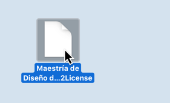

ファイルをダブルクリックすると、ダイアログが表示されるはずです。

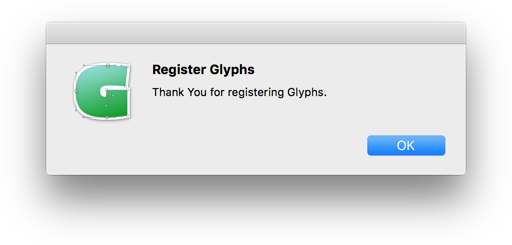

 अब、「OK」をクリックすれば、基本的にはこれでおしまいです。やった！

あるいは…うまくいかないですか？ここに、インストールに問題があったほとんどのユーザーに役立ったいくつかのヒントがあります。

## 1. アプリを再ダウンロードする

最初の防御策は、新鮮なダウンロードです。以下の手順に従ってください。

1.  アプリケーションフォルダから、現在のGlyphsまたはGlyphs Miniのインストールをゴミ箱に移動します。
2.  ゴミ箱を空にします。
3.  次に、[最新のGlyphs 3バージョン](http://updates.glyphsapp.com/latest3.php)、[最新のGlyphs 2バージョン](http://updates.glyphsapp.com/latest2.php)、または[最新のGlyphs Mini 2バージョン](http://updates.glyphsapp.com/latestMini2.php)を再ダウンロードします。（もし自動的に解凍されていなければ、.zipファイルを解凍してください。下記の注を参照してください。）
4.  ダウンロードフォルダから、新しいダウンロードを「アプリケーション」フォルダに移動します。
5.  次に、アプリを右クリックし、コンテキストメニューの一番上から「開く」を選択します。
    
6.  表示される可能性のあるダイアログを確認し、再度ライセンスファイルを開いてみてください。

### 注意
ダウンロードしたファイルを解凍する際は、macOSに内蔵されている解凍ツール、アーカイブユーティリティの使用をお勧めします。サードパーティのツールが解凍プロセス中にアプリを破損させ、アプリを開けなくなったというユーザーからの報告があります。

## 2. Glyphsが開かない？

Glyphs (Mini)が起動しないと思ったら、よく見てください。DockのGlyphs (Mini)アイコンを確認してください。アイコンの下に小さな点がありますか？こんな風に。

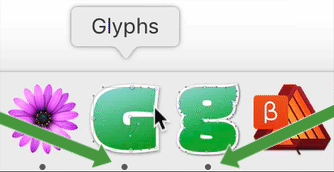

もしそうなら、それは*起動しています*。ただ、ウィンドウが開いていないだけです。そこで、Dockアイコンをクリックして、Glyphs (Mini)が最前面のアプリケーションであることを確認してください。画面の左上隅を見ることでそれを確認できます。Appleアイコンのすぐ隣に「Glyphs」または「Glyphs Mini」と表示されているはずです。そして、その隣の「ファイル」メニューから「新規」を選びます。このように。

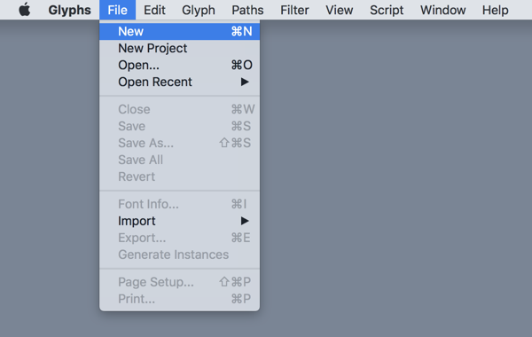

そして、じゃじゃーん、ウィンドウが表示されました。もしこれが機能するなら、これで完了です。ウィンドウが開いていない場合は、常にウィンドウを開くことを覚えておいてください。

まだダメですか？大丈夫です、私たちがなんとかします。読み進めてください。

GlyphsまたはGlyphs Miniを開こうとした後、このセキュリティダイアログが表示されますか？

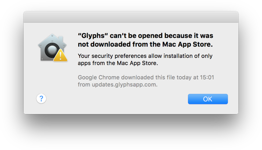

その場合は、アプリを右クリックしてコンテキストメニューから「開く」を選択するか、「システム環境設定」を開き、「セキュリティとプライバシー」を選択します。「一般」タブに、開くことを許可されるプログラムを変更するためのオプションが表示されるはずです。

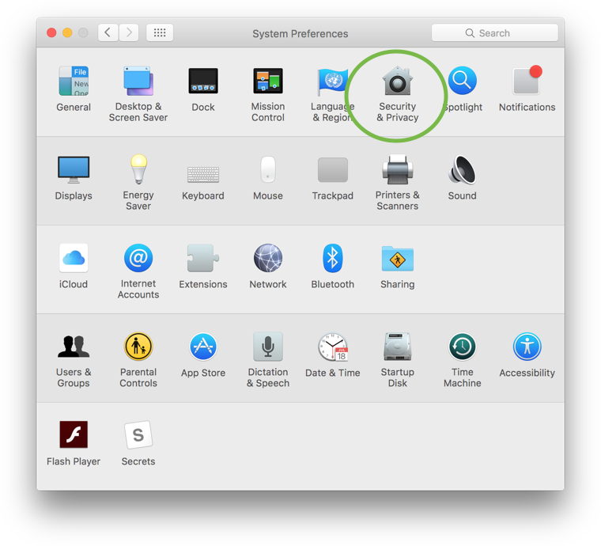

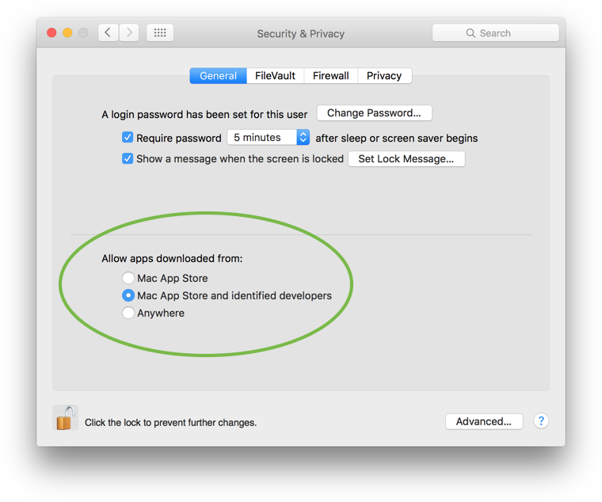

「Mac App Storeと確認済みの開発元からのアプリケーションを許可」というものをチェックしてください。これでGlyphsを開けるはずです。

もしライセンスファイルをダブルクリックしてもGlyphsが開かない場合は、ファイルを右クリックして「このアプリケーションで開く > Glyphs」を選んでみてください。

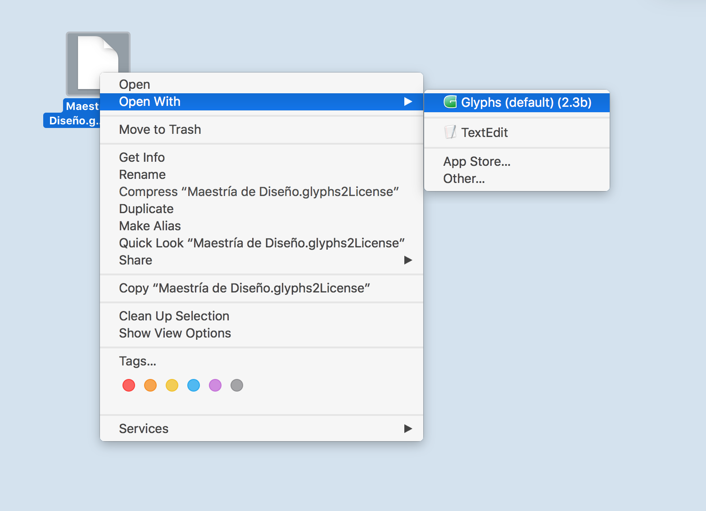

## 3. Macを再起動する

再起動するには、画面の左上隅にあるAppleメニューに行き、「再起動…」を選択し、表示されるダイアログを確認します。安全を期すなら、2回再起動してください。

1.  一度、Shiftキーを押しながら再起動します。
2.  Macが[セーフモードで起動](https://support.apple.com/en-us/HT201262)していることを確認するまで、Shiftキーを押し続けます。
3.  二度目は、「通常通り」、つまりキーの組み合わせなしで再起動します。

これにより、潜在的なキャッシュの問題や、操作中に積み重なった他の問題が修正されるはずです。

## 4. ByHostのアクセス権

まだうまくいきませんか？おそらく、ファイルのアクセス権に何か問題があるのかもしれません。Finderで、「移動 > フォルダへ移動…」（Cmd-Shift-G）を選び、この場所をペーストしてください。
```
~/Library/Preferences/
```
ダイアログを確認します。そこに着いたら、*ByHost*という名前のフォルダを見つけます。フォルダを右クリックし、コンテキストメニューから「情報を見る」（Cmd-I）を選択します。表示される情報ウィンドウに、「共有とアクセス権」のオプションがあります。あなたのユーザーが「読み/書き」の権限を持っているか確認してください。

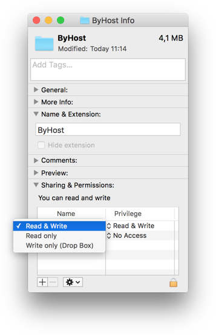

*ByHost*フォルダに戻ります。`com.GeorgSeifert.Glyphs...`で始まるファイルが1つ以上見つかるはずです。Glyphs Miniの場合は、`com.schriftgestaltung.Glyphs...`です。

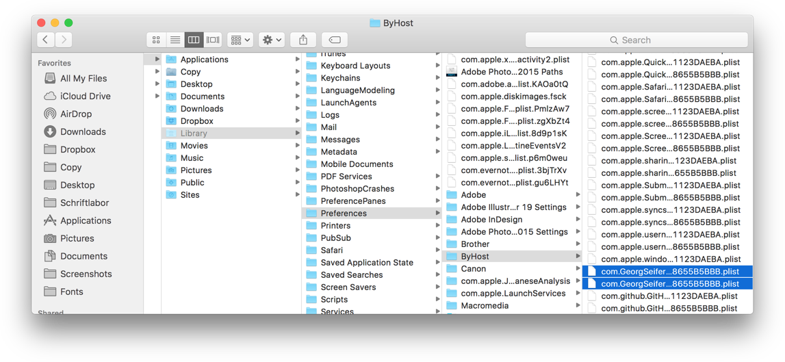

それらのファイルをすべて削除してから、もう一度試してください。

## 5. 新しいユーザーでインストールする

システム環境設定で、「ユーザとグループ」に進み、左下のプラスボタンで新しいユーザを追加します。まず、パスワードを入力して環境設定のロックを解除する必要があるかもしれません。それを*管理者*アカウント（*標準*ではなく）にします。

次に、ライセンスファイルを（ホームフォルダの隣にある）*共有*フォルダにコピーします。そこへ行く最も手っ取り早い方法は、Finderに切り替え、ホームフォルダ（Cmd-Shift-H）に進み、1つ上のレベル（Cmd-上矢印）に移動することです。

最後に、ユーザーアカウントからログアウトし（Appleメニューの最後の項目）、表示されるログインウィンドウで新しいユーザーアカウントにログインして、別のユーザーに切り替えます。そこで、再びアプリのロックを解除してみてください。*共有*フォルダ内のライセンスファイルにアクセスできるはずです。

もし今回はうまくいけば、あなたのユーザーアカウントに何か問題があることがわかります。

## 6. ターミナル経由でインストールする

まだ成功しませんか？申し訳ありません、あなたは、この問題を抱える0.01%のユーザーの一人です。おそらく、ライセンスの有効期限が切れているというウィンドウが繰り返し表示されるのでしょう。申し訳ありませんが、お手伝いできると思います。では、難しい方法で試してみましょう。ターミナルで行います。以下の手順に従ってください。

1.  *Glyphs 3.app*、*Glyphs.app*、または*Glyphs Mini.app*が「アプリケーション」フォルダにあることを確認してください。
2.  （コピーの）`.glyphs3License`、`.glyphs2License`、または`.glyphsMini2License`ファイルをデスクトップに置いてください。
3.  Finderで、メニューから「移動 > ユーティリティ」（Cmd-Shift-U）を選びます。
4.  表示されるFinderウィンドウで、*Terminal.app*を見つけてダブルクリックしてください。ターミナルウィンドウが表示され、おおよそ次のようになります。
    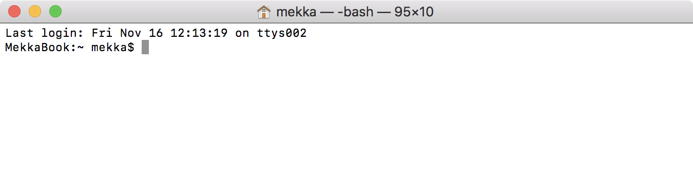
    ウィンドウのサイズは問題ありませんが、もし気分が良くなるなら、ウィンドウの右下隅をドラッグしてサイズを変更できます。

5.  もし**Glyphs 3**を使用している場合は、この行を選択してコピー（Cmd-C）してください。
    `sudo /Applications/Glyphs\ 3.app/Contents/MacOS/Glyphs\ 3 -disableUI 1`
    もし**Glyphs 2**を使用している場合は、この行を選択してコピー（Cmd-C）してください。
    `sudo /Applications/Glyphs.app/Contents/MacOS/Glyphs -disableUI 1`
    もし**Glyphs Mini**を使用している場合は、この行を選択してコピー（Cmd-C）してください。
    `sudo /Applications/Glyphs\ Mini.app/Contents/MacOS/Glyphs\ Mini -disableUI 1`
6.  ターミナルウィンドウに戻り、その行をペースト（Cmd-V）してください。おおよそ次のようになります。
    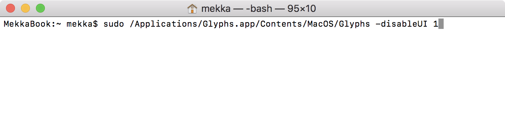
7.  さて、非常に重要ですが、*スペースキーを押してください*。なぜなら、次のステップのために、行の`1`の後にスペースが必要だからです。違いに注意してください。
    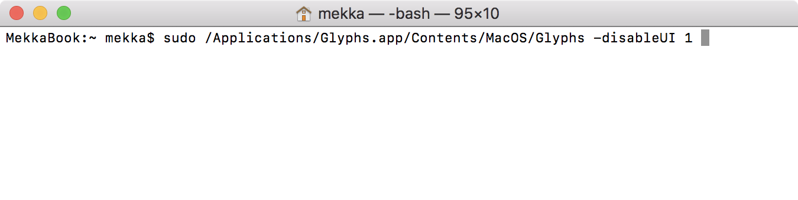
8.  `.glyphs3License`、`.glyphs2License`、または`.glyphsMini2License`ファイルをウィンドウにドラッグします。
    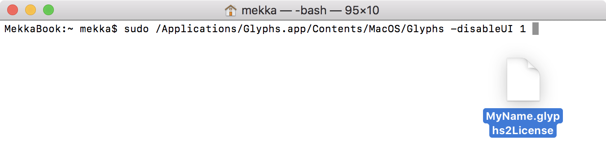
    ターミナルウィンドウのテキストに、何やら長ったらしいものが追加されます。だいたいこんな感じです。
    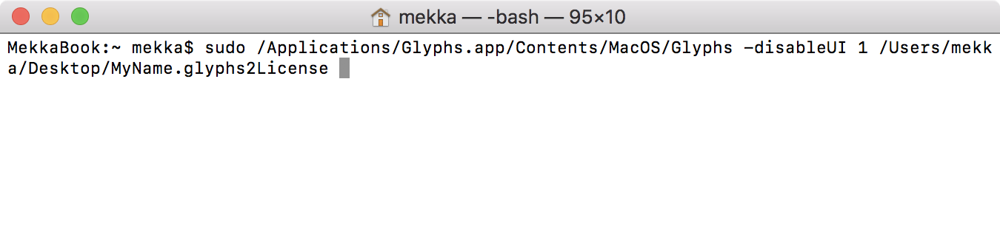
9.   अब、Returnキーを押すと、ターミナルはあなたのMacのパスワード（Macにログインする際に使用するパスワード）を尋ねてきます。
    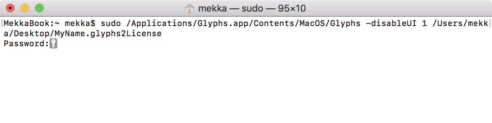
    パスワードを入力してReturnキーを押してください。**注意：通常のパスワードの弾丸（•••）は表示されませんが、それは大丈夫です。ターミナルがパスワードを扱う方法だからです。見えない状態で入力し、Returnキーを押してください。**もしタイプミスしても、心配しないでください。もう一度試すことができます。
10. Returnキーを押し、パスワードを正しく入力すると、感謝のメッセージを含む追加のテキストが表示されます。
    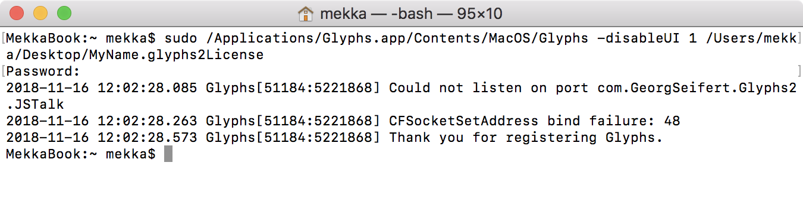
    おめでとうございます、成功しました！アプリもすぐに開くはずです。「Glyphs > 登録…」または「Glyphs Mini > 登録…」を選択して、登録を確認できます。Теперь、「ファイル > 新規」（Cmd-N）を選んで、美しいフォントの作成を始めましょう。

## 7. 最終手段：フォーラム

もしこれらすべてがうまくいかない場合は、[Glyphsフォーラム](https://forum.glyphsapp.com/)で問題を投稿してください。そちらでお手伝いします。

## おまけ：ライセンスのアンインストール

何らかの理由で、マシン上のライセンスを*無効化*する必要がある場合は、以下のいずれかの行を選択してコピー（Cmd-C）し、新しいターミナルウィンドウにペースト（Cmd-V）してください。もし選択範囲に含まれていなければ、Returnキーを押してください。上から順に、Glyphs 2、Glyphs 3、Glyphs Mini 2用のコマンドです。
```
defaults -currentHost delete com.GeorgSeifert.Glyphs2
defaults -currentHost delete com.GeorgSeifert.Glyphs3
defaults -currentHost delete com.schriftgestaltung.GlyphsMini2
```

サンプルフォント：HENRIETTE（Michael Hochleitner作）、SEPHORA SANS（Mucca/Schriftlabor作）

---

更新履歴 2015-03-30: 部分的に書き直し、スクリーンショットを改善。

更新履歴 2016-02-19: Glyphs 2のスクリーンショット。

更新履歴 2016-12-03: アクセシビリティのシステム環境設定を追加。

更新履歴 2017-05-27: 大幅に書き直し、カスタムパラメータ、プラグイン、スクリプト、スクリーンショットを追加。

更新履歴 2018-08-21: blueScaleとblueShiftテーブルを追加し、その周辺を一部書き直し。blueFuzzの章を追加し、所々表現を修正。

更新履歴 2019-03-04: blueShiftテーブルの間違った列を削除。

更新履歴 2019-03-28: 可能なゾーンの数を修正し、ベースラインゾーンの必要性を強調。

更新履歴 2020-04-03: 一貫性を保つために「four」を「4」に変更。

更新履歴 2020-07-31: 「bowls」という単語を修正。

更新履歴 2022-07-29: タイトル、関連記事、軽微なフォーマットを更新。

## 関連記事

[すべてのチュートリアルを見る →](https://glyphsapp.com/learn)

*   ### [すべてのユーザーにGlyphsをインストールする](install-glyphs-for-all-users.md)

チュートリアル

[ インストール ](https://glyphsapp.com/learn?q=installation)

*   ### [Glyphsを拡張する](extending-glyphs.md)

チュートリアル

[ トラブルシューティング ](https://glyphsapp.com/learn?q=troubleshooting)

*   ### [古いバージョンのGlyphs](older-versions-of-glyphs.md)

チュートリアル

[ インストール ](https://glyphsapp.com/learn?q=installation) [ トラブルシューティング ](https://glyphsapp.com/learn?q=troubleshooting)