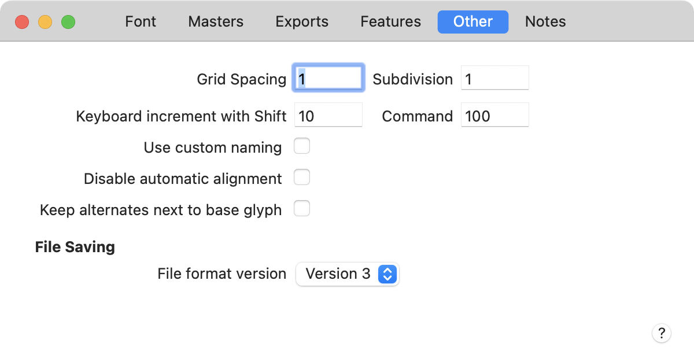
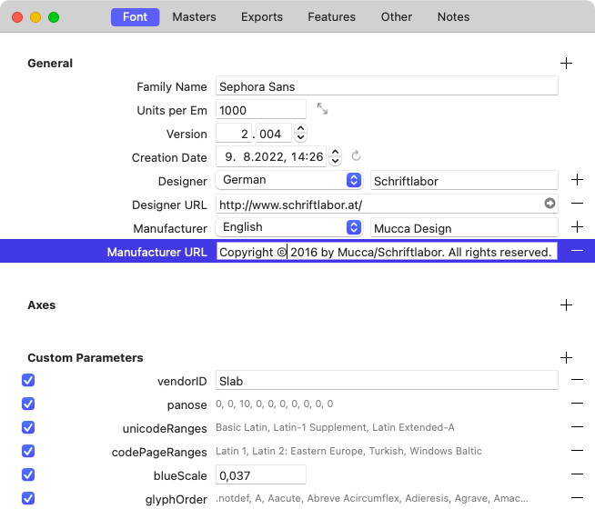

原文: [Importing existing fonts](https://glyphsapp.com/learn/importing-existing-fonts)
# 既存フォントの読み込み

チュートリアル

[ トラブルシューティング ](https://glyphsapp.com/learn?q=troubleshooting)

執筆者: Rainer Erich Scheichelbauer

[ en ](https://glyphsapp.com/learn/importing-existing-fonts) [ fr ](https://glyphsapp.com/fr/learn/importing-existing-fonts) [ zh ](https://glyphsapp.com/zh/learn/importing-existing-fonts)

2022年8月12日更新（初版公開：2012年6月21日）

すでに存在するフォントを操作したいですか？ここに非常に便利なヒントがあります。

Glyphsでコンパイル済みの`.otf`や`.ttf`ファイルを開くと、アプリはそれらをGlyphsファイルにリバースエンジニアリングするために最善を尽くします。しかし、PostScriptとTrueTypeの両方のOpenTypeフォントはコンパイルされたフォーマットであるため、安全に抽出できないものがいくつかあることは驚くことではありません。

## コピーで作業する

最初にして最も重要なアドバイス：**常にコピーで作業してください**。一部のmacOSのバージョンでは、最初に複製またはコピーを作成しない限り、元のOTFがFinderでGlyphsファイルによって上書きされる可能性があります。もう一度ゆっくり言います：**常にコピーで作業してください**。

## 元のファイルを入手する方が良い

もし元のVFBやUFOを手に入れるチャンスがあるなら、それは間違いなく望ましいです。FontLab 5用の便利な[書き出しスクリプト](https://github.com/schriftgestalt/Glyphs-Scripts/blob/master/Glyphs%20Export.py)があり、VFBを直接ネイティブのGlyphsファイルに書き出すことができます。そしてUFOに関しては、Glyphsはそれらをネイティブで開いて保存できます。

もしコンパイル済みのOTFやTTFしか持っていない場合は、それで何をしたいのかについて法的に権利があることを確認してください。EULAを確認するか、元のデザイナーに尋ねてください。

## パス、コンポーネント、自動アラインメント

二次曲線TrueTypeカーブ対三次曲線CFF（別名PostScript）カーブ：ファイルを開いたときにアウトラインの種類は保持されます。「パス > その他 > 三次曲線に変換」または「二次曲線に変換」でアウトラインの種類を変換できます（フォントビューで選択した任意のグリフの一括変換を含む）。TrueTypeフォントでは、コンポーネントは保持されます。

PS形式のOTF（`.otf`ファイル名サフィックスを持つ）からのパスは、損失なく保持されます。CFFフォントでは、コンポーネントは常にプレーンなアウトラインに分解されることを覚えておいてください。もしフォントにグリフを1つ追加して再度書き出すだけなら、これは問題にならないはずです。しかし、もっと多くのことを計画しているなら、複合グリフを再構築したいと思うかもしれません。それを達成するには、「グリフ > 複合グリフを作成」（Ctrl-Cmd-C）メニューコマンドがあなたの新しい親友になるでしょう。

文字のサイドベアリングを修正した場合、関連するすべてのダイアクリティカルマーク、例えば`A`と`Adieresis`、`Atilde`、`Aacute`、`Agrave`などのサイドベアリングも調整するようにしてください。詳細は[スペーシングのチュートリアル](spacing.md)を参照してください。もし[ダイアクリティカルマークに適切な複合構造を採用](diacritics.md)していれば、*自動アラインメント*を利用でき、ダイアクリティカルマークのサイドベアリング問題を処理するのに役立ちます。そのためには、「ファイル > フォント情報 > その他 > 自動アラインメントを無効にする」チェックボックスがオフになっていることを確認してください。

## マルチプルマスター設定の再構築

もし、既存の2つのフォント（例えば、ライトとボールド）から新しいウェイトを補間するなど、より複雑なことをしたい場合は、2つのマスターを1つの.glyphsファイルにまとめる必要があります。それを行うには、以下の手順に従ってください。

1.  両方のフォントを開きます。
2.  プライマリフォント、例えば、より軽いまたはよりコンデンスな方に切り替えます。
3.  「ファイル > フォント情報 > マスター」を選択すると、フォント情報ウィンドウが開きます。
4.  ウィンドウの左下隅にあるプラスボタンをクリックし、「他のフォントを追加」を選択します。
5.  表示されるダイアログシートで、セカンダリフォントを選びます。「OK」ボタンを押して確定すると、それが2番目のマスターとして追加されます。
6.  「フォント情報 > マスター」に戻り、両方のマスターが異なる補間値、例えば2つの異なる*Weight*値を持つようにしてください。そうでなければ補間できません。[マスターの設定について詳しくはこちら](multiple-masters-part-1-setting-up-masters.md)。

両方のマスターを1つのファイルに入れたら、ファイルを保存する（Cmd-S）だけでなく、グリフを互換性のあるものにする、つまり、両方のマスターでパス、コンポーネント、アンカー、コーナーコンポーネント、キャップコンポーネントの構造を同じに確立し、シェイプが実際に補間できるようにするという、より大きな課題に直面します。非互換性を見つけるには2つの方法があります。1つ目は、「フォント情報 > 書き出し」で2つのマスターの*間*にインスタンスを追加すること、あるいは、「フォント情報 > フォント」に*Enforce Compatibility Check*パラメータを追加することです。そうすると、Glyphsは、フォントビューと編集ビューの両方で、互換性のないグリフを赤いマーキングで示します。

互換性のないグリフを再び互換性のあるものにするには、これらのアイデアが役立つかもしれません。

*   Optionキーを押しながら「パス > すべてのマスターでパスの方向を修正」（Cmd-Opt-Shift-R）を選択して、各パスの開始点をリセットし、パスとコンポーネントを並べ替え、各パスの方向をリセットします。
*   「フィルタ > シェイプの順序」（Glyphs 2：「互換性を修正」）で、すべてのアウトラインとコンポーネントをすべてのマスターで同じ順序にドラッグします。
*   コンテキストメニューから「コーナーを開く」および「ノードを再接続」を使用して、補間を容易にするためにパスのオーバーラップを導入します。（プロのヒント：この2つのコマンドは「パス > その他」サブメニューでも利用できるため、キーボードショートカットを設定でき、Optionキーを押しながらそれらをすべてのマスターに適用できます。）
*   グリフ内で、すべてのマスターを順に見ていき（Cmd-1、Cmd-2、…）、各マスターでOptionキーを押しながら「グリフ > アンカーをリセット」（Cmd-Opt-R）を選択して、アンカーをデフォルトにリセットします。アンカーの位置は手動で修正する必要があるかもしれません。
*   `ccedilla`や`edieresis`のような複合グリフを再構築するには、再びマスターを順に見ていき（Cmd-1、Cmd-2、…）、各マスターで「グリフ > 複合グリフを作成」（Ctrl-Cmd-C）でそれらのデフォルトコンポーネントを再導入します。
*   「表示 > マスター間の互換性を表示」（Ctrl-Opt-Cmd-N）は、互換性の問題を見つけるのに役立ちます。[互換性の達成と維持について詳しくはこちら](multiple-masters-part-2-keeping-your-outlines-compatible.md)。

補間の準備は大きな作業なので、[3つのマルチプルマスターチュートリアル](multiple-masters-part-1-setting-up-masters.md)をすべて読むことをお勧めします。グリフの合成については、[ダイアクリティクスのチュートリアル](diacritics.md)を詳しく見てみるか、[シェイプの再利用チュートリアル](/learn/)でさらに一歩進んでみてください。

## ナイスネーム

Glyphsは、フォントファイル内のプロダクションネームを保持し、したがって、フォントを読み込む際に「ファイル > フォント情報 > その他 > カスタム命名規則を使用」を有効にします。「Glyphs > 環境設定 > ユーザー設定 > 読み込んだファイルのグリフ名を維持」を無効にすることで、この挙動を変更できます（そして、おそらくそうすべきです）。自動OpenTypeフィーチャーコードのような一部のアプリ機能は、いわゆる「ナイスネーム」に依存しています。

したがって、[グリフ名には内蔵のナイスネームスキームを使用する](getting-your-glyph-names-right.md)ことを強くお勧めします。ただし、異なる命名規則を規定するワークフローと統合する必要がある場合を除きます。これは、[UFOユーザーとフォントデータを交換する場合](working-with-ufo.md)に時々あります。

要するに、正当な理由がない限り、私たちのアドバイスに従い、以下の2つのステップを実行してください。

1.  「ファイル > フォント情報 > その他 > カスタム命名規則を使用」がオフになっていることを確認する。
2.  フォントビューですべてのグリフを選択し、「グリフ > グリフ情報を更新」を選択して、Unicode値とグリフ名をリセットする。
3.  自動OpenTypeフィーチャーコードを更新する（下記参照）。

## OpenTypeフィーチャー

一部のOpenTypeフィーチャーコードは失われます。Glyphsは、フォントファイル内のコンパイルされたOTテーブルから可能な限りコードをリバースエンジニアリングしようと試み、更新のたびにその能力は向上していますが、そこまでしかできません。

しかし、Glyphsはあなたが採用するグリフ名に基づいて、多くのフィーチャーコードを自動的に構築できます。したがって、インポートされたフィーチャーコードを捨てて、代わりにグリフの一部をリネームして自動化の恩恵を受けると良いかもしれません。

*   デフォルトでは、[合字](ligatures.md)は`dlig`（任意の合字）に入りますが、`fi`、`fl`、`f_f`、`f_f_l`、`f_f_i`は`liga`（標準の合字）に入ります。合字をligaフィーチャーに強制的に入れたい場合は、グリフ名に`.liga`接尾辞を追加します。ヒント：[一括リネーム](batch-renaming/.md)ができます。
*   ローカライズ用の特別なグリフには、`.loclXXX`という接尾辞が必要です。XXXは[OpenType言語タグ](http://www.microsoft.com/typography/developers/opentype/languagetags.aspx "Microsoft Typography - OpenType Layout language tags")を表します。例えば、ドイツ語には`.loclDEU`、トルコ語には`.loclTRK`、ポーランド語には`.loclPLK`です。多くのフォントは、言語タグ自体を接尾辞として使用しています。自動フィーチャージェネレーターを利用したい場合は、単に`.TRK`を`.loclTRK`などに一括リネームし、「ファイル > フォント情報 > フィーチャー」ウィンドウの「更新」ボタンをクリックしてフィーチャーを再構築します。言語サポートに関する詳細情報は、[チュートリアルを検索](/learn/)してください。ヒント：「localize」で検索してください。
*   もし数字に以下の接尾辞が付いているなら、Glyphsはそれぞれのフィーチャーを自動的に構築します。
    *   `.lf`: [プロポーショナルライニング数字](figure-sets.md)
    *   `.tf`: [等幅ライニング数字](figure-sets.md)
    *   `.osf`: [プロポーショナルオールドスタイル数字](figure-sets.md)
    *   `.tosf`: [等幅オールドスタイル数字](figure-sets.md)
    *   `.sc`: [スモールキャップ用の数字](small-cap-figures.md)
    *   `.zero`: [スラッシュ付きゼロ](slashed-zero.md)
    *   `.numr`と`.dnom`: [分数用の数字](fractions.md)
    *   `.sups`、`.subs`、`.sinf`: [上付き・下付き数字](superscript-and-subscript-figures.md)
*   位置による代替字形（語頭、語中、語末、孤立形）には、`.init`、`.medi`、`.fina`、`.isol`を使用します。
*   一部のフォントは、[スタイルセット](stylistic-sets.md)を形成するグリフに`.alt`という接尾辞を使用します。`.ss01`、`.ss02`、`cv01`などの接尾辞を使用すると、GlyphsはOpenTypeフィーチャーを自動的に構築できます。

より多くのフィーチャーの自動化については、[Glyphsハンドブック](/learn/)（PDFマニュアル）の付録セクションをご覧になるか、それに関する[チュートリアルがあるかどうか](/learn/)を確認することをお勧めします。一般的に、もうお気づきかもしれませんが、それぞれのフィーチャーの名前をグリフの接尾辞として使用するのが良い考えです。

しかし注意してください。Glyphsは、より複雑な文脈依存の置換のような、より複雑なものを推測することはできません。これらは手動で行う必要があります。

## カーニング

カーニングは一般的に保持されますが、文脈依存のカーニングは保持されません。おそらく、「ウインドウ > カーニング」を開き、歯車をクリックしてポップアップメニューから「クリーンアップ」を選択するのが良い考えです。「カーニング](kerning.md)と、必要であれば[文脈依存のカーニング](contextual-kerning.md)を見直して修正するとよいでしょう。

## PostScriptヒント

ほとんどのグリフレベルのPostScriptは保持され、アラインメントゾーンと標準ステムも保持されます。もしこれらがすべて適切に設定されていれば、オートヒンターは以前よりも良いヒンティングを提供する可能性が高いです。必要なのは、フォントを新しいOTFに書き出す際に、オートヒントオプションを有効にすることだけです。

一つの欠点：グリフレベルのヒントは、通常、もはやノードに接続されていません。マルチプルマスター設定では、これを*最初のマスターのみ*で修正したいと思うでしょう。青い円と三角形を、意味のあるアウトラインノードにドラッグします。アウトラインが互換性がある限り、最初のマスターからのノード接続ヒントはすべての補間に伝播されます。あるいは、「ファイル > フォント情報 > フォント」で*Get Hints from Master*パラメータを使用して、ヒントを補間するための別のマスターをソースとして決定することもできます。

ステムとゾーンの設定方法の簡単なガイドについては、[PostScriptオートヒンティングに関するチュートリアル](hinting-postscript-autohinting.md)を参照し、[手動PostScriptヒンティングのチュートリアル](hinting-manual-postscript-hinting.md)でPSヒンティングについてより深く見てみてください。

## フォント情報

「ファイル > フォント情報 > フォント」で、Glyphsはファミリー全体の情報を保持します。すべてをリバースエンジニアリングすることはできないため、一部の情報は手動で再構築する必要があります。

元のグリフの順序は、カスタムパラメータに保存されます。おそらくこれは必要ないでしょうから、正当な理由がない限り、その`glyphOrder`パラメータは安全に削除して構いません。フォント情報の「フォント」タブにあるほとんどのカスタムパラメータも同様です。これらは完全性のために存在しますが、通常は必要ありません。各エントリを見直し、おそらくそれなしでフォントが機能するかどうかを確認し、それに応じて削除してください。

[垂直メトリクス値](vertical-metrics.md)のような、すべての測定情報は、「ファイル > フォント情報 > マスター」にパラメータとして保存されます。必要に応じて見直し、変更してください。

---

更新履歴 2016-12-05: 誤字を修正、スクリーンショットを更新、メニュー名を修正、リンクを追加。

更新履歴 2018-08-01: マルチプルマスターの再構築に関するヒントを追加、スクリーンショットを更新、アプリのバージョン2.5の機能を反映させるための軽微な変更。

更新履歴 2019-10-15: 誤字を修正し、システム環境設定でショートカットを設定する方法に関するリンクを更新（Nathalie Dumontさん、ありがとう）。

更新履歴 2021-06-14: Glyphs 3向けの軽微な調整（主にURLとメニュー名）。

更新履歴 2022-08-12: タイトル、関連記事、軽微なフォーマットを更新。

更新履歴 2024-07-17: 誤字を修正しました（Deanさん、ありがとう）。

## 関連記事

[すべてのチュートリアルを見る →](https://glyphsapp.com/learn)

*   ### [Glyphsへの移行](porting-to-glyphs.md)

チュートリアル

*   ### [Illustratorから読み込む](importing-from-illustrator.md)

チュートリアル

*   ### [IllustratorからGlyphs Miniに読み込む](importing-from-illustrator-into-glyphs-mini.md)

チュートリアル

[ Glyphs Mini ](https://glyphsapp.com/learn?q=glyphs+mini)